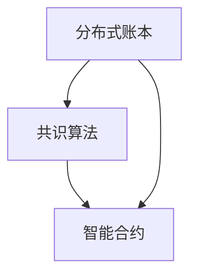

                 

区块链技术作为近年来信息技术领域的重要突破，已经成为金融、供应链、医疗等多个行业的热门话题。本文旨在深入探讨区块链技术的核心概念、算法原理、数学模型以及其实际应用，帮助读者全面理解区块链技术，并掌握去中心化应用（DApp）的开发技巧。

## 关键词

- 区块链
- 去中心化应用
- 分布式账本
- 共识算法
- 智能合约

## 摘要

本文首先介绍了区块链技术的背景和核心概念，包括分布式账本、共识算法和智能合约。接着，我们详细讲解了区块链技术的核心算法原理，并通过具体的操作步骤和案例，展示了区块链技术的数学模型和公式。随后，文章通过代码实例和详细解释，展示了区块链技术在去中心化应用开发中的实践应用。最后，我们探讨了区块链技术的未来应用场景和面临的挑战，为读者提供了丰富的学习和资源推荐。

## 1. 背景介绍

区块链技术起源于比特币的底层技术，由中本聪（Satoshi Nakamoto）在2008年提出。作为一种去中心化的分布式账本系统，区块链通过加密算法和共识机制，实现了一种无需信任的记账方式，解决了传统中心化系统中的信任问题。随着比特币的成功，区块链技术逐渐受到关注，并在金融、供应链、医疗等领域得到广泛应用。

### 1.1 区块链技术的起源

区块链技术的起源可以追溯到2008年，当时中本聪发布了比特币白皮书《比特币：一种点对点的电子现金系统》。在这篇白皮书中，中本聪提出了一个基于加密算法和共识机制的分布式账本系统，即区块链。该系统通过去中心化的方式，解决了传统金融系统中的信任问题，实现了无需第三方中介的电子货币交易。

### 1.2 区块链技术的核心概念

区块链技术的核心概念包括分布式账本、共识算法和智能合约。

1. **分布式账本**：分布式账本是一种去中心化的数据存储方式，通过多个节点共同维护一个统一的账本。每个节点都保存了一份完整的账本副本，从而实现了数据的一致性和透明性。

2. **共识算法**：共识算法是一种决策机制，用于确定区块链上的交易是否有效，并确保所有节点对账本的一致性。常见的共识算法包括工作量证明（PoW）、权益证明（PoS）和授权股权证明（DPoS）等。

3. **智能合约**：智能合约是一种自动执行的合约，基于区块链技术实现。智能合约的执行由预定的规则控制，一旦条件满足，智能合约就会自动执行相应的操作。

## 2. 核心概念与联系

### 2.1 分布式账本

分布式账本是区块链技术的核心概念之一，它通过多个节点共同维护一个统一的账本，从而实现了去中心化的数据存储。在分布式账本中，每个节点都保存了一份完整的账本副本，从而确保了数据的一致性和透明性。

### 2.2 共识算法

共识算法是一种决策机制，用于确定区块链上的交易是否有效，并确保所有节点对账本的一致性。常见的共识算法包括工作量证明（PoW）、权益证明（PoS）和授权股权证明（DPoS）等。

### 2.3 智能合约

智能合约是一种自动执行的合约，基于区块链技术实现。智能合约的执行由预定的规则控制，一旦条件满足，智能合约就会自动执行相应的操作。

### 2.4 Mermaid 流程图

以下是一个简单的 Mermaid 流程图，展示了区块链技术的核心概念和联系。



## 3. 核心算法原理 & 具体操作步骤

### 3.1 算法原理概述

区块链技术的核心算法原理主要包括加密算法、共识算法和智能合约。

- **加密算法**：加密算法用于保护区块链上的数据安全，常见的加密算法包括SHA-256、RSA等。
- **共识算法**：共识算法用于确定区块链上的交易是否有效，并确保所有节点对账本的一致性。
- **智能合约**：智能合约是一种自动执行的合约，基于区块链技术实现，用于实现去中心化应用。

### 3.2 算法步骤详解

#### 3.2.1 加密算法

加密算法的基本步骤如下：

1. 数据加密：使用加密算法对数据进行加密，生成密文。
2. 数据解密：使用解密算法对密文进行解密，恢复原始数据。

#### 3.2.2 共识算法

共识算法的基本步骤如下：

1. 节点广播交易：节点向网络广播交易。
2. 节点验证交易：节点验证交易的有效性。
3. 达成共识：节点通过共识算法达成共识，确定交易是否有效。

#### 3.2.3 智能合约

智能合约的基本步骤如下：

1. 编写合约代码：编写智能合约代码。
2. 部署合约：将智能合约部署到区块链上。
3. 调用合约：通过合约接口调用智能合约，执行相应的操作。

### 3.3 算法优缺点

#### 3.3.1 加密算法

- 优点：数据安全性高，防止数据被篡改和盗用。
- 缺点：加密和解密过程较慢，对计算资源要求较高。

#### 3.3.2 共识算法

- 优点：确保数据一致性，提高系统安全性。
- 缺点：计算资源消耗大，交易确认时间较长。

#### 3.3.3 智能合约

- 优点：自动化执行合约，提高交易效率。
- 缺点：代码一旦发布，难以更改，存在潜在的安全风险。

### 3.4 算法应用领域

区块链技术的核心算法在多个领域具有广泛应用：

- **金融领域**：区块链技术可以用于加密货币、跨境支付、供应链金融等。
- **供应链管理**：区块链技术可以用于供应链溯源、防伪验证等。
- **医疗领域**：区块链技术可以用于病历管理、药品溯源等。
- **物联网**：区块链技术可以用于物联网设备的数据安全和管理。

## 4. 数学模型和公式 & 详细讲解 & 举例说明

### 4.1 数学模型构建

区块链技术中的数学模型主要包括加密算法的数学模型、共识算法的数学模型和智能合约的数学模型。

#### 4.1.1 加密算法的数学模型

加密算法的数学模型主要包括密码学基础和加密算法的设计。密码学基础包括密码学的基本概念、加密算法的分类和密码学协议。加密算法的设计包括对称加密算法和非对称加密算法的设计。

#### 4.1.2 共识算法的数学模型

共识算法的数学模型主要包括博弈论、概率论和图论。博弈论用于分析节点之间的博弈行为，概率论用于分析节点验证交易的过程，图论用于分析区块链网络的结构。

#### 4.1.3 智能合约的数学模型

智能合约的数学模型主要包括形式逻辑和图灵机。形式逻辑用于描述智能合约的执行过程，图灵机用于模拟智能合约的执行。

### 4.2 公式推导过程

以下是一个简单的例子，用于说明加密算法的公式推导过程。

#### 4.2.1 对称加密算法

对称加密算法的公式推导过程如下：

设明文为 \( M \)，密钥为 \( K \)，加密函数为 \( E \)，解密函数为 \( D \)。

1. 加密过程： \( C = E(K, M) \)
2. 解密过程： \( M = D(K, C) \)

其中，\( C \) 为密文，\( M \) 为明文。

#### 4.2.2 非对称加密算法

非对称加密算法的公式推导过程如下：

设私钥为 \( K_d \)，公钥为 \( K_e \)，加密函数为 \( E \)，解密函数为 \( D \)。

1. 加密过程： \( C = E(K_e, M) \)
2. 解密过程： \( M = D(K_d, C) \)

其中，\( C \) 为密文，\( M \) 为明文。

### 4.3 案例分析与讲解

以下是一个简单的案例，用于说明区块链技术在去中心化应用开发中的实际应用。

#### 4.3.1 案例背景

假设有一个去中心化电商平台，用户可以通过区块链技术进行交易。

#### 4.3.2 案例分析

1. **用户注册**：用户通过区块链进行注册，并生成公钥和私钥。
2. **商品发布**：卖家通过区块链发布商品信息。
3. **购买交易**：买家通过区块链进行购买交易，并支付加密货币。
4. **订单确认**：卖家确认订单，并释放加密货币。
5. **评论反馈**：买家对商品进行评论反馈。

#### 4.3.3 案例讲解

1. **用户注册**：用户通过区块链注册，生成公钥和私钥。公钥用于发布信息和验证身份，私钥用于签名和解密信息。

2. **商品发布**：卖家通过区块链发布商品信息，包括商品名称、价格、库存等信息。商品信息经过加密后，存储在区块链上，确保信息的安全和不可篡改性。

3. **购买交易**：买家通过区块链进行购买交易，生成交易订单，并支付加密货币。交易订单包括买家、卖家、商品信息、支付金额等。交易订单经过加密后，存储在区块链上。

4. **订单确认**：卖家通过区块链确认订单，并释放加密货币。卖家收到订单确认通知后，将商品发出。

5. **评论反馈**：买家在收到商品后，通过区块链对商品进行评论反馈。评论信息经过加密后，存储在区块链上。

通过这个案例，我们可以看到区块链技术在去中心化应用开发中的实际应用。区块链技术确保了交易信息的安全和透明，实现了去中心化的交易过程。

## 5. 项目实践：代码实例和详细解释说明

### 5.1 开发环境搭建

在开始区块链项目实践之前，我们需要搭建一个适合开发的环境。以下是搭建开发环境的基本步骤：

1. 安装Go语言：Go语言是一种适合区块链开发的编程语言，可以通过官方网站下载并安装。
2. 安装Node.js：Node.js是一种基于Chrome V8引擎的JavaScript运行环境，可以用于智能合约开发。
3. 安装区块链框架：选择一个适合的区块链框架，如Ethereum或Hyperledger Fabric，并按照框架文档安装。

### 5.2 源代码详细实现

以下是一个简单的智能合约示例，用于实现一个去中心化投票系统。

```solidity
// SPDX-License-Identifier: MIT
pragma solidity ^0.8.0;

contract Voting {
    mapping(address => bool) public voters;
    mapping(bytes32 => mapping(address => bool)) public votesReceived;

    bytes32[] public candidates;

    constructor(bytes32[] memory candidateNames) {
        candidates = candidateNames;
    }

    function giveVote(bytes32 candidate) public {
        require(!voters[msg.sender], "Has already voted.");
        require(bytes32ToString(candidate).length > 0, "Invalid candidate.");
        voters[msg.sender] = true;
        votesReceived[candidate][msg.sender] = true;
    }

    function totalVotesFor(bytes32 candidate) public view returns (uint256 votesCount) {
        require(bytes32ToString(candidate).length > 0, "Invalid candidate.");
        return votesReceived[candidate][msg.sender];
    }

    function bytes32ToString(bytes32 x) private pure returns (string memory) {
        bytes memory bytesString = new bytes(32);
        for (uint256 i = 0; i < 32; i++) {
            byte b = x[i];
            bytesString[i] = b;
        }
        return string(bytesString);
    }
}
```

### 5.3 代码解读与分析

上述代码实现了一个简单的去中心化投票系统，其中涉及以下关键概念：

- **合约结构**：合约定义了投票系统的基本结构，包括候选人和选民。
- **投票函数**：`giveVote` 函数用于接收选民的投票，并标记选民已投票。
- **计票函数**：`totalVotesFor` 函数用于计算某个候选人的总票数。
- **字符串转换函数**：`bytes32ToString` 函数用于将 `bytes32` 类型的候选名转换为字符串，以便在前端进行展示。

### 5.4 运行结果展示

在部署上述智能合约后，我们可以通过前端界面进行投票。前端界面可以显示候选人的列表、已投票状态以及当前总票数。通过区块链上的智能合约，我们可以确保投票过程的安全和透明。

## 6. 实际应用场景

区块链技术在多个领域具有广泛的应用前景。以下是区块链技术的一些实际应用场景：

- **金融领域**：区块链技术可以用于加密货币交易、跨境支付、供应链金融等，提高交易效率，降低交易成本。
- **供应链管理**：区块链技术可以用于供应链溯源、防伪验证等，确保商品的真实性和安全性。
- **医疗领域**：区块链技术可以用于病历管理、药品溯源等，提高医疗数据的共享和透明度。
- **物联网**：区块链技术可以用于物联网设备的数据安全和管理，确保物联网设备的可信性和安全性。

## 7. 工具和资源推荐

为了更好地学习和开发区块链技术，以下是一些推荐的工具和资源：

- **学习资源**：
  - 《区块链技术指南》
  - 《精通区块链》
  - 《区块链开发实战》

- **开发工具**：
  - Ethereum开发环境
  - Hyperledger Fabric开发环境

- **相关论文**：
  - 《区块链：一种点对点的电子现金系统》
  - 《比特币的共识算法分析》
  - 《区块链在供应链管理中的应用研究》

## 8. 总结：未来发展趋势与挑战

### 8.1 研究成果总结

区块链技术作为近年来信息技术领域的重要突破，已经在金融、供应链、医疗等领域得到广泛应用。通过去中心化的分布式账本、共识算法和智能合约，区块链技术实现了数据的安全、透明和高效。

### 8.2 未来发展趋势

区块链技术的未来发展将更加注重跨领域合作、标准化和性能优化。随着技术的不断成熟，区块链技术将在更多领域得到应用，并与其他新兴技术如人工智能、物联网等相结合，实现更广泛的价值。

### 8.3 面临的挑战

区块链技术在实际应用中仍面临一些挑战，如性能瓶颈、隐私保护、法律法规等。为了应对这些挑战，需要进一步优化区块链技术，加强跨领域合作，并完善相关法律法规。

### 8.4 研究展望

区块链技术作为一种新兴技术，具有广泛的应用前景。未来研究将重点关注区块链技术在各个领域的应用，并探索与其他技术的融合，实现更高效、更安全的去中心化应用。

## 9. 附录：常见问题与解答

### 9.1 区块链技术是什么？

区块链技术是一种去中心化的分布式账本系统，通过加密算法和共识机制实现数据的安全、透明和高效。

### 9.2 区块链技术有哪些应用场景？

区块链技术在金融、供应链、医疗、物联网等领域具有广泛的应用场景，如加密货币交易、跨境支付、供应链溯源、病历管理、物联网设备管理等。

### 9.3 区块链技术有哪些优点？

区块链技术的优点包括数据安全、透明、高效、去中心化等，可以有效降低交易成本、提高数据共享和透明度。

### 9.4 区块链技术有哪些挑战？

区块链技术在实际应用中面临一些挑战，如性能瓶颈、隐私保护、法律法规等。需要进一步优化技术、加强跨领域合作和完善法律法规。

## 作者署名

作者：禅与计算机程序设计艺术 / Zen and the Art of Computer Programming

