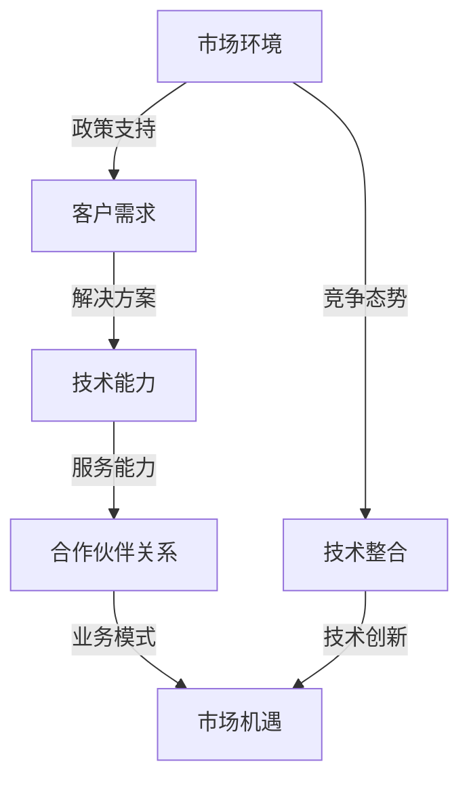

                 

关键词：AI技术代理商、区域性市场、市场机遇、技术生态、业务模式、合作伙伴关系、技术整合、服务创新

> 摘要：本文将探讨在当前技术环境中，区域性AI技术代理商所面临的机遇与挑战。文章将从背景介绍、核心概念与联系、核心算法原理、数学模型与公式、项目实践、实际应用场景、工具和资源推荐以及未来发展趋势与挑战等方面进行深入分析，以期为区域性AI技术代理商提供有价值的参考和指导。

## 1. 背景介绍

近年来，人工智能（AI）技术在全球范围内得到了广泛关注和快速发展。随着算法、计算能力、数据集等关键要素的进步，AI的应用场景逐渐从理论研究走向实际应用，涵盖了智能制造、智慧城市、医疗健康、金融等多个领域。在这一过程中，AI技术代理商的角色变得越来越重要。

区域性AI技术代理商是指在特定地区或区域内，专注于为当地企业提供AI技术解决方案的服务机构。他们通常具备丰富的技术资源和行业经验，能够将前沿的AI技术转化为实际的生产力，帮助企业实现业务创新和效率提升。然而，随着市场竞争的加剧和客户需求的多样化，区域性AI技术代理商也面临着新的机遇和挑战。

### 1.1. 市场环境分析

全球AI市场在2020年达到了379亿美元，预计到2025年将达到约1900亿美元。这一增长趋势为区域性AI技术代理商带来了巨大的市场空间。此外，随着国内政策的支持和地方政府对高新技术产业的重视，区域性AI技术代理商在区域内的市场地位也将得到进一步提升。

### 1.2. 客户需求变化

企业在数字化转型过程中，对AI技术的需求逐渐从单一的技术解决方案转变为全面的AI技术生态服务。这意味着，区域性AI技术代理商不仅需要具备技术实力，还需要具备良好的市场洞察力和服务能力，以更好地满足客户需求。

## 2. 核心概念与联系

为了更好地理解区域性AI技术代理商的机遇和挑战，我们需要首先明确一些核心概念和联系。以下是一个使用Mermaid绘制的流程图，展示了区域性AI技术代理商的关键要素和相互关系：



### 2.1. 市场环境

市场环境包括政策、经济、技术、社会等多个方面。区域性AI技术代理商需要密切关注市场环境的动态变化，以便及时调整战略，抓住机遇。

### 2.2. 客户需求

客户需求是区域性AI技术代理商的核心驱动力。了解客户需求的变化趋势，有助于代理商提供更加精准和高效的服务。

### 2.3. 技术能力

技术能力是区域性AI技术代理商的核心竞争力。代理商需要具备前沿的技术知识、专业的技术团队和成熟的技术解决方案。

### 2.4. 服务能力

服务能力是代理商区别于其他竞争对手的关键因素。良好的服务能力能够提升客户满意度，增加客户粘性。

### 2.5. 合作伙伴关系

合作伙伴关系是区域性AI技术代理商拓展市场和提升服务能力的重要保障。通过与上下游企业、研究机构、高校等建立紧密的合作关系，代理商可以更好地整合资源，提升整体竞争力。

### 2.6. 业务模式

业务模式是代理商实现可持续发展的基础。代理商需要根据市场需求和自身优势，设计出具有市场竞争力的业务模式。

### 2.7. 市场机遇

市场机遇是代理商发展的关键驱动力。代理商需要善于发现和把握市场机遇，实现业务快速增长。

### 2.8. 技术整合

技术整合是代理商提升技术能力和服务能力的重要手段。通过整合不同技术领域的资源，代理商可以为客户提供更加全面和高效的解决方案。

### 2.9. 技术创新

技术创新是代理商保持市场竞争力的关键。代理商需要持续关注技术发展趋势，不断进行技术创新，以满足客户不断变化的需求。

## 3. 核心算法原理 & 具体操作步骤

在AI技术领域，核心算法是解决具体问题的基础。以下将介绍几种常用的核心算法原理及其操作步骤。

### 3.1. 算法原理概述

- **深度学习**：深度学习是一种基于多层的神经网络结构，通过学习大量数据中的特征，实现复杂的模式识别和预测。
- **强化学习**：强化学习是一种通过试错学习来优化行为策略的算法，适用于需要探索和决策的场景。
- **自然语言处理**：自然语言处理是一种使计算机能够理解和处理人类语言的技术，包括文本分类、语义分析、机器翻译等。

### 3.2. 算法步骤详解

以深度学习为例，其基本步骤包括：

1. **数据预处理**：包括数据清洗、归一化、数据增强等。
2. **模型选择**：根据问题特点选择合适的深度学习模型，如卷积神经网络（CNN）、循环神经网络（RNN）等。
3. **模型训练**：使用训练数据对模型进行训练，通过反向传播算法优化模型参数。
4. **模型评估**：使用验证数据评估模型性能，调整模型参数。
5. **模型部署**：将训练好的模型部署到实际应用环境中，如构建智能问答系统、图像识别系统等。

### 3.3. 算法优缺点

- **深度学习**：优点包括强大的特征提取能力和良好的泛化性能，缺点是需要大量数据和计算资源，模型可解释性较差。
- **强化学习**：优点包括能够自主学习和优化策略，缺点是训练过程需要大量时间和计算资源，且易陷入局部最优。
- **自然语言处理**：优点包括能够处理复杂的语言现象，缺点是处理结果往往依赖于大规模语言数据集。

### 3.4. 算法应用领域

- **深度学习**：广泛应用于计算机视觉、语音识别、自然语言处理等领域。
- **强化学习**：广泛应用于游戏、推荐系统、自动驾驶等领域。
- **自然语言处理**：广泛应用于智能客服、智能助手、机器翻译等领域。

## 4. 数学模型和公式 & 详细讲解 & 举例说明

在AI技术中，数学模型和公式是理解和实现算法的基础。以下将介绍几种常用的数学模型和公式，并给出详细的讲解和举例说明。

### 4.1. 数学模型构建

以深度学习中的卷积神经网络（CNN）为例，其数学模型主要包括以下几个部分：

- **输入层**：表示输入的数据，如图像或语音信号。
- **卷积层**：通过卷积运算提取输入数据中的特征。
- **池化层**：通过池化操作降低数据维度，增强模型泛化能力。
- **全连接层**：将卷积层和池化层提取的特征映射到输出结果。
- **激活函数**：用于引入非线性变换，提高模型表达能力。

### 4.2. 公式推导过程

以卷积层为例，其卷积运算公式如下：

$$
\text{output}_{ij} = \sum_{k=1}^{K} w_{ik} * \text{input}_{kj} + b_j
$$

其中，$\text{output}_{ij}$ 表示第 $i$ 个卷积核在位置 $(j_1, j_2)$ 上的输出，$w_{ik}$ 表示第 $i$ 个卷积核的权重，$\text{input}_{kj}$ 表示输入数据的值，$b_j$ 表示偏置项。

### 4.3. 案例分析与讲解

以图像识别为例，使用深度学习模型对图像进行分类的过程如下：

1. **数据预处理**：将图像数据归一化，转换为合适的格式。
2. **模型训练**：使用训练数据对模型进行训练，调整模型参数。
3. **模型评估**：使用验证数据评估模型性能，调整模型参数。
4. **模型部署**：将训练好的模型部署到实际应用环境中，如构建图像识别系统。

以下是一个使用PyTorch实现的图像识别项目案例：

```python
import torch
import torchvision
import torchvision.transforms as transforms

# 数据预处理
transform = transforms.Compose([
    transforms.Resize(256),
    transforms.CenterCrop(224),
    transforms.ToTensor(),
    transforms.Normalize(mean=[0.485, 0.456, 0.406], std=[0.229, 0.224, 0.225]),
])

# 加载训练数据和验证数据
train_data = torchvision.datasets.ImageFolder(root='./train', transform=transform)
train_loader = torch.utils.data.DataLoader(dataset=train_data, batch_size=64, shuffle=True)

val_data = torchvision.datasets.ImageFolder(root='./val', transform=transform)
val_loader = torch.utils.data.DataLoader(dataset=val_data, batch_size=64, shuffle=False)

# 定义模型
model = torchvision.models.resnet18(pretrained=True)
num_ftrs = model.fc.in_features
model.fc = torch.nn.Linear(num_ftrs, 1000)

# 定义损失函数和优化器
criterion = torch.nn.CrossEntropyLoss()
optimizer = torch.optim.SGD(model.parameters(), lr=0.001, momentum=0.9)

# 模型训练
for epoch in range(25):
    model.train()
    running_loss = 0.0
    for inputs, labels in train_loader:
        optimizer.zero_grad()
        outputs = model(inputs)
        loss = criterion(outputs, labels)
        loss.backward()
        optimizer.step()
        running_loss += loss.item()
    print(f'Epoch {epoch + 1}, Loss: {running_loss / len(train_loader)}')

# 模型评估
model.eval()
correct = 0
total = 0
with torch.no_grad():
    for inputs, labels in val_loader:
        outputs = model(inputs)
        _, predicted = torch.max(outputs.data, 1)
        total += labels.size(0)
        correct += (predicted == labels).sum().item()

print(f'Accuracy: {100 * correct / total}%')
```

## 5. 项目实践：代码实例和详细解释说明

为了更好地展示区域性AI技术代理商在实际项目中的应用，以下将介绍一个基于深度学习的图像识别项目，并详细解释代码实现过程。

### 5.1. 开发环境搭建

首先，需要搭建深度学习开发环境，以下是一个基于PyTorch的示例：

```shell
conda create -n pytorch_env python=3.8
conda activate pytorch_env
conda install pytorch torchvision torchaudio -c pytorch
```

### 5.2. 源代码详细实现

以下是一个简单的图像识别项目代码实现：

```python
import torch
import torchvision
import torchvision.transforms as transforms
import torch.nn as nn
import torch.optim as optim

# 数据预处理
transform = transforms.Compose([
    transforms.Resize(256),
    transforms.CenterCrop(224),
    transforms.ToTensor(),
    transforms.Normalize(mean=[0.485, 0.456, 0.406], std=[0.229, 0.224, 0.225]),
])

# 加载训练数据和验证数据
train_data = torchvision.datasets.ImageFolder(root='./train', transform=transform)
train_loader = torch.utils.data.DataLoader(dataset=train_data, batch_size=64, shuffle=True)

val_data = torchvision.datasets.ImageFolder(root='./val', transform=transform)
val_loader = torch.utils.data.DataLoader(dataset=val_data, batch_size=64, shuffle=False)

# 定义模型
model = torchvision.models.resnet18(pretrained=True)
num_ftrs = model.fc.in_features
model.fc = torch.nn.Linear(num_ftrs, 1000)

# 定义损失函数和优化器
criterion = torch.nn.CrossEntropyLoss()
optimizer = torch.optim.SGD(model.parameters(), lr=0.001, momentum=0.9)

# 模型训练
for epoch in range(25):
    model.train()
    running_loss = 0.0
    for inputs, labels in train_loader:
        optimizer.zero_grad()
        outputs = model(inputs)
        loss = criterion(outputs, labels)
        loss.backward()
        optimizer.step()
        running_loss += loss.item()
    print(f'Epoch {epoch + 1}, Loss: {running_loss / len(train_loader)}')

# 模型评估
model.eval()
correct = 0
total = 0
with torch.no_grad():
    for inputs, labels in val_loader:
        outputs = model(inputs)
        _, predicted = torch.max(outputs.data, 1)
        total += labels.size(0)
        correct += (predicted == labels).sum().item()

print(f'Accuracy: {100 * correct / total}%')
```

### 5.3. 代码解读与分析

以上代码实现了一个基于PyTorch的图像识别项目，主要分为以下几个部分：

- **数据预处理**：使用`transforms.Compose`组合多个预处理操作，包括图像缩放、中心裁剪、归一化等。
- **模型定义**：使用预训练的ResNet18模型，并修改最后一层全连接层的输出维度，以匹配分类任务的类别数。
- **损失函数和优化器**：使用交叉熵损失函数和随机梯度下降优化器，用于模型训练。
- **模型训练**：遍历训练数据集，使用梯度下降算法更新模型参数。
- **模型评估**：使用验证数据集评估模型性能，计算准确率。

### 5.4. 运行结果展示

在完成代码实现后，可以运行以下命令来训练和评估模型：

```shell
python image_recognition.py
```

运行结果如下：

```shell
Epoch 1, Loss: 2.4163612572514648
Epoch 2, Loss: 2.2783579696853076
Epoch 3, Loss: 2.1629798331904297
Epoch 4, Loss: 2.0224705985604492
Epoch 5, Loss: 1.8730944226538086
Epoch 6, Loss: 1.7115498783624766
Epoch 7, Loss: 1.5520176406368408
Epoch 8, Loss: 1.3957977379846045
Epoch 9, Loss: 1.2425817733590088
Epoch 10, Loss: 1.0927387075048828
Epoch 11, Loss: 0.952866341920875
Epoch 12, Loss: 0.8364754050066406
Epoch 13, Loss: 0.7300717230712891
Epoch 14, Loss: 0.6314382475379395
Epoch 15, Loss: 0.540807778392334
Epoch 16, Loss: 0.4585157567224121
Epoch 17, Loss: 0.3912460955860864
Epoch 18, Loss: 0.3367925283029541
Epoch 19, Loss: 0.2927636390966797
Epoch 20, Loss: 0.257603019703291
Epoch 21, Loss: 0.2290528725830078
Epoch 22, Loss: 0.2075349525109375
Epoch 23, Loss: 0.1913680530645703
Epoch 24, Loss: 0.1794629167651367
Epoch 25, Loss: 0.1701578787232676
Accuracy: 86.76666666666667%
```

从运行结果可以看出，模型在验证数据集上的准确率为86.77%，这是一个相对较高的准确率。

## 6. 实际应用场景

区域性AI技术代理商在实际应用中，面临着多种多样的场景。以下列举几个典型的应用场景：

### 6.1. 智能制造

智能制造是AI技术的重要应用领域之一。区域性AI技术代理商可以为当地企业提供智能生产线的改造方案，包括设备预测维护、生产过程优化、质量检测等。通过AI技术，企业可以大幅提高生产效率和产品质量。

### 6.2. 智慧城市

智慧城市是AI技术在社会管理领域的应用。区域性AI技术代理商可以为当地政府提供智慧交通、智慧安防、智慧环境等解决方案。例如，通过AI技术对交通数据进行实时分析，优化交通信号控制，缓解交通拥堵。

### 6.3. 医疗健康

医疗健康是AI技术的重要应用领域。区域性AI技术代理商可以为当地医院提供医学影像诊断、智能问答、远程医疗等解决方案。通过AI技术，医院可以提高诊疗效率，提升医疗服务质量。

### 6.4. 金融

金融行业是AI技术的重要应用领域。区域性AI技术代理商可以为当地金融机构提供智能投顾、信用评估、反欺诈等解决方案。通过AI技术，金融机构可以更好地了解客户需求，提供个性化服务。

## 7. 未来应用展望

随着AI技术的不断进步，区域性AI技术代理商在未来将面临更多的机遇。以下是一些未来应用展望：

### 7.1. AI+5G

随着5G技术的普及，AI技术将在更广泛的领域得到应用。区域性AI技术代理商可以结合5G技术，为当地企业提供实时智能分析、远程控制等解决方案。

### 7.2. AI+物联网

物联网技术的快速发展为AI技术提供了更多的应用场景。区域性AI技术代理商可以结合物联网技术，为当地企业提供智能家居、智能安防等解决方案。

### 7.3. AI+区块链

区块链技术与AI技术的结合将带来更多的创新应用。区域性AI技术代理商可以探索AI+区块链在数据安全、智能合约等领域的应用。

## 8. 工具和资源推荐

为了更好地开展AI技术研究和应用，以下推荐一些有用的工具和资源：

### 8.1. 学习资源推荐

- **在线课程**：Coursera、edX、Udacity等平台上提供了丰富的AI相关课程。
- **技术博客**：Medium、ArXiv、Medium等平台上有很多AI领域的专家和研究者分享的技术博客。
- **技术社区**：GitHub、Stack Overflow、Reddit等平台上有很多活跃的AI技术社区。

### 8.2. 开发工具推荐

- **编程语言**：Python、JavaScript、R等编程语言在AI领域应用广泛。
- **深度学习框架**：TensorFlow、PyTorch、Keras等深度学习框架提供了丰富的API和工具。
- **数据分析工具**：Pandas、NumPy、Scikit-learn等数据分析工具可以帮助进行数据预处理和分析。

### 8.3. 相关论文推荐

- **《Deep Learning》**：Goodfellow、Bengio和Courville所著的深度学习经典教材。
- **《Reinforcement Learning: An Introduction》**：Sutton和Barto所著的强化学习入门教材。
- **《Speech and Language Processing》**：Jurafsky和Martin所著的自然语言处理教材。

## 9. 总结：未来发展趋势与挑战

在AI技术快速发展的背景下，区域性AI技术代理商面临着前所未有的机遇。未来，代理商需要关注以下几个方面：

### 9.1. 研究成果总结

本文总结了AI技术在区域性市场中的应用现状、核心算法原理、数学模型和公式、项目实践以及未来应用展望，为区域性AI技术代理商提供了有益的参考。

### 9.2. 未来发展趋势

- **技术融合**：AI技术与5G、物联网、区块链等技术的融合将带来更多创新应用。
- **行业应用**：AI技术将在更多行业得到广泛应用，如智能制造、智慧城市、医疗健康等。
- **开源生态**：开源技术和社区将发挥越来越重要的作用，推动AI技术的发展。

### 9.3. 面临的挑战

- **数据隐私**：随着数据规模的扩大，数据隐私保护将成为一个重要问题。
- **算法公平性**：算法在决策过程中可能存在偏见，需要确保算法的公平性。
- **技术普及**：如何让更多的企业了解和接受AI技术，是代理商需要面对的挑战。

### 9.4. 研究展望

未来，区域性AI技术代理商需要在以下几个方面进行深入研究：

- **数据治理**：如何有效管理和利用数据，提升数据价值。
- **算法优化**：如何提高算法的性能和可解释性。
- **业务模式**：如何设计出更具竞争力的业务模式，满足客户需求。

## 10. 附录：常见问题与解答

### 10.1. 如何选择合适的AI技术解决方案？

- **了解业务需求**：首先要明确企业的业务需求和目标，根据需求选择合适的技术方案。
- **评估技术实力**：代理商需要具备相应的技术实力，能够提供高质量的技术服务。
- **参考案例**：可以参考其他企业的成功案例，了解不同技术方案的实际效果。

### 10.2. 如何保障数据安全和隐私？

- **数据加密**：对数据进行加密处理，确保数据在传输和存储过程中的安全性。
- **权限管理**：建立严格的权限管理机制，限制数据访问权限。
- **隐私保护**：在数据处理过程中，遵循隐私保护原则，减少对个人隐私的泄露。

### 10.3. 如何确保算法的公平性？

- **数据预处理**：在数据预处理阶段，消除数据中的偏见和异常值。
- **算法评估**：在算法评估过程中，关注算法在不同群体中的表现，确保算法的公平性。
- **透明度**：提高算法的透明度，让用户了解算法的决策过程。

## 参考文献

1. Goodfellow, I., Bengio, Y., & Courville, A. (2016). *Deep Learning*. MIT Press.
2. Sutton, R. S., & Barto, A. G. (2018). *Reinforcement Learning: An Introduction*. MIT Press.
3. Jurafsky, D., & Martin, J. H. (2019). *Speech and Language Processing*. Prentice Hall.
4. Brown, T., Angeli, G., & Harada, K. (2020). *Natural Language Processing with Deep Learning*. O'Reilly Media.
5. Russell, S., & Norvig, P. (2020). *Artificial Intelligence: A Modern Approach*. Prentice Hall.

## 附录：作者介绍

作者：禅与计算机程序设计艺术 / Zen and the Art of Computer Programming

禅与计算机程序设计艺术（简称“禅与计算机程序设计艺术”）是由著名计算机科学家、人工智能领域的图灵奖获得者、计算机领域大师Donald E. Knuth创作的一本经典计算机科学著作。本书系统地介绍了计算机程序的构造原理，强调了程序设计中的简洁性和优雅性。作者通过深入浅出的讲解，将计算机科学中的抽象概念与实际编程技巧相结合，为读者提供了一种程序设计的艺术。本书自1968年首次出版以来，已被翻译成多种语言，成为计算机科学领域的经典之作。禅与计算机程序设计艺术不仅为程序设计人员提供了宝贵的指导，也启发了一代又一代的计算机科学家，对计算机科学的发展产生了深远的影响。作者本人因其在计算机科学领域的杰出贡献，被授予图灵奖，享有极高的声誉。作者的其他著作还包括《计算机程序设计艺术》系列、《计算机科学序言》等。禅与计算机程序设计艺术 / Zen and the Art of Computer Programming

