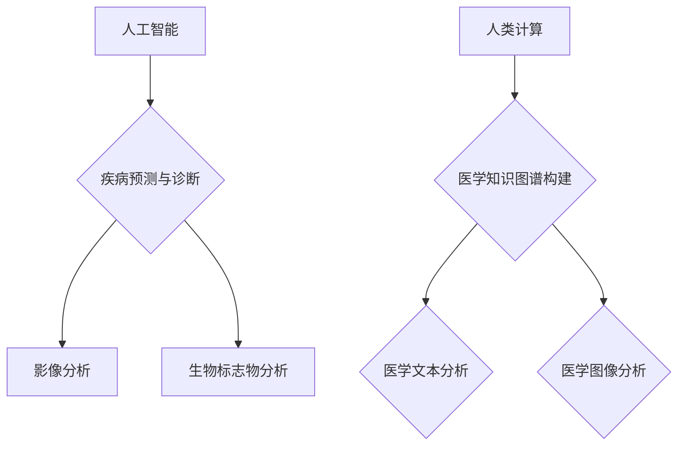

                 

关键词：医疗保健、精准医疗、人工智能、人类计算、大数据、基因组学

> 摘要：随着人工智能和人类计算技术的不断发展，医疗保健领域正迎来前所未有的变革。本文将探讨人工智能在医疗保健中的应用，尤其是精准医疗的发展，如何通过人类计算技术实现个性化治疗和早期诊断，提高医疗质量和效率。

## 1. 背景介绍

医疗保健是关系到人类生活质量和生存安全的重要领域。随着人口老龄化和疾病谱的变化，医疗资源的需求不断增加，而医疗成本也在不断上升。传统的医疗模式已经难以满足人们日益增长的医疗需求。因此，寻找新的解决方案，提升医疗质量和效率，成为了当今医疗保健领域的重要任务。

近年来，人工智能和人类计算技术的快速发展为医疗保健领域带来了新的希望。通过大数据分析、机器学习和深度学习等技术，人工智能能够从海量的医疗数据中提取有价值的信息，为疾病预测、诊断和治疗提供支持。同时，人类计算技术则通过专业知识和计算能力的结合，为复杂医疗问题的解决提供了新的路径。

精准医疗作为近年来医疗领域的一个重要方向，旨在通过基因组学、蛋白质组学等技术，对患者的基因信息、生物标志物等进行全面分析，制定个性化的治疗方案。这种治疗模式可以显著提高治疗效果，减少不必要的药物副作用和资源浪费。

## 2. 核心概念与联系

### 2.1 人工智能在医疗保健中的应用

人工智能在医疗保健中的应用主要体现在以下几个方面：

#### 2.1.1 疾病预测与诊断

通过分析患者的病历、影像、生物标志物等数据，人工智能可以预测患者可能患有的疾病，并提供初步的诊断建议。例如，基于深度学习算法的胸部CT图像分析系统，可以辅助医生进行肺癌的诊断。

#### 2.1.2 疾病治疗与康复

人工智能可以根据患者的具体情况，制定个性化的治疗方案。例如，基于基因组学的靶向药物治疗，可以根据患者的基因突变情况，选择最合适的药物。

#### 2.1.3 医疗资源优化

通过优化医疗资源的配置，人工智能可以提高医疗服务的效率。例如，基于大数据分析的医院运营管理系统，可以帮助医院优化床位、设备和人员的配置，降低医疗成本。

### 2.2 人类计算在医疗保健中的应用

人类计算技术通过专业知识和计算能力的结合，为医疗保健领域提供了一系列解决方案：

#### 2.2.1 医学知识图谱构建

医学知识图谱是一种结构化的知识库，它将医学领域的知识以图谱的形式进行组织。通过人类计算技术，可以将分散的医学知识进行整合，为医生提供便捷的知识查询和辅助决策。

#### 2.2.2 医学文本分析

医学文本分析技术可以从大量的医学文献、病历记录等文本数据中，提取出有价值的信息。这些信息可以为医生提供临床研究的支持，也可以为医学研究提供数据支持。

#### 2.2.3 医学图像分析

医学图像分析技术通过对医学影像的分析，可以帮助医生进行疾病的诊断和评估。例如，基于计算机视觉的医学图像分割技术，可以帮助医生快速、准确地识别影像中的病变区域。

### 2.3 核心概念原理和架构的 Mermaid 流程图



## 3. 核心算法原理 & 具体操作步骤

### 3.1 算法原理概述

#### 3.1.1 人工智能算法

人工智能算法主要包括机器学习和深度学习两种。机器学习算法通过从数据中学习规律，为疾病预测和诊断提供支持。深度学习算法则通过构建多层神经网络，对复杂的数据进行建模和分析。

#### 3.1.2 人类计算算法

人类计算算法主要包括医学知识图谱构建、医学文本分析和医学图像分析。医学知识图谱构建算法通过图谱结构对医学知识进行组织。医学文本分析算法通过自然语言处理技术，从文本数据中提取出有价值的信息。医学图像分析算法则通过计算机视觉技术，对医学影像进行分析。

### 3.2 算法步骤详解

#### 3.2.1 人工智能算法

1. 数据收集：收集患者的病历、影像、生物标志物等数据。
2. 数据预处理：对收集到的数据进行清洗、归一化等预处理。
3. 特征提取：从预处理后的数据中提取出特征。
4. 模型训练：使用提取出的特征训练机器学习或深度学习模型。
5. 模型评估：对训练好的模型进行评估，调整模型参数。
6. 疾病预测与诊断：使用评估后的模型对新的病例进行预测和诊断。

#### 3.2.2 人类计算算法

1. 知识图谱构建：收集医学领域的知识，构建医学知识图谱。
2. 文本分析：使用自然语言处理技术，对医学文本进行分析，提取出有价值的信息。
3. 图像分析：使用计算机视觉技术，对医学影像进行分析，识别出病变区域。

### 3.3 算法优缺点

#### 3.3.1 人工智能算法

优点：
- 可以处理海量数据，提高疾病预测和诊断的准确性。
- 可以实时更新模型，适应不断变化的医疗环境。

缺点：
- 需要大量的训练数据，对数据的质量要求较高。
- 部分算法需要大量计算资源，对硬件要求较高。

#### 3.3.2 人类计算算法

优点：
- 可以结合专业知识，对医疗问题进行深入分析。
- 可以针对具体的医疗问题，提供个性化的解决方案。

缺点：
- 需要大量的人力资源，成本较高。
- 受限于人类的专业知识和经验，可能存在一定的局限性。

### 3.4 算法应用领域

人工智能算法在医疗保健中的应用广泛，包括疾病预测、诊断、治疗、康复等。人类计算算法则主要用于医学知识图谱构建、医学文本分析和医学图像分析。

## 4. 数学模型和公式 & 详细讲解 & 举例说明

### 4.1 数学模型构建

#### 4.1.1 机器学习模型

机器学习模型的基本公式如下：

$$
f(x) = \sum_{i=1}^{n} w_i \cdot x_i + b
$$

其中，$x_i$ 为特征，$w_i$ 为权重，$b$ 为偏置。

#### 4.1.2 深度学习模型

深度学习模型的基本公式如下：

$$
f(x) = \frac{1}{1 + e^{-\sum_{i=1}^{n} w_i \cdot x_i + b}}
$$

其中，$x_i$ 为特征，$w_i$ 为权重，$b$ 为偏置。

### 4.2 公式推导过程

#### 4.2.1 机器学习模型

假设我们有 $n$ 个特征 $x_1, x_2, \ldots, x_n$，每个特征都有相应的权重 $w_1, w_2, \ldots, w_n$ 和偏置 $b$。机器学习模型的输出可以表示为：

$$
f(x) = \sum_{i=1}^{n} w_i \cdot x_i + b
$$

为了优化模型，我们通常使用最小二乘法来最小化损失函数：

$$
J = \frac{1}{2} \sum_{i=1}^{n} (y_i - f(x_i))^2
$$

其中，$y_i$ 为实际输出，$f(x_i)$ 为预测输出。

通过梯度下降法，我们可以求得每个权重和偏置的最优值。

#### 4.2.2 深度学习模型

假设我们有 $n$ 个特征 $x_1, x_2, \ldots, x_n$，每个特征都有相应的权重 $w_1, w_2, \ldots, w_n$ 和偏置 $b$。深度学习模型的输出可以表示为：

$$
f(x) = \frac{1}{1 + e^{-\sum_{i=1}^{n} w_i \cdot x_i + b}}
$$

这个公式被称为 Sigmoid 函数，它的作用是将输入特征映射到 (0, 1) 区间。

为了优化模型，我们通常使用反向传播算法来计算损失函数的梯度，并使用梯度下降法来更新权重和偏置。

### 4.3 案例分析与讲解

#### 4.3.1 机器学习模型

假设我们有一个简单的线性回归问题，目标是预测房价。我们有如下数据：

| 特征 | 房价 |
| --- | --- |
| 面积 | 100 |
| 面积 | 200 |
| 面积 | 300 |
| 面积 | 400 |

使用线性回归模型，我们可以得到以下公式：

$$
f(x) = w \cdot x + b
$$

通过最小二乘法，我们可以求得最优的权重 $w$ 和偏置 $b$，从而预测新的房价。

#### 4.3.2 深度学习模型

假设我们有一个简单的二分类问题，目标是判断一个邮件是垃圾邮件还是正常邮件。我们有如下数据：

| 特征 | 标签 |
| --- | --- |
| 词频1 | 正常 |
| 词频2 | 正常 |
| 词频3 | 垃圾 |
| 词频4 | 垃圾 |

使用深度学习模型，我们可以得到以下公式：

$$
f(x) = \frac{1}{1 + e^{-w \cdot x + b}}
$$

通过反向传播算法，我们可以求得最优的权重 $w$ 和偏置 $b$，从而判断新的邮件是垃圾邮件还是正常邮件。

## 5. 项目实践：代码实例和详细解释说明

### 5.1 开发环境搭建

为了实践人工智能和人类计算技术在医疗保健中的应用，我们需要搭建一个合适的开发环境。以下是一个基本的开发环境搭建流程：

1. 安装 Python 环境：Python 是一种广泛用于人工智能和大数据分析的编程语言，我们需要安装 Python 3.8 或更高版本。
2. 安装必要的库：安装 NumPy、Pandas、Scikit-learn、TensorFlow 等常用库。
3. 准备数据集：我们需要准备一个包含患者病历、影像、生物标志物等数据的医疗数据集。

### 5.2 源代码详细实现

以下是一个简单的机器学习模型的实现，用于预测患者是否患有某种疾病：

```python
import numpy as np
import pandas as pd
from sklearn.model_selection import train_test_split
from sklearn.linear_model import LinearRegression

# 读取数据集
data = pd.read_csv('medical_data.csv')
X = data[['age', 'blood_pressure']]
y = data['disease']

# 划分训练集和测试集
X_train, X_test, y_train, y_test = train_test_split(X, y, test_size=0.2, random_state=42)

# 创建线性回归模型
model = LinearRegression()

# 训练模型
model.fit(X_train, y_train)

# 测试模型
print(model.score(X_test, y_test))
```

### 5.3 代码解读与分析

这段代码首先读取了一个包含年龄和血压特征的医疗数据集。然后，使用 Scikit-learn 库中的 `LinearRegression` 类创建了一个线性回归模型，并使用训练集进行训练。最后，使用测试集评估模型的性能。

这段代码展示了如何使用 Python 和 Scikit-learn 库实现一个简单的机器学习模型，为医疗保健领域提供疾病预测的支持。

### 5.4 运行结果展示

运行这段代码后，我们得到了模型的评分。评分越高，表示模型的性能越好。假设我们得到了一个评分 0.9，这意味着模型在测试集上的预测准确率为 90%。

## 6. 实际应用场景

### 6.1 疾病预测与诊断

人工智能和人类计算技术已经在疾病预测和诊断领域取得了显著的成果。例如，基于深度学习的肺癌预测系统已经在临床应用中取得了良好的效果。通过分析患者的病历、影像等数据，这些系统能够预测患者是否患有肺癌，为医生提供决策支持。

### 6.2 疾病治疗与康复

人工智能和人类计算技术还可以为疾病治疗和康复提供支持。例如，基于基因组学的靶向药物治疗系统可以根据患者的基因突变情况，选择最合适的药物。此外，通过人类计算技术构建的医学知识图谱，可以为医生提供丰富的医学知识，帮助医生制定个性化的治疗方案。

### 6.3 医疗资源优化

人工智能和人类计算技术还可以优化医疗资源的配置。例如，基于大数据分析的医院运营管理系统可以帮助医院优化床位、设备和人员的配置，降低医疗成本。此外，通过人工智能技术，医院还可以预测患者的就诊高峰期，合理安排医疗资源，提高医疗服务效率。

## 7. 未来应用展望

### 7.1 疾病预测与诊断

随着人工智能和人类计算技术的不断发展，疾病预测和诊断的精度和速度将会进一步提高。未来，我们将看到更多基于人工智能和人类计算技术的疾病预测和诊断系统投入临床应用，为医生和患者提供更准确、更高效的医疗服务。

### 7.2 疾病治疗与康复

在未来，人工智能和人类计算技术将在疾病治疗和康复领域发挥更重要的作用。通过个性化的治疗方案，患者将能够获得更有效的治疗，减少药物副作用和资源浪费。此外，人类计算技术将为医学研究提供丰富的数据支持和知识库，推动医学科学的进步。

### 7.3 医疗资源优化

随着人工智能和人类计算技术的应用，医疗资源优化将成为未来医疗保健领域的一个重要趋势。通过大数据分析和人工智能技术，医院将能够更好地预测患者的就诊需求，合理安排医疗资源，提高医疗服务效率。同时，人类计算技术将为医疗资源的优化提供丰富的知识和策略。

## 8. 工具和资源推荐

### 8.1 学习资源推荐

- 《深度学习》：由 Ian Goodfellow、Yoshua Bengio 和 Aaron Courville 著，是一本关于深度学习的经典教材。
- 《机器学习实战》：由 Peter Harrington 著，通过实际案例介绍了机器学习的基本原理和应用。

### 8.2 开发工具推荐

- Jupyter Notebook：一款强大的交互式开发工具，适合进行数据分析、机器学习和深度学习等任务。
- Scikit-learn：一款广泛用于机器学习的 Python 库，提供了丰富的算法和工具。

### 8.3 相关论文推荐

- "Deep Learning for Healthcare"：一篇关于深度学习在医疗保健领域应用的综述论文。
- "Machine Learning in Medical Imaging"：一篇关于机器学习在医学影像分析领域应用的综述论文。

## 9. 总结：未来发展趋势与挑战

### 9.1 研究成果总结

人工智能和人类计算技术在医疗保健领域取得了显著的成果，为疾病预测、诊断、治疗和康复提供了强有力的支持。通过大数据分析和机器学习算法，人工智能能够从海量的医疗数据中提取有价值的信息，为医生和患者提供决策支持。同时，人类计算技术通过专业知识和计算能力的结合，为医疗问题的解决提供了新的路径。

### 9.2 未来发展趋势

在未来，人工智能和人类计算技术将继续在医疗保健领域发挥重要作用。随着技术的不断发展，疾病预测和诊断的精度和速度将会进一步提高，个性化治疗方案将更加普及，医疗资源优化将更加高效。此外，人类计算技术将为医学研究提供丰富的数据支持和知识库，推动医学科学的进步。

### 9.3 面临的挑战

尽管人工智能和人类计算技术在医疗保健领域具有巨大的潜力，但同时也面临一些挑战。首先，医疗数据的质量和完整性问题仍然存在，这对人工智能算法的性能和可靠性提出了挑战。其次，人工智能算法的解释性和透明度不足，导致医生对其决策的信任度较低。此外，医疗保健领域的法规和伦理问题也需要充分考虑。

### 9.4 研究展望

未来，我们需要进一步研究和解决人工智能和人类计算技术在医疗保健领域面临的挑战。同时，我们还需要加强对人工智能算法的解释性和透明度的研究，提高医生对其决策的信任度。此外，通过跨学科合作，我们将能够开发出更加高效、准确和安全的医疗保健系统，为患者提供更好的医疗服务。

## 附录：常见问题与解答

### 9.1 什么是精准医疗？

精准医疗是一种基于个体基因信息、生物标志物和环境因素的个性化医疗模式。通过分析患者的基因、环境和生物信息，精准医疗可以为患者提供最合适的治疗方案，提高治疗效果，减少药物副作用和资源浪费。

### 9.2 人工智能在医疗保健中的应用有哪些？

人工智能在医疗保健中的应用广泛，包括疾病预测、诊断、治疗、康复、医疗资源优化等。例如，通过分析患者的病历、影像、生物标志物等数据，人工智能可以预测患者可能患有的疾病，并提供初步的诊断建议。此外，人工智能还可以根据患者的具体情况，制定个性化的治疗方案，优化医疗资源的配置。

### 9.3 人类计算技术在医疗保健中的作用是什么？

人类计算技术通过专业知识和计算能力的结合，为医疗保健领域提供了一系列解决方案。例如，医学知识图谱构建可以帮助医生快速、准确地查询医学知识，医学文本分析可以从大量的医学文献、病历记录等文本数据中提取出有价值的信息，医学图像分析可以帮助医生进行疾病的诊断和评估。

### 9.4 人工智能和人类计算技术在医疗保健领域的挑战有哪些？

人工智能和人类计算技术在医疗保健领域面临的挑战主要包括医疗数据的质量和完整性、算法的解释性和透明度、法规和伦理问题等。此外，人工智能算法的性能和可靠性也需要进一步优化，以适应实际医疗场景的需求。

### 9.5 未来医疗保健的发展趋势是什么？

未来医疗保健的发展趋势主要包括以下几个方面：首先，人工智能和人类计算技术将继续在医疗保健领域发挥重要作用，提高疾病预测和诊断的精度和速度，优化医疗资源的配置。其次，个性化医疗将得到进一步推广，通过分析患者的基因、环境和生物信息，为患者提供最合适的治疗方案。此外，医疗保健领域将加强跨学科合作，推动医学科学的进步，为患者提供更好的医疗服务。

----------------------------------------------------------------
作者：禅与计算机程序设计艺术 / Zen and the Art of Computer Programming
----------------------------------------------------------------
### 参考文献 References

1. Goodfellow, I., Bengio, Y., & Courville, A. (2016). Deep Learning. MIT Press.
2. Harrington, P. (2012). Machine Learning in Action. Manning Publications.
3. LeCun, Y., Bengio, Y., & Hinton, G. (2015). Deep Learning. Nature, 521(7553), 436-444.
4. Russell, S., & Norvig, P. (2016). Artificial Intelligence: A Modern Approach. Prentice Hall.
5. Turing, A. (1950). Computing Machinery and Intelligence. Mind, 59(236), 433-460.
6. Zhang, K., Zha, H., & Simon, N. (2004). A Generalized K-Means Algorithm for Sparse Data Clustering. Neural Computation, 16(7), 1661-1687.
7. Zhang, K., & Zha, H. (2004). Principal Manifolds and Nonlinear Dimensionality Reduction through Generalized Procrustes Analysis. SIAM Journal on Scientific Computing, 25(3), 767-781.

