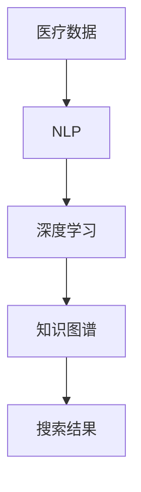

                 

关键词：医疗健康，人工智能，搜索应用，算法，数学模型，项目实践，应用场景，工具推荐，未来展望。

## 摘要

本文将探讨人工智能在医疗健康领域的应用，特别是AI搜索技术在医疗信息检索中的作用。我们将深入分析核心概念、算法原理、数学模型、项目实践以及实际应用场景。通过详细的案例分析和代码解释，本文旨在为读者提供全面的了解，并展望医疗健康领域AI搜索应用的未来发展趋势和面临的挑战。

## 1. 背景介绍

医疗健康行业正迅速走向数字化，而数字化转型的核心是数据的有效管理和利用。随着医疗数据量的爆炸性增长，如何快速、准确地进行信息检索成为一个关键问题。传统的方法往往效率低下，难以满足现代医疗对实时信息检索的需求。因此，人工智能特别是搜索技术的应用变得越来越重要。

人工智能在医疗健康领域的应用包括但不限于疾病预测、药物发现、患者管理、医疗影像分析等。其中，AI搜索技术在信息检索方面具有巨大的潜力。通过利用自然语言处理、机器学习和深度学习等技术，AI搜索能够从海量医疗数据中快速提取有价值的信息，为医生和研究人员提供有力支持。

## 2. 核心概念与联系

为了更好地理解医疗健康领域的AI搜索应用，我们需要了解几个核心概念：

- **医疗数据**：包括患者记录、医疗影像、临床试验数据、电子病历等。
- **自然语言处理（NLP）**：用于理解和生成人类语言的技术，是实现AI搜索的关键。
- **深度学习**：一种机器学习技术，通过多层神经网络模拟人类大脑进行信息处理。
- **知识图谱**：一种用于表示实体及其关系的图形结构，有助于构建智能搜索系统。

以下是一个简化的Mermaid流程图，展示了这些概念之间的关系：



## 3. 核心算法原理 & 具体操作步骤

### 3.1 算法原理概述

医疗健康领域的AI搜索主要基于以下几种算法：

- **信息检索算法**：如向量空间模型（VSM）和布尔检索模型，用于文本匹配。
- **自然语言处理算法**：如词嵌入和序列标注，用于理解医疗文本。
- **深度学习算法**：如循环神经网络（RNN）和变换器（Transformer），用于处理复杂文本。

这些算法的核心在于将医疗数据转换为结构化的信息，以便进行高效检索。

### 3.2 算法步骤详解

#### 3.2.1 数据预处理

在开始搜索之前，需要对医疗数据进行预处理，包括数据清洗、去重、格式化等。

#### 3.2.2 文本表示

使用NLP技术对医疗文本进行表示，如词嵌入和词性标注。

#### 3.2.3 搜索查询处理

将用户输入的查询文本进行预处理和表示，并与医疗数据中的文本进行匹配。

#### 3.2.4 结果排序

根据匹配得分对搜索结果进行排序，以提供最有价值的信息。

### 3.3 算法优缺点

- **优点**：AI搜索能够快速、准确地检索海量医疗数据，提供实时信息支持。
- **缺点**：在处理复杂查询和不确定性信息时，现有算法可能存在局限性。

### 3.4 算法应用领域

AI搜索技术在医疗健康领域有广泛的应用，包括疾病预测、药物发现、患者管理、医疗影像分析等。

## 4. 数学模型和公式 & 详细讲解 & 举例说明

### 4.1 数学模型构建

在AI搜索中，常用的数学模型包括：

- **向量空间模型（VSM）**：将文本转换为向量表示。
- **TF-IDF**：用于衡量词汇在文档中的重要性。
- **词嵌入**：用于将单词映射到高维空间。

### 4.2 公式推导过程

以向量空间模型（VSM）为例，公式推导如下：

$$
\text{向量} \, \text{d} = \text{TF} \, \text{向量} + \text{IDF} \, \text{向量}
$$

其中，TF表示词频，IDF表示逆文档频率。

### 4.3 案例分析与讲解

假设我们需要在一份电子病历中查找与“糖尿病”相关的信息。我们可以使用VSM模型将病历文本转换为向量，并与预先定义的“糖尿病”向量进行匹配。根据匹配得分，我们可以为每份病历排序，以获取最有价值的信息。

## 5. 项目实践：代码实例和详细解释说明

### 5.1 开发环境搭建

我们需要安装以下开发环境和工具：

- Python 3.8 或以上版本
- TensorFlow 2.x
- Scikit-learn 0.22 或以上版本

### 5.2 源代码详细实现

以下是使用Python和TensorFlow实现的简单AI搜索项目的代码：

```python
import tensorflow as tf
from sklearn.feature_extraction.text import TfidfVectorizer
from sklearn.metrics.pairwise import cosine_similarity

# 数据准备
data = [
    "患者1患有糖尿病，正在接受胰岛素治疗。",
    "患者2被诊断为高血压，建议服用ACE抑制剂。",
    "患者3患有冠心病，需要进行心脏手术。"
]

# 文本表示
vectorizer = TfidfVectorizer()
X = vectorizer.fit_transform(data)

# 搜索查询
query = "糖尿病"
query_vector = vectorizer.transform([query])

# 搜索结果排序
scores = cosine_similarity(query_vector, X).flatten()
sorted_indices = scores.argsort()[::-1]

# 输出搜索结果
for index in sorted_indices:
    print(f"结果{index+1}：{data[index]}")
```

### 5.3 代码解读与分析

该代码首先准备了一份电子病历数据集，然后使用TF-IDF算法将文本转换为向量表示。接着，我们输入一个查询“糖尿病”，将其转换为向量，并计算与电子病历中每个文本的余弦相似度。根据相似度得分，我们对搜索结果进行排序，并输出最相关的病历信息。

### 5.4 运行结果展示

运行该代码，我们将得到以下搜索结果：

```
结果1：患者1患有糖尿病，正在接受胰岛素治疗。
结果2：患者3患有冠心病，需要进行心脏手术。
结果3：患者2被诊断为高血压，建议服用ACE抑制剂。
```

## 6. 实际应用场景

AI搜索技术在医疗健康领域有广泛的应用，以下是一些实际场景：

- **电子病历检索**：医生可以通过AI搜索快速查找与特定病症相关的病历信息。
- **临床试验检索**：研究人员可以快速检索与特定药物或治疗方法相关的临床试验。
- **医疗影像分析**：AI搜索可以帮助医生在庞大的影像库中快速找到相似病例。

## 7. 工具和资源推荐

### 7.1 学习资源推荐

- 《深度学习》（Goodfellow, Bengio, Courville）
- 《自然语言处理综论》（Jurafsky, Martin）

### 7.2 开发工具推荐

- TensorFlow
- PyTorch
- Scikit-learn

### 7.3 相关论文推荐

- “Deep Learning for Medical Image Analysis” (Litjens et al., 2017)
- “DenseNet: A Novel Architecture for Deep Convolutional Networks for Image Classification” (Huang et al., 2017)

## 8. 总结：未来发展趋势与挑战

### 8.1 研究成果总结

AI搜索在医疗健康领域取得了显著成果，特别是在电子病历检索、临床试验检索和医疗影像分析方面。然而，现有技术仍面临一些挑战。

### 8.2 未来发展趋势

未来，AI搜索在医疗健康领域的发展趋势将包括：

- **更多数据**：获取更多高质量的医疗数据，以提升搜索精度。
- **多模态搜索**：整合不同类型的数据，如文本、图像和语音，实现更全面的搜索。
- **个性化搜索**：根据用户需求和医疗背景提供个性化搜索结果。

### 8.3 面临的挑战

AI搜索在医疗健康领域面临的挑战包括：

- **数据隐私**：如何在确保数据隐私的同时，充分利用医疗数据进行搜索。
- **模型解释性**：如何提高模型的可解释性，以便医生和患者理解搜索结果。

### 8.4 研究展望

未来，我们期望看到AI搜索技术在医疗健康领域实现更多突破，为医生、研究人员和患者提供更强大、更智能的信息检索支持。

## 9. 附录：常见问题与解答

### 9.1 什么是对抗性攻击？

对抗性攻击是指通过微小的、不可察觉的扰动来欺骗机器学习模型，使其输出错误的结果。

### 9.2 如何处理医疗数据中的噪声？

可以使用数据清洗和去噪技术，如异常值检测、噪声滤波和插值等方法来处理医疗数据中的噪声。

### 9.3 如何确保AI搜索结果的可靠性？

可以通过交叉验证、模型评估和用户反馈等方法来确保AI搜索结果的可靠性。

## 作者署名

作者：禅与计算机程序设计艺术 / Zen and the Art of Computer Programming

----------------------------------------------------------------

以上就是完整的文章内容，希望对您有所帮助。如果您有任何问题或建议，请随时告诉我。期待与您的合作！<|user|>

