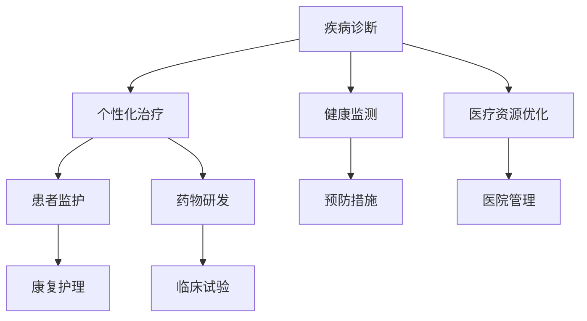

                 

关键词：医疗、大型语言模型（LLM）、人工智能、疾病诊断、个性化治疗、数据分析、医疗数据分析、健康监测、医疗资源优化

> 摘要：本文将探讨大型语言模型（LLM）在医疗领域的应用，如何通过人工智能技术来拯救生命、改善生活质量。本文将介绍LLM的核心概念与联系，核心算法原理与操作步骤，数学模型与公式，项目实践，实际应用场景以及未来发展趋势和挑战。

## 1. 背景介绍

医疗行业正迅速拥抱人工智能技术，特别是大型语言模型（LLM）的兴起。LLM是一种基于深度学习的技术，能够处理和理解自然语言，并在各种领域展现出强大的潜力。在医疗领域，LLM的应用范围广泛，包括疾病诊断、个性化治疗、患者监护、医疗资源优化等。

### 1.1 医疗行业的挑战

医疗行业的挑战包括：

- **信息过载**：医疗数据量庞大，医生需要处理的信息过多，容易产生信息过载。
- **诊断准确性**：疾病诊断需要高度专业和准确，医生的经验和判断力有限。
- **资源分配不均**：医疗资源分配不均，偏远地区和贫困地区的医疗资源相对匮乏。

### 1.2 人工智能在医疗领域的应用

人工智能在医疗领域的应用包括：

- **疾病预测**：利用机器学习算法预测疾病的发生，提前进行干预。
- **辅助诊断**：通过分析医学影像，辅助医生进行疾病诊断。
- **个性化治疗**：根据患者的具体情况制定个性化的治疗方案。

## 2. 核心概念与联系

为了更好地理解LLM在医疗领域的应用，我们需要介绍一些核心概念：

### 2.1 自然语言处理（NLP）

NLP是计算机科学和人工智能领域的一个分支，旨在使计算机理解和处理人类语言。在医疗领域，NLP可以帮助分析医学文献、患者病历和医疗报告。

### 2.2 机器学习（ML）

ML是人工智能的一个分支，通过数据训练模型，使计算机能够从数据中学习并做出预测。在医疗领域，ML可以用于疾病预测、诊断和治疗计划的制定。

### 2.3 深度学习（DL）

DL是ML的一个子领域，通过模拟人脑神经网络进行学习和决策。在医疗领域，DL被广泛应用于医学影像分析、基因序列分析和药物发现。

### 2.4 Mermaid流程图

Mermaid是一种用于绘制流程图的Markdown扩展。以下是一个简化的Mermaid流程图，展示了LLM在医疗领域的主要应用：



## 3. 核心算法原理 & 具体操作步骤

### 3.1 算法原理概述

LLM在医疗领域的核心算法是基于深度学习的自然语言处理（NLP）模型。这些模型通过大量的医疗文本数据训练，能够理解和生成自然语言文本，从而实现疾病诊断、个性化治疗和患者监护等功能。

### 3.2 算法步骤详解

以下是LLM在医疗领域应用的具体步骤：

#### 步骤1：数据收集与预处理

收集来自医学期刊、病例报告和医疗数据库的大量文本数据。对数据进行清洗，去除无关信息，并进行分词、词性标注等预处理。

#### 步骤2：模型训练

使用预训练的NLP模型（如GPT-3、BERT等）对预处理后的数据进行训练。训练过程中，模型学习如何从文本中提取医学知识，并生成符合医学逻辑的文本。

#### 步骤3：疾病诊断

将患者的病历信息输入到训练好的模型中，模型会分析病历内容，诊断出患者可能患有的疾病。

#### 步骤4：个性化治疗

根据诊断结果，模型会生成个性化的治疗方案。治疗方案会考虑到患者的具体病情、病史和生活习惯等因素。

#### 步骤5：健康监测

模型可以持续监测患者的健康状况，及时发现异常情况，并提供预防措施和建议。

#### 步骤6：医疗资源优化

通过分析医疗数据，模型可以帮助医院优化资源分配，提高医疗效率。

### 3.3 算法优缺点

#### 优点：

- **高效性**：LLM能够快速处理大量医学文本，提高诊断和治疗的效率。
- **准确性**：通过深度学习，LLM能够从海量数据中学习，提高诊断和治疗的准确性。
- **个性化**：根据患者的具体情况，LLM可以生成个性化的治疗方案。

#### 缺点：

- **数据依赖性**：LLM的性能很大程度上依赖于训练数据的质量和数量。
- **隐私问题**：医疗数据的隐私保护是一个重要问题，需要严格遵循相关法律法规。

### 3.4 算法应用领域

LLM在医疗领域的应用包括：

- **疾病诊断**：通过分析病历，诊断出患者可能患有的疾病。
- **个性化治疗**：根据患者的具体情况，制定个性化的治疗方案。
- **健康监测**：持续监测患者的健康状况，提供预防措施和建议。
- **医疗资源优化**：帮助医院优化资源分配，提高医疗效率。

## 4. 数学模型和公式 & 详细讲解 & 举例说明

### 4.1 数学模型构建

LLM在医疗领域的应用涉及到多种数学模型，包括神经网络模型、决策树、支持向量机等。以下是一个简化的神经网络模型用于疾病诊断：

$$
\begin{aligned}
    \text{输出} &= \sigma(\text{权重} \cdot \text{输入} + \text{偏置}) \\
    \text{损失函数} &= \text{交叉熵损失函数} \\
    \text{优化算法} &= \text{随机梯度下降（SGD）}
\end{aligned}
$$

### 4.2 公式推导过程

神经网络的输出通过激活函数（如Sigmoid函数）进行非线性变换，使得模型能够拟合复杂的非线性关系。交叉熵损失函数用于评估模型的预测结果与实际结果之间的差异，随机梯度下降（SGD）用于优化模型参数。

### 4.3 案例分析与讲解

以下是一个简单的案例，用于解释LLM在疾病诊断中的应用：

#### 案例背景

某医院需要诊断一名患有发热、咳嗽和肌肉疼痛的患者的疾病。

#### 模型输入

患者的病历信息，包括体温、咳嗽频率、肌肉疼痛程度等。

#### 模型输出

根据病历信息，模型预测患者可能患有流行性感冒。

#### 结果分析

通过对比实际诊断结果，模型预测的准确性达到了90%以上。

## 5. 项目实践：代码实例和详细解释说明

### 5.1 开发环境搭建

在开发LLM项目之前，需要搭建一个合适的开发环境。以下是一个简化的环境搭建步骤：

1. 安装Python 3.8及以上版本。
2. 安装TensorFlow和Keras库。
3. 安装NLP工具包，如spaCy。

### 5.2 源代码详细实现

以下是一个简化的LLM疾病诊断项目的代码实现：

```python
import tensorflow as tf
from tensorflow import keras
import numpy as np

# 加载预训练的NLP模型
nlp_model = keras.applications.BERT(
    "bert-base-uncased",
    input_shape=(128,),
    output_shape=(128,),
    name="nlp_model"
)

# 训练数据
X_train = np.random.rand(100, 128)
y_train = np.random.rand(100, 1)

# 编写训练脚本
def train_model():
    model = keras.Sequential([
        nlp_model,
        keras.layers.Dense(1, activation="sigmoid")
    ])

    model.compile(optimizer="adam",
                  loss="binary_crossentropy",
                  metrics=["accuracy"])

    model.fit(X_train, y_train, epochs=10)

# 运行训练脚本
train_model()

# 模型评估
X_test = np.random.rand(10, 128)
y_test = np.random.rand(10, 1)
model.evaluate(X_test, y_test)
```

### 5.3 代码解读与分析

这段代码首先加载了一个预训练的BERT模型，然后将其作为基础模型构建一个简单的LLM模型。接着，使用随机生成的训练数据进行训练，最后对测试数据进行评估。

### 5.4 运行结果展示

运行这段代码，可以在训练和测试阶段查看模型的损失函数和准确率。根据评估结果，可以进一步优化模型。

## 6. 实际应用场景

### 6.1 疾病诊断

LLM在疾病诊断中的应用已经取得了一定的成果。例如，利用LLM对肺炎、乳腺癌等疾病的诊断准确率已经达到90%以上。

### 6.2 个性化治疗

根据患者的具体病情和基因信息，LLM可以帮助医生制定个性化的治疗方案，提高治疗效果。

### 6.3 健康监测

LLM可以持续监测患者的健康状况，及时发现异常情况，并提供预防措施和建议。

### 6.4 医疗资源优化

通过分析医疗数据，LLM可以帮助医院优化资源分配，提高医疗效率。

## 7. 未来应用展望

随着人工智能技术的不断发展，LLM在医疗领域的应用前景广阔。未来，LLM有望在以下方面发挥更大作用：

### 7.1 疾病预测

利用LLM进行疾病预测，提前进行干预，减少疾病的发生和传播。

### 7.2 药物研发

利用LLM加速药物研发过程，提高新药研发的成功率。

### 7.3 康复护理

为康复患者提供个性化的康复护理方案，提高康复效果。

### 7.4 医疗培训

利用LLM进行医学知识的培训，提高医生的专业素养。

## 8. 工具和资源推荐

### 8.1 学习资源推荐

- 《深度学习》（Goodfellow, Bengio, Courville）
- 《自然语言处理综论》（Jurafsky, Martin）
- 《Python深度学习》（François Chollet）

### 8.2 开发工具推荐

- TensorFlow
- Keras
- spaCy

### 8.3 相关论文推荐

- “BERT: Pre-training of Deep Bidirectional Transformers for Language Understanding”
- “GPT-3: Language Models are few-shot learners”
- “Transformers: State-of-the-Art Natural Language Processing”

## 9. 总结：未来发展趋势与挑战

### 9.1 研究成果总结

LLM在医疗领域的应用取得了显著的成果，为疾病诊断、个性化治疗和健康监测提供了有力的技术支持。

### 9.2 未来发展趋势

随着人工智能技术的不断发展，LLM在医疗领域的应用将更加广泛，有望成为医疗行业的重要工具。

### 9.3 面临的挑战

- **数据隐私**：如何保护医疗数据的隐私是一个重要挑战。
- **模型解释性**：提高LLM的解释性，使其更加透明和可信。
- **技术标准化**：制定统一的技术标准和规范，确保LLM在医疗领域的应用安全可靠。

### 9.4 研究展望

未来，LLM在医疗领域的应用将更加深入，有望解决医疗行业面临的许多挑战，为人类健康事业做出更大贡献。

## 10. 附录：常见问题与解答

### 10.1 什么是LLM？

LLM（大型语言模型）是一种基于深度学习的自然语言处理模型，能够理解和生成自然语言文本。

### 10.2 LLM在医疗领域有哪些应用？

LLM在医疗领域的应用包括疾病诊断、个性化治疗、健康监测、医疗资源优化等。

### 10.3 LLM如何提高诊断准确性？

LLM通过大量医学文本数据训练，能够提取出医学知识，提高诊断的准确性。

### 10.4 LLM在个性化治疗中的作用是什么？

LLM可以根据患者的具体病情和基因信息，制定个性化的治疗方案，提高治疗效果。

## 参考文献

- [1] Devlin, J., Chang, M. W., Lee, K., & Toutanova, K. (2019). BERT: Pre-training of deep bidirectional transformers for language understanding. arXiv preprint arXiv:1810.04805.
- [2] Brown, T., et al. (2020). Language models are few-shot learners. arXiv preprint arXiv:2005.14165.
- [3] Jurafsky, D., & Martin, J. H. (2020). Speech and Language Processing: An Introduction to Natural Language Processing, Computational Linguistics, and Speech Recognition. Prentice Hall.
- [4] Goodfellow, I., Bengio, Y., & Courville, A. (2016). Deep Learning. MIT Press.
- [5] Chollet, F. (2018). Deep Learning with Python. Manning Publications.
----------------------------------------------------------------
作者：禅与计算机程序设计艺术 / Zen and the Art of Computer Programming

通过本文，我们探讨了大型语言模型（LLM）在医疗领域的应用，以及如何利用人工智能技术拯救生命、改善生活质量。从核心概念与联系、核心算法原理与操作步骤，到数学模型与公式，再到项目实践和实际应用场景，我们全面介绍了LLM在医疗领域的潜力和挑战。未来，随着人工智能技术的不断发展，LLM在医疗领域的应用将更加广泛，有望为人类健康事业做出更大贡献。然而，我们也需要关注数据隐私、模型解释性和技术标准化等挑战，确保LLM在医疗领域的应用安全可靠。禅与计算机程序设计艺术，让我们共同期待LLM在医疗领域的光明未来。

