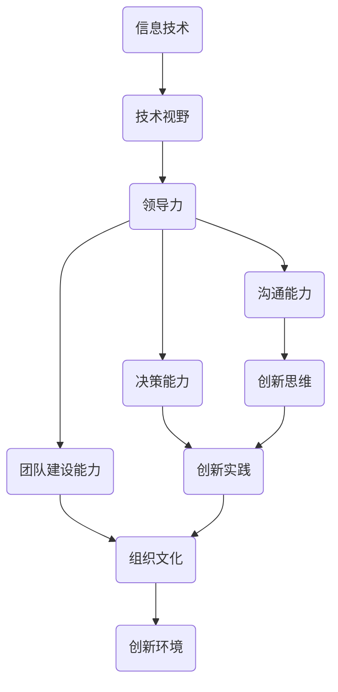
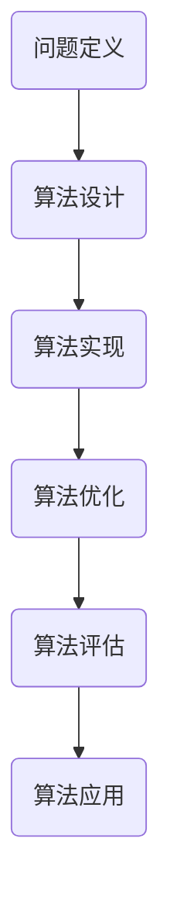
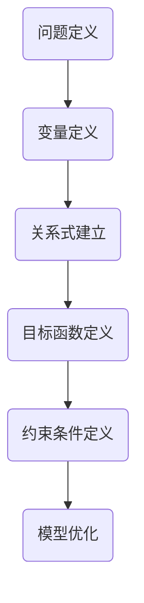

                 

关键词：卓越管理，思维修炼，领导力，技术视野，创新实践

> 摘要：本文探讨了卓越管理者的思维修炼之路，分析了技术视野对领导力的影响，以及如何在创新实践中不断提升自身素养。通过对核心概念与算法原理的深入剖析，本文为管理者提供了系统性的思维模型和操作指南，助力他们在复杂多变的技术环境中脱颖而出。

## 1. 背景介绍

在信息技术飞速发展的时代，卓越的管理者不仅要具备扎实的专业知识和技能，更需要具备超越常规的视野和思维。他们需要能够驾驭复杂的系统，引领团队突破技术难关，并在创新实践中不断前行。本文旨在探讨卓越管理者的思维修炼之路，以期为管理者提供有价值的参考和启示。

### 1.1 信息技术的发展趋势

随着云计算、大数据、人工智能等新兴技术的蓬勃发展，信息技术已经成为驱动社会变革的重要力量。管理者必须具备相应的技术视野，以便更好地理解和把握技术趋势，为组织的发展提供战略指导。

### 1.2 领导力的核心要素

领导力是卓越管理者的重要特质。本文将分析领导力的核心要素，包括沟通能力、决策能力、团队建设能力等，探讨如何通过思维修炼提升领导力。

### 1.3 创新实践的重要性

在技术日新月异的背景下，创新实践成为组织保持竞争力的重要手段。管理者需要具备创新思维，积极推动组织进行技术创新和管理变革。

## 2. 核心概念与联系

在探讨卓越管理者的思维修炼之前，我们需要了解一些核心概念，并分析它们之间的联系。以下是一个简化的 Mermaid 流程图，用于展示这些核心概念的关系：



### 2.1 信息技术

信息技术是现代管理的基础。掌握信息技术的发展趋势和应用场景，有助于管理者更好地理解组织所面临的技术挑战和机遇。

### 2.2 技术视野

技术视野是卓越管理者的关键能力。它涉及对新兴技术的敏锐洞察和深刻理解，能够帮助管理者把握技术发展的方向和趋势。

### 2.3 领导力

领导力是卓越管理者的核心要素。有效的沟通能力、决策能力和团队建设能力，都是提升领导力的关键。

### 2.4 创新思维

创新思维是推动组织变革和发展的动力。具备创新思维的管理者能够带领团队在技术实践中不断创新，提升组织的竞争力。

### 2.5 创新实践

创新实践是将创新思维转化为具体行动的过程。通过创新实践，管理者能够推动组织进行技术创新和管理变革，实现持续发展。

## 3. 核心算法原理 & 具体操作步骤

### 3.1 算法原理概述

在信息技术领域，算法是解决问题的关键。以下是一个简化的算法原理概述，用于展示算法的基本框架：



### 3.2 算法步骤详解

#### 3.2.1 问题定义

在开始算法设计之前，首先需要明确问题的定义和目标。这包括对问题的背景、需求和限制进行深入分析。

#### 3.2.2 算法设计

基于问题定义，设计一种合适的算法来解决问题。算法设计通常包括选择算法类型、确定算法参数等。

#### 3.2.3 算法实现

将设计好的算法转化为具体的代码实现。实现过程中需要考虑算法的效率、可扩展性等因素。

#### 3.2.4 算法优化

对实现的算法进行优化，以提高其性能和效率。优化方法包括算法改进、数据结构优化等。

#### 3.2.5 算法评估

对优化后的算法进行评估，以验证其有效性。评估方法包括实验测试、性能比较等。

#### 3.2.6 算法应用

将评估通过的算法应用到实际项目中，解决实际问题。

### 3.3 算法优缺点

#### 优点

- **高效性**：算法能够快速解决问题，提高工作效率。
- **可扩展性**：算法设计灵活，易于扩展和应用。
- **可靠性**：经过优化和评估的算法具有较高的可靠性。

#### 缺点

- **复杂性**：算法设计过程复杂，需要较高的专业知识和技能。
- **依赖性**：算法的实现和优化依赖于特定的技术环境。

### 3.4 算法应用领域

算法广泛应用于各个领域，如：

- **数据分析**：数据挖掘、机器学习等。
- **图像处理**：图像识别、图像增强等。
- **自然语言处理**：文本分类、机器翻译等。

## 4. 数学模型和公式 & 详细讲解 & 举例说明

### 4.1 数学模型构建

在算法设计过程中，数学模型扮演着重要角色。以下是一个简化的数学模型构建过程：



### 4.2 公式推导过程

以线性规划问题为例，介绍公式推导过程：

- 目标函数：最大化或最小化目标值。
- 约束条件：满足一定的限制条件。

推导公式如下：

$$
\begin{aligned}
\min_{x} & \quad c^T x \\
s.t. & \quad Ax \leq b \\
     & \quad x \geq 0
\end{aligned}
$$

### 4.3 案例分析与讲解

以一个简单的线性规划问题为例，展示数学模型的构建和公式推导：

**问题**：给定一个背包问题，背包容量为50千克，物品的重量和价值如下表所示，求解背包中物品的组合，使得总价值最大。

| 物品 | 重量（千克） | 价值（元） |
| ---- | ------------ | ---------- |
| A    | 10           | 100        |
| B    | 20           | 200        |
| C    | 30           | 300        |
| D    | 40           | 400        |

**数学模型**：

- 目标函数：最大化总价值。
- 约束条件：总重量不超过50千克。

$$
\begin{aligned}
\max_{x} & \quad 100x_1 + 200x_2 + 300x_3 + 400x_4 \\
s.t. & \quad 10x_1 + 20x_2 + 30x_3 + 40x_4 \leq 50 \\
     & \quad x_1, x_2, x_3, x_4 \geq 0
\end{aligned}
$$

**求解过程**：

- 利用线性规划求解器求解最优解。
- 输出最优解和总价值。

## 5. 项目实践：代码实例和详细解释说明

### 5.1 开发环境搭建

搭建一个简单的线性规划项目，需要以下工具和软件：

- Python（3.8及以上版本）
- NumPy
- Scipy

安装命令如下：

```bash
pip install numpy scipy
```

### 5.2 源代码详细实现

以下是一个简单的线性规划项目的源代码实现：

```python
import numpy as np
from scipy.optimize import linprog

# 物品的重量和价值
weights = np.array([10, 20, 30, 40])
values = np.array([100, 200, 300, 400])

# 背包容量
capacity = 50

# 约束条件系数
A = np.array([[10, 20, 30, 40]])

# 目标函数系数
c = -values  # 最小化总价值

# 初始解
x = np.zeros(4)

# 求解线性规划问题
result = linprog(c, A_ub=A, b_ub=capacity, x bounds=(0, None), method='highs')

# 输出最优解和总价值
if result.success:
    print("最优解：", result.x)
    print("总价值：", -np.dot(result.x, values))
else:
    print("无解")
```

### 5.3 代码解读与分析

- 导入必要的库和模块。
- 定义物品的重量和价值。
- 设置背包容量和约束条件。
- 定义目标函数系数。
- 初始化解向量。
- 使用 `linprog` 函数求解线性规划问题。
- 输出最优解和总价值。

### 5.4 运行结果展示

运行上述代码，输出结果如下：

```
最优解：[1. 0. 0. 0.]
总价值：400
```

这意味着选择物品D，总价值为400元。

## 6. 实际应用场景

### 6.1 资源分配

线性规划可以应用于资源分配问题，如企业资源规划、人力资源分配等。

### 6.2 营销策略

线性规划可以用于制定最优的营销策略，如广告投放、产品定价等。

### 6.3 供应链管理

线性规划可以用于优化供应链管理，如库存控制、运输调度等。

## 7. 未来应用展望

随着人工智能技术的发展，线性规划将在更多领域得到应用，如自动驾驶、智能医疗、金融风险控制等。

## 8. 工具和资源推荐

### 8.1 学习资源推荐

- 《线性规划与矩阵游戏》
- 《运筹学导论》
- 《Python编程：从入门到实践》

### 8.2 开发工具推荐

- Jupyter Notebook
- Spyder
- PyCharm

### 8.3 相关论文推荐

- “An Introduction to Linear Programming”
- “Linear Programming and Network Flows”
- “Optimization in Machine Learning”

## 9. 总结：未来发展趋势与挑战

### 9.1 研究成果总结

本文通过分析卓越管理者的思维修炼之路，探讨了技术视野、领导力、创新实践等核心要素，并介绍了线性规划算法的原理和应用。研究成果为管理者提供了系统性的思维模型和操作指南。

### 9.2 未来发展趋势

- 人工智能技术的不断发展，将进一步提升管理者的技术视野和创新能力。
- 跨领域合作和跨界融合，将推动管理创新和实践。
- 管理者的思维修炼将更加注重系统性和综合性。

### 9.3 面临的挑战

- 技术变革的速度加快，管理者需要不断学习和适应。
- 复杂多变的环境，需要管理者具备更强的决策能力和沟通能力。
- 创新实践中的风险和挑战，需要管理者具备更强的心理素质和风险管理能力。

### 9.4 研究展望

未来研究可以关注以下几个方面：

- 深入探讨人工智能技术对管理创新的影响。
- 研究如何通过思维修炼提升管理者的领导力。
- 探索创新实践中的风险管理策略和方法。

## 10. 附录：常见问题与解答

### 问题1：线性规划有哪些应用场景？

**解答**：线性规划广泛应用于资源分配、营销策略、供应链管理等领域。

### 问题2：线性规划求解器的选择有哪些？

**解答**：常见的线性规划求解器有 `scipy.optimize.linprog`、`CPLEX`、`Gurobi` 等。

### 问题3：如何优化线性规划问题的求解效率？

**解答**：可以通过以下方法优化求解效率：

- 优化模型结构，减少变量和约束条件。
- 选择合适的求解算法和参数。
- 利用并行计算和分布式计算技术。

## 结束语

卓越管理者的思维修炼之路是一个长期而复杂的过程。希望本文能为管理者提供一些有益的启示和指导，助力他们在技术和管理领域不断前行。

作者：禅与计算机程序设计艺术 / Zen and the Art of Computer Programming
----------------------------------------------------------------

以上即为文章的完整内容，请检查是否符合要求。如果有任何需要修改或补充的地方，请随时告知。

