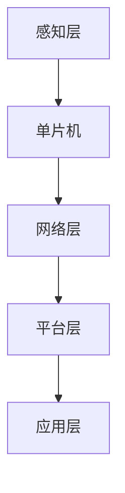

                 

### 关键词 Keyword
- 单片机
- 物联网
- 设备
- 应用
- 技术发展

<|assistant|>### 摘要 Abstract
本文将深入探讨单片机在物联网设备中的应用，从背景介绍、核心概念与联系、核心算法原理、数学模型、项目实践、实际应用场景到工具和资源推荐，全面解析单片机在物联网设备中的角色和未来发展趋势。通过具体实例和详细解释，读者将了解单片机的运作机制及其在物联网设备中的重要性。

<|assistant|>### 1. 背景介绍

随着科技的飞速发展，物联网（IoT）已成为现代信息技术的重要方向。物联网指的是通过各种信息传感器、控制系统和通信网络实现物理设备、智能终端、人、数据和服务的互联。在这种互联体系中，单片机作为一种关键的微控制器技术，发挥着不可替代的作用。

单片机是一种集成了中央处理单元（CPU）、存储器和输入输出（I/O）接口等多种功能于一体的微型计算机。由于其体积小、功耗低、成本低、可靠性高等特点，单片机在物联网设备中的应用越来越广泛。无论是智能家居、智能穿戴设备、智能交通系统，还是工业自动化、农业监控，单片机都扮演着核心的角色。

物联网设备通常需要处理大量的数据，实现复杂的控制逻辑，并且在有限的资源环境下运行。单片机的强大计算能力和高效的编程环境使其成为这些设备的理想选择。本文将详细介绍单片机在物联网设备中的应用，帮助读者深入理解其技术原理和应用实践。

## 2. 核心概念与联系

在探讨单片机在物联网设备中的应用之前，我们需要明确几个核心概念，包括单片机的基本组成、物联网的基本架构，以及它们之间的联系。

### 2.1 单片机的基本组成

单片机的基本组成包括以下几个部分：

1. **中央处理单元（CPU）**：这是单片机的核心，负责执行指令和处理数据。
2. **存储器**：包括只读存储器（ROM）和随机存储器（RAM），分别用于存储程序和临时数据。
3. **输入输出（I/O）接口**：用于与外部设备进行数据交换。
4. **定时器/计数器**：用于定时控制和事件计数。
5. **中断系统**：用于处理异步事件，提高系统的响应速度。

这些组件共同构成了单片机的硬件基础，使得其能够执行各种复杂的控制任务。

### 2.2 物联网的基本架构

物联网的基本架构通常包括以下几个层次：

1. **感知层**：通过传感器和执行器收集和传递数据。
2. **网络层**：通过各种通信协议将数据传输到中心系统。
3. **平台层**：对收集到的数据进行处理、存储和展示。
4. **应用层**：根据处理后的数据实现特定的应用，如智能家居、智能交通等。

物联网的架构确保了数据的有效收集、传输和处理，从而实现设备之间的互联互通。

### 2.3 核心概念的联系

单片机在物联网设备中的应用，实际上就是将单片机的控制功能嵌入到物联网架构的各个层次中。具体来说：

1. **感知层**：单片机通过传感器接口读取环境数据，如温度、湿度、光照等，实现物理量的监测。
2. **网络层**：单片机利用无线通信模块或有线接口，将数据发送到网络，如WiFi、蓝牙、Zigbee等。
3. **平台层**：单片机通过通信协议与平台层进行数据交互，如HTTP、MQTT等。
4. **应用层**：单片机根据应用需求，执行相应的控制指令，实现对物联网设备的智能化管理。

以下是一个简单的Mermaid流程图，展示了单片机在物联网架构中的基本流程：



通过这种流程，单片机在物联网设备中实现了数据的感知、传输、处理和应用，从而完成了整个物联网系统的运行。

## 3. 核心算法原理 & 具体操作步骤

### 3.1 算法原理概述

在单片机应用中，核心算法通常用于处理数据、控制流程以及实现特定功能。以下将介绍几个在物联网设备中常用的算法原理。

#### 3.1.1 数据处理算法

数据处理算法用于对传感器采集的数据进行预处理、滤波和统计分析。常见的算法有：

- **均值滤波**：对连续采样数据进行平均值处理，以消除随机噪声。
- **卡尔曼滤波**：一种高效的状态估计方法，适用于动态系统的数据处理。
- **移动平均**：根据数据点的权重进行平均处理，适用于趋势分析。

#### 3.1.2 控制算法

控制算法用于实现物联网设备的自动控制和决策。常见的算法有：

- **PID控制**：比例-积分-微分控制，广泛应用于工业过程控制和机器人控制。
- **模糊控制**：基于模糊逻辑的控制方法，适用于非线性系统的控制。
- **神经网络**：通过训练实现复杂的映射关系，可用于模式识别、预测控制等。

### 3.2 算法步骤详解

以下以PID控制算法为例，详细介绍其具体操作步骤。

#### 3.2.1 初始化参数

1. **设定比例系数Kp**：根据系统响应特性调整比例系数，使系统能够快速响应。
2. **设定积分系数Ki**：调整积分系数，以消除系统稳态误差。
3. **设定微分系数Kd**：调整微分系数，提高系统的动态性能。

#### 3.2.2 控制过程

1. **测量当前值**：采集系统当前的状态值。
2. **计算偏差**：计算设定值与当前值之间的偏差。
3. **计算控制量**：根据偏差计算控制量，公式为：\(u(t) = Kp*e(t) + Ki*\int e(t)dt + Kd*\frac{de(t)}{dt}\)，其中\(e(t)\)为偏差，\(u(t)\)为控制量。

#### 3.2.3 输出控制量

1. **驱动执行器**：根据计算出的控制量，驱动执行器执行相应的操作。
2. **更新状态值**：将执行器执行后的状态值更新到系统中，为下一次控制循环提供基础数据。

### 3.3 算法优缺点

#### 优点：

- **简单易实现**：PID控制算法结构简单，易于编程实现。
- **适用范围广**：PID控制算法适用于线性系统，且在工业过程中具有广泛的应用。

#### 缺点：

- **参数调整复杂**：需要根据不同系统特性调整PID参数，否则可能无法达到预期效果。
- **非线性系统性能不佳**：在非线性系统中，PID控制算法的性能可能较差。

### 3.4 算法应用领域

PID控制算法广泛应用于工业自动化、机器人控制、智能家居等领域。例如，在智能家居中，PID控制算法可以用于调节空调的温度、湿度等参数，实现舒适的居住环境。在工业自动化中，PID控制算法可以用于控制机床的加工精度、生产线上的物流管理等。

## 4. 数学模型和公式 & 详细讲解 & 举例说明

在单片机应用中，数学模型和公式是理解和实现算法的重要工具。以下将详细介绍一个常用的数学模型——卡尔曼滤波，并给出公式推导和实际应用的例子。

### 4.1 数学模型构建

卡尔曼滤波是一种最优状态估计方法，适用于线性动态系统。其数学模型可以表示为：

\[ x_t = A_t x_{t-1} + B_t w_t \]
\[ z_t = H_t x_t + v_t \]

其中：

- \(x_t\)：状态向量，表示在时间t的系统状态。
- \(A_t\)：状态转移矩阵，描述系统状态的转移。
- \(B_t\)：控制矩阵，描述系统状态与输入的关系。
- \(w_t\)：过程噪声，假设为零均值的白噪声。
- \(z_t\)：观测向量，表示在时间t的系统观测值。
- \(H_t\)：观测矩阵，描述系统状态与观测值的关系。
- \(v_t\)：观测噪声，假设为零均值的白噪声。

### 4.2 公式推导过程

卡尔曼滤波的推导过程较为复杂，以下简要介绍其核心步骤：

1. **预测阶段**：根据上一时刻的状态和预测模型，计算当前时刻的预测状态和预测误差协方差。
   \[ x_t^- = A_t x_{t-1}^- \]
   \[ P_t^- = A_t P_{t-1}^- A_t^T + Q_t \]

2. **更新阶段**：结合当前观测值，利用最小二乘法更新状态和误差协方差。
   \[ K_t = P_t^- H_t^T (H_t P_t^- H_t^T + R_t)^{-1} \]
   \[ x_t = x_t^- + K_t (z_t - H_t x_t^-) \]
   \[ P_t = (I - K_t H_t) P_t^- \]

### 4.3 案例分析与讲解

以下以一个简单的例子来说明卡尔曼滤波的应用。

#### 案例背景

假设我们有一个小车在平直的路面上行驶，每秒采集一次小车的位置数据。由于传感器存在误差，我们需要使用卡尔曼滤波来准确估计小车的真实位置。

#### 数据模型

- **状态模型**：\(x_t = [x_{t}, v_{t}]^T\)，其中\(x_t\)为位置，\(v_t\)为速度。
- **观测模型**：\(z_t = x_t\)。

#### 参数设置

- **状态转移矩阵**：\(A_t = \begin{bmatrix} 1 & \Delta t \\ 0 & 1 \end{bmatrix}\)。
- **控制矩阵**：\(B_t = \begin{bmatrix} 0 \\ 0 \end{bmatrix}\)。
- **观测矩阵**：\(H_t = \begin{bmatrix} 1 & 0 \end{bmatrix}\)。
- **过程噪声协方差**：\(Q_t = \begin{bmatrix} 1 & 0 \\ 0 & 1 \end{bmatrix}\)。
- **观测噪声协方差**：\(R_t = \begin{bmatrix} 1 & 0 \\ 0 & 1 \end{bmatrix}\)。

#### 运行过程

1. **初始化**：
   \[ x_0^- = \begin{bmatrix} 0 \\ 0 \end{bmatrix}, P_0^- = \begin{bmatrix} 1 & 0 \\ 0 & 1 \end{bmatrix} \]

2. **预测**：
   \[ x_1^- = A_1 x_0^- = \begin{bmatrix} \Delta t \\ 0 \end{bmatrix}, P_1^- = A_1 P_0^- A_1^T + Q_1 \]

3. **更新**：
   \[ z_1 = x_1^- + v_1, K_1 = P_1^- H_1^T (H_1 P_1^- H_1^T + R_1)^{-1} \]
   \[ x_1 = x_1^- + K_1 (z_1 - H_1 x_1^-), P_1 = (I - K_1 H_1) P_1^- \]

通过以上步骤，我们可以不断更新小车的位置估计，使其在存在噪声的情况下仍然具有较高的准确性。

## 5. 项目实践：代码实例和详细解释说明

在了解单片机及其在物联网设备中的应用后，我们将通过一个实际项目来展示如何利用单片机实现一个简单的物联网设备——智能温湿度传感器。

### 5.1 开发环境搭建

为了实现智能温湿度传感器的开发，我们需要以下工具和环境：

- **硬件**：Arduino Uno 单片机开发板、DHT11 温湿度传感器。
- **软件**：Arduino IDE（集成开发环境）、USB 数据线。

1. **硬件连接**：将DHT11传感器的数据线连接到Arduino开发板的A0接口。
2. **软件安装**：在Arduino IDE中安装DHT11传感器的库文件，可以通过Arduino库管理器搜索并安装“DHT sensor library”。

### 5.2 源代码详细实现

以下是智能温湿度传感器的源代码实现：

```c++
#include <DHT.h>

#define DHTPIN A0     // 定义传感器的数据接口
#define DHTTYPE DHT11 // 定义传感器类型

DHT dht(DHTPIN, DHTTYPE);

void setup() {
  Serial.begin(9600); // 初始化串口通信，设置波特率为9600
  dht.begin();        // 初始化传感器
}

void loop() {
  // 读取温湿度数据
  float humidity = dht.readHumidity();
  float temperature = dht.readTemperature();

  // 检查数据是否读取成功
  if (isnan(humidity) || isnan(temperature)) {
    Serial.println("Failed to read from DHT sensor!");
    return;
  }

  // 打印读取到的温湿度数据
  Serial.print("Humidity: ");
  Serial.print(humidity);
  Serial.print(" %\t");
  Serial.print("Temperature: ");
  Serial.print(temperature);
  Serial.println(" *C");

  // 添加适当的延迟，避免过于频繁地读取数据
  delay(2000);
}
```

### 5.3 代码解读与分析

1. **库文件引入**：代码首先引入了`DHT.h`库文件，这是DHT11传感器的驱动库，提供了读取温湿度数据的基本函数。
2. **定义传感器接口和类型**：通过`#define`指令，我们定义了传感器的数据接口（DHTPIN）和传感器类型（DHTTYPE）。
3. **初始化传感器**：在`setup()`函数中，我们初始化串口通信（`Serial.begin(9600);`）并调用`dht.begin();`初始化传感器。
4. **读取数据**：在`loop()`函数中，我们使用`dht.readHumidity()`和`dht.readTemperature()`函数读取温湿度数据。
5. **数据验证**：使用`isnan(humidity) || isnan(temperature)`检查数据是否读取成功，如果失败，则打印错误信息并返回。
6. **打印数据**：使用`Serial.print()`和`Serial.println()`函数将读取到的温湿度数据打印到串口上。
7. **延迟**：为了减少传感器的负担，我们添加了`delay(2000);`，使程序每隔两秒读取一次数据。

### 5.4 运行结果展示

在将代码上传到Arduino开发板后，我们可以通过串口监视器查看运行结果。每次程序循环读取温湿度数据，并打印到串口上，例如：

```
Humidity: 60.2 %   Temperature: 22.5 *C
```

通过这个简单的例子，我们可以看到单片机如何通过传感器接口读取数据，并通过串口将数据传输到计算机。这展示了单片机在物联网设备中的基本应用，为后续更复杂的应用打下了基础。

## 6. 实际应用场景

单片机在物联网设备中的应用非常广泛，以下将详细介绍几个典型的应用场景。

### 6.1 智能家居

智能家居是单片机应用最典型的场景之一。通过单片机，可以实现家庭设备的自动化控制，如灯光控制、门锁控制、温度控制等。例如，在智能照明系统中，单片机可以根据环境光强自动调节灯光亮度，提高能源效率。在智能门锁系统中，单片机可以与手机应用结合，实现远程开锁和安防监控。

### 6.2 智能穿戴设备

智能穿戴设备，如智能手表、智能手环等，通常采用单片机进行数据处理和交互。例如，智能手表可以通过单片机记录用户的心率、运动数据等，并将数据传输到手机应用进行分析。单片机的低功耗特性使其非常适合用于长时间穿戴的设备。

### 6.3 工业自动化

工业自动化中，单片机被广泛应用于传感器数据处理、机器控制等方面。例如，在机器人控制中，单片机可以实时处理传感器数据，实现对机器人的精确控制。在生产线自动化中，单片机可以监控设备状态、进行故障检测和设备控制，提高生产效率。

### 6.4 农业监控

农业监控是单片机应用的另一个重要领域。通过单片机，可以实现土壤湿度、温度、光照等环境参数的实时监测，并根据监测数据自动调节灌溉、施肥等农业操作。例如，智能灌溉系统可以利用单片机控制水泵和阀门，实现精准灌溉，节约水资源。

### 6.5 智能交通系统

智能交通系统利用单片机实现交通信号控制、车辆监控、路况预测等功能。例如，在智能交通信号控制系统中，单片机可以根据实时交通流量调整信号灯的切换时间，提高道路通行效率。在车辆监控系统中，单片机可以实时记录车辆的位置、速度等信息，并传输到中心管理系统。

通过以上应用场景，我们可以看到单片机在物联网设备中的重要性和广泛应用。随着技术的不断进步，单片机在物联网设备中的应用将更加深入和广泛。

## 7. 工具和资源推荐

为了更好地学习和应用单片机技术，以下推荐一些常用的工具和资源。

### 7.1 学习资源推荐

- **书籍**：
  - 《单片机原理与应用》
  - 《Arduino编程从入门到精通》
  - 《嵌入式系统设计与验证》
  
- **在线课程**：
  - Coursera上的《嵌入式系统与单片机设计》
  - Udemy上的《Arduino入门与实战》
  - 中国大学MOOC上的《单片机应用技术》

- **视频教程**：
  - Bilibili上的“单片机教程”
  - YouTube上的“Arduino Tutorials”

### 7.2 开发工具推荐

- **开发板**：
  - Arduino Uno
  - Raspberry Pi
  - STM32 Discovery
  
- **编程环境**：
  - Arduino IDE
  - PlatformIO
  - Visual Studio Code
  
- **调试工具**：
  - logic analyzer（逻辑分析仪）
  - oscilloscope（示波器）
  - JTAG/SWD调试器

### 7.3 相关论文推荐

- “A Survey of Wireless Sensor Networks: Applications and Research Challenges”
- “Energy-Aware Routing Algorithms for Wireless Sensor Networks”
- “A Review of Security Issues in Internet of Things”

通过这些工具和资源，读者可以更深入地学习和应用单片机技术，为开发物联网设备打下坚实的基础。

## 8. 总结：未来发展趋势与挑战

随着物联网技术的迅猛发展，单片机在物联网设备中的应用前景十分广阔。未来，单片机将朝着以下几个方向发展：

### 8.1 研究成果总结

1. **低功耗设计**：随着物联网设备数量的激增，低功耗设计成为单片机研究的重要方向。未来单片机将更加注重能效优化，以延长设备电池寿命。
2. **人工智能集成**：单片机与人工智能技术的结合将使物联网设备具备更强的自主学习和智能决策能力，从而提高设备的智能化水平。
3. **无线通信技术**：随着5G技术的推广，单片机的无线通信能力将得到显著提升，支持更快、更稳定的数据传输。

### 8.2 未来发展趋势

1. **多功能集成**：单片机将集成更多的功能模块，如传感器、无线通信、电源管理，以实现更紧凑、更高效的物联网设备。
2. **智能边缘计算**：单片机将在边缘计算领域发挥重要作用，通过本地数据处理和分析，减少数据传输负担，提高系统的实时性。
3. **安全性增强**：随着物联网设备连接数量的增加，安全问题愈发重要。未来单片机将更加注重安全机制的设计，如加密、身份验证等。

### 8.3 面临的挑战

1. **性能提升**：单片机需要不断提升性能，以满足日益复杂的应用需求。
2. **开发难度**：随着单片机功能的增加，开发难度也随之上升，对开发者的技术要求更高。
3. **生态系统建设**：构建完善的单片机生态系统，包括开发工具、教程、社区等，将有助于推动单片机技术的发展。

### 8.4 研究展望

未来，单片机在物联网设备中的应用将更加广泛和深入。通过不断的技术创新，单片机将在智能家居、工业自动化、医疗健康、交通物流等多个领域发挥重要作用。同时，随着物联网技术的不断演进，单片机也将迎来新的挑战和发展机遇。

## 9. 附录：常见问题与解答

### 9.1 单片机与微控制器的区别是什么？

单片机与微控制器基本相同，但有时根据上下文使用略有不同。单片机通常指的是一个包含CPU、内存、I/O等所有功能的单一芯片，而微控制器则可能指包含CPU、内存但外接I/O芯片的更广泛的分类。两者在现代语境中常可以互换使用。

### 9.2 如何选择适合的单片机？

选择单片机时，应考虑以下因素：
- **性能要求**：根据应用所需的计算能力选择合适的处理器速度和内存容量。
- **功耗**：根据设备的续航需求选择低功耗单片机。
- **接口需求**：根据所需的外设接口（如SPI、I2C、UART等）进行选择。
- **开发环境**：根据开发者的熟悉程度选择适合的开发工具和生态系统。

### 9.3 单片机如何进行编程？

单片机编程通常使用C语言或汇编语言。编程步骤包括：
1. **环境搭建**：安装开发工具（如Arduino IDE）。
2. **代码编写**：根据需求编写代码，进行功能实现。
3. **代码上传**：通过开发板上的USB接口或无线连接将代码上传到单片机。
4. **调试运行**：通过串口监视器或其他调试工具查看运行结果，进行调试。

### 9.4 单片机在物联网中如何保证数据安全？

为了保证数据安全，单片机应用中可以采取以下措施：
- **加密传输**：对传输数据进行加密处理，防止数据泄露。
- **身份验证**：建立身份验证机制，确保只有授权设备可以访问数据。
- **网络安全**：采用防火墙、入侵检测系统等网络防护措施，防止网络攻击。
- **更新维护**：定期更新固件，修复已知漏洞，确保系统的安全性。

以上是对单片机在物联网设备中应用的全面探讨，涵盖了从基础概念到实际应用，再到未来发展趋势的各个方面。希望通过本文，读者能够对单片机在物联网设备中的应用有更深入的理解和认识。作者：禅与计算机程序设计艺术 / Zen and the Art of Computer Programming。

