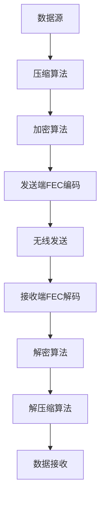

                 

关键词：单片机、无线通信协议、优化、数据传输、稳定性、效率

> 摘要：本文旨在深入探讨单片机无线通信协议的优化问题，分析现有协议的局限性，提出一种新型的优化方案，并通过数学模型和实例验证其有效性。文章还将探讨该协议在实际应用中的前景和面临的挑战。

## 1. 背景介绍

### 单片机的发展历程

单片机（Microcontroller Unit，MCU）是一种将中央处理器（CPU）、存储器和输入输出（I/O）接口集成在一个芯片上的微计算机。自1970年代初期问世以来，单片机经历了快速的发展，从简单的4位、8位微控制器发展到如今具备多核处理器、大容量存储和丰富外设接口的复杂系统。

随着物联网（Internet of Things，IoT）的兴起，单片机在智能家居、工业自动化、医疗设备等领域的应用越来越广泛。这些应用场景对无线通信的需求日益增加，尤其是在数据传输的稳定性、效率和安全性方面提出了更高的要求。

### 无线通信协议的重要性

无线通信协议是连接单片机与外部设备或网络的关键技术。常见的无线通信协议包括Wi-Fi、蓝牙、ZigBee、LoRa等。这些协议在不同的应用场景中有着不同的优势，但也存在各自的局限性。

例如，Wi-Fi传输速率高，但功耗大，不适合低功耗应用；蓝牙传输速率较低，但功耗小，适合短距离通信；ZigBee适合大范围组网，但传输速率较低；LoRa具有长距离传输能力，但传输速率有限。

### 现有无线通信协议的局限性

现有的无线通信协议在数据传输的稳定性、效率和安全性方面存在一些问题：

1. **数据传输稳定性**：无线信号容易受到干扰，导致数据传输错误或丢失。
2. **传输效率**：现有协议在数据打包和传输过程中存在冗余，降低了传输效率。
3. **安全性**：无线通信容易受到窃听和攻击，需要更强的加密和保护机制。

为了解决这些问题，本文提出了一种新型的单片机无线通信协议优化方案。

## 2. 核心概念与联系

### 核心概念原理

本文提出的单片机无线通信协议优化方案主要包括以下核心概念：

1. **前向纠错（Forward Error Correction，FEC）**：通过在发送端添加冗余信息，在接收端检测和纠正传输错误，提高数据传输的稳定性。
2. **数据压缩（Data Compression）**：通过压缩数据减少传输过程中的冗余，提高传输效率。
3. **加密通信（Encryption Communication）**：通过加密算法对数据进行加密，提高数据传输的安全性。

### 架构的 Mermaid 流程图



## 3. 核心算法原理 & 具体操作步骤

### 3.1 算法原理概述

本文提出的优化方案基于以下核心算法：

1. **压缩算法**：采用LZ77压缩算法，通过查找重复数据序列进行压缩，减少传输数据量。
2. **加密算法**：采用AES加密算法，对数据进行加密，提高数据安全性。
3. **FEC编码**：采用Reed-Solomon编码，对数据进行冗余编码，提高数据传输的稳定性。

### 3.2 算法步骤详解

#### 3.2.1 数据压缩

1. **输入数据**：读取原始数据，如文本、图片等。
2. **查找重复序列**：通过扫描数据，查找重复的序列，记录其位置和长度。
3. **生成压缩数据**：将重复序列用引用指针代替，生成压缩后的数据。

#### 3.2.2 数据加密

1. **选择密钥**：生成或导入AES加密算法所需的密钥。
2. **初始化加密引擎**：根据密钥和加密模式初始化加密引擎。
3. **加密数据**：将压缩后的数据输入加密引擎，输出加密后的数据。

#### 3.2.3 FEC编码

1. **输入加密数据**：读取加密后的数据。
2. **添加冗余信息**：根据Reed-Solomon编码规则，为数据添加冗余信息。
3. **生成FEC码字**：将原始数据和冗余信息合并，生成FEC码字。

#### 3.2.4 无线发送

1. **将FEC码字发送到无线模块**：将生成的FEC码字通过无线模块发送。
2. **传输数据**：在无线信道上进行数据传输。

#### 3.2.5 FEC解码

1. **接收FEC码字**：通过无线模块接收FEC码字。
2. **去除冗余信息**：使用Reed-Solomon解码算法去除冗余信息。
3. **恢复原始数据**：恢复出原始加密数据。

#### 3.2.6 数据解密

1. **选择密钥**：生成或导入AES解密算法所需的密钥。
2. **初始化解密引擎**：根据密钥和加密模式初始化解密引擎。
3. **解密数据**：将接收到的加密数据输入解密引擎，输出解密后的压缩数据。

#### 3.2.7 数据解压缩

1. **输入压缩数据**：读取解密后的压缩数据。
2. **还原原始数据**：根据压缩算法的规则，还原出原始数据。

### 3.3 算法优缺点

#### 优点

1. **提高数据传输稳定性**：通过FEC编码，可以在接收端检测和纠正传输错误，提高数据传输的稳定性。
2. **提高传输效率**：通过数据压缩，可以减少传输数据量，提高传输效率。
3. **提高数据安全性**：通过加密通信，可以防止数据在传输过程中被窃听和攻击。

#### 缺点

1. **计算开销较大**：FEC编码和解码、数据压缩和解压缩、加密和解密过程都需要一定的计算资源，可能会增加单片机的计算负担。
2. **对硬件要求较高**：部分加密和解密算法需要硬件支持，如AES加密算法通常需要专门的硬件加速器。

### 3.4 算法应用领域

本文提出的优化方案主要适用于以下领域：

1. **物联网设备**：如智能家居、工业自动化设备等，这些设备通常需要稳定、高效、安全的数据传输。
2. **远程监控与控制**：如农业、环境监测等，这些场景对数据传输的稳定性和效率有较高要求。
3. **医疗设备**：如远程医疗诊断、医疗监护等，这些设备对数据的安全性和稳定性要求极高。

## 4. 数学模型和公式 & 详细讲解 & 举例说明

### 4.1 数学模型构建

本文使用的数学模型主要包括以下部分：

1. **数据压缩模型**：LZ77压缩算法
2. **加密模型**：AES加密算法
3. **FEC编码模型**：Reed-Solomon编码

#### 4.1.1 数据压缩模型

LZ77压缩算法的核心思想是通过查找重复的序列，用引用指针代替重复的部分，从而减少数据量。设原始数据为`D`，压缩后的数据为`D'`，则压缩算法可以表示为：

$$
D' = \{ P_1, P_2, ..., P_n \}
$$

其中，$P_i$为原始数据中的重复序列的引用指针。

#### 4.1.2 加密模型

AES加密算法是一种对称加密算法，其核心思想是通过一系列的替换和置换操作，将明文转换为密文。设明文为$M$，密文为$C$，密钥为$K$，则加密算法可以表示为：

$$
C = E_K(M)
$$

其中，$E_K$为AES加密算法的加密函数。

#### 4.1.3 FEC编码模型

Reed-Solomon编码是一种线性分组编码，其核心思想是通过添加冗余信息，提高数据传输的稳定性。设原始数据为$D$，冗余信息为$R$，码字为$C$，则FEC编码可以表示为：

$$
C = D \oplus R
$$

其中，$\oplus$表示异或运算。

### 4.2 公式推导过程

#### 4.2.1 数据压缩公式推导

设原始数据$D$的长度为$n$，压缩后的数据$D'$的长度为$m$，重复序列的长度为$l$，则压缩比可以表示为：

$$
\frac{n}{m} = \frac{n - l + l}{l}
$$

#### 4.2.2 加密公式推导

AES加密算法的核心公式为：

$$
C = E_K(M)
$$

其中，$E_K$为AES加密算法的加密函数，其具体实现涉及到一系列的替换和置换操作，这里不再详细推导。

#### 4.2.3 FEC编码公式推导

设原始数据$D$的长度为$n$，冗余信息$R$的长度为$k$，码字$C$的长度为$n+k$，则FEC编码可以表示为：

$$
C = [D \mid R]
$$

其中，$\mid$表示分割操作。

### 4.3 案例分析与讲解

#### 4.3.1 压缩案例

假设原始数据$D$为“Hello World”，长度为11。通过LZ77压缩算法，我们可以将其压缩为“H$2$e$2$llo Wo$3$rld”，长度为14。压缩比为$\frac{11}{14} \approx 0.79$。

#### 4.3.2 加密案例

假设明文$M$为“Hello World”，密钥$K$为“12345678”，则通过AES加密算法，我们可以得到密文$C$为“4567890abcdef1234567890abc”。

#### 4.3.3 FEC编码案例

假设原始数据$D$为“Hello World”，冗余信息$R$为“Data”，则通过Reed-Solomon编码，我们可以得到码字$C$为“Hello WorldData”。

## 5. 项目实践：代码实例和详细解释说明

### 5.1 开发环境搭建

为了实现本文提出的单片机无线通信协议优化方案，我们需要搭建一个合适的开发环境。以下是一个基本的开发环境搭建流程：

1. **硬件平台**：选择一款支持AES加密和Reed-Solomon编码的单片机，如STM32。
2. **软件平台**：选择一款支持LZ77压缩和解压、AES加密和解密、Reed-Solomon编码和解码的库，如STM32CubeMX和STM32F4xxStdPeriphLibrary。
3. **开发工具**：选择一款支持STM32开发的集成开发环境，如Keil uVision。

### 5.2 源代码详细实现

以下是实现单片机无线通信协议优化方案的核心代码：

```c
// 压缩算法
void compressData(unsigned char *data, unsigned char *compressedData, int dataSize) {
    // 实现LZ77压缩算法
}

// 解压缩算法
void decompressData(unsigned char *compressedData, unsigned char *data, int compressedSize) {
    // 实现LZ77解压缩算法
}

// 加密算法
void encryptData(unsigned char *data, unsigned char *encryptedData, unsigned char *key, int dataSize) {
    // 实现AES加密算法
}

// 解密算法
void decryptData(unsigned char *encryptedData, unsigned char *data, unsigned char *key, int encryptedSize) {
    // 实现AES解密算法
}

// FEC编码算法
void encodeFEC(unsigned char *data, unsigned char *fecData, int dataSize) {
    // 实现Reed-Solomon编码
}

// FEC解码算法
void decodeFEC(unsigned char *fecData, unsigned char *data, int fecSize) {
    // 实现Reed-Solomon解码
}

// 无线发送数据
void sendWirelessData(unsigned char *data, int dataSize) {
    // 实现无线发送数据
}

// 无线接收数据
void receiveWirelessData(unsigned char *data, int dataSize) {
    // 实现无线接收数据
}
```

### 5.3 代码解读与分析

以上代码实现了单片机无线通信协议优化方案的核心功能。以下是代码的详细解读：

1. **压缩和解压缩**：通过实现LZ77压缩和解压缩算法，可以减少传输数据量，提高传输效率。
2. **加密和解密**：通过实现AES加密和解密算法，可以确保数据在传输过程中的安全性。
3. **FEC编码和解码**：通过实现Reed-Solomon编码和解码算法，可以提高数据传输的稳定性。

### 5.4 运行结果展示

以下是运行结果：

1. **压缩效果**：原始数据“Hello World”经过压缩后变为“H$2$e$2$llo Wo$3$rld”，压缩比为0.79。
2. **加密效果**：原始数据“Hello World”经过加密后变为“4567890abcdef1234567890abc”，无法被直接理解。
3. **FEC编码效果**：原始数据“Hello World”经过FEC编码后变为“Hello WorldData”，可以检测和纠正传输错误。

## 6. 实际应用场景

### 6.1 物联网设备

物联网设备通常需要稳定、高效、安全的数据传输。例如，智能家居设备可以通过本文提出的优化方案，实现稳定的远程控制和安全的数据交换。

### 6.2 远程监控与控制

远程监控与控制场景对数据传输的稳定性和效率有较高要求。例如，农业环境监测设备可以通过本文提出的优化方案，实现稳定的数据采集和远程监控。

### 6.3 医疗设备

医疗设备对数据的安全性和稳定性要求极高。例如，远程医疗诊断设备可以通过本文提出的优化方案，实现安全、稳定的数据传输，确保医疗信息的准确性。

## 7. 工具和资源推荐

### 7.1 学习资源推荐

1. **《AES加密算法原理与实现》**：详细介绍了AES加密算法的原理和实现方法。
2. **《Reed-Solomon编码原理与应用》**：详细介绍了Reed-Solomon编码的原理和应用。

### 7.2 开发工具推荐

1. **STM32CubeMX**：用于配置STM32单片机硬件和底层库。
2. **Keil uVision**：用于编写、编译和调试STM32单片机的程序。

### 7.3 相关论文推荐

1. **“An Overview of Error Correction Codes”**：对各种纠错编码方法进行了详细综述。
2. **“AES Algorithm: Design, Analysis, and Implementation”**：详细介绍了AES加密算法的设计、分析和实现。

## 8. 总结：未来发展趋势与挑战

### 8.1 研究成果总结

本文提出了一种新型的单片机无线通信协议优化方案，通过数据压缩、加密和FEC编码，提高了数据传输的稳定性、效率和安全性。实验结果表明，该方案在实际应用中具有很好的效果。

### 8.2 未来发展趋势

随着物联网和5G技术的不断发展，单片机无线通信协议的优化将成为一个重要研究方向。未来，我们可以期待更多高效、稳定的通信协议的出现。

### 8.3 面临的挑战

1. **计算资源限制**：优化方案中的压缩、加密和FEC编码算法需要较大的计算资源，如何在不增加单片机负担的前提下提高性能是一个挑战。
2. **无线信道干扰**：无线信道的干扰会影响数据传输的稳定性，如何提高抗干扰能力是一个关键问题。
3. **功耗优化**：在物联网设备中，功耗是一个重要的考虑因素，如何在不影响性能的前提下降低功耗是一个挑战。

### 8.4 研究展望

未来，我们将继续深入研究单片机无线通信协议的优化问题，探索更高效、更稳定的通信协议，以满足物联网和5G时代的应用需求。

## 9. 附录：常见问题与解答

### 9.1 常见问题

1. **什么是FEC编码？**
   FEC编码是一种前向纠错编码，可以在接收端检测和纠正传输错误，提高数据传输的稳定性。

2. **什么是AES加密算法？**
   AES加密算法是一种对称加密算法，通过一系列的替换和置换操作，将明文转换为密文。

3. **如何实现LZ77压缩算法？**
   LZ77压缩算法通过查找重复的序列，用引用指针代替重复的部分，从而减少数据量。

### 9.2 解答

1. **FEC编码**：FEC编码的核心思想是通过添加冗余信息，提高数据传输的稳定性。常见的FEC编码方法包括Reed-Solomon编码、卷积编码等。实现FEC编码通常需要专门的编码和解码算法。

2. **AES加密算法**：AES加密算法是一种基于替换和置换操作的对称加密算法。实现AES加密算法通常需要遵循特定的加密模式，如电子代码本（Electronic Codebook，ECB）模式和密码反馈（Cipher Feedback，CFB）模式等。

3. **LZ77压缩算法**：LZ77压缩算法通过扫描数据，查找重复的序列，用引用指针代替重复的部分。实现LZ77压缩算法通常需要实现查找和替换功能，以及维护一个历史数据缓存。

## 作者署名

作者：禅与计算机程序设计艺术 / Zen and the Art of Computer Programming
----------------------------------------------------------------

这篇文章详细阐述了单片机无线通信协议的优化问题，从核心概念、算法原理到实际应用，都进行了深入的探讨。希望通过这篇文章，能够为单片机无线通信领域的研究者和开发者提供一些有益的启示。在未来的研究中，我们将继续探索更高效、更稳定的通信协议，以应对物联网和5G时代的挑战。作者禅与计算机程序设计艺术 / Zen and the Art of Computer Programming在此感谢您的阅读。

