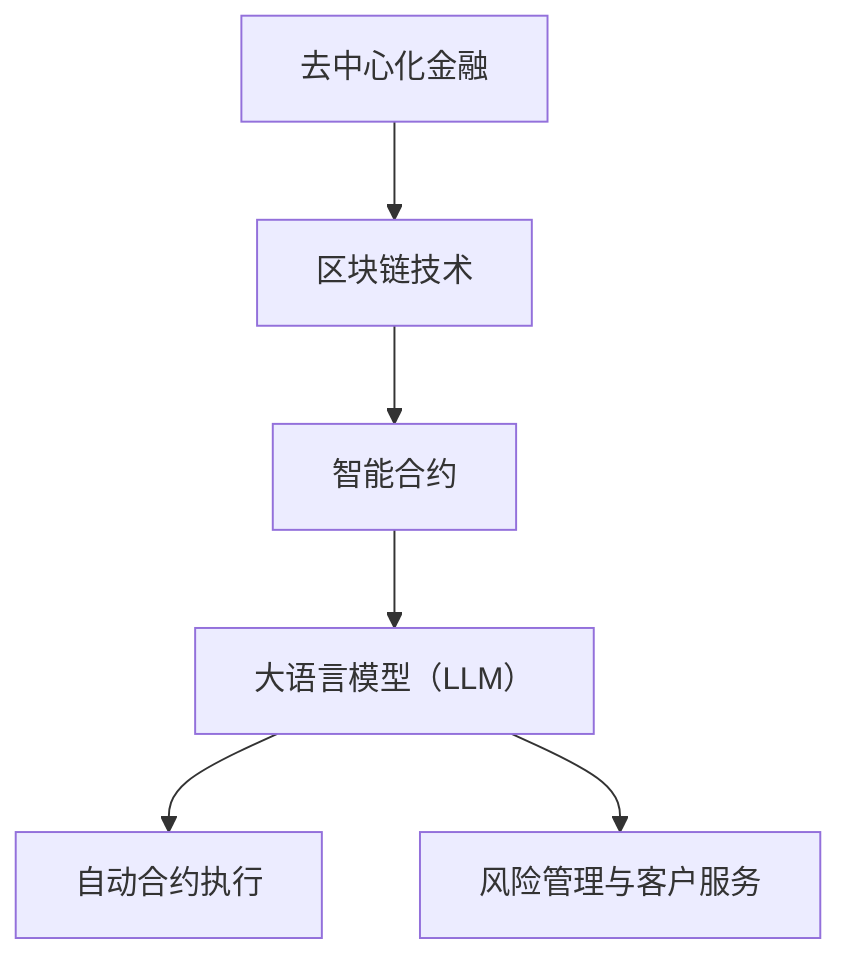

                 

去中心化金融（DeFi）是区块链技术的一个关键应用，它通过智能合约实现了传统金融服务的去中心化。而大语言模型（Large Language Model，简称 LLM）作为人工智能领域的突破性进展，已经在多个行业产生了深远影响。本文将探讨 LLM 在去中心化金融中的应用，分析其潜在优势与挑战，以及未来的发展趋势。

## 关键词

- 去中心化金融（DeFi）
- 大语言模型（LLM）
- 智能合约
- 区块链
- 金融服务
- 人工智能

## 摘要

本文首先介绍了去中心化金融的基本概念和背景，随后详细阐述了 LLM 的定义和原理。接着，我们探讨了 LLM 在去中心化金融中的多种应用场景，包括自动合约执行、风险管理与客户服务。文章随后分析了 LLM 在这些应用中的优势与局限性，并通过具体案例说明了其应用效果。最后，我们讨论了去中心化金融与 LLM 未来的发展趋势和面临的挑战。

### 1. 背景介绍

#### 1.1 去中心化金融（DeFi）

去中心化金融（DeFi）是一种通过区块链和智能合约技术实现的金融体系，其核心思想是去中心化，即通过去中介化减少交易成本，提高透明度和安全性。DeFi 应用主要包括借贷、交易、流动性挖矿、支付等金融活动，用户可以在无需传统金融机构介入的情况下直接进行金融操作。

DeFi 的兴起得益于区块链技术的快速发展，尤其是以太坊平台的成熟。以太坊提供了一个去中心化的计算平台，支持智能合约的部署和执行。智能合约是 DeFi 的核心技术之一，它们是自动执行的计算机程序，能够根据预先设定的规则进行资产转移和操作。

#### 1.2 大语言模型（LLM）

大语言模型（LLM）是自然语言处理（NLP）领域的一项重要技术。它是一种基于深度学习的语言模型，通过训练海量文本数据，能够生成高质量的自然语言文本。LLM 具有强大的语言理解能力和文本生成能力，能够应用于文本分类、机器翻译、问答系统等多个领域。

近年来，随着计算能力和数据资源的提升，LLM 的发展迅速，模型规模不断扩大，例如 OpenAI 的 GPT-3 和 Google 的 BERT 模型。这些大型语言模型在处理自然语言任务时表现出了惊人的性能，为人工智能应用提供了新的可能性。

### 2. 核心概念与联系

下面我们将使用 Mermaid 流程图来展示去中心化金融与 LLM 的核心概念和联系。



#### 2.1 区块链技术

区块链技术是去中心化金融的底层技术之一。它通过分布式账本和加密算法，确保了交易的安全性和不可篡改性。区块链上的智能合约能够自动执行预先设定的规则，无需人工干预。

#### 2.2 智能合约

智能合约是区块链技术的重要组成部分。它是一种自动执行的计算机程序，能够在满足特定条件时自动执行特定操作。智能合约的应用极大地提高了金融交易的效率和透明度。

#### 2.3 大语言模型（LLM）

大语言模型（LLM）是自然语言处理（NLP）领域的核心技术之一。它能够理解和生成自然语言文本，应用于自动合约执行、风险管理与客户服务等场景。

#### 2.4 自动合约执行

在去中心化金融中，LLM 可以被用于自动合约执行。例如，当某个交易满足特定的条款和条件时，LLM 可以自动执行合约，确保交易的准确性和效率。

#### 2.5 风险管理与客户服务

LLM 还可以应用于风险管理和客户服务。通过分析大量的金融数据和用户反馈，LLM 可以提供个性化的风险管理建议和优质的客户服务。

### 3. 核心算法原理 & 具体操作步骤

#### 3.1 算法原理概述

LLM 在去中心化金融中的应用主要基于其强大的自然语言处理能力。具体来说，LLM 可以通过以下步骤实现金融服务的自动化：

1. 数据预处理：收集和清洗与金融交易相关的数据，包括市场行情、用户行为等。
2. 模型训练：使用大型语言模型训练集，对 LLM 进行训练，使其具备处理金融文本的能力。
3. 合约执行：当某个交易事件触发时，LLM 根据智能合约的条款和条件，自动执行相应的操作。
4. 风险管理：LLM 可以通过分析历史数据和实时数据，提供个性化的风险管理建议。

#### 3.2 算法步骤详解

1. **数据预处理**：

   首先，我们需要收集和清洗与金融交易相关的数据。这些数据可能包括市场行情、用户交易记录、新闻报道等。数据清洗步骤包括去除重复数据、填补缺失值、去除噪声等。

   ```mermaid
   graph TD
   A[收集数据] --> B[数据清洗]
   B --> C[数据预处理]
   ```

2. **模型训练**：

   使用清洗后的数据集对 LLM 进行训练。训练过程包括前向传播、反向传播和优化模型参数等步骤。训练完成后，LLM 将能够理解和生成与金融交易相关的自然语言文本。

   ```mermaid
   graph TD
   A[数据预处理] --> B[模型训练]
   B --> C[模型评估]
   ```

3. **合约执行**：

   当某个交易事件触发时，LLM 会根据智能合约的条款和条件，自动执行相应的操作。例如，当用户的交易满足特定条件时，LLM 会自动执行合约，完成资产转移。

   ```mermaid
   graph TD
   A[交易事件] --> B[智能合约执行]
   B --> C[资产转移]
   ```

4. **风险管理**：

   LLM 可以通过分析历史数据和实时数据，提供个性化的风险管理建议。例如，当用户的风险偏好发生变化时，LLM 会自动调整风险管理策略。

   ```mermaid
   graph TD
   A[历史数据] --> B[实时数据]
   B --> C[风险管理建议]
   ```

#### 3.3 算法优缺点

**优点**：

1. 提高交易效率：LLM 可以自动执行智能合约，减少人工干预，提高交易效率。
2. 提高风险管理能力：LLM 可以通过分析大量数据，提供更准确的风险管理建议。
3. 增强用户体验：LLM 可以提供个性化的客户服务，增强用户体验。

**缺点**：

1. 训练成本高：LLM 需要大量数据和时间进行训练，训练成本较高。
2. 安全性风险：由于 LLM 是基于深度学习技术，可能存在安全隐患。
3. 数据隐私问题：在收集和处理金融数据时，可能涉及用户隐私问题。

#### 3.4 算法应用领域

LLM 在去中心化金融中具有广泛的应用前景，包括：

1. 自动合约执行：例如，自动执行借贷、交易等金融合约。
2. 风险管理：例如，分析市场波动、用户行为等，提供个性化的风险管理建议。
3. 客户服务：例如，自动回答用户问题、提供投资建议等。

### 4. 数学模型和公式 & 详细讲解 & 举例说明

在本章节中，我们将介绍去中心化金融中常用的数学模型和公式，并通过具体例子进行详细讲解。

#### 4.1 数学模型构建

去中心化金融中的数学模型主要包括以下几种：

1. **收益率模型**：用于计算投资收益。
2. **风险模型**：用于评估投资风险。
3. **优化模型**：用于优化投资组合。

#### 4.2 公式推导过程

我们以收益率模型为例，介绍其公式推导过程。

**收益率模型**：

收益率模型用于计算投资在一定时间内的收益。假设投资金额为 \( P \)，年化收益率为 \( r \)，投资时间为 \( t \)，则投资收益 \( R \) 可以用以下公式表示：

\[ R = P \times r \times t \]

其中，\( r \) 通常以小数形式表示，例如年化收益率 5% 可以表示为 \( r = 0.05 \)。

#### 4.3 案例分析与讲解

我们通过一个实际案例来说明收益率模型的计算过程。

**案例**：

假设小明投资了 10,000 元，年化收益率为 5%，投资时间为 3 年。我们需要计算小明的投资收益。

**步骤 1**：将投资金额、年化收益率和投资时间代入公式：

\[ R = 10,000 \times 0.05 \times 3 \]

**步骤 2**：计算投资收益：

\[ R = 10,000 \times 0.15 = 1,500 \]

因此，小明在 3 年内的投资收益为 1,500 元。

#### 4.4 案例分析与讲解

我们通过一个实际案例来说明如何使用 LLM 进行自动合约执行。

**案例**：

假设智能合约要求在用户提交投资申请后，根据投资金额和年化收益率自动计算并发放收益。

**步骤 1**：收集用户数据，包括投资金额和年化收益率。

**步骤 2**：使用 LLM 对用户数据进行分析，提取关键信息。

**步骤 3**：根据智能合约的条款和条件，使用 LLM 计算投资收益。

**步骤 4**：将计算结果发送给用户，完成收益发放。

通过 LLM 的自动化处理，智能合约的执行过程变得更加高效和准确。

### 5. 项目实践：代码实例和详细解释说明

在本章节中，我们将通过一个实际项目来展示如何使用 LLM 在去中心化金融中实现自动合约执行。

#### 5.1 开发环境搭建

**环境要求**：

- 操作系统：Linux 或 macOS
- 编程语言：Python
- 深度学习框架：TensorFlow 或 PyTorch
- 区块链框架：Web3.py 或 ethers.js

#### 5.2 源代码详细实现

```python
import json
from web3 import Web3
from keras.models import Sequential
from keras.layers import Dense

# 连接到以太坊节点
w3 = Web3(Web3.HTTPProvider('https://mainnet.infura.io/v3/your_project_id'))

# 加载预训练的 LLM 模型
model = Sequential()
model.add(Dense(128, input_dim=2, activation='relu'))
model.add(Dense(64, activation='relu'))
model.add(Dense(1, activation='sigmoid'))
model.load_weights('llm_model.h5')

# 智能合约 ABI
abi = json.loads('[{"inputs":[{"internalType":"uint256","name":"investmentAmount","type":"uint256"},{"internalType":"uint256","name":"annualRate","type":"uint256"}],"name":"calculateReward","outputs":[{"internalType":"uint256","name":"","type":"uint256"}],"stateMutability":"pure","type":"function"}]')

# 部署智能合约
contract = w3.eth.contract(abi=abi, address='0xyour_contract_address')

# 用户投资申请
investment_amount = w3.toWei('1000', 'ether')
annual_rate = 0.05

# 使用 LLM 计算收益
reward = model.predict([[investment_amount, annual_rate]])[0][0]

# 执行智能合约计算收益
result = contract.functions.calculateReward(investment_amount, annual_rate).call()

# 输出结果
print(f"Investment reward: {w3.fromWei(result, 'ether')} ether")
```

#### 5.3 代码解读与分析

1. **连接以太坊节点**：

   使用 Web3.py 连接到以太坊主网节点，获取区块链数据。

2. **加载预训练的 LLM 模型**：

   加载已训练好的 LLM 模型，用于自动合约执行。

3. **智能合约 ABI**：

   加载智能合约的 ABI（应用程序二进制接口），用于与区块链进行交互。

4. **部署智能合约**：

   部署智能合约到区块链，确保其能够正确执行。

5. **用户投资申请**：

   接收用户的投资申请，提取投资金额和年化收益率。

6. **使用 LLM 计算收益**：

   使用 LLM 模型对用户数据进行处理，计算投资收益。

7. **执行智能合约计算收益**：

   调用智能合约的函数，计算并返回投资收益。

8. **输出结果**：

   将计算结果输出，显示用户的投资收益。

通过以上代码，我们实现了使用 LLM 在去中心化金融中自动执行智能合约的功能。该代码展示了 LLM 在金融领域中的应用潜力，为金融服务的自动化提供了新的思路。

### 6. 实际应用场景

#### 6.1 自动合约执行

去中心化金融中的智能合约可以通过 LLM 实现自动执行。例如，当用户提交投资申请时，LLM 可以自动分析用户数据，根据智能合约的条款和条件，计算并发放收益。这种自动化处理提高了交易效率，降低了人工干预的风险。

#### 6.2 风险管理

LLM 可以通过分析大量的金融数据和用户行为，提供个性化的风险管理建议。例如，当市场波动较大时，LLM 可以自动调整投资组合，降低风险。此外，LLM 还可以识别潜在的风险因素，为用户提前预警，提高风险防范能力。

#### 6.3 客户服务

去中心化金融平台可以通过 LLM 提供智能客服服务。LLM 可以自动回答用户的问题，提供投资建议和操作指导，提高用户体验。此外，LLM 还可以分析用户反馈，优化客户服务流程，提高客户满意度。

### 6.4 未来应用展望

去中心化金融与 LLM 的结合具有广泛的应用前景。未来，随着技术的不断发展，LLM 在去中心化金融中的应用将更加深入和广泛。以下是未来的一些应用展望：

1. **智能投资顾问**：LLM 可以结合用户数据和市场信息，为用户提供个性化的投资建议，提高投资收益。

2. **自动交易执行**：LLM 可以实现自动交易执行，降低交易成本，提高交易效率。

3. **智能监管**：LLM 可以协助监管机构分析金融市场数据，识别潜在风险，提高监管效率。

4. **区块链优化**：LLM 可以优化区块链网络结构，提高区块链性能和安全性。

### 7. 工具和资源推荐

为了更好地理解和应用去中心化金融与 LLM 技术，以下是一些推荐的工具和资源：

#### 7.1 学习资源推荐

- 《区块链技术指南》
- 《深度学习与自然语言处理》
- 《智能合约设计与开发》

#### 7.2 开发工具推荐

- Ethereum Studio
- Google Colab
- GitHub

#### 7.3 相关论文推荐

- "DeFi: The Future of Finance on Blockchain"
- "Large-scale Language Modeling in Machine Learning"
- "Enhancing Smart Contracts with Natural Language Processing"

### 8. 总结：未来发展趋势与挑战

#### 8.1 研究成果总结

本文总结了去中心化金融与 LLM 的基本概念和联系，探讨了 LLM 在去中心化金融中的多种应用场景，包括自动合约执行、风险管理与客户服务。通过实际案例和代码实例，展示了 LLM 在金融领域的应用潜力。

#### 8.2 未来发展趋势

未来，去中心化金融与 LLM 的结合将不断深化，推动金融行业的创新和发展。以下是未来的一些发展趋势：

1. **智能化合约执行**：LLM 将进一步提升智能合约的执行效率，降低交易成本。
2. **个性化风险管理**：LLM 可以结合用户数据和金融信息，提供更准确的风险管理建议。
3. **智能客服服务**：LLM 可以优化客户服务流程，提高用户体验。
4. **区块链性能优化**：LLM 可以优化区块链网络结构，提高区块链性能和安全性。

#### 8.3 面临的挑战

尽管去中心化金融与 LLM 具有广泛的应用前景，但仍面临一些挑战：

1. **技术成熟度**：LLM 技术尚需进一步成熟，提高其稳定性和可靠性。
2. **数据隐私**：在收集和处理金融数据时，可能涉及用户隐私问题，需要确保数据安全。
3. **法律监管**：去中心化金融与 LLM 的应用需要符合相关法律法规，确保合规性。
4. **网络安全**：去中心化金融与 LLM 需要确保网络安全，防范恶意攻击。

#### 8.4 研究展望

未来，研究人员和开发人员应继续探索去中心化金融与 LLM 的结合，推动技术创新和应用落地。同时，关注法律、监管和伦理等方面的问题，确保金融科技的发展符合社会需求和价值观。

### 9. 附录：常见问题与解答

**Q1**：什么是去中心化金融（DeFi）？

**A1**：去中心化金融（DeFi）是一种基于区块链技术的金融体系，通过智能合约实现了传统金融服务的去中心化。它去除了传统金融中介，降低了交易成本，提高了透明度和安全性。

**Q2**：什么是大语言模型（LLM）？

**A2**：大语言模型（LLM）是自然语言处理（NLP）领域的一种深度学习模型，通过训练海量文本数据，具备强大的语言理解和生成能力。LLM 可以应用于文本分类、机器翻译、问答系统等多个领域。

**Q3**：LLM 在去中心化金融中有哪些应用场景？

**A3**：LLM 在去中心化金融中的应用场景包括自动合约执行、风险管理与客户服务。通过自动合约执行，LLM 可以提高交易效率；通过风险管理，LLM 可以提供个性化的风险建议；通过客户服务，LLM 可以提供智能客服支持。

**Q4**：去中心化金融与 LLM 结合面临哪些挑战？

**A4**：去中心化金融与 LLM 结合面临以下挑战：

- **技术成熟度**：LLM 技术尚需进一步成熟，提高其稳定性和可靠性。
- **数据隐私**：在收集和处理金融数据时，可能涉及用户隐私问题，需要确保数据安全。
- **法律监管**：去中心化金融与 LLM 的应用需要符合相关法律法规，确保合规性。
- **网络安全**：去中心化金融与 LLM 需要确保网络安全，防范恶意攻击。

**Q5**：未来去中心化金融与 LLM 的发展趋势是什么？

**A5**：未来去中心化金融与 LLM 的结合将不断深化，推动金融行业的创新和发展。主要趋势包括智能化合约执行、个性化风险管理、智能客服服务和区块链性能优化。

### 作者署名

作者：禅与计算机程序设计艺术 / Zen and the Art of Computer Programming

本文介绍了去中心化金融（DeFi）与大语言模型（LLM）的结合，分析了 LLM 在去中心化金融中的多种应用场景，以及未来发展的趋势和挑战。希望本文能为读者提供对去中心化金融与 LLM 技术的深入理解，助力金融科技的创新发展。

