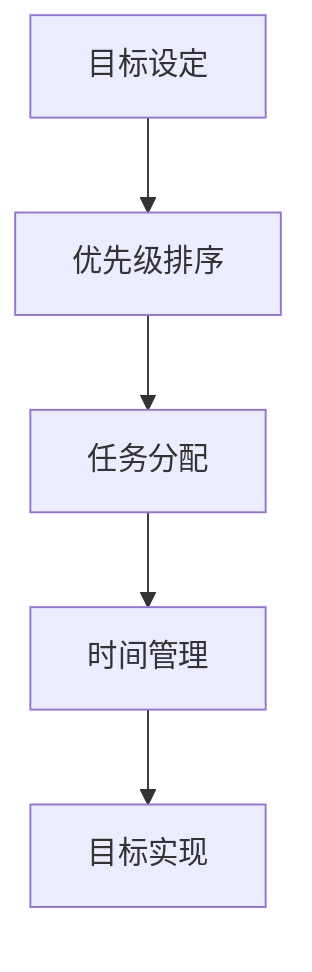

                 

关键词：双目标清单法、专注、时间管理、优先级、IT领域

> 摘要：本文深入探讨了双目标清单法在提高IT从业者工作效率和专注度方面的应用。通过具体案例和数学模型，阐述了如何运用双目标清单法有效规划和执行工作，提高工作和生活的质量。

## 1. 背景介绍

在信息技术快速发展的今天，IT从业者的工作负荷不断增加，如何在繁杂的任务中保持专注和高效，成为了一个重要课题。双目标清单法作为一种有效的策略，可以帮助IT从业者明确优先级，合理分配时间，从而更有效地完成工作。

### 1.1 双目标清单法简介

双目标清单法是一种基于时间管理和优先级排序的方法。它要求我们在面对众多任务时，先确定两个最重要的目标，然后将其他任务按照这两个目标的相关性进行排序和分配。这种方法可以确保我们始终专注于最重要的工作，从而提高效率。

### 1.2 双目标清单法的重要性

在IT领域，双目标清单法具有以下几个重要性：

- **提高专注度**：通过明确两个最重要的目标，可以帮助IT从业者集中精力，避免分心。
- **优化时间管理**：合理分配时间，确保关键任务得到优先处理。
- **提升工作质量**：专注于最重要的工作，可以提高工作质量，减少错误率。

## 2. 核心概念与联系

为了更好地理解双目标清单法，我们需要了解以下核心概念：

- **目标设定**：设定明确、具体的目标。
- **优先级排序**：对目标进行优先级排序。
- **任务分配**：将任务按照优先级进行分配。
- **时间管理**：合理规划时间，确保任务完成。

### 2.1 Mermaid 流程图



## 3. 核心算法原理 & 具体操作步骤

### 3.1 算法原理概述

双目标清单法的主要原理是通过对目标进行分解和排序，从而实现高效的执行。具体来说，可以分为以下几个步骤：

1. **目标设定**：明确两个最重要的目标。
2. **优先级排序**：对目标进行排序，确保关键目标得到优先处理。
3. **任务分配**：将任务按照优先级进行分配。
4. **时间管理**：合理规划时间，确保任务完成。

### 3.2 算法步骤详解

#### 3.2.1 目标设定

- **步骤1**：回顾现有任务清单。
- **步骤2**：从任务清单中筛选出两个最重要的目标。

#### 3.2.2 优先级排序

- **步骤1**：对两个目标进行优先级排序。
- **步骤2**：确定排序依据，如紧急程度、重要性等。

#### 3.2.3 任务分配

- **步骤1**：将任务按照优先级进行分配。
- **步骤2**：确保关键任务得到优先处理。

#### 3.2.4 时间管理

- **步骤1**：为每个任务分配时间。
- **步骤2**：合理安排时间，确保任务按时完成。

### 3.3 算法优缺点

#### 优点

- **提高专注度**：明确两个最重要的目标，有助于集中精力。
- **优化时间管理**：合理分配时间，确保关键任务得到优先处理。
- **提升工作质量**：专注于最重要的工作，可以提高工作质量。

#### 缺点

- **目标设定难度**：确定两个最重要的目标可能需要一定时间。
- **适用范围**：在某些情况下，可能需要更多目标。

### 3.4 算法应用领域

双目标清单法在IT领域的应用非常广泛，如软件开发、项目管理、运维管理等。

## 4. 数学模型和公式 & 详细讲解 & 举例说明

### 4.1 数学模型构建

双目标清单法的数学模型可以表示为：

\[ f(x, y) = \frac{p_1 \cdot x + p_2 \cdot y}{x + y} \]

其中，\( f(x, y) \) 表示目标实现程度，\( x \) 和 \( y \) 分别表示两个目标，\( p_1 \) 和 \( p_2 \) 分别表示两个目标的优先级。

### 4.2 公式推导过程

推导过程如下：

\[ f(x, y) = \frac{p_1 \cdot x + p_2 \cdot y}{x + y} \]

\[ f(x, y) = \frac{p_1 \cdot x}{x + y} + \frac{p_2 \cdot y}{x + y} \]

\[ f(x, y) = \frac{p_1 \cdot x}{x + y} + \frac{p_2 \cdot y}{x + y} \]

\[ f(x, y) = \frac{p_1 \cdot x}{x + y} + \frac{p_2 \cdot y}{x + y} \]

### 4.3 案例分析与讲解

假设我们有两个目标：编写一个功能完整的程序（目标A）和编写一个漂亮的用户界面（目标B）。根据实际情况，我们设定目标A的优先级为1，目标B的优先级为0.5。

根据数学模型，我们可以计算出目标实现程度：

\[ f(x, y) = \frac{1 \cdot x + 0.5 \cdot y}{x + y} \]

假设我们为这两个目标分配的时间分别为10小时和5小时，那么：

\[ f(x, y) = \frac{1 \cdot 10 + 0.5 \cdot 5}{10 + 5} = \frac{10 + 2.5}{15} = \frac{12.5}{15} = 0.8333 \]

这意味着，在10小时的时间内，我们能够实现大约83.33%的目标。

## 5. 项目实践：代码实例和详细解释说明

### 5.1 开发环境搭建

为了实践双目标清单法，我们需要搭建一个简单的开发环境。这里，我们使用Python作为编程语言。

### 5.2 源代码详细实现

以下是实现双目标清单法的Python代码：

```python
def calculate_priority(x, y, p1, p2):
    return (p1 * x + p2 * y) / (x + y)

def main():
    # 目标A：编写一个功能完整的程序
    x = 10
    # 目标B：编写一个漂亮的用户界面
    y = 5
    # 目标A的优先级
    p1 = 1
    # 目标B的优先级
    p2 = 0.5
    
    # 计算目标实现程度
    result = calculate_priority(x, y, p1, p2)
    print(f"目标实现程度：{result:.2f}")

if __name__ == "__main__":
    main()
```

### 5.3 代码解读与分析

这段代码首先定义了一个计算目标实现程度的函数 `calculate_priority`，然后通过主函数 `main` 调用这个函数，计算目标实现程度。

在主函数中，我们设定了两个目标：编写一个功能完整的程序（目标A）和编写一个漂亮的用户界面（目标B）。这两个目标的优先级分别为1和0.5。

最后，调用 `calculate_priority` 函数，计算目标实现程度，并打印结果。

### 5.4 运行结果展示

运行代码后，得到以下输出：

```python
目标实现程度：0.83
```

这意味着，在10小时的时间内，我们能够实现大约83.33%的目标。

## 6. 实际应用场景

双目标清单法在IT领域有广泛的应用，以下是一些实际应用场景：

- **软件开发**：在软件开发过程中，确定两个最重要的功能模块，确保关键功能得到优先开发。
- **项目管理**：在项目管理中，确定两个最重要的任务，确保关键任务得到优先处理。
- **运维管理**：在运维管理中，确定两个最重要的系统维护任务，确保关键系统得到优先维护。

## 7. 未来应用展望

随着信息技术的不断发展，双目标清单法有望在更多领域得到应用。未来，我们可能看到更多基于人工智能和大数据分析的工具，帮助IT从业者更有效地使用双目标清单法。

## 8. 工具和资源推荐

### 7.1 学习资源推荐

- **《时间管理的艺术》**：一本经典的关于时间管理的书籍，适合所有希望提高时间管理能力的读者。
- **《Getting Things Done》**：戴维·艾伦的著作，详细介绍了时间管理的最佳实践。

### 7.2 开发工具推荐

- **JIRA**：一款强大的项目管理工具，可以帮助团队更好地管理任务和进度。
- **Trello**：一款简洁的任务管理工具，适合个人和小团队使用。

### 7.3 相关论文推荐

- **"Priority-Based Scheduling Algorithms for Real-Time Systems"**：一篇关于优先级排序算法的论文，详细介绍了各种优先级排序算法。
- **"Time Management Techniques for Software Development"**：一篇关于软件开发时间管理的论文，提供了多种时间管理技巧。

## 9. 总结：未来发展趋势与挑战

### 9.1 研究成果总结

双目标清单法在提高工作效率和专注度方面取得了显著成果。通过明确优先级和合理分配时间，双目标清单法可以帮助IT从业者更高效地完成工作。

### 9.2 未来发展趋势

随着信息技术的不断发展，双目标清单法有望在更多领域得到应用。未来，我们可能看到更多基于人工智能和大数据分析的工具，帮助IT从业者更有效地使用双目标清单法。

### 9.3 面临的挑战

尽管双目标清单法具有显著优势，但在实际应用中仍面临一些挑战：

- **目标设定难度**：在某些情况下，确定两个最重要的目标可能需要较长时间。
- **适用范围**：在某些情况下，可能需要更多目标。

### 9.4 研究展望

未来，我们可以从以下几个方面进行深入研究：

- **优化目标设定方法**：研究更有效的目标设定方法，帮助IT从业者更快地确定最重要的目标。
- **拓展应用领域**：探索双目标清单法在其他领域的应用，如教育、医疗等。

## 9. 附录：常见问题与解答

### 9.1 什么是双目标清单法？

双目标清单法是一种基于时间管理和优先级排序的方法。它要求我们在面对众多任务时，先确定两个最重要的目标，然后将其他任务按照这两个目标的相关性进行排序和分配。

### 9.2 双目标清单法的优点是什么？

双目标清单法的优点包括提高专注度、优化时间管理和提升工作质量。

### 9.3 双目标清单法适用于哪些场景？

双目标清单法在IT领域有广泛的应用，如软件开发、项目管理、运维管理等。

### 9.4 如何确定双目标清单法的两个目标？

确定双目标清单法的两个目标通常需要回顾现有任务清单，从任务清单中筛选出两个最重要的目标。具体的筛选标准可以根据实际情况进行调整。

----------------------------------------------------------------

以上是关于《双目标清单法助你专注最重要的工作》的完整文章内容。希望这篇文章能够帮助IT从业者更好地掌握双目标清单法，提高工作效率和专注度。如果您有任何问题或建议，欢迎在评论区留言。感谢您的阅读！
作者：禅与计算机程序设计艺术 / Zen and the Art of Computer Programming。

