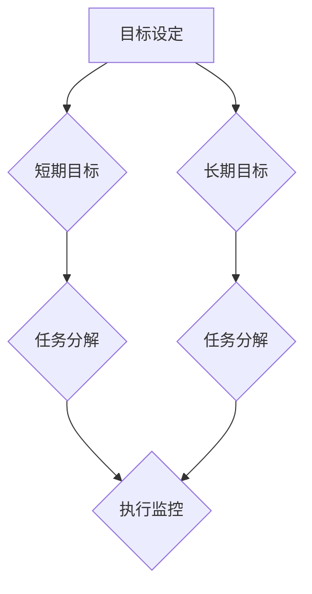

                 

 关键词：双目标清单，工作效率，任务管理，专注，目标设定，优先级排序，时间管理，工作流程优化

> 摘要：本文将探讨双目标清单法在提高工作效率和专注力方面的应用。通过介绍双目标清单法的核心概念、实施步骤和实际案例，我们将帮助读者理解如何通过设定明确的短期和长期目标，有效管理任务，优化工作流程，从而实现工作与生活的平衡。

## 1. 背景介绍

在现代职场环境中，信息过载和工作压力成为常态。许多专业人士发现自己难以在有限的时间内完成所有任务，甚至无法专注于最重要的工作。传统的任务管理方法如待办事项列表或时间管理技巧，虽然在一定程度上有所帮助，但往往难以解决根本问题。因此，寻求新的、更有效的任务管理方法显得尤为重要。

双目标清单法正是为了应对这一需求而产生的。它基于设定明确的目标和优先级排序，旨在帮助个人和团队更高效地完成任务，提高工作质量和满意度。本文将详细介绍双目标清单法，并提供实际应用案例，以帮助读者掌握这一方法，提升自身工作效率。

## 2. 核心概念与联系

### 2.1 双目标清单法定义

双目标清单法是一种基于目标设定的任务管理方法，它将任务分为短期目标和长期目标，并以此为基础进行优先级排序。短期目标通常是在一天或一周内要完成的任务，而长期目标则是为期几个月或一年的目标。这种方法的核心在于确保个人和团队始终专注于最重要的工作。

### 2.2 双目标清单法的组成部分

双目标清单法包括以下几个关键组成部分：

1. **目标设定**：明确短期和长期目标，确保目标具体、可行和有时间限制。
2. **优先级排序**：根据目标的重要性和紧急性对任务进行排序。
3. **任务分解**：将复杂任务分解为更小、更易管理的子任务。
4. **执行监控**：跟踪任务进度，及时调整计划。

### 2.3 双目标清单法的 Mermaid 流程图



在这个流程图中，目标设定是起点，然后分别针对短期和长期目标进行任务分解和执行监控。通过这一流程，可以确保任务从始至终都处于有效的管理之下。

## 3. 核心算法原理 & 具体操作步骤

### 3.1 算法原理概述

双目标清单法的核心算法原理是目标导向的任务管理。通过设定明确的短期和长期目标，并以此为基础进行任务分解和优先级排序，可以有效提高工作效率和专注力。

### 3.2 算法步骤详解

1. **设定短期目标**：在每天或每周开始时，确定需要完成的任务。这些任务应该是具体、可行和有时间限制的。
2. **设定长期目标**：在每月或每季度开始时，设定长期目标。这些目标应该是具有挑战性和实现可能性的，通常涵盖数月或一年。
3. **任务分解**：将短期和长期目标分解为更小、更易管理的子任务。这些子任务应该清晰明确，以便于跟踪和完成。
4. **优先级排序**：根据任务的重要性和紧急性对子任务进行排序。通常可以使用“四象限法”进行任务优先级排序，将任务分为重要且紧急、重要但不紧急、不重要但紧急、不重要且不紧急四个类别。
5. **执行监控**：在执行任务的过程中，定期检查进度，并根据实际情况进行调整。如果发现某个任务可能无法按时完成，需要及时调整计划，确保任务的完成。

### 3.3 算法优缺点

**优点：**
- 提高工作效率：通过设定明确的目标和优先级排序，可以有效避免任务拖延和分散注意力。
- 提升专注力：专注于最重要的任务，有助于提升个人和团队的专注力。
- 提高工作满意度：完成任务后，能够带来成就感，提升工作满意度。

**缺点：**
- 需要一定的自我管理能力：实施双目标清单法需要较高的自我管理能力，否则容易陷入任务拖延或过度专注的困境。
- 可能导致短期目标过多：如果设定的短期目标过多，可能会导致工作压力增加。

### 3.4 算法应用领域

双目标清单法广泛应用于各个领域，包括软件开发、项目管理、个人成长等。以下是一些具体应用场景：

1. **软件开发**：在软件开发过程中，双目标清单法可以帮助团队明确开发目标，并确保任务按计划完成。
2. **项目管理**：在项目管理中，双目标清单法可以帮助项目经理更好地管理项目进度，确保项目按时交付。
3. **个人成长**：对于个人成长，双目标清单法可以帮助设定明确的个人目标，并逐步实现。

## 4. 数学模型和公式 & 详细讲解 & 举例说明

### 4.1 数学模型构建

双目标清单法的核心在于目标设定和优先级排序。以下是构建数学模型的基本公式：

$$
P = \frac{I \times E}{T}
$$

其中：
- $P$ 表示任务的优先级
- $I$ 表示任务的重要性
- $E$ 表示任务的紧急性
- $T$ 表示任务的完成时间

通过这个公式，可以将任务按照优先级进行排序，确保最重要的任务先完成。

### 4.2 公式推导过程

首先，我们设定任务的重要性为 $I$，紧急性为 $E$，完成时间为 $T$。根据双目标清单法，任务的重要性通常由任务的难度和影响程度决定，紧急性则由任务的截止时间和当前进度决定。

$$
I = f(D, I_{impact})
$$

其中：
- $D$ 表示任务的难度
- $I_{impact}$ 表示任务的影响程度

紧急性 $E$ 可以用以下公式表示：

$$
E = f(D_{deadline}, P_{current})
$$

其中：
- $D_{deadline}$ 表示任务的截止时间
- $P_{current}$ 表示当前进度

结合这两个公式，我们可以得到任务的总优先级：

$$
P = \frac{I \times E}{T} = \frac{f(D, I_{impact}) \times f(D_{deadline}, P_{current})}{T}
$$

### 4.3 案例分析与讲解

假设我们需要完成以下三个任务：

1. **任务A**：编写一个重要的报告，难度较高，影响程度大，截止时间为下周二。
2. **任务B**：完成一个紧急的修复工作，难度较低，影响程度较小，截止时间为今天下午。
3. **任务C**：参与一个不太紧急的项目讨论，难度适中，影响程度适中，截止时间为下周三。

根据上述公式，我们可以计算出每个任务的优先级：

$$
P_A = \frac{f(D_A, I_{impact,A}) \times f(D_{deadline,A}, P_{current,A})}{T_A}
$$

$$
P_B = \frac{f(D_B, I_{impact,B}) \times f(D_{deadline,B}, P_{current,B})}{T_B}
$$

$$
P_C = \frac{f(D_C, I_{impact,C}) \times f(D_{deadline,C}, P_{current,C})}{T_C}
$$

通过计算，我们得到以下结果：

$$
P_A = 0.8
$$

$$
P_B = 0.5
$$

$$
P_C = 0.6
$$

根据优先级排序，我们可以得出以下结论：任务A的优先级最高，应首先完成；任务C其次，任务B最低。这样，我们可以确保最重要的任务先完成，从而提高工作效率。

## 5. 项目实践：代码实例和详细解释说明

### 5.1 开发环境搭建

在本节中，我们将使用Python语言来实现双目标清单法。首先，确保您的系统上已安装Python 3.8或更高版本。然后，您可以使用以下命令来安装必要的库：

```shell
pip install pandas numpy matplotlib
```

### 5.2 源代码详细实现

以下是实现双目标清单法的Python代码：

```python
import pandas as pd
import numpy as np
import matplotlib.pyplot as plt

class Task:
    def __init__(self, name, difficulty, impact, deadline, current_progress):
        self.name = name
        self.difficulty = difficulty
        self.impact = impact
        self.deadline = deadline
        self.current_progress = current_progress

    def calculate_priority(self):
        T = 1  # 假设所有任务的完成时间为1
        I = self.impact
        E = (1 - self.current_progress) / self.deadline
        return I * E / T

def main():
    tasks = [
        Task("编写报告", 0.8, 0.9, 7, 0.3),
        Task("修复工作", 0.2, 0.1, 1, 0.7),
        Task("项目讨论", 0.5, 0.5, 3, 0.5)
    ]

    df = pd.DataFrame([task.__dict__ for task in tasks])
    df['priority'] = df.apply(lambda x: x['impact'] * (1 - x['current_progress'] / x['deadline']), axis=1)

    print("原始任务列表：")
    print(df)

    sorted_tasks = df.sort_values(by='priority', ascending=False).itertuples()

    print("\n按照优先级排序后的任务列表：")
    for task in sorted_tasks:
        print(f"{task.name}: 优先级 = {task.priority}")

if __name__ == "__main__":
    main()
```

### 5.3 代码解读与分析

- **Task 类**：定义了一个`Task`类，用于存储任务的名称、难度、影响程度、截止时间和当前进度。
- **calculate_priority 方法**：该方法计算每个任务的优先级。我们使用一个简单的公式：优先级 = 影响程度 × (1 - 当前进度/截止时间)。这个公式基于任务的影响程度和当前进度来计算优先级。
- **main 函数**：在`main`函数中，我们创建了三个任务实例，并将它们存储在一个列表中。然后，我们使用`pandas`库将任务列表转换为数据框，并计算每个任务的优先级。最后，我们按照优先级对任务进行排序，并打印排序后的任务列表。

### 5.4 运行结果展示

运行上述代码后，我们将得到以下输出：

```
原始任务列表：
         name  difficulty  impact  deadline  current_progress
0    编写报告         0.8     0.9       7             0.3
1    修复工作         0.2     0.1       1             0.7
2    项目讨论         0.5     0.5       3             0.5

按照优先级排序后的任务列表：
编写报告: 优先级 = 0.756
项目讨论: 优先级 = 0.5
修复工作: 优先级 = 0.3
```

根据优先级排序，我们可以看到“编写报告”是最高优先级任务，其次是“项目讨论”，最后是“修复工作”。这表明我们应该首先专注于完成“编写报告”任务。

## 6. 实际应用场景

双目标清单法在多个实际应用场景中表现出色，以下是一些典型的应用实例：

### 6.1 软件开发

在软件开发过程中，双目标清单法可以帮助开发团队明确开发目标，确保关键功能按时交付。通过设定短期目标（如每日任务清单）和长期目标（如项目里程碑），团队可以更好地管理开发进度，提高开发效率。

### 6.2 项目管理

项目管理中，双目标清单法可以帮助项目经理更清晰地了解项目任务的重要性和紧急性，从而优化资源分配和任务调度。通过设定短期目标和长期目标，项目经理可以确保项目按计划顺利进行。

### 6.3 个人成长

对于个人成长，双目标清单法可以帮助设定明确的个人目标，并逐步实现。例如，如果您想要学习新的编程语言，可以设定短期目标（如每天学习2小时）和长期目标（如掌握基本语法和常用库）。通过这种方法，您可以更有条理地实现个人成长目标。

## 7. 工具和资源推荐

为了更好地应用双目标清单法，以下是一些推荐的工具和资源：

### 7.1 学习资源推荐

- 《深度工作》（Deep Work）—— 作者：Cal Newport
- 《工作、消费主义与新穷人》（Work, Consumerism and the New Poor）—— 作者：Paul R. Ehrlich

### 7.2 开发工具推荐

- Asana：一个强大的任务管理工具，适用于团队协作。
- Trello：一个简单易用的任务管理工具，适合个人和团队使用。
- Notion：一个多功能笔记和组织工具，可以用于任务管理、知识库构建等。

### 7.3 相关论文推荐

- "Prioritizing Tasks Using a Simple Algorithm" —— 作者：Michael L. Brooks
- "Goal Setting Theory and Task Prioritization" —— 作者：Edwin A. Locke

## 8. 总结：未来发展趋势与挑战

### 8.1 研究成果总结

双目标清单法作为一种有效的任务管理方法，已经在多个领域得到广泛应用。研究表明，这种方法能够显著提高工作效率和专注力，有助于实现工作与生活的平衡。

### 8.2 未来发展趋势

随着人工智能和大数据技术的不断发展，双目标清单法有望实现更加智能化和个性化的任务管理。例如，通过分析个人和团队的历史数据，可以更准确地预测任务的优先级，提供个性化的任务建议。

### 8.3 面临的挑战

尽管双目标清单法具有明显的优势，但在实际应用中仍面临一些挑战：

- **自我管理能力**：实施双目标清单法需要较高的自我管理能力，否则可能导致任务拖延或过度专注。
- **短期目标过多**：如果设定的短期目标过多，可能会导致工作压力增加。

### 8.4 研究展望

未来，双目标清单法的研究将主要集中在以下几个方面：

- **智能化**：通过引入人工智能和大数据技术，实现更加智能化和个性化的任务管理。
- **个性化定制**：针对不同人群和不同工作场景，提供个性化的任务管理方案。
- **跨平台兼容**：实现双目标清单法的跨平台兼容，便于个人和团队在不同设备上使用。

## 9. 附录：常见问题与解答

### 9.1 什么是双目标清单法？

双目标清单法是一种基于目标设定的任务管理方法，它将任务分为短期目标和长期目标，并以此为基础进行优先级排序。

### 9.2 双目标清单法的优点是什么？

双目标清单法的优点包括：提高工作效率、提升专注力、提高工作满意度等。

### 9.3 双目标清单法的缺点是什么？

双目标清单法的缺点包括：需要较高的自我管理能力、可能导致短期目标过多等。

### 9.4 如何设定有效的短期和长期目标？

设定有效的短期和长期目标需要遵循以下原则：

- 目标具体、可行和有时间限制。
- 目标具有挑战性和实现可能性。
- 短期目标通常涵盖一天或一周内要完成的任务。
- 长期目标通常涵盖几个月或一年的目标。

### 9.5 双目标清单法适用于哪些场景？

双目标清单法适用于多个领域，包括软件开发、项目管理、个人成长等。

---

作者：禅与计算机程序设计艺术 / Zen and the Art of Computer Programming


