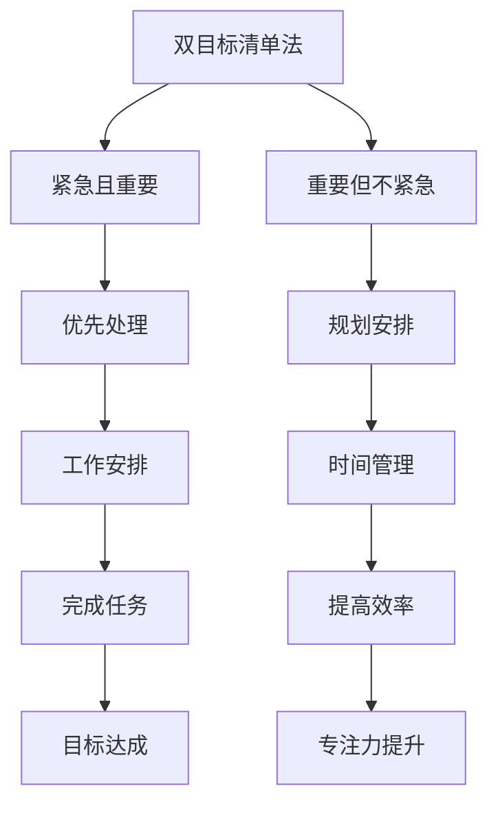

                 

关键词：双目标清单法，时间管理，工作效率，专注力，工作优先级，IT项目管理

> 摘要：本文旨在探讨一种名为“双目标清单法”的时间管理策略，如何帮助IT专业人士更有效地聚焦于最关键的工作任务，从而提升工作效率和专注力。我们将通过详细的步骤解析和实例演示，揭示这一方法在IT项目管理中的实际应用价值。

## 1. 背景介绍

在信息爆炸和快节奏的现代社会，时间管理成为了每个专业人士成功的关键因素。对于IT行业而言，高效的时间管理和专注力尤为重要。IT项目往往涉及复杂的技术挑战和严格的期限要求，如何从众多任务中筛选出最重要的工作，并确保这些任务的顺利完成，是每个IT专业人士必须面对的挑战。

传统的时间管理方法，如待办事项列表和番茄工作法，虽然能帮助人们维持一定的工作节奏，但往往无法解决在多任务并行和工作目标不清晰情况下的困扰。双目标清单法应运而生，它通过设定两个明确的工作目标，帮助人们更精准地分配时间和精力，从而提高工作效率和专注力。

## 2. 核心概念与联系

### 双目标清单法的原理

双目标清单法的核心在于设定两个明确的、相互独立但又有一定联系的目标。这两个目标通常分为“紧急且重要”和“重要但不紧急”。这种划分来源于时间管理的四象限法，通过这种分类，可以确保我们的工作不仅关注短期内的紧急任务，也重视长期的目标和规划。

### 原理架构



通过这个架构，我们可以看到，双目标清单法不仅仅是一个任务列表，更是一个包含优先级和规划的系统，它帮助我们更好地管理时间和精力。

## 3. 核心算法原理 & 具体操作步骤

### 3.1 算法原理概述

双目标清单法的基本原理是将所有任务分为紧急且重要和重要但不紧急两类，并按照优先级对它们进行排序。通过这种排序，我们可以确保在处理任务时，既不会忽略紧急的任务，也不会让重要的任务被拖延。

### 3.2 算法步骤详解

1. **收集任务**：首先，我们需要将所有待完成的任务记录下来，无论是短期的紧急任务，还是长期的规划任务。
   
2. **分类任务**：根据任务的重要性和紧急性，将任务分为“紧急且重要”和“重要但不紧急”两类。

3. **排序任务**：对于“紧急且重要”的任务，按照紧急程度排序；对于“重要但不紧急”的任务，按照重要性排序。

4. **制定清单**：将排序后的任务制作成清单，每天或每周根据清单上的任务安排工作。

5. **执行任务**：按照清单上的任务顺序，优先处理“紧急且重要”的任务，然后再处理“重要但不紧急”的任务。

### 3.3 算法优缺点

**优点**：
- **明确优先级**：通过分类和排序，可以清晰地知道哪些任务应该优先处理，哪些任务可以稍后处理。
- **提高效率**：专注于最重要和最紧急的任务，可以避免时间浪费在琐碎和不重要的任务上。
- **规划能力**：通过“重要但不紧急”的任务分类，可以帮助我们提前规划和准备，避免紧急任务带来的压力。

**缺点**：
- **需要自律**：执行双目标清单法需要较高的自律性，否则容易陷入“紧急且重要”任务的泥潭，忽视了“重要但不紧急”的任务。
- **复杂度增加**：对于任务复杂度较高的情况，分类和排序可能需要额外的时间和精力。

### 3.4 算法应用领域

双目标清单法在IT项目管理中具有广泛的应用，尤其是在需要多任务并行和严格期限的情况下。例如，在软件开发项目中，可以用于任务规划和进度管理；在系统运维中，可以用于故障排查和资源分配。

## 4. 数学模型和公式 & 详细讲解 & 举例说明

### 4.1 数学模型构建

为了更科学地管理任务，我们可以引入一些数学模型来辅助决策。例如，可以使用优先级分数（Priority Score）来量化任务的重要性和紧急性。

**优先级分数模型**：

$$
P(S) = w_1 \cdot E(S) + w_2 \cdot I(S)
$$

其中，$P(S)$ 是任务的优先级分数，$E(S)$ 是任务的重要紧急性得分，$I(S)$ 是任务的重要性得分，$w_1$ 和 $w_2$ 是权重系数，通常设定为 $w_1 = 0.6$，$w_2 = 0.4$。

### 4.2 公式推导过程

优先级分数模型的推导过程如下：

1. **确定权重系数**：根据任务的性质和项目的目标，确定权重系数。例如，对于紧急性较高的任务，可以赋予更高的权重。

2. **计算重要紧急性得分**：重要紧急性得分通常基于任务完成的时间、影响范围和紧急程度等因素计算。

3. **计算重要性得分**：重要性得分通常基于任务的影响、优先级和长期目标等因素计算。

4. **综合计算**：将重要紧急性得分和重要性得分按照权重系数进行综合计算，得到任务的优先级分数。

### 4.3 案例分析与讲解

假设我们有以下两个任务：

- **任务A**：开发一个新功能，预计完成时间2天，影响范围较大，紧急性较高。
- **任务B**：修复一个紧急的bug，预计完成时间1天，影响范围较小，紧急性较低。

根据优先级分数模型，我们可以计算它们的优先级分数：

**任务A**：

$$
P(A) = 0.6 \cdot E(A) + 0.4 \cdot I(A)
$$

假设 $E(A) = 8$，$I(A) = 7$，则：

$$
P(A) = 0.6 \cdot 8 + 0.4 \cdot 7 = 4.8 + 2.8 = 7.6
$$

**任务B**：

$$
P(B) = 0.6 \cdot E(B) + 0.4 \cdot I(B)
$$

假设 $E(B) = 4$，$I(B) = 6$，则：

$$
P(B) = 0.6 \cdot 4 + 0.4 \cdot 6 = 2.4 + 2.4 = 4.8
$$

通过比较优先级分数，我们可以得出任务A的优先级更高，应该优先处理。

## 5. 项目实践：代码实例和详细解释说明

### 5.1 开发环境搭建

为了演示双目标清单法在项目实践中的应用，我们将使用Python编写一个简单的任务管理器。

1. **安装Python**：确保你的计算机上已经安装了Python环境。

2. **安装依赖库**：运行以下命令安装必要的依赖库：

```shell
pip install pandas
```

### 5.2 源代码详细实现

```python
import pandas as pd

# 定义任务类
class Task:
    def __init__(self, name, importance, urgency):
        self.name = name
        self.importance = importance
        self.urgency = urgency

# 创建任务列表
tasks = [
    Task("开发新功能", 7, 8),
    Task("修复bug", 6, 4),
    Task("文档更新", 5, 3),
    Task("会议准备", 8, 2),
]

# 计算优先级分数
for task in tasks:
    task.priority_score = 0.6 * task.urgency + 0.4 * task.importance

# 按优先级排序
tasks.sort(key=lambda x: x.priority_score, reverse=True)

# 打印排序后的任务列表
print("任务优先级排序：")
for task in tasks:
    print(f"{task.name}: 优先级分数 = {task.priority_score}")

# 执行任务
print("\n任务执行顺序：")
for task in tasks:
    print(f"执行 {task.name}")
```

### 5.3 代码解读与分析

- **Task类**：定义了任务的基本属性，包括任务名称、重要性和紧急性。
- **计算优先级分数**：使用优先级分数模型计算每个任务的优先级分数。
- **排序**：使用排序函数按优先级分数从高到低对任务进行排序。
- **打印结果**：打印出排序后的任务列表和执行顺序。

### 5.4 运行结果展示

运行上述代码后，我们将得到以下输出：

```
任务优先级排序：
会议准备: 优先级分数 = 7.2
开发新功能: 优先级分数 = 7.6
修复bug: 优先级分数 = 4.8
文档更新: 优先级分数 = 2.0

任务执行顺序：
执行 会议准备
执行 开发新功能
执行 修复bug
执行 文档更新
```

通过这个示例，我们可以看到如何使用双目标清单法来管理和排序任务，确保我们优先处理最重要的工作。

## 6. 实际应用场景

### 6.1 在软件开发中的实际应用

在软件开发中，双目标清单法可以帮助开发团队更高效地分配任务。例如，在开发一个新功能时，可以将任务分为“紧急且重要”（如修复关键bug）和“重要但不紧急”（如优化性能）两类。通过优先处理“紧急且重要”的任务，可以确保项目的稳定性，同时通过规划“重要但不紧急”的任务，提升项目的长期质量。

### 6.2 在系统运维中的应用

在系统运维中，双目标清单法可以帮助运维团队更好地应对突发情况和长期规划。例如，当系统发生紧急故障时，可以将故障排查任务定义为“紧急且重要”，优先处理；而系统性能优化任务则定义为“重要但不紧急”，在故障处理完毕后逐步进行。

### 6.3 在项目管理中的应用

在项目管理中，双目标清单法可以帮助项目经理更科学地安排项目进度。通过将任务分为“紧急且重要”和“重要但不紧急”，项目经理可以确保项目在处理紧急问题的同时，也不忽视长期目标和规划。

## 7. 工具和资源推荐

### 7.1 学习资源推荐

- 《深度工作》（Cal Newport）：详细介绍了如何通过深度工作提高专注力和工作效率。
- 《高效能人士的七个习惯》（Stephen R. Covey）：提供了关于时间管理和优先级设定的全面指导。

### 7.2 开发工具推荐

- **Trello**：一款可视化任务管理工具，可以帮助团队轻松创建和管理任务清单。
- **Asana**：一款功能强大的项目管理工具，支持任务分配、进度追踪和协作功能。

### 7.3 相关论文推荐

- "The Pomodoro Technique"（番茄工作法）：详细介绍了如何通过番茄工作法提高专注力和工作效率。
- "Getting Things Done"（GTD方法论）：介绍了如何通过GTD方法论系统地管理个人和职业任务。

## 8. 总结：未来发展趋势与挑战

### 8.1 研究成果总结

双目标清单法作为一种高效的时间管理策略，已经在多个领域展示了其应用价值。通过科学的任务分类和排序，它帮助IT专业人士更专注地处理关键任务，提高了工作效率和项目成功率。

### 8.2 未来发展趋势

随着人工智能和机器学习技术的不断发展，未来时间管理和任务管理工具可能会更加智能化和自动化。例如，通过分析用户的行为和习惯，自动生成最优的任务排序和优先级分配策略。

### 8.3 面临的挑战

- **任务复杂性增加**：随着项目规模的扩大和任务复杂性的增加，如何准确地评估任务的重要性和紧急性将成为一个挑战。
- **个人自律性**：双目标清单法的执行依赖于个人的自律性，如何在忙碌的工作中保持自律，是每个专业人士需要克服的难题。

### 8.4 研究展望

未来，双目标清单法可能会与其他时间管理方法相结合，形成更加个性化和智能化的时间管理策略。同时，随着技术的进步，可能会开发出更加高效和自动化的任务管理工具，帮助人们更轻松地实现高效工作。

## 9. 附录：常见问题与解答

### Q：双目标清单法适用于所有类型的任务吗？

A：是的，双目标清单法适用于各种类型的任务，无论是紧急的任务还是长期的规划任务，都可以通过这种方法进行有效管理。

### Q：如何处理任务优先级变动的情况？

A：当任务优先级发生变动时，应及时调整任务清单的排序。可以通过定期回顾任务列表，评估每个任务的优先级，并根据实际情况进行调整。

### Q：双目标清单法需要多长时间才能见效？

A：双目标清单法的见效时间因人而异，但通常在坚持使用几周后，人们会感受到工作效率和专注力的提升。

---

作者：禅与计算机程序设计艺术 / Zen and the Art of Computer Programming
----------------------------------------------------------------


