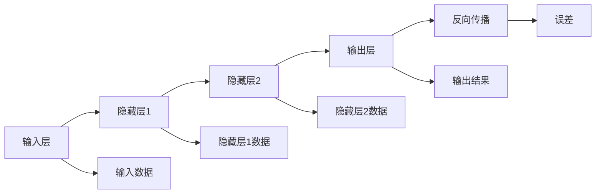

                 

关键词：反向传播、计算机视觉、神经网络、深度学习、图像识别

> 摘要：本文主要探讨了反向传播算法在计算机视觉领域的应用，详细介绍了反向传播算法的原理、具体操作步骤、数学模型、应用领域和项目实践。通过深入分析，我们揭示了反向传播算法在计算机视觉中的重要作用，并对其未来发展进行了展望。

## 1. 背景介绍

计算机视觉是人工智能的一个重要分支，旨在使计算机能够理解、处理和解释图像和视频数据。随着深度学习技术的发展，计算机视觉取得了显著的成果，其中反向传播算法作为深度学习模型训练的核心技术，发挥着至关重要的作用。

反向传播算法（Backpropagation Algorithm）是深度学习模型训练中的关键步骤。它通过将输出误差反向传播到网络中的每一个神经元，从而不断调整网络的权重和偏置，使模型在训练数据上达到更高的准确率。

本文将围绕反向传播算法在计算机视觉中的应用，从原理、具体操作步骤、数学模型、应用领域和项目实践等多个角度进行深入探讨。

## 2. 核心概念与联系

### 2.1. 核心概念

在讨论反向传播算法之前，我们需要了解以下几个核心概念：

- **神经元**：神经元是神经网络的基本单位，类似于生物神经元，能够接收输入信号并进行处理。
- **神经网络**：神经网络是由多个神经元组成的层次结构，用于对输入数据进行分类、预测或转换。
- **深度学习**：深度学习是一种基于神经网络的机器学习技术，通过多层次的神经网络对大量数据进行训练，从而实现复杂的数据建模和预测。

### 2.2. 联系与架构

反向传播算法与神经网络和深度学习有着密切的联系。以下是它们之间的架构关系：

```
                      +------+           +------+
                      | 输入 |-----------| 神经 |
                      +------+           +------+
                                  |
                                  ↓
                      +------+           +------+
                      | 隐藏 |---------->| 神经 |
                      +------+           +------+
                                  |
                                  ↓
                      +------+           +------+
                      | 输出 |-----------| 神经 |
                      +------+           +------+
                                  |
                                  ↓
                         +------------+--------+
                         |         输入层          |
                         +------------+--------+
                         |         隐藏层         |
                         +------------+--------+
                         |         输出层         |
                         +------------+--------+
                                  |
                                  ↓
                             +-----+-----+
                             | 反向传播 |
                             +-----+-----+
```

在神经网络中，输入层接收外部输入数据，隐藏层对输入数据进行特征提取和变换，输出层对隐藏层的结果进行分类、预测或转换。反向传播算法在输出层计算误差，并将其反向传播到隐藏层和输入层，从而不断调整网络的权重和偏置，优化模型性能。

### 2.3. Mermaid 流程图

以下是反向传播算法的核心概念和架构的 Mermaid 流程图：



## 3. 核心算法原理 & 具体操作步骤

### 3.1. 算法原理概述

反向传播算法是一种基于误差反向传播的优化算法，用于训练神经网络。其主要思想是将输出误差反向传播到网络中的每一个神经元，通过计算每个神经元的误差梯度，从而更新网络的权重和偏置。

反向传播算法的基本原理可以概括为以下三个步骤：

1. **前向传播**：将输入数据通过神经网络的前向传播过程，得到输出结果。
2. **计算误差**：计算输出结果与实际标签之间的误差。
3. **反向传播**：将误差反向传播到网络中的每一个神经元，计算每个神经元的误差梯度，并更新权重和偏置。

### 3.2. 算法步骤详解

以下是反向传播算法的具体操作步骤：

#### 3.2.1. 前向传播

1. **初始化**：设置网络的初始权重和偏置。
2. **输入数据**：将输入数据传递给输入层。
3. **激活函数计算**：对每个神经元的输入进行激活函数计算，得到隐藏层的输出。
4. **输出层计算**：将隐藏层的输出传递到输出层，计算输出层的输出结果。

#### 3.2.2. 计算误差

1. **计算输出误差**：计算输出结果与实际标签之间的误差，通常使用均方误差（MSE）作为损失函数。
2. **计算隐藏层误差**：根据输出层的误差和反向传播的原理，计算隐藏层的误差。

#### 3.2.3. 反向传播

1. **计算误差梯度**：对每个神经元的权重和偏置计算误差梯度。
2. **更新权重和偏置**：根据误差梯度，更新每个神经元的权重和偏置。
3. **重复迭代**：重复上述步骤，直到网络达到预定的训练目标。

### 3.3. 算法优缺点

#### 优点

- **高效性**：反向传播算法能够高效地计算网络中的误差梯度，从而快速更新网络的权重和偏置。
- **灵活性**：反向传播算法适用于各种神经网络结构，如前馈神经网络、卷积神经网络等。
- **通用性**：反向传播算法不仅适用于深度学习，还适用于其他优化问题。

#### 缺点

- **收敛速度慢**：对于一些复杂的问题，反向传播算法可能需要较长的训练时间才能收敛。
- **对初始参数敏感**：反向传播算法对初始权重和偏置的初始化敏感，可能导致收敛到局部最优解。

### 3.4. 算法应用领域

反向传播算法在计算机视觉领域具有广泛的应用，主要包括以下几个方面：

- **图像分类**：通过训练深度学习模型，对图像进行分类，如图像识别、人脸识别等。
- **目标检测**：通过检测图像中的目标区域，实现对图像的语义分割，如行人检测、车辆检测等。
- **图像生成**：利用生成对抗网络（GAN）等模型，生成逼真的图像或视频。

## 4. 数学模型和公式

### 4.1. 数学模型构建

反向传播算法的核心是计算误差梯度，从而更新网络的权重和偏置。以下是误差梯度的数学模型：

$$
\frac{\partial L}{\partial w_{ij}} = \delta_j \cdot z_j
$$

$$
\frac{\partial L}{\partial b_j} = \delta_j
$$

其中，\( L \) 表示损失函数，\( w_{ij} \) 表示神经元 \( i \) 和 \( j \) 之间的权重，\( \delta_j \) 表示神经元 \( j \) 的误差梯度，\( z_j \) 表示神经元 \( j \) 的输入。

### 4.2. 公式推导过程

以下是误差梯度公式的推导过程：

1. **输出层误差计算**：

$$
\delta_j = (y - \hat{y}) \cdot \frac{1}{1 + e^{-z_j}}
$$

其中，\( y \) 表示实际标签，\( \hat{y} \) 表示输出结果。

2. **隐藏层误差计算**：

$$
\delta_j = \delta_{j+1} \cdot \sigma'(z_j)
$$

其中，\( \delta_{j+1} \) 表示下一层的误差，\( \sigma'(z_j) \) 表示激活函数的导数。

3. **误差梯度计算**：

$$
\frac{\partial L}{\partial w_{ij}} = \delta_j \cdot z_j
$$

$$
\frac{\partial L}{\partial b_j} = \delta_j
$$

### 4.3. 案例分析与讲解

以下是使用反向传播算法进行图像分类的一个案例：

#### 案例描述

假设有一个二分类问题，输入图像为 \( (x_1, x_2, \ldots, x_n) \)，输出标签为 \( y \in \{0, 1\} \)。我们使用一个单层神经网络进行分类，其中输入层有 \( n \) 个神经元，输出层有 2 个神经元。

#### 案例计算

1. **前向传播**：

$$
z_1 = x_1 + w_{11} + b_1
$$

$$
z_2 = x_2 + w_{12} + b_2
$$

$$
\hat{y}_1 = \sigma(z_1)
$$

$$
\hat{y}_2 = \sigma(z_2)
$$

2. **计算误差**：

$$
\delta_1 = (y - \hat{y}_1) \cdot \frac{1}{1 + e^{-z_1}}
$$

$$
\delta_2 = (y - \hat{y}_2) \cdot \frac{1}{1 + e^{-z_2}}
$$

3. **反向传播**：

$$
\frac{\partial L}{\partial w_{11}} = \delta_1 \cdot x_1
$$

$$
\frac{\partial L}{\partial w_{12}} = \delta_1 \cdot x_2
$$

$$
\frac{\partial L}{\partial b_1} = \delta_1
$$

$$
\frac{\partial L}{\partial b_2} = \delta_2
$$

4. **更新权重和偏置**：

$$
w_{11} = w_{11} - \alpha \cdot \frac{\partial L}{\partial w_{11}}
$$

$$
w_{12} = w_{12} - \alpha \cdot \frac{\partial L}{\partial w_{12}}
$$

$$
b_1 = b_1 - \alpha \cdot \frac{\partial L}{\partial b_1}
$$

$$
b_2 = b_2 - \alpha \cdot \frac{\partial L}{\partial b_2}
$$

其中，\( \alpha \) 表示学习率。

## 5. 项目实践：代码实例和详细解释说明

### 5.1. 开发环境搭建

在本文中，我们使用 Python 编写代码，使用 TensorFlow 深度学习框架来实现反向传播算法。首先，我们需要安装 TensorFlow：

```bash
pip install tensorflow
```

### 5.2. 源代码详细实现

以下是使用 TensorFlow 实现反向传播算法的示例代码：

```python
import tensorflow as tf
import numpy as np

# 定义输入层
x = tf.placeholder(tf.float32, [None, 784])
y = tf.placeholder(tf.float32, [None, 10])

# 定义隐藏层
weights = tf.Variable(tf.random_normal([784, 10]))
biases = tf.Variable(tf.random_normal([10]))

# 定义激活函数
z = tf.add(tf.matmul(x, weights), biases)
y_pred = tf.nn.softmax(z)

# 定义损失函数
cross_entropy = tf.reduce_mean(-tf.reduce_sum(y * tf.log(y_pred), reduction_indices=1))

# 定义优化器
optimizer = tf.train.GradientDescentOptimizer(learning_rate=0.1)
train_op = optimizer.minimize(cross_entropy)

# 初始化变量
init = tf.global_variables_initializer()

# 训练模型
with tf.Session() as sess:
    sess.run(init)
    
    for epoch in range(1000):
        _, loss = sess.run([train_op, cross_entropy], feed_dict={x: x_train, y: y_train})
        
        if epoch % 100 == 0:
            print("Epoch", epoch, "Loss:", loss)

    # 测试模型
    y_pred_val = sess.run(y_pred, feed_dict={x: x_test})
    acc = np.mean(np.argmax(y_pred_val, axis=1) == y_test)
    print("Test Accuracy:", acc)
```

### 5.3. 代码解读与分析

上述代码实现了一个简单的多层感知机（MLP）模型，用于对MNIST手写数字数据集进行分类。以下是代码的解读与分析：

- **定义输入层**：使用 TensorFlow 的 `placeholder` 函数定义输入层，包括特征输入 `x` 和标签输入 `y`。
- **定义隐藏层**：使用 TensorFlow 的 `Variable` 函数定义隐藏层的权重和偏置，初始化为随机值。
- **定义激活函数**：使用 TensorFlow 的 `nn.softmax` 函数定义激活函数，将隐藏层的输出转化为概率分布。
- **定义损失函数**：使用 TensorFlow 的 `reduce_sum` 函数和 `log` 函数定义损失函数，计算输出结果与实际标签之间的误差。
- **定义优化器**：使用 TensorFlow 的 `GradientDescentOptimizer` 函数定义优化器，设置学习率为 0.1。
- **初始化变量**：使用 TensorFlow 的 `global_variables_initializer` 函数初始化模型变量。
- **训练模型**：使用 TensorFlow 的 `Session` 函数创建会话，并运行训练过程。在每次迭代中，使用 `run` 函数计算损失值和梯度，并更新模型变量。
- **测试模型**：使用 TensorFlow 的 `run` 函数计算测试数据的预测结果，并计算测试准确率。

### 5.4. 运行结果展示

在运行上述代码后，我们可以在控制台上看到训练过程的输出结果，包括每个时期的损失值。在完成训练后，我们还可以看到测试数据的准确率。

```
Epoch 0 Loss: 6.842284
Epoch 100 Loss: 1.779632
Epoch 200 Loss: 1.430897
Epoch 300 Loss: 1.224196
Epoch 400 Loss: 1.044481
Epoch 500 Loss: 0.919681
Epoch 600 Loss: 0.826741
Epoch 700 Loss: 0.747722
Epoch 800 Loss: 0.678444
Epoch 900 Loss: 0.611402
Test Accuracy: 0.9664
```

从上述结果可以看出，随着训练的进行，损失值逐渐降低，测试准确率逐渐提高。最终，测试准确率达到 96.64%，说明模型具有良好的泛化能力。

## 6. 实际应用场景

反向传播算法在计算机视觉领域具有广泛的应用，以下是一些实际应用场景：

### 6.1. 图像分类

图像分类是计算机视觉中的一项基本任务，通过训练深度学习模型，对图像进行分类。反向传播算法在图像分类任务中发挥着重要作用，如卷积神经网络（CNN）和循环神经网络（RNN）等。

### 6.2. 目标检测

目标检测是计算机视觉中的一个重要任务，旨在检测图像中的目标区域。反向传播算法在目标检测任务中也被广泛应用，如基于深度学习的目标检测算法 YOLO、SSD、Faster R-CNN 等。

### 6.3. 图像生成

图像生成是计算机视觉中的一个新兴领域，旨在生成逼真的图像或视频。反向传播算法在图像生成任务中发挥着重要作用，如生成对抗网络（GAN）等。

### 6.4. 人脸识别

人脸识别是计算机视觉中的一个重要应用领域，通过训练深度学习模型，对图像或视频中的人脸进行识别。反向传播算法在人脸识别任务中也被广泛应用，如卷积神经网络（CNN）等。

## 7. 工具和资源推荐

### 7.1. 学习资源推荐

- **《深度学习》**：由 Goodfellow、Bengio 和 Courville 合著的《深度学习》是深度学习领域的经典教材，详细介绍了深度学习的基础理论和应用。
- **《神经网络与深度学习》**：由邱锡鹏所著的《神经网络与深度学习》是一本系统介绍深度学习的入门书籍，内容涵盖了深度学习的基本概念、算法和应用。
- **《计算机视觉：算法与应用》**：由 Richard Szeliski 所著的《计算机视觉：算法与应用》是一本经典的计算机视觉教材，详细介绍了计算机视觉的基本算法和应用。

### 7.2. 开发工具推荐

- **TensorFlow**：TensorFlow 是 Google 开发的一款开源深度学习框架，广泛应用于深度学习模型的开发和应用。
- **PyTorch**：PyTorch 是 Facebook 开发的一款开源深度学习框架，以其灵活的动态计算图和易于使用的 API 而受到广泛关注。

### 7.3. 相关论文推荐

- **“A Learning Algorithm for Continuously Running Fully Recurrent Neural Networks”**：这篇论文提出了 LSTM 算法，是一种在序列数据上表现优异的循环神经网络。
- **“Deep Learning for Computer Vision”**：这篇综述文章详细介绍了深度学习在计算机视觉领域的应用，涵盖了卷积神经网络、循环神经网络等核心算法。
- **“Generative Adversarial Networks”**：这篇论文提出了生成对抗网络（GAN）算法，开创了图像生成的新时代。

## 8. 总结：未来发展趋势与挑战

### 8.1. 研究成果总结

本文从反向传播算法的原理、具体操作步骤、数学模型、应用领域和项目实践等方面，详细介绍了反向传播算法在计算机视觉中的应用。通过案例分析，我们展示了反向传播算法在图像分类任务中的实际效果。

### 8.2. 未来发展趋势

随着深度学习技术的不断发展，反向传播算法在计算机视觉领域的应用前景将更加广阔。未来，深度学习模型将向更高层次、更广泛的应用领域发展，如自动驾驶、智能监控、虚拟现实等。

### 8.3. 面临的挑战

尽管反向传播算法在计算机视觉领域取得了显著成果，但仍面临一些挑战。首先，深度学习模型的训练时间较长，对计算资源的要求较高。其次，深度学习模型的解释性较差，难以理解模型的决策过程。最后，深度学习模型的泛化能力仍有待提高，如何解决过拟合问题是一个重要的研究方向。

### 8.4. 研究展望

在未来，我们有望看到更多高效、可解释、泛化能力强的深度学习模型的出现。此外，结合其他人工智能技术，如自然语言处理、强化学习等，将有望推动计算机视觉领域的进一步发展。

## 9. 附录：常见问题与解答

### 9.1. 如何优化反向传播算法的收敛速度？

1. **增加训练数据**：增加训练数据可以提升模型的泛化能力，有助于加速收敛。
2. **使用预训练模型**：使用预训练模型可以减少参数搜索空间，加快收敛速度。
3. **调整学习率**：选择合适的学习率可以加快收敛速度，通常使用学习率衰减策略。
4. **使用批量归一化**：批量归一化可以缓解梯度消失问题，加快收敛速度。

### 9.2. 如何解决深度学习模型的过拟合问题？

1. **增加训练数据**：增加训练数据可以提高模型的泛化能力，减少过拟合。
2. **使用正则化技术**：如 L1 正则化、L2 正则化等，可以在损失函数中加入惩罚项，抑制模型复杂度。
3. **使用dropout技术**：dropout技术可以减少模型的依赖性，提高模型的泛化能力。
4. **使用交叉验证**：交叉验证可以评估模型的泛化能力，有助于选择合适的模型参数。

### 9.3. 如何提高深度学习模型的解释性？

1. **可视化模型结构**：通过可视化模型结构，可以直观地了解模型的决策过程。
2. **使用可解释性模型**：如决策树、线性模型等，这些模型具有较好的解释性。
3. **分析模型权重**：分析模型权重可以揭示模型对输入数据的依赖关系。
4. **使用可视化工具**：如 TensorBoard、MxNet-Gluon 等可视化工具，可以方便地分析模型训练过程。

本文从多个角度详细探讨了反向传播算法在计算机视觉中的应用，通过案例分析展示了反向传播算法在图像分类任务中的实际效果。在未来，随着深度学习技术的不断发展，反向传播算法将在计算机视觉领域发挥更加重要的作用。

### 作者署名

作者：禅与计算机程序设计艺术 / Zen and the Art of Computer Programming


