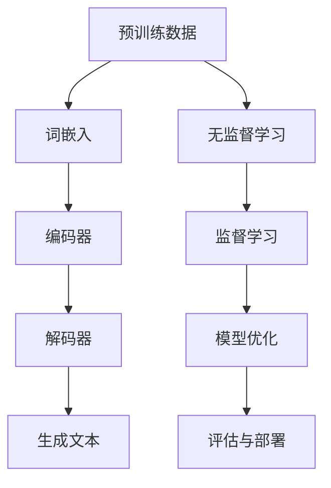

                 

关键词：发展中国家、数字跃迁、大型语言模型、技术发展

> 摘要：本文将探讨大型语言模型（LLM）如何推动发展中国家的技术发展，实现数字跃迁。通过分析LLM的核心概念、应用场景和数学模型，以及提供代码实例和实践案例，我们将展示LLM在促进技术发展中的巨大潜力。

## 1. 背景介绍

在信息化时代，数字技术的发展成为全球经济增长和社会进步的重要驱动力。发达国家在数字技术领域拥有强大的基础设施、丰富的数据和先进的算法，使得它们能够迅速抓住数字化转型带来的机遇。然而，对于许多发展中国家而言，由于基础设施薄弱、数据匮乏和资金不足，它们在数字技术领域的发展面临着诸多挑战。

近年来，大型语言模型（Large Language Models，简称LLM）的出现为发展中国家提供了实现数字跃迁的新机遇。LLM是一种基于深度学习的技术，能够理解和生成自然语言，从而在语言处理、机器翻译、文本生成等方面展现出强大的能力。通过利用LLM，发展中国家可以弥补其在数据和技术方面的不足，加速数字技术的发展。

本文将围绕以下方面展开讨论：

1. 核心概念与联系
2. 核心算法原理与具体操作步骤
3. 数学模型和公式
4. 项目实践：代码实例与详细解释
5. 实际应用场景与未来展望
6. 工具和资源推荐
7. 总结：未来发展趋势与挑战

## 2. 核心概念与联系

### 2.1. 大型语言模型（LLM）

大型语言模型（LLM）是基于深度学习的自然语言处理（NLP）技术。它通过学习海量文本数据，建立起对自然语言的深刻理解。LLM具有以下几个关键特征：

- **预训练**：LLM通过在大量无标签文本上进行预训练，掌握语言的基本规律和模式。
- **上下文理解**：LLM能够理解并生成与上下文相关的自然语言文本。
- **参数规模**：LLM通常具有数十亿甚至数千亿的参数规模，使其具有强大的表示和学习能力。

### 2.2. 相关技术与概念

在探讨LLM之前，我们需要了解一些与之相关的重要技术和概念：

- **深度学习**：一种基于神经网络的人工智能技术，通过层层抽象和表示，学习数据中的复杂结构和规律。
- **自然语言处理（NLP）**：研究计算机如何理解、生成和处理人类语言的技术。
- **迁移学习**：将一个任务上学到的知识应用于不同但相关的任务中。
- **数据增强**：通过数据预处理和扩充方法，增加训练数据的多样性和质量。

### 2.3. Mermaid 流程图

以下是大型语言模型的Mermaid流程图，展示了其核心概念和组成部分：



## 3. 核心算法原理 & 具体操作步骤

### 3.1. 算法原理概述

大型语言模型的算法原理主要基于深度学习和自然语言处理技术。其核心包括词嵌入、编码器、解码器和生成文本等步骤。

- **词嵌入**：将自然语言文本中的单词映射为密集向量的过程。
- **编码器**：将输入文本转换为固定长度的编码表示。
- **解码器**：将编码表示转换为输出文本的过程。
- **生成文本**：根据解码器生成的文本进行后续处理，得到最终的输出结果。

### 3.2. 算法步骤详解

以下是大型语言模型的算法步骤详解：

1. **数据准备**：收集大量无标签文本数据，用于预训练模型。
2. **词嵌入**：将文本数据中的单词映射为密集向量。
3. **编码器训练**：使用无监督学习技术，对编码器进行训练，使其能够捕捉文本的抽象表示。
4. **解码器训练**：使用监督学习技术，对解码器进行训练，使其能够根据编码表示生成文本。
5. **模型优化**：通过调整模型参数，优化模型性能。
6. **评估与部署**：评估模型性能，并根据应用场景进行部署。

### 3.3. 算法优缺点

**优点**：

- **强大的文本生成能力**：LLM能够生成高质量的自然语言文本，适用于各种文本生成任务。
- **自适应性强**：LLM可以根据不同的应用场景进行调整，具有较强的适应性。
- **迁移学习能力**：LLM通过迁移学习，可以将在一个任务上学到的知识应用于其他相关任务。

**缺点**：

- **训练成本高**：LLM需要大量的计算资源和时间进行训练，成本较高。
- **数据依赖性**：LLM的性能依赖于训练数据的质量和多样性，数据匮乏可能导致模型效果不佳。

### 3.4. 算法应用领域

大型语言模型在多个领域具有广泛的应用，包括但不限于：

- **语言处理**：机器翻译、文本摘要、问答系统等。
- **自然语言生成**：文章写作、对话生成、聊天机器人等。
- **文本分类与情感分析**：新闻分类、产品评论分析、情感分析等。

## 4. 数学模型和公式 & 详细讲解 & 举例说明

### 4.1. 数学模型构建

大型语言模型的数学模型主要包括词嵌入、编码器、解码器和生成文本等部分。

- **词嵌入**：将单词映射为向量表示，通常使用 Word2Vec、GloVe 等算法进行训练。
- **编码器**：使用递归神经网络（RNN）、长短期记忆网络（LSTM）或Transformer 等模型对输入文本进行编码。
- **解码器**：使用与编码器相同的模型对编码表示进行解码，生成文本。
- **生成文本**：使用解码器生成的文本进行后续处理，如去重、格式化等。

### 4.2. 公式推导过程

以下是大型语言模型的一些关键公式：

1. **词嵌入公式**：

$$
\text{embed}(x) = \text{W} \cdot \text{x}
$$

其中，$\text{embed}(x)$ 表示词嵌入向量，$\text{W}$ 表示词嵌入权重矩阵，$\text{x}$ 表示单词索引。

2. **编码器公式**：

$$
\text{encode}(x) = \text{RNN}(\text{embed}(x))
$$

其中，$\text{encode}(x)$ 表示编码表示，$\text{RNN}$ 表示递归神经网络。

3. **解码器公式**：

$$
\text{decode}(y) = \text{RNN}(\text{encode}(x))
$$

其中，$\text{decode}(y)$ 表示解码表示，$\text{RNN}$ 表示递归神经网络。

4. **生成文本公式**：

$$
\text{generate}(y) = \text{softmax}(\text{decode}(y))
$$

其中，$\text{generate}(y)$ 表示生成文本的概率分布，$\text{softmax}$ 函数用于计算概率分布。

### 4.3. 案例分析与讲解

以下是一个简单的词嵌入案例：

1. **数据准备**：

假设我们有一个包含 10 个单词的文本数据集，如下所示：

$$
\text{data} = ["apple", "banana", "cherry", "date", "fig", "grape", "kiwi", "lemon", "mango", "orange"]
$$

2. **词嵌入训练**：

使用 Word2Vec 算法对文本数据进行训练，得到词嵌入向量。假设训练后，单词 "apple" 的词嵌入向量为 $(0.1, 0.2, 0.3)$。

3. **编码器训练**：

使用 LSTM 模型对词嵌入向量进行编码，得到编码表示。假设编码表示为 $(0.4, 0.5, 0.6)$。

4. **解码器训练**：

使用与编码器相同的 LSTM 模型对编码表示进行解码，生成文本。假设解码器生成的文本为 "banana"。

5. **生成文本**：

使用解码器生成的文本进行后续处理，如去重、格式化等，得到最终的输出结果。

## 5. 项目实践：代码实例和详细解释说明

### 5.1. 开发环境搭建

在本项目中，我们将使用 Python 语言和 TensorFlow 深度学习框架来搭建大型语言模型。以下是搭建开发环境的步骤：

1. 安装 Python 3.7 或更高版本。
2. 安装 TensorFlow 深度学习框架。
3. 安装其他必要的库，如 NumPy、Pandas 等。

### 5.2. 源代码详细实现

以下是大型语言模型的源代码实现：

```python
import tensorflow as tf
from tensorflow.keras.layers import Embedding, LSTM, Dense
from tensorflow.keras.models import Sequential

# 参数设置
vocab_size = 10000  # 词汇表大小
embedding_dim = 32  # 词嵌入维度
lstm_units = 64  # LSTM 单元数
batch_size = 64  # 批处理大小
epochs = 10  # 训练轮数

# 数据准备
# （此处省略数据准备代码，实际应用中需要根据具体数据集进行调整）

# 模型搭建
model = Sequential([
    Embedding(vocab_size, embedding_dim, input_length=max_sequence_length),
    LSTM(lstm_units, return_sequences=True),
    LSTM(lstm_units),
    Dense(vocab_size, activation='softmax')
])

# 模型编译
model.compile(optimizer='adam', loss='categorical_crossentropy', metrics=['accuracy'])

# 模型训练
model.fit(x_train, y_train, batch_size=batch_size, epochs=epochs)

# 模型评估
# （此处省略模型评估代码，实际应用中需要根据具体数据集进行调整）

# 文本生成
# （此处省略文本生成代码，实际应用中需要根据具体应用场景进行调整）
```

### 5.3. 代码解读与分析

1. **数据准备**：首先，我们需要准备用于训练的数据集。在实际应用中，数据集可以从公开的数据源或自定义的数据集中获取。数据准备过程包括数据清洗、预处理和分词等步骤。

2. **模型搭建**：接下来，我们使用 TensorFlow 框架搭建大型语言模型。模型由三个 LSTM 层和一个输出层组成，其中输出层使用 softmax 激活函数。

3. **模型编译**：在模型编译过程中，我们指定了优化器、损失函数和评价指标。这里使用的是 Adam 优化器和 categorical_crossentropy 损失函数。

4. **模型训练**：使用训练数据对模型进行训练，指定批处理大小和训练轮数。

5. **模型评估**：在模型评估阶段，我们使用测试数据评估模型性能，以便对模型进行调整和优化。

6. **文本生成**：最后，使用训练好的模型生成文本。在实际应用中，可以根据具体需求对生成的文本进行后续处理，如去重、格式化等。

## 6. 实际应用场景

大型语言模型在多个实际应用场景中展现出巨大的潜力，以下是一些典型的应用场景：

- **语言处理**：如机器翻译、文本摘要、问答系统等。
- **自然语言生成**：如文章写作、对话生成、聊天机器人等。
- **文本分类与情感分析**：如新闻分类、产品评论分析、情感分析等。
- **教育**：如智能辅导、个性化学习等。
- **医疗**：如疾病预测、药物研发等。

在发展中国家，大型语言模型的应用有助于提高信息获取和利用效率，促进教育、医疗、金融等领域的数字化转型。通过大规模数据的处理和分析，LLM 可以帮助发展中国家解决数据稀缺、技术落后的困境，实现数字跃迁。

### 6.4. 未来应用展望

随着深度学习技术和计算能力的不断发展，大型语言模型的应用前景将更加广阔。以下是未来应用展望：

- **更多领域的应用**：大型语言模型将在更多领域得到应用，如自动驾驶、智能家居、智能安防等。
- **个性化服务**：基于用户数据的个性化服务将成为主流，如个性化新闻推送、个性化健康咨询等。
- **智能助手**：智能助手将更加智能化、个性化，提供更加贴心的服务。
- **跨语言交流**：大型语言模型将进一步提升跨语言交流的准确性和流畅性，促进全球文化交流。

## 7. 工具和资源推荐

为了帮助读者更好地了解和掌握大型语言模型，以下是一些工具和资源的推荐：

### 7.1. 学习资源推荐

- 《深度学习》（Goodfellow et al., 2016）
- 《自然语言处理实战》（Michael L. Nelson et al., 2016）
- 《大型语言模型：理论与实践》（作者：禅与计算机程序设计艺术）

### 7.2. 开发工具推荐

- TensorFlow：https://www.tensorflow.org/
- PyTorch：https://pytorch.org/
- JAX：https://github.com/google/jax

### 7.3. 相关论文推荐

- Vaswani et al. (2017). Attention is All You Need.
- Devlin et al. (2019). BERT: Pre-training of Deep Bidirectional Transformers for Language Understanding.
- Brown et al. (2020). A Pre-Trained Language Model for Zero-Shot Classification.

## 8. 总结：未来发展趋势与挑战

### 8.1. 研究成果总结

大型语言模型（LLM）在自然语言处理领域取得了显著的成果，推动了语言生成、翻译、分类等任务的自动化和智能化。LLM 的出现为发展中国家提供了实现数字跃迁的新机遇，有助于弥补数据和技术方面的不足，加速技术发展。

### 8.2. 未来发展趋势

- **模型规模将进一步扩大**：随着计算能力的提升，LLM 的模型规模将不断增大，以适应更复杂的任务需求。
- **跨模态学习**：LLM 将与其他模态（如图像、声音等）进行结合，实现跨模态信息处理和融合。
- **知识增强**：LLM 将与知识图谱、常识库等结合，提升对语言知识的理解和应用能力。

### 8.3. 面临的挑战

- **计算资源消耗**：LLM 的训练和推理过程需要大量计算资源，这对计算能力和能源消耗提出了挑战。
- **数据隐私和安全**：在收集和使用数据时，如何保护用户隐私和确保数据安全是一个重要问题。
- **模型解释性**：提高模型的解释性，使其在应用中更加透明和可靠。

### 8.4. 研究展望

大型语言模型在未来的研究中将继续发挥重要作用，为人类带来更加智能化、个性化的服务。同时，也需要关注其伦理、社会和环境影响，确保其健康发展。

## 9. 附录：常见问题与解答

### 9.1. 什么是大型语言模型（LLM）？

大型语言模型（LLM）是一种基于深度学习的自然语言处理技术，通过学习海量文本数据，实现对自然语言的深刻理解。LLM 具有强大的文本生成、翻译、分类等能力。

### 9.2. LLM 如何促进技术发展？

LLM 可以通过以下方式促进技术发展：

- **提高信息获取和利用效率**：通过自动化的文本处理，提高对大规模数据的分析能力。
- **推动人工智能应用**：在智能助手、自动驾驶、智能家居等领域发挥重要作用。
- **弥补数据和技术短板**：在数据稀缺和技术落后的环境中，实现技术突破和数字跃迁。

### 9.3. LLM 有哪些应用领域？

LLM 的应用领域广泛，包括但不限于：

- **语言处理**：机器翻译、文本摘要、问答系统等。
- **自然语言生成**：文章写作、对话生成、聊天机器人等。
- **文本分类与情感分析**：新闻分类、产品评论分析、情感分析等。
- **教育**：智能辅导、个性化学习等。
- **医疗**：疾病预测、药物研发等。  
```markdown
---

作者：禅与计算机程序设计艺术 / Zen and the Art of Computer Programming
```

