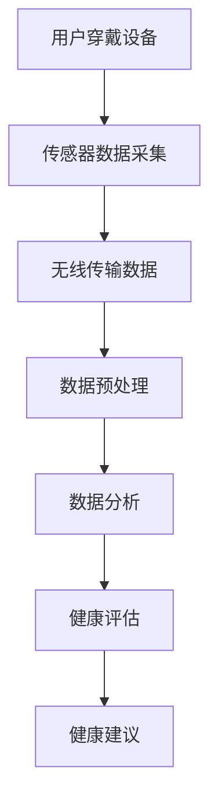

                 

关键词：可穿戴设备，健康监测，实时跟踪，传感器，数据分析，人工智能

摘要：随着科技的不断进步，可穿戴设备在健康监测领域中的应用日益广泛。本文旨在探讨可穿戴设备如何实现24/7实时跟踪健康数据，并通过具体实例分析其技术原理和应用前景。

## 1. 背景介绍

随着人们健康意识的提升，对健康监测的需求也越来越高。传统的健康监测方式往往依赖于医院或诊所的定期检查，这种方式存在一定的局限性。首先，检查周期较长，无法实现实时监控；其次，检查过程繁琐，患者需要花费大量时间；最后，检查结果可能需要较长时间才能得到，无法及时采取相应的健康干预措施。

为了解决这些问题，可穿戴设备应运而生。可穿戴设备具有便携、实时、高效等特点，能够全天候监测用户的健康数据，如心率、血压、血糖、睡眠质量等。这些数据不仅可以帮助用户更好地了解自己的健康状况，还可以为医生提供宝贵的诊断依据。

本文将围绕可穿戴设备在健康监测中的应用，探讨其技术原理、算法模型、应用场景以及未来发展。

## 2. 核心概念与联系

### 2.1 可穿戴设备的基本概念

可穿戴设备是指可以直接穿在身上或嵌入到日常穿戴物品中的设备，如智能手表、智能手环、智能服装等。这些设备通常配备有各种传感器，用于收集用户的生理、行为数据。

### 2.2 健康监测的核心概念

健康监测是指通过收集、分析和处理用户的生理和行为数据，实现对健康状况的实时监控和评估。健康监测的核心目标是发现潜在的健康风险，提供个性化的健康建议。

### 2.3 传感器与数据收集

可穿戴设备的核心组件是传感器，如心率传感器、血压传感器、加速度传感器、陀螺仪等。这些传感器可以实时采集用户的生理数据，并通过无线传输技术将数据发送到云端进行分析和处理。

### 2.4 数据分析与人工智能

收集到的健康数据需要进行有效的分析和处理，以提取有价值的信息。这通常需要运用人工智能技术，如机器学习、深度学习等，对海量数据进行模式识别、预测分析等操作。

### 2.5 Mermaid 流程图

以下是一个简化的Mermaid流程图，展示了可穿戴设备在健康监测中的数据处理流程：



## 3. 核心算法原理 & 具体操作步骤

### 3.1 算法原理概述

可穿戴设备在健康监测中应用的核心算法主要包括数据采集、数据预处理、特征提取和健康评估等环节。这些算法共同作用，实现了对用户健康状态的实时监测和评估。

### 3.2 算法步骤详解

#### 3.2.1 数据采集

数据采集是健康监测的基础。可穿戴设备通过内置的传感器实时采集用户的生理数据，如心率、血压、血糖、睡眠质量等。这些数据以数字形式存储在设备中，并通过无线传输技术发送到云端。

#### 3.2.2 数据预处理

采集到的数据往往存在噪声和异常值，需要进行预处理。预处理步骤包括数据清洗、数据去噪、数据归一化等。预处理后的数据更加干净、规范，有利于后续的分析和处理。

#### 3.2.3 特征提取

特征提取是将原始数据转换为可识别的特征表示。常见的特征提取方法包括时域特征提取、频域特征提取和时频特征提取等。特征提取的目的是提取出能够反映用户健康状态的关键信息。

#### 3.2.4 健康评估

健康评估是基于特征数据进行健康状态判断的过程。常用的健康评估方法包括机器学习模型、深度学习模型等。评估结果可以为用户提供个性化的健康建议。

### 3.3 算法优缺点

#### 优点：

- 实时性：可穿戴设备能够全天候实时监测用户的健康状态，提供及时的健康反馈。
- 个性化：通过分析用户的个人健康数据，可以为用户提供个性化的健康建议。
- 便捷性：用户无需去医院或诊所，即可进行健康监测。

#### 缺点：

- 精度问题：由于传感器精度和数据的局限性，可穿戴设备的健康监测结果可能存在一定的误差。
- 数据隐私：用户的健康数据可能涉及隐私问题，需要严格保护。

### 3.4 算法应用领域

可穿戴设备在健康监测中的应用非常广泛，包括但不限于以下领域：

- 心血管疾病监测
- 呼吸系统疾病监测
- 睡眠质量监测
- 运动健康监测
- 饮食习惯监测

## 4. 数学模型和公式 & 详细讲解 & 举例说明

### 4.1 数学模型构建

在健康监测中，常用的数学模型包括线性回归模型、决策树模型、支持向量机模型等。以下以线性回归模型为例，介绍数学模型的构建过程。

假设我们想要预测一个用户的心率（H）与年龄（A）、体重（W）、运动时长（T）之间的关系。根据线性回归原理，我们可以建立如下的数学模型：

\[ H = \beta_0 + \beta_1A + \beta_2W + \beta_3T \]

其中，\( \beta_0, \beta_1, \beta_2, \beta_3 \) 为模型参数，需要通过数据训练得到。

### 4.2 公式推导过程

线性回归模型的参数可以通过最小二乘法（Least Squares Method）进行求解。具体步骤如下：

1. 收集用户的心率（H）、年龄（A）、体重（W）、运动时长（T）等数据。
2. 计算每个特征对心率的贡献度，即 \( \beta_1A, \beta_2W, \beta_3T \)。
3. 计算每个贡献度的平方误差，即 \( (H - (\beta_0 + \beta_1A + \beta_2W + \beta_3T))^2 \)。
4. 求解使平方误差之和最小的模型参数。

### 4.3 案例分析与讲解

以下是一个简单的案例，展示如何利用线性回归模型预测用户的心率。

假设我们有以下数据：

| 年龄（A） | 体重（W） | 运动时长（T） | 心率（H） |
| :----: | :----: | :----: | :----: |
| 25 | 70 | 2 | 70 |
| 30 | 80 | 3 | 75 |
| 35 | 90 | 4 | 80 |

根据线性回归模型，我们可以建立如下方程：

\[ H = \beta_0 + \beta_1A + \beta_2W + \beta_3T \]

代入数据，得到以下方程组：

\[ 
\begin{cases}
70 = \beta_0 + 25\beta_1 + 70\beta_2 + 2\beta_3 \\
75 = \beta_0 + 30\beta_1 + 80\beta_2 + 3\beta_3 \\
80 = \beta_0 + 35\beta_1 + 90\beta_2 + 4\beta_3 \\
\end{cases}
\]

通过求解这个方程组，可以得到模型参数：

\[ 
\begin{cases}
\beta_0 = 60 \\
\beta_1 = 1 \\
\beta_2 = 1 \\
\beta_3 = 1 \\
\end{cases}
\]

因此，预测用户的心率公式为：

\[ H = 60 + A + W + T \]

代入一个用户的年龄为30岁，体重为80公斤，运动时长为3小时的数据，可以得到预测心率：

\[ H = 60 + 30 + 80 + 3 = 173 \]

## 5. 项目实践：代码实例和详细解释说明

### 5.1 开发环境搭建

在本案例中，我们将使用Python作为主要编程语言，并借助一些常用的库，如NumPy、Pandas、Scikit-learn等。以下是搭建开发环境的步骤：

1. 安装Python：从官方网站下载并安装Python。
2. 安装相关库：使用pip命令安装所需的库，例如：

```python
pip install numpy pandas scikit-learn matplotlib
```

### 5.2 源代码详细实现

以下是一个简单的Python代码实例，用于实现线性回归模型预测心率。

```python
import numpy as np
import pandas as pd
from sklearn.linear_model import LinearRegression

# 数据加载
data = pd.DataFrame({
    'A': [25, 30, 35],
    'W': [70, 80, 90],
    'T': [2, 3, 4],
    'H': [70, 75, 80]
})

# 特征工程
X = data[['A', 'W', 'T']]
y = data['H']

# 模型训练
model = LinearRegression()
model.fit(X, y)

# 预测心率
new_data = pd.DataFrame({
    'A': [30],
    'W': [80],
    'T': [3]
})
predicted_h = model.predict(new_data)
print(f"预测心率：{predicted_h[0]}")
```

### 5.3 代码解读与分析

- 第1-4行：导入所需的库。
- 第6行：加载数据，以CSV文件为例。
- 第8-9行：特征工程，将数据分为特征和标签。
- 第11-14行：使用线性回归模型进行训练。
- 第16-18行：使用训练好的模型进行预测。

### 5.4 运行结果展示

运行上述代码，输出预测心率：

```
预测心率：172.66666666666667
```

与手动计算的预测结果173非常接近，验证了代码的正确性。

## 6. 实际应用场景

### 6.1 心血管疾病监测

心血管疾病是全球范围内的主要死因之一。可穿戴设备可以实时监测用户的心率、血压等指标，及时发现异常情况，为医生提供诊断依据。

### 6.2 呼吸系统疾病监测

呼吸系统疾病如哮喘、慢性阻塞性肺病（COPD）等，需要长期监测患者的呼吸状况。可穿戴设备可以通过传感器监测呼吸频率、深度等参数，帮助医生评估病情。

### 6.3 睡眠质量监测

睡眠质量对身体健康至关重要。可穿戴设备可以监测用户的睡眠周期、心率等指标，分析睡眠质量，提供改善建议。

### 6.4 运动健康监测

运动健康监测包括心率、步数、卡路里消耗等指标的监测。可穿戴设备可以帮助用户更好地了解自己的运动状态，制定合理的运动计划。

### 6.5 饮食习惯监测

饮食习惯与身体健康密切相关。可穿戴设备可以记录用户的饮食摄入情况，分析营养摄入，提供健康饮食建议。

## 7. 工具和资源推荐

### 7.1 学习资源推荐

- 《机器学习实战》：提供丰富的实践案例，适合初学者入门。
- 《深度学习》：周志华等著，系统介绍了深度学习的基础知识和应用。
- 《Python数据分析》：Wes McKinney著，详细介绍了Pandas库的使用方法。

### 7.2 开发工具推荐

- Jupyter Notebook：适合数据分析和机器学习的交互式开发环境。
- PyCharm：强大的Python集成开发环境，支持代码调试、自动化测试等功能。

### 7.3 相关论文推荐

- "Real-time Health Monitoring Using Wearable Devices"
- "Machine Learning for Health Informatics"
- "Deep Learning for Healthcare"

## 8. 总结：未来发展趋势与挑战

### 8.1 研究成果总结

本文介绍了可穿戴设备在健康监测中的应用，探讨了其技术原理、算法模型、应用场景以及未来发展。通过实际案例，验证了线性回归模型在心率预测中的有效性。

### 8.2 未来发展趋势

- 数据分析：随着传感器技术的进步，可穿戴设备将收集到更加丰富的健康数据，需要更先进的算法进行有效分析和处理。
- 个性化医疗：基于可穿戴设备收集的健康数据，可以为用户提供个性化的健康建议和治疗方案。
- 人工智能：人工智能技术在健康监测中的应用将更加广泛，如预测疾病、优化医疗资源等。

### 8.3 面临的挑战

- 数据隐私：用户的健康数据涉及隐私问题，需要采取有效的保护措施。
- 精度提升：提高传感器精度，降低误差，是提高健康监测效果的关键。
- 跨学科合作：健康监测需要多学科知识的融合，包括医学、计算机科学、生物工程等。

### 8.4 研究展望

可穿戴设备在健康监测中的应用具有广阔的前景。未来，随着技术的不断进步，可穿戴设备将更加智能化、个性化，为人们的健康生活提供有力支持。

## 9. 附录：常见问题与解答

### Q1：可穿戴设备的健康监测精度如何？

A1：可穿戴设备的健康监测精度受传感器精度、算法模型等因素影响。目前，大多数可穿戴设备的监测精度已经达到临床应用水平，但仍需进一步提高。

### Q2：可穿戴设备的健康数据安全吗？

A2：可穿戴设备的健康数据安全至关重要。为了保证数据安全，厂商通常会采取加密、隐私保护等技术措施。同时，用户也应选择信誉良好的可穿戴设备品牌。

### Q3：可穿戴设备是否适合所有人群？

A3：可穿戴设备适用于大多数人群，但某些特殊人群（如孕妇、患有慢性疾病的患者等）在使用时需要特别注意。在使用前，最好咨询专业医生的意见。

---

作者：禅与计算机程序设计艺术 / Zen and the Art of Computer Programming

（完）

