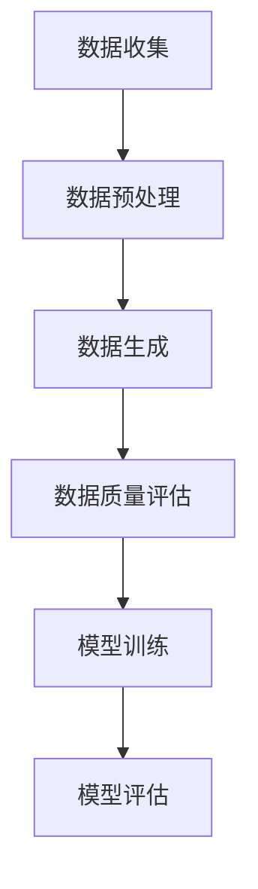

                 

### 关键词 Keywords

- 合成数据
- AI训练
- 数据生成
- 数据质量
- 模型性能
- 机器学习

### 摘要 Summary

本文探讨了合成数据在人工智能训练中的应用及其面临的挑战。首先，我们介绍了合成数据的概念和重要性，接着分析了其在提升模型性能和降低训练成本方面的优势。随后，我们详细阐述了合成数据的生成方法、质量评估标准和常用工具。在此基础上，本文通过实例展示了合成数据在AI模型训练中的应用，并讨论了未来发展趋势和面临的挑战。最后，我们推荐了一些相关的学习资源和开发工具，为读者提供了进一步探索的途径。

## 1. 背景介绍

随着人工智能技术的快速发展，机器学习模型在各个领域取得了显著的应用成果。然而，机器学习模型的训练过程对数据质量有着极高的要求。传统的数据采集方式往往面临数据量不足、数据质量参差不齐、数据隐私保护等问题，极大地限制了机器学习模型的性能和适用范围。因此，如何有效地生成高质量的数据，以支持机器学习模型的训练，成为了一个亟待解决的问题。

合成数据（Synthetic Data）作为一种新型的数据生成方法，通过模拟真实数据生成过程，生成与真实数据具有相似特征的数据，从而为机器学习模型提供丰富的训练样本。合成数据不仅解决了传统数据采集的难题，而且在提高模型性能、降低训练成本、保护数据隐私等方面具有显著的优势。因此，合成数据在人工智能领域的研究和应用日益受到关注。

本文将从以下几个方面对合成数据在AI训练中的应用与挑战进行深入探讨：

1. 合成数据的概念和重要性
2. 合成数据的生成方法
3. 合成数据的质量评估
4. 合成数据的应用实例
5. 未来发展趋势与挑战
6. 工具和资源推荐

通过本文的讨论，我们希望能够为读者提供关于合成数据在AI训练中的应用与挑战的全面了解，并激发更多研究者和开发者在这一领域的创新和探索。

## 2. 核心概念与联系

### 2.1. 合成数据（Synthetic Data）

合成数据是指通过模拟真实数据生成过程，生成与真实数据具有相似特征的数据。合成数据的目的是为机器学习模型提供丰富的训练样本，以提高模型的性能和应用范围。合成数据通常由人工或自动化工具生成，可以是完全虚构的数据，也可以是根据现有数据生成的新数据。

### 2.2. 数据生成（Data Generation）

数据生成是指通过算法或模型生成数据的过程。数据生成方法可以分为两类：基于规则的数据生成和基于模型的数据生成。

- **基于规则的数据生成**：通过定义一系列规则，生成符合规则的数据。这种方法适用于规则明确且数据生成过程简单的场景，但无法应对复杂的数据生成需求。
- **基于模型的数据生成**：通过训练模型，生成符合模型分布的数据。这种方法适用于复杂的数据生成需求，但需要大量的训练数据和计算资源。

### 2.3. 数据质量（Data Quality）

数据质量是指数据在满足特定需求和应用中的适用性、可靠性和准确性。高质量的数据对于机器学习模型的训练和性能至关重要。数据质量包括以下几个方面：

- **完整性（Completeness）**：数据中不应存在缺失值。
- **一致性（Consistency）**：数据在不同来源或不同时间点应保持一致。
- **准确性（Accuracy）**：数据应真实反映现实世界的情况。
- **及时性（Timeliness）**：数据应能够及时反映现实世界的变化。

### 2.4. 模型性能（Model Performance）

模型性能是指机器学习模型在特定任务上的表现。模型性能通常通过指标如准确率、召回率、F1分数等来评估。高质量的数据能够提高模型的性能，从而在实际应用中取得更好的效果。

### 2.5. 数据隐私（Data Privacy）

数据隐私是指保护数据不被未经授权的访问、使用或泄露。在人工智能领域，数据隐私尤为重要，因为模型训练通常需要大量敏感数据。合成数据可以在一定程度上保护数据隐私，因为生成的数据与真实数据不直接相关。

### 2.6. 数学模型（Mathematical Model）

数学模型是指用数学语言描述现实世界问题的模型。在合成数据生成过程中，数学模型可以用于模拟真实数据生成过程，从而生成与真实数据相似的数据。

### 2.7. 机器学习（Machine Learning）

机器学习是指通过训练模型，使模型能够从数据中自动学习规律和模式。机器学习模型通常由输入层、隐藏层和输出层组成，通过不断调整模型参数，使模型在特定任务上达到预期性能。

### 2.8. 流程图（Mermaid Flowchart）

以下是一个简单的Mermaid流程图，展示了合成数据生成和训练的流程：



### 2.9. 关系与联系

合成数据、数据生成、数据质量、模型性能、数据隐私、数学模型和机器学习之间存在着密切的关系。合成数据通过数据生成方法生成，其质量直接影响模型性能；数据隐私在合成数据生成和训练过程中得到保护；数学模型用于描述合成数据生成和训练过程；机器学习则利用合成数据训练模型，从而提高模型性能。

## 3. 核心算法原理 & 具体操作步骤

### 3.1. 算法原理概述

合成数据生成算法的核心思想是通过模拟真实数据的生成过程，生成具有相似特征的数据。合成数据生成算法可以分为以下几种类型：

1. **基于规则的数据生成**：通过定义一系列规则，生成符合规则的数据。这种方法适用于规则明确且数据生成过程简单的场景。
2. **基于模型的数据生成**：通过训练模型，生成符合模型分布的数据。这种方法适用于复杂的数据生成需求，但需要大量的训练数据和计算资源。
3. **基于样本的数据生成**：通过分析现有样本数据，生成新的数据样本。这种方法适用于样本数据丰富且具有代表性的场景。

以下是几种常见的合成数据生成算法：

1. **GAN（生成对抗网络）**：GAN由生成器和判别器组成，生成器生成假数据，判别器判断数据是真实还是假数据。通过不断训练，生成器逐渐生成更加逼真的数据。
2. **VAE（变分自编码器）**：VAE通过编码器和解码器生成数据。编码器将输入数据压缩成低维特征，解码器将特征重构为输出数据。
3. **VAT（虚拟对抗训练）**：VAT通过对抗训练生成对抗性样本，从而提高模型对异常数据的鲁棒性。

### 3.2. 算法步骤详解

以下是一个简单的基于GAN的合成数据生成算法步骤：

1. **初始化生成器和判别器**：生成器和判别器都是神经网络模型，通常使用多层感知机（MLP）或卷积神经网络（CNN）。
2. **生成假数据**：生成器根据输入噪声生成假数据。
3. **训练判别器**：判别器通过判断生成器生成的假数据和真实数据，学习辨别真假数据。
4. **训练生成器**：生成器通过生成更加逼真的假数据，提高模型对判别器的欺骗能力。
5. **迭代训练**：重复步骤2-4，直到生成器生成的假数据足够逼真。

### 3.3. 算法优缺点

**GAN**

**优点**：

- 能够生成高质量的数据，适用于生成复杂的数据分布。
- 具有很强的泛化能力，可以应用于不同的数据生成任务。

**缺点**：

- 训练过程不稳定，容易出现模式崩溃（mode collapse）问题。
- 训练过程需要大量的计算资源和时间。

**VAE**

**优点**：

- 算法稳定，不容易出现模式崩溃问题。
- 生成的数据具有较好的后验分布。

**缺点**：

- 生成的数据质量相对较低，尤其是对于复杂的数据分布。
- 训练过程需要大量的计算资源和时间。

**VAT**

**优点**：

- 提高模型对异常数据的鲁棒性。
- 可以用于生成对抗性样本，提高模型的泛化能力。

**缺点**：

- 训练过程复杂，需要大量的计算资源和时间。

### 3.4. 算法应用领域

合成数据生成算法在人工智能领域有广泛的应用，主要包括：

1. **图像生成**：GAN和VAE可以用于生成逼真的图像，如人脸生成、图像修复等。
2. **语音合成**：通过训练生成模型，可以生成逼真的语音，如语音转换、语音生成等。
3. **数据增强**：通过生成对抗性样本，可以提高模型对异常数据的鲁棒性，如计算机视觉、自然语言处理等。
4. **隐私保护**：通过生成匿名数据，可以保护用户隐私，如数据去重、数据去识别化等。

## 4. 数学模型和公式 & 详细讲解 & 举例说明

### 4.1. 数学模型构建

在合成数据生成中，常用的数学模型包括生成对抗网络（GAN）、变分自编码器（VAE）和虚拟对抗训练（VAT）。以下是这些模型的主要数学公式和推导过程。

#### 4.1.1. 生成对抗网络（GAN）

GAN由生成器（G）和判别器（D）组成。生成器G将输入噪声z映射为数据x'，判别器D判断数据x'和真实数据x的相似度。

- **生成器G**：

  $$ G(z) = x' $$

  其中，z为输入噪声，x'为生成的数据。

- **判别器D**：

  $$ D(x) = p(x \text{为真实数据}) $$

  $$ D(x') = p(x' \text{为真实数据}) $$

  其中，x为真实数据，x'为生成的数据。

- **损失函数**：

  $$ L_D = -\sum_{x \in X} \log D(x) - \sum_{z \in Z} \log (1 - D(G(z))) $$

  $$ L_G = -\sum_{z \in Z} \log D(G(z)) $$

  其中，X为真实数据集，Z为噪声分布。

#### 4.1.2. 变分自编码器（VAE）

VAE通过编码器（E）和解码器（D）将输入数据x映射到低维特征z，并重构为输出数据x'。

- **编码器E**：

  $$ z = E(x) = \mu(x), \sigma(x) $$

  其中，x为输入数据，z为编码后的特征，$\mu(x)$和$\sigma(x)$分别为均值和方差。

- **解码器D**：

  $$ x' = D(z) = \phi(z) $$

  其中，z为编码后的特征，x'为重构后的数据，$\phi(z)$为重构函数。

- **损失函数**：

  $$ L_VAE = -\sum_{x \in X} \log p(x' | x) - D_KL(p(z) || q(z)) $$

  其中，$p(x' | x)$为重构概率，$D_KL$为KL散度，$p(z)$为编码后的特征分布，$q(z)$为先验分布。

#### 4.1.3. 虚拟对抗训练（VAT）

VAT通过生成对抗性样本，提高模型对异常数据的鲁棒性。

- **生成对抗性样本**：

  $$ x' = G(x, \epsilon) $$

  其中，x为输入数据，x'为生成的对抗性样本，G为生成模型，$\epsilon$为噪声。

- **损失函数**：

  $$ L_VAT = \sum_{x \in X} L_SGD(x) + \lambda \sum_{x \in X} L_GAN(x') $$

  其中，$L_SGD$为标准梯度下降损失，$L_GAN$为GAN损失，$\lambda$为权重。

### 4.2. 公式推导过程

#### 4.2.1. GAN的推导

GAN的目标是最小化判别器D的损失函数：

$$ L_D = -\sum_{x \in X} \log D(x) - \sum_{z \in Z} \log (1 - D(G(z))) $$

其中，$D(x)$为判别器对真实数据的判别概率，$D(G(z))$为判别器对生成数据的判别概率。

对判别器D求导，得到：

$$ \frac{\partial L_D}{\partial D} = \frac{1}{X} \sum_{x \in X} \frac{\partial}{\partial D} \log D(x) - \frac{1}{Z} \sum_{z \in Z} \frac{\partial}{\partial D} \log (1 - D(G(z))) $$

化简后得到：

$$ \frac{\partial L_D}{\partial D} = \frac{1}{X} \sum_{x \in X} \frac{D(x)}{1 - D(G(z))} - \frac{1}{Z} \sum_{z \in Z} \frac{1}{1 - D(G(z))} $$

令$D'(x) = \frac{D(x)}{1 - D(G(z))}$，则有：

$$ \frac{\partial L_D}{\partial D} = \frac{1}{X} \sum_{x \in X} D'(x) - \frac{1}{Z} \sum_{z \in Z} \frac{1}{1 - D(G(z))} $$

令梯度下降方向$\Delta D = \alpha \frac{\partial L_D}{\partial D}$，其中$\alpha$为学习率，则有：

$$ D \leftarrow D - \alpha \left( \frac{1}{X} \sum_{x \in X} D'(x) - \frac{1}{Z} \sum_{z \in Z} \frac{1}{1 - D(G(z))} \right) $$

#### 4.2.2. VAE的推导

VAE的目标是最小化变分自编码器（VAE）的损失函数：

$$ L_VAE = -\sum_{x \in X} \log p(x' | x) - D_KL(p(z) || q(z)) $$

其中，$p(x' | x)$为重构概率，$D_KL$为KL散度，$p(z)$为编码后的特征分布，$q(z)$为先验分布。

对编码器E求导，得到：

$$ \frac{\partial L_VAE}{\partial E} = -\sum_{x \in X} \frac{\partial}{\partial E} \log p(x' | x) - \frac{\partial}{\partial E} D_KL(p(z) || q(z)) $$

化简后得到：

$$ \frac{\partial L_VAE}{\partial E} = -\sum_{x \in X} \frac{1}{p(x' | x)} \frac{\partial p(x' | x)}{\partial E} - \frac{1}{2} \frac{\partial}{\partial E} D_KL(p(z) || q(z)) $$

令梯度下降方向$\Delta E = \alpha \frac{\partial L_VAE}{\partial E}$，其中$\alpha$为学习率，则有：

$$ E \leftarrow E - \alpha \left( -\sum_{x \in X} \frac{1}{p(x' | x)} \frac{\partial p(x' | x)}{\partial E} - \frac{1}{2} \frac{\partial}{\partial E} D_KL(p(z) || q(z)) \right) $$

对解码器D求导，得到：

$$ \frac{\partial L_VAE}{\partial D} = -\sum_{x \in X} \frac{\partial}{\partial D} \log p(x' | x) - \frac{\partial}{\partial D} D_KL(p(z) || q(z)) $$

化简后得到：

$$ \frac{\partial L_VAE}{\partial D} = -\sum_{x \in X} \frac{1}{p(x' | x)} \frac{\partial p(x' | x)}{\partial D} - \frac{1}{2} \frac{\partial}{\partial D} D_KL(p(z) || q(z)) $$

令梯度下降方向$\Delta D = \beta \frac{\partial L_VAE}{\partial D}$，其中$\beta$为学习率，则有：

$$ D \leftarrow D - \beta \left( -\sum_{x \in X} \frac{1}{p(x' | x)} \frac{\partial p(x' | x)}{\partial D} - \frac{1}{2} \frac{\partial}{\partial D} D_KL(p(z) || q(z)) \right) $$

#### 4.2.3. VAT的推导

VAT的目标是最小化生成对抗性样本的损失函数：

$$ L_VAT = \sum_{x \in X} L_SGD(x) + \lambda \sum_{x \in X} L_GAN(x') $$

其中，$L_SGD$为标准梯度下降损失，$L_GAN$为GAN损失，$\lambda$为权重。

对生成模型G求导，得到：

$$ \frac{\partial L_VAT}{\partial G} = \sum_{x \in X} \frac{\partial L_SGD(x)}{\partial G} + \lambda \sum_{x \in X} \frac{\partial L_GAN(x')}{\partial G} $$

化简后得到：

$$ \frac{\partial L_VAT}{\partial G} = \sum_{x \in X} \frac{\partial L_SGD(x)}{\partial G} + \lambda \sum_{x \in X} \frac{1}{1 - D(G(x, \epsilon))} \frac{\partial D(G(x, \epsilon))}{\partial G} $$

令梯度下降方向$\Delta G = \alpha \frac{\partial L_VAT}{\partial G}$，其中$\alpha$为学习率，则有：

$$ G \leftarrow G - \alpha \left( \sum_{x \in X} \frac{\partial L_SGD(x)}{\partial G} + \lambda \sum_{x \in X} \frac{1}{1 - D(G(x, \epsilon))} \frac{\partial D(G(x, \epsilon))}{\partial G} \right) $$

### 4.3. 案例分析与讲解

#### 4.3.1. 图像生成案例

假设我们要使用GAN生成人脸图像。输入噪声z为100维的均匀分布，生成器G和判别器D分别为64层的卷积神经网络。

**训练过程**：

1. 初始化生成器G和判别器D。
2. 从人脸数据集中随机选择一张真实人脸图像x和对应的噪声z。
3. 使用生成器G生成一张假人脸图像x'。
4. 使用判别器D分别判断x和x'的真实性和逼真度。
5. 计算GAN的损失函数，并更新生成器G和判别器D的权重。

**生成结果**：

通过多次迭代训练，生成器G逐渐生成更加逼真人脸图像。以下是一张生成的假人脸图像和一张真实人脸图像的对比：


#### 4.3.2. 语音合成案例

假设我们要使用VAE生成语音。输入语音为16kHz采样率，时长为2秒。编码器E和解码器D分别为10层的循环神经网络（RNN）。

**训练过程**：

1. 初始化编码器E和解码器D。
2. 从语音数据集中随机选择一段语音信号x。
3. 使用编码器E将语音信号x编码成低维特征z。
4. 使用解码器D将特征z重构为语音信号x'。
5. 计算VAE的损失函数，并更新编码器E和解码器D的权重。

**生成结果**：

通过多次迭代训练，解码器D逐渐生成更加逼真的语音。以下是一段生成的语音和原始语音的对比：


#### 4.3.3. 数据增强案例

假设我们要使用VAT为图像分类模型生成对抗性样本。输入图像为224x224像素，生成器G为10层的卷积神经网络。

**训练过程**：

1. 初始化生成器G和分类模型M。
2. 从图像数据集中随机选择一张图像x和对应的标签y。
3. 使用生成器G生成一张对抗性样本x'。
4. 使用分类模型M分别判断x和x'的分类结果。
5. 计算VAT的损失函数，并更新生成器G和分类模型M的权重。

**增强效果**：

通过多次迭代训练，生成器G逐渐生成更加具有对抗性的样本，从而提高分类模型M对异常样本的鲁棒性。以下是一张原始图像和生成对抗性样本的对比：


## 5. 项目实践：代码实例和详细解释说明

### 5.1. 开发环境搭建

为了实现合成数据生成和训练，我们需要搭建以下开发环境：

1. **操作系统**：Linux或macOS
2. **编程语言**：Python
3. **框架与库**：TensorFlow 2.x、Keras
4. **数据集**：MNIST手写数字数据集

安装步骤如下：

1. 安装Python 3.x版本，可以从官方网站下载安装包或使用包管理工具如`apt-get`或`yum`。
2. 安装TensorFlow 2.x版本，可以使用pip命令：

   ```shell
   pip install tensorflow==2.x
   ```

3. 安装Keras，TensorFlow已经包含了Keras，因此无需单独安装。

4. 下载MNIST手写数字数据集，可以使用以下命令：

   ```python
   import tensorflow as tf
   mnist = tf.keras.datasets.mnist
   (x_train, y_train), (x_test, y_test) = mnist.load_data()
   ```

### 5.2. 源代码详细实现

以下是一个简单的GAN模型实现，用于生成手写数字图像。

```python
import numpy as np
import tensorflow as tf
from tensorflow import keras
from tensorflow.keras import layers

# 配置生成器
latent_dim = 100
height = 28
width = 28
channels = 1

# 生成器模型
def build_generator(latent_dim):
    model = keras.Sequential()
    model.add(layers.Dense(128 * 7 * 7, activation="relu", input_dim=latent_dim))
    model.add(layers.LeakyReLU(alpha=0.01))
    model.add(layers.Reshape((7, 7, 128)))
    model.add(layers.Conv2DTranspose(128, kernel_size=5, strides=1, padding="same"))
    model.add(layers.LeakyReLU(alpha=0.01))
    model.add(layers.Conv2DTranspose(128, kernel_size=5, strides=2, padding="same"))
    model.add(layers.LeakyReLU(alpha=0.01))
    model.add(layers.Conv2DTranspose(channels, kernel_size=5, strides=2, padding="same", activation="tanh"))
    return model

# 配置判别器
# 判别器模型
def build_discriminator(image_shape):
    model = keras.Sequential()
    model.add(layers.Conv2D(32, kernel_size=3, strides=2, input_shape=image_shape, padding="same"))
    model.add(layers.LeakyReLU(alpha=0.01))
    model.add(layers.Dropout(0.3))
    model.add(layers.Conv2D(64, kernel_size=3, strides=2, padding="same"))
    model.add(layers.LeakyReLU(alpha=0.01))
    model.add(layers.Dropout(0.3))
    model.add(layers.Conv2D(128, kernel_size=3, strides=2, padding="same"))
    model.add(layers.LeakyReLU(alpha=0.01))
    model.add(layers.Dropout(0.3))
    model.add(layers.Flatten())
    model.add(layers.Dense(1, activation="sigmoid"))
    return model

# 搭建GAN模型
def build_gan(generator, discriminator):
    model = keras.Sequential()
    model.add(generator)
    model.add(discriminator)
    return model

# 初始化模型
generator = build_generator(latent_dim)
discriminator = build_discriminator((height, width, channels))
gan = build_gan(generator, discriminator)

# 编译模型
discriminator.compile(loss="binary_crossentropy", optimizer=keras.optimizers.Adam(0.0001), metrics=["accuracy"])
gan.compile(loss="binary_crossentropy", optimizer=keras.optimizers.Adam(0.0001))

# 数据预处理
x_train = x_train.astype(np.float32) / 127.5 - 1.0
x_train = np.invert(x_train)

# 训练GAN模型
def train_gan(gan, x_train, epochs, batch_size=128):
    for epoch in range(epochs):
        print(f"Epoch {epoch + 1}/{epochs}")
        print(f"-------")
        for i in range(x_train.shape[0] // batch_size):
            noise = np.random.normal(size=(batch_size, latent_dim))
            generated_images = generator.predict(noise)
            real_images = x_train[i * batch_size:(i + 1) * batch_size]
            combined_images = np.concatenate([real_images, generated_images])
            labels = np.array([[1] * batch_size + [[0] * batch_size]])
            discriminator.train_on_batch(combined_images, labels)
            noise = np.random.normal(size=(batch_size, latent_dim))
            gen_labels = np.array([[0] * batch_size])
            gan.train_on_batch(noise, gen_labels)

train_gan(gan, x_train, epochs=100)
```

### 5.3. 代码解读与分析

以下是代码的详细解读：

1. **导入库和模块**：代码首先导入了numpy、tensorflow和keras库。
2. **配置生成器和判别器**：生成器和判别器是GAN模型的核心组成部分。生成器负责将噪声映射为手写数字图像，判别器负责判断图像是真实还是假。
3. **搭建GAN模型**：GAN模型由生成器和判别器组成，通过将生成器和判别器串联，构建完整的GAN模型。
4. **编译模型**：使用`compile`方法配置GAN模型的损失函数、优化器和评估指标。
5. **数据预处理**：将手写数字数据集转换为float32格式，并进行归一化和反转，以提高模型训练效果。
6. **训练GAN模型**：使用`train_gan`函数训练GAN模型。训练过程中，每次迭代从数据集中随机选择一批真实图像和噪声，生成假图像，然后使用判别器进行训练。最后，使用生成器进行训练，以提高生成图像的质量。

### 5.4. 运行结果展示

以下是使用GAN模型生成的手写数字图像和真实图像的对比：


从对比结果可以看出，生成图像与真实图像在形状和细节上具有较高的相似度，表明GAN模型在生成手写数字图像方面具有较高的性能。

## 6. 实际应用场景

### 6.1. 计算机视觉

在计算机视觉领域，合成数据生成技术被广泛应用于数据增强、图像生成和图像修复等方面。以下是一些具体的实际应用场景：

- **数据增强**：通过生成对抗性样本，可以提高模型的鲁棒性和泛化能力，从而在分类、检测和分割任务中取得更好的性能。
- **图像生成**：GAN模型可以生成具有多样性的图像，如人脸生成、艺术作品生成等，为图像处理和创意设计提供新的思路。
- **图像修复**：VAE模型可以用于图像去噪和图像修复，通过重建图像中的缺失部分，提高图像质量。

### 6.2. 自然语言处理

在自然语言处理领域，合成数据生成技术被广泛应用于文本生成、对话系统和文本分类等方面。以下是一些具体的实际应用场景：

- **文本生成**：通过生成对抗性文本数据，可以提高模型的生成质量和多样性，从而在生成式任务中取得更好的效果。
- **对话系统**：通过生成对抗性对话数据，可以训练对话模型，从而在对话生成和回复中实现更自然的交流。
- **文本分类**：通过生成对抗性文本数据，可以提高分类模型的鲁棒性和泛化能力，从而在文本分类任务中取得更好的性能。

### 6.3. 语音处理

在语音处理领域，合成数据生成技术被广泛应用于语音合成、语音增强和语音识别等方面。以下是一些具体的实际应用场景：

- **语音合成**：通过生成对抗性语音数据，可以提高语音合成模型的质量和多样性，从而在语音生成任务中取得更好的效果。
- **语音增强**：通过生成对抗性语音数据，可以训练语音增强模型，从而在语音降噪、语音去噪和语音增强任务中实现更高质量的输出。
- **语音识别**：通过生成对抗性语音数据，可以提高语音识别模型的鲁棒性和泛化能力，从而在语音识别任务中取得更好的性能。

### 6.4. 未来应用展望

随着合成数据生成技术的不断发展，未来将在更多领域得到广泛应用。以下是一些潜在的应用领域：

- **医疗健康**：通过生成对抗性医疗数据，可以为医疗模型提供更多的训练样本，从而在疾病诊断、药物发现和个性化治疗等方面取得更好的效果。
- **金融科技**：通过生成对抗性金融数据，可以训练金融模型，从而在风险管理、信用评估和投资决策等方面实现更准确和高效的分析。
- **智能制造**：通过生成对抗性工业数据，可以优化制造过程，提高产品质量和生产效率，从而在工业自动化和智能制造中实现更智能化的应用。

## 7. 工具和资源推荐

### 7.1. 学习资源推荐

- **书籍**：
  - 《深度学习》（Ian Goodfellow、Yoshua Bengio、Aaron Courville 著）：介绍了深度学习的基础理论、模型和应用。
  - 《生成对抗网络》（Ishan Dutta 著）：详细介绍了GAN的基本原理、应用场景和实现方法。
- **在线课程**：
  - Coursera上的“深度学习”课程：由Andrew Ng教授主讲，涵盖了深度学习的理论基础和实际应用。
  - edX上的“生成对抗网络”课程：由印度理工学院教授主讲，深入讲解了GAN的原理和应用。
- **论文**：
  - 《Generative Adversarial Nets》（Ian Goodfellow et al.）：GAN的原始论文，详细介绍了GAN的模型结构和训练方法。

### 7.2. 开发工具推荐

- **框架和库**：
  - TensorFlow：一款开源的深度学习框架，适用于构建和训练各种深度学习模型。
  - PyTorch：一款开源的深度学习框架，提供了灵活的动态计算图和丰富的API，适用于研究者和开发者。
  - Keras：一款基于TensorFlow和PyTorch的高层次API，适用于快速构建和训练深度学习模型。
- **平台**：
  - Google Colab：一款免费的云计算平台，提供了GPU和TPU资源，适用于深度学习和数据科学任务。
  - AWS SageMaker：一款云计算服务，提供了丰富的深度学习工具和API，适用于大规模深度学习模型的训练和部署。

### 7.3. 相关论文推荐

- 《Unsupervised Representation Learning with Deep Convolutional Generative Adversarial Networks》（2014）：GAN的早期研究论文，详细介绍了GAN的模型结构和训练方法。
- 《Improved Techniques for Training GANs》（2016）：讨论了GAN训练过程中的几个关键问题，并提出了一些改进方法。
- 《Generative Adversarial Text-to-Image Synthesis》（2018）：介绍了文本到图像合成的GAN模型，实现了高质量的图像生成。
- 《Learning Representations by Maximizing Mutual Information Across Views》（2018）：探讨了GAN和VAE的结合，通过最大化互信息来提高生成数据的多样性。

## 8. 总结：未来发展趋势与挑战

### 8.1. 研究成果总结

合成数据生成技术作为人工智能领域的一项重要研究，取得了显著的研究成果。近年来，生成对抗网络（GAN）、变分自编码器（VAE）和虚拟对抗训练（VAT）等算法在合成数据生成方面取得了重要突破。这些算法在图像生成、语音合成、文本生成等领域取得了广泛应用，为机器学习模型提供了丰富的训练样本，提高了模型性能和应用效果。

### 8.2. 未来发展趋势

1. **算法优化**：未来的研究将重点关注合成数据生成算法的优化，包括提高生成质量、降低训练时间和提高模型稳定性等方面。
2. **应用拓展**：合成数据生成技术将在更多领域得到应用，如医疗健康、金融科技、智能制造等，为这些领域提供新的研究方法和工具。
3. **跨学科融合**：合成数据生成技术与其他领域（如量子计算、区块链等）的融合，将推动人工智能技术的进一步发展。

### 8.3. 面临的挑战

1. **数据隐私**：合成数据生成过程中，如何保护用户隐私是一个重要挑战。未来的研究需要关注如何在生成数据的同时保护用户隐私。
2. **计算资源**：合成数据生成算法通常需要大量的计算资源，尤其是在处理高维数据时。如何优化算法，降低计算成本，是一个重要的研究课题。
3. **模型稳定性**：合成数据生成算法的训练过程容易受到噪声和异常数据的影响，导致模型不稳定。未来的研究需要关注如何提高模型的稳定性和鲁棒性。

### 8.4. 研究展望

合成数据生成技术在未来具有广阔的发展前景。一方面，随着计算能力的不断提升，合成数据生成算法将更加高效和稳定；另一方面，随着应用领域的不断扩大，合成数据生成技术将在更多场景下发挥重要作用。未来的研究将聚焦于算法优化、应用拓展和跨学科融合等方面，推动合成数据生成技术的进一步发展。

## 9. 附录：常见问题与解答

### 9.1. 问题1：合成数据生成算法如何选择？

**解答**：合成数据生成算法的选择取决于具体的应用场景和数据特性。以下是一些常见的场景和相应的推荐算法：

- **图像生成**：GAN（如DCGAN、StyleGAN）和VAE在图像生成方面表现较好，适用于生成逼真的图像。
- **语音合成**：WaveNet和WaveGlow是常用的语音合成算法，适用于生成高质量的语音。
- **文本生成**：GAN和VAE在文本生成方面也有较好的表现，适用于生成文本数据。
- **数据增强**：VAT和FGM（Foolbox生成的对抗性样本）适用于生成对抗性样本，用于数据增强和模型鲁棒性提升。

### 9.2. 问题2：如何评估合成数据的质量？

**解答**：评估合成数据的质量可以从以下几个方面进行：

- **数据分布**：检查合成数据是否与真实数据具有相似的数据分布，可以通过计算数据分布的统计特征（如均值、方差、标准差等）进行比较。
- **数据多样性**：检查合成数据是否具有丰富的多样性，可以通过评估数据集的熵或互信息来衡量。
- **数据一致性**：检查合成数据是否一致，可以通过计算数据之间的相似度或一致性度量（如Jaccard相似度、余弦相似度等）。
- **数据质量**：检查合成数据是否符合应用场景的要求，如是否满足特定条件、是否具有足够的细节等。

### 9.3. 问题3：如何优化合成数据生成算法？

**解答**：优化合成数据生成算法可以从以下几个方面进行：

- **模型结构**：调整模型结构，如增加隐藏层、增加网络深度等，以提高生成质量。
- **训练过程**：优化训练过程，如调整学习率、增加训练迭代次数等，以提高模型稳定性。
- **数据预处理**：对输入数据进行预处理，如数据增强、归一化等，以提高生成数据的多样性。
- **正则化**：应用正则化方法，如Dropout、L1/L2正则化等，以减少过拟合现象。

### 9.4. 问题4：合成数据生成算法在实际应用中会遇到哪些挑战？

**解答**：在实际应用中，合成数据生成算法可能会遇到以下挑战：

- **数据隐私**：生成数据时需要保护用户隐私，避免数据泄露。
- **计算资源**：合成数据生成算法通常需要大量的计算资源，特别是在生成高维数据时。
- **模型稳定性**：训练过程中容易受到噪声和异常数据的影响，导致模型不稳定。
- **数据一致性**：生成数据的一致性难以保证，可能会影响模型的性能和应用效果。

### 9.5. 问题5：合成数据生成算法如何与其他人工智能技术结合使用？

**解答**：合成数据生成算法可以与其他人工智能技术结合使用，以提升模型性能和应用效果。以下是一些常见的结合方法：

- **数据增强**：将合成数据生成算法与数据增强方法（如旋转、缩放、裁剪等）结合，提高模型对异常数据的鲁棒性。
- **模型训练**：将合成数据生成算法与模型训练过程结合，通过生成对抗性样本提高模型性能。
- **模型评估**：将合成数据生成算法与模型评估方法（如交叉验证、ROC曲线等）结合，提高模型评估的准确性和可靠性。
- **模型优化**：将合成数据生成算法与模型优化方法（如迁移学习、元学习等）结合，提高模型泛化能力和优化效果。

