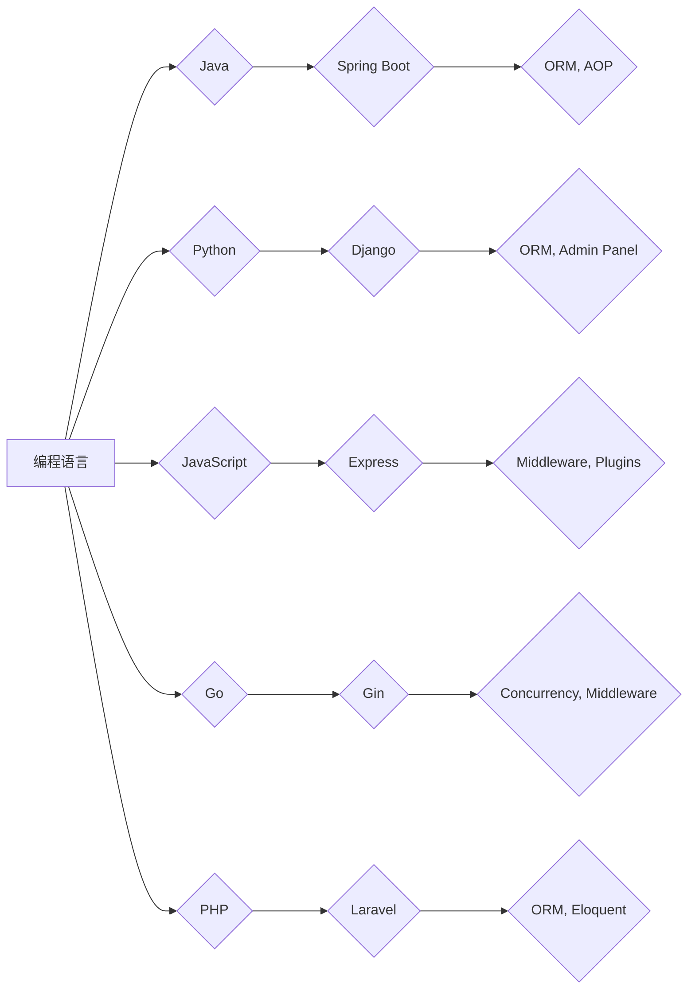

                 

关键词：后端开发、服务器端编程语言、框架、技术栈、性能优化、安全性、云计算

摘要：本文将深入探讨后端开发的核心领域，包括服务器端编程语言的选择、主流框架的优缺点分析、性能优化技巧、安全性考虑，以及云计算在后端开发中的应用。通过对这些核心概念的详细解析和实际案例的剖析，本文旨在为开发者提供一套全面的指南，帮助他们在后端开发中做出明智的选择，并提升开发效率。

## 1. 背景介绍

随着互联网技术的飞速发展，后端开发作为软件系统开发的重要环节，变得越来越重要。后端开发主要负责处理服务器端的逻辑，包括数据存储、业务逻辑处理、接口设计与实现等。一个优秀的后端系统不仅需要高效、稳定，还必须具备良好的扩展性和安全性。

在后端开发中，编程语言的选择至关重要。不同的编程语言具有不同的特点和应用场景。例如，Java 以其稳定性和高效性著称，JavaScript 则在动态网页开发中占据主导地位。此外，框架作为后端开发的利器，极大地提高了开发效率和代码质量。

本文将首先介绍几种主流的后端编程语言，然后分析它们各自的优势和劣势，接着探讨主流框架的选择与应用，以及后端开发中的性能优化和安全策略。最后，我们将探讨云计算在后端开发中的角色和未来发展趋势。

## 2. 核心概念与联系

### 2.1 后端编程语言

后端编程语言是开发服务器端应用程序的基础。以下是几种常见后端编程语言及其特点：

#### Java

**特点：**
- 强类型语言，注重性能和稳定性。
- 拥有丰富的标准库和生态系统。
- 支持多线程和并发处理。

**劣势：**
- 编程门槛较高，语法相对复杂。
- JVM（Java虚拟机）带来的启动成本。

#### Python

**特点：**
- 易于学习，语法简洁清晰。
- 强大的标准库和第三方库支持。
- 适合快速开发和实验。

**劣势：**
- 性能相对较低，适用于计算密集型任务时需要优化。

#### JavaScript

**特点：**
- 一门全栈语言，适合前后端开发。
- 丰富的框架和库，如 Node.js。
- 社区活跃，生态丰富。

**劣势：**
- 缺乏类型安全，易于引入bug。
- 全局作用域问题导致代码管理复杂。

#### Go

**特点：**
- 高性能，适合并发处理。
- 简洁的语法，易于阅读和维护。
- 强大的标准库和工具链。

**劣势：**
- 生态相对较新，部分库和工具不如其他语言丰富。

#### PHP

**特点：**
- 易于学习和使用，适合中小型项目。
- 网站开发领域的霸主，WordPress 等系统主要使用 PHP。

**劣势：**
- 代码质量参差不齐，生态不如其他语言成熟。

### 2.2 后端框架

后端框架是后端开发中的重要工具，提供了结构化和模块化的开发方式，提高了代码的可维护性和可扩展性。以下是几种主流的后端框架：

#### Spring Boot（Java）

**特点：**
- 完全遵循Spring框架，支持企业级应用开发。
- 自动配置，简化了项目搭建过程。
- 强大的生态系统，支持各种场景。

**劣势：**
- 配置复杂，入门门槛相对较高。

#### Django（Python）

**特点：**
- 高度集成，减少了开发时间。
- 强大的 ORM（对象关系映射）功能。
- 丰富的第三方库和插件。

**劣势：**
- 适用于快速开发，但可能不适合大型项目。

#### Express（JavaScript）

**特点：**
- 轻量级，易于学习和使用。
- 提供了丰富的中间件支持。
- 社区活跃，文档丰富。

**劣势：**
- 缺乏安全性保障，需要开发者自行处理。

#### Gin（Go）

**特点：**
- 高性能，适合高并发场景。
- 提供了丰富的路由、中间件和绑定工具。
- 简洁的代码风格。

**劣势：**
- 生态相对较新，部分功能可能不如其他框架成熟。

#### Laravel（PHP）

**特点：**
- 高度集成，提供了丰富的功能。
- 优雅的语法，易于学习和使用。
- 强大的社区支持。

**劣势：**
- 性能相对较低，不适合高并发场景。

### 2.3 后端开发核心概念架构图

以下是后端开发中核心概念的 Mermaid 流程图：



通过以上架构图，我们可以清晰地看到编程语言与框架之间的联系，以及各自的核心特性。

## 3. 核心算法原理 & 具体操作步骤

### 3.1 算法原理概述

在后端开发中，算法的合理选择和优化对于系统的性能和稳定性至关重要。以下是几种常用的算法原理及其应用场景：

#### 算法A：排序算法

排序算法是后端开发中常见的算法，用于对数据进行排序。常见的排序算法有快速排序、归并排序、堆排序等。

**原理：**
- 快速排序：通过一趟排序将待排序的记录分割成独立的两部分，其中一部分记录的关键字均比另一部分的关键字小，然后递归地排序两部分记录。

**应用场景：**
- 大数据量排序。
- 需要高时间复杂度优化。

#### 算法B：查找算法

查找算法用于在数据集合中查找特定元素。常见的查找算法有二分查找、哈希查找等。

**原理：**
- 二分查找：通过不断地将查找区间缩小一半，逐步逼近目标元素。

**应用场景：**
- 数据量较大且有序。
- 需要快速查找。

#### 算法C：缓存算法

缓存算法用于优化系统的性能，常见的缓存算法有 LRU（最近最少使用）、LFU（最少使用）等。

**原理：**
- LRU：缓存最近最少使用的元素。

**应用场景：**
- 缓存热点数据。
- 优化数据库访问。

### 3.2 算法步骤详解

以下是对上述算法的具体操作步骤的详细说明：

#### 3.2.1 快速排序

1. 选择一个基准元素。
2. 将数组分为两部分，一部分小于基准元素，另一部分大于基准元素。
3. 递归地分别对两部分进行快速排序。

#### 3.2.2 二分查找

1. 确定查找区间。
2. 计算中间位置。
3. 比较中间位置元素与目标元素的大小。
4. 根据比较结果调整查找区间，重复步骤2-3，直至找到目标元素或查找区间为空。

#### 3.2.3 LRU缓存算法

1. 创建一个双向链表，其中最近访问的元素位于链表头部，最少访问的元素位于链表尾部。
2. 当缓存满时，删除链表尾部的元素。
3. 当访问缓存中的元素时，将其移动到链表头部。

### 3.3 算法优缺点

每种算法都有其优缺点，具体取决于应用场景和需求。以下是几种算法的优缺点分析：

#### 快速排序

**优点：**
- 时间复杂度低，适用于大数据量排序。

**缺点：**
- 空间复杂度较高，可能导致栈溢出。
- 性能不稳定，可能陷入最坏情况。

#### 二分查找

**优点：**
- 时间复杂度低，适用于大数据量查找。

**缺点：**
- 需要数据有序，不适合动态数据集。

#### LRU缓存算法

**优点：**
- 优化了缓存性能，减少了数据库访问。

**缺点：**
- 可能会导致缓存命中率下降。
- 需要维护额外的数据结构。

### 3.4 算法应用领域

各种算法在不同领域中都有广泛的应用，以下是几种算法的应用领域：

#### 快速排序

- 数据库排序。
- 大数据排序。
- 文本处理。

#### 二分查找

- 数据库查询。
- 二叉搜索树实现。
- 字符串匹配。

#### LRU缓存算法

- 缓存系统。
- 内容分发网络（CDN）。
- 高性能缓存。

## 4. 数学模型和公式 & 详细讲解 & 举例说明

### 4.1 数学模型构建

后端开发中的许多问题都可以通过数学模型来解决。以下是一个常见的数学模型构建示例：

#### 问题：给定一个包含n个整数的数组，找出数组中两个数的和等于目标值的元素。

#### 数学模型：

设数组为 A = [a1, a2, ..., an]，目标值为 target。我们需要找到 i 和 j，使得 ai + aj = target。

### 4.2 公式推导过程

为了解决上述问题，我们可以使用哈希表来构建数学模型。以下是哈希表的构建过程：

1. 创建一个空哈希表。
2. 遍历数组 A，对于每个元素 ai，计算 target - ai 的值，并将其作为键存入哈希表。
3. 遍历数组 A，对于每个元素 ai，检查哈希表中是否存在键值为 target - ai 的元素。
4. 如果存在，则找到满足条件的 i 和 j，返回它们的位置。

### 4.3 案例分析与讲解

以下是一个具体的案例：

#### 案例描述：

给定数组 A = [2, 7, 11, 15]，目标值 target = 9。我们需要找到两个数使得它们的和等于 9。

#### 步骤：

1. 创建空哈希表。
2. 遍历数组 A：
   - 对于元素 2，哈希表更新为 {7: 1, 11: 2, 15: 3}。
   - 对于元素 7，哈希表更新为 {2: 0, 11: 2, 15: 3}。
   - 对于元素 11，哈希表更新为 {2: 0, 7: 1, 15: 3}。
   - 对于元素 15，哈希表更新为 {2: 0, 7: 1, 11: 2}。
3. 遍历数组 A：
   - 对于元素 2，检查哈希表，找到满足条件的元素 7。
   - 返回索引 [0, 1]。

#### 结果：

数组中两个数的和为 9 的元素是 2 和 7，它们的位置分别是 [0, 1]。

### 4.4 其他数学模型

除了上述案例，还有其他常见的数学模型，如下：

#### 1. 动态规划

动态规划是一种用于求解优化问题的高效算法。它通过将问题分解成子问题，并利用子问题的最优解构建出问题的最优解。

**例子：**

- 最长公共子序列（LCS）。
- 最短路径算法（如 Dijkstra 算法）。

#### 2. 决策树

决策树是一种用于分类和回归问题的树形结构。它通过一系列决策规则将数据分为不同的类别或数值。

**例子：**

- 信用卡欺诈检测。
- 顾客满意度预测。

#### 3. 神经网络

神经网络是一种模拟人脑神经元连接的算法。它通过学习输入和输出数据之间的关系，实现对复杂模式的识别。

**例子：**

- 图像识别。
- 自然语言处理。

### 4.5 数学模型在开发中的应用

数学模型不仅在算法设计中发挥作用，还在实际开发中具有重要的应用。以下是一些实际应用场景：

#### 1. 数据分析

- 聚类分析。
- 时间序列分析。

#### 2. 机器学习

- 模型训练。
- 模型评估。

#### 3. 优化算法

- 资源调度。
- 路径规划。

## 5. 项目实践：代码实例和详细解释说明

### 5.1 开发环境搭建

在进行后端开发时，首先需要搭建一个合适的开发环境。以下是一个基于 Spring Boot 的开发环境搭建步骤：

1. 安装 JDK 1.8 或更高版本。
2. 安装 IntelliJ IDEA 或其他喜欢的 IDE。
3. 安装 Maven 或 Gradle。
4. 配置网络连接，确保可以访问外网。

### 5.2 源代码详细实现

以下是一个简单的 Spring Boot 应用程序示例，用于实现用户注册和登录功能。

#### 1. 创建 Spring Boot 项目

使用 Spring Initializr（https://start.spring.io/）创建一个 Spring Boot 项目，选择以下依赖：

- Web
- Spring Security
- Spring Data JPA
- MySQL Driver

#### 2. 用户模型（User.java）

```java
@Entity
@Table(name = "users")
public class User {
    @Id
    @GeneratedValue(strategy = GenerationType.IDENTITY)
    private Long id;

    @Column(nullable = false, unique = true)
    private String username;

    @Column(nullable = false)
    private String password;

    // 省略 getter 和 setter 方法
}
```

#### 3. 用户服务（UserService.java）

```java
@Service
public class UserService {
    @Autowired
    private UserRepository userRepository;

    public User registerUser(User user) {
        // 验证用户名是否存在
        if (userRepository.existsByUsername(user.getUsername())) {
            throw new IllegalArgumentException("用户名已存在");
        }
        // 保存用户信息
        return userRepository.save(user);
    }

    public User authenticateUser(String username, String password) {
        // 查询用户信息
        Optional<User> optionalUser = userRepository.findByUsername(username);
        if (!optionalUser.isPresent()) {
            throw new IllegalArgumentException("用户名不存在");
        }
        User user = optionalUser.get();
        // 验证密码
        if (!passwordEncoder.matches(password, user.getPassword())) {
            throw new IllegalArgumentException("密码错误");
        }
        return user;
    }
}
```

#### 4. 安全配置（SecurityConfig.java）

```java
@Configuration
@EnableWebSecurity
public class SecurityConfig extends WebSecurityConfigurerAdapter {
    @Autowired
    private UserService userService;

    @Override
    protected void configure(HttpSecurity http) throws Exception {
        http
            .csrf().disable()
            .authorizeRequests()
            .antMatchers("/api/register", "/api/login").permitAll()
            .anyRequest().authenticated()
            .and()
            .addFilter(new JWTAuthenticationFilter(authenticationManager()))
            .addFilter(new JWTAuthorizationFilter(authenticationManager()));
    }

    @Bean
    public PasswordEncoder passwordEncoder() {
        return new BCryptPasswordEncoder();
    }
}
```

#### 5. 控制器（UserController.java）

```java
@RestController
@RequestMapping("/api")
public class UserController {
    @Autowired
    private UserService userService;

    @PostMapping("/register")
    public ResponseEntity<?> registerUser(@RequestBody User user) {
        User savedUser = userService.registerUser(user);
        return ResponseEntity.ok("用户注册成功");
    }

    @PostMapping("/login")
    public ResponseEntity<?> authenticateUser(@RequestParam String username, @RequestParam String password) {
        try {
            User user = userService.authenticateUser(username, password);
            return ResponseEntity.ok("登录成功");
        } catch (IllegalArgumentException e) {
            return ResponseEntity.badRequest().body(e.getMessage());
        }
    }
}
```

### 5.3 代码解读与分析

以上代码实现了一个简单的用户注册和登录功能。以下是代码的关键部分解读：

- **用户模型（User.java）**：定义了用户的基本信息，包括 ID、用户名和密码。
- **用户服务（UserService.java）**：实现了用户注册和登录的业务逻辑，包括用户名验证、密码加密和用户信息保存。
- **安全配置（SecurityConfig.java）**：配置了 Spring Security，实现了基于 JWT 的认证和授权。
- **控制器（UserController.java）**：定义了用户注册和登录的 API 接口，接收用户请求并调用用户服务进行业务处理。

### 5.4 运行结果展示

在开发环境搭建完成后，运行 Spring Boot 应用程序。启动成功后，可以通过以下接口进行测试：

- 用户注册：`POST /api/register`，请求体包含用户名和密码。
- 用户登录：`POST /api/login`，请求体包含用户名和密码。

成功注册和登录后，服务器会返回相应的响应消息。

## 6. 实际应用场景

### 6.1 E-commerce 网站

E-commerce 网站是后端开发的重要应用场景之一。后端主要负责处理用户订单、库存管理、支付处理等功能。以下是 E-commerce 网站后端开发的一些关键要点：

- **用户认证与授权**：使用 JWT 或 OAuth2.0 等技术实现用户认证与授权，确保用户数据安全。
- **订单管理**：处理订单创建、更新、取消等操作，保证订单数据的完整性和一致性。
- **库存管理**：实时更新商品库存信息，确保库存数据的准确性和可用性。
- **支付处理**：集成第三方支付系统，实现支付流程的自动化处理。

### 6.2 社交媒体平台

社交媒体平台后端主要负责处理用户数据、消息推送、推荐算法等功能。以下是社交媒体平台后端开发的一些关键要点：

- **用户数据管理**：处理用户注册、登录、个人信息管理等功能，确保用户数据安全。
- **消息推送**：实现实时消息推送，提高用户体验。
- **推荐算法**：基于用户行为数据，实现个性化推荐，增加用户粘性。
- **数据存储与查询**：使用 NoSQL 数据库（如 MongoDB）或分布式数据库（如 Cassandra）处理大量用户数据。

### 6.3 金融应用

金融应用后端开发对安全性和可靠性有更高的要求。以下是金融应用后端开发的一些关键要点：

- **交易处理**：实现高效、可靠的交易处理，确保资金的安全流转。
- **风险管理**：对交易数据进行实时监控，及时识别和防范风险。
- **合规性**：确保遵守相关金融法规和合规要求，降低法律风险。
- **数据备份与恢复**：实现数据备份与恢复策略，确保数据的安全性和可用性。

### 6.4 物流管理系统

物流管理系统后端主要负责处理物流订单、运输管理、仓储管理等功能。以下是物流管理系统后端开发的一些关键要点：

- **订单管理**：处理物流订单的创建、更新、查询等操作，确保订单数据的准确性和及时性。
- **运输管理**：实时跟踪货物状态，确保运输过程的透明性和可控性。
- **仓储管理**：管理仓库库存，实现库存盘点、出入库操作等。
- **物流优化**：通过算法优化物流路线，提高运输效率和成本效益。

### 6.5 教育系统

教育系统后端开发主要用于处理在线课程、学习进度、作业管理等功能。以下是教育系统后端开发的一些关键要点：

- **课程管理**：处理课程创建、发布、更新等操作，提供丰富的课程资源。
- **学习进度**：跟踪学生学习进度，提供个性化的学习建议。
- **作业管理**：处理作业布置、提交、批改等操作，确保作业数据的准确性和及时性。
- **考试管理**：处理考试创建、发布、批改等操作，保证考试的公正性和安全性。

### 6.6 医疗系统

医疗系统后端开发主要用于处理患者信息、医疗记录、预约挂号等功能。以下是医疗系统后端开发的一些关键要点：

- **患者信息管理**：处理患者注册、信息查询、修改等操作，确保患者数据的安全性和隐私性。
- **医疗记录管理**：管理患者病历、检查报告等医疗记录，提供电子病历查询功能。
- **预约挂号**：实现患者预约挂号、取消预约、修改预约时间等操作，提高医疗资源的利用率。
- **医疗数据分析**：通过对医疗数据进行分析，提供个性化的健康建议和疾病预测。

### 6.7 物联网应用

物联网应用后端开发主要用于处理传感器数据、设备管理、数据处理等功能。以下是物联网应用后端开发的一些关键要点：

- **传感器数据处理**：实时处理传感器数据，提供数据可视化和分析功能。
- **设备管理**：实现对物联网设备的远程监控、配置和故障处理。
- **数据处理**：对传感器数据进行清洗、存储、分析等操作，提供数据驱动的决策支持。
- **边缘计算**：在边缘设备上实现部分数据处理和决策，降低数据传输成本和延迟。

### 6.8 智能家居系统

智能家居系统后端开发主要用于处理智能家居设备控制、场景设置、数据分析等功能。以下是智能家居系统后端开发的一些关键要点：

- **设备控制**：实现远程控制智能家居设备，提供设备状态实时监控。
- **场景设置**：提供场景化控制功能，方便用户自定义家居环境。
- **数据分析**：对设备使用数据进行分析，提供智能家居优化建议。
- **安全性**：确保智能家居系统的安全性，防止未经授权的访问和操作。

### 6.9 云计算平台

云计算平台后端开发主要用于处理云服务、资源管理、数据存储等功能。以下是云计算平台后端开发的一些关键要点：

- **云服务管理**：提供虚拟机、容器、数据库等云服务的管理和监控。
- **资源管理**：实现云资源的高效利用和弹性伸缩。
- **数据存储**：提供数据存储、备份和恢复功能，确保数据的安全性和可靠性。
- **网络管理**：实现云平台的网络配置和监控，确保网络的高可用性和稳定性。

## 7. 工具和资源推荐

### 7.1 学习资源推荐

- **在线课程**：推荐一些优质的在线编程课程，如 Coursera、Udemy、edX 等。
- **技术博客**：推荐一些知名的技术博客，如 HackerRank、Stack Overflow、Medium 等。
- **电子书**：推荐一些经典的编程书籍，如《代码大全》、《设计模式：可复用面向对象软件的基础》等。
- **文档**：推荐一些官方文档和开发指南，如 Spring Boot 官方文档、Django 官方文档等。

### 7.2 开发工具推荐

- **集成开发环境（IDE）**：推荐使用 IntelliJ IDEA、Eclipse、VS Code 等。
- **版本控制系统**：推荐使用 Git 和 GitHub 进行项目管理和代码协作。
- **持续集成/持续部署（CI/CD）**：推荐使用 Jenkins、Travis CI、CircleCI 等工具。
- **数据库管理工具**：推荐使用 MySQL Workbench、pgAdmin、DataGrip 等。

### 7.3 相关论文推荐

- **《分布式系统：概念与设计》**：介绍分布式系统的基本原理和设计方法。
- **《高性能MySQL》**：详细讨论了 MySQL 的优化策略和性能调优技巧。
- **《深入理解计算机系统》**：介绍了计算机系统的工作原理和性能优化方法。
- **《云计算：概念、技术和应用》**：探讨了云计算的基本概念、技术和应用场景。

## 8. 总结：未来发展趋势与挑战

### 8.1 研究成果总结

后端开发在过去几十年中取得了巨大的进展，从传统的服务器端编程语言到现代的框架和云原生技术，后端开发在性能、可扩展性和安全性方面取得了显著提升。同时，随着人工智能、物联网和区块链等新兴技术的发展，后端开发的应用场景不断拓展，为开发者提供了更多创新机会。

### 8.2 未来发展趋势

未来，后端开发将继续朝着以下几个方向发展：

- **云原生技术**：随着云计算的普及，云原生技术将成为后端开发的主流。开发者将更多地采用容器化、服务网格和微服务架构等技术，实现更高效、可扩展和灵活的后端系统。
- **自动化和智能化**：自动化工具和智能算法将在后端开发中发挥重要作用。自动化测试、部署和性能优化等工具将提高开发效率和代码质量。智能算法将应用于数据分析和预测，为业务决策提供支持。
- **边缘计算**：随着物联网设备的普及，边缘计算将逐渐成为后端开发的新领域。开发者需要关注如何在边缘设备上进行数据处理和决策，实现高效、低延迟的边缘服务。
- **安全性和隐私保护**：随着网络安全威胁的日益严峻，后端开发将更加注重安全性和隐私保护。开发者需要掌握安全编程技术，确保后端系统的安全性和数据隐私。

### 8.3 面临的挑战

尽管后端开发取得了显著进展，但仍面临以下挑战：

- **技术选型**：随着技术的快速发展，开发者需要不断更新知识体系，选择合适的技术栈和框架。然而，技术选型不当可能导致开发效率低下、系统性能不佳等问题。
- **复杂性问题**：随着系统的规模和复杂性的增加，后端开发面临着日益严峻的复杂性问题。如何高效地设计系统架构、优化系统性能、确保系统稳定性成为开发者需要重点解决的问题。
- **安全性和隐私保护**：随着网络攻击和数据泄露事件的频发，开发者需要不断提高安全意识和编程技能，确保后端系统的安全性和数据隐私。
- **团队合作与协作**：在后端开发过程中，团队合作和协作至关重要。如何有效地沟通、协调和分工，提高团队的开发效率和质量，是开发者需要关注的重要问题。

### 8.4 研究展望

针对上述挑战，未来的研究可以从以下几个方向展开：

- **自动化工具**：开发更加智能化、自动化的工具，提高开发效率和代码质量。例如，自动代码生成、自动测试、自动性能优化等。
- **架构设计方法**：研究新的架构设计方法，提高系统的可扩展性和可维护性。例如，微服务架构、服务网格架构等。
- **安全性和隐私保护**：研究新的安全性和隐私保护技术，提高后端系统的安全性和数据隐私。例如，联邦学习、差分隐私等。
- **边缘计算**：研究边缘计算技术，提高物联网设备和边缘服务器的数据处理能力和效率。例如，边缘人工智能、边缘数据库等。

总之，后端开发作为软件系统开发的核心环节，将在未来的发展中继续发挥重要作用。开发者需要紧跟技术发展趋势，不断提高自己的编程技能和团队协作能力，应对日益复杂的开发挑战。

## 9. 附录：常见问题与解答

### 问题1：如何选择合适的后端编程语言？

解答：选择后端编程语言时，需要考虑以下几个因素：

- **项目需求**：根据项目需求选择适合的语言，如计算密集型任务选择 Java 或 Go，快速开发选择 Python。
- **开发团队技能**：考虑团队成员的语言技能，选择熟悉且擅长的语言可以提高开发效率。
- **生态系统和库**：选择生态丰富、库和工具众多的语言，便于解决问题和进行开发。

### 问题2：如何选择合适的后端框架？

解答：选择后端框架时，需要考虑以下几个因素：

- **项目需求**：根据项目需求选择适合的框架，如企业级应用选择 Spring Boot，快速开发选择 Django。
- **性能和可扩展性**：考虑框架的性能和可扩展性，确保满足未来业务增长需求。
- **社区支持**：选择社区活跃、文档丰富的框架，便于解决问题和获取帮助。

### 问题3：后端开发中的性能优化方法有哪些？

解答：后端开发中的性能优化方法包括：

- **代码优化**：优化算法、减少冗余代码、避免全局变量等。
- **缓存技术**：使用缓存减少数据库访问，提高响应速度。
- **数据库优化**：优化 SQL 查询、索引、分库分表等。
- **异步处理**：使用异步处理提高并发处理能力，降低响应时间。

### 问题4：如何保障后端开发的安全性？

解答：保障后端开发的安全性需要采取以下措施：

- **身份认证和授权**：使用安全认证机制（如 JWT、OAuth2.0）实现用户身份认证和授权。
- **输入验证**：对用户输入进行严格验证，避免注入攻击。
- **数据加密**：对敏感数据进行加密存储和传输。
- **安全审计和监控**：定期进行安全审计，监控系统行为，及时发现和应对安全威胁。

### 问题5：如何进行后端开发中的团队合作与协作？

解答：进行后端开发中的团队合作与协作需要：

- **代码管理**：使用版本控制系统（如 Git）进行代码管理，实现代码的版本控制和协同开发。
- **文档规范**：制定统一的文档规范，确保代码的可读性和可维护性。
- **沟通协调**：定期进行团队沟通，协调开发进度和分工。
- **代码审查**：进行代码审查，确保代码质量，提高团队协作效率。

### 问题6：后端开发中的边缘计算和云计算如何应用？

解答：后端开发中的边缘计算和云计算应用如下：

- **边缘计算**：在靠近数据源的边缘设备上进行数据处理和决策，降低数据传输延迟，提高系统响应速度。例如，智能物联网设备、5G 网络等。
- **云计算**：利用云计算平台提供的服务和资源，实现高可用性、可扩展性和弹性计算。例如，虚拟机、容器、数据库、大数据服务等。

### 问题7：后端开发中的区块链技术如何应用？

解答：后端开发中的区块链技术应用如下：

- **去中心化应用**：使用区块链技术实现去中心化应用（DApp），提高系统的安全性和透明度。
- **智能合约**：编写智能合约，实现自动化交易和合约执行。
- **数据加密和隐私保护**：使用区块链技术进行数据加密和隐私保护，确保数据的安全性和完整性。

通过解决这些问题，开发者可以更好地进行后端开发，提高开发效率和系统质量。附录部分的内容有助于开发者更好地理解和应用后端开发的核心技术和方法。希望这些常见问题与解答能够对您的后端开发工作提供有益的指导。作者：禅与计算机程序设计艺术 / Zen and the Art of Computer Programming。

