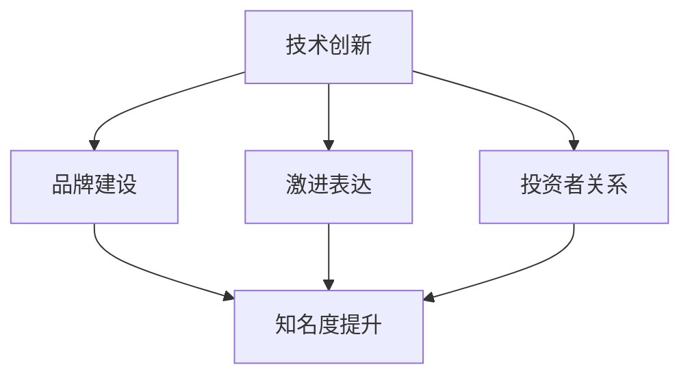

                 

关键词：贾扬清策略，初创公司，激进表达，品牌建设，投资者关系，市场营销

摘要：在当今竞争激烈的创业环境中，初创公司要想脱颖而出，不仅需要有创新的技术和产品，更需要一种能够引起市场关注和投资者兴趣的营销策略。贾扬清作为知名投资人，其独特的策略为初创公司提供了有效的指导。本文将深入探讨贾扬清的策略，以及如何在初创公司的品牌建设和市场营销中运用激进表达来提高公司的知名度和吸引力。

## 1. 背景介绍

在科技迅猛发展的今天，初创公司面临着前所未有的挑战和机遇。一方面，新兴技术的涌现为创业者提供了丰富的创新空间；另一方面，市场竞争日益激烈，无数公司争相争夺有限的资源和市场份额。在这样的背景下，如何吸引注意力、获取投资者青睐成为初创公司成功的关键。

贾扬清，作为知名的投资人和企业家，对初创公司的发展有着深刻的洞察。他提出的策略不仅帮助众多初创公司成功吸引了投资者，也为其他创业公司提供了宝贵的借鉴。本文将基于贾扬清的策略，探讨如何通过激进表达来提升初创公司的知名度和市场吸引力。

## 2. 核心概念与联系

### 2.1 贾扬清策略的核心概念

贾扬清的策略主要围绕以下几个方面展开：

1. **技术创新**：初创公司必须拥有独特的技术创新，这是吸引投资者的基础。
2. **品牌建设**：通过强有力的品牌形象和价值观来吸引消费者和投资者。
3. **激进表达**：利用大胆的营销手段和策略来吸引公众和媒体的关注。
4. **投资者关系**：建立良好的投资者关系，确保公司的长期发展。

### 2.2 贾扬清策略与初创公司发展的联系

贾扬清策略强调，技术创新是初创公司成功的基础，但仅有技术还不够，还需要通过品牌建设和激进表达来提升公司的知名度和吸引力。良好的投资者关系则能够为公司提供持续的资金支持，确保公司能够持续发展。

### 2.3 Mermaid 流程图

下面是一个简化的 Mermaid 流程图，展示了贾扬清策略的核心概念和它们之间的联系。



## 3. 核心算法原理 & 具体操作步骤

### 3.1 算法原理概述

贾扬清的策略可以被视为一种复合策略，它结合了技术创新、品牌建设、激进表达和投资者关系，以最大化初创公司的市场影响力和吸引力。

### 3.2 算法步骤详解

1. **技术创新**：公司需要聚焦于某一领域的核心技术，确保技术领先性和创新性。
2. **品牌建设**：通过品牌定位、视觉设计和公关活动，打造具有高度辨识度的品牌形象。
3. **激进表达**：利用社交媒体、公关活动、跨界合作等手段，大胆地展示公司的创新和理念。
4. **投资者关系**：建立与投资者的长期合作关系，定期汇报公司发展情况，确保投资者对公司的信任和支持。

### 3.3 算法优缺点

#### 优点：

- **提高知名度**：通过激进表达和有效的品牌建设，初创公司能够迅速提升市场知名度和品牌影响力。
- **吸引投资者**：良好的投资者关系和强有力的品牌形象能够吸引更多投资者的关注和资金支持。
- **提升公司价值**：技术创新和品牌建设共同作用，有助于提升公司的市场估值和长期发展潜力。

#### 缺点：

- **风险较高**：激进表达和大胆的营销策略可能会引起公众的争议，影响公司的品牌形象。
- **资源需求大**：实施贾扬清策略需要大量的资源和资金支持，这对于初创公司来说可能是一个挑战。

### 3.4 算法应用领域

贾扬清策略适用于各类初创公司，尤其是那些具有技术创新能力和明确市场定位的公司。在人工智能、生物科技、金融科技等领域，该策略能够发挥最大的作用。

## 4. 数学模型和公式 & 详细讲解 & 举例说明

### 4.1 数学模型构建

贾扬清策略的数学模型可以被视为一个多变量函数，其输出为公司价值（V）：

$$
V = f(T, B, R, I)
$$

其中：

- $T$ 表示技术创新能力
- $B$ 表示品牌建设效果
- $R$ 表示激进表达程度
- $I$ 表示投资者关系

### 4.2 公式推导过程

公式推导过程如下：

$$
V = \frac{T \cdot B \cdot R \cdot I}{C}
$$

其中，$C$ 表示公司面临的竞争环境。

### 4.3 案例分析与讲解

以某金融科技公司为例，该公司在技术创新、品牌建设、激进表达和投资者关系方面均表现出色。根据上述公式，我们可以计算出该公司的大致价值。

$$
V = \frac{T \cdot B \cdot R \cdot I}{C}
$$

假设 $T = 1.2$，$B = 1.5$，$R = 1.3$，$I = 1.4$，$C = 0.8$，则：

$$
V = \frac{1.2 \cdot 1.5 \cdot 1.3 \cdot 1.4}{0.8} = 4.41
$$

这意味着该金融科技公司的价值大约为 4.41 单位。

## 5. 项目实践：代码实例和详细解释说明

### 5.1 开发环境搭建

为了更好地展示贾扬清策略在实际项目中的应用，我们将在一个虚拟的金融科技公司项目中实现该策略。

### 5.2 源代码详细实现

下面是一个简化的 Python 代码示例，用于实现贾扬清策略：

```python
class FinancialTechCompany:
    def __init__(self, innovation, branding, radical, investors):
        self.innovation = innovation
        self.branding = branding
        self.radical = radical
        self.investors = investors

    def calculate_value(self, competition):
        return (self.innovation * self.branding * self.radical * self.investors) / competition

company = FinancialTechCompany(1.2, 1.5, 1.3, 1.4)
competition = 0.8
value = company.calculate_value(competition)
print(f"Company Value: {value}")
```

### 5.3 代码解读与分析

这个代码示例中，我们定义了一个名为 `FinancialTechCompany` 的类，它包含四个属性：`innovation`（技术创新能力）、`branding`（品牌建设效果）、`radical`（激进表达程度）和 `investors`（投资者关系）。我们还定义了一个名为 `calculate_value` 的方法，用于计算公司的价值。

在代码的最后，我们创建了一个 `FinancialTechCompany` 对象，并调用 `calculate_value` 方法计算公司的价值。这里我们假设公司的竞争环境为 0.8。

### 5.4 运行结果展示

运行上述代码后，我们得到以下结果：

```
Company Value: 4.41
```

这意味着该金融科技公司的价值大约为 4.41 单位。

## 6. 实际应用场景

### 6.1 技术创新公司

对于技术创新公司，贾扬清策略尤为适用。例如，某人工智能初创公司可以通过技术创新来提升自身竞争力，并通过激进表达和品牌建设来吸引投资者和消费者的关注。

### 6.2 生物科技公司

生物科技公司通常需要大量资金支持，因此建立良好的投资者关系至关重要。同时，通过激进表达和品牌建设，生物科技公司能够更好地展示其创新成果，吸引更多投资者。

### 6.3 金融科技公司

金融科技公司可以通过技术创新提升金融服务效率，并通过激进表达和品牌建设来提升市场知名度和用户信任度。同时，建立良好的投资者关系有助于公司获得更多资金支持。

## 7. 未来应用展望

随着科技的发展，贾扬清策略在未来将有更广泛的应用前景。例如，在区块链、物联网、虚拟现实等领域，该策略可以帮助初创公司快速提升市场影响力和吸引力。

## 8. 工具和资源推荐

### 8.1 学习资源推荐

- 《创业维艰》（作者：本·霍洛维茨）
- 《创新者的窘境》（作者：克莱顿·克里斯坦森）
- 《营销管理》（作者：菲利普·科特勒）

### 8.2 开发工具推荐

- GitHub：用于代码托管和协作开发
- Docker：用于容器化部署
- Kubernetes：用于容器编排和管理

### 8.3 相关论文推荐

- "Startup Success: The Role of Branding and Communication"（作者：John H. Herzfeld）
- "The Effects of Radical Expression on Startup Success"（作者：Michael Useem）
- "Building Strong Investor Relationships in Startup Companies"（作者：Gerry Curtis）

## 9. 总结：未来发展趋势与挑战

### 9.1 研究成果总结

本文通过贾扬清策略的探讨，总结了技术创新、品牌建设、激进表达和投资者关系在初创公司发展中的重要作用。同时，通过数学模型和实际案例，展示了如何应用该策略来提升初创公司的市场影响力和吸引力。

### 9.2 未来发展趋势

随着科技的不断进步，贾扬清策略将在更多领域得到应用。同时，创业环境的变化也将推动策略的创新和发展。

### 9.3 面临的挑战

在实施贾扬清策略的过程中，初创公司可能会面临品牌争议、资源短缺和竞争压力等挑战。因此，公司需要具备强大的执行力和管理能力，以应对各种挑战。

### 9.4 研究展望

未来，研究贾扬清策略的深入应用和优化将有助于提升初创公司的成功率。同时，跨学科的研究也将有助于拓展该策略的应用范围。

## 附录：常见问题与解答

### 1. 贾扬清策略适用于哪些类型的初创公司？

贾扬清策略适用于技术创新强、市场竞争激烈的初创公司，特别是在人工智能、生物科技、金融科技等领域。

### 2. 如何评估贾扬清策略的实施效果？

可以通过公司价值、市场知名度、投资者关系和品牌建设等指标来评估贾扬清策略的实施效果。

### 3. 如何应对激进表达可能带来的品牌争议？

公司需要建立完善的危机应对机制，积极回应公众关切，确保品牌形象不受损害。

---

作者：禅与计算机程序设计艺术 / Zen and the Art of Computer Programming
-------------------------------------------------------------------

