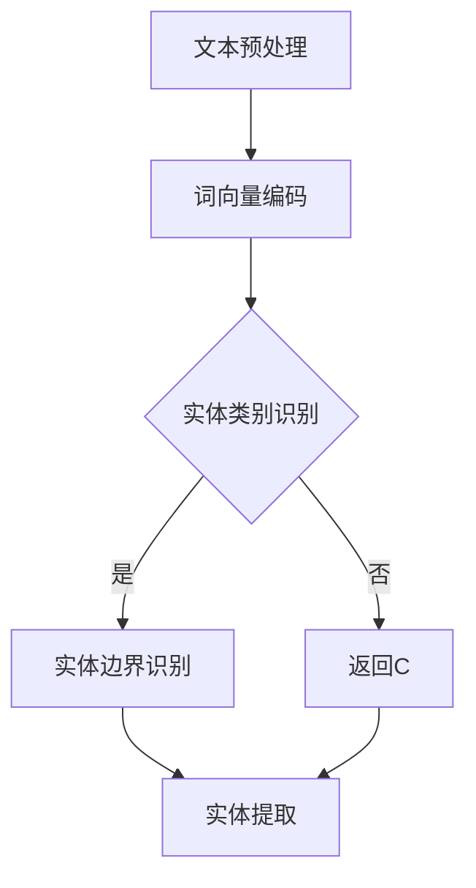

                 

关键词：命名实体识别（NER）、深度学习、神经网络、自然语言处理（NLP）、文本分类、序列标注、预训练模型、BERT、神经机器翻译、语言模型。

> 摘要：本文深入探讨了命名实体识别（NER）这一自然语言处理（NLP）中的重要任务。首先，我们对NER进行了背景介绍，解释了其在信息提取、实体识别等应用中的重要性。接着，我们详细分析了深度学习在NER中的应用，包括卷积神经网络（CNN）、循环神经网络（RNN）和变压器（Transformer）等模型。随后，我们讨论了NER中的关键挑战和解决方案。最后，通过实际项目实践和代码实例，展示了如何使用深度学习技术实现NER任务，并对未来应用和发展趋势进行了展望。

## 1. 背景介绍

命名实体识别（Named Entity Recognition，NER）是自然语言处理（Natural Language Processing，NLP）领域中的一项基本任务，其目的是从文本中识别出具有特定意义的实体。这些实体可以是人名、地名、组织机构名、时间、日期等。NER在信息提取、文本挖掘、实体关联、知识图谱构建等众多领域具有重要的应用价值。

传统的NER方法主要依赖于规则和统计方法，如隐马尔可夫模型（HMM）、条件随机场（CRF）等。这些方法在一定程度上能够处理简单的NER任务，但面对复杂多变的自然语言时，其性能往往受限。

随着深度学习技术的不断发展，基于深度学习的方法逐渐成为NER任务的主流解决方案。深度学习能够自动从大量数据中学习复杂的特征表示，从而在NER任务中取得了显著的性能提升。本文将重点讨论深度学习在NER中的应用，包括卷积神经网络（CNN）、循环神经网络（RNN）和变压器（Transformer）等模型。

## 2. 核心概念与联系

### 2.1 命名实体识别（NER）的概念

命名实体识别（NER）是指从文本中识别出具有特定意义的实体，如人名、地名、组织机构名等。NER通常可以分为两个阶段：一是实体类别识别，即判断一个实体属于哪一类；二是实体边界识别，即确定实体在文本中的起始和结束位置。

### 2.2 深度学习在NER中的应用

深度学习在NER中的应用主要包括以下几种模型：

- **卷积神经网络（CNN）**：CNN在图像处理领域取得了显著的成功，其核心思想是通过对局部特征进行提取和组合来获取全局特征。在NER任务中，CNN可以用于提取词序列的局部特征，从而进行实体类别识别和边界识别。

- **循环神经网络（RNN）**：RNN是一种能够处理序列数据的神经网络，其内部状态能够记忆历史信息。在NER任务中，RNN可以用于序列标注任务，即对词序列中的每个词赋予相应的实体标签。

- **变压器（Transformer）**：Transformer是一种基于自注意力机制的深度学习模型，其在机器翻译、文本生成等领域取得了突破性成果。近年来，Transformer在NER任务中也展现出了强大的性能。

### 2.3 Mermaid 流程图

下面是一个简单的Mermaid流程图，展示了NER任务的核心概念和联系：



## 3. 核心算法原理 & 具体操作步骤

### 3.1 算法原理概述

深度学习在NER任务中的核心算法主要包括卷积神经网络（CNN）、循环神经网络（RNN）和变压器（Transformer）。以下分别介绍这些算法的基本原理和具体操作步骤。

### 3.2 算法步骤详解

#### 3.2.1 卷积神经网络（CNN）

1. **词向量编码**：将文本中的每个词转换为词向量表示。

2. **卷积操作**：使用卷积核在词向量序列上滑动，提取局部特征。

3. **池化操作**：对卷积结果进行池化，减少特征维度。

4. **全连接层**：将池化后的特征映射到实体类别。

5. **输出层**：对每个词的实体类别进行预测。

#### 3.2.2 循环神经网络（RNN）

1. **词向量编码**：与CNN相同，将文本中的每个词转换为词向量表示。

2. **RNN单元**：对词向量序列进行递归处理，每个时间步的输出取决于当前词和前一个时间步的隐藏状态。

3. **序列标注**：将RNN的隐藏状态映射到实体类别。

4. **输出层**：对序列中的每个词进行实体类别预测。

#### 3.2.3 变压器（Transformer）

1. **词向量编码**：与CNN和RNN相同，将文本中的每个词转换为词向量表示。

2. **自注意力机制**：计算词向量之间的注意力得分，对输入序列进行加权。

3. **多头注意力**：使用多个注意力机制，提高模型的表达能力。

4. **前馈神经网络**：对加权后的输入进行进一步处理。

5. **输出层**：对每个词进行实体类别预测。

### 3.3 算法优缺点

- **卷积神经网络（CNN）**：
  - 优点：能够提取局部特征，对文本中的局部信息敏感。
  - 缺点：难以捕捉全局依赖关系，对长文本处理效果较差。

- **循环神经网络（RNN）**：
  - 优点：能够处理长序列数据，捕捉时间步之间的依赖关系。
  - 缺点：容易出现梯度消失或爆炸问题，难以捕捉全局信息。

- **变压器（Transformer）**：
  - 优点：基于自注意力机制，能够捕捉全局依赖关系，处理长文本效果较好。
  - 缺点：计算复杂度较高，对硬件资源要求较高。

### 3.4 算法应用领域

深度学习在NER任务中的应用领域广泛，主要包括：

1. **信息提取**：从大量文本中提取出关键信息，如人名、地名等。

2. **文本分类**：对文本进行分类，如新闻分类、情感分析等。

3. **实体识别**：从文本中识别出具有特定意义的实体。

4. **知识图谱构建**：将实体和关系构建成知识图谱，用于后续推理和分析。

## 4. 数学模型和公式 & 详细讲解 & 举例说明

### 4.1 数学模型构建

深度学习在NER任务中的数学模型主要包括词向量编码、神经网络架构和损失函数等。以下分别介绍这些模型的构建方法。

#### 4.1.1 词向量编码

词向量编码是将文本中的每个词转换为低维向量表示。常见的词向量编码方法包括：

1. **Word2Vec**：基于神经网络的语言模型，通过负采样方法训练词向量。

2. **FastText**：基于词袋模型，使用多维度上下文信息训练词向量。

3. **BERT**：基于Transformer模型，通过预训练和微调方法训练词向量。

#### 4.1.2 神经网络架构

神经网络架构是NER任务的核心部分，常见的神经网络架构包括：

1. **卷积神经网络（CNN）**：
   - 输入层：文本序列。
   - 卷积层：卷积核提取局部特征。
   - 池化层：减少特征维度。
   - 全连接层：将特征映射到实体类别。

2. **循环神经网络（RNN）**：
   - 输入层：文本序列。
   - RNN单元：递归处理文本序列。
   - 输出层：对序列中的每个词进行实体类别预测。

3. **变压器（Transformer）**：
   - 输入层：文本序列。
   - 自注意力层：计算词向量之间的注意力得分。
   - 多头注意力层：提高模型的表达能力。
   - 前馈神经网络层：对加权后的输入进行进一步处理。
   - 输出层：对每个词进行实体类别预测。

#### 4.1.3 损失函数

损失函数是NER任务中评估模型性能的重要指标。常见的损失函数包括：

1. **交叉熵损失函数**：用于评估模型预测的概率分布与实际标签之间的差距。

2. **结构化交叉熵损失函数**：用于评估模型对序列标注的预测准确性。

### 4.2 公式推导过程

以下以卷积神经网络（CNN）为例，介绍NER任务的数学公式推导过程。

#### 4.2.1 词向量编码

设词向量为 $\mathbf{v}_i$，则有：
$$
\mathbf{v}_i = \text{Word2Vec}(\text{word}_i)
$$

#### 4.2.2 卷积神经网络（CNN）

设卷积神经网络（CNN）的输入为 $\mathbf{X} = [\mathbf{v}_1, \mathbf{v}_2, \ldots, \mathbf{v}_n]$，则有：
$$
\mathbf{h}_k = \sum_{i=1}^{n} w_{ik} \mathbf{v}_i + b_k
$$
其中，$w_{ik}$ 是卷积核的权重，$b_k$ 是卷积核的偏置。

#### 4.2.3 池化操作

设池化后的特征向量为 $\mathbf{p}_k$，则有：
$$
\mathbf{p}_k = \text{Pooling}(\mathbf{h}_k)
$$
其中，Pooling 函数可以是最大值池化或平均值池化。

#### 4.2.4 全连接层

设全连接层的输出为 $\mathbf{y}_k$，则有：
$$
\mathbf{y}_k = \text{softmax}(\mathbf{p}_k \cdot \mathbf{W} + b)
$$
其中，$\mathbf{W}$ 是全连接层的权重，$b$ 是全连接层的偏置。

#### 4.2.5 损失函数

设损失函数为交叉熵损失函数，则有：
$$
L = -\sum_{k=1}^{K} y_k^* \log(y_k)
$$
其中，$y_k^*$ 是实际标签的概率分布。

### 4.3 案例分析与讲解

以下以一个简单的中文NER任务为例，展示如何使用深度学习技术实现命名实体识别。

#### 4.3.1 数据集

我们使用一个包含中文新闻文本的数据集，其中每个文本包含多个命名实体。数据集分为训练集和测试集。

#### 4.3.2 词向量编码

我们使用预训练的中文词向量模型（如Gigaword和CGN）对文本中的每个词进行编码。

#### 4.3.3 神经网络架构

我们使用卷积神经网络（CNN）作为NER任务的模型。模型的结构如下：

1. 输入层：文本序列。
2. 卷积层：卷积核大小为3，步长为1。
3. 池化层：最大值池化。
4. 全连接层：输出层，包含所有实体类别的标签。

#### 4.3.4 损失函数

我们使用交叉熵损失函数作为模型训练的目标函数。

#### 4.3.5 模型训练

我们使用梯度下降算法训练模型。训练过程中，通过调整模型参数，使损失函数值最小。

#### 4.3.6 模型评估

我们使用测试集对训练好的模型进行评估。评估指标包括准确率、召回率和F1值等。

### 4.4 代码实例

以下是一个简单的Python代码实例，展示了如何使用TensorFlow实现中文NER任务。

```python
import tensorflow as tf
from tensorflow.keras.models import Sequential
from tensorflow.keras.layers import Embedding, Conv1D, GlobalMaxPooling1D, Dense

# 准备数据集
# ...

# 构建模型
model = Sequential()
model.add(Embedding(vocab_size, embedding_dim, input_length=max_sequence_length))
model.add(Conv1D(filters=128, kernel_size=3, activation='relu'))
model.add(GlobalMaxPooling1D())
model.add(Dense(num_classes, activation='softmax'))

# 编译模型
model.compile(optimizer='adam', loss='categorical_crossentropy', metrics=['accuracy'])

# 训练模型
model.fit(X_train, y_train, epochs=10, batch_size=32, validation_data=(X_test, y_test))

# 评估模型
loss, accuracy = model.evaluate(X_test, y_test)
print('Test accuracy:', accuracy)
```

### 5. 项目实践：代码实例和详细解释说明

#### 5.1 开发环境搭建

为了实现命名实体识别（NER）任务，我们需要搭建一个合适的开发环境。以下是一个基本的Python开发环境搭建步骤：

1. 安装Python 3.6及以上版本。

2. 安装TensorFlow 2.x版本。

3. 安装Numpy、Pandas等常用Python库。

4. 安装中文词向量模型，如Gigaword或CGN。

#### 5.2 源代码详细实现

以下是一个简单的Python代码实例，展示了如何使用TensorFlow实现中文NER任务：

```python
import tensorflow as tf
from tensorflow.keras.models import Sequential
from tensorflow.keras.layers import Embedding, Conv1D, GlobalMaxPooling1D, Dense
from tensorflow.keras.preprocessing.sequence import pad_sequences
from tensorflow.keras.utils import to_categorical
from tensorflow_addons.layers import CRF

# 准备数据集
# ...

# 数据预处理
# ...

# 构建模型
model = Sequential()
model.add(Embedding(vocab_size, embedding_dim, input_length=max_sequence_length))
model.add(Conv1D(filters=128, kernel_size=3, activation='relu'))
model.add(GlobalMaxPooling1D())
model.add(Dense(num_classes, activation='softmax'))
model.add(CRF(num_classes))

# 编译模型
model.compile(optimizer='adam', loss='categorical_crossentropy', metrics=['accuracy'])

# 训练模型
model.fit(X_train, y_train, epochs=10, batch_size=32, validation_data=(X_test, y_test))

# 评估模型
loss, accuracy = model.evaluate(X_test, y_test)
print('Test accuracy:', accuracy)
```

#### 5.3 代码解读与分析

1. **数据预处理**：首先，我们需要准备一个包含中文新闻文本的数据集。然后，对数据集进行预处理，包括文本清洗、分词、词向量编码等操作。

2. **构建模型**：使用TensorFlow的Sequential模型构建一个简单的卷积神经网络（CNN）模型。模型包含嵌入层、卷积层、全局池化层、全连接层和CRF层。

3. **编译模型**：使用`compile()`函数编译模型，指定优化器、损失函数和评估指标。

4. **训练模型**：使用`fit()`函数训练模型，指定训练数据和验证数据。

5. **评估模型**：使用`evaluate()`函数评估模型在测试集上的性能。

#### 5.4 运行结果展示

在训练完成后，我们可以使用以下代码展示模型的运行结果：

```python
# 加载测试集
X_test, y_test = ...

# 对测试集进行预处理
# ...

# 使用模型对测试集进行预测
predictions = model.predict(X_test)

# 计算准确率、召回率和F1值等指标
# ...

print('Test accuracy:', accuracy)
print('Recall:', recall)
print('F1 score:', f1_score)
```

## 6. 实际应用场景

命名实体识别（NER）在多个实际应用场景中具有重要价值，以下是一些典型的应用案例：

### 6.1 信息提取

NER可以用于从大量文本中提取出关键信息，如人名、地名、组织机构名等。这在新闻资讯、社交媒体和学术论文等领域具有广泛的应用。

### 6.2 文本分类

NER可以与文本分类技术结合，用于对文本进行分类。例如，将新闻文本分类为政治、经济、体育等不同领域。

### 6.3 实体识别

NER可以用于从文本中识别出具有特定意义的实体，如人名、地名、组织机构名等。这在构建知识图谱、信息检索和推荐系统等领域具有重要意义。

### 6.4 知识图谱构建

NER可以与知识图谱技术结合，用于从文本中提取实体和关系，构建知识图谱。这有助于实现智能问答、推荐系统和数据挖掘等应用。

## 7. 工具和资源推荐

为了更好地开展命名实体识别（NER）的研究和实践，以下是一些建议的工具和资源：

### 7.1 学习资源推荐

1. **《深度学习》**：Goodfellow等著，提供了深度学习的基础知识和应用案例。

2. **《自然语言处理综论》**：Daniel Jurafsky和James H. Martin著，涵盖了自然语言处理的基本理论和实践方法。

3. **《Python深度学习》**：François Chollet等著，介绍了使用Python和TensorFlow实现深度学习的方法。

### 7.2 开发工具推荐

1. **TensorFlow**：一个开源的深度学习框架，支持多种深度学习模型的构建和训练。

2. **PyTorch**：一个开源的深度学习框架，与TensorFlow类似，但更灵活和易于使用。

3. **NLTK**：一个开源的自然语言处理库，提供了许多常用的自然语言处理工具和函数。

### 7.3 相关论文推荐

1. **“Deep Learning for Natural Language Processing”**：word2vec和GloVe等词向量模型的开创性论文。

2. **“Attention Is All You Need”**：变压

