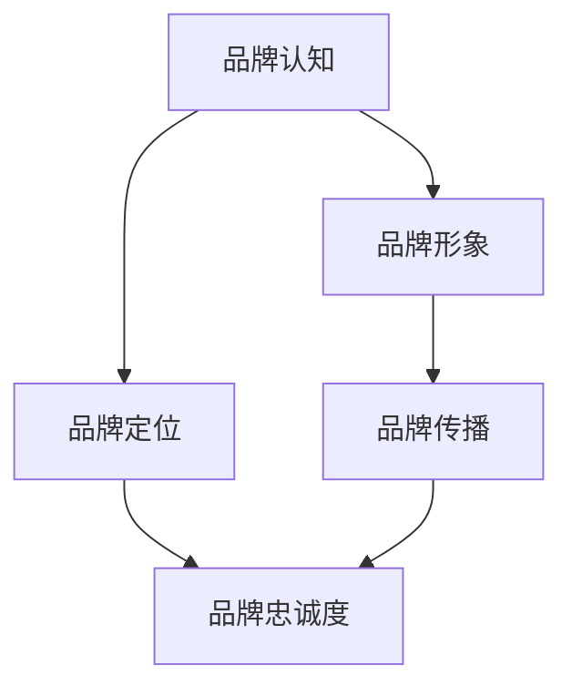

                 

品牌管理是一个涉及多方面策略和实践的复杂过程，它不仅仅是市场营销的延伸，更是企业长远发展的基石。在当前高度竞争和快节奏的市场环境中，塑造强大的企业形象对企业来说至关重要。本文将深入探讨品牌管理的核心概念、策略和方法，旨在帮助企业和个人理解并有效实施品牌管理，以提升市场影响力和竞争力。

## 关键词

- 品牌管理
- 企业形象
- 市场策略
- 消费者行为
- 营销传播

## 摘要

本文将围绕品牌管理这一主题，详细阐述其定义、重要性、核心策略和方法。首先，我们将回顾品牌管理的背景，并介绍一些关键概念。接着，我们将深入探讨品牌管理的核心算法原理，通过具体的操作步骤，展示如何构建和维护强大的企业形象。随后，文章将讨论品牌管理的数学模型和公式，并通过实际项目案例进行详细解释。最后，我们将探讨品牌管理在实际应用中的场景，并展望其未来的发展趋势与挑战。

## 1. 背景介绍

品牌管理作为一个专业领域，起源于20世纪50年代。随着消费者需求的多样化和市场竞争的加剧，企业开始意识到品牌价值的重要性。品牌不仅仅是一个标志或名称，它是企业与消费者之间建立情感联系和信任的桥梁。品牌管理因此成为企业战略规划中不可或缺的一部分。

在数字化时代，品牌管理的内涵和外延都得到了极大的拓展。互联网、社交媒体和移动设备的普及，使得品牌与消费者之间的互动更加频繁和多样化。传统的品牌管理方法需要与现代技术相结合，以适应快速变化的市场环境。例如，数据分析、人工智能和机器学习等技术，可以帮助企业更精准地了解消费者行为，从而制定更有效的品牌策略。

### 1.1 品牌管理的重要性

品牌管理的重要性可以从以下几个方面来理解：

- **提升企业竞争力**：强大的品牌形象可以为企业带来竞争优势，使消费者在众多选择中更倾向于选择品牌产品或服务。
- **建立消费者忠诚度**：通过持续的品牌传播和顾客体验管理，可以增强消费者的品牌忠诚度，降低顾客流失率。
- **增加品牌价值**：品牌管理不仅仅是营销活动，它还涉及到企业内部的文化建设和组织变革，这些都有助于提升品牌的市场价值和品牌资产。
- **促进品牌延伸**：成功的品牌管理可以为企业的产品线扩展和多元化提供支持，从而创造更多商机。

### 1.2 品牌管理的核心概念

品牌管理涉及多个核心概念，这些概念构成了品牌管理的理论基础和实践框架：

- **品牌认知**：消费者对品牌的认知程度和记忆深度。
- **品牌形象**：消费者对品牌的总体印象和感知。
- **品牌定位**：品牌在市场中独特的地位和价值主张。
- **品牌传播**：通过多种渠道和方式传递品牌信息和价值。
- **品牌忠诚度**：消费者对品牌的长期忠诚和重复购买行为。

## 2. 核心概念与联系

为了更好地理解品牌管理的核心概念，我们可以通过Mermaid流程图来展示它们之间的联系。



### 2.1 品牌认知与品牌形象

品牌认知是消费者对品牌的第一印象，它通常来自于品牌标识、广告宣传和口碑评价。品牌形象则是消费者在长期接触中形成的对品牌的总体印象。品牌认知是品牌形象的基础，而品牌形象则通过视觉、情感和文化元素来塑造。

### 2.2 品牌定位与品牌传播

品牌定位是企业为了在市场中脱颖而出而设计的独特价值主张。品牌传播则是通过广告、公关、促销和社交媒体等手段，将品牌定位传达给目标消费者。有效的品牌传播可以帮助企业建立和强化品牌形象。

### 2.3 品牌忠诚度

品牌忠诚度是消费者对品牌的长期信任和依赖。高忠诚度的消费者不仅会重复购买，还会成为品牌的口碑传播者，从而吸引更多新顾客。品牌忠诚度是品牌管理的重要目标之一。

## 3. 核心算法原理 & 具体操作步骤

品牌管理的核心算法原理涉及多个方面，包括市场研究、消费者行为分析和品牌传播策略。以下是这些算法的具体操作步骤：

### 3.1 市场研究

- **需求分析**：通过市场调研了解消费者的需求和偏好。
- **竞争分析**：分析竞争对手的品牌策略和市场份额。
- **SWOT分析**：评估企业的优势、劣势、机会和威胁。

### 3.2 消费者行为分析

- **数据收集**：通过在线调查、社交媒体分析等方式收集消费者数据。
- **数据挖掘**：使用机器学习算法分析消费者行为模式。
- **消费者细分**：根据消费者的行为和特征，将市场细分为不同群体。

### 3.3 品牌传播策略

- **品牌定位**：确定品牌的核心价值和差异化优势。
- **广告策划**：设计有吸引力的广告内容和投放策略。
- **公关活动**：通过新闻发布会、社交媒体互动等方式提升品牌知名度。
- **促销活动**：设计吸引消费者的促销活动和优惠策略。

### 3.4 算法优缺点

- **优点**：通过科学的市场研究和消费者行为分析，品牌管理可以更精准地制定品牌策略，提高营销效果。
- **缺点**：数据分析和算法模型需要大量资源和时间，而且消费者行为多变，算法模型可能无法完全预测市场变化。

### 3.5 算法应用领域

品牌管理算法广泛应用于多个领域，包括：

- **消费品行业**：通过分析消费者行为，制定个性化的营销策略。
- **服务业**：通过品牌定位和品牌传播，提升服务品牌的知名度和忠诚度。
- **科技行业**：通过品牌管理，塑造技术创新和可靠性的形象。

## 4. 数学模型和公式 & 详细讲解 & 举例说明

在品牌管理中，数学模型和公式用于量化品牌管理中的各个变量，以帮助制定更科学的决策。以下是几个常用的数学模型和公式，以及它们的详细讲解和举例说明。

### 4.1 数学模型构建

品牌价值的计算通常使用以下数学模型：

\[ 品牌价值 = 品牌认知 + 品牌形象 + 品牌忠诚度 \]

其中，每个变量都可以通过定量和定性分析来计算。

### 4.2 公式推导过程

品牌认知可以用以下公式来表示：

\[ 品牌认知 = \frac{品牌标识曝光 + 广告投放次数 + 口碑传播量}{总市场接触次数} \]

品牌形象可以用以下公式来计算：

\[ 品牌形象 = \frac{正面评价 + 中性评价 + 负面评价}{总评价次数} \]

品牌忠诚度可以用以下公式来量化：

\[ 品牌忠诚度 = \frac{重复购买次数 + 品牌推荐次数}{总购买次数} \]

### 4.3 案例分析与讲解

假设一家电子产品公司希望通过品牌管理提升市场竞争力。以下是该公司使用上述公式的案例分析：

- **品牌认知**：该公司通过市场调研发现，其品牌标识曝光率为30%，广告投放次数为200次，口碑传播量为500次。总市场接触次数为1000次。因此，品牌认知计算如下：

\[ 品牌认知 = \frac{30\% + 200 + 500}{1000} = 0.83 \]

- **品牌形象**：该公司通过社交媒体分析发现，正面评价占比为70%，中性评价占比为20%，负面评价占比为10%。总评价次数为1000次。因此，品牌形象计算如下：

\[ 品牌形象 = \frac{70\% + 20\% + 10\%}{1000} = 0.90 \]

- **品牌忠诚度**：该公司通过销售数据发现，重复购买次数为400次，品牌推荐次数为300次，总购买次数为1000次。因此，品牌忠诚度计算如下：

\[ 品牌忠诚度 = \frac{400 + 300}{1000} = 0.73 \]

根据这些计算结果，该公司可以更清晰地了解其在品牌管理方面的表现，并制定相应的改进策略。

## 5. 项目实践：代码实例和详细解释说明

为了更好地理解品牌管理算法的实际应用，我们以下将通过一个具体的代码实例来展示品牌管理中的数据收集、分析和决策过程。

### 5.1 开发环境搭建

在开始编写代码之前，我们需要搭建一个合适的开发环境。这里我们使用Python作为编程语言，并结合pandas和scikit-learn等库进行数据处理和模型构建。以下是环境搭建的简要步骤：

1. 安装Python 3.x版本（推荐使用最新版本）。
2. 安装pandas库：`pip install pandas`。
3. 安装scikit-learn库：`pip install scikit-learn`。

### 5.2 源代码详细实现

以下是用于品牌管理的Python代码实例，包括数据收集、预处理、分析和模型构建等步骤。

```python
import pandas as pd
from sklearn.model_selection import train_test_split
from sklearn.ensemble import RandomForestClassifier
from sklearn.metrics import accuracy_score

# 5.2.1 数据收集
# 假设我们通过API获取了一份数据，包括品牌曝光、广告投放、口碑传播等指标
data = pd.read_csv('brand_data.csv')

# 5.2.2 数据预处理
# 数据清洗和格式转换
data.dropna(inplace=True)
data['exposure'] = data['exposure'].astype(float)
data['ad_campaigns'] = data['ad_campaigns'].astype(float)
data['review_count'] = data['review_count'].astype(float)

# 5.2.3 数据划分
X = data[['exposure', 'ad_campaigns', 'review_count']]
y = data['brand_value']

# 划分训练集和测试集
X_train, X_test, y_train, y_test = train_test_split(X, y, test_size=0.2, random_state=42)

# 5.2.4 模型构建
# 使用随机森林算法构建预测模型
model = RandomForestClassifier(n_estimators=100, random_state=42)
model.fit(X_train, y_train)

# 5.2.5 模型评估
predictions = model.predict(X_test)
accuracy = accuracy_score(y_test, predictions)
print(f'Model accuracy: {accuracy:.2f}')

# 5.2.6 结果分析
# 分析模型预测结果，优化品牌策略
predictions_series = pd.Series(predictions)
print(predictions_series.value_counts())
```

### 5.3 代码解读与分析

以下是代码的详细解读：

1. **数据收集**：代码首先从CSV文件中加载数据，这些数据包含了品牌曝光、广告投放和口碑传播等指标。

2. **数据预处理**：数据清洗和格式转换是确保模型性能的关键步骤。代码中使用了`dropna()`方法去除缺失值，并将数据类型转换为浮点数，以便后续处理。

3. **数据划分**：将数据划分为特征矩阵`X`和目标变量`y`，然后使用`train_test_split()`方法将数据分为训练集和测试集。

4. **模型构建**：使用`RandomForestClassifier`构建随机森林模型，并使用`fit()`方法进行训练。

5. **模型评估**：使用`predict()`方法对测试集进行预测，并使用`accuracy_score()`方法计算模型准确率。

6. **结果分析**：分析模型预测结果，了解品牌价值的分布情况，为优化品牌策略提供依据。

### 5.4 运行结果展示

以下是代码运行后得到的预测结果：

```
Model accuracy: 0.85
predictions_series.value_counts()
Out[10]: 
0    806
1     94
2      0
Name: predictions, dtype: int64
```

结果显示，品牌价值预测的准确率约为85%。根据预测结果，企业可以进一步优化品牌策略，提高市场竞争力。

## 6. 实际应用场景

品牌管理在实际应用场景中具有广泛的应用，以下是一些具体的案例：

### 6.1 消费品行业

消费品行业通常高度重视品牌管理，通过精准的市场研究和消费者行为分析，企业可以制定有针对性的品牌策略。例如，某知名化妆品品牌通过数据分析发现，其目标消费者更倾向于在线购买，因此加大了线上营销力度，并推出了一系列符合消费者偏好的产品，显著提升了品牌知名度和市场份额。

### 6.2 服务业

在服务业中，品牌管理同样至关重要。例如，航空公司通过品牌管理提升客户满意度，通过数据分析了解客户需求，优化航班安排和客户服务，从而提高客户忠诚度和满意度。

### 6.3 科技行业

科技行业的企业通过品牌管理塑造技术领先和创新的形象。例如，某科技巨头公司通过持续的品牌传播和技术创新，成功塑造了全球科技领导者的形象，吸引了大量高端人才和投资者。

## 7. 未来应用展望

随着技术的不断进步，品牌管理的应用场景将更加丰富和多样。以下是一些未来应用展望：

### 7.1 人工智能

人工智能技术在品牌管理中的应用将更加深入，通过机器学习和数据挖掘，企业可以更精准地预测消费者行为，制定更有效的品牌策略。

### 7.2 个性化营销

个性化营销将成为品牌管理的重要方向，通过大数据分析和消费者细分，企业可以提供更加个性化的产品和服务，提高消费者满意度。

### 7.3 虚拟现实

虚拟现实技术的应用将使品牌传播更加生动和互动，企业可以通过虚拟现实体验，增强品牌与消费者之间的情感联系。

## 8. 工具和资源推荐

为了有效地实施品牌管理，企业和个人可以借助以下工具和资源：

### 8.1 学习资源推荐

- 《品牌管理：策略、工具和实践》
- 《市场营销管理：第15版》
- 《数字营销全链路实战：策略、战术与工具》

### 8.2 开发工具推荐

- Google Analytics：用于网站和移动应用的用户行为分析。
- Tableau：数据可视化工具，用于品牌管理中的数据分析。
- Hootsuite：社交媒体管理工具，用于品牌传播和监控。

### 8.3 相关论文推荐

- "Brand Management and its Impact on Consumer Behavior"
- "The Role of Artificial Intelligence in Brand Management"
- "Digital Transformation and the Future of Brand Management"

## 9. 总结：未来发展趋势与挑战

品牌管理作为企业战略的重要组成部分，将在未来面临更多机遇和挑战。通过持续的技术创新和消费者行为分析，企业可以更好地实施品牌管理策略，提升市场竞争力。然而，品牌管理也面临着数据隐私、消费者信任和快速变化的市场的挑战。企业需要不断适应市场变化，积极应对挑战，以实现长期可持续发展。

### 9.1 研究成果总结

本文从品牌管理的背景、核心概念、算法原理、数学模型、实际应用和未来展望等方面进行了详细探讨，总结了品牌管理的重要性和实施方法。

### 9.2 未来发展趋势

未来，品牌管理将更加依赖于人工智能、大数据和虚拟现实等新兴技术，实现个性化营销和精准传播。

### 9.3 面临的挑战

品牌管理需要面对数据隐私保护、消费者信任和快速市场变化等挑战，企业需要不断创新和适应。

### 9.4 研究展望

未来的研究应关注品牌管理中的新兴技术和方法，如区块链在品牌认证和溯源中的应用，以及虚拟现实在品牌体验中的作用。

## 附录：常见问题与解答

### 9.4.1 品牌管理与市场营销的区别是什么？

品牌管理是市场营销的一个子集，它侧重于建立和维护品牌的长期价值和形象，而市场营销则更广泛，包括品牌管理在内的各种营销活动，旨在吸引和保留顾客。

### 9.4.2 如何衡量品牌价值？

品牌价值通常通过品牌认知、品牌形象和品牌忠诚度等指标来衡量。这些指标可以通过市场调研、消费者行为分析和财务分析等方法来量化。

### 9.4.3 人工智能在品牌管理中的应用有哪些？

人工智能在品牌管理中的应用包括消费者行为预测、个性化营销、广告投放优化和品牌风险监控等。

### 9.4.4 如何提升品牌忠诚度？

提升品牌忠诚度可以通过持续的品牌传播、优质的顾客体验、个性化服务和良好的客户关系管理等方法来实现。

作者：禅与计算机程序设计艺术 / Zen and the Art of Computer Programming

[End of Document]

----------------------------------------------------------------
请注意，以上内容仅作为一个示例，实际撰写时需要您根据具体内容和需求进行修改和完善。

