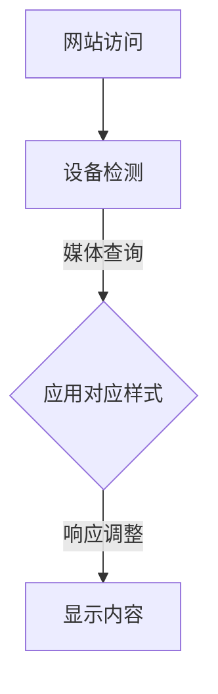

                 

在当今的数字时代，用户对访问方式的多样化需求迫使网站设计者必须考虑如何在不同的设备和屏幕尺寸上提供一致的体验。响应式Web设计（Responsive Web Design，简称RWD）应运而生，它是一种设计理念，旨在创建一个灵活且适应性强的网站，能够在各种设备上无缝呈现。本文将深入探讨响应式Web设计的核心概念、技术实现、应用场景以及未来的发展趋势。

## 关键词

- 响应式Web设计
- 多设备适配
- 响应式布局
- CSS媒体查询
- 响应式图片
- 元数据
- 移动优先设计
- 框架和工具

## 摘要

本文旨在为读者提供一个全面的响应式Web设计概述，从理论基础到实际应用，再到未来的发展方向。我们将探讨响应式Web设计的重要性，理解其背后的核心概念，并介绍一系列实用的技术方法和工具。通过本文，读者将能够掌握响应式Web设计的精髓，并在实际项目中应用这些知识，提高网站的用户体验和可访问性。

## 1. 背景介绍

### 1.1 响应式Web设计的起源

响应式Web设计的概念起源于2010年，当时智能手机和平板电脑开始广泛普及，用户不再局限于传统的桌面电脑进行网络浏览。设计师和开发者意识到，一个网站需要能够适应不同的设备，提供一致的用户体验。因此，响应式Web设计作为一种解决方法，开始受到广泛关注。

### 1.2 多设备访问趋势

随着移动互联网的快速发展，用户访问网站的设备越来越多样化。根据StatCounter的数据，截至2022年，全球移动设备的浏览量首次超过了桌面设备。这一趋势对网站设计提出了更高的要求，响应式Web设计成为了满足这一需求的关键技术。

### 1.3 响应式Web设计的重要性

响应式Web设计不仅能够提高用户体验，还能提升搜索引擎优化（SEO）效果。一个适应性强的网站可以更好地在各种设备上排名，吸引更多的流量。此外，响应式Web设计还能减少开发成本，因为只需一个网站即可满足不同设备的访问需求，无需为每种设备单独开发。

## 2. 核心概念与联系

### 2.1 响应式Web设计的核心概念

响应式Web设计的核心在于通过灵活的布局和媒体查询，使网站能够根据用户的设备和屏幕尺寸自动调整内容显示。以下是其核心概念：

- **流体网格布局**：使用相对单位（如百分比）而非固定像素来定义布局，使内容可以根据屏幕尺寸自由伸缩。
- **媒体查询**：CSS中的媒体查询（Media Queries）允许我们根据设备的特征（如宽度、高度、分辨率等）应用不同的样式规则。
- **响应式图片**：通过调整图片的尺寸和分辨率，使其在不同设备上都能清晰显示。
- **弹性内容**：确保文本、按钮和其他界面元素在不同的屏幕尺寸上保持可读性和操作性。

### 2.2 响应式Web设计的架构

响应式Web设计的架构可以分为三个主要层次：结构层、样式层和行为层。

- **结构层**：使用HTML和CSS定义内容的结构和样式。这里的重点是使用流体网格布局和相对单位。
- **样式层**：使用CSS媒体查询来针对不同设备应用不同的样式规则。这包括调整布局、字体大小、颜色等。
- **行为层**：使用JavaScript和JavaScript框架（如React、Vue等）来实现交互性和动态内容展示。

### 2.3 Mermaid流程图



## 3. 核心算法原理 & 具体操作步骤

### 3.1 算法原理概述

响应式Web设计的核心算法原理是通过媒体查询动态调整样式，以适应不同设备的屏幕尺寸。媒体查询包含一系列条件，如宽度、高度、分辨率等，当条件满足时，相应的样式规则会被应用。

### 3.2 算法步骤详解

1. **检测设备尺寸**：浏览器会根据当前设备尺寸触发相应的媒体查询。
2. **应用样式规则**：媒体查询中的条件满足时，对应的CSS样式规则会被应用到页面元素上。
3. **调整布局和内容**：根据样式规则，页面元素会重新布局和显示，以适应当前设备尺寸。
4. **动态响应**：在用户调整浏览器大小或切换设备时，页面会实时响应，调整布局和内容。

### 3.3 算法优缺点

**优点**：

- 提高用户体验：用户可以在任何设备上获得一致的体验。
- 降低维护成本：一个网站即可满足多种设备的需求。
- 提升SEO效果：搜索引擎更倾向于推荐适应性强的网站。

**缺点**：

- 开发难度增加：需要更多的代码和调试。
- 性能考虑：过多的媒体查询和样式规则可能会影响页面性能。

### 3.4 算法应用领域

响应式Web设计广泛应用于各种网站和应用程序，包括电子商务、博客、企业官网、在线教育平台等。它不仅适用于桌面电脑和移动设备，还适用于不同的操作系统和浏览器。

## 4. 数学模型和公式 & 详细讲解 & 举例说明

### 4.1 数学模型构建

响应式Web设计的数学模型主要基于屏幕尺寸和样式规则的匹配。我们可以用以下公式表示：

$$
\text{匹配规则} = \text{屏幕尺寸} \cap \text{样式规则}
$$

其中，屏幕尺寸和样式规则都是集合，它们的交集决定了页面元素的显示效果。

### 4.2 公式推导过程

假设我们有一个屏幕尺寸为\( (w, h) \)的设备，以及一组样式规则\( S \)。每个样式规则对应一个条件，如：

- \( w > 768 \)
- \( h > 1024 \)

我们可以将这些样式规则表示为集合\( R \)：

$$
R = \{ (w, h) | w > 768 \text{ 或 } h > 1024 \}
$$

当屏幕尺寸与样式规则匹配时，即\( (w, h) \cap R \neq \emptyset \)，页面元素会根据样式规则调整显示。

### 4.3 案例分析与讲解

假设我们有一个页面元素，宽度为\( w = 800 \)像素，高度为\( h = 600 \)像素。我们希望该元素在屏幕宽度大于\( 768 \)像素时显示为红色，宽度小于\( 768 \)像素时显示为蓝色。

1. **构建数学模型**：

$$
\text{匹配规则} = \{ (w, h) | w > 768 \} \cap \{ (w, h) | w < 768 \}
$$

2. **应用样式规则**：

- 当\( w > 768 \)时，元素显示为红色。
- 当\( w < 768 \)时，元素显示为蓝色。

3. **实际效果**：

- 在宽度大于\( 768 \)像素的设备上，元素显示为红色。
- 在宽度小于\( 768 \)像素的设备上，元素显示为蓝色。

## 5. 项目实践：代码实例和详细解释说明

### 5.1 开发环境搭建

在进行响应式Web设计之前，我们需要搭建一个开发环境。这里我们使用一个常见的开发工具——Visual Studio Code（VS Code）。

1. **安装VS Code**：从官方网站（https://code.visualstudio.com/）下载并安装VS Code。
2. **安装Node.js**：在VS Code中，使用插件“Node.js”来安装Node.js。
3. **创建项目文件夹**：在VS Code中创建一个新项目文件夹，命名为“responsive-web-design”。

### 5.2 源代码详细实现

下面是一个简单的响应式Web设计实例，演示了如何使用HTML、CSS和JavaScript实现响应式布局。

**HTML代码**：

```html
<!DOCTYPE html>
<html lang="en">
<head>
    <meta charset="UTF-8">
    <meta name="viewport" content="width=device-width, initial-scale=1.0">
    <title>Responsive Web Design Example</title>
    <link rel="stylesheet" href="styles.css">
</head>
<body>
    <header>
        <h1>响应式Web设计示例</h1>
    </header>
    <nav>
        <ul>
            <li><a href="#">首页</a></li>
            <li><a href="#">关于我们</a></li>
            <li><a href="#">服务</a></li>
            <li><a href="#">联系</a></li>
        </ul>
    </nav>
    <section>
        <h2>主要内容</h2>
        <p>这是一个响应式Web设计的示例页面。</p>
    </section>
    <footer>
        <p>版权所有 &copy; 2022</p>
    </footer>
    <script src="script.js"></script>
</body>
</html>
```

**CSS代码（styles.css）**：

```css
/* 基本样式 */
body {
    font-family: Arial, sans-serif;
    margin: 0;
    padding: 0;
}

header, nav, section, footer {
    text-align: center;
    padding: 20px;
}

/* 响应式样式 */
@media (min-width: 768px) {
    nav ul {
        display: flex;
        justify-content: space-around;
    }
}

@media (max-width: 767px) {
    nav ul {
        display: block;
    }
}
```

**JavaScript代码（script.js）**：

```javascript
// JavaScript代码可以用于处理动态内容、用户交互等
document.addEventListener('DOMContentLoaded', function() {
    console.log('页面加载完成！');
});
```

### 5.3 代码解读与分析

1. **HTML结构**：

   - 使用标准的HTML5结构，包括`<header>`、`<nav>`、`<section>`和`<footer>`等标签。
   - 设置了`<meta name="viewport" content="width=device-width, initial-scale=1.0">`来确保页面在移动设备上正确缩放。

2. **CSS样式**：

   - 使用了`@media`查询来定义不同屏幕尺寸的样式规则。
   - 当屏幕宽度大于768像素时，导航菜单使用`flex`布局。
   - 当屏幕宽度小于768像素时，导航菜单使用`block`布局。

3. **JavaScript**：

   - 这里我们使用了JavaScript来处理页面加载事件。

### 5.4 运行结果展示

在不同的设备上访问这个网页，我们可以看到页面布局根据屏幕尺寸自动调整。在宽度大于768像素的设备上，导航菜单使用横向布局；在宽度小于768像素的设备上，导航菜单则使用纵向布局。

## 6. 实际应用场景

### 6.1 企业官网

企业官网需要提供一致的品牌体验，同时适应不同设备的访问需求。通过响应式Web设计，企业官网可以确保在不同设备上保持一致的视觉效果和功能。

### 6.2 电子商务平台

电子商务平台需要提供良好的用户体验，以吸引和保留用户。响应式Web设计可以帮助电子商务平台优化移动体验，提高转化率。

### 6.3 在线教育平台

在线教育平台需要适应不同用户的学习设备，提供无缝的学习体验。响应式Web设计可以确保在线教育平台在不同设备上都能流畅运行。

### 6.4 响应式Web设计在移动应用开发中的使用

除了传统的Web应用，响应式Web设计也可以应用于移动应用开发中。通过使用响应式Web技术，开发者可以创建跨平台的移动应用，无需为每个平台单独开发。

## 7. 工具和资源推荐

### 7.1 学习资源推荐

- 《响应式Web设计：HTML5和CSS3实战》
- 《响应式Web设计：设计与开发基础》
- 《响应式Web设计指南》

### 7.2 开发工具推荐

- Visual Studio Code（VS Code）
- Adobe XD
- Sketch

### 7.3 相关论文推荐

- "Responsive Web Design: What It Is and How to Use It" by Jeremy Keith
- "Responsive Web Design Techniques and Tools" by Smashing Magazine

## 8. 总结：未来发展趋势与挑战

### 8.1 研究成果总结

响应式Web设计在过去几年中取得了显著进展，越来越多的网站和应用采用了响应式设计，为用户提供了更好的体验。未来，随着技术的不断发展，响应式Web设计将继续优化和进化，以满足更多设备的需求。

### 8.2 未来发展趋势

1. **自适应设计**：除了响应式设计，自适应设计（Adaptive Design）也将逐渐受到关注。自适应设计通过为不同设备创建特定的布局和样式，提供更优的用户体验。
2. **人工智能**：人工智能技术将被应用于响应式Web设计，通过学习用户行为和偏好，自动调整布局和内容。
3. **VR和AR**：随着虚拟现实（VR）和增强现实（AR）技术的普及，响应式Web设计也将扩展到这些领域，提供沉浸式的用户体验。

### 8.3 面临的挑战

1. **性能优化**：响应式Web设计可能会导致页面性能下降，开发者需要优化代码和资源加载，以提高性能。
2. **跨浏览器兼容性**：不同的浏览器和设备可能对响应式设计支持不一致，开发者需要确保在不同环境中都能正常工作。
3. **维护成本**：随着设备的多样化，响应式Web设计的维护成本可能增加，开发者需要不断更新和调整样式和布局。

### 8.4 研究展望

未来的研究将集中在优化响应式Web设计的性能、提升用户体验，以及探索新的技术和方法。同时，随着新技术的发展，响应式Web设计将继续拓展其应用范围，为用户提供更加丰富和多样化的体验。

## 9. 附录：常见问题与解答

### 9.1 什么是响应式Web设计？

响应式Web设计是一种设计理念，旨在创建一个能够自动调整布局和内容，以适应不同设备和屏幕尺寸的网站。

### 9.2 响应式Web设计与自适应设计有什么区别？

响应式Web设计通过流体布局和媒体查询来适应不同设备的屏幕尺寸，而自适应设计则通过为不同设备创建特定的布局和样式来实现。

### 9.3 如何优化响应式Web设计的性能？

优化响应式Web设计的性能可以从以下几个方面入手：

- 减少HTTP请求：合并CSS和JavaScript文件，使用CDN加速资源加载。
- 优化图片：使用响应式图片，按需加载高分辨率图片。
- 减少重绘和回流：避免频繁地操作DOM元素，优化CSS样式。

### 9.4 响应式Web设计是否适用于移动应用开发？

是的，响应式Web设计技术也可以应用于移动应用开发，通过创建跨平台的移动网页，实现一次开发，多平台部署。

---

通过本文，我们深入探讨了响应式Web设计的核心概念、技术实现和应用场景。响应式Web设计不仅能够提升用户体验，还能降低开发成本和维护成本。在未来，随着技术的不断发展，响应式Web设计将继续进化，为用户带来更加丰富和多样化的体验。作者：禅与计算机程序设计艺术 / Zen and the Art of Computer Programming。

