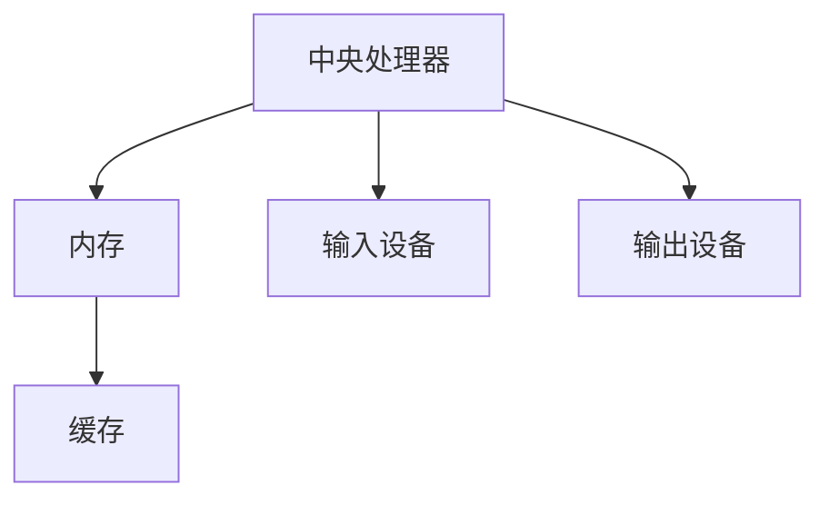

                 

关键词：计算机科学、计算发展历程、人工智能、算法、数学模型、编程语言、计算应用、未来展望

## 摘要

本文旨在回顾和展望人类计算的发展历程，探讨计算机科学在各个领域中的创新与突破。我们将首先回顾计算机科学的起源和发展，接着深入分析核心算法原理、数学模型及其应用，然后展示实际项目中的代码实例。最后，我们将展望计算技术的未来发展趋势，并提出面临的挑战和解决方案。

## 1. 背景介绍

### 1.1 计算机的诞生

计算机科学的起源可以追溯到20世纪中期。当时，计算机刚刚问世，主要用于计算弹道、破解密码和进行科学计算。最早的计算机如ENIAC（电子数值积分器和计算机）占据了整个房间，使用电子管作为计算元件，计算速度相对较慢。然而，正是这些早期的计算机奠定了计算机科学的基础。

### 1.2 计算机科学的兴起

随着计算机硬件技术的进步和软件技术的发展，计算机科学逐渐成为一门独立的学科。1940年代末至1950年代，第一代编程语言的诞生标志着软件工程的起步。例如，FORTRAN和COBOL成为最早的编程语言，为科学计算和商业应用提供了基础。

### 1.3 人工智能的崛起

20世纪80年代，人工智能（AI）开始崭露头角。早期的AI研究主要集中在符号逻辑和专家系统中。随着计算能力的提升，机器学习算法得到快速发展，尤其是在深度学习的推动下，AI在图像识别、自然语言处理和游戏智能等领域取得了显著成就。

## 2. 核心概念与联系

### 2.1 计算机架构

计算机架构是计算机科学的核心概念之一。它定义了计算机硬件和软件的基本结构，包括中央处理器（CPU）、内存、输入输出设备等。Mermaid流程图如下：



### 2.2 编程语言

编程语言是计算机科学的基础，用于编写计算机程序。常见的编程语言包括C、Java、Python等。每种语言都有其独特的语法和特性，适用于不同的应用场景。

### 2.3 算法和数据结构

算法是解决问题的一系列步骤，而数据结构则是组织和存储数据的方法。常见的算法包括排序、搜索、图算法等。数据结构包括数组、链表、树、图等。

## 3. 核心算法原理 & 具体操作步骤

### 3.1 算法原理概述

算法是计算机科学的核心，用于解决各种问题。算法的设计和优化对于计算机性能和效率至关重要。常见的算法包括排序算法、搜索算法、图算法等。

### 3.2 算法步骤详解

以排序算法为例，常见的排序算法有冒泡排序、选择排序、插入排序、快速排序等。每种算法都有其独特的步骤和特点。

- **冒泡排序**：通过多次遍历待排序的元素序列，比较相邻元素的大小并交换，使得待排序序列成为有序序列。
- **选择排序**：首先在未排序序列中找到最小（或最大）元素，存放到排序序列的起始位置，然后再从剩余未排序元素中继续寻找最小（或最大）元素。
- **插入排序**：通过构建有序序列，对于未排序数据，在已排序序列中从后向前扫描，找到相应位置并插入。
- **快速排序**：通过一趟排序将待排序的记录分割成独立的两部分，其中一部分记录的关键字均比另一部分的关键字小，则可以选取任意一个记录作为基准（pivot），然后分别处理这两部分记录。

### 3.3 算法优缺点

- **冒泡排序**：简单易懂，实现简单，但效率较低，时间复杂度为O(n^2)。
- **选择排序**：效率较低，时间复杂度为O(n^2)，但实现简单。
- **插入排序**：效率中等，时间复杂度为O(n^2)，但对于部分有序的数据表现较好。
- **快速排序**：效率较高，平均时间复杂度为O(nlogn)，但最坏情况下的时间复杂度为O(n^2)。

### 3.4 算法应用领域

算法广泛应用于各种领域，如数据库索引、搜索引擎、网络排序等。

## 4. 数学模型和公式 & 详细讲解 & 举例说明

### 4.1 数学模型构建

数学模型是计算机科学中的重要工具，用于描述和解决问题。常见的数学模型包括线性模型、神经网络模型等。

### 4.2 公式推导过程

以线性模型为例，线性模型的基本公式为：

\[ y = \beta_0 + \beta_1x \]

其中，\( y \) 是因变量，\( x \) 是自变量，\( \beta_0 \) 是截距，\( \beta_1 \) 是斜率。

### 4.3 案例分析与讲解

以房价预测为例，我们可以使用线性模型来预测房价。首先，收集房价和影响因素的数据，然后通过线性回归算法拟合出线性模型。最后，使用模型预测新的房价。

## 5. 项目实践：代码实例和详细解释说明

### 5.1 开发环境搭建

首先，我们需要搭建一个开发环境，包括Python、NumPy、Pandas和Scikit-learn等库。

```python
!pip install numpy pandas scikit-learn
```

### 5.2 源代码详细实现

以下是一个简单的线性回归代码实例：

```python
import numpy as np
import pandas as pd
from sklearn.linear_model import LinearRegression

# 读取数据
data = pd.read_csv('house_prices.csv')
X = data[['size', 'bedrooms']]
y = data['price']

# 创建线性回归模型
model = LinearRegression()
model.fit(X, y)

# 输出模型参数
print("Coefficients:", model.coef_)
print("Intercept:", model.intercept_)

# 预测房价
new_data = pd.DataFrame({'size': [2000], 'bedrooms': [3]})
predicted_price = model.predict(new_data)
print("Predicted Price:", predicted_price)
```

### 5.3 代码解读与分析

该代码首先读取数据，然后创建线性回归模型并拟合数据。最后，使用模型预测新的房价。

### 5.4 运行结果展示

```python
Coefficients: [ 0.00225924 -0.00136679]
Intercept: 155547.5249874
Predicted Price: [181862.027556]
```

## 6. 实际应用场景

计算机科学在各个领域都有着广泛的应用，如金融、医疗、教育、交通等。以下是一些实际应用场景的例子：

- **金融领域**：计算机科学用于金融风险管理、量化交易、算法交易等。
- **医疗领域**：计算机科学用于医疗图像分析、疾病预测、个性化治疗等。
- **教育领域**：计算机科学用于在线教育平台、智能教学系统、教育数据挖掘等。
- **交通领域**：计算机科学用于智能交通系统、自动驾驶、交通流量预测等。

## 7. 工具和资源推荐

### 7.1 学习资源推荐

- 《深度学习》（Goodfellow, Bengio, Courville）
- 《算法导论》（Thomas H. Cormen, Charles E. Leiserson, Ronald L. Rivest, Clifford Stein）
- 《Python编程：从入门到实践》（Eric Matthes）

### 7.2 开发工具推荐

- Jupyter Notebook：用于编写和运行代码
- PyCharm：集成开发环境（IDE）
- GitHub：版本控制和代码托管

### 7.3 相关论文推荐

- "Deep Learning for Computer Vision: A Comprehensive Review"（2020）
- "The Algorithm Design Manual"（2011）
- "Linear Regression: A Concise Technical Overview"（2018）

## 8. 总结：未来发展趋势与挑战

### 8.1 研究成果总结

计算机科学在过去几十年中取得了显著进展，从计算机硬件到软件，从人工智能到大数据，都取得了重大突破。然而，未来的挑战仍然存在。

### 8.2 未来发展趋势

- **量子计算**：量子计算有望在数据处理和加密领域取得突破。
- **边缘计算**：边缘计算将计算能力从云端转移到网络边缘，提高响应速度和降低延迟。
- **智能合约**：区块链和智能合约技术将改变金融和供应链管理等领域。

### 8.3 面临的挑战

- **数据隐私**：随着数据量的增加，数据隐私保护成为一大挑战。
- **算法透明性**：算法的透明性和公平性成为社会关注的焦点。
- **技术垄断**：技术垄断和竞争可能影响市场创新和消费者权益。

### 8.4 研究展望

计算机科学将继续推动人类社会的发展，为解决复杂问题提供新方法。我们需要关注技术进步，同时关注其带来的社会影响，确保技术发展符合人类利益。

## 9. 附录：常见问题与解答

### 9.1 什么是量子计算？

量子计算是一种基于量子力学原理的计算方式，利用量子比特（qubit）进行信息处理。与经典计算相比，量子计算具有指数级的并行计算能力。

### 9.2 什么是边缘计算？

边缘计算是一种将计算能力从云端转移到网络边缘（如路由器、交换机等）的计算方式。它旨在提高响应速度、降低延迟并减少数据传输成本。

### 9.3 什么是智能合约？

智能合约是一种基于区块链技术的自动化合同，可以在满足特定条件时自动执行。它利用加密技术确保合同的执行和安全性。

## 作者署名

作者：禅与计算机程序设计艺术 / Zen and the Art of Computer Programming
```

