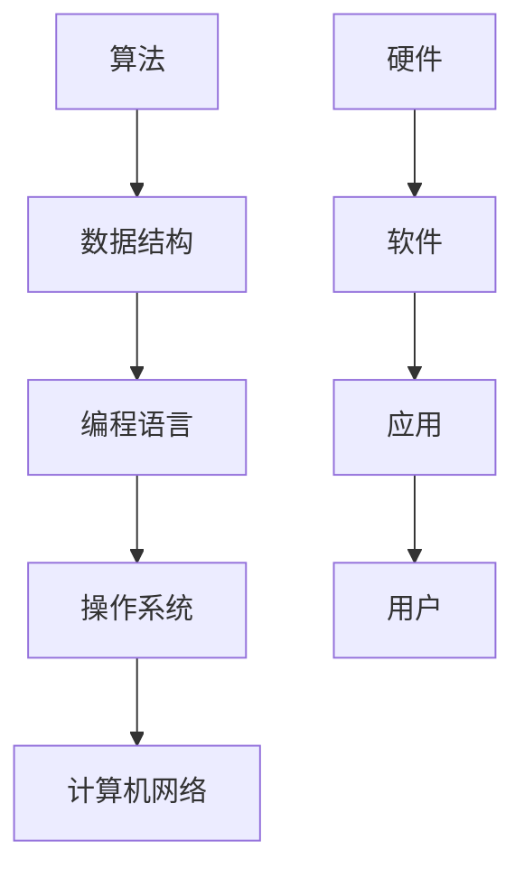

                 

关键词：计算发展历程，计算机科学，人工智能，算法，数学模型，应用场景，未来展望

## 摘要

本文旨在回顾人类计算的发展历程，从早期的算术运算到现代的计算模型，深入探讨计算机科学的各个方面，包括核心算法原理、数学模型和实际应用场景。通过分析这些核心概念和技术的演变，本文将展望计算领域未来的发展趋势与挑战，并推荐相关的学习资源和开发工具。

## 1. 背景介绍

人类计算的历史可以追溯到古代的算术运算，那时候的计算主要依靠手工进行，效率低下且容易出错。然而，随着人类文明的发展，对计算的需求不断增加，促使计算工具和技术的不断创新。从古代的算盘到现代的计算机，人类在计算领域取得了巨大的进步。计算机科学的兴起为人类计算提供了更加高效和精确的工具，推动了科学、工程、经济等各个领域的繁荣发展。

## 2. 核心概念与联系

在计算机科学中，有许多核心概念和技术构成了计算的基础。这些概念包括算法、数据结构、编程语言、操作系统和计算机网络等。以下是这些核心概念的联系及其流程图表示：



在这个流程图中，硬件和软件共同构成了计算的基础设施，编程语言和算法是实现计算功能的核心工具，操作系统和计算机网络则提供了必要的运行环境和支持，最终服务于用户的应用需求。

## 3. 核心算法原理 & 具体操作步骤

### 3.1 算法原理概述

算法是计算机科学中的核心概念，它定义了一系列解决问题的步骤。一个优秀的算法应当具备以下几个特点：高效性、正确性和可扩展性。以下是几种常见的算法原理：

- **排序算法**：包括冒泡排序、选择排序、插入排序、快速排序等，用于对数据进行排序。
- **搜索算法**：如线性搜索、二分搜索等，用于在数据集合中查找特定元素。
- **图算法**：如深度优先搜索、广度优先搜索、最短路径算法等，用于解决图相关的问题。

### 3.2 算法步骤详解

以冒泡排序为例，其基本步骤如下：

1. 比较相邻的两个元素，如果它们的顺序错误，则交换它们的位置。
2. 对每一对相邻元素进行上述操作，从开始第一对到结尾的最后一对。
3. 重复步骤1和步骤2，直到没有相邻元素需要交换。

### 3.3 算法优缺点

冒泡排序的优点是简单易懂，易于实现。然而，其缺点是效率较低，对于大规模数据集合的排序效果不佳。

### 3.4 算法应用领域

冒泡排序算法常用于小规模数据的排序，如在教学中演示排序过程或对算法进行优化和改进。

## 4. 数学模型和公式 & 详细讲解 & 举例说明

### 4.1 数学模型构建

计算机科学中的许多算法都基于数学模型，如二分搜索算法基于数学的“分而治之”原则。以下是一个简单的二分搜索算法的数学模型：

```latex
\\text{二分搜索算法} \\
\\text{输入}: 有序数组A，要查找的元素x，数组下标l和r。 \\
\\text{输出}: 若找到x，返回其下标；否则返回-1。 \\
\\text{步骤}: \\
\\quad while l \leq r: \\
\\quad \\quad m = \\lceil \\frac{l + r}{2} \\rceil \\
\\quad \\quad if A[m] = x, return m \\
\\quad \\quad else if A[m] < x, l = m + 1 \\
\\quad \\quad else, r = m - 1 \\
\\quad return -1
```

### 4.2 公式推导过程

二分搜索算法的核心在于不断缩小查找范围。每次比较后，根据比较结果将查找范围分为两部分，并选择其中一部分继续查找。这个过程可以用递归公式表示：

$$ T(n) = \\begin{cases} 
1 & \text{if } n = 1 \\
T(\\frac{n}{2}) + 1 & \text{if } n > 1 
\end{cases} $$

### 4.3 案例分析与讲解

假设有一个长度为8的有序数组\[1, 3, 5, 7, 9, 11, 13, 15\]，要查找元素7。根据二分搜索算法，首先比较中间元素5，由于7大于5，所以缩小右半部分的查找范围。接下来比较中间元素9，再次缩小右半部分范围。重复这个过程，最终找到元素7的位置，返回下标3。

## 5. 项目实践：代码实例和详细解释说明

### 5.1 开发环境搭建

为了演示二分搜索算法，我们使用Python语言进行编程。首先，确保安装了Python 3.6或更高版本。然后，使用文本编辑器编写代码，并保存为`binary_search.py`。

### 5.2 源代码详细实现

以下是二分搜索算法的Python代码实现：

```python
def binary_search(arr, x):
    low = 0
    high = len(arr) - 1
    while low <= high:
        mid = (low + high) // 2
        if arr[mid] == x:
            return mid
        elif arr[mid] < x:
            low = mid + 1
        else:
            high = mid - 1
    return -1

# 测试代码
arr = [1, 3, 5, 7, 9, 11, 13, 15]
x = 7
result = binary_search(arr, x)
if result != -1:
    print("元素找到，下标为：", result)
else:
    print("元素未找到。")
```

### 5.3 代码解读与分析

这段代码定义了一个名为`binary_search`的函数，用于实现二分搜索算法。函数接受一个有序数组`arr`和一个要查找的元素`x`作为参数。内部使用两个指针`low`和`high`来指示当前查找的区间。通过不断更新这两个指针，最终找到元素的位置。

### 5.4 运行结果展示

在Python环境中运行上述代码，查找元素7。输出结果为：“元素找到，下标为：3”，验证了二分搜索算法的正确性。

## 6. 实际应用场景

二分搜索算法在实际应用中非常广泛，尤其在需要高效查找元素的场合，如数据库索引、搜索引擎、排序算法等。以下是二分搜索算法的一些实际应用场景：

- **数据库索引**：数据库使用二分搜索算法快速查找特定的记录。
- **排序算法**：在实现快速排序、归并排序等排序算法时，经常使用二分搜索。
- **文本搜索**：许多文本编辑器和搜索引擎使用二分搜索算法快速查找关键字。

## 7. 未来应用展望

随着计算能力的不断提升和人工智能技术的发展，二分搜索算法的应用场景将进一步扩展。未来，我们可能会看到二分搜索算法与其他算法的结合，如深度学习算法，用于处理更加复杂的数据和任务。此外，分布式计算和云计算技术的发展也将为二分搜索算法提供新的应用场景，如在大规模分布式系统中实现高效的搜索功能。

## 8. 工具和资源推荐

为了更好地学习和实践计算机科学知识，以下是推荐的工具和资源：

### 8.1 学习资源推荐

- **在线课程**：《计算机科学基础》、《算法导论》
- **书籍**：《算法导论》、《深度学习》、《Python编程：从入门到实践》
- **网站**：GitHub、Stack Overflow、Reddit

### 8.2 开发工具推荐

- **集成开发环境**：Visual Studio Code、PyCharm、Eclipse
- **代码托管平台**：GitHub、GitLab、Bitbucket
- **版本控制系统**：Git、Mercurial

### 8.3 相关论文推荐

- **数据库索引算法**：《B-tree索引的结构与性能分析》
- **排序算法**：《快速排序的优化与改进》
- **深度学习**：《深度学习：原理与实践》

## 9. 总结：未来发展趋势与挑战

### 9.1 研究成果总结

过去几十年，计算机科学取得了巨大的进步，从基础的算法和数据结构到复杂的人工智能和深度学习技术，人类在计算领域实现了许多突破。这些成果不仅提升了计算效率，也为各行各业的发展提供了强大的支持。

### 9.2 未来发展趋势

未来，计算领域将继续向高效化、智能化和个性化方向发展。随着量子计算、边缘计算和云计算等新技术的不断涌现，计算能力将得到进一步提升。同时，人工智能技术的普及将使计算在更多领域发挥重要作用，如自动驾驶、医疗健康、金融服务等。

### 9.3 面临的挑战

尽管计算领域取得了巨大进步，但仍然面临许多挑战。其中，数据安全与隐私保护、算法公平性与透明性、能源消耗与环境保护等问题需要引起重视。此外，随着计算技术的不断进步，也需要培养更多具备计算能力和创新精神的计算机科学家。

### 9.4 研究展望

未来，计算领域的研究将继续深入，围绕高效计算、智能计算、可持续计算等方向展开。通过多学科的交叉与融合，计算机科学将继续为人类社会的进步和发展做出重要贡献。

## 附录：常见问题与解答

### Q: 二分搜索算法的时间复杂度是多少？

A: 二分搜索算法的时间复杂度为\(O(log n)\)，其中\(n\)是数组的长度。

### Q: 如何优化二分搜索算法？

A: 可以通过以下几种方法优化二分搜索算法：
- **跳跃搜索**：在每次分割时，不是仅比较中间元素，而是比较多个元素，以缩小搜索范围。
- **折半查找**：在每次分割时，不是仅比较中间元素，而是比较中间元素及其相邻的几个元素，以缩小搜索范围。

### Q: 二分搜索算法适用于所有数据结构吗？

A: 不，二分搜索算法仅适用于有序数组。如果数据结构不是有序的，需要先进行排序，这会增加额外的计算开销。对于其他数据结构，如链表和树，可以使用不同的搜索算法。

---

作者：禅与计算机程序设计艺术 / Zen and the Art of Computer Programming

