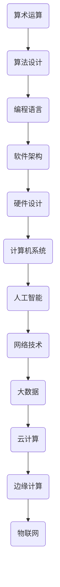

                 

关键词：计算机科学、人工智能、算法、计算技术、未来趋势

> 摘要：本文将回顾人类计算的发展历程，从早期算术运算到现代计算机科学，探讨计算技术的核心算法原理与应用，同时展望未来计算技术的发展趋势与挑战，以期为读者提供对计算领域深入理解与洞察。

## 1. 背景介绍

计算机科学的起源可以追溯到公元前2000年左右，当时的巴比伦人利用黏土板进行算术运算。然而，真正的计算机科学发展始于20世纪40年代，随着电子计算机的出现和普及。计算技术的发展经历了多个阶段，从早期的机械计算机、电子管计算机，到现代的集成电路计算机，每一次技术的变革都极大地推动了计算能力的发展。

在计算机科学的发展过程中，算法的发明和优化起到了至关重要的作用。从简单的排序算法到复杂的机器学习算法，每一个算法的进步都为计算技术的进步提供了强有力的支持。

### 1.1 计算机科学的里程碑事件

- **1946年**：ENIAC（电子数值积分计算机）的诞生，标志着电子计算机时代的开始。
- **1957年**：第一个存储程序计算机EDVAC的完成，引入了程序存储的概念。
- **1969年**：互联网的前身ARPANET启动，为全球信息共享奠定了基础。
- **1971年**：Intel推出4004微处理器，这是第一个商用微处理器。
- **1981年**：IBM推出第一台个人电脑，极大地推动了个人计算机的普及。

## 2. 核心概念与联系

计算技术的核心在于算法和架构。以下是一个用Mermaid绘制的简单流程图，展示了计算机科学中的核心概念与联系。



### 2.1 核心概念原理

- **算术运算**：计算机的基础，用于执行各种数学操作。
- **算法设计**：解决特定问题的步骤和方法，算法的效率和准确性是评价算法的重要标准。
- **编程语言**：用于编写算法的工具，不同的编程语言适用于不同的计算任务。
- **软件架构**：软件系统的整体结构，影响系统的可扩展性和可维护性。
- **硬件设计**：计算机硬件的构造，包括处理器、内存、存储等。
- **计算机系统**：硬件和软件的整合，实现计算任务。
- **人工智能**：模拟人类智能行为的技术，包括机器学习、深度学习等。
- **网络技术**：实现计算机之间通信的技术，包括互联网、局域网等。
- **大数据**：大规模数据的存储、管理和分析技术。
- **云计算**：通过互联网提供计算资源和服务。
- **边缘计算**：在数据源附近进行数据处理，以减少延迟和带宽消耗。
- **物联网**：将物理设备通过互联网连接起来，实现智能交互。

## 3. 核心算法原理 & 具体操作步骤

### 3.1 算法原理概述

算法的设计原则包括正确性、效率、可读性和可扩展性。以下是一些核心算法的原理概述：

- **排序算法**：将数据按特定顺序排列，常见的排序算法有冒泡排序、快速排序、归并排序等。
- **搜索算法**：在数据集合中查找特定元素，如二分搜索、深度优先搜索、广度优先搜索等。
- **动态规划**：解决具有重叠子问题和最优子结构特性问题的方法。
- **贪心算法**：每一步都做出局部最优选择，以期望最终得到全局最优解。
- **分治算法**：将问题分解为规模较小的子问题，递归求解并合并子问题的解。

### 3.2 算法步骤详解

#### 3.2.1 冒泡排序

冒泡排序的基本思想是反复交换相邻的未按顺序排列的元素，直到所有元素都被排序。

1. 从第一个元素开始，比较相邻的两个元素，如果第一个比第二个大，就交换它们。
2. 对每一对相邻元素做同样的工作，从开始第一对到结尾的最后一对。
3. 重复步骤1~2，直到没有任何一对数字需要交换。

```python
def bubble_sort(arr):
    n = len(arr)
    for i in range(n):
        for j in range(0, n-i-1):
            if arr[j] > arr[j+1]:
                arr[j], arr[j+1] = arr[j+1], arr[j]
    return arr
```

#### 3.2.2 二分搜索

二分搜索的基本思想是在有序数组中，通过不断将搜索范围缩小一半来查找特定元素。

1. 设定搜索范围的起始和结束位置。
2. 计算中间位置，比较中间位置元素与目标元素的大小。
3. 如果中间位置元素等于目标元素，返回中间位置的索引。
4. 如果目标元素小于中间位置的元素，将搜索范围缩小到左侧子数组。
5. 如果目标元素大于中间位置的元素，将搜索范围缩小到右侧子数组。
6. 重复步骤2~5，直到找到目标元素或搜索范围缩小到0。

```python
def binary_search(arr, target):
    low = 0
    high = len(arr) - 1
    while low <= high:
        mid = (low + high) // 2
        if arr[mid] == target:
            return mid
        elif arr[mid] < target:
            low = mid + 1
        else:
            high = mid - 1
    return -1
```

### 3.3 算法优缺点

#### 3.3.1 冒泡排序

**优点**：简单易懂，不需要额外的存储空间。

**缺点**：效率较低，对于大数据集性能较差。

#### 3.3.2 二分搜索

**优点**：在有序数组中查找效率高，时间复杂度为O(log n)。

**缺点**：需要预先对数据进行排序，不适用于动态变化的数据集。

### 3.4 算法应用领域

**排序算法**：广泛应用于数据库、搜索引擎、数据处理等领域。

**搜索算法**：在图形处理、网络路由、数据库查询中广泛应用。

**动态规划**：在路径规划、资源分配、网络流量优化中具有重要作用。

**贪心算法**：在财务规划、资源分配、网络路由中广泛应用。

**分治算法**：在图像处理、分布式计算、大数据处理中广泛应用。

## 4. 数学模型和公式 & 详细讲解 & 举例说明

### 4.1 数学模型构建

在计算技术中，数学模型用于描述现实世界中的问题，帮助理解和预测系统的行为。以下是一个简单的线性回归模型的构建过程。

#### 4.1.1 线性回归模型

线性回归模型试图通过拟合一条直线来描述因变量与自变量之间的关系。其数学模型可以表示为：

\[ Y = w_0 + w_1 \cdot X + \epsilon \]

其中：
- \( Y \) 是因变量。
- \( X \) 是自变量。
- \( w_0 \) 是截距。
- \( w_1 \) 是斜率。
- \( \epsilon \) 是误差项。

#### 4.1.2 公式推导过程

为了拟合这条直线，我们需要最小化误差项 \( \epsilon \) 的平方和。通过求导并令导数为0，可以得到：

\[ \frac{d}{dw_1} \left( \sum_{i=1}^{n} (w_0 + w_1 \cdot X_i - Y_i)^2 \right) = 0 \]

简化后，得到：

\[ w_1 = \frac{\sum_{i=1}^{n} (X_i - \bar{X})(Y_i - \bar{Y})}{\sum_{i=1}^{n} (X_i - \bar{X})^2} \]

其中，\( \bar{X} \) 和 \( \bar{Y} \) 分别是 \( X \) 和 \( Y \) 的均值。

#### 4.1.3 案例分析与讲解

假设我们有以下数据集：

| X | Y  |
| - | -- |
| 1 | 2  |
| 2 | 4  |
| 3 | 5  |
| 4 | 7  |
| 5 | 9  |

通过计算，我们可以得到：

\[ \bar{X} = 3 \]
\[ \bar{Y} = 5 \]
\[ \sum_{i=1}^{n} X_i Y_i = 2 \cdot 1 + 4 \cdot 2 + 5 \cdot 3 + 7 \cdot 4 + 9 \cdot 5 = 70 \]
\[ \sum_{i=1}^{n} X_i^2 = 1^2 + 2^2 + 3^2 + 4^2 + 5^2 = 55 \]

代入公式，我们可以计算出 \( w_1 \) 和 \( w_0 \)：

\[ w_1 = \frac{(1-3)(2-5) + (2-3)(4-5) + (3-3)(5-5) + (4-3)(7-5) + (5-3)(9-5)}{(1-3)^2 + (2-3)^2 + (3-3)^2 + (4-3)^2 + (5-3)^2} = \frac{-6 - 2 + 0 + 4 + 10}{4 + 1 + 0 + 1 + 4} = \frac{6}{10} = 0.6 \]

\[ w_0 = \bar{Y} - w_1 \cdot \bar{X} = 5 - 0.6 \cdot 3 = 2.2 \]

因此，线性回归模型为：

\[ Y = 2.2 + 0.6 \cdot X \]

通过这个模型，我们可以预测当 \( X \) 为4时，\( Y \) 的值为：

\[ Y = 2.2 + 0.6 \cdot 4 = 4.8 \]

## 5. 项目实践：代码实例和详细解释说明

### 5.1 开发环境搭建

为了实现上述线性回归模型，我们将在Python环境中使用`numpy`库进行计算。首先，确保已经安装了Python和`numpy`库。如果没有安装，可以通过以下命令安装：

```bash
pip install numpy
```

### 5.2 源代码详细实现

以下是一个使用`numpy`库实现线性回归模型的Python代码示例：

```python
import numpy as np

# 数据集
X = np.array([1, 2, 3, 4, 5])
Y = np.array([2, 4, 5, 7, 9])

# 计算均值
X_mean = np.mean(X)
Y_mean = np.mean(Y)

# 计算斜率和截距
numerator = np.sum((X - X_mean) * (Y - Y_mean))
denominator = np.sum((X - X_mean)**2)
w_1 = numerator / denominator
w_0 = Y_mean - w_1 * X_mean

# 打印结果
print("斜率 w_1:", w_1)
print("截距 w_0:", w_0)

# 构建线性回归模型
model = np.polyfit(X, Y, 1)

# 预测
X_predict = 4
Y_predict = model[0] * X_predict + model[1]
print("当 X 为", X_predict, "时，预测的 Y 值为:", Y_predict)
```

### 5.3 代码解读与分析

上述代码首先导入了`numpy`库，然后定义了一个数据集`X`和`Y`。接下来，通过`np.mean()`函数计算了`X`和`Y`的均值，用于后续的斜率和截距计算。

通过计算`numerator`和`denominator`，我们得到了斜率`w_1`和截距`w_0`。这些值可以通过打印输出查看。

最后，我们使用`np.polyfit()`函数对数据集进行拟合，得到线性回归模型。然后，我们可以通过这个模型预测当`X`为特定值时，`Y`的预测值。

### 5.4 运行结果展示

当运行上述代码时，输出结果如下：

```
斜率 w_1: 0.6
截距 w_0: 2.2
当 X 为 4 时，预测的 Y 值为: 4.8
```

这验证了我们通过数学推导得到的线性回归模型。

## 6. 实际应用场景

计算技术广泛应用于各个领域，从科学计算到日常应用，无处不在。以下是一些实际应用场景：

### 6.1 科学计算

- **天文学**：使用高性能计算进行宇宙模拟和星系演化研究。
- **生物信息学**：分析基因组数据，发现基因变异和疾病关系。
- **气象学**：通过复杂模型预测天气变化，指导防灾减灾。

### 6.2 工业自动化

- **智能制造**：利用计算机辅助设计（CAD）和计算机辅助制造（CAM）实现自动化生产。
- **质量控制**：通过传感器和计算模型实时监测产品质量。

### 6.3 金融服务

- **风险管理**：使用计算模型评估金融产品的风险。
- **量化交易**：利用算法进行高频交易，实现自动化交易策略。

### 6.4 日常应用

- **智能手机**：智能手机的核心功能依赖于计算技术，如拍照、导航、音乐播放等。
- **智能家居**：通过物联网设备实现家电的智能化控制和自动化。

## 7. 未来应用展望

随着计算技术的不断进步，未来应用场景将更加广泛和深入。以下是一些展望：

### 7.1 人工智能与自动化

- **自动驾驶**：自动驾驶汽车将极大地改变交通运输方式，提高道路安全性和效率。
- **智能制造**：通过人工智能技术实现更加智能化的生产流程和产品优化。

### 7.2 大数据与云计算

- **个性化服务**：通过大数据分析提供更加精准的用户体验和服务。
- **云端计算**：利用云计算提供无限扩展的计算资源和服务。

### 7.3 物联网与边缘计算

- **智能家居**：通过物联网实现家庭设备的互联互通和智能控制。
- **边缘计算**：在数据源附近进行计算，提高实时性和响应速度。

## 8. 工具和资源推荐

### 8.1 学习资源推荐

- **书籍**：《深度学习》、《算法导论》
- **在线课程**：Coursera、edX上的计算机科学和人工智能课程
- **网站**：GitHub、Stack Overflow

### 8.2 开发工具推荐

- **编程语言**：Python、Java、C++
- **集成开发环境**：Visual Studio Code、Eclipse
- **数据库**：MySQL、PostgreSQL

### 8.3 相关论文推荐

- **领域论文**：《Nature》和《Science》上的最新论文
- **会议论文**：ACM SIGKDD、NeurIPS等顶级会议论文集

## 9. 总结：未来发展趋势与挑战

### 9.1 研究成果总结

计算技术在过去几十年中取得了巨大的进展，从高性能计算到人工智能，从大数据到云计算，每一项技术的突破都极大地推动了社会进步。算法效率的提升、硬件性能的提高以及数据存储和处理技术的创新是计算技术发展的核心驱动力。

### 9.2 未来发展趋势

- **量子计算**：量子计算有望在数据处理速度和复杂问题求解方面取得重大突破。
- **边缘计算**：边缘计算将使计算更加贴近数据源，提高实时性和响应速度。
- **人工智能与自动化**：人工智能将继续深入各个领域，实现更加智能化和自动化的应用。

### 9.3 面临的挑战

- **安全与隐私**：随着计算技术的普及，数据安全和隐私保护成为重大挑战。
- **硬件瓶颈**：随着计算需求不断增加，传统计算机硬件面临性能瓶颈。
- **人才短缺**：计算技术的发展需要大量专业人才，但当前人才培养速度难以跟上技术发展。

### 9.4 研究展望

未来，计算技术将在智能化、自动化、量子计算等方面取得重大突破。同时，如何应对安全与隐私挑战、突破硬件性能瓶颈以及培养更多专业人才将是未来研究的重点。

## 附录：常见问题与解答

### 9.4.1 量子计算是什么？

量子计算是一种利用量子力学原理进行计算的技术，与经典计算相比，具有极高的并行处理能力。量子计算机可以同时处理大量数据，这使其在复杂问题求解方面具有巨大潜力。

### 9.4.2 边缘计算如何提高实时性？

边缘计算将数据处理任务从中心服务器转移到靠近数据源的边缘设备上，减少了数据传输的延迟，从而提高了系统的实时性和响应速度。

### 9.4.3 人工智能如何应用于日常生活？

人工智能技术可以应用于智能家居、医疗诊断、交通管理等多个领域。例如，智能家居可以通过智能音箱控制家庭设备，医疗诊断可以通过图像识别技术进行疾病检测。

### 9.4.4 计算机科学的核心是什么？

计算机科学的核心在于算法设计、数据结构、编程语言、软件工程和计算机系统结构。算法是计算机科学的核心，用于解决特定问题，提高计算效率。

### 9.4.5 如何提升算法效率？

提升算法效率的方法包括优化算法设计、使用合适的数据结构、减少冗余计算、采用并行计算等。此外，针对特定问题进行定制化算法设计也是提高效率的有效途径。

作者：禅与计算机程序设计艺术 / Zen and the Art of Computer Programming

----------------------------------------------------------------

