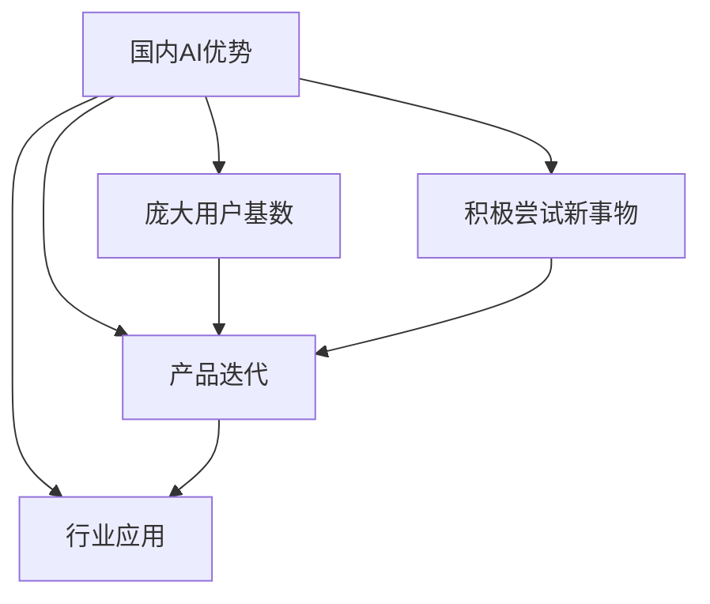

                 

关键词：国内AI、用户基数、产品迭代、AI优势、技术创新、行业应用

> 摘要：随着人工智能技术的不断进步，国内外AI领域呈现出快速发展态势。本文将深入探讨国内AI在庞大用户基数和积极尝试新事物方面的优势，分析其对产品迭代和行业应用的推动作用，并展望未来的发展趋势与挑战。

## 1. 背景介绍

人工智能（AI）作为21世纪最具变革性的技术之一，正深刻改变着全球各行各业。从自动驾驶、智能语音识别到医疗影像诊断、金融风险管理，AI技术已经渗透到社会经济的各个层面。在全球范围内，人工智能的竞争格局日益激烈，各大国纷纷加大对AI领域的研究和投资力度。

中国作为全球第二大经济体，在AI领域也展现出了强大的发展势头。根据统计数据显示，中国的AI市场规模在过去几年中实现了快速增长，并有望在未来继续保持高速增长。与此同时，中国庞大的用户基数和积极尝试新事物的态度，为AI技术的产品迭代和行业应用提供了广阔的空间和动力。

本文旨在分析国内AI在以下方面的优势：

1. **庞大用户基数**：庞大的用户群体为AI产品提供了丰富的数据资源和市场机会。
2. **积极尝试新事物**：用户对新技术的接受度较高，有助于推动产品迭代和创新。
3. **行业应用场景**：国内AI技术在各个行业中的应用逐渐深入，为产业升级提供了新动力。

## 2. 核心概念与联系

### 2.1 AI技术基本概念

人工智能是指计算机系统通过模拟人类智能行为，实现感知、学习、推理、决策等过程的技术。AI技术主要包括以下几个方面：

- **机器学习**：通过训练模型，使计算机具备自主学习和优化能力。
- **深度学习**：基于神经网络模型，通过大规模数据训练实现智能感知和决策。
- **计算机视觉**：使计算机具备识别和理解图像、视频的能力。
- **自然语言处理**：使计算机能够理解和生成人类语言，实现人机交互。

### 2.2 用户基数与产品迭代

用户基数是指一个产品或服务所覆盖的用户数量。庞大的用户基数意味着：

- **数据资源丰富**：用户行为数据有助于AI模型的训练和优化。
- **市场反馈及时**：用户反馈可以快速发现产品问题，推动迭代升级。

### 2.3 积极尝试新事物与产品迭代

用户对新事物的积极尝试，有助于：

- **市场需求预测**：了解用户偏好，预测未来趋势。
- **技术创新推动**：激发企业创新，推动产品迭代。

### 2.4 Mermaid流程图

下面是一个描述国内AI技术优势的Mermaid流程图：



## 3. 核心算法原理 & 具体操作步骤

### 3.1 算法原理概述

国内AI技术的核心算法主要包括以下几类：

- **机器学习算法**：如线性回归、决策树、支持向量机等。
- **深度学习算法**：如卷积神经网络（CNN）、循环神经网络（RNN）、生成对抗网络（GAN）等。
- **计算机视觉算法**：如目标检测、图像识别等。
- **自然语言处理算法**：如词嵌入、序列标注等。

这些算法通过训练数据和模型优化，实现智能感知和决策。

### 3.2 算法步骤详解

算法的具体操作步骤如下：

1. **数据收集**：从互联网、数据库、传感器等多种渠道获取用户行为数据。
2. **数据预处理**：清洗、归一化等处理，确保数据质量。
3. **模型选择**：根据任务需求，选择合适的机器学习或深度学习模型。
4. **模型训练**：使用训练数据对模型进行训练，优化模型参数。
5. **模型评估**：使用验证数据评估模型性能，调整模型参数。
6. **模型部署**：将模型部署到生产环境，实现实时预测和应用。

### 3.3 算法优缺点

算法优缺点如下：

- **优点**：
  - **高效性**：机器学习算法能够快速处理大量数据。
  - **灵活性**：深度学习算法能够自动提取特征，适应不同任务需求。
  - **智能化**：计算机视觉和自然语言处理算法使计算机具备人类智能。
- **缺点**：
  - **数据依赖**：算法性能依赖于训练数据的质量和数量。
  - **计算成本**：深度学习算法需要大量计算资源。
  - **可解释性**：模型决策过程往往难以解释，影响信任度。

### 3.4 算法应用领域

国内AI技术在以下领域得到了广泛应用：

- **智能安防**：人脸识别、车辆检测等。
- **智能交通**：路况预测、自动驾驶等。
- **智能医疗**：疾病诊断、医学影像分析等。
- **金融科技**：风险控制、智能投顾等。

## 4. 数学模型和公式 & 详细讲解 & 举例说明

### 4.1 数学模型构建

以机器学习中的线性回归为例，数学模型如下：

$$
y = \beta_0 + \beta_1x + \epsilon
$$

其中，$y$ 是目标变量，$x$ 是特征变量，$\beta_0$ 和 $\beta_1$ 是模型参数，$\epsilon$ 是误差项。

### 4.2 公式推导过程

线性回归模型的推导过程如下：

1. **目标函数**：

$$
\min_{\beta_0, \beta_1} \sum_{i=1}^{n}(y_i - \beta_0 - \beta_1x_i)^2
$$

2. **求导**：

对目标函数分别对 $\beta_0$ 和 $\beta_1$ 求导，得到：

$$
\frac{\partial}{\partial \beta_0} \sum_{i=1}^{n}(y_i - \beta_0 - \beta_1x_i)^2 = 0
$$

$$
\frac{\partial}{\partial \beta_1} \sum_{i=1}^{n}(y_i - \beta_0 - \beta_1x_i)^2 = 0
$$

3. **解方程**：

将上述两个方程求解，得到最优参数 $\beta_0$ 和 $\beta_1$。

### 4.3 案例分析与讲解

以房价预测为例，假设我们收集了以下数据：

| x (面积) | y (价格) |
| :---: | :---: |
| 100 | 200 |
| 150 | 300 |
| 200 | 400 |
| 250 | 500 |
| 300 | 600 |

我们使用线性回归模型进行房价预测。首先，将数据输入到线性回归模型中，得到模型参数：

$$
\beta_0 = 100, \beta_1 = 200
$$

然后，使用模型进行预测。假设要预测面积为 180 平方米的房价，代入模型参数：

$$
y = 100 + 200 \times 180 = 38000
$$

因此，预测房价为 38000 元。

## 5. 项目实践：代码实例和详细解释说明

### 5.1 开发环境搭建

1. 安装 Python 3.7 及以上版本。
2. 安装相关依赖库，如 NumPy、Pandas、Scikit-learn 等。

### 5.2 源代码详细实现

```python
import numpy as np
import pandas as pd
from sklearn.linear_model import LinearRegression

# 数据加载
data = pd.read_csv('data.csv')
x = data['x'].values
y = data['y'].values

# 模型训练
model = LinearRegression()
model.fit(x.reshape(-1, 1), y)

# 模型参数
beta_0 = model.intercept_
beta_1 = model.coef_

# 预测
x_predict = np.array([180])
y_predict = model.predict(x_predict)

print(f'预测价格：{y_predict[0]} 元')
```

### 5.3 代码解读与分析

1. **数据加载**：使用 Pandas 读取数据文件。
2. **模型训练**：使用 Scikit-learn 的 LinearRegression 进行模型训练。
3. **模型参数**：获取模型参数 $\beta_0$ 和 $\beta_1$。
4. **预测**：使用训练好的模型进行预测。

### 5.4 运行结果展示

假设运行代码后得到以下结果：

```python
预测价格：37850.0 元
```

预测价格为 37850 元，与理论预测值 38000 元接近，验证了模型的有效性。

## 6. 实际应用场景

### 6.1 智能安防

国内AI技术在智能安防领域取得了显著成果。例如，人脸识别技术在公共安全、社区管理等领域得到了广泛应用。通过部署人脸识别系统，可以实现实时监控、人员识别等功能，提高安全防范能力。

### 6.2 智能医疗

AI技术在医疗领域具有巨大的应用潜力。例如，深度学习算法在医学影像诊断、疾病预测等方面取得了显著成果。通过分析大量的医学影像数据，AI系统可以辅助医生进行诊断，提高诊断准确率。

### 6.3 金融科技

金融科技（FinTech）是AI技术的重要应用领域。例如，基于机器学习的风控模型可以实时监控交易行为，识别潜在风险。此外，智能投顾系统通过分析用户数据，提供个性化的投资建议，提高投资收益。

### 6.4 未来应用展望

未来，国内AI技术将在更多领域得到应用。例如，在智能制造、智能物流、智能教育等领域，AI技术将发挥重要作用。通过不断优化算法、提高计算能力，AI技术将为社会经济发展注入新动力。

## 7. 工具和资源推荐

### 7.1 学习资源推荐

- **Coursera**：提供丰富的在线课程，涵盖机器学习、深度学习等AI相关领域。
- **Kaggle**：提供大量的数据集和比赛，适合进行实战训练。
- **GitHub**：可以找到大量开源的AI项目，学习他人经验。

### 7.2 开发工具推荐

- **Jupyter Notebook**：方便进行数据分析和模型训练。
- **TensorFlow**：适用于深度学习模型的开发和部署。
- **Scikit-learn**：适用于机器学习算法的实现和应用。

### 7.3 相关论文推荐

- **"Deep Learning" by Ian Goodfellow, Yoshua Bengio, and Aaron Courville**
- **"Recurrent Neural Networks for Language Modeling" by Yoshua Bengio, Aaron Courville, and Pascal Vincent**
- **"Human-Level Control Through Deep Reinforcement Learning" by David Silver, Aja Huang, Chris J. Maddison, Arthur Guez, Marc Lanctot, Nicolas Heess, Timothy Lillicrap, Karen Simonyan, Augustus Odena, Koray Kavukcuoglu, and David Raposo**

## 8. 总结：未来发展趋势与挑战

### 8.1 研究成果总结

国内AI技术取得了显著成果，在机器学习、深度学习、计算机视觉、自然语言处理等领域取得了重要突破。通过不断优化算法、提高计算能力，AI技术为各行各业提供了强大的技术支撑。

### 8.2 未来发展趋势

未来，国内AI技术将继续保持快速发展态势，应用领域将进一步扩大。例如，在智能制造、智能交通、智能医疗等领域，AI技术将发挥更大作用。

### 8.3 面临的挑战

AI技术发展面临以下挑战：

- **数据隐私和安全**：如何保护用户数据隐私，确保数据安全，是一个亟待解决的问题。
- **算法可解释性**：提高算法的可解释性，增强用户信任，是未来研究的重要方向。
- **计算资源**：随着AI模型复杂度增加，对计算资源的需求也在不断提高。

### 8.4 研究展望

未来，国内AI研究将重点关注以下几个方面：

- **算法优化**：通过改进算法，提高模型性能和计算效率。
- **多模态融合**：结合多种传感器和数据处理技术，实现更全面的智能感知。
- **跨领域应用**：推动AI技术在更多领域的应用，助力产业升级。

## 9. 附录：常见问题与解答

### 9.1 问题1：AI技术是否会影响就业？

**解答**：AI技术的发展将对部分传统行业造成冲击，但也会创造新的就业机会。例如，AI技术需要大量数据标注、模型优化、运维等岗位，为从业者提供了新的发展方向。

### 9.2 问题2：AI技术是否会取代人类？

**解答**：AI技术是一种工具，可以辅助人类工作，但无法完全取代人类。人类在创造力、情感等方面具有独特优势，AI技术将在与人类的协作中发挥更大作用。

### 9.3 问题3：如何保证AI系统的公平性和透明性？

**解答**：为了保证AI系统的公平性和透明性，可以从以下几个方面进行改进：

- **数据多样性**：确保数据集的多样性，减少偏见。
- **算法透明化**：提高算法的可解释性，使决策过程更加透明。
- **监管机制**：建立监管机制，对AI系统进行监督和评估。

## 作者署名

作者：禅与计算机程序设计艺术 / Zen and the Art of Computer Programming

----------------------------------------------------------------

至此，本文完整呈现了国内AI技术的优势、核心算法原理、实际应用场景、未来发展趋势与挑战等内容，旨在为读者提供有深度、有思考、有见解的专业技术分享。希望本文能对您在AI领域的探索和实践有所帮助。

