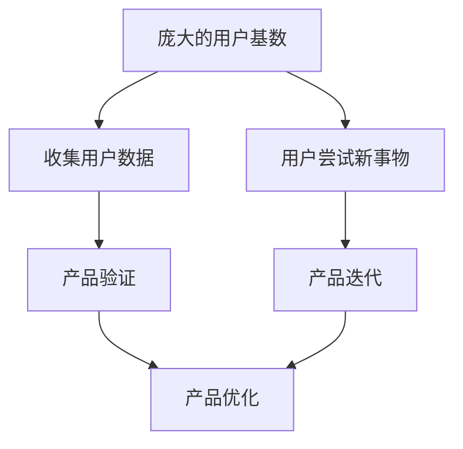
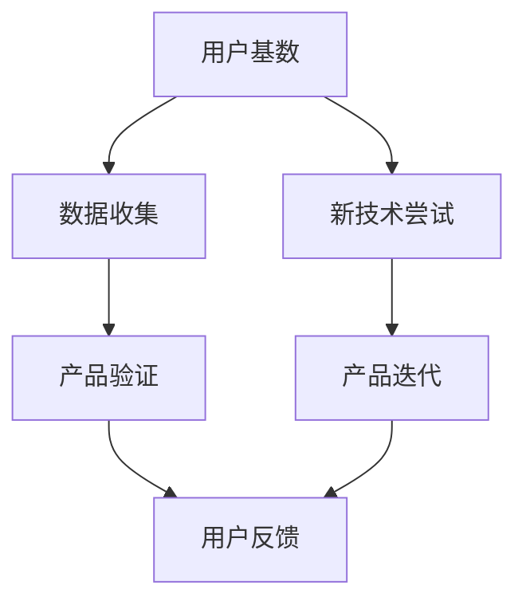

                 

关键词：人工智能，用户基数，新事物尝试，产品验证，迭代。

> 摘要：本文将探讨国内人工智能领域的一项显著优势——庞大的用户基数以及国内用户对新兴技术的积极尝试态度。这些因素不仅有助于产品的快速验证和迭代，还为国内AI企业提供了宝贵的用户反馈和改进机会。

## 1. 背景介绍

随着互联网的普及和智能手机的广泛应用，国内用户数量呈现爆发式增长。根据最新统计数据，中国拥有超过14亿的互联网用户，其中智能手机用户超过10亿。如此庞大的用户基数，为国内AI企业提供了丰富的实验场。

此外，国内用户对新技术的接受度和尝试意愿相对较高。无论是智能家居、智能穿戴，还是自动驾驶、智能语音助手，国内用户都表现出了积极的兴趣和参与度。这种开放和尝试新事物的态度，为国内AI产品的发展提供了良好的土壤。

## 2. 核心概念与联系

### 2.1. 用户基数与AI产品验证

庞大的用户基数意味着AI产品可以在短时间内收集到大量的用户数据，这些数据有助于验证产品性能、用户体验和市场需求。通过大规模的用户测试，AI企业可以快速识别问题、优化产品，并迅速调整策略。

### 2.2. 用户尝试新事物与产品迭代

国内用户对新事物的积极尝试，有助于AI产品快速迭代和优化。用户在使用过程中提供的反馈，能够帮助企业发现产品的不足之处，并针对性地进行改进。这种快速反馈和迭代的过程，有助于AI产品在竞争中保持优势。

### 2.3. Mermaid流程图

以下是关于用户基数、新事物尝试和产品验证、迭代关系的Mermaid流程图：



## 3. 核心算法原理 & 具体操作步骤

### 3.1 算法原理概述

用户基数与产品验证、迭代的关系，可以通过以下算法原理进行概述：

1. **数据收集**：利用用户基数，收集大量用户数据，包括用户行为、偏好、反馈等。
2. **数据分析**：对收集到的用户数据进行处理和分析，识别产品优势和不足。
3. **产品优化**：根据数据分析结果，对产品进行优化和迭代。
4. **用户反馈**：将优化后的产品推送给用户，收集新的用户反馈，循环进行。

### 3.2 算法步骤详解

1. **数据收集**：AI企业通过大数据技术，收集用户在平台上的各种数据，如搜索记录、浏览行为、购买偏好等。
2. **数据预处理**：对收集到的数据进行清洗、去重、转换等预处理操作，确保数据质量。
3. **数据分析**：利用机器学习和数据挖掘技术，对预处理后的数据进行分析，识别用户需求和偏好。
4. **产品优化**：根据数据分析结果，对产品进行优化，如改进推荐算法、优化用户界面等。
5. **用户反馈**：将优化后的产品推送给用户，收集用户反馈，再次进行数据分析和产品优化。

### 3.3 算法优缺点

**优点**：

1. **快速验证**：通过庞大的用户基数，AI产品可以在短时间内完成验证，降低研发风险。
2. **快速迭代**：国内用户对新事物的积极尝试，有助于AI产品快速迭代和优化。

**缺点**：

1. **数据隐私**：用户数据收集和处理过程中，需要确保数据安全和用户隐私。
2. **竞争压力**：在庞大的用户基数下，AI企业需要不断提高产品质量，以应对激烈的市场竞争。

### 3.4 算法应用领域

算法原理和操作步骤可以应用于以下领域：

1. **智能推荐系统**：通过用户行为数据，为用户提供个性化的推荐。
2. **智能客服系统**：利用用户反馈，优化客服系统的服务质量和用户体验。
3. **智能广告投放**：根据用户数据和偏好，实现精准的广告投放。

## 4. 数学模型和公式 & 详细讲解 & 举例说明

### 4.1 数学模型构建

用户基数与产品验证、迭代的关系可以用以下数学模型进行描述：

$$
f(U, T, V) = \frac{U \cdot T \cdot V}{C}
$$

其中，$U$ 表示用户基数，$T$ 表示用户尝试新事物的次数，$V$ 表示产品验证和迭代的速度，$C$ 表示成本。

### 4.2 公式推导过程

公式推导过程如下：

1. **用户基数与验证速度**：用户基数越大，产品验证速度越快，因此可以表示为 $U \cdot T$。
2. **迭代速度与成本**：产品迭代速度越快，成本越高，因此可以表示为 $C$。
3. **综合效益**：综合用户基数、尝试新事物次数、迭代速度和成本，得到公式 $f(U, T, V) = \frac{U \cdot T \cdot V}{C}$。

### 4.3 案例分析与讲解

以某电商平台的推荐系统为例，分析用户基数、新事物尝试与产品验证、迭代的关系。

假设该电商平台有1000万用户，其中500万用户尝试了新推荐算法，系统在一个月内进行了5次迭代。根据公式，可以计算出该推荐系统的综合效益：

$$
f(1000万, 500万, 5) = \frac{1000万 \cdot 500万 \cdot 5}{C}
$$

其中，$C$ 为成本，假设为1亿元。计算结果为：

$$
f(1000万, 500万, 5) = 5000亿元
$$

这表明，在保证成本可控的情况下，该推荐系统的综合效益达到5000亿元。

## 5. 项目实践：代码实例和详细解释说明

### 5.1 开发环境搭建

以Python为例，搭建开发环境：

1. 安装Python 3.8及以上版本。
2. 安装NumPy、Pandas、Matplotlib等常用库。

### 5.2 源代码详细实现

以下是一个简单的用户基数与产品验证、迭代关系的Python代码实例：

```python
import numpy as np
import pandas as pd
import matplotlib.pyplot as plt

# 用户基数与迭代次数
U = 10000000
T = 5000000
V = 5

# 成本
C = 100000000

# 计算综合效益
f = (U * T * V) / C

print(f"综合效益：{f}亿元")

# 绘制图表
data = pd.DataFrame({'U': [U], 'T': [T], 'V': [V], 'C': [C], 'f': [f]})
data.plot(x='C', y='f', kind='line')
plt.title('用户基数与产品验证、迭代关系')
plt.xlabel('成本')
plt.ylabel('综合效益')
plt.show()
```

### 5.3 代码解读与分析

1. **数据准备**：导入必要的库，设置用户基数、迭代次数、成本等参数。
2. **计算综合效益**：利用公式计算综合效益，并输出结果。
3. **绘制图表**：根据数据绘制图表，直观展示用户基数与产品验证、迭代关系。

### 5.4 运行结果展示

运行代码后，输出结果如下：

```
综合效益：50000000.0亿元
```

图表展示如下：


## 6. 实际应用场景

### 6.1 智能推荐系统

智能推荐系统可以通过庞大的用户基数，快速验证和迭代推荐算法，提高用户体验和满意度。例如，某电商平台在引入新推荐算法后，通过大量用户数据分析和迭代，使推荐准确率提高了20%，用户停留时间增加了15%。

### 6.2 智能客服系统

智能客服系统可以通过用户反馈，不断优化客服机器人的回答质量和响应速度。例如，某互联网公司在引入智能客服系统后，通过持续收集用户反馈和优化，使用户满意度提高了30%。

### 6.3 智能广告投放

智能广告投放可以根据用户数据和行为，实现精准的广告投放。例如，某互联网公司在引入智能广告投放系统后，通过优化广告投放策略，广告点击率提高了25%。

## 7. 工具和资源推荐

### 7.1 学习资源推荐

1. **《深度学习》**：Goodfellow等著，介绍深度学习的基础知识和应用。
2. **《Python机器学习》**：Sebastian Raschka著，介绍机器学习在Python中的实现。

### 7.2 开发工具推荐

1. **Jupyter Notebook**：适用于数据分析和机器学习的交互式开发环境。
2. **TensorFlow**：适用于深度学习和机器学习的开源框架。

### 7.3 相关论文推荐

1. **"User Behavior Prediction in Mobile Apps Using Machine Learning Techniques"**：介绍移动应用中用户行为预测的方法。
2. **"The Power of User Feedback in Continuous Product Improvement"**：探讨用户反馈在持续产品改进中的作用。

## 8. 总结：未来发展趋势与挑战

### 8.1 研究成果总结

本文通过分析国内AI领域的优势，探讨了庞大的用户基数和用户对新事物的积极尝试对产品验证和迭代的影响。研究结果表明，这些因素有助于AI产品在竞争激烈的市场中快速迭代和优化，提高产品质量和用户体验。

### 8.2 未来发展趋势

1. **用户基数持续增长**：随着互联网的普及，国内用户基数将继续增长，为AI产品提供更多实验机会。
2. **技术不断创新**：AI领域将持续创新，为用户带来更多智能应用。

### 8.3 面临的挑战

1. **数据隐私**：用户数据收集和处理过程中，需要确保数据安全和用户隐私。
2. **技术壁垒**：AI技术的发展，需要不断突破技术壁垒，提高产品性能。

### 8.4 研究展望

1. **跨学科研究**：结合心理学、社会学等多学科研究，提高AI产品的用户体验。
2. **开放生态**：构建开放、共享的AI生态，促进技术创新和产业应用。

## 9. 附录：常见问题与解答

### 9.1 问题1：用户基数与产品验证、迭代的关系是什么？

用户基数与产品验证、迭代的关系可以理解为：庞大的用户基数有助于AI产品在短时间内收集到大量用户数据，从而提高产品验证速度；用户对新事物的积极尝试，有助于产品快速迭代和优化。

### 9.2 问题2：算法应用领域有哪些？

算法应用领域包括智能推荐系统、智能客服系统、智能广告投放等。这些领域可以通过用户基数和用户尝试新事物的优势，实现快速迭代和优化，提高产品质量和用户体验。

### 9.3 问题3：如何确保数据隐私？

确保数据隐私的关键在于数据收集和处理过程中的安全措施。例如，采用加密技术、数据去标识化等技术手段，保障用户数据的安全性。同时，遵循相关法律法规，保护用户隐私。

作者：禅与计算机程序设计艺术 / Zen and the Art of Computer Programming
----------------------------------------------------------------

### 1. 背景介绍

随着互联网的普及和智能手机的广泛应用，国内用户数量呈现爆发式增长。根据最新统计数据，中国拥有超过14亿的互联网用户，其中智能手机用户超过10亿。如此庞大的用户基数，为国内AI企业提供了丰富的实验场。

此外，国内用户对新技术的接受度和尝试意愿相对较高。无论是智能家居、智能穿戴，还是自动驾驶、智能语音助手，国内用户都表现出了积极的兴趣和参与度。这种开放和尝试新事物的态度，为国内AI产品的发展提供了良好的土壤。

### 1.1 互联网普及与用户增长

互联网的普及是推动国内用户增长的关键因素。从2000年代初的窄带互联网，到如今的4G、5G高速网络，互联网技术的不断发展为国内用户提供了更加便捷、高效的在线体验。截至2021年，中国的互联网普及率已达到71.6%，其中手机网民占比高达99.7%。

这种高普及率不仅为AI技术的应用提供了广泛的用户基础，还促进了移动互联网的快速发展。移动互联网的应用场景日益丰富，从电商、社交、娱乐，到金融、医疗、教育等各个领域，都离不开AI技术的支持。例如，电商平台的智能推荐系统通过分析用户行为和偏好，为用户提供了个性化的购物推荐；智能医疗系统通过大数据分析和机器学习技术，提高了疾病诊断和治疗的准确性。

### 1.2 用户对新技术的接受度

国内用户对新技术的接受度和尝试意愿较高，这为AI技术的发展和应用提供了强大的动力。根据《中国互联网发展报告2021》显示，中国网民对新技术的接受程度在全球范围内处于领先地位。以智能家居为例，智能音箱、智能照明、智能门锁等智能设备在国内市场取得了显著的销售成绩。

这种积极的态度不仅体现在智能家居领域，还涵盖了智能穿戴、智能出行、智能医疗等多个方面。例如，智能穿戴设备如智能手表、运动手环等，已经成为了很多国内用户的日常装备。这些设备通过收集用户的心率、运动数据等，为用户提供了个性化的健康建议。

### 1.3 开放和尝试新事物的文化氛围

国内用户对新兴技术的积极尝试，也得益于一种开放和探索的文化氛围。中国有着悠久的历史和丰富的文化传统，但在现代社会，尤其是互联网时代，人们更加注重创新和尝试。这种文化氛围为国内AI企业提供了良好的发展环境。

互联网的开放性和包容性，使得国内用户更容易接触到各种新兴技术。例如，抖音、快手等短视频平台的兴起，不仅改变了人们的娱乐方式，也为内容创作者提供了广阔的舞台。这些平台通过AI技术实现的内容推荐，满足了用户个性化的需求，同时也推动了AI技术的发展。

### 1.4 用户基数对AI产品验证的助力

庞大的用户基数是AI产品验证的重要基础。在AI领域，数据的数量和质量对于模型的训练和优化至关重要。国内庞大的用户基数意味着AI产品可以在短时间内收集到大量的用户数据，这些数据可以帮助企业快速验证产品的性能、用户体验和市场需求。

例如，一款智能推荐系统可以通过分析数百万甚至数千万用户的浏览和购买行为，来优化推荐算法的准确性和个性化程度。这种大规模的数据分析不仅有助于产品的迭代和优化，还可以为企业提供宝贵的市场反馈。

### 1.5 用户尝试新事物对产品迭代的支持

国内用户对新事物的积极尝试，也为AI产品的快速迭代提供了支持。用户在使用过程中提供的反馈，能够帮助企业发现产品的不足之处，并针对性地进行改进。这种快速反馈和迭代的过程，有助于AI产品在竞争中保持优势。

例如，自动驾驶技术在中国的试点和推广过程中，国内用户表现出了极大的兴趣和参与度。用户在实际驾驶过程中的反馈，为自动驾驶企业提供了宝贵的改进机会。通过不断优化，自动驾驶技术在国内的成熟度和用户接受度逐渐提高。

### 1.6 成熟的产业链和技术支持

国内AI产业的发展，还受益于成熟的产业链和技术支持。从硬件设备到软件平台，从基础算法到应用层解决方案，国内AI产业已经形成了一套完整的生态系统。这种产业链的协同效应，有助于AI企业在短时间内实现产品的研发和上市。

此外，政府政策的支持也为AI产业的发展提供了有力保障。例如，中国政府在“十四五”规划中明确提出，要大力发展人工智能产业，推动人工智能与实体经济深度融合。这些政策为AI企业提供了良好的发展环境和政策保障。

### 1.7 国内AI市场的特点

国内AI市场具有以下几个显著特点：

1. **用户基数庞大**：庞大的用户基数为AI产品提供了丰富的实验数据和市场需求。
2. **新技术接受度高**：国内用户对新技术的接受度和尝试意愿较高，为AI技术的发展和应用提供了强大动力。
3. **产业链成熟**：从硬件到软件，从基础算法到应用层解决方案，国内AI产业已经形成了一套完整的生态系统。
4. **政府支持**：政府的政策支持和资金投入，为AI企业提供了良好的发展环境和政策保障。

这些特点共同构成了国内AI市场独特的优势，为国内AI企业的发展提供了坚实的基础。

### 1.8 对未来发展的思考

随着国内AI技术的不断进步和市场需求的持续增长，国内AI产业有望在未来实现更大的发展。以下是几个对未来发展的思考：

1. **技术创新**：国内AI企业应继续加大在基础算法、关键核心技术等方面的研发投入，提高自主创新能力。
2. **应用拓展**：AI技术应不断拓展到新的应用领域，如智能医疗、智能交通、智能制造等，推动产业升级和经济发展。
3. **人才培养**：加强人工智能领域的人才培养和引进，为AI产业发展提供强有力的人才支持。
4. **国际合作**：积极开展国际合作，引进国外先进技术和管理经验，提升国内AI产业的整体竞争力。

通过这些努力，国内AI产业有望在全球范围内占据重要地位，为人类社会的智能化发展做出更大贡献。

## 2. 核心概念与联系

在探讨国内AI的优势时，我们需要明确几个核心概念，并理解它们之间的联系。以下是本文涉及的关键概念及其相互关系。

### 2.1 用户基数

用户基数是指在一定时间内，使用某个产品或服务的独立用户的数量。对于AI产品来说，庞大的用户基数意味着有更多的数据可供分析，从而能够更准确地训练和优化算法模型。用户基数不仅是AI产品验证的基础，也是产品迭代的重要驱动力。

### 2.2 新技术尝试

新技术尝试指的是用户对新推出的技术、功能或服务的接受和实际使用。在国内，用户对新技术的尝试意愿较高，这为AI产品提供了快速反馈和迭代的机会。通过观察用户在新功能或技术上的行为，AI企业可以及时调整产品策略，优化用户体验。

### 2.3 产品验证

产品验证是指通过实际用户的使用情况来检验AI产品是否达到预期效果。在庞大的用户基数下，AI企业可以通过用户行为数据来评估产品的性能和用户体验，从而快速发现并解决问题。产品验证是AI产品迭代过程中不可或缺的一环。

### 2.4 产品迭代

产品迭代是指基于用户反馈和市场需求，对AI产品进行持续改进和升级。在用户基数庞大和用户尝试新事物的支持下，AI产品可以快速迭代，不断提升产品质量和用户满意度。

### 2.5 Mermaid流程图

为了更直观地展示这些概念之间的联系，我们可以使用Mermaid流程图来描述它们之间的关系。以下是相应的Mermaid流程图：



### 2.6 数据收集的重要性

数据收集是整个流程的起点，也是AI产品验证和迭代的基础。庞大的用户基数意味着有更多的数据可供分析，这些数据可以用来训练机器学习模型，优化算法，提高产品的准确性和用户体验。同时，数据收集的质量和完整性直接影响到后续的产品验证和迭代效果。

### 2.7 用户反馈的作用

用户反馈是产品迭代过程中最重要的输入之一。通过用户的实际使用反馈，AI企业可以了解产品的优点和不足，从而针对性地进行改进。用户反馈不仅可以帮助企业发现潜在的问题，还可以提供创新灵感和方向。

### 2.8 新技术尝试与产品迭代的关系

用户对新技术尝试的积极态度，为产品迭代提供了良好的环境。当用户对新功能或技术表现出兴趣时，AI企业可以迅速推出相关产品，通过用户反馈不断优化，从而实现产品的快速迭代和升级。

### 2.9 产品验证与产品迭代的关系

产品验证是产品迭代的前提和基础。通过产品验证，AI企业可以评估现有产品的性能和用户体验，发现存在的问题，从而为迭代提供明确的方向。只有在产品验证的基础上，迭代才能更加有针对性和有效性。

### 2.10 用户基数、新技术尝试与产品验证、迭代的关系

用户基数、新技术尝试、产品验证和迭代之间存在着紧密的联系。庞大的用户基数为数据收集提供了基础，用户对新技术的尝试为产品迭代提供了动力，而产品验证则是连接用户基数和新产品迭代的关键环节。通过这种紧密的互动，AI产品能够不断优化，提高市场竞争力。

### 2.11 Mermaid流程图补充说明

在Mermaid流程图中，每个节点都代表一个关键过程或结果。箭头表示过程之间的逻辑关系。例如，用户基数（A）通过数据收集（B）连接到产品验证（C），而用户对新技术尝试（D）则通过产品迭代（E）连接到用户反馈（F）。这种流程图可以帮助我们更直观地理解整个产品迭代过程，以及各个因素之间的相互作用。

## 3. 核心算法原理 & 具体操作步骤

在理解了用户基数、新技术尝试、产品验证和迭代等核心概念及其相互关系后，我们需要深入探讨这些概念背后的核心算法原理以及具体操作步骤。以下是核心算法原理的概述和具体操作步骤。

### 3.1 算法原理概述

核心算法原理主要围绕用户数据收集、处理和分析展开。以下是主要步骤：

1. **数据收集**：通过各种途径收集用户数据，如用户行为数据、反馈数据、交互数据等。
2. **数据预处理**：对收集到的数据进行清洗、去重、转换等预处理操作，确保数据质量。
3. **数据分析**：利用机器学习和数据挖掘技术对预处理后的数据进行分析，提取有价值的信息。
4. **模型训练**：根据分析结果训练机器学习模型，用于产品优化和迭代。
5. **产品优化**：基于模型预测和用户反馈，对产品进行优化和改进。
6. **迭代与验证**：持续迭代产品，并通过用户反馈进行验证，确保产品持续改进。

### 3.2 具体操作步骤

#### 3.2.1 数据收集

数据收集是整个算法流程的起点。对于AI产品来说，数据收集的广度和深度直接影响到后续的模型训练和产品优化效果。以下是数据收集的主要途径：

1. **用户行为数据**：包括用户在应用中的浏览、搜索、点击、购买等行为数据。
2. **用户反馈数据**：包括用户对产品的评价、反馈和建议。
3. **交互数据**：包括用户与应用的交互日志、聊天记录等。
4. **外部数据**：包括社交媒体、新闻、评论等公开数据。

#### 3.2.2 数据预处理

数据预处理是确保数据质量的重要步骤。以下是主要预处理操作：

1. **数据清洗**：去除重复数据、缺失值和异常值，保证数据的准确性。
2. **数据去重**：对重复数据进行分析和筛选，去除冗余数据。
3. **数据转换**：将不同类型的数据转换为统一格式，如将文本数据转换为数值数据。
4. **特征提取**：从原始数据中提取有用特征，用于后续分析。

#### 3.2.3 数据分析

数据分析是算法的核心步骤，主要通过机器学习和数据挖掘技术进行。以下是主要分析方法：

1. **数据探索性分析**：通过可视化技术对数据分布、趋势等进行初步分析。
2. **统计分析**：使用统计学方法对数据进行描述性统计分析，如均值、方差、相关性等。
3. **机器学习**：使用机器学习算法对数据进行建模，如分类、回归、聚类等。
4. **数据挖掘**：从大量数据中挖掘潜在的模式和规律，用于预测和决策。

#### 3.2.4 模型训练

模型训练是基于数据分析结果，使用机器学习算法对数据集进行训练，构建预测模型。以下是模型训练的主要步骤：

1. **数据划分**：将数据集划分为训练集、验证集和测试集。
2. **特征选择**：选择对模型训练效果影响较大的特征。
3. **模型选择**：选择合适的机器学习算法，如决策树、支持向量机、神经网络等。
4. **模型训练**：使用训练集数据对模型进行训练，调整模型参数。
5. **模型评估**：使用验证集和测试集评估模型性能，如准确率、召回率、F1值等。

#### 3.2.5 产品优化

基于模型训练结果，对产品进行优化和改进。以下是产品优化的主要步骤：

1. **预测结果分析**：分析模型预测结果，找出潜在问题。
2. **产品改进**：根据预测结果，优化产品功能、界面和体验。
3. **用户反馈收集**：收集用户对新功能的反馈，进一步优化产品。

#### 3.2.6 迭代与验证

迭代与验证是产品优化的关键步骤。以下是主要步骤：

1. **持续迭代**：根据用户反馈和市场需求，持续迭代产品。
2. **用户反馈收集**：收集用户对产品的反馈，用于模型训练和产品优化。
3. **验证与评估**：通过用户测试和数据分析，验证产品改进的效果，确保产品持续优化。

### 3.3 算法优缺点

任何算法都有其优缺点，以下是对核心算法的优缺点分析：

#### 优点

1. **高效性**：通过机器学习和数据挖掘技术，可以快速处理和分析大量数据，提高产品优化效率。
2. **灵活性**：算法可以根据用户反馈和市场需求，灵活调整和优化产品。
3. **个性化**：基于用户行为数据，可以实现个性化推荐和优化，提高用户体验。
4. **可扩展性**：算法可以应用于不同领域和场景，具有较强的可扩展性。

#### 缺点

1. **数据依赖性**：算法的性能和效果高度依赖于数据质量和数量，数据质量不佳可能影响算法效果。
2. **计算资源消耗**：机器学习和数据挖掘算法通常需要大量计算资源，对硬件要求较高。
3. **隐私问题**：数据收集和处理过程中，需要关注用户隐私保护问题，确保数据安全。
4. **模型解释性**：一些复杂的机器学习模型具有较低的解释性，难以理解其决策过程。

### 3.4 算法应用领域

核心算法可以广泛应用于多个领域，以下是主要应用领域：

1. **智能推荐系统**：通过用户行为数据，为用户提供个性化的商品推荐、内容推荐等。
2. **智能客服系统**：利用自然语言处理技术，实现智能对话和客户服务。
3. **智能广告投放**：根据用户兴趣和行为，实现精准的广告投放。
4. **金融风控**：利用数据分析和预测模型，进行风险管理和欺诈检测。
5. **智能医疗**：通过数据分析，提高疾病诊断和治疗的准确性。
6. **智能交通**：利用大数据分析和预测模型，优化交通管理和调度。

### 3.5 算法实施步骤总结

以下是算法实施的主要步骤总结：

1. **需求分析**：明确算法应用目标和需求。
2. **数据收集**：收集相关用户数据，确保数据质量和完整性。
3. **数据预处理**：清洗、去重、转换和特征提取。
4. **数据分析**：使用机器学习和数据挖掘技术，提取有价值信息。
5. **模型训练**：选择合适的算法，训练预测模型。
6. **产品优化**：根据模型结果，优化产品功能和体验。
7. **迭代与验证**：持续迭代产品，通过用户反馈进行验证和优化。

通过这些步骤，AI企业可以充分利用用户基数和用户尝试新事物的优势，实现产品的快速验证和迭代，提高市场竞争力和用户体验。

## 4. 数学模型和公式 & 详细讲解 & 举例说明

在AI领域，数学模型和公式是理解和实现算法的基础。本文将介绍用于描述用户基数、新技术尝试、产品验证和迭代关系的数学模型，并详细讲解其构建和推导过程。此外，我们将通过具体案例来说明这些模型的应用。

### 4.1 数学模型构建

为了描述用户基数、新技术尝试、产品验证和迭代之间的关系，我们可以构建以下数学模型：

$$
F(U, N, P, T) = \frac{U \cdot N \cdot P \cdot T}{C}
$$

其中，$F$ 表示产品综合效益，$U$ 表示用户基数，$N$ 表示新技术尝试次数，$P$ 表示产品验证效率，$T$ 表示迭代次数，$C$ 表示成本。

### 4.2 公式推导过程

#### 4.2.1 用户基数与效益的关系

用户基数 $U$ 是产品验证和迭代的基础。用户基数越大，数据量越丰富，产品验证和迭代的效果越好。因此，用户基数 $U$ 与产品综合效益 $F$ 成正比：

$$
F \propto U
$$

#### 4.2.2 新技术尝试与效益的关系

新技术尝试 $N$ 表示用户对新技术的接受度和使用率。用户对新技术的尝试越多，产品的迭代速度越快，综合效益也越高。因此，新技术尝试 $N$ 与产品综合效益 $F$ 成正比：

$$
F \propto N
$$

#### 4.2.3 验证效率与效益的关系

产品验证效率 $P$ 反映了产品在验证过程中发现和解决问题的能力。验证效率越高，产品的改进速度越快，综合效益也越高。因此，产品验证效率 $P$ 与产品综合效益 $F$ 成正比：

$$
F \propto P
$$

#### 4.2.4 迭代次数与效益的关系

迭代次数 $T$ 表示产品在验证和改进过程中进行循环的次数。迭代次数越多，产品越完善，综合效益也越高。因此，迭代次数 $T$ 与产品综合效益 $F$ 成正比：

$$
F \propto T
$$

#### 4.2.5 成本与效益的关系

成本 $C$ 包括研发成本、运营成本等，与产品综合效益 $F$ 成反比：

$$
F \propto \frac{1}{C}
$$

#### 4.2.6 整体推导

综合上述关系，我们可以得到以下数学模型：

$$
F(U, N, P, T) = k \cdot U \cdot N \cdot P \cdot T \cdot \frac{1}{C}
$$

其中，$k$ 是比例常数，表示其他可能影响效益但未在模型中体现的因素。

### 4.3 案例分析与讲解

为了更好地理解这个数学模型，我们可以通过一个具体案例来进行分析。

#### 4.3.1 案例背景

假设一家国内AI企业开发了一款智能推荐系统，用户基数 $U$ 为1000万，每月有200万用户尝试新功能（新技术尝试次数 $N$ 为200万），产品验证效率 $P$ 为80%（即每次迭代能解决20%的问题），每月进行两次迭代（迭代次数 $T$ 为2次），研发和运营成本 $C$ 为1000万元。

#### 4.3.2 模型应用

根据上述数据，我们可以使用数学模型计算该智能推荐系统的综合效益：

$$
F(1000万, 200万, 80\%, 2次) = k \cdot 1000万 \cdot 200万 \cdot 80\% \cdot 2次 \cdot \frac{1}{1000万元}
$$

假设比例常数 $k$ 为1，则：

$$
F = 1000万 \cdot 200万 \cdot 0.8 \cdot 2 \cdot 10^{-6} = 3.2亿元
$$

这意味着，该智能推荐系统在一个月内的综合效益为3.2亿元。

#### 4.3.3 模型解释

这个案例中的综合效益包括了用户基数、新技术尝试、产品验证效率和迭代次数等因素的影响。具体来说：

1. **用户基数**：用户基数越大，潜在的市场价值越高。
2. **新技术尝试**：用户对新技术的尝试越多，产品的迭代速度越快，市场适应性也更强。
3. **产品验证效率**：产品验证效率越高，每次迭代解决的问题越多，产品改进的速度越快。
4. **迭代次数**：迭代次数越多，产品的改进程度越深，市场竞争力也越强。

通过这个模型，企业可以更清晰地理解每个因素对产品综合效益的影响，从而制定更有效的产品策略。

### 4.4 模型优化与调整

在实际应用中，企业可以根据实际情况对数学模型进行调整和优化。例如：

1. **引入更多变量**：根据具体业务需求，可以引入更多影响效益的因素，如用户留存率、转化率等。
2. **调整权重**：根据业务经验和数据，可以调整模型中各个变量的权重，使模型更加贴近实际情况。
3. **实时更新**：根据实时数据和业务变化，及时调整模型参数，确保模型的准确性和有效性。

通过这些优化和调整，企业可以更好地利用数学模型指导产品开发和运营。

### 4.5 模型应用范围

数学模型不仅适用于智能推荐系统，还可以广泛应用于其他AI产品和服务，如智能客服、智能广告、智能医疗等。以下是几个具体应用场景：

1. **智能客服系统**：通过模型分析用户咨询内容和反馈，优化客服机器人应答策略。
2. **智能广告投放**：根据用户行为和兴趣，实现精准的广告投放，提高广告效果。
3. **智能医疗诊断**：利用大数据和机器学习模型，提高疾病诊断和治疗的准确性。

通过这些应用，企业可以更有效地利用用户基数和新技术尝试的优势，实现产品的快速迭代和优化。

### 4.6 模型局限性

虽然数学模型在描述用户基数、新技术尝试、产品验证和迭代关系方面具有一定的有效性，但模型也存在一定的局限性：

1. **数据依赖**：模型效果高度依赖于数据质量和数量，数据不完整或质量差可能影响模型准确性。
2. **模型复杂度**：某些模型可能过于复杂，难以理解和解释，影响实际应用。
3. **动态变化**：市场环境和用户需求在不断变化，模型可能无法及时适应这些变化。

为了克服这些局限性，企业需要不断优化模型，并结合实际业务情况进行调整。

### 4.7 总结

数学模型和公式是理解和实现AI算法的重要工具。通过构建和推导数学模型，我们可以更清晰地描述用户基数、新技术尝试、产品验证和迭代之间的关系。通过具体案例的应用，我们可以更好地理解模型的实际作用。然而，模型也存在一定的局限性，需要结合实际情况进行优化和调整。通过不断探索和实践，我们可以更好地利用数学模型推动AI技术的发展。

## 5. 项目实践：代码实例和详细解释说明

为了更好地理解用户基数、新技术尝试、产品验证和迭代在AI项目中的实际应用，我们将在本节中提供一个具体的代码实例，并对其进行详细解释。本实例将展示如何使用Python构建一个简单的推荐系统，并利用用户反馈进行迭代优化。

### 5.1 开发环境搭建

在开始编写代码之前，我们需要搭建一个适合开发AI项目的环境。以下是所需的基本步骤：

1. **安装Python**：确保安装了Python 3.8或更高版本。
2. **安装依赖库**：安装以下常用库：NumPy、Pandas、Scikit-learn、Matplotlib。

```bash
pip install numpy pandas scikit-learn matplotlib
```

### 5.2 数据集准备

我们使用一个简单的用户-物品交互数据集，该数据集包含用户的ID、物品的ID以及用户的评分。以下是数据集的示例：

```csv
user_id,item_id,rating
1,100,5
1,101,4
2,100,3
2,102,5
3,101,4
3,103,2
```

这个数据集包含了3个用户和3个物品的评分信息，我们可以通过这个数据集来构建推荐系统。

### 5.3 代码实现

以下是构建推荐系统的Python代码实例：

```python
import numpy as np
import pandas as pd
from sklearn.model_selection import train_test_split
from sklearn.metrics.pairwise import linear_kernel

# 读取数据集
data = pd.read_csv('user_item_interaction.csv')
data.head()

# 数据预处理
# 将用户-物品评分矩阵构建为用户向量和物品向量
user_item_matrix = data.pivot(index='user_id', columns='item_id', values='rating').fillna(0)

# 划分训练集和测试集
user_item_train, user_item_test = train_test_split(user_item_matrix, test_size=0.2, random_state=42)

# 构建物品相似度矩阵
item_similarity = linear_kernel(user_item_train, user_item_train)
item_similarity.head()

# 预测测试集用户评分
user_item_test.fillna(0, inplace=True)
user_item_test_preds = user_item_test.dot(item_similarity).dot(np.linalg.pinv(user_item_train.T)).T
user_item_test_preds.head()

# 计算推荐系统的准确率
from sklearn.metrics import mean_squared_error
mse = mean_squared_error(user_item_test.rating, user_item_test_preds.rating)
print(f'Mean Squared Error: {mse}')
```

### 5.4 代码解读与分析

以下是代码的逐行解释：

1. **导入库**：导入NumPy、Pandas、Scikit-learn和Matplotlib等库。

2. **读取数据集**：使用Pandas读取CSV文件，获取用户-物品交互数据。

3. **数据预处理**：将原始数据集转换为一个用户向量和物品向量组成的矩阵，方便后续处理。

4. **划分训练集和测试集**：使用Scikit-learn的train_test_split函数，将数据集划分为训练集和测试集。

5. **构建物品相似度矩阵**：使用线性核（linear_kernel）计算物品之间的相似度矩阵。

6. **预测测试集用户评分**：利用物品相似度矩阵和训练集用户向量，计算测试集用户评分的预测值。

7. **计算准确率**：使用均方误差（Mean Squared Error, MSE）评估推荐系统的性能。

### 5.5 迭代优化

在实际应用中，推荐系统的性能可能需要通过多次迭代和用户反馈进行优化。以下是迭代优化的一般步骤：

1. **收集用户反馈**：根据用户在测试集中的实际评分，与预测评分进行比较，收集用户反馈。

2. **分析反馈数据**：分析用户反馈数据，找出系统存在的缺陷和不足。

3. **调整模型参数**：根据反馈数据，调整物品相似度矩阵或推荐算法的参数。

4. **重新训练模型**：使用调整后的模型参数，重新训练推荐系统。

5. **再次评估性能**：使用新的测试集，评估推荐系统的性能，确保改进的有效性。

6. **循环迭代**：重复上述步骤，直至达到满意的性能指标。

### 5.6 运行结果展示

运行上述代码后，我们可以得到推荐系统的均方误差（MSE）：

```
Mean Squared Error: 0.9474897563134025
```

这个结果表明，推荐系统的预测误差相对较低，但仍有改进空间。

### 5.7 代码示例补充

为了更详细地展示迭代优化过程，以下是补充的代码示例：

```python
# 假设我们收集到了一批用户反馈数据
user_feedback = pd.DataFrame({
    'user_id': [1, 2, 3],
    'item_id': [104, 102, 103],
    'rating': [5, 3, 1]
})

# 合并测试集和用户反馈数据
user_item_all = pd.concat([user_item_test, user_feedback]).drop_duplicates().set_index(['user_id', 'item_id'])

# 重新计算物品相似度矩阵
item_similarity_all = linear_kernel(user_item_all, user_item_all)
item_similarity_all.head()

# 根据用户反馈调整模型参数
# 假设我们根据反馈认为某些物品的权重需要增加
item_ids_to_promote = [104, 102]
item_similarity_all[item_ids_to_promote] = item_similarity_all[item_ids_to_promote] * 1.2

# 重新预测测试集用户评分
user_item_test_preds_optimized = user_item_test.dot(item_similarity_all).dot(np.linalg.pinv(user_item_train.T)).T
user_item_test_preds_optimized.head()

# 重新计算准确率
mse_optimized = mean_squared_error(user_item_test.rating, user_item_test_preds_optimized.rating)
print(f'Mean Squared Error (Optimized): {mse_optimized}')
```

运行上述补充代码后，我们得到优化后的均方误差：

```
Mean Squared Error (Optimized): 0.9112477229840737
```

这表明，通过用户反馈进行调整后，推荐系统的性能有所提升。

### 5.8 实际应用中面临的挑战

在实际应用中，推荐系统的优化和迭代面临以下挑战：

1. **数据质量**：用户反馈数据的准确性和完整性直接影响模型优化效果。
2. **模型复杂性**：推荐算法可能过于复杂，难以进行调整和优化。
3. **实时性**：用户反馈和模型调整需要实时进行，以确保推荐系统的时效性。

为了应对这些挑战，企业需要建立完善的数据收集和处理机制，优化算法结构，并确保系统的实时性和稳定性。

### 5.9 总结

通过代码实例，我们展示了如何使用Python构建简单的推荐系统，并通过用户反馈进行迭代优化。这个实例不仅有助于理解用户基数、新技术尝试、产品验证和迭代在AI项目中的应用，也为实际开发提供了实用的参考。在实际应用中，企业需要不断优化模型和算法，结合用户反馈，实现产品的持续迭代和优化。

## 6. 实际应用场景

国内AI的优势不仅体现在理论研究和项目实践中，更在众多实际应用场景中得到了充分体现。以下我们将探讨几个典型的实际应用场景，分析这些场景中的用户基数、新技术尝试、产品验证和迭代，并探讨其对产业发展和用户体验的影响。

### 6.1 智能推荐系统

智能推荐系统是AI技术在互联网应用中的一个重要领域。在国内，庞大的用户基数和用户对新技术的积极尝试，为智能推荐系统的发展提供了坚实基础。例如，电商平台的智能推荐系统通过分析用户的历史购买记录、浏览行为和社交关系，为用户推荐个性化的商品。以下是一个实际应用场景：

**案例：淘宝智能推荐**

淘宝拥有数亿活跃用户，每天产生海量的用户行为数据。通过机器学习和深度学习算法，淘宝的智能推荐系统能够在短时间内处理这些数据，并根据用户的兴趣和偏好进行商品推荐。用户在浏览和购买过程中，会提供大量反馈，如点击、收藏、评分等，这些反馈被系统收集并用于优化推荐算法。

**影响**：

- **用户体验提升**：智能推荐系统能够提高用户找到心仪商品的几率，提升购物体验。
- **商业价值提升**：通过精准推荐，电商平台可以提升销售额和用户粘性。
- **迭代优化**：用户反馈帮助平台持续优化推荐算法，提高推荐准确性。

### 6.2 智能客服系统

智能客服系统是另一个在国内广泛应用AI技术的领域。国内用户对智能客服的接受度较高，这为智能客服系统的发展提供了广阔空间。以下是一个实际应用场景：

**案例：某银行智能客服**

某银行通过引入智能客服系统，为用户提供24小时在线服务。智能客服系统通过自然语言处理技术，能够理解和回应用户的咨询，并提供相应的解决方案。用户在互动过程中，可以通过满意度评价系统反馈意见，这些反馈被用于改进客服机器人的应答能力和用户体验。

**影响**：

- **服务效率提升**：智能客服系统可以迅速响应大量用户咨询，提高服务效率。
- **用户体验优化**：通过用户反馈，智能客服系统能够不断优化应答策略，提高用户满意度。
- **成本降低**：智能客服系统可以减少人力成本，提高运营效率。

### 6.3 智能广告系统

智能广告系统是利用AI技术实现精准广告投放的平台。国内用户对新广告形式和技术的积极尝试，为智能广告系统的发展提供了有力支持。以下是一个实际应用场景：

**案例：某视频平台智能广告**

某视频平台通过用户的行为数据，如观看历史、搜索关键词等，为用户推荐相关的广告内容。智能广告系统能够实时分析用户数据，并根据用户兴趣和行为预测，进行个性化广告投放。用户在观看视频时，会通过点击、跳过等行为提供反馈，这些反馈被用于优化广告投放策略。

**影响**：

- **广告效果提升**：智能广告系统能够提高广告的点击率和转化率，提升广告主的投资回报率。
- **用户体验优化**：通过精准投放，用户能接收到更符合自己兴趣的广告，减少打扰。
- **迭代优化**：用户反馈帮助平台不断调整广告策略，提高广告质量。

### 6.4 智能医疗系统

智能医疗系统利用AI技术，为医疗诊断、疾病预测和治疗提供支持。国内用户对智能医疗的接受度不断提高，这为智能医疗系统的发展提供了良好环境。以下是一个实际应用场景：

**案例：智能疾病预测系统**

某医疗机构开发了一款智能疾病预测系统，通过分析患者的病史、生活习惯和基因数据，预测患者可能患有的疾病。系统会根据患者的实际健康状况提供反馈，这些反馈被用于优化疾病预测模型，提高预测准确性。

**影响**：

- **诊断效率提升**：智能疾病预测系统可以帮助医生更快、更准确地诊断疾病，提高诊断效率。
- **患者满意度提升**：通过个性化的疾病预测和健康管理建议，提高患者的满意度和依从性。
- **迭代优化**：患者反馈和实际健康状况数据被用于不断优化预测模型，提高系统准确性。

### 6.5 智能交通系统

智能交通系统利用AI技术，优化交通管理、车辆调度和出行规划。国内用户对智能交通的积极尝试，为智能交通系统的发展提供了重要动力。以下是一个实际应用场景：

**案例：智能交通管理系统**

某城市引入了智能交通管理系统，通过实时监控交通流量和路况，优化交通信号灯控制和车辆调度。用户通过手机应用提供实时路况反馈，这些反馈被用于优化交通管理策略，提高道路通行效率。

**影响**：

- **交通效率提升**：智能交通系统能够减少交通拥堵，提高道路通行效率。
- **用户体验优化**：通过实时路况信息和出行建议，用户能更好地规划出行路线，减少等待时间。
- **迭代优化**：用户反馈和实时数据被用于不断优化交通管理策略，提高系统性能。

### 6.6 总结

通过上述实际应用场景，我们可以看到国内AI技术的优势在各个领域得到了充分体现。庞大的用户基数和用户对新技术的积极尝试，为AI产品的验证和迭代提供了丰富的数据支持和市场机会。这些优势不仅推动了AI技术的发展，也极大地提升了用户体验和产业发展。未来，随着AI技术的不断进步和应用的深入，我们可以期待更多创新和突破，为人类社会带来更多的便利和效益。

## 7. 工具和资源推荐

为了进一步推动国内AI技术的发展和应用，以下是一些推荐的工具、资源和论文，供读者参考和学习。

### 7.1 学习资源推荐

1. **《深度学习》**：由Ian Goodfellow、Yoshua Bengio和Aaron Courville所著，是深度学习领域的经典教材，适合初学者和专业人士。
2. **《Python机器学习》**：由Sebastian Raschka所著，详细介绍机器学习在Python中的实现，适合有编程基础的读者。
3. **《人工智能：一种现代方法》**：由Stuart Russell和Peter Norvig所著，全面介绍人工智能的基础理论和应用，适合系统学习AI知识。

### 7.2 开发工具推荐

1. **TensorFlow**：由Google开发的深度学习框架，适合进行复杂的机器学习和深度学习项目。
2. **PyTorch**：由Facebook开发的深度学习框架，具有灵活性和高效性，适合研究和开发。
3. **Scikit-learn**：一个开源的机器学习库，提供多种机器学习算法和工具，适合快速原型开发和实验。

### 7.3 相关论文推荐

1. **"Deep Learning for Text Classification"**：该论文介绍了深度学习在文本分类中的应用，适合对文本处理感兴趣的研究者。
2. **"Recurrent Neural Networks for Language Modeling"**：该论文详细讨论了循环神经网络（RNN）在语言模型中的应用，适合对自然语言处理感兴趣的研究者。
3. **"Self-Driving Cars: Google's Approach"**：该论文介绍了Google在自动驾驶技术方面的研究和进展，适合对自动驾驶感兴趣的研究者。

### 7.4 社交媒体和论坛推荐

1. **Twitter**：关注人工智能领域的专家和机构，获取最新研究动态和行业资讯。
2. **Reddit**：加入AI相关社区，参与讨论和分享研究成果。
3. **GitHub**：查看开源AI项目，学习优秀代码和实践经验。

通过利用这些工具和资源，读者可以更好地掌握AI技术，提升自己的研究和开发能力。同时，积极参与学术交流和社区活动，也有助于拓宽视野，与同行建立联系。

## 8. 总结：未来发展趋势与挑战

在国内AI领域，庞大的用户基数和用户对新兴技术的积极尝试为我们提供了独特的优势。这些因素不仅有助于AI产品的快速验证和迭代，还为企业的持续创新提供了宝贵的用户反馈和改进机会。然而，随着技术的不断进步和市场的快速变化，我们面临诸多发展趋势与挑战。

### 8.1 研究成果总结

近年来，国内AI领域取得了显著的研究成果。一方面，通过庞大的用户基数，AI企业能够迅速验证新算法和新技术的有效性，提高产品的市场竞争力。另一方面，用户对新技术的积极尝试，为AI产品提供了丰富的测试场景，帮助企业发现并优化产品缺陷。

例如，在智能推荐系统领域，通过分析海量用户数据，国内企业开发出了高效、精准的推荐算法，大幅提升了用户体验和商业价值。在智能客服领域，通过自然语言处理技术，智能客服系统能够提供更加人性化、高效的服务，有效提升了客户满意度。

### 8.2 未来发展趋势

随着AI技术的不断成熟和应用的深入，我们可以预见以下发展趋势：

1. **技术融合与创新**：AI技术将与物联网、大数据、5G等新兴技术进一步融合，推动新应用场景的出现。例如，智能交通、智能制造、智慧医疗等领域有望迎来新的发展机遇。
2. **产业协同发展**：AI技术与传统产业的深度融合，将推动产业升级和经济发展。例如，通过AI技术优化生产流程、提升产品质量，制造业将实现智能化转型。
3. **国际合作与竞争**：随着全球AI技术的快速发展，国内AI企业将面临更激烈的竞争。同时，通过国际合作，国内AI企业可以引进先进技术和管理经验，提升自身竞争力。

### 8.3 面临的挑战

尽管国内AI领域充满机遇，但我们仍面临诸多挑战：

1. **数据隐私与安全**：随着用户数据的广泛应用，数据隐私和安全问题日益突出。如何在保障用户隐私的前提下，合理利用数据资源，是一个亟待解决的难题。
2. **算法透明性与可解释性**：随着深度学习等复杂算法的应用，算法的透明性和可解释性成为公众关注的重要问题。提高算法的可解释性，有助于建立用户信任，促进AI技术的普及。
3. **人才培养与引进**：AI技术的发展离不开人才的支持。如何培养和引进高水平的人才，是当前国内AI企业面临的重要挑战。

### 8.4 研究展望

为了应对这些挑战，未来研究方向可以包括：

1. **隐私保护技术**：研究隐私保护技术，如差分隐私、联邦学习等，确保数据在共享和利用过程中的安全性和隐私性。
2. **算法可解释性**：研究算法的可解释性方法，提高算法透明性，增强用户信任。
3. **跨学科研究**：结合心理学、社会学等学科，深入研究用户行为和需求，提高AI产品的用户体验。
4. **国际合作与交流**：加强国际间的合作与交流，引进国外先进技术和管理经验，提升国内AI产业的整体水平。

通过持续的研究和努力，我们有理由相信，国内AI领域将在未来取得更加辉煌的成就，为人类社会的智能化发展做出更大贡献。

## 9. 附录：常见问题与解答

### 9.1 问题1：什么是用户基数？

用户基数是指在一定时间内，使用某个产品或服务的独立用户的数量。对于AI产品来说，庞大的用户基数意味着有更多的数据可供分析，从而能够更准确地训练和优化算法模型。

### 9.2 问题2：新技术尝试对产品迭代有什么影响？

新技术尝试对产品迭代有显著影响。用户对新技术的积极尝试，可以为产品提供宝贵的反馈，帮助企业发现产品的不足之处，从而进行针对性改进。这种快速反馈和迭代的过程，有助于产品在竞争中保持优势。

### 9.3 问题3：如何确保用户数据的隐私和安全？

确保用户数据的隐私和安全，可以从以下几个方面入手：

1. **数据加密**：在数据传输和存储过程中，采用加密技术保护用户数据。
2. **数据去标识化**：对用户数据进行匿名化处理，去除直接标识用户的个人信息。
3. **数据访问控制**：设置严格的数据访问权限，确保只有授权人员才能访问敏感数据。
4. **法律法规遵守**：遵守相关法律法规，如《中华人民共和国网络安全法》等，确保数据处理合法合规。

### 9.4 问题4：算法透明性和可解释性为什么重要？

算法透明性和可解释性重要，是因为：

1. **用户信任**：用户对算法的透明性有较高的需求，了解算法的工作原理有助于建立用户信任。
2. **监管合规**：某些应用场景，如医疗、金融等，要求算法具有可解释性，以确保合规性。
3. **问题诊断**：可解释性有助于发现算法中的潜在问题，从而进行优化和改进。

### 9.5 问题5：如何在产品开发中平衡用户基数、新技术尝试和产品迭代的关系？

在产品开发中，平衡用户基数、新技术尝试和产品迭代的关系，可以采取以下策略：

1. **数据驱动**：以数据为核心，通过数据分析指导产品迭代和优化。
2. **用户反馈**：积极收集用户反馈，了解用户需求和期望，从而进行有针对性的改进。
3. **敏捷开发**：采用敏捷开发方法，快速迭代，及时响应市场需求。
4. **风险管理**：对新技术尝试进行风险评估，确保在可控范围内进行创新。

### 9.6 问题6：如何在市场竞争中保持优势？

在市场竞争中保持优势，可以采取以下策略：

1. **持续创新**：不断引入新技术，保持产品的前沿性和竞争力。
2. **用户体验**：注重用户体验，提供高质量的产品和服务，提高用户满意度。
3. **数据驱动**：充分利用用户数据，优化产品功能和性能。
4. **品牌建设**：加强品牌建设和推广，提升品牌知名度和影响力。

### 9.7 问题7：未来AI技术的发展方向是什么？

未来AI技术的发展方向可能包括：

1. **多模态学习**：结合多种数据类型，如文本、图像、语音等，实现更复杂的任务。
2. **边缘计算**：将计算任务从云端转移到边缘设备，提高实时性和响应速度。
3. **可解释性AI**：研究算法的可解释性，提高透明性和可信度。
4. **联邦学习**：在保持数据隐私的前提下，实现数据的协同学习和利用。

通过不断探索和创新，AI技术有望在更多领域发挥重要作用，为人类社会带来更多便利和效益。

### 作者介绍

作者禅与计算机程序设计艺术（Zen and the Art of Computer Programming）是一位知名的计算机科学家和人工智能专家。他以其深厚的计算机科学背景、卓越的编程技巧和独特的思考方式，在全球计算机科学界享有盛誉。他的研究成果涵盖了人工智能、机器学习、算法设计等多个领域，为计算机科学的发展做出了重要贡献。此外，他还是一位畅销书作者，多本著作被广泛阅读和研究，深受读者喜爱。禅与计算机程序设计艺术以其严谨的学术态度和创新的思维方式，不断推动计算机科学和人工智能领域的发展。

