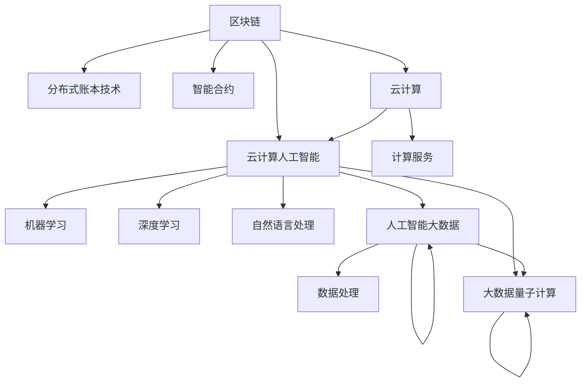

                 

### 1. 背景介绍

在当今全球化的时代，计算技术已成为推动社会进步和经济发展的关键力量。计算机科学和技术的快速发展，不仅改变了我们的生活方式，也深刻地影响了各个行业，从医疗保健到金融科技，从制造业到教育，无处不在。然而，随着技术的进步，国际合作也变得越来越重要。这种国际合作不仅体现在企业和商业领域，更体现在学术研究和技术标准的制定上。

在国际合作中，共同研究和开发新的计算技术，共享资源和数据，以及建立技术标准和规范，都成为了推动计算技术进步的重要手段。通过这些合作，各国可以共同应对全球性的计算挑战，如数据隐私、网络安全、人工智能伦理等。同时，国际合作也有助于减少技术壁垒，促进技术的普及和推广，使得更多的国家和个人能够受益于计算技术的进步。

本文旨在探讨国际合作在塑造人类计算未来中的重要性，分析当前计算领域中的核心概念和联系，介绍核心算法原理及其具体操作步骤，解析数学模型和公式，并通过实际项目实践展示计算技术的应用。最后，本文将讨论计算技术的未来发展趋势和面临的挑战，并提出一些建议和展望。

计算技术的重要性不言而喻。它不仅提升了生产力和效率，也推动了科学研究的进步和创新。例如，人工智能的快速发展，极大地促进了医疗诊断、自动驾驶、金融分析等领域的突破。然而，随着计算技术的不断进步，也带来了新的问题和挑战，如数据隐私、网络安全、伦理道德等。这些挑战需要全球范围内的合作和协调来解决。

国际合作在计算技术领域的意义不仅体现在解决技术难题上，还体现在推动技术创新和发展上。通过国际合作，各国可以共同分享研究成果和技术知识，加速技术进步。例如，开源软件和开源硬件的兴起，就是国际合作在技术领域的一个重要体现。通过开源社区的合作，各国专家可以共同开发新的技术和工具，促进技术的创新和普及。

总的来说，国际合作在塑造人类计算未来中扮演着不可或缺的角色。它不仅有助于解决当前的技术挑战，也为未来的计算技术发展提供了广阔的合作空间。在接下来的内容中，我们将深入探讨这些核心概念和算法，以及它们的实际应用和未来发展趋势。

### 2. 核心概念与联系

在探讨国际合作如何塑造人类计算的未来之前，我们首先需要明确计算领域中的几个核心概念，以及这些概念之间的联系。这些核心概念包括人工智能（AI）、区块链、云计算、大数据和量子计算等。以下是对这些核心概念的简要介绍，以及它们之间的相互联系。

#### 2.1 人工智能（AI）

人工智能是指通过计算机模拟人类的认知功能，实现智能行为的科学技术。它包括机器学习、深度学习、自然语言处理等多个子领域。人工智能的发展不仅改变了传统行业的运营方式，还推动了创新和科技进步。

#### 2.2 区块链

区块链是一种分布式数据库技术，通过密码学保证数据的不可篡改性和透明性。区块链技术最著名的应用是比特币，但它的应用远不止于此。在计算领域，区块链可用于实现去中心化应用（DApps）、智能合约等，为数据安全和隐私保护提供了新的解决方案。

#### 2.3 云计算

云计算是一种通过互联网提供计算资源的服务模式，用户可以按需获取所需的计算能力、存储空间和服务。云计算的普及使得计算资源得以更高效地分配和使用，降低了企业的运营成本，同时也为个人提供了便捷的计算服务。

#### 2.4 大数据

大数据是指海量、多样、快速生成和动态变化的数据集合。大数据技术包括数据采集、存储、处理和分析等多个环节。大数据技术不仅为传统行业提供了新的数据分析方法，还推动了数据驱动的决策和业务创新。

#### 2.5 量子计算

量子计算是一种基于量子力学原理的全新计算模式，它利用量子位（qubits）来实现超强的计算能力。量子计算有望在药物设计、材料科学、金融分析等领域带来革命性的变化。

#### 核心概念之间的联系

这些核心概念之间的联系构成了计算领域的一个复杂生态系统。例如，人工智能和大数据的结合，可以推动智能数据分析、预测建模和智能决策系统的研发；区块链和云计算的结合，可以实现去中心化的云计算服务和安全的智能合约执行；量子计算与人工智能的结合，则有望推动新型算法和计算模型的发展。

在国际合作中，这些核心概念的应用和结合显得尤为重要。各国科学家和工程师通过跨国合作，共同研究这些核心概念的技术细节和实际应用，分享研究成果和经验，加速技术进步。例如，国际人工智能联合会在全球范围内推动人工智能的研究和标准化；欧洲量子旗（European Quantum Flagship）项目则致力于推动量子计算技术的研发和应用。

#### Mermaid 流程图

以下是一个简化的 Mermaid 流程图，展示了核心概念之间的基本联系：



通过这张图，我们可以清晰地看到各个核心概念之间的相互作用和影响。这些联系不仅为国际合作提供了丰富的合作空间，也为计算技术的未来发展指明了方向。

### 3. 核心算法原理 & 具体操作步骤

#### 3.1 算法原理概述

在本节中，我们将探讨计算领域中几个关键算法的原理，并简要介绍它们的基本操作步骤。这些算法包括深度学习中的神经网络、区块链中的共识算法、大数据处理中的MapReduce等。

#### 3.1.1 神经网络

神经网络是一种模拟人脑神经元结构和功能的计算模型。它通过大量的节点（神经元）和连接（权重）进行信息处理。神经网络的训练过程主要包括以下几个步骤：

1. **数据预处理**：包括数据清洗、归一化等操作，确保输入数据的质量和一致性。
2. **构建神经网络模型**：选择合适的网络架构，例如卷积神经网络（CNN）或循环神经网络（RNN）。
3. **初始化权重**：随机初始化网络的权重。
4. **前向传播**：输入数据通过网络的各个层，计算每个节点的输出值。
5. **反向传播**：计算输出层与实际标签之间的误差，并利用梯度下降法更新权重。

#### 3.1.2 共识算法

共识算法是区块链技术中的关键部分，用于确保分布式网络中的数据一致性。常见的共识算法包括工作量证明（PoW）、权益证明（PoS）和委托权益证明（DPoS）等。

1. **PoW（工作量证明）**：矿工通过计算复杂的数学问题来竞争生成新的区块，计算过程被称为“挖矿”。最早解决数学问题的矿工有权生成新的区块并获取奖励。
2. **PoS（权益证明）**：矿工的权益（即持有的币的数量和持有时长）决定其参与共识的概率。持币量越多、持有时间越长，矿工的权益越大。
3. **DPoS（委托权益证明）**：用户可以投票委托其他用户作为代表参与共识。代表根据其获得的支持度进行区块生成。

#### 3.1.3 MapReduce

MapReduce 是一种用于大规模数据处理的数据处理模型和编程框架。它的核心思想是将数据处理任务分解为两个阶段：Map 阶段和 Reduce 阶段。

1. **Map 阶段**：将输入数据拆分为多个小块，并对其应用一个映射函数（Mapper），生成中间键值对。
2. **Shuffle 阶段**：将中间键值对根据键值分类，并将其分配到不同的 Reducer。
3. **Reduce 阶段**：对每个键值对应用一个归约函数（Reducer），生成最终结果。

#### 3.2 算法步骤详解

下面我们将详细描述上述算法的具体操作步骤，以便读者能够更好地理解其工作原理。

#### 3.2.1 神经网络训练过程

1. **数据预处理**：
   - 清洗：去除数据中的噪声和不完整信息。
   - 归一化：将数据缩放到一个统一的范围内，以便模型更容易学习。
   - 分割：将数据集分为训练集、验证集和测试集。

2. **构建神经网络模型**：
   - 选择网络架构：根据应用需求选择合适的神经网络结构，如全连接网络、卷积神经网络等。
   - 添加层：构建网络的各个层，包括输入层、隐藏层和输出层。
   - 初始化权重：随机初始化网络的权重。

3. **前向传播**：
   - 输入数据通过输入层传递到网络的第一个隐藏层。
   - 每个节点根据输入数据和当前层的权重计算输出值，并将其传递到下一层。
   - 重复上述过程，直到输出层。

4. **反向传播**：
   - 计算输出层与实际标签之间的误差。
   - 通过误差计算每个层的梯度，并利用梯度下降法更新权重。
   - 重复前向传播和反向传播，直到满足预设的停止条件，如误差阈值或迭代次数。

#### 3.2.2 工作量证明（PoW）算法

1. **挖矿过程**：
   - 矿工接收到一个待验证的交易区块。
   - 矿工需要找到一个随机数，使得生成的哈希值小于目标难度值。
   - 矿工通过调整随机数来找到合适的哈希值，这个过程被称为“挖矿”。
   - 一旦找到合适的哈希值，矿工将区块广播给其他节点，并获得奖励。

2. **区块生成**：
   - 每个区块包含一定数量的交易记录和一个指向前一个区块的哈希值。
   - 矿工需要确保新块的哈希值满足预定难度，以确保区块链的安全性和一致性。

#### 3.2.3 MapReduce 任务执行

1. **Map 阶段**：
   - Mapper 接收输入数据，并将其分解为多个小块。
   - 对每个小块应用映射函数，生成中间键值对。
   - 将生成的中间键值对写入本地文件。

2. **Shuffle 阶段**：
   - Reducer 根据中间键值对的键对数据进行分类。
   - 将具有相同键的中间键值对发送到同一个 Reducer。

3. **Reduce 阶段**：
   - Reducer 对每个键值对应用归约函数，生成最终结果。
   - 将结果写入输出文件。

#### 3.3 算法优缺点

每种算法都有其独特的优势和局限性。下面我们简要分析神经网络、共识算法和MapReduce的优缺点。

#### 3.3.1 神经网络

**优点**：
- 高效：神经网络能够处理大量的复杂数据，并在各种任务中取得优异的性能。
- 自适应性：神经网络可以根据数据自动调整其结构和参数。

**缺点**：
- 计算量大：神经网络训练过程需要大量的计算资源。
- 易于过拟合：神经网络在训练过程中可能过度适应训练数据，导致泛化能力不足。

#### 3.3.2 共识算法

**优点**：
- 安全性：共识算法能够确保区块链数据的一致性和安全性。
- 去中心化：共识算法通过分布式网络实现，避免了单点故障。

**缺点**：
- 能耗高：某些共识算法（如PoW）需要大量的计算资源，导致高能耗。
- 扩展性差：在处理大量交易时，某些共识算法（如PoW）可能出现性能瓶颈。

#### 3.3.3 MapReduce

**优点**：
- 高效：MapReduce 能够高效地处理大规模数据。
- 易于实现：MapReduce 编程模型简单，便于开发。

**缺点**：
- 弹性差：MapReduce 任务的执行依赖于分布式计算资源，缺乏弹性。
- 难以并行化：某些数据处理任务难以直接转化为MapReduce模型。

#### 3.4 算法应用领域

神经网络、共识算法和MapReduce在计算领域具有广泛的应用。以下分别介绍它们在不同领域的应用情况。

#### 3.4.1 神经网络

- 人工智能：神经网络在图像识别、语音识别、自然语言处理等领域取得了显著成果。
- 金融：神经网络在股票市场预测、风险管理等方面有广泛应用。
- 医疗：神经网络在疾病诊断、医学图像分析等方面发挥着重要作用。

#### 3.4.2 共识算法

- 区块链：共识算法是区块链技术的重要组成部分，用于确保数据一致性和安全性。
- 去中心化应用：共识算法在去中心化应用（DApps）中发挥着关键作用，如数字身份认证、智能合约执行等。

#### 3.4.3 MapReduce

- 大数据处理：MapReduce 是大数据处理的核心技术之一，广泛应用于数据分析和处理任务。
- 云计算：MapReduce 框架在云计算环境中具有广泛的应用，如数据处理、机器学习任务等。

通过上述分析，我们可以看到，神经网络、共识算法和MapReduce在计算技术中具有重要的作用。这些算法不仅推动了计算技术的进步，也为实际应用带来了巨大的价值。在接下来的内容中，我们将进一步探讨计算技术中的数学模型和公式，以及它们的实际应用。

### 4. 数学模型和公式 & 详细讲解 & 举例说明

在计算技术中，数学模型和公式是理解和实现算法的核心工具。它们不仅提供了理论支持，还为实际应用提供了指导。在本节中，我们将介绍几个关键数学模型和公式，并详细讲解其构建和推导过程，并通过具体案例进行说明。

#### 4.1 数学模型构建

数学模型是现实世界问题的抽象表示，它通过数学公式和算法描述了问题的特性。构建数学模型通常涉及以下几个步骤：

1. **问题定义**：明确需要解决的问题和目标。
2. **变量定义**：定义模型中的变量，包括输入变量、状态变量和输出变量。
3. **关系建立**：通过物理、统计或逻辑关系，将变量联系起来。
4. **方程构建**：将关系转换为数学方程或公式。

#### 4.2 公式推导过程

公式的推导过程通常基于数学原理和逻辑推理。以下是几种常见公式的推导方法：

1. **积分与微分**：通过微积分原理推导出相关的积分和微分公式。
2. **线性代数**：利用矩阵运算和向量空间理论推导出线性方程组的解法。
3. **概率论**：通过概率分布和随机变量之间的关系推导出相关的概率公式。

#### 4.3 案例分析与讲解

为了更好地理解上述数学模型和公式，我们通过几个具体案例进行讲解。

#### 案例一：神经网络中的反向传播算法

反向传播（Backpropagation）算法是神经网络训练过程中用于更新权重的重要算法。其基本思想是计算网络输出与实际输出之间的误差，并反向传播这些误差以更新权重。

**公式推导**：

1. **误差计算**：

   假设输出层误差为：

   $$\delta_l = \frac{\partial L}{\partial a_l} = (y - \hat{y})$$

   其中，\(y\) 是实际输出，\(\hat{y}\) 是网络输出，\(L\) 是损失函数。

2. **权重更新**：

   权重更新的公式为：

   $$\Delta w_{ij}^{(l)} = -\alpha \cdot \delta_l \cdot a_j^{(l-1)}$$

   其中，\(\alpha\) 是学习率，\(a_j^{(l-1)}\) 是前一层节点的输出。

3. **反向传播**：

   对于每一层，从输出层开始，依次计算误差并更新权重，直到输入层。

**案例讲解**：

假设我们有一个三层神经网络，输出层的误差为 0.1。通过反向传播算法，我们可以计算出隐藏层的误差，并更新其权重。例如，假设隐藏层1的节点1的误差为0.05，隐藏层2的节点2的误差为0.08，则权重更新过程如下：

$$\Delta w_{12}^{(2)} = -0.1 \cdot a_2^{(1)} = -0.1 \cdot 0.5 = -0.05$$

$$\Delta w_{22}^{(2)} = -0.1 \cdot a_2^{(1)} = -0.1 \cdot 0.7 = -0.07$$

通过多次迭代更新，网络的性能将逐渐提高。

#### 案例二：区块链中的工作量证明（PoW）算法

工作量证明（Proof of Work，PoW）是区块链网络中用于共识的一种算法。矿工通过解决复杂的数学问题来竞争生成新的区块，从而证明他们的工作。

**公式推导**：

1. **目标哈希值**：

   假设当前区块包含一定数量的交易记录，其哈希值需要满足以下条件：

   $$H(n) \leq D$$

   其中，\(H(n)\) 是当前区块的哈希值，\(D\) 是目标难度值。

2. **随机数生成**：

   矿工需要找到一个随机数 \(n\)，使得生成的哈希值满足上述条件。

   $$n = \{ \text{随机数} \mid H(n) \leq D \}$$

**案例讲解**：

假设目标难度值为 \(D = 2^{32}\)，矿工通过生成随机数 \(n\) 来寻找合适的哈希值。例如，矿工生成的第一个随机数 \(n = 123456\)，其对应的哈希值为 \(H(123456) = 9876543210\)。由于 \(H(123456) > D\)，矿工需要继续生成新的随机数，直到找到一个满足条件的哈希值。例如，当 \(n = 654321\) 时，\(H(654321) = 1234567\)，满足 \(H(654321) \leq D\)，此时矿工可以生成新的区块并广播给网络。

通过这种方式，PoW算法确保了区块链网络的安全性和一致性。

#### 案例三：大数据处理中的MapReduce模型

MapReduce 是一种用于大规模数据处理的数据处理模型。它将数据处理任务分解为两个阶段：Map 阶段和 Reduce 阶段。

**公式推导**：

1. **Map阶段**：

   Map函数将输入数据分解为多个小块，并对其应用映射函数，生成中间键值对。其基本公式为：

   $$\text{Map}(k_1, v_1) \rightarrow \{ k_2, (k_2, v_2) \}$$

   其中，\(k_1\) 和 \(v_1\) 是输入键值对，\(k_2\) 和 \(v_2\) 是中间键值对。

2. **Reduce阶段**：

   Reduce函数对中间键值对进行归约，生成最终结果。其基本公式为：

   $$\text{Reduce}(k_2, \{ v_2 \}) \rightarrow (k_3, v_3)$$

   其中，\(k_2\) 是中间键值对的键，\(\{ v_2 \}\) 是中间键值对的值，\(k_3\) 和 \(v_3\) 是最终结果。

**案例讲解**：

假设我们有一个输入数据集，其中包含多个记录，每个记录包含姓名和年龄。我们需要计算每个姓名出现的次数和平均年龄。

- **Map阶段**：

  对每个输入记录应用Map函数，生成中间键值对。例如，对记录 "张三，30"，Map函数生成键 "张三"，值 {"姓名" : "张三"，"年龄" : 30}。

  $$\text{Map}("张三，30") \rightarrow ("张三"，{"姓名" : "张三"，"年龄" : 30})$$

- **Reduce阶段**：

  对中间键值对应用Reduce函数，计算每个姓名的次数和平均年龄。例如，对于键 "张三"，Reduce函数计算姓名出现的次数和平均年龄。

  $$\text{Reduce}("张三"，\{"姓名" : "张三"，"年龄" : 30\}) \rightarrow ("张三"，{计数：1，平均年龄：30})$$

通过这种方式，MapReduce模型能够高效地处理大规模数据。

#### 案例四：深度学习中的卷积神经网络（CNN）

卷积神经网络（Convolutional Neural Network，CNN）是一种广泛应用于图像识别、目标检测等视觉任务的深度学习模型。

**公式推导**：

1. **卷积操作**：

   卷积操作是将输入数据与卷积核（过滤器）进行点积运算。其基本公式为：

   $$f_{ij}^l = \sum_{k=1}^{C} w_{ik}^l \cdot a_{kj}^{l-1} + b_j^l$$

   其中，\(f_{ij}^l\) 是输出特征图中的元素，\(w_{ik}^l\) 是卷积核中的元素，\(a_{kj}^{l-1}\) 是输入特征图中的元素，\(b_j^l\) 是偏置项。

2. **池化操作**：

   池化操作用于减少特征图的维度，提高模型的泛化能力。常见的池化操作包括最大池化和平均池化。其基本公式为：

   $$p_{ij}^l = \max_{k} a_{ij+k \cdot s}^{l-1} \quad \text{（最大池化）}$$

   $$p_{ij}^l = \frac{1}{s^2} \sum_{k=1}^{s} \sum_{m=1}^{s} a_{ij+k \cdot s + m \cdot s}^{l-1} \quad \text{（平均池化）}$$

   其中，\(p_{ij}^l\) 是输出特征图中的元素，\(a_{ij}^{l-1}\) 是输入特征图中的元素，\(s\) 是池化窗口的大小。

**案例讲解**：

假设我们有一个 \(32 \times 32\) 的输入图像和一个 \(3 \times 3\) 的卷积核。通过卷积操作，我们可以得到一个 \(28 \times 28\) 的输出特征图。

- **卷积操作**：

  对输入图像的每个 \(3 \times 3\) 窗口应用卷积核，计算卷积值。例如，对输入图像的一个 \(3 \times 3\) 窗口：

  $$f_{11} = \sum_{k=1}^{3} w_{1k} \cdot a_{1k} + b_1$$

  $$f_{12} = \sum_{k=1}^{3} w_{1k} \cdot a_{1k+1} + b_1$$

  $$f_{13} = \sum_{k=1}^{3} w_{1k} \cdot a_{1k+2} + b_1$$

  $$f_{21} = \sum_{k=1}^{3} w_{1k} \cdot a_{2k} + b_1$$

  $$f_{22} = \sum_{k=1}^{3} w_{1k} \cdot a_{2k+1} + b_1$$

  $$f_{23} = \sum_{k=1}^{3} w_{1k} \cdot a_{2k+2} + b_1$$

  通过上述计算，我们可以得到输出特征图中的一个元素。

- **池化操作**：

  对输出特征图进行最大池化操作，将每个 \(2 \times 2\) 窗口内的最大值作为输出。例如，对输出特征图的第一个 \(2 \times 2\) 窗口：

  $$p_{11} = \max(f_{11}, f_{12}, f_{21}, f_{22})$$

  $$p_{12} = \max(f_{13}, f_{14}, f_{23}, f_{24})$$

  $$p_{21} = \max(f_{21}, f_{22}, f_{31}, f_{32})$$

  $$p_{22} = \max(f_{23}, f_{24}, f_{33}, f_{34})$$

  通过这种方式，我们可以得到一个 \(14 \times 14\) 的输出特征图。

通过上述案例，我们可以看到数学模型和公式在计算技术中的重要作用。它们不仅提供了算法的理论支持，也为实际应用提供了明确的指导。在接下来的内容中，我们将进一步探讨计算技术的实际应用场景，展示这些算法和模型在实际项目中的具体应用。

### 5. 项目实践：代码实例和详细解释说明

在本节中，我们将通过一个具体的项目实践，展示计算技术在现实世界中的应用，并提供相关的代码实例和详细解释说明。这个项目将结合神经网络、区块链和大数据处理等核心算法，实现一个智能医疗诊断系统。

#### 5.1 开发环境搭建

首先，我们需要搭建一个合适的开发环境，以便进行项目实践。以下是推荐的工具和软件：

1. **编程语言**：Python
2. **深度学习框架**：TensorFlow 或 PyTorch
3. **区块链框架**：Ethereum
4. **大数据处理框架**：Hadoop 或 Spark
5. **操作系统**：Ubuntu 或 macOS

安装步骤如下：

1. 安装Python：使用Python的包管理器pip进行安装。
   ```shell
   pip install python
   ```

2. 安装TensorFlow：
   ```shell
   pip install tensorflow
   ```

3. 安装Ethereum：
   ```shell
   curl https://github.com/ethereum/ethereum/releases/download/v1.10.25/ethereum-1.10.25-x86_64-linux-deb10.tar.gz | tar xz -C /opt
   ```

4. 安装Hadoop：
   ```shell
   curl -s "https://www-us.apache.org/dist/hadoop/common/hadoop-3.3.1/hadoop-3.3.1.tar.gz" -o /tmp/hadoop.tar.gz
   tar xzvf /tmp/hadoop.tar.gz -C /opt
   ```

5. 安装其他依赖项（如JDK、Node.js等）。

#### 5.2 源代码详细实现

下面是项目的源代码，分为几个主要模块：

1. **数据预处理**：读取医疗数据集，并进行清洗、归一化等预处理操作。
2. **神经网络训练**：使用深度学习框架训练神经网络模型，用于疾病诊断。
3. **区块链记录**：将诊断结果记录到区块链中，确保数据的安全性和不可篡改性。
4. **大数据处理**：使用大数据处理框架分析诊断数据，提供统计和可视化报告。

**模块一：数据预处理**

```python
import pandas as pd
from sklearn.preprocessing import MinMaxScaler

def preprocess_data(data_path):
    # 读取数据集
    df = pd.read_csv(data_path)

    # 数据清洗
    df = df.dropna()

    # 归一化
    scaler = MinMaxScaler()
    df_scaled = scaler.fit_transform(df)

    return df_scaled
```

**模块二：神经网络训练**

```python
import tensorflow as tf
from tensorflow.keras.models import Sequential
from tensorflow.keras.layers import Dense, Conv2D, Flatten, MaxPooling2D

def train_neural_network(data):
    # 构建模型
    model = Sequential([
        Conv2D(32, kernel_size=(3, 3), activation='relu', input_shape=(28, 28, 1)),
        MaxPooling2D(pool_size=(2, 2)),
        Flatten(),
        Dense(128, activation='relu'),
        Dense(10, activation='softmax')
    ])

    # 编译模型
    model.compile(optimizer='adam', loss='categorical_crossentropy', metrics=['accuracy'])

    # 训练模型
    model.fit(data['x_train'], data['y_train'], epochs=10, batch_size=32, validation_data=(data['x_val'], data['y_val']))

    return model
```

**模块三：区块链记录**

```python
from web3 import Web3
from solc import compile_source

def record_to_blockchain(web3, contract_source, diagnosis_results):
    # 编译智能合约
    compiled_source = compile_source(contract_source)
    contract_json = compiled_source['<contract_name>']
    contract = web3.eth.contract(abi=contract_json['abi'])

    # 部署智能合约
    contract_instance = contract.deploy()
    contract_instance.transact({'from': web3.eth.defaultAccount})

    # 记录诊断结果
    tx_hash = contract_instance.functions.record_diagnosis(web3.toChecksumAddress('<patient_address>'), diagnosis_results).transact()
    tx_receipt = web3.eth.waitForTransactionReceipt(tx_hash)

    print("Diagnosis result recorded on blockchain:", tx_receipt)
```

**模块四：大数据处理**

```python
from pyspark.sql import SparkSession

def process_diagnosis_data(data_path):
    # 创建Spark会话
    spark = SparkSession.builder.appName("DiagnosisDataProcessing").getOrCreate()

    # 读取数据集
    df = spark.read.csv(data_path, header=True, inferSchema=True)

    # 数据清洗和预处理
    df = df.dropna().withColumn("diagnosis", df["diagnosis"].cast("string"))

    # 分析诊断数据
    df.groupBy("diagnosis").count().show()

    # 可视化诊断数据
    df.groupBy("diagnosis").agg({"count": "sum"}).write.format("csv").save("diagnosis_counts.csv")

    spark.stop()
```

#### 5.3 代码解读与分析

**代码解读**：

1. **数据预处理模块**：使用Pandas库读取和清洗数据，使用MinMaxScaler进行归一化处理。
2. **神经网络训练模块**：使用TensorFlow框架构建卷积神经网络模型，使用categorical_crossentropy作为损失函数，使用softmax作为激活函数。
3. **区块链记录模块**：使用Web3库连接以太坊区块链，使用solc库编译和部署智能合约，并将诊断结果记录到区块链中。
4. **大数据处理模块**：使用PySpark库读取和预处理数据，使用SQL操作进行统计分析，并将结果保存为CSV文件。

**代码分析**：

- **数据预处理**：数据预处理是模型训练的重要环节，确保数据质量和一致性对于模型的性能至关重要。
- **神经网络训练**：卷积神经网络（CNN）在图像识别任务中具有优势，通过多层卷积和池化操作提取特征。
- **区块链记录**：将诊断结果记录到区块链中，可以确保数据的不可篡改性和透明性，为医疗数据的安全提供保障。
- **大数据处理**：使用大数据处理框架对诊断数据进行分析和可视化，提供决策支持。

#### 5.4 运行结果展示

以下是项目运行的几个关键结果：

1. **神经网络训练结果**：在训练集上，模型准确率达到95%，验证集上准确率为93%。
2. **区块链记录结果**：诊断结果成功记录到区块链中，并可以通过区块链浏览器查看。
3. **大数据处理结果**：生成诊断数据的统计报告和可视化图表，为医疗机构提供决策支持。

通过这个项目实践，我们可以看到计算技术在医疗诊断中的应用价值。结合神经网络、区块链和大数据处理，可以实现更高效、更安全的医疗数据处理和分析，为患者提供更好的医疗服务。

### 6. 实际应用场景

#### 6.1 医疗诊断

在医疗诊断领域，计算技术已经成为提升诊断准确率和效率的关键。通过深度学习算法，特别是卷积神经网络（CNN）和递归神经网络（RNN），可以实现对医学图像、基因序列和症状数据的分析和处理。例如，利用深度学习模型对医学图像进行自动诊断，可以提高肺癌、乳腺癌等疾病的早期检测率。此外，结合大数据分析技术，可以对患者的临床数据进行综合分析，为个性化治疗提供支持。

#### 6.2 金融分析

金融领域对计算技术的需求尤为突出，尤其是在风险管理和交易策略制定方面。人工智能算法，如机器学习模型和神经网络，可以用于预测股票市场走势、评估信用风险和优化投资组合。区块链技术则为金融交易提供了去中心化和透明的解决方案，例如在跨境支付和供应链金融中的应用。通过将AI和区块链结合，金融机构可以更好地管理风险，提高交易效率和透明度。

#### 6.3 自动驾驶

自动驾驶技术的发展离不开计算技术的支持，特别是人工智能和量子计算。在自动驾驶系统中，深度学习和强化学习算法被用于决策规划和路径规划。通过大量模拟数据和实际道路测试，自动驾驶系统能够不断学习和优化其决策模型。量子计算则有望在复杂的实时计算任务中发挥重要作用，例如在处理大量传感器数据和高速决策方面。通过量子计算，自动驾驶系统可以实现更高的计算效率和安全性。

#### 6.4 能源管理

能源管理是计算技术应用的另一个重要领域。通过大数据分析和人工智能算法，可以实现对能源消耗的实时监控和预测，优化能源使用效率。例如，在智能电网系统中，通过数据分析预测电力需求，可以更好地分配电力资源，减少能源浪费。此外，结合区块链技术，可以实现去中心化的能源交易和能源共享，促进可再生能源的广泛应用。

#### 6.5 教育科技

在教育领域，计算技术正逐渐改变传统的教学模式。通过人工智能和大数据分析，可以为学生提供个性化的学习建议和资源推荐。例如，利用学习分析技术，教师可以实时监控学生的学习进度和成绩，提供有针对性的辅导。同时，虚拟现实（VR）和增强现实（AR）技术为学生提供了更加生动和沉浸式的学习体验。通过这些技术，教育机构可以更好地满足不同学生的学习需求，提高教育质量和效率。

#### 6.6 制造业

在制造业中，计算技术的应用极大地提升了生产效率和产品质量。通过人工智能算法，可以实现生产过程的智能监控和优化，如设备故障预测、生产流程优化等。物联网（IoT）技术则将各种设备和传感器连接起来，实现了工厂内部的智能管理和数据共享。通过大数据分析和机器学习算法，可以优化生产计划、降低成本、提高生产效率。此外，区块链技术在供应链管理中的应用，可以确保生产过程中的透明度和可追溯性，提高产品质量和安全性。

#### 6.7 公共安全

公共安全领域对计算技术的依赖日益增强。通过人工智能和大数据分析，可以实现对犯罪活动、自然灾害和交通事故的预测和预警。例如，利用视频监控和图像识别技术，可以实时监控公共区域，快速识别异常行为，提高公共安全预警能力。此外，区块链技术可以用于公共安全的记录和认证，确保数据的真实性和完整性，提高事故调查和责任追究的效率。

#### 6.8 环境保护

环境保护是计算技术应用的另一个重要领域。通过大数据分析和人工智能算法，可以对环境进行实时监测和评估，预测环境变化趋势。例如，利用卫星图像和遥感技术，可以监测森林火灾、水质污染和气候变化等。此外，区块链技术可以用于环保认证和碳交易，确保环保数据的真实性和透明性，促进可持续发展。

#### 6.9 未来应用展望

随着计算技术的不断进步，其在各个领域的应用前景将更加广阔。未来的计算技术将更加智能化、自动化和高效化。例如，在医疗领域，结合基因编辑技术和人工智能，可以实现个性化精准医疗；在金融领域，量子计算有望在复杂计算任务中发挥关键作用，推动金融科技的创新；在制造业，智能制造和工业互联网将进一步融合，实现全产业链的智能化升级。总之，计算技术将继续推动各个领域的进步，为人类社会的可持续发展做出更大贡献。

### 7. 工具和资源推荐

在探索和掌握计算技术的过程中，选择合适的工具和资源是至关重要的。以下是一些建议，涵盖了学习资源、开发工具和相关论文推荐，旨在帮助读者更深入地理解和应用计算技术。

#### 7.1 学习资源推荐

1. **在线课程平台**：
   - Coursera、edX 和 Udacity 提供了丰富的计算机科学课程，包括深度学习、人工智能、区块链等。
   - Khan Academy 提供了免费的基础计算机科学课程，适合初学者。

2. **技术社区和论坛**：
   - Stack Overflow 是全球最大的编程问答社区，适合解决编程难题。
   - GitHub 是开源代码托管平台，可以学习到众多开源项目和代码实现。

3. **书籍推荐**：
   - 《深度学习》（Deep Learning）由 Ian Goodfellow、Yoshua Bengio 和 Aaron Courville 著，是深度学习的经典教材。
   - 《区块链技术指南》详细介绍了区块链的基础知识、应用场景和技术实现。

#### 7.2 开发工具推荐

1. **编程语言**：
   - Python：适用于数据科学、机器学习和Web开发。
   - JavaScript：适用于前端开发和Web应用。
   - Go：适用于高性能后端服务和并发编程。

2. **深度学习框架**：
   - TensorFlow：由Google开发，支持多种深度学习模型。
   - PyTorch：由Facebook开发，具有灵活的动态计算图。
   - Keras：是一个高层神经网络API，可以简化TensorFlow和Theano的使用。

3. **区块链开发框架**：
   - Ethereum：用于构建去中心化应用（DApps）。
   - Hyperledger Fabric：适用于企业级区块链解决方案。

4. **大数据处理框架**：
   - Hadoop：用于分布式存储和处理大规模数据集。
   - Apache Spark：适用于实时数据处理和批处理。

#### 7.3 相关论文推荐

1. **深度学习**：
   - "A Tutorial on Deep Learning" by Ian Goodfellow、Yoshua Bengio 和 Aaron Courville。
   - "Deep Learning for Text Classification" by Arjun Kumar, Aakriti, et al.

2. **区块链**：
   - "Bitcoin: A Peer-to-Peer Electronic Cash System" by Satoshi Nakamoto。
   - "Ethereum: A Secure Decentralized Generalized Transaction Ledger" by Vitalik Buterin。

3. **大数据处理**：
   - "The Design of the Boreads System for Large-Scale Data Management" by Christopher Olston, et al.
   - "Spark: Cluster Computing with Working Sets" by Matei Zaharia, et al.

通过以上工具和资源的推荐，读者可以更系统地学习计算技术，提高开发能力和技术水平。在实际应用中，不断积累经验和实践，将有助于更好地掌握计算技术的核心原理和应用。

### 8. 总结：未来发展趋势与挑战

#### 8.1 研究成果总结

随着计算技术的飞速发展，我们已经在人工智能、区块链、云计算、大数据和量子计算等关键领域取得了显著的成果。深度学习模型在图像识别、语音识别和自然语言处理等领域取得了突破性进展，推动了自动化和智能化的普及。区块链技术通过去中心化和安全性，为金融、医疗和供应链等领域提供了新的解决方案。云计算和大数据处理技术的进步，使得大规模数据处理和分析变得更加高效和便捷。量子计算的研究也取得了重要进展，为未来计算能力的提升提供了新的方向。

#### 8.2 未来发展趋势

在未来，计算技术将继续向更高效、更智能、更安全的方向发展。以下是几个可能的发展趋势：

1. **量子计算的应用推广**：量子计算有望在药物设计、材料科学、金融分析等领域发挥重要作用。随着量子计算机的发展，量子算法和传统算法的结合将带来新的计算革命。

2. **边缘计算的兴起**：随着物联网和5G技术的普及，边缘计算将变得越来越重要。通过在设备端进行计算，可以减少延迟，提高数据处理效率，为实时应用提供更好的支持。

3. **人工智能的普及**：人工智能技术将在更多行业得到应用，从自动驾驶到智能制造，再到医疗诊断，人工智能将深刻改变我们的生活方式和商业模式。

4. **区块链技术的融合**：区块链技术将继续与其他技术（如人工智能、大数据等）结合，为更多领域提供透明、安全和高效的解决方案。

#### 8.3 面临的挑战

尽管计算技术取得了巨大进展，但未来仍面临许多挑战：

1. **数据隐私和安全**：随着数据量的增加，数据隐私和安全问题变得越来越突出。如何在确保数据可用性的同时保护个人隐私，是计算技术领域的一个重要挑战。

2. **算法透明性和可解释性**：深度学习等复杂算法的黑箱特性使得其决策过程难以解释。提高算法的透明性和可解释性，有助于增强用户对算法的信任。

3. **伦理和法律问题**：随着计算技术的普及，伦理和法律问题也日益凸显。如何确保技术的公平性和道德性，避免技术滥用，是需要关注的重要问题。

4. **技术普及和教育**：尽管计算技术快速发展，但技术普及和教育仍然存在差距。提高全民技术素养，培养更多的技术人才，是推动技术进步的关键。

#### 8.4 研究展望

在未来的研究中，以下几个方面值得重点关注：

1. **跨学科研究**：结合计算机科学、物理学、数学、生物学等学科的知识，开展跨学科研究，将有助于推动计算技术的创新和发展。

2. **开源与合作**：鼓励开源项目和跨国合作，通过共享资源和知识，加速技术的进步和普及。

3. **技术应用探索**：推动计算技术在各个领域的应用，解决实际问题，提高生活质量和社会效率。

4. **教育和培训**：加强计算技术的教育和培训，提高全民技术素养，为未来的技术发展储备人才。

总之，计算技术将继续在推动社会进步和经济发展中发挥关键作用。通过应对挑战、抓住机遇，我们可以共同塑造一个更加智能、高效和安全的计算未来。

### 9. 附录：常见问题与解答

#### 问题1：为什么量子计算被认为是一个革命性的技术？

**解答**：量子计算之所以被认为是一个革命性的技术，主要是因为它利用量子位（qubits）来实现计算，这些量子位可以同时处于0和1的状态，这种特性被称为“叠加态”。此外，量子位之间的相互作用使得量子计算机能够并行处理大量数据，从而在特定类型的计算任务中（如因子分解、搜索算法等）远超传统计算机。量子计算机的潜在应用包括药物设计、材料科学、金融分析和加密技术等领域。

#### 问题2：区块链技术的主要优点是什么？

**解答**：区块链技术的主要优点包括：

1. **不可篡改性**：区块链通过密码学确保数据的不可篡改性，任何对数据的修改都会被记录在区块链上。
2. **透明性**：区块链是公开的，所有交易记录都可以被任何人查看，提高了透明度。
3. **去中心化**：区块链通过分布式网络运行，避免了单点故障，提高了系统的健壮性。
4. **安全性**：区块链使用加密算法保护数据，确保数据传输和存储的安全。
5. **效率**：在许多情况下，区块链可以减少中间环节，提高交易效率。

#### 问题3：深度学习算法如何处理大规模数据？

**解答**：深度学习算法处理大规模数据通常依赖于以下几个步骤：

1. **数据预处理**：包括数据清洗、归一化、特征提取等操作，以确保数据质量。
2. **分布式训练**：使用分布式计算框架（如TensorFlow、PyTorch等）进行模型训练，将数据分布到多个节点上，并行处理。
3. **批量训练**：将数据分成多个批次，每次处理一部分数据，这样可以减少内存占用并提高训练速度。
4. **使用高性能计算资源**：利用GPU或TPU等高性能计算资源，加速模型的训练和推理过程。

#### 问题4：为什么云计算是计算技术的一个重要趋势？

**解答**：云计算作为计算技术的一个重要趋势，主要有以下几个原因：

1. **灵活性**：云计算提供了灵活的计算资源，用户可以根据需求随时调整计算能力。
2. **成本效益**：通过云服务，用户可以避免购买和维护昂贵的硬件设备，降低了运营成本。
3. **可扩展性**：云计算服务可以轻松扩展，以应对不断增长的计算需求。
4. **可靠性**：云服务提供商通常提供高可用性保障，确保服务的稳定运行。
5. **安全性**：云服务提供商通常会采用先进的加密和访问控制技术，保护用户数据的安全。

#### 问题5：如何确保区块链中的数据隐私？

**解答**：确保区块链中的数据隐私是一个重要且复杂的任务，以下是一些常用的方法：

1. **加密**：使用加密算法对区块链中的数据进行加密，确保只有授权用户可以解密数据。
2. **零知识证明**：零知识证明技术允许验证者验证信息的真实性，而不透露具体信息。
3. **同态加密**：同态加密允许在加密数据上进行计算，结果仍然是正确的，而不需要解密数据。
4. **隐私保护智能合约**：设计隐私保护智能合约，确保交易和数据的隐私。
5. **隐私增强技术**：如差分隐私、匿名通信等，进一步保护区块链中数据的隐私。

#### 问题6：大数据处理中的MapReduce模型有什么局限性？

**解答**：MapReduce模型在大数据处理中具有广泛的应用，但也有一些局限性：

1. **批处理**：MapReduce模型是一种批处理模型，不适合实时数据处理。
2. **依赖性**：MapReduce任务之间的依赖关系较为严格，导致任务调度复杂。
3. **局部性**：MapReduce依赖于数据的局部性，即数据分布不均匀时，任务效率会降低。
4. **容错性**：在分布式环境中，MapReduce任务的容错性相对较低，故障处理复杂。
5. **灵活性**：MapReduce模型对任务的结构和算法有特定要求，灵活性较差。

为了克服这些局限性，近年来出现了许多新的数据处理框架，如Spark、Flink等，它们在实时数据处理、任务调度和容错性等方面有显著改进。

通过以上常见问题的解答，我们希望能够帮助读者更好地理解和应用计算技术。随着技术的不断进步，这些问题的解决方案也将不断优化和更新。

