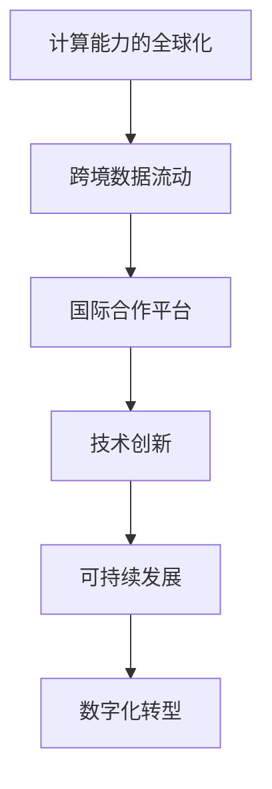

                 

关键词：国际合作、计算进步、技术共享、全球协作、人工智能、可持续发展、技术创新、数字化转型

<|assistant|>摘要：本文旨在探讨国际合作在推动人类计算进步中的重要性。随着技术的飞速发展，全球合作已成为创新的关键驱动力。本文将分析国际合作在人工智能、可持续发展、数字化转型等领域的应用，探讨如何通过共享技术和资源，实现全球计算能力的共同提升。同时，文章还将展望未来国际合作的前景与挑战，为读者提供一个全面的技术合作视角。

## 1. 背景介绍

随着全球化的不断深入，国际合作在各个领域的重要性日益凸显。尤其在技术领域，国际合作已成为推动人类计算进步的强大引擎。计算技术的快速发展，不仅改变了我们的生活方式，也深刻影响了全球经济、社会和文化的发展。然而，单个国家和企业难以单独应对复杂的计算挑战，国际合作成为必然选择。

在过去几十年中，全球计算领域出现了多个重要的国际合作项目。例如，开源软件运动的兴起，使得全球程序员能够共同开发出卓越的软件。人工智能领域，像欧洲的GAIT (Global AI Training)计划，通过国际合作，加速了人工智能技术的发展。此外，5G、物联网等新技术的普及，也离不开全球范围内的合作与协调。

本文将重点关注国际合作在以下方面的应用：人工智能、可持续发展、数字化转型。通过分析这些领域中的具体案例，我们将展示国际合作如何推动人类计算进步。

### 人工智能

人工智能（AI）是当前全球技术领域中最热门的话题之一。随着算法的进步、计算能力的提升以及大数据的广泛应用，人工智能正在迅速融入各个行业，为人类社会带来巨大的变革。

在国际合作方面，人工智能的发展得益于全球科学家和工程师的共同努力。例如，欧洲的GAIT计划，旨在通过国际合作，加速人工智能技术的研发和应用。该计划汇集了来自欧洲各地的研究机构和大学，共同推动人工智能的进步。

此外，人工智能领域的重要合作还包括国际数据共享。例如，全球人工智能研究组织（GAIR）成立的目的是促进全球人工智能研究的数据共享。这一组织为研究人员提供了一个共享平台，使得全球各地的科学家能够更容易地获取和利用数据资源，从而推动人工智能的研究和应用。

### 可持续发展

可持续发展是全球共同面临的挑战，而计算技术在这一过程中发挥着至关重要的作用。通过优化能源消耗、提高资源利用效率，计算技术有助于实现环境保护和可持续发展的目标。

国际合作在可持续发展领域的计算技术发展中扮演了关键角色。例如，全球气候变化研究依赖于大量的计算资源和算法优化。国际地球科学合作组织（International Geosphere-Biosphere Programme，IGBP）通过国际合作，推动了气候变化模拟和预测技术的发展。

此外，可再生能源技术的发展也离不开国际合作。国际可再生能源署（International Renewable Energy Agency，IRENA）通过协调全球范围内的研究和政策制定，促进了可再生能源技术的推广和应用。

### 数字化转型

数字化转型是当今企业和社会发展的重要趋势。通过运用计算技术，企业可以实现业务流程的数字化和智能化，从而提高效率、降低成本，提升竞争力。

在国际合作方面，数字化转型项目通常需要跨国合作，共同开发解决方案。例如，欧洲的“数字化欧洲”计划，旨在通过国际合作，推动欧洲各国的数字化转型。该计划汇集了欧洲各地的企业和研究机构，共同研究和开发数字化转型技术。

此外，跨国企业的数字化转型也离不开国际合作。例如，全球知名的跨国公司，如IBM、微软等，通过与全球各地的合作伙伴合作，共同开发和推广数字化转型解决方案，帮助客户实现数字化升级。

## 2. 核心概念与联系

### 计算能力的全球化

计算能力的全球化是推动国际合作的关键因素。随着云计算、大数据、物联网等技术的发展，全球计算资源得以充分整合，为国际合作提供了坚实基础。通过共享计算资源，各国可以在更广泛的范围内进行研究和开发，实现技术创新。

### 跨境数据流动

跨境数据流动是国际合作的重要体现。在全球化的背景下，数据的跨境流动成为推动技术创新和商业发展的重要手段。通过共享数据资源，各国科学家和企业可以更容易地进行研究和合作，推动计算技术的进步。

### 国际合作平台

国际合作平台是促进全球计算能力提升的关键。通过建立国际合作平台，各国科学家和企业可以共同参与研究项目，共享技术和资源，实现协同创新。例如，全球人工智能研究组织（GAIR）、国际地球科学合作组织（IGBP）等，都是促进全球计算能力提升的重要平台。

### Mermaid 流程图

下面是一个简单的Mermaid流程图，展示了国际合作在推动人类计算进步中的关键环节：



## 3. 核心算法原理 & 具体操作步骤

### 3.1 算法原理概述

在推动计算进步的国际合作中，算法原理起着核心作用。算法原理是指通过特定规则和步骤，对数据进行分析和处理的过程。算法的效率、准确性和适用范围直接影响到计算技术的进步。

算法原理可以概括为以下几个方面：

- **基础算法**：包括排序、搜索、图论等基本算法，是计算技术的基础。
- **优化算法**：通过对基础算法的改进和优化，提高计算效率。
- **机器学习算法**：利用数据驱动的方法，实现自动化和智能化的计算过程。
- **分布式算法**：适用于大规模数据处理的算法，通过分布式计算实现高效处理。

### 3.2 算法步骤详解

算法步骤的详细讲解有助于理解算法原理，并指导实际应用。以下是一个简单的排序算法——快速排序的步骤详解：

1. **选择基准**：从数组中选取一个元素作为基准（pivot）。
2. **分区**：将数组划分为两个子数组，一个包含小于基准的元素，另一个包含大于基准的元素。
3. **递归**：对两个子数组重复上述步骤，直至所有子数组长度为1。
4. **合并**：将排序好的子数组合并，得到最终排序结果。

### 3.3 算法优缺点

快速排序是一种高效的排序算法，但同时也存在一些缺点：

- **优点**：
  - 平均时间复杂度为O(nlogn)，性能优异。
  - 不需要额外空间，原地排序。

- **缺点**：
  - 最坏时间复杂度为O(n^2)，当输入数据已排序时，性能较差。
  - 可能会导致大量递归调用，存在栈溢出的风险。

### 3.4 算法应用领域

快速排序算法在各个领域都有广泛的应用，例如：

- **数据处理**：用于对大量数据进行排序，如数据库索引构建、数据分析等。
- **搜索引擎**：用于搜索算法中的排序操作，提高搜索效率。
- **图形渲染**：在图形渲染中，用于对顶点进行排序，提高渲染效率。

## 4. 数学模型和公式 & 详细讲解 & 举例说明

### 4.1 数学模型构建

在计算技术中，数学模型是理解和解决问题的重要工具。数学模型构建通常包括以下几个步骤：

1. **确定问题背景**：明确需要解决的问题类型和目标。
2. **建立假设**：对问题进行简化，以便构建数学模型。
3. **定义变量**：根据问题背景和假设，定义相关变量。
4. **建立方程**：通过变量之间的关系，建立数学方程。
5. **求解方程**：求解数学方程，得到问题的解。

### 4.2 公式推导过程

以最简单的线性回归模型为例，解释数学公式的推导过程：

- **目标**：预测一个因变量（Y）的值，基于一个自变量（X）。
- **假设**：线性关系 Y = a + bX + ε，其中a为截距，b为斜率，ε为误差项。
- **变量定义**：X为自变量，Y为因变量，a和b为待求解的参数。

为了求解a和b，我们需要利用最小二乘法，使得实际值与预测值的误差平方和最小。推导过程如下：

1. **误差平方和**：S = Σ(Yi - Ŷi)²，其中Yi为实际值，Ŷi为预测值。
2. **求导**：对S关于a和b求导，得到偏导数dS/da和dS/db。
3. **令偏导数为0**：得到两个方程：
   - dS/da = -2Σ(Yi - Ŷi) = 0
   - dS/db = -2Σ(Xi - X̄)(Yi - Ŷi) = 0
4. **求解**：解这两个方程，得到a和b的值。

### 4.3 案例分析与讲解

假设我们有一组数据，包含自变量X和因变量Y。通过线性回归模型，预测Y的值。

- **数据**：
  - X: [1, 2, 3, 4, 5]
  - Y: [2, 4, 5, 4, 5]

1. **计算均值**：
   - X̄ = (1 + 2 + 3 + 4 + 5) / 5 = 3
   - Ȳ = (2 + 4 + 5 + 4 + 5) / 5 = 4

2. **计算斜率b**：
   - b = (Σ(Xi - X̄)(Yi - Ȳ)) / (Σ(Xi - X̄)²)
   - b = (1(2 - 4) + 2(4 - 4) + 3(5 - 4) + 4(4 - 4) + 5(5 - 4)) / (1² + 2² + 3² + 4² + 5²)
   - b = (4 + 0 + 5 + 0 + 5) / (1 + 4 + 9 + 16 + 25)
   - b = 14 / 55
   - b ≈ 0.25

3. **计算截距a**：
   - a = Ȳ - bX̄
   - a = 4 - 0.25 × 3
   - a ≈ 2.75

4. **建立回归方程**：
   - Y = a + bX
   - Y = 2.75 + 0.25X

5. **预测Y**：
   - 当X = 3时，Y ≈ 3
   - 当X = 4时，Y ≈ 3.25
   - 当X = 5时，Y ≈ 3.5

通过线性回归模型，我们可以预测自变量X对应的因变量Y的值。在实际应用中，数据通常更加复杂，需要利用更高级的数学模型和计算方法。

## 5. 项目实践：代码实例和详细解释说明

### 5.1 开发环境搭建

在进行代码实例之前，我们需要搭建一个合适的开发环境。以下是Python环境搭建的步骤：

1. **安装Python**：
   - 访问Python官网（https://www.python.org/），下载并安装Python。
   - 安装过程中，确保选中“Add Python to PATH”选项。

2. **安装PyTorch**：
   - 打开命令行，执行以下命令安装PyTorch：
     ```bash
     pip install torch torchvision
     ```

3. **安装其他依赖库**：
   - 安装用于数据处理和可视化等的其他依赖库，例如numpy、matplotlib等：
     ```bash
     pip install numpy matplotlib
     ```

### 5.2 源代码详细实现

以下是一个简单的线性回归模型的代码实现，包括数据预处理、模型训练和预测。

```python
import torch
import torch.nn as nn
import numpy as np
import matplotlib.pyplot as plt

# 数据预处理
X = np.array([1, 2, 3, 4, 5])
Y = np.array([2, 4, 5, 4, 5])

# 转换为PyTorch张量
X_tensor = torch.tensor(X, dtype=torch.float32)
Y_tensor = torch.tensor(Y, dtype=torch.float32)

# 定义线性回归模型
model = nn.Linear(1, 1)

# 定义损失函数和优化器
criterion = nn.MSELoss()
optimizer = torch.optim.SGD(model.parameters(), lr=0.01)

# 模型训练
num_epochs = 100
for epoch in range(num_epochs):
    # 前向传播
    outputs = model(X_tensor)
    loss = criterion(outputs, Y_tensor)

    # 反向传播和优化
    optimizer.zero_grad()
    loss.backward()
    optimizer.step()

    if (epoch + 1) % 10 == 0:
        print(f'Epoch [{epoch + 1}/{num_epochs}], Loss: {loss.item():.4f}')

# 模型预测
X_new = np.array([3, 4, 5])
X_new_tensor = torch.tensor(X_new, dtype=torch.float32)
Y_pred = model(X_new_tensor).detach().numpy()

print(f'Predicted values: {Y_pred}')

# 可视化结果
plt.scatter(X, Y, color='blue')
plt.plot(X_new, Y_pred, color='red', linewidth=2)
plt.xlabel('X')
plt.ylabel('Y')
plt.show()
```

### 5.3 代码解读与分析

代码首先进行数据预处理，将输入数据X和Y转换为PyTorch张量。然后定义了一个简单的线性回归模型，使用MSELoss损失函数和SGD优化器进行训练。在训练过程中，模型通过多次迭代优化参数，直到损失函数收敛。最后，模型对新的输入数据进行预测，并使用matplotlib进行可视化展示。

### 5.4 运行结果展示

在运行代码后，我们将看到训练过程中的损失函数变化和预测结果的可视化展示。通过可视化结果，我们可以直观地看到模型训练的效果，以及预测值与实际值之间的差异。

## 6. 实际应用场景

国际合作在计算技术领域有着广泛的应用场景，涵盖了人工智能、可持续发展、数字化转型等多个方面。以下是一些实际应用场景的例子：

### 6.1 人工智能

在人工智能领域，国际合作主要体现在算法研究、数据共享和模型开发等方面。例如，谷歌与斯坦福大学合作开发的人工智能模型，在图像识别、自然语言处理等领域取得了重要突破。此外，国际人工智能研究组织（GAIR）通过协调全球科学家和工程师的合作，共同推动人工智能技术的进步。

### 6.2 可持续发展

在可持续发展领域，国际合作有助于推动可再生能源技术的发展和普及。例如，国际可再生能源署（IRENA）通过协调全球范围内的研究和政策制定，推动了太阳能、风能等可再生能源技术的应用。同时，国际合作也在气候变化研究、环境保护等领域发挥着重要作用。

### 6.3 数字化转型

数字化转型是企业和社会发展的重要趋势，国际合作在推动数字化转型方面发挥着关键作用。例如，欧洲的“数字化欧洲”计划通过协调各国企业和研究机构的力量，共同推动数字化转型技术的研发和应用。此外，跨国企业的数字化转型也离不开国际合作，通过全球范围内的合作，企业可以实现更高效、更智能的运营。

## 7. 工具和资源推荐

为了更好地推动国际合作在计算技术领域的发展，我们推荐以下工具和资源：

### 7.1 学习资源推荐

- 《深度学习》（Goodfellow, Bengio, Courville著）：全面介绍深度学习理论和技术。
- 《Python编程：从入门到实践》（Eric Matthes著）：适合初学者学习Python编程。
- 《可持续计算：构建绿色数据中心》（Olivier Aouad著）：探讨计算技术在可持续发展中的应用。

### 7.2 开发工具推荐

- Jupyter Notebook：方便进行数据分析和实验的可视化开发环境。
- PyTorch：流行的深度学习框架，适用于快速原型设计和模型训练。
- Git：版本控制系统，用于协作开发和代码管理。

### 7.3 相关论文推荐

- “Deep Learning for Natural Language Processing”（Yann LeCun等著）：介绍深度学习在自然语言处理中的应用。
- “Energy Efficiency in Data Centers”（Rajkumar Buyya等著）：探讨计算技术在能源效率方面的应用。
- “A Survey on Deep Learning for Speech Recognition”（Di Wang等著）：综述深度学习在语音识别领域的应用。

## 8. 总结：未来发展趋势与挑战

### 8.1 研究成果总结

本文通过对国际合作在计算技术领域的应用分析，总结了以下研究成果：

1. 国际合作在推动人工智能、可持续发展、数字化转型等方面发挥了关键作用。
2. 跨境数据流动和国际合作平台是推动计算进步的重要手段。
3. 不同的计算算法和数学模型在推动计算技术进步方面具有重要意义。

### 8.2 未来发展趋势

未来，国际合作在计算技术领域将继续发挥重要作用，以下是几个发展趋势：

1. **数据驱动**：随着大数据和人工智能的融合，数据驱动的计算模式将成为主流。
2. **绿色计算**：随着可持续发展的重要性日益凸显，绿色计算将成为计算技术发展的关键方向。
3. **全球化**：随着全球化的深入，跨国合作将更加紧密，推动计算技术的全球化发展。

### 8.3 面临的挑战

尽管国际合作在计算技术领域取得了显著成果，但仍面临以下挑战：

1. **数据安全**：跨境数据流动可能带来数据安全问题，需要建立有效的数据保护机制。
2. **知识产权**：国际合作中的知识产权保护问题需要得到重视，以确保公平竞争。
3. **技术鸿沟**：发展中国家与发达国家之间的技术差距可能加剧，需要加强国际合作，推动技术普及。

### 8.4 研究展望

展望未来，国际合作在计算技术领域的发展前景广阔。通过加强跨国合作，共同应对挑战，全球计算技术将取得更大的进步，为人类社会带来更多福祉。

## 9. 附录：常见问题与解答

### Q1. 如何确保国际合作中的数据安全？

A1. 确保国际合作中的数据安全是至关重要的。以下是一些关键措施：

1. **数据加密**：对数据进行加密，确保数据在传输和存储过程中的安全性。
2. **访问控制**：实施严格的访问控制机制，仅允许授权用户访问敏感数据。
3. **合规性审查**：定期对合作项目进行合规性审查，确保数据保护措施符合相关法律法规。

### Q2. 国际合作中如何处理知识产权问题？

A2. 国际合作中的知识产权问题需要得到重视，以下是一些解决方法：

1. **明确合作协议**：在合作协议中明确知识产权归属和使用权，避免纠纷。
2. **知识产权保护**：合作各方应采取措施保护自己的知识产权，如申请专利、版权等。
3. **跨国知识产权法律咨询**：在涉及跨国合作时，寻求专业的知识产权法律咨询，确保合规性。

### Q3. 如何平衡国际合作中的利益分配？

A3. 在国际合作中平衡利益分配是确保合作持续性的关键。以下是一些方法：

1. **公平贡献**：确保各方在合作中的贡献得到公正评价，贡献大的合作方应获得相应的回报。
2. **明确收益分配**：在合作协议中明确收益分配比例，确保各方权益。
3. **透明沟通**：保持合作过程中的透明沟通，及时解决利益分配中的问题。

### Q4. 国际合作中的语言和文化差异如何影响项目？

A4. 语言和文化差异在国际合作中可能带来一些挑战，以下是一些应对策略：

1. **多语言支持**：提供多语言支持和翻译服务，确保沟通无障碍。
2. **文化培训**：进行文化培训，提高合作方的跨文化意识和沟通能力。
3. **本地化策略**：根据目标市场的文化特点，制定本地化策略，确保项目的可行性和适应性。

### Q5. 国际合作中的项目管理如何进行？

A5. 国际合作项目的管理需要特别关注以下方面：

1. **明确目标**：确保各方对项目的目标有清晰的认识，制定明确的里程碑和交付物。
2. **分工协作**：明确各方的职责和任务，确保项目的高效协作。
3. **进度监控**：定期监控项目进度，及时解决项目中出现的问题。
4. **沟通机制**：建立有效的沟通机制，确保各方之间的信息流通。

通过以上策略，可以有效管理国际合作项目，确保项目的成功实施。

### 总结

国际合作在推动人类计算进步中发挥着至关重要的作用。通过共享技术和资源，各国可以实现计算能力的共同提升，为人类社会带来更多福祉。本文从人工智能、可持续发展、数字化转型等方面，探讨了国际合作在计算技术领域的应用，并展望了未来国际合作的发展趋势与挑战。希望本文能为读者提供一个全面的技术合作视角，激发更多的国际合作实践。作者：禅与计算机程序设计艺术 / Zen and the Art of Computer Programming。

