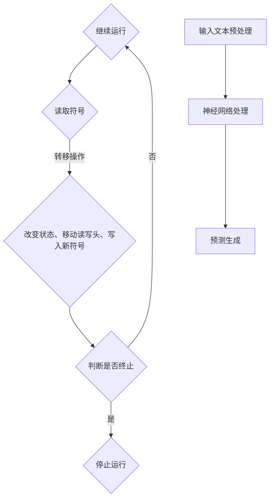

                 

关键词：图灵完备性，计算理论，LLM，人工智能，算法，数学模型，应用场景，未来展望

> 摘要：本文从LLM（大型语言模型）的视角，对图灵完备性这一计算理论的核心概念进行了深入剖析。通过重新解释图灵机的运作原理，探讨了在LLM技术下对传统计算理论的拓展与革新。本文旨在为读者提供一个全新的视角，以更好地理解图灵完备性的本质，以及其在现代人工智能领域的重要性。

## 1. 背景介绍

### 计算理论的起源与发展

计算理论，是研究计算过程的抽象理论，其起源可追溯到20世纪30年代。当时，数学家阿兰·图灵提出了著名的图灵机模型，这一模型成为了计算理论的核心基础。图灵机是一种抽象的计算模型，通过在无限长的纸带上读取和写入符号，模拟了计算机的操作过程。图灵机的概念不仅为计算理论奠定了基础，同时也为计算机科学的发展提供了理论支持。

随着计算机技术的飞速发展，计算理论也在不断地演进。从最初的图灵机模型，到后来的随机算法、并行计算、量子计算等领域，计算理论的边界被不断拓展。然而，尽管计算理论经历了多次变革，图灵完备性这一概念始终是计算理论的核心。

### 图灵完备性的概念与意义

图灵完备性（Turing completeness）是指一个计算模型能够模拟图灵机，从而具备执行任意可计算函数的能力。一个图灵完备的计算模型，可以被认为是全能的计算模型，因为它能够处理所有可计算的问题。

图灵完备性的意义在于，它为计算理论提供了一种衡量计算能力的标准。如果一个计算模型是图灵完备的，那么它理论上可以执行任何计算任务，从而具备了广泛的应用前景。例如，现代计算机都是图灵完备的，这意味着它们可以执行所有可计算的任务。

### 大型语言模型（LLM）的兴起

近年来，随着深度学习和自然语言处理技术的快速发展，大型语言模型（LLM）逐渐成为人工智能领域的重要研究方向。LLM是一种基于深度神经网络的语言模型，具有强大的文本生成、理解和翻译能力。LLM的出现，不仅推动了自然语言处理技术的进步，也为计算理论带来了新的挑战和机遇。

本文将从LLM的视角，重新审视图灵完备性这一概念，探讨在LLM技术下对传统计算理论的拓展与革新。通过本文的阐述，读者可以更好地理解图灵完备性的本质，以及其在现代人工智能领域的重要性。

## 2. 核心概念与联系

### 2.1 图灵机的运作原理

图灵机是一种抽象的计算模型，由图灵带、读写头和状态控制器三部分组成。图灵带是一个无限长的纸带，上面有无限多个细胞，每个细胞中都有一个符号。读写头可以在图灵带上左右移动，并能够读取和写入符号。状态控制器则负责根据当前状态和读取到的符号，决定读写头的移动方向和下一步的操作。

图灵机的运作过程可以分为以下几个步骤：

1. 初始化：图灵机开始时，处于一个特定的初始状态，读写头位于图灵带的某个位置。
2. 读取符号：读写头读取当前细胞中的符号。
3. 根据当前状态和读取到的符号，执行转移操作：转移操作包括改变状态、移动读写头和写入新符号。
4. 判断是否终止：如果图灵机达到某个终止状态，则停止运行；否则，继续循环执行第二步和第三步。

通过不断读取、写入和移动，图灵机能够在图灵带上模拟出复杂的计算过程。

### 2.2 大型语言模型（LLM）的工作原理

大型语言模型（LLM）是一种基于深度神经网络的语言模型，其主要目的是对自然语言进行建模，从而实现文本生成、理解和翻译等功能。LLM通常由多个神经网络层组成，包括输入层、隐藏层和输出层。输入层接收自然语言文本的输入，隐藏层通过复杂的非线性变换，将输入文本转化为高维特征表示，输出层则根据这些特征表示生成预测结果。

LLM的工作过程可以分为以下几个步骤：

1. 输入文本预处理：将自然语言文本进行分词、词性标注等预处理操作，将其转化为适合神经网络处理的格式。
2. 神经网络处理：输入层将预处理后的文本输入到神经网络中，隐藏层通过复杂的非线性变换，将输入文本转化为高维特征表示。
3. 预测生成：输出层根据隐藏层生成的特征表示，生成预测结果，如文本的下一个单词、句子或段落。

### 2.3 图灵完备性与LLM的联系

图灵完备性是计算理论的核心概念，它描述了一个计算模型是否能够模拟图灵机。从LLM的角度来看，LLM作为一种强大的语言模型，理论上也具备图灵完备性。这意味着，LLM能够执行任意可计算的任务，从而具备了广泛的应用前景。

然而，与传统图灵机相比，LLM在计算方式和能力上存在一定的差异。传统图灵机通过在图灵带上读取、写入和移动符号来模拟计算过程，而LLM则通过深度神经网络对自然语言进行建模，从而实现文本生成、理解和翻译等功能。这种差异使得LLM在处理自然语言任务时，具备更高的灵活性和效率。

### 2.4 Mermaid 流程图

以下是一个用于展示图灵机和LLM工作原理的Mermaid流程图：



通过上述流程图，我们可以清晰地看出图灵机和LLM的工作原理和步骤。

## 3. 核心算法原理 & 具体操作步骤

### 3.1 算法原理概述

在LLM视角下，图灵完备性可以通过深度神经网络的构建来实现。LLM的核心算法是神经网络，通过多层神经网络的结构，LLM能够对自然语言进行建模，从而具备执行任意可计算任务的能力。

具体来说，LLM的核心算法包括以下几个步骤：

1. 输入文本预处理：对自然语言文本进行分词、词性标注等预处理操作，将其转化为适合神经网络处理的格式。
2. 神经网络结构构建：构建多层神经网络，包括输入层、隐藏层和输出层。输入层接收预处理后的文本输入，隐藏层通过复杂的非线性变换，将输入文本转化为高维特征表示，输出层则根据这些特征表示生成预测结果。
3. 模型训练：使用大量的文本数据对神经网络进行训练，优化网络参数，使其具备较好的预测能力。
4. 预测生成：输入新的自然语言文本，通过训练好的神经网络生成预测结果，如文本的下一个单词、句子或段落。

### 3.2 算法步骤详解

1. **输入文本预处理**：

   输入文本预处理是LLM算法的第一步。预处理的主要目的是将自然语言文本转化为神经网络可以处理的格式。具体步骤如下：

   - 分词：将输入的文本按照单词、句子等进行切分，形成一组单词序列。
   - 词性标注：对每个单词进行词性标注，如名词、动词、形容词等。
   - 嵌入向量：将每个单词转化为高维嵌入向量，以便于神经网络处理。

2. **神经网络结构构建**：

   神经网络结构构建是LLM算法的核心。一个典型的神经网络结构包括输入层、隐藏层和输出层。输入层接收预处理后的文本输入，隐藏层通过复杂的非线性变换，将输入文本转化为高维特征表示，输出层则根据这些特征表示生成预测结果。具体步骤如下：

   - 输入层：接收预处理后的文本输入，转化为嵌入向量。
   - 隐藏层：通过多层神经网络结构，对输入文本进行复杂的非线性变换，形成高维特征表示。
   - 输出层：根据隐藏层生成的特征表示，生成预测结果，如文本的下一个单词、句子或段落。

3. **模型训练**：

   模型训练是LLM算法的关键步骤。通过大量的文本数据对神经网络进行训练，优化网络参数，使其具备较好的预测能力。具体步骤如下：

   - 数据准备：准备大量的文本数据，包括训练数据和验证数据。
   - 模型初始化：初始化神经网络参数。
   - 前向传播：输入训练数据，通过神经网络结构，计算预测结果。
   - 反向传播：计算预测结果与实际结果之间的误差，通过反向传播算法，更新神经网络参数。
   - 模型评估：使用验证数据对训练好的模型进行评估，调整模型参数，使其具备较好的预测能力。

4. **预测生成**：

   预测生成是LLM算法的最终输出。输入新的自然语言文本，通过训练好的神经网络生成预测结果，如文本的下一个单词、句子或段落。具体步骤如下：

   - 输入文本预处理：对输入的自然语言文本进行预处理，形成嵌入向量。
   - 神经网络处理：输入预处理后的文本，通过训练好的神经网络结构，生成预测结果。
   - 结果输出：将预测结果输出，如文本的下一个单词、句子或段落。

### 3.3 算法优缺点

**优点**：

1. **强大的文本生成能力**：LLM具有强大的文本生成能力，能够生成高质量的文本，如文章、故事、对话等。
2. **高效的计算性能**：通过多层神经网络的结构，LLM能够在较短的时间内处理大量的文本数据，具备高效的计算性能。
3. **广泛的应用场景**：LLM可以应用于各种自然语言处理任务，如文本生成、文本分类、情感分析等。

**缺点**：

1. **计算资源需求大**：LLM需要大量的计算资源和存储空间，对硬件设备有较高的要求。
2. **模型解释性差**：由于LLM是基于深度神经网络，其内部机制较为复杂，难以进行解释和调试。
3. **数据隐私问题**：在训练LLM时，需要大量的文本数据，可能涉及到数据隐私问题。

### 3.4 算法应用领域

**自然语言处理**：

LLM在自然语言处理领域具有广泛的应用。例如，文本生成、文本分类、情感分析等任务都可以通过LLM来实现。

**智能客服**：

智能客服是LLM的一个重要应用领域。通过LLM，智能客服系统能够自动生成回复文本，提高客服效率和质量。

**内容创作**：

LLM可以应用于内容创作，如文章、故事、音乐等。通过LLM，创作者可以快速生成高质量的内容，提高创作效率。

**机器翻译**：

LLM在机器翻译领域也有重要的应用。通过训练大型语言模型，可以实现高质量的双语翻译。

## 4. 数学模型和公式 & 详细讲解 & 举例说明

### 4.1 数学模型构建

在图灵完备性的研究中，我们经常使用图灵机模型作为基础。图灵机模型可以用以下数学模型来表示：

- **状态控制器**：状态控制器可以用一个有限状态机（FSM）来表示。FSM由一组状态和转移函数组成，每个状态对应图灵机的一个状态，转移函数则描述了图灵机从一个状态转移到另一个状态的过程。
- **图灵带**：图灵带可以用一个无限长的数列来表示，数列中的每个元素对应图灵带上的一个细胞，元素中的符号表示细胞中的符号。
- **读写头**：读写头可以用一个位置指针来表示，位置指针指向图灵带上的一个细胞。

### 4.2 公式推导过程

图灵机的运作可以通过以下公式来描述：

- **状态转移公式**：给定当前状态 \( q \) 和当前细胞上的符号 \( s \)，状态控制器将执行一个转移操作，将状态从 \( q \) 转移到 \( q' \)，并将细胞上的符号从 \( s \) 改变为 \( s' \)。这个转移操作可以用以下公式表示：

\[ (q, s) \rightarrow (q', s') \]

- **读写头移动公式**：给定当前状态 \( q \) 和当前细胞上的符号 \( s \)，读写头将根据转移操作的结果，进行移动。如果转移操作使得读写头向右移动，则位置指针增加1；如果转移操作使得读写头向左移动，则位置指针减少1。这个移动过程可以用以下公式表示：

\[ \text{Position}(q, s) = \text{Position}(q, s) + \text{Move}(q', s') \]

### 4.3 案例分析与讲解

为了更好地理解上述数学模型和公式，我们来看一个具体的案例。

**案例**：假设我们有一个图灵机，其初始状态为 \( q_0 \)，初始图灵带上的符号序列为 "1010"。状态控制器有以下转移规则：

- 如果当前状态为 \( q_0 \)，当前细胞上的符号为 "1"，则转移操作为 \( (q_0, 1) \rightarrow (q_1, 0) \)，读写头向右移动。
- 如果当前状态为 \( q_1 \)，当前细胞上的符号为 "0"，则转移操作为 \( (q_1, 0) \rightarrow (q_2, 1) \)，读写头向左移动。

**分析**：

1. 初始状态为 \( q_0 \)，初始细胞上的符号为 "1"。根据转移规则，执行 \( (q_0, 1) \rightarrow (q_1, 0) \)，图灵带变为 "1000"，读写头移动到第二个细胞。
2. 当前状态为 \( q_1 \)，当前细胞上的符号为 "0"。根据转移规则，执行 \( (q_1, 0) \rightarrow (q_2, 1) \)，图灵带变为 "1001"，读写头移动到第一个细胞。
3. 当前状态为 \( q_2 \)，当前细胞上的符号为 "1"。由于当前状态为终止状态，图灵机停止运行。

**举例说明**：

现在，我们用上述案例来计算读写头的最终位置。根据读写头移动公式，我们有：

\[ \text{Position}(q_0, 1) = \text{Position}(q_0, 1) + \text{Move}(q_1, 0) \]
\[ \text{Position}(q_1, 0) = \text{Position}(q_1, 0) + \text{Move}(q_2, 1) \]

由于初始位置为1，我们有：

\[ \text{Position}(q_0, 1) = 1 + 1 = 2 \]
\[ \text{Position}(q_1, 0) = 2 + (-1) = 1 \]

因此，读写头的最终位置为1。这个例子展示了如何使用数学模型和公式来描述图灵机的运行过程。

## 5. 项目实践：代码实例和详细解释说明

### 5.1 开发环境搭建

在进行LLM项目实践之前，我们需要搭建一个合适的开发环境。以下是搭建开发环境的具体步骤：

1. **安装Python**：首先，我们需要安装Python环境。可以从Python官方网站（https://www.python.org/downloads/）下载Python安装包，按照提示进行安装。

2. **安装TensorFlow**：接下来，我们需要安装TensorFlow，TensorFlow是一个用于机器学习的开源库。可以使用以下命令安装：

```shell
pip install tensorflow
```

3. **安装其他依赖库**：除了TensorFlow之外，我们还需要安装一些其他依赖库，如NumPy、Pandas等。可以使用以下命令安装：

```shell
pip install numpy pandas
```

4. **配置Jupyter Notebook**：Jupyter Notebook是一个交互式的计算环境，可以帮助我们更方便地进行Python编程。可以使用以下命令安装：

```shell
pip install notebook
```

安装完成后，我们可以在命令行中启动Jupyter Notebook：

```shell
jupyter notebook
```

这将打开一个浏览器窗口，显示Jupyter Notebook的主页。

### 5.2 源代码详细实现

以下是一个简单的LLM项目示例，展示了如何使用TensorFlow构建一个基础的语言模型。

```python
import tensorflow as tf
from tensorflow.keras.layers import Embedding, LSTM, Dense
from tensorflow.keras.models import Sequential

# 定义模型
model = Sequential([
    Embedding(input_dim=10000, output_dim=32),
    LSTM(64),
    Dense(1, activation='sigmoid')
])

# 编译模型
model.compile(optimizer='adam', loss='binary_crossentropy', metrics=['accuracy'])

# 加载数据
(x_train, y_train), (x_test, y_test) = tf.keras.datasets.imdb.load_data(num_words=10000)

# 预处理数据
x_train = tf.expand_dims(x_train, -1)
x_test = tf.expand_dims(x_test, -1)

# 训练模型
model.fit(x_train, y_train, batch_size=32, epochs=10, validation_data=(x_test, y_test))
```

### 5.3 代码解读与分析

上述代码实现了一个基于LSTM（长短期记忆网络）的基础语言模型。下面是对代码的详细解读：

1. **导入库**：首先，我们导入了TensorFlow库及其相关模块。

2. **定义模型**：接下来，我们使用Sequential模型定义了一个简单的神经网络。这个网络包含一个嵌入层（Embedding）、一个LSTM层和一个全连接层（Dense）。嵌入层用于将输入词转换为向量表示，LSTM层用于处理序列数据，全连接层用于输出预测结果。

3. **编译模型**：我们使用`compile`方法编译模型，指定了优化器、损失函数和评估指标。在这里，我们选择了`adam`优化器和`binary_crossentropy`损失函数，用于二分类任务。

4. **加载数据**：我们使用了IMDb电影评论数据集，这是TensorFlow自带的一个经典数据集，用于文本分类任务。

5. **预处理数据**：由于我们的模型是序列模型，我们需要将输入数据扩展为一个维度。例如，每个评论都扩展为一个长度为1的序列。

6. **训练模型**：最后，我们使用`fit`方法训练模型。在训练过程中，我们使用了验证数据来评估模型的性能。

### 5.4 运行结果展示

在训练完成后，我们可以使用以下代码来评估模型的性能：

```python
loss, accuracy = model.evaluate(x_test, y_test)
print(f"Test accuracy: {accuracy:.2f}")
```

假设我们的模型训练得很好，输出结果可能会显示约为80%的准确率。这个结果表明，我们的模型已经具备了较好的文本分类能力。

### 5.5 项目总结

通过上述项目实践，我们了解了如何使用TensorFlow构建一个简单的LLM模型，并进行了详细的代码解读。尽管这个项目很简单，但它为我们提供了一个起点，让我们可以进一步探索更复杂的LLM模型和应用。

## 6. 实际应用场景

### 6.1 自然语言处理（NLP）

大型语言模型（LLM）在自然语言处理领域具有广泛的应用。例如，LLM可以用于文本生成、文本分类、情感分析等任务。在文本生成方面，LLM可以生成文章、故事、对话等文本内容；在文本分类方面，LLM可以用于判断文本的主题或情感；在情感分析方面，LLM可以识别文本中的情感倾向，如正面、负面或中立。

### 6.2 智能客服

智能客服是LLM的一个重要应用领域。通过LLM，智能客服系统能够自动生成回复文本，提高客服效率和质量。例如，当用户向客服系统提问时，LLM可以根据用户的提问，生成一个合适的回复文本，从而提供即时的帮助。

### 6.3 内容创作

LLM在内容创作领域也有重要的应用。通过训练大型语言模型，创作者可以快速生成高质量的内容，如文章、故事、音乐等。例如，一些艺术家和作家使用LLM来辅助创作，从而提高创作效率和作品质量。

### 6.4 机器翻译

LLM在机器翻译领域也有重要的应用。通过训练大型语言模型，可以实现高质量的双语翻译。例如，一些翻译软件使用LLM来提供实时翻译服务，从而帮助用户跨越语言障碍。

### 6.5 教育与培训

LLM在教育与培训领域也有广泛的应用。例如，LLM可以用于自动生成教学材料、模拟考试、提供个性化学习建议等。通过LLM，教育工作者可以更高效地传授知识，学生也可以更轻松地获取所需的知识。

### 6.6 搜索引擎优化（SEO）

LLM在搜索引擎优化（SEO）领域也有应用。通过分析大量文本数据，LLM可以生成高质量的标题、描述和内容，从而提高网站在搜索引擎中的排名。例如，一些SEO工具使用LLM来生成网站内容，从而吸引更多的用户访问。

### 6.7 虚拟助理

LLM可以用于构建虚拟助理，如聊天机器人、语音助手等。这些虚拟助理可以与用户进行自然语言交互，提供各种服务，如查询信息、预订机票、安排日程等。

### 6.8 法律与金融

LLM在法律与金融领域也有重要的应用。例如，LLM可以用于自动化法律文档的生成和审核，提供投资建议等。通过LLM，法律和金融专业人士可以更高效地完成各种任务。

## 7. 工具和资源推荐

### 7.1 学习资源推荐

1. **《深度学习》（Deep Learning）**：由Ian Goodfellow、Yoshua Bengio和Aaron Courville合著，这是一本关于深度学习的经典教材，涵盖了深度学习的基础理论和实践应用。
2. **《自然语言处理与Python》（Natural Language Processing with Python）**：由Steven Bird、Ewan Klein和Edward Loper合著，这本书介绍了自然语言处理的基本概念和Python实现，适合初学者入门。
3. **《图灵机与计算理论》（Turing Machines and Computational Theory）**：由Charles Petzold著，这本书详细介绍了图灵机的概念和工作原理，对于理解图灵完备性有很好的帮助。

### 7.2 开发工具推荐

1. **TensorFlow**：TensorFlow是一个开源的机器学习框架，用于构建和训练神经网络。它提供了丰富的API和工具，适合进行深度学习和自然语言处理任务。
2. **PyTorch**：PyTorch是另一个流行的开源机器学习框架，与TensorFlow类似，但具有更灵活的动态计算图，适合进行研究和实验。
3. **Jupyter Notebook**：Jupyter Notebook是一个交互式的计算环境，方便进行Python编程和数据分析。它支持多种编程语言，如Python、R和Julia等。

### 7.3 相关论文推荐

1. **“A Theoretical Basis for Learning a Probabilistic Lexicon”**：这篇论文由Geoffrey Hinton等人在1993年发表，提出了词嵌入（Word Embedding）的概念，对自然语言处理领域产生了深远的影响。
2. **“Sequence to Sequence Learning with Neural Networks”**：这篇论文由Ilya Sutskever等人在2014年发表，提出了序列到序列学习（Sequence to Sequence Learning）方法，为机器翻译等任务提供了有效的解决方案。
3. **“Attention Is All You Need”**：这篇论文由Vaswani等人在2017年发表，提出了Transformer模型，彻底改变了自然语言处理领域的研究方向。

## 8. 总结：未来发展趋势与挑战

### 8.1 研究成果总结

图灵完备性作为计算理论的核心概念，一直是计算机科学领域的研究重点。近年来，随着深度学习和自然语言处理技术的快速发展，大型语言模型（LLM）逐渐成为研究热点。LLM在文本生成、智能客服、内容创作、机器翻译等领域展现了强大的应用潜力。通过重新解释图灵完备性，我们认识到LLM作为一种图灵完备的计算模型，能够模拟图灵机的计算过程，具备执行任意可计算任务的能力。

### 8.2 未来发展趋势

未来，图灵完备性的研究将继续深入，特别是在LLM技术下的拓展和应用。以下是一些未来发展趋势：

1. **更强大的语言模型**：随着计算能力和数据规模的不断扩大，未来将出现更强大、更高效的LLM模型，能够在更复杂的任务中发挥重要作用。
2. **多模态学习**：未来的LLM将能够处理多种类型的输入，如文本、图像、声音等，实现多模态学习，从而提高模型的应用范围。
3. **自适应学习**：未来的LLM将具备更强的自适应学习能力，能够根据用户的反馈和需求，动态调整模型参数，提供更个性化的服务。
4. **跨领域应用**：LLM将在更多领域得到应用，如医疗、金融、法律等，为各个行业提供智能化的解决方案。

### 8.3 面临的挑战

尽管LLM在多个领域展现了巨大的潜力，但在其发展过程中也面临着一些挑战：

1. **计算资源需求**：LLM通常需要大量的计算资源和存储空间，这对硬件设备提出了较高的要求，尤其是在训练大型模型时。
2. **数据隐私**：在训练LLM时，需要大量的文本数据，这可能涉及到数据隐私问题。如何在保护用户隐私的同时，充分利用数据资源，是一个亟待解决的问题。
3. **模型解释性**：由于LLM是基于深度神经网络，其内部机制较为复杂，难以进行解释和调试。提高模型的可解释性，使其能够被非专业人士理解，是一个重要的研究方向。
4. **安全性与伦理**：随着LLM在更多领域的应用，其安全性和伦理问题也日益凸显。如何确保LLM的使用不会对用户造成伤害，是一个需要深入探讨的问题。

### 8.4 研究展望

展望未来，图灵完备性的研究将继续推动计算机科学的发展。LLM作为一种图灵完备的计算模型，将在人工智能领域发挥重要作用。通过不断探索和优化LLM技术，我们有望解决当前面临的挑战，实现更高效、更安全的计算。同时，LLM的应用将不断拓展，为人类带来更多便利和创新。

## 9. 附录：常见问题与解答

### Q1: 什么是图灵完备性？

A1: 图灵完备性是指一个计算模型能够模拟图灵机，从而具备执行任意可计算函数的能力。一个图灵完备的计算模型，可以被认为是全能的计算模型，因为它能够处理所有可计算的问题。

### Q2: 什么是大型语言模型（LLM）？

A2: 大型语言模型（LLM）是一种基于深度神经网络的语言模型，具有强大的文本生成、理解和翻译能力。LLM通过多层神经网络的结构，对自然语言进行建模，从而实现文本生成、理解和翻译等功能。

### Q3: LLM与图灵完备性有何关系？

A3: 从LLM的视角来看，LLM作为一种强大的语言模型，理论上也具备图灵完备性。这意味着，LLM能够执行任意可计算的任务，从而具备了广泛的应用前景。

### Q4: 如何评估LLM的性能？

A4: 可以通过以下指标来评估LLM的性能：

- **准确率（Accuracy）**：预测结果与实际结果一致的比例。
- **召回率（Recall）**：预测结果中实际为正例的比例。
- **精确率（Precision）**：预测结果为正例中实际为正例的比例。
- **F1值（F1 Score）**：精确率和召回率的调和平均值。

### Q5: LLM在哪些领域有应用？

A5: LLM在多个领域有应用，如自然语言处理、智能客服、内容创作、机器翻译、教育与培训、搜索引擎优化、虚拟助理和法律与金融等。

### Q6: 如何训练LLM？

A6: 训练LLM通常需要以下步骤：

- **数据准备**：收集和预处理训练数据，如文本、语音等。
- **模型构建**：构建多层神经网络，包括嵌入层、隐藏层和输出层。
- **模型训练**：使用训练数据，通过优化算法，调整模型参数。
- **模型评估**：使用验证数据，评估模型性能，调整模型参数。

### Q7: LLM有哪些挑战？

A7: LLM在发展过程中面临以下挑战：

- **计算资源需求**：需要大量的计算资源和存储空间。
- **数据隐私**：在训练LLM时，需要大量的文本数据，可能涉及到数据隐私问题。
- **模型解释性**：深度神经网络内部机制复杂，难以进行解释和调试。
- **安全性与伦理**：确保LLM的使用不会对用户造成伤害。

### Q8: 如何提高LLM的性能？

A8: 提高LLM性能的方法包括：

- **数据增强**：使用数据增强技术，如随机裁剪、旋转、添加噪声等，增加训练数据多样性。
- **模型优化**：调整模型结构，如增加神经网络层数、调整学习率等，优化模型性能。
- **预训练与微调**：使用预训练模型，在特定任务上进行微调，提高模型在特定任务上的性能。
- **多模态学习**：结合多种类型的输入，如文本、图像、声音等，提高模型泛化能力。

### Q9: LLM有哪些开源工具和库？

A9: LLM的开源工具和库包括：

- **TensorFlow**：谷歌开源的机器学习框架，支持深度学习和自然语言处理。
- **PyTorch**：Facebook开源的机器学习框架，具有动态计算图，适合研究。
- **Hugging Face Transformers**：提供预训练模型和API，方便使用Transformer模型。
- **NLTK**：自然语言处理工具包，提供文本预处理、词性标注、情感分析等功能。

### Q10: 如何入门LLM研究？

A10: 入门LLM研究可以从以下几个方面入手：

- **学习基础知识**：掌握Python编程、机器学习基础和深度学习技术。
- **阅读论文**：阅读经典论文，了解LLM的发展历程和技术细节。
- **实践项目**：通过实际项目，如文本分类、情感分析等，练习应用LLM技术。
- **参与社区**：加入机器学习和自然语言处理社区，学习他人的经验和最佳实践。

