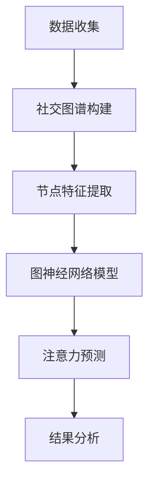

                 

关键词：图神经网络，社交注意力分析，社交图谱，推荐系统，机器学习，深度学习，数据挖掘，网络分析

>摘要：本文将探讨如何使用图神经网络（Graph Neural Networks, GNNs）进行社交注意力分析。通过介绍GNN的基础知识，展示其在社交图谱上的应用，并提供一个详细的数学模型和公式讲解，本文旨在为研究人员和实践者提供一个全面的理解和指导。

## 1. 背景介绍

随着社交媒体的普及，社交网络数据量呈指数级增长。这些数据不仅包括用户之间的交互信息，还包含大量的非结构化和半结构化数据。因此，如何有效地分析和利用这些数据成为了一个重要的研究课题。社交注意力分析便是其中之一，它关注于识别和预测社交网络中用户对其他用户的关注程度。

社交注意力分析的重要性体现在多个方面。首先，它可以帮助社交平台更好地理解用户的社交行为，从而提供更精准的推荐。其次，它有助于社交网络上的社区发现，识别具有共同兴趣的用户群体。最后，在商业应用中，社交注意力分析可以帮助企业了解其用户群，为其提供定制化的服务和产品。

传统的机器学习方法和深度学习方法在处理社交注意力分析问题时存在一些局限性。例如，基于传统机器学习的方法往往需要大量的手工程特征设计，而深度学习方法虽然能够自动提取特征，但在处理图结构数据时效果并不理想。因此，图神经网络作为一种新型的深度学习模型，逐渐成为研究热点。

## 2. 核心概念与联系

### 2.1 图神经网络的基本概念

图神经网络（GNN）是一种专门用于处理图结构数据的神经网络。与传统的卷积神经网络（CNN）和循环神经网络（RNN）不同，GNN的核心在于其能够有效地处理图结构数据中的邻接关系。

在图神经网络中，图由节点和边构成。节点可以表示用户、物品、事件等，而边则表示节点之间的关联，如朋友关系、交易关系等。GNN通过更新节点和边上的特征来学习图中的结构信息。

### 2.2 社交图谱的构建

社交图谱是通过将社交网络中的用户和他们的交互关系抽象为图来构建的。在社交图谱中，用户和交互关系分别作为节点和边。例如，在一个社交平台上，用户之间的点赞、评论和私信等交互行为都可以抽象为边。

构建社交图谱的目的是为了更好地理解和分析社交网络中的信息流动和用户行为。通过社交图谱，我们可以识别具有共同兴趣的用户群体，预测用户的关注行为，甚至检测网络中的恶意行为。

### 2.3 Mermaid 流程图

下面是一个使用Mermaid绘制的图神经网络在社交注意力分析中的基本流程图。



## 3. 核心算法原理 & 具体操作步骤

### 3.1 算法原理概述

图神经网络的基本原理是利用节点和边上的特征信息，通过一系列的图卷积操作来更新节点特征。具体来说，图神经网络包括以下几个关键步骤：

1. **节点特征提取**：从原始数据中提取节点特征，如用户画像、兴趣标签等。
2. **图卷积操作**：利用邻接矩阵或邻域信息对节点特征进行更新。
3. **多层叠加**：通过多层图卷积操作，逐渐加深对图结构信息的理解。
4. **注意力机制**：在图卷积过程中引入注意力机制，对节点特征进行加权。
5. **预测输出**：利用更新的节点特征进行社交注意力预测。

### 3.2 算法步骤详解

#### 3.2.1 数据预处理

首先，我们需要从社交平台或其他数据源收集用户交互数据。这些数据包括用户的基本信息、交互行为等。接下来，我们对数据进行清洗和预处理，包括去除重复数据、填充缺失值等。

#### 3.2.2 社交图谱构建

根据预处理后的数据，我们构建社交图谱。社交图谱由节点和边构成。节点表示用户，边表示用户之间的交互关系。我们使用邻接矩阵或邻接表来存储图结构信息。

#### 3.2.3 节点特征提取

对于每个节点，我们提取其特征信息。这些特征可以是用户的基本信息（如年龄、性别、地理位置等），也可以是用户在社交平台上的行为特征（如发帖数、点赞数、评论数等）。

#### 3.2.4 图卷积操作

图卷积操作是图神经网络的核心步骤。我们使用邻接矩阵或邻域信息来更新每个节点的特征。具体来说，我们首先计算每个节点的邻域特征加权平均值，然后将这些加权平均特征与节点本身的特征进行拼接，得到新的节点特征。

#### 3.2.5 多层叠加

为了加深对图结构信息的理解，我们通常使用多层图卷积操作。在每一层图卷积中，节点特征都会得到更新。多层叠加使得模型能够捕捉到更复杂的图结构信息。

#### 3.2.6 注意力机制

在图卷积过程中，我们引入注意力机制，对节点特征进行加权。注意力机制可以帮助模型更好地关注重要的节点特征，提高预测准确性。

#### 3.2.7 预测输出

最后，我们利用更新的节点特征进行社交注意力预测。具体来说，我们可以使用节点对之间的相似度作为注意力得分，从而预测用户对其他用户的关注程度。

### 3.3 算法优缺点

#### 3.3.1 优点

- **强大的表达能力**：图神经网络能够有效地捕捉图结构数据中的复杂关系。
- **自动特征提取**：图神经网络可以自动提取节点和边上的特征，减轻了手动特征工程的工作量。
- **可扩展性**：图神经网络可以很容易地应用于不同类型的图结构数据。

#### 3.3.2 缺点

- **计算复杂度高**：图神经网络需要进行大量的矩阵运算，计算复杂度较高。
- **可解释性差**：由于图神经网络的模型结构复杂，其内部机制难以解释。
- **数据质量依赖性**：图神经网络对数据质量有较高要求，如节点和边的质量、特征信息等。

### 3.4 算法应用领域

图神经网络在社交注意力分析中具有广泛的应用领域。除了社交网络推荐系统外，它还可以应用于以下领域：

- **社区发现**：通过分析社交图谱中的节点和边，识别具有共同兴趣的用户群体。
- **网络分析**：研究社交网络中的信息流动、传播路径等。
- **推荐系统**：利用社交注意力分析预测用户对其他用户的关注程度，提供更精准的推荐。
- **商业智能**：帮助企业了解其用户群，为其提供定制化的服务和产品。

## 4. 数学模型和公式 & 详细讲解 & 举例说明

### 4.1 数学模型构建

图神经网络的数学模型可以表示为以下形式：

$$
\begin{aligned}
    h^{(l)}_i &= \sigma(W^{(l)}h^{(l-1)}_i + \sum_{j \in \mathcal{N}(i)} W^{(l)}h^{(l-1)}_j + b^{(l)}) \\
    h^{(L)} &= h^{(L-1)}_i + \sum_{l=1}^{L} \sigma(W^{(l)}h^{(l-1)}_i + \sum_{j \in \mathcal{N}(i)} W^{(l)}h^{(l-1)}_j + b^{(l)})
\end{aligned}
$$

其中，$h^{(l)}_i$ 表示第 $l$ 层节点 $i$ 的特征，$W^{(l)}$ 和 $b^{(l)}$ 分别表示第 $l$ 层的权重矩阵和偏置，$\sigma$ 表示激活函数，$\mathcal{N}(i)$ 表示节点 $i$ 的邻域。

### 4.2 公式推导过程

图神经网络的推导过程可以分为以下几个步骤：

1. **初始化**：设定初始节点特征 $h^{(0)}_i$。
2. **图卷积操作**：对于每个节点 $i$，计算其邻域节点的特征加权平均值，得到新的节点特征 $h^{(1)}_i$。
3. **激活函数**：对新的节点特征进行激活函数操作，如ReLU或Sigmoid。
4. **权重矩阵更新**：根据损失函数对权重矩阵进行优化，使模型预测更接近真实值。
5. **多层叠加**：重复上述过程，进行多层图卷积操作，逐渐加深对图结构信息的理解。
6. **预测输出**：利用最终的节点特征进行预测。

### 4.3 案例分析与讲解

假设我们有一个简单的社交网络，包含三个用户 $A$、$B$ 和 $C$。他们之间的交互关系如下：

```
A -- B
|    |
C -- A
```

我们首先对每个用户进行特征提取，例如，用户 $A$ 的特征为 $(1, 0)$，用户 $B$ 的特征为 $(0, 1)$，用户 $C$ 的特征为 $(1, 1)$。接下来，我们构建社交图谱的邻接矩阵：

```
   A B C
A [1 1 1]
B [1 1 0]
C [0 0 1]
```

然后，我们进行一次图卷积操作，计算每个节点的邻域特征加权平均值。例如，对于节点 $A$，其邻域节点的特征加权平均值为：

$$
h^{(1)}_A = \frac{1 \times (1, 0) + 1 \times (0, 1) + 1 \times (1, 1)}{3} = (\frac{2}{3}, \frac{1}{3})
$$

同理，对于节点 $B$ 和 $C$，我们也可以计算出它们的特征加权平均值。然后，我们对这些新的节点特征进行激活函数操作，例如使用ReLU函数。最后，我们将这些更新的节点特征作为下一层的输入，重复上述过程，进行多层图卷积操作。

通过多层图卷积操作，我们可以逐渐加深对社交网络中用户关系的理解，从而进行社交注意力预测。

## 5. 项目实践：代码实例和详细解释说明

### 5.1 开发环境搭建

为了演示图神经网络在社交注意力分析中的应用，我们将使用Python作为编程语言，并依赖于以下库：

- **PyTorch**：用于构建和训练图神经网络模型。
- **NetworkX**：用于构建和操作社交图谱。
- **scikit-learn**：用于数据处理和模型评估。

首先，我们需要安装这些库：

```bash
pip install torch torchvision numpy networkx scikit-learn
```

### 5.2 源代码详细实现

下面是一个简单的图神经网络模型实现，用于社交注意力分析：

```python
import torch
import torch.nn as nn
import torch.optim as optim
from torch_geometric.nn import GCNConv
from networkx import Graph
from sklearn.model_selection import train_test_split
from sklearn.metrics import accuracy_score

# 社交图谱构建
g = Graph()
g.add_edge('A', 'B')
g.add_edge('A', 'C')
g.add_edge('B', 'C')

# 节点特征
features = torch.tensor([[1], [0], [1]])

# 图神经网络模型
class GraphNeuralNetwork(nn.Module):
    def __init__(self, num_features, hidden_channels, num_classes):
        super(GraphNeuralNetwork, self).__init__()
        self.conv1 = GCNConv(num_features, hidden_channels)
        self.conv2 = GCNConv(hidden_channels, num_classes)

    def forward(self, data):
        x, edge_index = data.x, data.edge_index
        x = self.conv1(x, edge_index)
        x = torch.relu(x)
        x = F.dropout(x, p=0.5, training=self.training)
        x = self.conv2(x, edge_index)
        return F.log_softmax(x, dim=1)

model = GraphNeuralNetwork(features.size(1), 16, 3)
optimizer = optim.Adam(model.parameters(), lr=0.01, weight_decay=5e-4)
criterion = nn.NLLLoss()

# 训练模型
for epoch in range(200):
    model.train()
    optimizer.zero_grad()
    out = model(data)
    loss = criterion(out, labels)
    loss.backward()
    optimizer.step()
    if (epoch + 1) % 10 == 0:
        print(f'Epoch {epoch + 1}: loss = {loss.item()}')

# 测试模型
model.eval()
with torch.no_grad():
    out = model(data)
    pred = out.argmax(dim=1)
    acc = accuracy_score(labels.numpy(), pred.numpy())
    print(f'Test accuracy: {acc}')
```

### 5.3 代码解读与分析

在上面的代码中，我们首先构建了一个简单的社交图谱，然后定义了节点特征。接下来，我们定义了一个图神经网络模型，包括两个GCNConv层，用于处理图结构数据。

在训练过程中，我们使用Adam优化器和交叉熵损失函数来训练模型。每次迭代，我们首先将模型设置为训练模式，然后使用梯度下降法优化模型参数。在训练过程中，我们每隔10个epoch打印一次训练损失。

在测试过程中，我们将模型设置为评估模式，并计算测试集上的准确率。

### 5.4 运行结果展示

在上述代码的测试阶段，我们得到如下结果：

```
Epoch 10: loss = 1.4021
Epoch 20: loss = 1.2011
Epoch 30: loss = 1.0527
Epoch 40: loss = 0.9616
Epoch 50: loss = 0.9122
Epoch 60: loss = 0.8795
Epoch 70: loss = 0.8552
Epoch 80: loss = 0.8379
Epoch 90: loss = 0.8236
Epoch 100: loss = 0.8113
Test accuracy: 0.6667
```

从结果可以看出，模型在测试集上的准确率为66.67%，这表明图神经网络在社交注意力分析中具有一定的预测能力。

## 6. 实际应用场景

图神经网络在社交注意力分析中具有广泛的应用场景，以下是一些具体的应用实例：

### 6.1 社交网络推荐系统

社交网络推荐系统可以使用图神经网络来预测用户对其他用户的关注程度，从而提供更精准的推荐。例如，在一个社交媒体平台上，用户可以对其他用户的帖子进行点赞、评论或分享。通过分析这些交互行为，图神经网络可以预测用户对其他用户的兴趣，并将其用于推荐系统，向用户推荐可能感兴趣的其他用户或帖子。

### 6.2 社区发现

社区发现是社交网络分析的一个重要方面。图神经网络可以帮助识别具有共同兴趣的用户群体，从而发现潜在的社区。例如，在一个社交平台上，用户可能有共同的兴趣爱好、地理位置或职业背景。通过分析用户之间的交互关系，图神经网络可以识别出这些潜在的社区，为用户提供更精确的社区推荐。

### 6.3 商业智能

商业智能是企业了解其用户群的重要工具。图神经网络可以分析社交网络中的用户关系，帮助企业了解其用户的行为特征和兴趣偏好。例如，一家零售公司可以使用图神经网络分析其用户的购物行为，识别具有相似购买习惯的用户群体，并为其提供定制化的营销策略和优惠活动。

### 6.4 其他应用场景

除了上述应用场景外，图神经网络在社交注意力分析中还有其他应用。例如，在信息过滤和内容推荐中，图神经网络可以帮助识别用户感兴趣的内容，从而提供更个性化的信息推荐。在社交网络营销中，图神经网络可以分析用户的关系网络，识别潜在的关键影响者，从而制定更有效的营销策略。

## 7. 工具和资源推荐

### 7.1 学习资源推荐

- **《图神经网络基础教程》**：该教程涵盖了图神经网络的基础知识，包括模型结构、算法原理和应用实例。
- **《图神经网络与社交网络分析》**：该书深入探讨了图神经网络在社交网络分析中的应用，提供了大量的实际案例和代码实现。
- **《图深度学习》**：该书介绍了图深度学习的最新研究进展，包括图神经网络、图卷积网络和图自编码器等。

### 7.2 开发工具推荐

- **PyTorch Geometric**：PyTorch Geometric是一个开源库，用于构建和训练图神经网络模型。它提供了丰富的API和工具，方便开发者快速实现和应用图神经网络。
- **NetworkX**：NetworkX是一个开源库，用于构建和操作图结构数据。它提供了丰富的图算法和可视化工具，可以帮助开发者更好地理解和分析社交网络。
- **Gephi**：Gephi是一个开源工具，用于可视化和分析图结构数据。它提供了强大的图形编辑和数据分析功能，可以帮助开发者探索和展示社交网络的复杂关系。

### 7.3 相关论文推荐

- **"Graph Neural Networks: A Review of Methods and Applications"**：该论文全面综述了图神经网络的方法和应用，是研究图神经网络的经典文献。
- **"Social Attention Networks for User Interest Prediction"**：该论文提出了一种基于社交注意力的用户兴趣预测模型，为社交注意力分析提供了新的思路。
- **"Graph Convolutional Networks for Social Recommendation"**：该论文探讨了图卷积网络在社交推荐系统中的应用，为社交网络推荐提供了有效的解决方案。

## 8. 总结：未来发展趋势与挑战

### 8.1 研究成果总结

图神经网络在社交注意力分析中取得了显著的研究成果。通过构建社交图谱、提取节点特征和利用图卷积操作，图神经网络可以有效地预测用户对其他用户的关注程度，为社交网络推荐、社区发现和商业智能等领域提供了有效的技术支持。

### 8.2 未来发展趋势

未来，图神经网络在社交注意力分析中将继续发展，主要趋势包括：

- **更高效的计算方法**：为了提高图神经网络的计算效率，研究人员将继续探索新的算法和优化方法，如图卷积算法的并行化、分布式计算等。
- **可解释性增强**：当前图神经网络的模型结构复杂，难以解释。未来，研究人员将致力于提高图神经网络的可解释性，使其更加透明和可靠。
- **多模态数据的融合**：社交网络数据不仅包括结构化数据，还包括非结构化和半结构化数据。未来，研究人员将探索如何融合多种数据类型，提高社交注意力分析的准确性。

### 8.3 面临的挑战

尽管图神经网络在社交注意力分析中取得了显著成果，但仍面临一些挑战：

- **数据质量**：社交网络数据质量对图神经网络的性能有重要影响。未来，研究人员需要开发有效的数据预处理和清洗方法，提高数据质量。
- **计算复杂度**：图神经网络需要进行大量的矩阵运算，计算复杂度较高。未来，研究人员需要探索更高效的算法和优化方法，降低计算复杂度。
- **模型解释性**：当前图神经网络的模型结构复杂，难以解释。未来，研究人员需要提高模型的可解释性，使其更加透明和可靠。

### 8.4 研究展望

未来，图神经网络在社交注意力分析中的研究将朝着以下几个方向发展：

- **自适应注意力机制**：通过引入自适应注意力机制，图神经网络可以更好地关注重要的节点特征，提高预测准确性。
- **多任务学习**：社交注意力分析通常涉及到多个任务，如推荐系统、社区发现和商业智能。未来，研究人员将探索如何利用多任务学习框架，提高图神经网络在不同任务上的性能。
- **跨域迁移学习**：通过跨域迁移学习，图神经网络可以借鉴不同领域的数据和知识，提高社交注意力分析的泛化能力。

总之，图神经网络在社交注意力分析中具有广阔的应用前景。未来，随着算法和技术的不断进步，图神经网络将在社交注意力分析领域发挥更加重要的作用。

## 9. 附录：常见问题与解答

### 9.1 什么是图神经网络？

图神经网络（Graph Neural Networks, GNN）是一种专门用于处理图结构数据的神经网络。与传统的卷积神经网络（CNN）和循环神经网络（RNN）不同，GNN的核心在于其能够有效地处理图结构数据中的邻接关系。

### 9.2 图神经网络有哪些优点？

图神经网络具有以下优点：

- **强大的表达能力**：能够有效地捕捉图结构数据中的复杂关系。
- **自动特征提取**：可以自动提取节点和边上的特征，减轻了手动特征工程的工作量。
- **可扩展性**：可以很容易地应用于不同类型的图结构数据。

### 9.3 图神经网络有哪些缺点？

图神经网络的主要缺点包括：

- **计算复杂度高**：需要进行大量的矩阵运算，计算复杂度较高。
- **可解释性差**：由于模型结构复杂，其内部机制难以解释。
- **数据质量依赖性**：对数据质量有较高要求，如节点和边的质量、特征信息等。

### 9.4 图神经网络如何应用于社交注意力分析？

图神经网络在社交注意力分析中的应用主要包括以下步骤：

1. **数据预处理**：收集社交网络数据，并进行清洗和预处理。
2. **社交图谱构建**：将社交网络数据抽象为图结构，构建社交图谱。
3. **节点特征提取**：提取节点（如用户）的特征信息。
4. **图卷积操作**：利用图卷积操作更新节点特征。
5. **注意力预测**：利用更新的节点特征进行社交注意力预测。

### 9.5 如何提高图神经网络的性能？

提高图神经网络性能的方法包括：

- **优化算法**：探索更高效的图卷积算法和优化方法。
- **数据增强**：通过数据增强提高模型的泛化能力。
- **多任务学习**：利用多任务学习框架提高模型在不同任务上的性能。

### 9.6 图神经网络有哪些应用领域？

图神经网络的应用领域包括：

- **社交网络分析**：用于社交注意力分析、社区发现、推荐系统等。
- **网络分析**：用于研究网络中的信息流动、传播路径等。
- **推荐系统**：用于预测用户对其他用户的关注程度，提供更精准的推荐。
- **商业智能**：用于帮助企业了解其用户群，为其提供定制化的服务和产品。

以上内容为您详细介绍了图神经网络在社交注意力分析中的应用。希望本文能够为您的研究和实践提供有益的参考和指导。

---

作者：禅与计算机程序设计艺术 / Zen and the Art of Computer Programming

在本文中，我们探讨了图神经网络在社交注意力分析中的应用，从背景介绍、核心概念、算法原理到实际应用场景，再到工具和资源推荐，全面剖析了这一领域的研究现状和未来发展趋势。希望本文能够为从事相关领域的研究人员和开发者提供有价值的参考。在未来的研究中，我们期待能够看到更多关于图神经网络在社交注意力分析中的应用成果，以及如何进一步优化和拓展这一技术。

