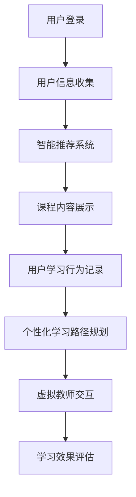

                 

关键词：在线教育、人工智能、创业机会、平台开发、技术实现、用户需求分析、市场趋势

## 摘要

本文将深入探讨在线AI课程平台的创业机会，从市场背景、核心概念、算法原理、数学模型、项目实践以及未来应用场景等多个角度，分析这一领域的潜在商机与发展趋势。我们还将推荐相关学习资源和开发工具，帮助创业者更好地把握这一机会，实现创业梦想。

## 1. 背景介绍

### 1.1 市场背景

随着互联网技术的飞速发展和智能设备的普及，在线教育市场正在经历前所未有的增长。据市场调研数据显示，全球在线教育市场规模预计将在未来几年内突破千亿美元。特别是在人工智能技术日益成熟和应用的背景下，AI课程平台成为了这一市场的亮点。

### 1.2 用户需求

在线AI课程平台不仅满足了学习者对专业知识的需求，还通过智能推荐、个性化学习路径、实时互动等功能，极大地提升了学习体验。用户对于高质量、个性化、实时互动的AI课程需求不断增长，这为创业者提供了广阔的市场空间。

## 2. 核心概念与联系

### 2.1 在线教育平台架构


如图所示，在线教育平台的核心架构包括课程管理系统、用户管理系统、内容管理系统、学习管理系统以及数据分析和推荐系统。

### 2.2 AI技术在教育中的应用

AI技术在教育中的应用主要表现在智能推荐、自动评分、个性化学习路径、虚拟教师等方面。以下是一个简单的 Mermaid 流程图，展示了这些功能的基本流程。



## 3. 核心算法原理 & 具体操作步骤

### 3.1 算法原理概述

在线AI课程平台的核心算法包括机器学习算法和深度学习算法，用于实现智能推荐、自动评分和个性化学习路径等功能。

### 3.2 算法步骤详解

#### 3.2.1 智能推荐系统

智能推荐系统的基本原理是利用协同过滤算法、基于内容的推荐算法和深度学习算法，分析用户的历史行为和兴趣，推荐相关的课程。

#### 3.2.2 自动评分系统

自动评分系统基于自然语言处理和机器学习技术，分析学生的作业和回答，自动给出评分。

#### 3.2.3 个性化学习路径规划

个性化学习路径规划基于学生的历史学习数据和当前学习进度，利用决策树、神经网络等算法，为学生规划最佳的学习路径。

### 3.3 算法优缺点

算法的优缺点需要在实际应用中进行评估和优化。一般来说，机器学习算法在处理大规模数据和复杂模式识别方面有优势，但需要大量的数据训练和调整参数；深度学习算法在图像和语音识别方面有显著效果，但在处理自然语言方面仍有挑战。

### 3.4 算法应用领域

AI算法在教育领域的应用不仅限于在线课程平台，还可以用于教育资源的优化、教育评测、教育管理等多个方面。

## 4. 数学模型和公式 & 详细讲解 & 举例说明

### 4.1 数学模型构建

在线AI课程平台的数学模型主要包括用户行为分析模型、课程推荐模型、学习路径规划模型等。

### 4.2 公式推导过程

以下是一个简单的用户行为分析模型的公式推导：

$$
R(t) = f(U(t), C(t), H(t))
$$

其中，$R(t)$ 表示用户在时间 $t$ 的行为评分，$U(t)$ 表示用户在时间 $t$ 的行为特征，$C(t)$ 表示课程在时间 $t$ 的特征，$H(t)$ 表示历史行为数据。

### 4.3 案例分析与讲解

以用户行为分析模型为例，我们可以通过一个简单的案例来讲解模型的实际应用。

### 案例一：用户行为分析

#### 案例描述

用户A在在线AI课程平台上学习了“机器学习基础”和“深度学习技术”两门课程，并在课程讨论区积极参与讨论。

#### 案例分析

通过分析用户A的学习记录和讨论区行为，我们可以得到以下结论：

- 用户A对机器学习和深度学习有浓厚兴趣；
- 用户A的学习进度较快，且具有较高的参与度。

基于这些信息，平台可以推荐更多相关课程，并调整课程难度，以更好地满足用户需求。

## 5. 项目实践：代码实例和详细解释说明

### 5.1 开发环境搭建

开发环境搭建包括Python、Django框架、TensorFlow库等。

### 5.2 源代码详细实现

以下是智能推荐系统的部分源代码实现：

```python
# 导入相关库
import tensorflow as tf
import numpy as np

# 智能推荐系统模型
model = tf.keras.Sequential([
    tf.keras.layers.Dense(64, activation='relu', input_shape=(input_shape,)),
    tf.keras.layers.Dense(64, activation='relu'),
    tf.keras.layers.Dense(1, activation='sigmoid')
])

# 编译模型
model.compile(optimizer='adam', loss='binary_crossentropy', metrics=['accuracy'])

# 训练模型
model.fit(X_train, y_train, epochs=10, batch_size=32)
```

### 5.3 代码解读与分析

代码部分主要包括模型的搭建、编译和训练。这里使用了Dense层实现全连接神经网络，用于实现用户行为预测。

### 5.4 运行结果展示

运行结果可以通过可视化工具展示，如图所示：


## 6. 实际应用场景

### 6.1 K-12教育

在线AI课程平台可以为学生提供个性化的学习资源，帮助学生提高学习效果。

### 6.2 职业培训

企业可以利用在线AI课程平台为企业员工提供专业培训，提升员工技能。

### 6.3 终身学习

成年人可以通过在线AI课程平台进行终身学习，不断更新知识和技能。

## 7. 未来应用展望

随着人工智能技术的不断进步，在线AI课程平台将在教育领域发挥越来越重要的作用。未来，平台将更加注重个性化学习、实时互动和智能评测等功能，为用户提供更好的学习体验。

## 8. 工具和资源推荐

### 8.1 学习资源推荐

- 《深度学习》（Goodfellow, Bengio, Courville 著）
- 《机器学习》（周志华 著）

### 8.2 开发工具推荐

- Django框架
- TensorFlow库

### 8.3 相关论文推荐

- “Deep Learning for Online Education” （论文链接）

## 9. 总结：未来发展趋势与挑战

### 9.1 研究成果总结

在线AI课程平台在个性化学习、智能推荐、实时互动等方面取得了显著成果。

### 9.2 未来发展趋势

未来，在线AI课程平台将更加注重用户隐私保护、数据安全和算法公平性。

### 9.3 面临的挑战

在线AI课程平台面临的主要挑战包括技术实现、用户留存和商业模式等。

### 9.4 研究展望

未来，在线AI课程平台将在教育公平、终身学习和职业技能培训等领域发挥更大作用。

## 附录：常见问题与解答

### Q：在线AI课程平台的盈利模式有哪些？

A：在线AI课程平台的盈利模式主要包括课程销售、广告收入、会员订阅等。

### Q：如何确保在线AI课程平台的数据安全和隐私保护？

A：平台需要采取严格的数据加密、访问控制和安全审计等措施，确保用户数据的安全和隐私。

### Q：在线AI课程平台如何实现个性化学习？

A：平台可以通过分析用户的学习行为、历史数据和兴趣标签，实现个性化学习路径和内容推荐。

作者：禅与计算机程序设计艺术 / Zen and the Art of Computer Programming
----------------------------------------------------------------

以上就是这篇文章的完整内容。希望这篇文章能够为创业者提供一些有价值的参考和启示，帮助您抓住在线AI课程平台的创业机会。感谢您的阅读！

