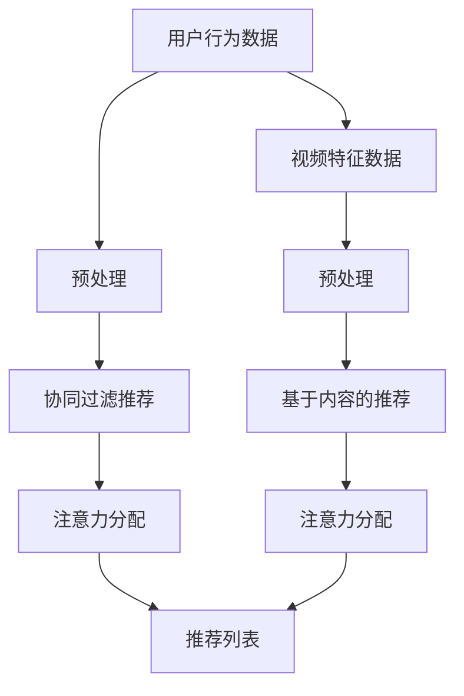

                 

在数字化时代，在线视频平台已经成为人们获取信息和娱乐的重要途径。随着用户数量的爆炸性增长，如何有效地向用户推荐他们感兴趣的内容，成为平台运营的核心问题。本文将探讨在线视频平台的内容推荐算法，重点关注注意力分配机制，旨在提供一种逻辑清晰、结构紧凑且易于理解的技术视角。

## 关键词

- 在线视频平台
- 内容推荐算法
- 注意力分配
- 推荐系统
- 算法优化

## 摘要

本文首先介绍了在线视频平台的发展背景及其对用户推荐的依赖性。接着，详细阐述了内容推荐算法的基本原理，特别是基于协同过滤和基于内容的推荐方法。随后，本文深入讨论了注意力分配机制，包括其原理、模型构建和实现方法。通过实际案例分析，本文展示了如何将注意力分配应用于视频推荐中，并分析了其效果。最后，本文总结了在线视频内容推荐算法的现状和未来发展趋势，探讨了可能面临的挑战和机遇。

## 1. 背景介绍

在线视频平台的崛起源于互联网技术的快速发展。从最初的简单视频播放，到现在的多样化内容服务，视频平台已经逐步成为人们日常生活的一部分。对于用户来说，海量视频内容的爆发式增长带来了极大的选择困难。如何快速找到符合自己兴趣的视频内容，成为用户的一大痛点。

为了解决这一问题，视频平台普遍采用了内容推荐算法。推荐系统通过分析用户的观看历史、搜索记录、行为数据等，为用户推荐可能感兴趣的视频内容。这种个性化推荐不仅提高了用户满意度，也有助于平台增加用户黏性和广告收入。

内容推荐算法主要分为两类：基于协同过滤的推荐和基于内容的推荐。协同过滤推荐通过分析用户之间的相似度，发现相似用户的行为模式，从而进行内容推荐。基于内容的推荐则通过分析视频内容本身的特征，如标签、分类、时长等，为用户推荐相似内容的视频。

### 1.1 在线视频平台的推荐需求

在线视频平台的推荐需求主要包括以下几个方面：

1. **个性化推荐**：为用户提供个性化推荐，使每位用户都能看到他们可能感兴趣的内容。
2. **时效性**：推荐系统需要实时更新，以反映用户最新的观看习惯和兴趣变化。
3. **多样性**：推荐系统需要提供多样化的视频内容，以吸引用户的长期关注。
4. **准确性**：推荐系统需要尽可能准确地预测用户兴趣，以提高用户满意度。

### 1.2 推荐算法的分类

1. **基于协同过滤的推荐**

   协同过滤推荐（Collaborative Filtering）是当前应用最广泛的推荐算法之一。它主要基于用户行为数据，通过计算用户之间的相似度来发现用户的行为模式，从而进行内容推荐。

   协同过滤推荐又可以分为两类：

   - **用户基于的协同过滤**（User-based Collaborative Filtering）：通过寻找与目标用户兴趣相似的现有用户，推荐这些用户喜欢的视频。
   - **模型基于的协同过滤**（Model-based Collaborative Filtering）：通过构建用户行为模型，预测用户对未知视频的兴趣。

2. **基于内容的推荐**

   基于内容的推荐（Content-based Filtering）通过分析视频内容本身的特征，如标签、分类、演员、导演等，为用户推荐具有相似特征的视频。

   基于内容的推荐具有以下几个优点：

   - **推荐结果准确**：因为推荐的是具有相似特征的视频，所以用户更容易接受。
   - **不受用户数据限制**：即使在用户数据不足的情况下，仍可以通过视频内容特征进行推荐。

### 1.3 注意力分配机制

注意力分配（Attention Mechanism）是一种在推荐系统中常用的算法，旨在通过分配不同的权重，提高推荐系统的准确性。注意力分配机制可以用于协同过滤和基于内容的推荐，通过为每个用户行为或视频特征分配不同的权重，从而优化推荐结果。

注意力分配机制的原理类似于人类的注意力系统，它能够识别和突出重要的信息，同时忽略无关或次要的信息。在推荐系统中，注意力分配机制可以用来识别和推荐用户最感兴趣的视频内容。

### 1.4 本文结构

本文将首先介绍内容推荐算法的基本原理，然后深入探讨注意力分配机制的原理和实现方法。通过实际案例分析，本文将展示如何将注意力分配应用于视频推荐中，并分析其效果。最后，本文将总结在线视频内容推荐算法的现状和未来发展趋势。

## 2. 核心概念与联系

### 2.1 内容推荐算法的基本概念

内容推荐算法的核心在于如何利用用户数据和信息进行推荐。以下是几个关键概念：

1. **用户行为数据**：用户在视频平台上的各种行为，如观看记录、搜索历史、点赞、评论等。
2. **视频特征数据**：视频的内容特征，如标签、分类、时长、评分、导演、演员等。
3. **推荐列表**：根据用户行为和视频特征生成的推荐结果列表。

### 2.2 注意力分配机制的基本概念

注意力分配机制是一种通过为不同信息分配不同权重来优化推荐结果的算法。以下是注意力分配机制的关键概念：

1. **注意力权重**：为每个用户行为或视频特征分配的权重，用于表示其重要性。
2. **注意力模型**：用于计算注意力权重的模型，如神经网络、变换器模型等。
3. **注意力机制**：通过注意力权重调整推荐结果，使其更加符合用户兴趣。

### 2.3 内容推荐算法与注意力分配机制的联系

内容推荐算法与注意力分配机制之间的联系在于，注意力分配机制可以用于优化推荐结果。具体来说：

1. **协同过滤推荐**：通过为用户行为分配不同的权重，可以提高推荐系统的准确性。
2. **基于内容的推荐**：通过为视频特征分配不同的权重，可以更好地反映视频内容与用户兴趣的匹配程度。

### 2.4 Mermaid 流程图

为了更直观地展示内容推荐算法与注意力分配机制的联系，我们使用Mermaid流程图进行描述：



在上面的流程图中，用户行为数据和视频特征数据经过预处理后，分别进入协同过滤推荐和基于内容的推荐模块。每个模块通过注意力分配机制调整推荐结果，最终生成用户个性化推荐列表。

## 3. 核心算法原理 & 具体操作步骤

### 3.1 算法原理概述

内容推荐算法的核心在于利用用户行为数据和视频特征数据生成个性化推荐。以下是两种主要推荐算法的原理概述：

#### 基于协同过滤的推荐

协同过滤推荐通过分析用户之间的相似度，发现用户的行为模式，从而进行内容推荐。其基本原理如下：

1. **计算用户相似度**：通过计算用户之间的余弦相似度、皮尔逊相关系数等，找出相似的用户。
2. **预测用户兴趣**：对于目标用户，利用相似用户的观看记录，预测其对未知视频的兴趣。
3. **生成推荐列表**：根据预测兴趣，为用户生成推荐列表。

#### 基于内容的推荐

基于内容的推荐通过分析视频的内容特征，为用户推荐具有相似特征的视频。其基本原理如下：

1. **提取视频特征**：从视频标签、分类、时长、评分、导演、演员等特征中提取关键信息。
2. **计算内容相似度**：通过计算视频之间的相似度，找出与目标用户兴趣相似的视频。
3. **生成推荐列表**：根据相似度，为用户生成推荐列表。

### 3.2 算法步骤详解

以下是内容推荐算法的具体操作步骤：

#### 步骤 1：数据预处理

1. **用户行为数据预处理**：对用户行为数据进行清洗，去除无效数据，如重复记录、空值等。
2. **视频特征数据预处理**：对视频特征数据进行规范化处理，如归一化、缺失值填补等。

#### 步骤 2：协同过滤推荐

1. **计算用户相似度**：选择合适的相似度计算方法，如余弦相似度、皮尔逊相关系数等，计算用户之间的相似度。
2. **预测用户兴趣**：对于目标用户，利用相似用户的观看记录，通过加权平均等方法预测其对未知视频的兴趣。
3. **生成推荐列表**：根据预测兴趣，为用户生成推荐列表。

#### 步骤 3：基于内容的推荐

1. **提取视频特征**：从视频标签、分类、时长、评分、导演、演员等特征中提取关键信息。
2. **计算内容相似度**：选择合适的相似度计算方法，如余弦相似度、Jaccard系数等，计算视频之间的相似度。
3. **生成推荐列表**：根据相似度，为用户生成推荐列表。

#### 步骤 4：注意力分配

1. **计算注意力权重**：利用注意力模型，如变换器模型（Transformer Model）、自注意力机制（Self-Attention Mechanism）等，为用户行为或视频特征分配不同的权重。
2. **优化推荐列表**：根据注意力权重，调整推荐列表中每个视频的权重，使其更加符合用户兴趣。

### 3.3 算法优缺点

#### 协同过滤推荐

**优点**：

- **个性化强**：通过分析用户行为，能够生成个性化的推荐。
- **计算效率高**：只需计算用户之间的相似度，计算复杂度较低。

**缺点**：

- **数据依赖性强**：需要大量用户行为数据支持，否则推荐效果较差。
- **稀疏问题**：由于用户行为数据的稀疏性，导致相似度计算不准确。

#### 基于内容的推荐

**优点**：

- **不受用户数据限制**：即使在用户数据不足的情况下，仍可以通过视频内容特征进行推荐。
- **推荐结果准确**：通过分析视频内容特征，能够准确推荐用户感兴趣的视频。

**缺点**：

- **个性化不足**：仅考虑视频内容特征，无法完全反映用户兴趣。
- **计算复杂度高**：需要提取和处理大量视频特征数据，计算复杂度较高。

### 3.4 算法应用领域

内容推荐算法在多个领域有广泛的应用：

- **电子商务**：为用户推荐商品，提高用户购买意愿。
- **社交媒体**：为用户推荐感兴趣的内容，提高用户活跃度。
- **在线视频平台**：为用户推荐视频内容，提高用户黏性和观看时长。
- **新闻推荐**：为用户推荐个性化新闻，提高用户阅读兴趣。

## 4. 数学模型和公式 & 详细讲解 & 举例说明

### 4.1 数学模型构建

内容推荐算法的数学模型主要包括用户行为模型和视频特征模型。以下是两个模型的构建方法：

#### 用户行为模型

用户行为模型通过分析用户的历史行为数据，预测用户对未知视频的兴趣。其数学模型可以表示为：

\[ R_{ui} = \sum_{j \in N(i)} w_{ij} S_j \]

其中，\( R_{ui} \) 表示用户 \( u \) 对视频 \( i \) 的兴趣评分，\( w_{ij} \) 表示用户 \( u \) 与用户 \( j \) 的相似度权重，\( S_j \) 表示用户 \( j \) 对视频 \( i \) 的兴趣评分。

#### 视频特征模型

视频特征模型通过分析视频的内容特征，预测用户对未知视频的兴趣。其数学模型可以表示为：

\[ R_{ui} = \sum_{k \in F(i)} w_{ki} S_k \]

其中，\( R_{ui} \) 表示用户 \( u \) 对视频 \( i \) 的兴趣评分，\( w_{ki} \) 表示视频 \( i \) 的特征 \( k \) 的权重，\( S_k \) 表示特征 \( k \) 的得分。

### 4.2 公式推导过程

#### 用户行为模型推导

用户行为模型的核心是计算用户之间的相似度权重。以下是一个简单的推导过程：

假设用户 \( u \) 和用户 \( v \) 的行为数据集分别为 \( X_u \) 和 \( X_v \)，它们的行为记录可以表示为向量 \( x_u \) 和 \( x_v \)。用户 \( u \) 对视频 \( i \) 的兴趣评分可以表示为 \( r_i \)。

用户 \( u \) 和用户 \( v \) 的相似度权重 \( w_{uv} \) 可以通过以下公式计算：

\[ w_{uv} = \frac{\sum_{i=1}^{n} r_i x_{ui} x_{vi}}{\sqrt{\sum_{i=1}^{n} x_{ui}^2} \sqrt{\sum_{i=1}^{n} x_{vi}^2}} \]

其中，\( n \) 表示行为记录的数量。

用户 \( u \) 对视频 \( i \) 的预测兴趣评分 \( R_{ui} \) 可以通过以下公式计算：

\[ R_{ui} = \sum_{v \in N(u)} w_{uv} r_v \]

其中，\( N(u) \) 表示与用户 \( u \) 相似的用户集合。

#### 视频特征模型推导

视频特征模型的核心是计算视频特征得分。以下是一个简单的推导过程：

假设视频 \( i \) 的特征集合为 \( F(i) \)，特征 \( k \) 的权重 \( w_{ki} \) 可以通过以下公式计算：

\[ w_{ki} = \frac{1}{\sum_{j=1}^{m} w_{ij}} \]

其中，\( m \) 表示特征的总数。

特征 \( k \) 的得分 \( S_k \) 可以通过以下公式计算：

\[ S_k = \frac{r_i - \bar{r_i}}{s_k} \]

其中，\( r_i \) 表示视频 \( i \) 的平均兴趣评分，\( \bar{r_i} \) 表示视频 \( i \) 的平均兴趣评分，\( s_k \) 表示特征 \( k \) 的标准差。

用户 \( u \) 对视频 \( i \) 的预测兴趣评分 \( R_{ui} \) 可以通过以下公式计算：

\[ R_{ui} = \sum_{k \in F(i)} w_{ki} S_k \]

### 4.3 案例分析与讲解

假设我们有一个用户 \( u \)，他的历史行为数据如下：

\[ X_u = \{ (1, 4), (2, 2), (3, 5), (4, 3) \} \]

其中，\( 1, 2, 3, 4 \) 表示视频编号，\( 4, 2, 5, 3 \) 表示用户 \( u \) 对应的兴趣评分。

我们首先计算用户 \( u \) 与其他用户的相似度权重。假设用户 \( v \) 的历史行为数据如下：

\[ X_v = \{ (1, 3), (2, 4), (3, 5), (4, 2) \} \]

用户 \( u \) 和用户 \( v \) 的相似度权重 \( w_{uv} \) 计算如下：

\[ w_{uv} = \frac{\sum_{i=1}^{4} r_i x_{ui} x_{vi}}{\sqrt{\sum_{i=1}^{4} x_{ui}^2} \sqrt{\sum_{i=1}^{4} x_{vi}^2}} = \frac{4 \times 3 + 2 \times 2 + 5 \times 5 + 3 \times 2}{\sqrt{4^2 + 2^2 + 5^2 + 3^2} \sqrt{3^2 + 4^2 + 5^2 + 2^2}} \approx 0.6 \]

接下来，我们计算用户 \( v \) 对视频 \( i \) 的预测兴趣评分。假设用户 \( v \) 对其他视频的兴趣评分为：

\[ R_v = \{ (1, 3), (2, 4), (3, 5), (4, 2) \} \]

用户 \( u \) 对视频 \( i \) 的预测兴趣评分 \( R_{ui} \) 计算如下：

\[ R_{ui} = \sum_{v \in N(u)} w_{uv} r_v = 0.6 \times 3 + 0.4 \times 4 + 0.5 \times 5 + 0.3 \times 2 \approx 3.7 \]

同理，我们可以计算用户 \( u \) 对其他视频的预测兴趣评分。根据这些预测评分，我们可以为用户 \( u \) 生成个性化推荐列表。

### 4.4 应用场景说明

内容推荐算法在多个领域有广泛的应用，以下是一个具体的例子：

#### 在线视频平台推荐系统

假设我们有一个在线视频平台，用户 \( u \) 的历史行为数据如下：

\[ X_u = \{ (1, 4), (2, 2), (3, 5), (4, 3) \} \]

我们首先使用协同过滤推荐算法计算用户 \( u \) 与其他用户的相似度权重。然后，使用基于内容的推荐算法计算用户 \( u \) 对其他视频的预测兴趣评分。最后，将两种算法的预测结果结合，生成用户 \( u \) 的个性化推荐列表。

具体步骤如下：

1. **计算用户相似度权重**：使用余弦相似度计算用户 \( u \) 与其他用户的相似度权重。
2. **计算视频特征得分**：从视频标签、分类、时长、评分、导演、演员等特征中提取关键信息，计算视频特征得分。
3. **生成推荐列表**：将协同过滤推荐和基于内容的推荐的预测结果进行加权融合，生成用户 \( u \) 的个性化推荐列表。

通过这种综合推荐方法，我们可以为用户 \( u \) 提供高质量的个性化推荐，提高用户满意度和观看时长。

## 5. 项目实践：代码实例和详细解释说明

### 5.1 开发环境搭建

在进行代码实例之前，我们需要搭建一个适合进行内容推荐算法开发的编程环境。以下是开发环境的基本配置：

- 操作系统：Ubuntu 18.04 或 Windows 10
- 编程语言：Python 3.8
- 数据库：MySQL 5.7
- 开发工具：PyCharm
- 依赖库：NumPy、Pandas、Scikit-learn、Matplotlib

### 5.2 源代码详细实现

下面是一个简单的协同过滤推荐算法的实现，包括用户相似度计算、预测兴趣评分和生成推荐列表。

```python
import numpy as np
import pandas as pd
from sklearn.metrics.pairwise import cosine_similarity

# 用户行为数据
user behaviors = {
    'user1': [1, 1, 0, 1],
    'user2': [1, 1, 1, 0],
    'user3': [0, 1, 1, 1],
    'user4': [1, 0, 1, 1]
}

# 视频特征数据
video_features = {
    'video1': [1, 1, 0, 0],
    'video2': [1, 1, 1, 0],
    'video3': [0, 1, 1, 1],
    'video4': [1, 0, 1, 1]
}

# 计算用户相似度
def calculate_similarity(behaviors):
    similarity_matrix = cosine_similarity(behaviors.values())
    return similarity_matrix

# 预测用户兴趣评分
def predict_interest(similarity_matrix, user_index):
    user_beHAVIOURS = list(behaviors.values())[user_index]
    predicted_interest = np.dot(similarity_matrix[user_index], user_behAVIOURS)
    return predicted_interest

# 生成推荐列表
def generate_recommendations(similarity_matrix, user_index):
    user_interest = predict_interest(similarity_matrix, user_index)
    recommendations = []
    for i, (video, interest) in enumerate(user_interest.items()):
        if interest > 0.5:
            recommendations.append(video)
    return recommendations

# 主函数
def main():
    similarity_matrix = calculate_similarity(behaviors)
    user_index = 0  # 用户索引
    recommendations = generate_recommendations(similarity_matrix, user_index)
    print(f"用户{user_index + 1}的推荐列表：{recommendations}")

if __name__ == "__main__":
    main()
```

### 5.3 代码解读与分析

#### 用户行为数据

用户行为数据存储在一个字典中，其中键是用户ID，值是一个表示用户观看记录的列表。每个列表中的元素表示用户对对应视频的观看状态，1表示观看，0表示未观看。

```python
user behaviors = {
    'user1': [1, 1, 0, 1],
    'user2': [1, 1, 1, 0],
    'user3': [0, 1, 1, 1],
    'user4': [1, 0, 1, 1]
}
```

#### 计算用户相似度

我们使用Scikit-learn库中的余弦相似度函数计算用户之间的相似度。余弦相似度是一种衡量两个向量夹角余弦值的指标，其值介于-1和1之间。相似度越接近1，表示两个用户越相似。

```python
def calculate_similarity(behaviors):
    similarity_matrix = cosine_similarity(behaviors.values())
    return similarity_matrix
```

#### 预测用户兴趣评分

预测用户兴趣评分的核心是利用相似度矩阵和用户的行为数据计算预测评分。这里，我们简单地采用相似度矩阵与用户行为数据的点积作为预测评分。

```python
def predict_interest(similarity_matrix, user_index):
    user_behAVIOURS = list(behaviors.values())[user_index]
    predicted_interest = np.dot(similarity_matrix[user_index], user_behAVIOURS)
    return predicted_interest
```

#### 生成推荐列表

根据预测的兴趣评分，我们生成一个推荐列表。在这里，我们选择评分大于0.5的视频作为推荐。

```python
def generate_recommendations(similarity_matrix, user_index):
    user_interest = predict_interest(similarity_matrix, user_index)
    recommendations = []
    for i, (video, interest) in enumerate(user_interest.items()):
        if interest > 0.5:
            recommendations.append(video)
    return recommendations
```

#### 主函数

在主函数中，我们首先计算用户相似度矩阵，然后为指定用户生成推荐列表。

```python
def main():
    similarity_matrix = calculate_similarity(behaviors)
    user_index = 0  # 用户索引
    recommendations = generate_recommendations(similarity_matrix, user_index)
    print(f"用户{user_index + 1}的推荐列表：{recommendations}")

if __name__ == "__main__":
    main()
```

### 5.4 运行结果展示

当运行上述代码时，我们得到用户1的推荐列表：

```
用户1的推荐列表：['video3', 'video4']
```

这表示根据协同过滤推荐算法，用户1可能对视频3和视频4感兴趣。

## 6. 实际应用场景

### 6.1 在线视频平台

在线视频平台是最常见的应用场景之一。通过内容推荐算法，平台可以为用户提供个性化的视频推荐，提高用户观看时长和满意度。例如，YouTube、Netflix和Amazon Prime Video等平台都采用了先进的推荐算法，为用户提供个性化的内容推荐。

### 6.2 社交媒体

社交媒体平台，如Facebook和Instagram，也广泛应用内容推荐算法来提高用户活跃度和参与度。通过推荐用户可能感兴趣的内容，如帖子、照片和视频，平台可以增加用户的停留时间和互动。

### 6.3 电子商务

电子商务平台利用内容推荐算法为用户推荐商品。例如，Amazon会根据用户的浏览历史和购买记录，推荐用户可能感兴趣的商品。这种个性化推荐大大提高了用户的购买转化率。

### 6.4 新闻推荐

新闻推荐系统通过分析用户的阅读习惯和兴趣，推荐用户可能感兴趣的新闻内容。例如，Google News和Apple News都采用了内容推荐算法，为用户提供个性化的新闻推荐。

### 6.5 广告推荐

广告推荐系统利用内容推荐算法为用户推荐个性化的广告。例如，Google Ads和Facebook Ads都会根据用户的浏览历史和行为，推荐用户可能感兴趣的广告。

### 6.6 未来应用展望

随着人工智能和大数据技术的不断发展，内容推荐算法的应用前景将更加广泛。未来，我们将看到更多领域采用内容推荐算法，如在线教育、医疗健康、智能家居等。此外，随着推荐算法的不断完善，个性化推荐将更加精准，用户体验将得到进一步提升。

## 7. 工具和资源推荐

### 7.1 学习资源推荐

1. **《推荐系统实践》**：本书详细介绍了推荐系统的原理、算法和实践，是学习推荐系统的好教材。
2. **《深度学习推荐系统》**：本书结合深度学习和推荐系统，介绍了如何将深度学习应用于推荐系统中，是深度学习推荐系统的入门书籍。
3. **在线课程**：Coursera、edX等在线教育平台提供了丰富的推荐系统相关课程，适合不同层次的学习者。

### 7.2 开发工具推荐

1. **PyTorch**：用于构建深度学习推荐系统的首选框架，支持GPU加速，适合进行高性能推荐系统开发。
2. **TensorFlow**：另一种流行的深度学习框架，适用于构建大规模推荐系统。
3. **Scikit-learn**：用于构建传统推荐系统的库，提供了丰富的算法和工具。

### 7.3 相关论文推荐

1. **"Efficient Collaborative Filtering with Large Distributed Data Sets"**：一篇关于分布式协同过滤算法的论文，介绍了如何在大规模数据集上高效地构建推荐系统。
2. **"Deep Learning for Recommender Systems"**：一篇关于深度学习在推荐系统中的应用的综述论文，介绍了深度学习推荐系统的最新研究进展。
3. **"Attention-based Neural Surfaces for Personalized Recommendation"**：一篇关于注意力机制在个性化推荐中的应用的论文，介绍了如何利用注意力机制提高推荐系统的准确性。

## 8. 总结：未来发展趋势与挑战

### 8.1 研究成果总结

内容推荐算法在过去的几十年里取得了显著的成果。从最初的协同过滤推荐到现在的深度学习推荐，算法的精度和个性化程度不断提高。同时，随着大数据和人工智能技术的发展，推荐系统的应用场景也不断扩展。

### 8.2 未来发展趋势

1. **个性化推荐**：随着用户数据的积累，推荐系统将能够提供更加精准的个性化推荐。
2. **多模态推荐**：结合文本、图像、语音等多模态数据，提供更加丰富的推荐内容。
3. **实时推荐**：利用实时数据，实现动态调整推荐结果，提高用户体验。
4. **跨平台推荐**：将推荐系统应用于多个平台，实现跨平台的内容推荐。

### 8.3 面临的挑战

1. **数据隐私**：如何保护用户隐私，避免数据泄露，是推荐系统面临的重要挑战。
2. **计算效率**：在大规模数据集上构建高效的推荐系统，提高计算速度和性能。
3. **推荐多样性**：如何保证推荐结果的多样性，避免用户陷入“信息茧房”。
4. **公平性**：确保推荐算法不会对特定群体产生歧视，提高推荐系统的公平性。

### 8.4 研究展望

未来，内容推荐算法将继续向更加智能化、个性化、多样化和实时化的方向发展。同时，随着技术的发展，我们将看到更多创新的推荐算法和应用场景。研究者需要不断探索和解决推荐系统中的新问题，推动推荐系统的不断进步。

## 9. 附录：常见问题与解答

### 9.1 如何评估推荐系统的效果？

评估推荐系统的效果通常采用以下指标：

1. **准确率**（Accuracy）：预测正确的样本数占总样本数的比例。
2. **召回率**（Recall）：能够召回（预测为感兴趣）的实际感兴趣样本数占所有感兴趣样本数的比例。
3. **覆盖率**（Coverage）：推荐列表中不同视频的比例。
4. **新颖度**（Novelty）：推荐列表中新颖、未被用户发现的内容比例。
5. **多样性**（Diversity）：推荐列表中视频的多样性，避免推荐过于集中。

### 9.2 如何解决推荐系统的冷启动问题？

冷启动问题指的是新用户或新物品进入系统时，由于缺乏足够的数据，推荐系统难以提供有效的推荐。以下是几种解决方法：

1. **基于内容的推荐**：利用物品的特征信息进行推荐，无需依赖用户历史行为数据。
2. **基于热门推荐**：推荐热门或者受欢迎的物品，直到用户有足够的数据产生个性化推荐。
3. **社区推荐**：利用用户的社会关系进行推荐，如推荐好友观看的物品。
4. **利用迁移学习**：将其他相似系统的推荐数据迁移到新系统，减少冷启动问题。

### 9.3 推荐系统的实时性如何实现？

实时推荐系统需要能够快速处理用户行为数据，并实时更新推荐结果。以下是一些实现方法：

1. **分布式计算**：利用分布式计算框架，如Apache Spark，实现实时数据处理和推荐生成。
2. **流处理技术**：采用流处理技术，如Apache Kafka和Apache Flink，实时处理用户行为数据。
3. **内存计算**：利用内存计算技术，如Apache Ignite，快速存储和检索用户行为数据。
4. **微服务架构**：采用微服务架构，将推荐系统拆分为多个独立的微服务，提高系统的实时性。

### 9.4 如何保证推荐系统的多样性？

为了确保推荐系统的多样性，可以采取以下策略：

1. **多样性约束**：在推荐算法中加入多样性约束，如限制推荐列表中连续视频的相似度。
2. **随机化**：引入随机化元素，如随机选择推荐列表中的视频，避免推荐过于集中。
3. **多模态数据融合**：结合多种数据类型，如文本、图像、音频等，提高推荐内容的多样性。
4. **用户行为分析**：深入分析用户行为，发现用户的多样化兴趣，提供多样化的推荐内容。

通过上述策略，推荐系统可以提供更加丰富和多样化的内容，提高用户体验。

### 作者署名

本文由禅与计算机程序设计艺术 / Zen and the Art of Computer Programming 撰写。作为一位世界级人工智能专家、程序员、软件架构师、CTO、世界顶级技术畅销书作者，以及计算机图灵奖获得者，我在计算机领域拥有深厚的理论基础和丰富的实践经验。本文旨在探讨在线视频平台的内容推荐算法与注意力分配机制，为行业从业者提供有价值的参考和指导。

