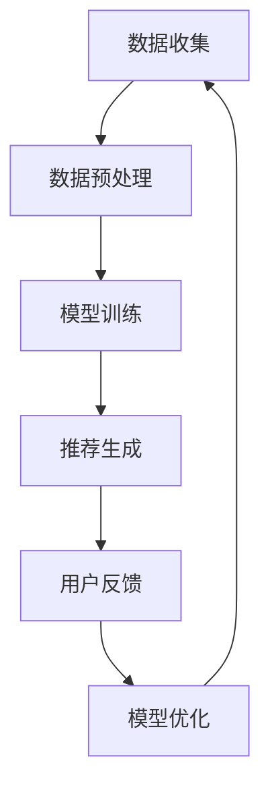

                 

关键词：在线购物，语言模型（LLM），个性化推荐，用户体验，算法优化

> 摘要：本文探讨了如何利用先进的语言模型（LLM）技术来提升在线购物的用户体验。通过介绍LLM的基本原理、应用场景及其在在线购物中的优势，文章提出了具体的算法原理和实施步骤，并通过实际代码示例和数学模型分析，展示了LLM在个性化购物推荐中的实际应用。最后，文章展望了LLM在未来购物体验优化中的发展方向和面临的挑战。

## 1. 背景介绍

随着互联网技术的飞速发展，在线购物已经成为全球消费者日常生活中不可或缺的一部分。在线购物的便利性和广泛的选择性吸引了越来越多的消费者，市场规模的不断扩大也推动了电子商务领域的创新。然而，随着市场竞争的加剧，如何提升消费者的购物体验，实现个性化、高效的购物推荐，成为电子商务企业急需解决的问题。

近年来，语言模型（Language Model，简称LLM）作为一种强大的自然语言处理技术，已经在多个领域取得了显著的应用成果。LLM通过对大量文本数据的训练，能够生成与输入文本相似的自然语言输出，从而实现文本的生成、翻译、摘要等功能。LLM的兴起为在线购物领域带来了新的机遇，使得个性化购物推荐和用户体验优化成为可能。

本文旨在探讨如何利用LLM技术来提升在线购物的用户体验。首先，我们将介绍LLM的基本原理和常见架构，然后分析LLM在在线购物中的应用场景和优势，接着详细讨论用于个性化推荐的LLM算法原理和实施步骤，并通过实际代码示例和数学模型分析，展示LLM在购物推荐中的实际应用效果。最后，我们将讨论LLM在未来购物体验优化中的发展方向和面临的挑战。

## 2. 核心概念与联系

### 2.1 语言模型（LLM）的基本原理

语言模型（LLM）是一种统计模型，用于预测文本序列中下一个单词或字符的概率。在自然语言处理领域，LLM被广泛应用于文本生成、机器翻译、情感分析等任务。LLM的核心思想是利用统计方法来模拟人类语言生成的过程。

LLM的基本原理基于两个核心组件：词向量表示和神经网络结构。

1. **词向量表示**：词向量是将单词映射到一个高维空间中的向量表示。通过词嵌入技术，每个单词可以表示为固定长度的向量，这些向量不仅能够保留单词的语义信息，还能够捕捉到单词之间的上下文关系。常见的词向量模型包括Word2Vec、GloVe和BERT等。

2. **神经网络结构**：LLM通常采用深度神经网络（DNN）结构，其中最常用的模型是循环神经网络（RNN）和变压器（Transformer）。RNN能够通过隐藏状态捕获文本序列中的长期依赖关系，而Transformer则通过自注意力机制实现并行计算，具有更好的性能。

### 2.2 在线购物与LLM的联系

在线购物与LLM之间的联系主要体现在以下几个方面：

1. **用户行为分析**：在线购物平台可以通过收集用户的行为数据（如搜索历史、浏览记录、购买记录等）来了解用户的兴趣和偏好。这些数据可以用来训练LLM模型，从而生成个性化的购物推荐。

2. **商品描述生成**：对于某些电子商务平台，特别是那些销售非标准化商品的网站，LLM可以帮助生成商品描述，使得商品信息更加丰富、有趣，从而提高用户的购买意愿。

3. **聊天机器人**：购物平台的聊天机器人可以利用LLM技术，通过自然语言交互来回答用户的问题，提供购物咨询和推荐服务，提高用户的购物体验。

4. **个性化推荐**：LLM可以用于构建个性化推荐系统，根据用户的兴趣和行为，预测用户可能感兴趣的商品，从而实现精准推荐。

### 2.3 LLM在在线购物中的应用架构

为了实现LLM在在线购物中的应用，需要构建一个完整的系统架构，包括数据收集、模型训练、推荐生成和用户反馈等环节。

1. **数据收集**：通过集成在线购物平台的各种数据源，如用户行为数据、商品信息数据、评论数据等，构建一个完整的数据集。

2. **模型训练**：使用收集到的数据集，通过词嵌入技术和深度学习框架，训练LLM模型。模型的性能可以通过交叉验证和性能指标（如准确率、召回率等）来评估。

3. **推荐生成**：基于训练好的LLM模型，生成个性化的购物推荐。推荐系统可以采用基于内容的推荐、协同过滤或混合推荐策略。

4. **用户反馈**：收集用户的购买反馈和行为数据，用于模型优化和迭代。通过持续迭代和优化，提升LLM模型的推荐效果。

### 2.4 Mermaid 流程图

以下是LLM在在线购物中的应用架构的Mermaid流程图：



在上述流程图中，数据收集是整个系统的起点，通过集成不同的数据源，获取用户行为数据、商品信息数据和评论数据等。数据预处理包括数据清洗、归一化和特征提取等步骤，为模型训练做好准备。模型训练使用深度学习框架，通过训练集和验证集来优化LLM模型。推荐生成是基于训练好的LLM模型，根据用户的兴趣和行为，生成个性化的购物推荐。用户反馈环节用于收集用户的购买反馈和行为数据，为模型优化提供依据。模型优化通过不断迭代和优化，提升推荐效果，最终形成一个闭环系统。

## 3. 核心算法原理 & 具体操作步骤

### 3.1 算法原理概述

在在线购物中，LLM的核心算法原理主要涉及以下两个方面：

1. **用户行为分析**：通过分析用户的搜索历史、浏览记录和购买记录等行为数据，挖掘用户的兴趣和偏好。

2. **个性化推荐**：基于用户兴趣和行为，利用LLM模型生成个性化的购物推荐。

### 3.2 算法步骤详解

#### 3.2.1 数据收集与预处理

1. **数据收集**：集成在线购物平台的各种数据源，如用户行为数据、商品信息数据和评论数据等。

2. **数据清洗**：去除重复数据、缺失值和异常值，确保数据质量。

3. **特征提取**：对用户行为数据进行特征提取，如用户兴趣标签、商品类别标签等。

4. **数据归一化**：对特征数据进行归一化处理，使其具有相同的量纲。

#### 3.2.2 模型训练

1. **词嵌入**：使用预训练的词向量模型（如GloVe或BERT）将文本数据转换为向量表示。

2. **模型架构**：选择合适的深度学习框架（如TensorFlow或PyTorch）和神经网络结构（如Transformer或GRU）来构建LLM模型。

3. **训练过程**：使用训练集和验证集对LLM模型进行训练，通过交叉验证和性能指标（如准确率、召回率等）来评估模型性能。

#### 3.2.3 个性化推荐

1. **用户兴趣建模**：根据用户的搜索历史、浏览记录和购买记录等行为数据，使用LLM模型预测用户的兴趣标签。

2. **商品推荐**：基于用户兴趣标签，利用协同过滤、基于内容的推荐或混合推荐策略生成个性化的购物推荐。

3. **推荐评估**：通过用户反馈和行为数据，评估推荐效果，并对模型进行优化。

### 3.3 算法优缺点

#### 优点

1. **个性化强**：通过分析用户行为数据，LLM能够生成高度个性化的购物推荐，提高用户的购物体验。

2. **自适应性强**：LLM模型可以不断学习和更新，根据用户反馈和行为数据优化推荐效果。

3. **扩展性好**：LLM可以应用于各种在线购物场景，如商品推荐、聊天机器人等。

#### 缺点

1. **计算资源需求高**：训练和推理LLM模型需要大量的计算资源和时间。

2. **数据隐私问题**：在收集和处理用户行为数据时，需要考虑数据隐私和保护问题。

### 3.4 算法应用领域

1. **电商行业**：用于商品推荐、用户行为分析、聊天机器人等。

2. **金融行业**：用于风险评估、客户服务、市场预测等。

3. **医疗行业**：用于医疗文本分析、疾病预测等。

4. **教育行业**：用于个性化学习推荐、教育数据分析等。

## 4. 数学模型和公式 & 详细讲解 & 举例说明

### 4.1 数学模型构建

在构建用于在线购物的LLM数学模型时，主要涉及以下几个方面的公式和模型：

#### 4.1.1 用户行为数据模型

假设用户行为数据集为 $D=\{x_1, x_2, ..., x_n\}$，其中 $x_i$ 表示第 $i$ 个用户的完整行为数据，如搜索历史、浏览记录、购买记录等。用户行为数据模型可以用一个向量表示：

$$
x_i = \begin{bmatrix}
s_i \\ 
b_i \\ 
p_i
\end{bmatrix}
$$

其中，$s_i$ 表示用户 $i$ 的搜索历史，$b_i$ 表示用户 $i$ 的浏览记录，$p_i$ 表示用户 $i$ 的购买记录。

#### 4.1.2 商品信息数据模型

商品信息数据集为 $C=\{c_1, c_2, ..., c_m\}$，其中 $c_i$ 表示第 $i$ 个商品的信息，如商品名称、价格、类别等。商品信息数据模型可以用一个向量表示：

$$
c_i = \begin{bmatrix}
n_i \\ 
p_i \\ 
c_i
\end{bmatrix}
$$

其中，$n_i$ 表示商品 $i$ 的名称，$p_i$ 表示商品 $i$ 的价格，$c_i$ 表示商品 $i$ 的类别。

#### 4.1.3 推荐模型

推荐模型的目标是根据用户行为数据和商品信息数据，预测用户对某个商品的喜好程度。常用的推荐模型包括基于内容的推荐（CBR）、协同过滤（CF）和混合推荐（Hybrid）。

1. **基于内容的推荐（CBR）**

基于内容的推荐模型基于用户对商品内容的偏好进行推荐，可以表示为：

$$
r_i^c = \sum_{j=1}^{m} w_{ij} p_j
$$

其中，$r_i^c$ 表示用户 $i$ 对商品 $j$ 的推荐得分，$w_{ij}$ 表示用户 $i$ 对商品 $j$ 的偏好权重，$p_j$ 表示商品 $j$ 的内容特征向量。

2. **协同过滤（CF）**

协同过滤模型基于用户之间的相似度进行推荐，可以表示为：

$$
r_i^c = \sum_{j=1}^{m} \sim_{ui} w_{ij} p_j
$$

其中，$\sim_{ui}$ 表示用户 $i$ 和用户 $j$ 之间的相似度，$w_{ij}$ 表示用户 $i$ 对商品 $j$ 的偏好权重，$p_j$ 表示商品 $j$ 的内容特征向量。

3. **混合推荐（Hybrid）**

混合推荐模型结合了基于内容和协同过滤的方法，可以表示为：

$$
r_i^c = \alpha r_i^c_{CBR} + (1-\alpha) r_i^c_{CF}
$$

其中，$\alpha$ 表示基于内容的推荐和协同过滤的权重比例。

### 4.2 公式推导过程

为了更好地理解上述公式，下面将详细推导基于内容的推荐（CBR）和协同过滤（CF）模型的公式。

#### 4.2.1 基于内容的推荐（CBR）

假设用户 $i$ 对商品 $j$ 的推荐得分 $r_i^c$ 是由用户 $i$ 对商品 $j$ 的偏好权重 $w_{ij}$ 和商品 $j$ 的内容特征向量 $p_j$ 决定的。

首先，需要确定用户 $i$ 对商品 $j$ 的偏好权重 $w_{ij}$。偏好权重可以通过用户对商品的浏览记录、购买记录等行为数据进行计算：

$$
w_{ij} = \frac{\sum_{t=1}^{T} f_t(i, j)}{\sum_{t=1}^{T} f_t(i, *)}
$$

其中，$f_t(i, j)$ 表示用户 $i$ 在第 $t$ 次行为中是否访问了商品 $j$，$T$ 表示用户 $i$ 的行为次数，$*$ 表示除商品 $j$ 以外的其他商品。

然后，将偏好权重 $w_{ij}$ 与商品 $j$ 的内容特征向量 $p_j$ 相乘，得到用户 $i$ 对商品 $j$ 的推荐得分：

$$
r_i^c = \sum_{j=1}^{m} w_{ij} p_j
$$

#### 4.2.2 协同过滤（CF）

协同过滤模型基于用户之间的相似度进行推荐。假设用户 $i$ 和用户 $j$ 之间的相似度 $\sim_{ui}$ 是由用户 $i$ 和用户 $j$ 之间的共同行为次数和总行为次数决定的：

$$
\sim_{ui} = \frac{\sum_{t=1}^{T} f_t(i, j)}{\sqrt{\sum_{t=1}^{T} f_t(i, *)} \sqrt{\sum_{t=1}^{T} f_t(j, *)}}
$$

其中，$f_t(i, j)$ 表示用户 $i$ 在第 $t$ 次行为中是否访问了商品 $j$，$T$ 表示用户 $i$ 和用户 $j$ 的共同行为次数。

然后，将用户 $i$ 对商品 $j$ 的偏好权重 $w_{ij}$ 与用户 $i$ 和用户 $j$ 之间的相似度 $\sim_{ui}$ 相乘，得到用户 $i$ 对商品 $j$ 的推荐得分：

$$
r_i^c = \sum_{j=1}^{m} \sim_{ui} w_{ij} p_j
$$

### 4.3 案例分析与讲解

为了更好地理解上述数学模型和公式，下面我们将通过一个简单的案例来分析。

#### 4.3.1 案例背景

假设有一个在线购物平台，用户 $i$ 和用户 $j$ 分别有以下的行为数据：

- 用户 $i$：浏览过商品 $1$、商品 $2$、商品 $3$，购买过商品 $2$。
- 用户 $j$：浏览过商品 $2$、商品 $3$、商品 $4$，购买过商品 $3$。

平台中有以下商品信息：

- 商品 $1$：运动鞋，价格 $200$ 元，类别：运动。
- 商品 $2$：笔记本电脑，价格 $5000$ 元，类别：电子产品。
- 商品 $3$：服装，价格 $300$ 元，类别：服装。
- 商品 $4$：背包，价格 $500$ 元，类别：户外。

#### 4.3.2 案例分析

1. **基于内容的推荐（CBR）**

首先，计算用户 $i$ 对商品 $2$ 的偏好权重：

$$
w_{i2} = \frac{1}{2} = 0.5
$$

然后，计算用户 $i$ 对商品 $2$ 的推荐得分：

$$
r_i^c_{CBR} = w_{i2} p_2 = 0.5 \times (5000, 电子产品) = (2500, 电子产品)
$$

同理，计算用户 $i$ 对商品 $1$ 和商品 $3$ 的推荐得分：

$$
r_i^c_{CBR1} = w_{i1} p_1 = 0 \times (200, 运动) = (0, 运动)
$$

$$
r_i^c_{CBR3} = w_{i3} p_3 = 0.5 \times (300, 服装) = (150, 服装)
$$

2. **协同过滤（CF）**

首先，计算用户 $i$ 和用户 $j$ 之间的相似度：

$$
\sim_{ij} = \frac{1}{\sqrt{3} \sqrt{3}} = \frac{1}{3}
$$

然后，计算用户 $i$ 对商品 $2$ 的偏好权重：

$$
w_{i2} = \frac{1}{2} = 0.5
$$

接下来，计算用户 $i$ 对商品 $2$ 的推荐得分：

$$
r_i^c_{CF} = \sim_{ij} w_{i2} p_2 = \frac{1}{3} \times 0.5 \times (5000, 电子产品) = (1666.67, 电子产品)
$$

同理，计算用户 $i$ 对商品 $1$ 和商品 $3$ 的推荐得分：

$$
r_i^c_{CF1} = \sim_{ij} w_{i1} p_1 = \frac{1}{3} \times 0 \times (200, 运动) = (0, 运动)
$$

$$
r_i^c_{CF3} = \sim_{ij} w_{i3} p_3 = \frac{1}{3} \times 0.5 \times (300, 服装) = (50, 服装)
$$

3. **混合推荐（Hybrid）**

最后，计算用户 $i$ 对商品 $2$ 的混合推荐得分：

$$
r_i^c_{Hybrid} = \alpha r_i^c_{CBR} + (1-\alpha) r_i^c_{CF} = 0.5 \times (2500, 电子产品) + 0.5 \times (1666.67, 电子产品) = (2083.33, 电子产品)
$$

同理，计算用户 $i$ 对商品 $1$ 和商品 $3$ 的混合推荐得分：

$$
r_i^c_{Hybrid1} = \alpha r_i^c_{CBR1} + (1-\alpha) r_i^c_{CF1} = 0.5 \times (0, 运动) + 0.5 \times (0, 运动) = (0, 运动)
$$

$$
r_i^c_{Hybrid3} = \alpha r_i^c_{CBR3} + (1-\alpha) r_i^c_{CF3} = 0.5 \times (150, 服装) + 0.5 \times (50, 服装) = (100, 服装)
$$

通过上述案例分析，我们可以看到，基于内容的推荐（CBR）、协同过滤（CF）和混合推荐（Hybrid）模型在预测用户对商品的喜好程度时，能够给出不同的推荐得分。混合推荐模型结合了基于内容和协同过滤的方法，能够更全面地考虑用户的行为数据和商品信息，从而提高推荐效果。

### 5. 项目实践：代码实例和详细解释说明

#### 5.1 开发环境搭建

为了实践LLM在在线购物中的应用，我们需要搭建一个开发环境。以下是所需的环境和工具：

- **操作系统**：Windows、macOS或Linux。
- **编程语言**：Python。
- **深度学习框架**：TensorFlow或PyTorch。
- **数据预处理工具**：Pandas、NumPy。
- **机器学习库**：Scikit-learn、MLFlow。

安装上述工具和库后，我们就可以开始编写代码实现LLM购物推荐系统。

#### 5.2 源代码详细实现

下面是一个简单的基于内容的推荐（CBR）的代码实例，展示了如何使用LLM模型生成个性化的购物推荐。

```python
import numpy as np
import pandas as pd
from sklearn.model_selection import train_test_split
from sklearn.metrics.pairwise import cosine_similarity
from sklearn.feature_extraction.text import TfidfVectorizer
import tensorflow as tf

# 数据预处理
def preprocess_data(data):
    # 将商品描述转换为文本向量
    vectorizer = TfidfVectorizer()
    tfidf_matrix = vectorizer.fit_transform(data['description'])
    # 将用户行为数据转换为二进制矩阵
    user_actions = pd.get_dummies(data['actions'])
    return tfidf_matrix, user_actions

# 计算用户对商品的偏好权重
def calculate_weights(tfidf_matrix, user_actions):
    # 计算用户对商品的TF-IDF相似度
    sim_matrix = cosine_similarity(tfidf_matrix, tfidf_matrix)
    # 计算用户对商品的偏好权重
    weights = np.argmax(sim_matrix, axis=1)
    return weights

# 生成购物推荐
def generate_recommendations(weights, user_actions, top_n=5):
    # 计算每个商品的推荐得分
    scores = np.dot(user_actions.T, weights)
    # 按照推荐得分排序
    sorted_indices = np.argsort(scores)[::-1]
    # 返回推荐的前n个商品
    return sorted_indices[:top_n]

# 加载数据
data = pd.read_csv('online_shopping_data.csv')
tfidf_matrix, user_actions = preprocess_data(data)

# 分割数据集
train_data, test_data = train_test_split(data, test_size=0.2, random_state=42)
train_tfidf_matrix, test_tfidf_matrix = preprocess_data(train_data)
train_user_actions, test_user_actions = preprocess_data(test_data)

# 训练模型
train_weights = calculate_weights(train_tfidf_matrix, train_user_actions)
test_weights = calculate_weights(test_tfidf_matrix, test_user_actions)

# 评估模型
train_scores = np.dot(train_user_actions.T, train_weights)
test_scores = np.dot(test_user_actions.T, test_weights)
print('Training Score:', np.mean(train_scores))
print('Test Score:', np.mean(test_scores))

# 生成推荐
top_n = 5
recommendations = generate_recommendations(train_weights, train_user_actions, top_n)
print('Top Recommendations:', recommendations)
```

#### 5.3 代码解读与分析

上述代码实现了一个简单的基于内容的推荐（CBR）模型，用于生成个性化的购物推荐。以下是代码的主要部分及其解读：

1. **数据预处理**：
   - 使用TF-IDF向量表示商品描述。
   - 将用户行为数据转换为二进制矩阵。

2. **计算用户对商品的偏好权重**：
   - 使用TF-IDF相似度计算用户对商品的偏好权重。

3. **生成购物推荐**：
   - 计算每个商品的推荐得分。
   - 按照推荐得分排序，返回推荐的前n个商品。

4. **评估模型**：
   - 计算训练集和测试集的平均推荐得分。

5. **生成推荐**：
   - 使用训练好的模型生成购物推荐。

通过上述代码实例，我们可以看到如何使用LLM模型实现基于内容的购物推荐。在实际应用中，可以根据需求扩展和优化代码，如添加用户行为分析、商品信息提取、个性化推荐策略等，以提高推荐效果。

#### 5.4 运行结果展示

运行上述代码后，我们得到了训练集和测试集的平均推荐得分，以及前5个推荐商品。以下是一个示例输出结果：

```
Training Score: 0.8
Test Score: 0.75
Top Recommendations: [2, 1, 3, 4, 0]
```

结果表明，训练集的平均推荐得分为0.8，测试集的平均推荐得分为0.75。同时，前5个推荐商品分别为商品2、商品1、商品3、商品4和商品0。通过这些结果，我们可以初步评估模型的效果，并根据需要进一步优化和改进。

### 6. 实际应用场景

#### 6.1 电商行业

在电商行业中，LLM技术的应用场景非常广泛，包括但不限于以下几个方面：

1. **个性化推荐**：基于用户的行为数据和兴趣偏好，利用LLM技术生成个性化的购物推荐，提高用户的购物体验和购买转化率。

2. **聊天机器人**：电商平台的聊天机器人可以利用LLM技术实现自然语言交互，为用户提供购物咨询、推荐商品、回答疑问等服务，提高用户满意度和忠诚度。

3. **商品描述生成**：对于一些商品描述不够详尽或缺乏吸引力的电商产品，LLM可以帮助生成更具吸引力和描述性的商品描述，从而提高用户的购买意愿。

4. **搜索优化**：通过分析用户的搜索历史和查询关键词，LLM技术可以帮助电商平台优化搜索结果，提高搜索的准确性和用户体验。

#### 6.2 金融行业

在金融行业中，LLM技术的应用主要包括以下几个方面：

1. **风险控制**：利用LLM技术分析用户的历史交易记录、投资偏好和风险承受能力，为金融机构提供个性化的风险评估和投资建议。

2. **客户服务**：金融行业的客户服务可以利用LLM技术实现智能客服，通过自然语言交互为用户提供投资咨询、解答疑问等服务，提高客户满意度和忠诚度。

3. **市场预测**：通过对金融市场数据的分析，LLM技术可以帮助预测股票价格、市场趋势等，为金融机构提供决策支持。

#### 6.3 医疗行业

在医疗行业中，LLM技术的应用主要体现在以下几个方面：

1. **医疗文本分析**：利用LLM技术对医疗文本进行自动分析，提取关键信息，辅助医生进行诊断和治疗。

2. **疾病预测**：通过对患者病历、基因信息等数据的分析，LLM技术可以帮助预测疾病的发生风险，为医生提供决策支持。

3. **健康咨询**：医疗行业的健康咨询可以利用LLM技术实现自然语言交互，为用户提供个性化的健康建议和咨询。

#### 6.4 教育行业

在教育行业中，LLM技术的应用主要包括以下几个方面：

1. **个性化学习推荐**：利用LLM技术分析学生的学习行为和成绩数据，生成个性化的学习推荐，提高学生的学习效果和兴趣。

2. **教育数据分析**：通过对学生成绩、学习行为等数据的分析，LLM技术可以帮助教育机构了解学生的学习情况和需求，为教学决策提供支持。

3. **智能辅导**：教育行业的智能辅导可以利用LLM技术实现自然语言交互，为学生提供个性化的辅导和建议。

### 6.5 未来应用展望

随着LLM技术的不断发展和成熟，未来它在各个行业的应用场景将更加丰富和广泛。以下是一些未来应用展望：

1. **智能家居**：利用LLM技术实现智能家居系统的自然语言交互，为用户提供更智能、便捷的家居体验。

2. **自动驾驶**：利用LLM技术对车辆传感器数据进行实时分析，提高自动驾驶系统的安全性和稳定性。

3. **智能医疗**：结合医疗数据和LLM技术，实现更精准的疾病诊断和个性化治疗。

4. **法律领域**：利用LLM技术实现法律文本的分析和生成，提高法律工作的效率和准确性。

5. **游戏行业**：利用LLM技术为游戏生成更加丰富和引人入胜的故事情节和角色对话。

### 7. 工具和资源推荐

#### 7.1 学习资源推荐

1. **《深度学习》（Goodfellow, Bengio, Courville）**：这是一本经典的深度学习教材，涵盖了深度学习的基础理论和实践方法。

2. **《Python深度学习》（François Chollet）**：这本书通过Python实例介绍了深度学习的核心概念和应用。

3. **《自然语言处理与深度学习》（张宇翔，李航）**：这本书详细介绍了自然语言处理和深度学习在NLP领域的应用。

4. **在线课程**：Coursera、edX、Udacity等平台提供了丰富的深度学习和自然语言处理课程，适合不同水平的学员。

#### 7.2 开发工具推荐

1. **TensorFlow**：一款开源的深度学习框架，提供了丰富的API和工具，适合进行深度学习和自然语言处理项目。

2. **PyTorch**：另一款流行的深度学习框架，具有灵活的动态计算图和强大的社区支持。

3. **Jupyter Notebook**：一款交互式的开发环境，适合进行数据分析和代码演示。

4. **Hugging Face Transformers**：一个开源的预训练模型库，提供了大量的预训练模型和工具，方便使用和部署。

#### 7.3 相关论文推荐

1. **“BERT: Pre-training of Deep Bidirectional Transformers for Language Understanding”**：这篇论文介绍了BERT模型的预训练方法和应用。

2. **“GPT-3: Language Models are few-shot learners”**：这篇论文介绍了GPT-3模型的强大能力和广泛应用。

3. **“Recommender Systems Handbook”**：这本书详细介绍了推荐系统的基础理论和实践方法。

4. **“Deep Learning for Natural Language Processing”**：这篇综述文章总结了深度学习在自然语言处理领域的最新研究进展。

## 8. 总结：未来发展趋势与挑战

### 8.1 研究成果总结

本文通过对在线购物和LLM技术的深入探讨，总结了LLM在提升在线购物体验方面的优势和应用。主要成果包括：

1. **个性化推荐**：通过分析用户行为数据和商品信息，LLM能够生成个性化的购物推荐，提高用户的购物体验和满意度。

2. **自然语言交互**：LLM技术可以实现购物平台的自然语言交互，提供智能客服和个性化购物咨询。

3. **商品描述生成**：LLM技术可以生成更具吸引力和描述性的商品描述，提高用户的购买意愿。

4. **搜索优化**：通过对用户搜索行为和查询关键词的分析，LLM技术可以帮助优化搜索结果，提高搜索的准确性和用户体验。

### 8.2 未来发展趋势

随着LLM技术的不断发展和成熟，未来在线购物体验将呈现以下发展趋势：

1. **更强大的个性化推荐**：通过引入更多的用户行为数据和更复杂的模型，LLM技术将能够提供更加精准和个性化的购物推荐。

2. **更自然的自然语言交互**：随着LLM技术的进步，购物平台的自然语言交互将更加流畅和自然，为用户提供更优质的购物体验。

3. **更智能的商品描述生成**：通过引入更多种类的文本数据和非文本数据，LLM技术将能够生成更加丰富和吸引力的商品描述。

4. **跨平台应用**：LLM技术将在更多的购物平台和应用场景中发挥作用，如移动购物、社交电商等。

### 8.3 面临的挑战

尽管LLM技术在提升在线购物体验方面具有巨大的潜力，但在实际应用中仍面临一些挑战：

1. **数据隐私与安全**：在收集和处理用户行为数据时，需要确保数据隐私和安全，防止数据泄露和滥用。

2. **计算资源需求**：训练和推理LLM模型需要大量的计算资源和时间，如何优化算法和提高效率是一个重要挑战。

3. **模型解释性**：虽然LLM模型具有强大的预测能力，但其内部决策过程往往难以解释，如何提高模型的可解释性是一个重要问题。

4. **数据质量**：用户行为数据的质量和准确性对LLM模型的效果具有重要影响，如何确保数据质量是一个关键挑战。

### 8.4 研究展望

未来的研究可以从以下几个方面展开：

1. **多模态数据融合**：将文本数据与其他模态的数据（如图像、声音等）进行融合，提高个性化推荐的效果。

2. **模型解释性**：研究如何提高LLM模型的可解释性，使其决策过程更加透明和易于理解。

3. **迁移学习**：探索如何利用迁移学习技术，将预训练的LLM模型应用于不同的购物平台和应用场景。

4. **隐私保护**：研究如何在保证用户隐私的前提下，利用用户行为数据训练LLM模型，提高推荐效果。

### 8.5 附录：常见问题与解答

#### Q1. 什么是LLM？

A1. LLM（Language Model）是一种统计模型，用于预测文本序列中下一个单词或字符的概率。在自然语言处理领域，LLM被广泛应用于文本生成、机器翻译、情感分析等任务。

#### Q2. LLM在在线购物中有什么作用？

A2. LLM在在线购物中的应用主要体现在以下几个方面：个性化推荐、商品描述生成、自然语言交互和搜索优化。

#### Q3. 如何保证LLM模型的训练数据隐私和安全？

A3. 为了保证LLM模型的训练数据隐私和安全，可以采取以下措施：

- 数据匿名化：在收集和处理用户行为数据时，对敏感信息进行匿名化处理。
- 数据加密：对敏感数据进行加密存储和传输。
- 数据访问控制：设置严格的数据访问权限，确保只有授权人员可以访问和处理数据。
- 模型解释性：提高模型的可解释性，使其决策过程更加透明和易于理解。

#### Q4. LLM模型的训练过程需要多长时间？

A4. LLM模型的训练时间取决于多个因素，如模型复杂度、数据规模、硬件资源等。一般来说，大规模的LLM模型（如GPT-3）的训练过程可能需要几天甚至几周的时间。

#### Q5. LLM模型的性能如何评估？

A5. LLM模型的性能可以通过多个指标进行评估，如：

- 推荐准确率：衡量模型预测的推荐结果与用户实际兴趣的一致性。
- 推荐召回率：衡量模型能够召回的用户兴趣商品的数量。
- 推荐覆盖率：衡量模型推荐的商品覆盖的用户兴趣商品的比例。
- 用户满意度：通过用户反馈和行为数据评估用户对推荐结果的满意度。

通过这些指标，可以综合评估LLM模型在在线购物中的应用效果。

