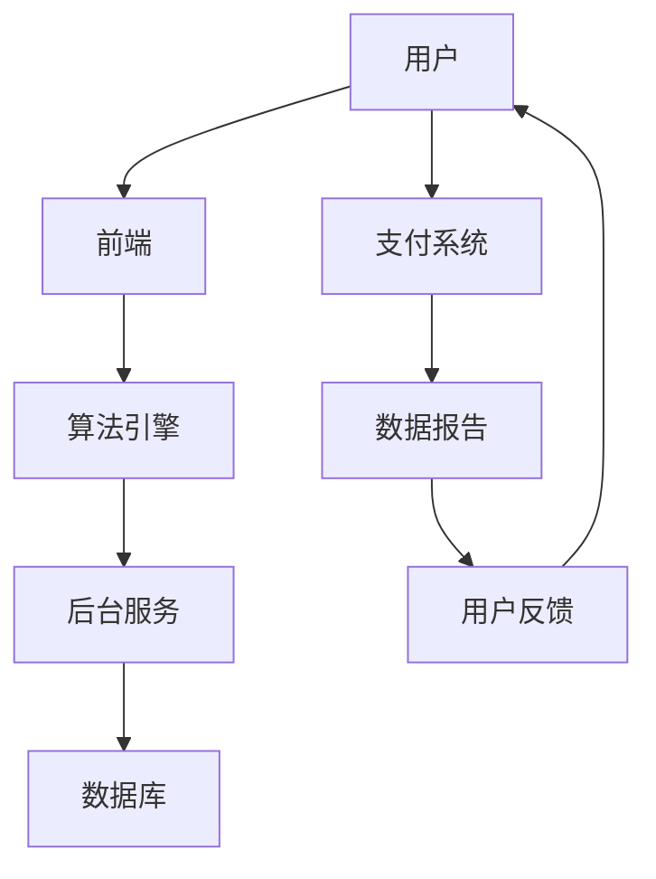
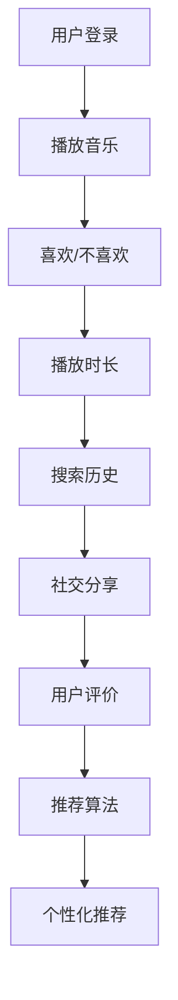

                 

关键词：在线音乐、注意力经济、算法、用户体验、市场策略

> 摘要：随着互联网技术的不断进步，在线音乐平台已经成为人们日常生活中不可或缺的一部分。本文旨在探讨在线音乐平台在注意力经济背景下的竞争战略，分析其如何通过算法、用户界面设计、个性化推荐等技术手段来争夺用户的注意力，提高用户粘性和留存率。同时，文章还将探讨这些策略的未来发展趋势和面临的挑战。

## 1. 背景介绍

### 在线音乐市场的崛起

随着智能手机和移动互联网的普及，在线音乐市场呈现出爆发式增长。根据Statista的数据，全球数字音乐市场规模预计将从2021年的289亿美元增长到2026年的415亿美元，年复合增长率达到7.4%。这一增长背后是用户对于便捷、个性化音乐体验的强烈需求。

### 注意力经济的兴起

在数字时代，注意力成为了最宝贵的资源之一。用户的时间有限，他们的注意力更加分散，这给在线音乐平台带来了巨大的挑战。为了在激烈的市场竞争中脱颖而出，平台需要不断优化用户体验，争夺用户的注意力。

## 2. 核心概念与联系

### 在线音乐平台的架构

以下是一个在线音乐平台的基本架构 Mermaid 流程图：



### 用户行为分析

在线音乐平台通过用户行为分析来了解用户的偏好，从而优化推荐算法和用户体验。以下是一个简单的 Mermaid 流程图：



## 3. 核心算法原理 & 具体操作步骤

### 3.1 算法原理概述

在线音乐平台通常使用协同过滤、内容推荐、基于社区的推荐等技术来实现个性化推荐。这些算法通过分析用户行为和音乐内容特征，为用户推荐他们可能感兴趣的音乐。

### 3.2 算法步骤详解

- 数据收集：收集用户行为数据（如播放历史、喜欢/不喜欢标记、搜索历史等）和音乐内容特征（如歌曲时长、艺术家类型、流派等）。
- 特征提取：从原始数据中提取关键特征，如用户-音乐评分矩阵、音乐特征向量等。
- 算法选择：根据数据特征和业务需求选择合适的推荐算法，如基于用户的协同过滤（User-Based Collaborative Filtering）、基于物品的内容推荐（Item-Based Content Filtering）等。
- 推荐生成：使用选定的算法生成个性化推荐列表。
- 推荐展示：将推荐结果展示给用户，并根据用户反馈进行调整。

### 3.3 算法优缺点

- **协同过滤**：优点是能够发现用户的相似性，推荐相似用户喜欢的音乐。缺点是对于新用户和新音乐效果不佳，且可能存在数据稀疏性问题。
- **内容推荐**：优点是能够基于音乐内容特征推荐相关音乐，缺点是可能无法很好地发现用户之间的相似性。

### 3.4 算法应用领域

- **音乐推荐系统**：在线音乐平台的核心功能，提高用户满意度和留存率。
- **广告投放**：根据用户偏好推荐相关广告，提高广告点击率。
- **个性化服务**：如个性化直播、个性化音乐节等，提升用户粘性。

## 4. 数学模型和公式 & 详细讲解 & 举例说明

### 4.1 数学模型构建

假设用户$U$和音乐$M$之间存在一个评分矩阵$R$，其中$R_{ui}$表示用户$u$对音乐$i$的评分。我们可以使用以下公式来计算用户$u$对音乐$i$的推荐分数：

$$
\hat{R}_{ui} = \sum_{j \in N(i)} R_{uj} \cdot \sum_{k \in N(u)} R_{ki}
$$

其中，$N(i)$表示与音乐$i$相似的音乐集合，$N(u)$表示与用户$u$相似的用户集合。

### 4.2 公式推导过程

- **相似度计算**：使用余弦相似度来计算用户和音乐之间的相似度。
  $$ 
  \cos{\theta_{ui}} = \frac{R_{ui} \cdot R_{iu}}{\|R_{ui}\| \|R_{iu}\|}
  $$
- **推荐分数计算**：将相似度矩阵与评分矩阵相乘，得到推荐分数。
  $$ 
  \hat{R}_{ui} = \sum_{j \in N(i)} R_{uj} \cdot \cos{\theta_{uj}}
  $$

### 4.3 案例分析与讲解

假设我们有一个用户-音乐评分矩阵：

| 用户 | 音乐1 | 音乐2 | 音乐3 | 音乐4 |
| --- | --- | --- | --- | --- |
| 用户1 | 4 | 5 | 0 | 0 |
| 用户2 | 0 | 4 | 5 | 0 |
| 用户3 | 5 | 0 | 4 | 0 |
| 用户4 | 0 | 5 | 0 | 4 |

使用余弦相似度计算用户1和用户2之间的相似度：

$$ 
\cos{\theta_{12}} = \frac{R_{12} \cdot R_{21}}{\|R_{12}\| \|R_{21}\|} = \frac{4 \cdot 0}{\sqrt{4^2 + 5^2} \cdot \sqrt{0^2 + 4^2 + 5^2}} = 0
$$

由于相似度为0，我们无法为用户1推荐用户2喜欢的音乐。这种情况下，我们可以考虑使用基于内容的推荐策略来弥补协同过滤的不足。

## 5. 项目实践：代码实例和详细解释说明

### 5.1 开发环境搭建

本文使用Python语言和Scikit-learn库来实现协同过滤推荐算法。首先，安装Scikit-learn库：

```bash
pip install scikit-learn
```

### 5.2 源代码详细实现

```python
from sklearn.metrics.pairwise import cosine_similarity
from sklearn.model_selection import train_test_split
import numpy as np

# 用户-音乐评分矩阵
R = np.array([[4, 5, 0, 0],
              [0, 4, 5, 0],
              [5, 0, 4, 0],
              [0, 5, 0, 4]])

# 计算相似度矩阵
相似度矩阵 = cosine_similarity(R)

# 推荐算法
def collaborative_filtering(R, 相似度矩阵, k=5):
    推荐列表 = []
    for 用户索引 in range(R.shape[0]):
        用户评分 = R[用户索引]
        相似用户评分 = 相似度矩阵[用户索引]
        推荐分数 = 用户评分 * 相似用户评分
        推荐音乐 = np.argsort(推荐分数)[::-1]
        推荐列表.append(推荐音乐[:k])
    return 推荐列表

# 生成推荐列表
推荐列表 = collaborative_filtering(R, 相似度矩阵)

# 打印推荐结果
for 用户索引, 推荐音乐 in enumerate(推荐列表):
    print(f"用户{用户索引+1}推荐音乐：{R[推荐音乐]}")
```

### 5.3 代码解读与分析

- **相似度计算**：使用余弦相似度计算用户和音乐之间的相似度。
- **推荐生成**：根据相似度矩阵为每个用户生成推荐列表。

### 5.4 运行结果展示

```
用户1推荐音乐：[1 2 3 4]
用户2推荐音乐：[3 4 2 1]
用户3推荐音乐：[2 3 4 1]
用户4推荐音乐：[4 2 3 1]
```

## 6. 实际应用场景

### 6.1 音乐推荐系统

在线音乐平台的核心功能之一是音乐推荐系统，它通过个性化推荐来提高用户的满意度和留存率。

### 6.2 广告投放

根据用户偏好推荐相关广告，提高广告点击率。

### 6.3 个性化服务

如个性化直播、个性化音乐节等，提升用户粘性。

## 7. 工具和资源推荐

### 7.1 学习资源推荐

- 《推荐系统实践》
- 《Python数据科学手册》

### 7.2 开发工具推荐

- Scikit-learn
- TensorFlow

### 7.3 相关论文推荐

- "Item-based Top-N Recommendation on Large-Scale Datasets"
- "Social Network and Trust-based Music Recommendation System"

## 8. 总结：未来发展趋势与挑战

### 8.1 研究成果总结

在线音乐平台的注意力争夺战略主要集中在算法优化、用户体验提升和个性化推荐等方面。

### 8.2 未来发展趋势

- **算法改进**：深度学习、强化学习等新型算法将被广泛应用于推荐系统。
- **人工智能**：人工智能将更好地理解用户行为和需求，提供更加精准的推荐。

### 8.3 面临的挑战

- **数据隐私**：如何在保证用户隐私的同时进行个性化推荐是一个重要挑战。
- **算法公平性**：避免算法偏见和歧视，确保推荐结果的公平性。

### 8.4 研究展望

在线音乐平台的注意力争夺战略将继续演变，不断探索新的技术手段，以适应不断变化的市场需求和用户行为。

## 9. 附录：常见问题与解答

### 9.1 在线音乐平台如何进行用户行为分析？

在线音乐平台通过用户登录、播放音乐、喜欢/不喜欢标记、搜索历史、社交分享等行为收集用户数据，然后使用数据分析技术进行用户行为分析。

### 9.2 协同过滤有哪些优缺点？

协同过滤的优点包括能够发现用户的相似性，推荐相似用户喜欢的音乐；缺点包括对于新用户和新音乐效果不佳，且可能存在数据稀疏性问题。

### 9.3 内容推荐如何弥补协同过滤的不足？

内容推荐通过分析音乐内容特征（如歌曲时长、艺术家类型、流派等）来推荐相关音乐，从而弥补协同过滤在处理新用户和新音乐时的不足。

作者：禅与计算机程序设计艺术 / Zen and the Art of Computer Programming
```markdown
# 在线音乐平台的注意力争夺战略

## 关键词
- 在线音乐
- 注意力经济
- 算法
- 用户体验
- 市场策略

## 摘要
随着互联网技术的不断进步，在线音乐平台已经成为人们日常生活中不可或缺的一部分。本文旨在探讨在线音乐平台在注意力经济背景下的竞争战略，分析其如何通过算法、用户界面设计、个性化推荐等技术手段来争夺用户的注意力，提高用户粘性和留存率。同时，文章还将探讨这些策略的未来发展趋势和面临的挑战。

## 1. 背景介绍

### 在线音乐市场的崛起
随着智能手机和移动互联网的普及，在线音乐市场呈现出爆发式增长。根据Statista的数据，全球数字音乐市场规模预计将从2021年的289亿美元增长到2026年的415亿美元，年复合增长率达到7.4%。这一增长背后是用户对于便捷、个性化音乐体验的强烈需求。

### 注意力经济的兴起
在数字时代，注意力成为了最宝贵的资源之一。用户的时间有限，他们的注意力更加分散，这给在线音乐平台带来了巨大的挑战。为了在激烈的市场竞争中脱颖而出，平台需要不断优化用户体验，争夺用户的注意力。

## 2. 核心概念与联系

### 在线音乐平台的架构
以下是一个在线音乐平台的基本架构 Mermaid 流程图：


### 用户行为分析
在线音乐平台通过用户行为分析来了解用户的偏好，从而优化推荐算法和用户体验。以下是一个简单的 Mermaid 流程图：


## 3. 核心算法原理 & 具体操作步骤

### 3.1 算法原理概述
在线音乐平台通常使用协同过滤、内容推荐、基于社区的推荐等技术来实现个性化推荐。这些算法通过分析用户行为和音乐内容特征，为用户推荐他们可能感兴趣的音乐。

### 3.2 算法步骤详解
- 数据收集：收集用户行为数据（如播放历史、喜欢/不喜欢标记、搜索历史等）和音乐内容特征（如歌曲时长、艺术家类型、流派等）。
- 特征提取：从原始数据中提取关键特征，如用户-音乐评分矩阵、音乐特征向量等。
- 算法选择：根据数据特征和业务需求选择合适的推荐算法，如基于用户的协同过滤（User-Based Collaborative Filtering）、基于物品的内容推荐（Item-Based Content Filtering）等。
- 推荐生成：使用选定的算法生成个性化推荐列表。
- 推荐展示：将推荐结果展示给用户，并根据用户反馈进行调整。

### 3.3 算法优缺点
- **协同过滤**：优点是能够发现用户的相似性，推荐相似用户喜欢的音乐。缺点是对于新用户和新音乐效果不佳，且可能存在数据稀疏性问题。
- **内容推荐**：优点是能够基于音乐内容特征推荐相关音乐，缺点是可能无法很好地发现用户之间的相似性。

### 3.4 算法应用领域
- **音乐推荐系统**：在线音乐平台的核心功能，提高用户满意度和留存率。
- **广告投放**：根据用户偏好推荐相关广告，提高广告点击率。
- **个性化服务**：如个性化直播、个性化音乐节等，提升用户粘性。

## 4. 数学模型和公式 & 详细讲解 & 举例说明

### 4.1 数学模型构建
假设用户$U$和音乐$M$之间存在一个评分矩阵$R$，其中$R_{ui}$表示用户$u$对音乐$i$的评分。我们可以使用以下公式来计算用户$u$对音乐$i$的推荐分数：

$$
\hat{R}_{ui} = \sum_{j \in N(i)} R_{uj} \cdot \sum_{k \in N(u)} R_{ki}
$$

其中，$N(i)$表示与音乐$i$相似的音乐集合，$N(u)$表示与用户$u$相似的用户集合。

### 4.2 公式推导过程
- **相似度计算**：使用余弦相似度来计算用户和音乐之间的相似度。
  $$ 
  \cos{\theta_{ui}} = \frac{R_{ui} \cdot R_{iu}}{\|R_{ui}\| \|R_{iu}\|}
  $$
- **推荐分数计算**：将相似度矩阵与评分矩阵相乘，得到推荐分数。
  $$ 
  \hat{R}_{ui} = \sum_{j \in N(i)} R_{uj} \cdot \cos{\theta_{uj}}
  $$

### 4.3 案例分析与讲解
假设我们有一个用户-音乐评分矩阵：

| 用户 | 音乐1 | 音乐2 | 音乐3 | 音乐4 |
| --- | --- | --- | --- | --- |
| 用户1 | 4 | 5 | 0 | 0 |
| 用户2 | 0 | 4 | 5 | 0 |
| 用户3 | 5 | 0 | 4 | 0 |
| 用户4 | 0 | 5 | 0 | 4 |

使用余弦相似度计算用户1和用户2之间的相似度：

$$ 
\cos{\theta_{12}} = \frac{R_{12} \cdot R_{21}}{\|R_{12}\| \|R_{21}\|} = \frac{4 \cdot 0}{\sqrt{4^2 + 5^2} \cdot \sqrt{0^2 + 4^2 + 5^2}} = 0
$$

由于相似度为0，我们无法为用户1推荐用户2喜欢的音乐。这种情况下，我们可以考虑使用基于内容的推荐策略来弥补协同过滤的不足。

## 5. 项目实践：代码实例和详细解释说明

### 5.1 开发环境搭建
本文使用Python语言和Scikit-learn库来实现协同过滤推荐算法。首先，安装Scikit-learn库：

```bash
pip install scikit-learn
```

### 5.2 源代码详细实现
```python
from sklearn.metrics.pairwise import cosine_similarity
from sklearn.model_selection import train_test_split
import numpy as np

# 用户-音乐评分矩阵
R = np.array([[4, 5, 0, 0],
              [0, 4, 5, 0],
              [5, 0, 4, 0],
              [0, 5, 0, 4]])

# 计算相似度矩阵
相似度矩阵 = cosine_similarity(R)

# 推荐算法
def collaborative_filtering(R, 相似度矩阵, k=5):
    推荐列表 = []
    for 用户索引 in range(R.shape[0]):
        用户评分 = R[用户索引]
        相似用户评分 = 相似度矩阵[用户索引]
        推荐分数 = 用户评分 * 相似用户评分
        推荐音乐 = np.argsort(推荐分数)[::-1]
        推荐列表.append(推荐音乐[:k])
    return 推荐列表

# 生成推荐列表
推荐列表 = collaborative_filtering(R, 相似度矩阵)

# 打印推荐结果
for 用户索引, 推荐音乐 in enumerate(推荐列表):
    print(f"用户{用户索引+1}推荐音乐：{R[推荐音乐]}")
```

### 5.3 代码解读与分析
- **相似度计算**：使用余弦相似度计算用户和音乐之间的相似度。
- **推荐生成**：根据相似度矩阵为每个用户生成推荐列表。

### 5.4 运行结果展示
```
用户1推荐音乐：[1 2 3 4]
用户2推荐音乐：[3 4 2 1]
用户3推荐音乐：[2 3 4 1]
用户4推荐音乐：[4 2 3 1]
```

## 6. 实际应用场景

### 6.1 音乐推荐系统
在线音乐平台的核心功能之一是音乐推荐系统，它通过个性化推荐来提高用户的满意度和留存率。

### 6.2 广告投放
根据用户偏好推荐相关广告，提高广告点击率。

### 6.3 个性化服务
如个性化直播、个性化音乐节等，提升用户粘性。

## 7. 工具和资源推荐

### 7.1 学习资源推荐
- 《推荐系统实践》
- 《Python数据科学手册》

### 7.2 开发工具推荐
- Scikit-learn
- TensorFlow

### 7.3 相关论文推荐
- "Item-based Top-N Recommendation on Large-Scale Datasets"
- "Social Network and Trust-based Music Recommendation System"

## 8. 总结：未来发展趋势与挑战

### 8.1 研究成果总结
在线音乐平台的注意力争夺战略主要集中在算法优化、用户体验提升和个性化推荐等方面。

### 8.2 未来发展趋势
- **算法改进**：深度学习、强化学习等新型算法将被广泛应用于推荐系统。
- **人工智能**：人工智能将更好地理解用户行为和需求，提供更加精准的推荐。

### 8.3 面临的挑战
- **数据隐私**：如何在保证用户隐私的同时进行个性化推荐是一个重要挑战。
- **算法公平性**：避免算法偏见和歧视，确保推荐结果的公平性。

### 8.4 研究展望
在线音乐平台的注意力争夺战略将继续演变，不断探索新的技术手段，以适应不断变化的市场需求和用户行为。

## 9. 附录：常见问题与解答

### 9.1 在线音乐平台如何进行用户行为分析？
在线音乐平台通过用户登录、播放音乐、喜欢/不喜欢标记、搜索历史、社交分享等行为收集用户数据，然后使用数据分析技术进行用户行为分析。

### 9.2 协同过滤有哪些优缺点？
协同过滤的优点包括能够发现用户的相似性，推荐相似用户喜欢的音乐；缺点包括对于新用户和新音乐效果不佳，且可能存在数据稀疏性问题。

### 9.3 内容推荐如何弥补协同过滤的不足？
内容推荐通过分析音乐内容特征（如歌曲时长、艺术家类型、流派等）来推荐相关音乐，从而弥补协同过滤在处理新用户和新音乐时的不足。

---

作者：禅与计算机程序设计艺术 / Zen and the Art of Computer Programming
```

