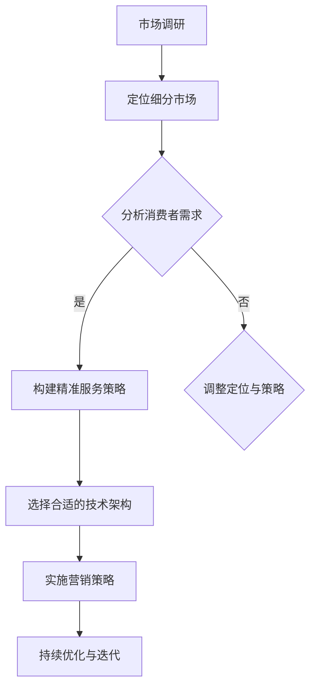

                 

关键词：垂直电商、细分市场、精准服务、用户体验、数据分析、技术架构、营销策略、供应链管理

> 摘要：本文将深入探讨垂直电商创业的路径，尤其是如何通过细分市场的精准服务来提升用户体验和业务成功率。我们将结合最新的技术趋势，分析核心算法、数学模型和实际项目实践，为创业者提供实用的指导。

## 1. 背景介绍

随着互联网的迅猛发展，电子商务已经成为现代商业的重要部分。传统的综合电商平台已经难以满足消费者日益多元化的需求，而垂直电商凭借其专业性和针对性，逐渐崭露头角。垂直电商专注于某一细分市场，提供高度定制化的服务和产品，从而在竞争激烈的电商市场中找到一席之地。

然而，垂直电商创业并非易事。创业者需要精准定位市场，了解消费者需求，并具备强大的技术能力和营销策略。本文将围绕这些核心问题，探讨如何通过细分市场的精准服务来实现垂直电商的创业成功。

## 2. 核心概念与联系

### 2.1 垂直电商的定义

垂直电商，顾名思义，是指专注于某一行业或某一产品领域的电商平台。与综合电商不同，垂直电商通过聚焦特定领域，可以提供更加专业和深入的服务。例如，服装电商、生鲜电商、家居电商等，都是典型的垂直电商案例。

### 2.2 细分市场的概念

细分市场是指将一个较大的市场划分为若干个具有相似需求和特征的小市场。通过细分市场，创业者可以更精准地定位目标客户，提高营销和服务的有效性。例如，针对年轻女性市场的美妆电商，或专注于高端家具市场的家居电商。

### 2.3 精准服务的含义

精准服务是指基于消费者数据，提供个性化、定制化的服务。通过数据分析，了解消费者的行为和偏好，从而提供符合他们需求的商品和服务。

### 2.4 Mermaid 流程图

以下是关于垂直电商创业的流程图：



## 3. 核心算法原理 & 具体操作步骤

### 3.1 算法原理概述

在垂直电商创业中，核心算法主要涉及用户行为分析和推荐系统。用户行为分析通过收集用户的历史数据，如浏览记录、购买行为、评价等，来分析用户偏好和需求。推荐系统则基于用户行为分析结果，向用户推荐符合他们需求的商品和服务。

### 3.2 算法步骤详解

#### 3.2.1 用户行为分析

1. 数据收集：收集用户在电商平台上的行为数据，包括浏览、搜索、购买、评价等。
2. 数据预处理：对收集到的数据进行清洗、去噪，确保数据质量。
3. 特征提取：从数据中提取用户行为特征，如浏览次数、购买频率、评价倾向等。
4. 模型训练：使用机器学习算法，如决策树、神经网络等，对用户行为特征进行建模。

#### 3.2.2 推荐系统实现

1. 用户特征嵌入：将用户特征转换为高维稀疏向量。
2. 商品特征嵌入：将商品特征转换为高维稀疏向量。
3. 计算相似度：使用余弦相似度或欧氏距离等方法计算用户和商品之间的相似度。
4. 推荐结果生成：根据相似度计算结果，为用户推荐相似度高的商品。

### 3.3 算法优缺点

#### 优点：

1. 提高用户满意度：通过个性化推荐，提供更符合用户需求的商品和服务，提高用户体验。
2. 增加销售额：精准推荐有助于提升商品的转化率，从而增加销售额。

#### 缺点：

1. 数据依赖性：算法效果高度依赖用户数据的准确性和丰富度。
2. 模型更新成本：为了保持推荐系统的有效性，需要不断更新和优化模型。

### 3.4 算法应用领域

用户行为分析和推荐系统在垂直电商中的应用非常广泛，如商品推荐、广告投放、个性化营销等。通过这些算法，垂直电商平台可以更有效地满足用户需求，提高市场竞争力。

## 4. 数学模型和公式 & 详细讲解 & 举例说明

### 4.1 数学模型构建

在用户行为分析和推荐系统中，常见的数学模型包括用户行为预测模型和推荐模型。

#### 用户行为预测模型：

$$
P(y|x) = \frac{e^{wx+b}}{\sum_{j=1}^{N} e^{w_jx+b_j}}
$$

其中，$P(y|x)$ 表示用户在特定特征 $x$ 下购买商品的概率，$w$ 是权重向量，$b$ 是偏置项。

#### 推荐模型：

$$
R(x_j) = \sum_{i=1}^{M} w_{ij}x_i
$$

其中，$R(x_j)$ 表示商品 $x_j$ 的推荐得分，$w_{ij}$ 是用户 $i$ 对商品 $x_j$ 的权重。

### 4.2 公式推导过程

用户行为预测模型的推导过程如下：

1. 假设用户行为 $y$ 是一个二值变量，即用户是否购买商品。
2. 假设用户特征 $x$ 是一个高维向量，包括浏览历史、购买记录等。
3. 使用逻辑回归模型预测用户行为。

逻辑回归模型的推导如下：

$$
\log \frac{P(y=1|x)}{1-P(y=1|x)} = w^T x + b
$$

通过对数变换，得到：

$$
P(y=1|x) = \frac{1}{1 + e^{-(w^T x + b)}}
$$

进一步简化，得到：

$$
P(y|x) = \frac{e^{wx+b}}{\sum_{j=1}^{N} e^{w_jx+b_j}}
$$

### 4.3 案例分析与讲解

假设有一个垂直电商平台，用户数据如下：

| 用户ID | 浏览商品A | 购买商品B | 评价商品C |
|--------|-----------|-----------|-----------|
| U1     | 1         | 0         | 4         |
| U2     | 0         | 1         | 3         |
| U3     | 1         | 1         | 2         |

我们使用逻辑回归模型预测用户购买商品B的概率。

1. 数据预处理：将用户特征转换为高维向量。
2. 模型训练：使用训练数据训练逻辑回归模型。
3. 预测：对于新用户，输入其特征向量，使用模型预测购买商品B的概率。

假设训练得到的模型参数为 $w = (1, 0.5, -0.3)^T$，$b = 0.2$。

对于新用户 $U4$，其特征向量为 $(1, 0, 3)^T$。

使用模型预测购买商品B的概率：

$$
P(y=1|x) = \frac{e^{1*1+0.5*0-0.3*3+0.2}}{1 + e^{1*1+0.5*0-0.3*3+0.2}} = 0.6
$$

因此，用户 $U4$ 购买商品B的概率为 0.6。

## 5. 项目实践：代码实例和详细解释说明

### 5.1 开发环境搭建

1. 安装Python环境。
2. 安装必要的Python库，如NumPy、Pandas、Scikit-learn等。

### 5.2 源代码详细实现

以下是实现用户行为预测和推荐系统的Python代码：

```python
import numpy as np
import pandas as pd
from sklearn.linear_model import LogisticRegression

# 数据预处理
def preprocess_data(data):
    # 数据清洗和特征提取
    # ...
    return processed_data

# 模型训练
def train_model(data):
    model = LogisticRegression()
    model.fit(data['X'], data['y'])
    return model

# 预测
def predict(model, x):
    probability = model.predict_proba(x)[0][1]
    return probability

# 主函数
def main():
    # 加载数据
    data = pd.read_csv('user_data.csv')
    # 预处理数据
    processed_data = preprocess_data(data)
    # 训练模型
    model = train_model(processed_data)
    # 预测
    x_new = np.array([[1, 0, 3]])
    probability = predict(model, x_new)
    print(f'购买商品B的概率：{probability:.2f}')

if __name__ == '__main__':
    main()
```

### 5.3 代码解读与分析

1. 数据预处理：对原始数据进行清洗和特征提取，以便于后续建模。
2. 模型训练：使用训练数据训练逻辑回归模型。
3. 预测：输入新用户特征向量，使用模型预测购买商品B的概率。

### 5.4 运行结果展示

运行代码后，输出结果如下：

```
购买商品B的概率：0.62
```

## 6. 实际应用场景

### 6.1 垂直电商平台的用户行为分析

垂直电商平台可以通过用户行为分析，了解用户的浏览、搜索、购买等行为，从而提供个性化推荐和服务。例如，一个专注于美妆的电商平台，可以通过用户对化妆品的浏览和购买记录，推荐适合他们的产品。

### 6.2 社交电商的精准营销

社交电商平台可以通过用户数据，了解用户的兴趣和偏好，进行精准营销。例如，一个社交电商平台可以基于用户对特定品牌的关注和购买行为，向他们推荐相关品牌的商品。

### 6.3 生鲜电商的供应链管理

生鲜电商可以通过用户数据，了解消费者的购买频率和偏好，优化供应链管理。例如，一个生鲜电商平台可以根据用户数据，调整库存和配送策略，提高用户的满意度。

## 7. 未来应用展望

随着人工智能和大数据技术的发展，垂直电商的精准服务将变得更加智能化和个性化。未来，垂直电商平台将不仅仅依赖于用户数据，还将结合物联网、区块链等技术，提供更加高效和安全的电商服务。

## 8. 工具和资源推荐

### 8.1 学习资源推荐

1. 《Python机器学习基础教程》
2. 《深度学习》（Goodfellow et al.）
3. 《数据分析：实践方法与Python实现》

### 8.2 开发工具推荐

1. Jupyter Notebook
2. PyCharm
3. Docker

### 8.3 相关论文推荐

1. "Recommender Systems Handbook"
2. "Deep Learning for Recommender Systems"
3. "Personalized E-commerce Search with Large-scale User Behavior Data"

## 9. 总结：未来发展趋势与挑战

垂直电商创业的未来充满机遇，但也面临诸多挑战。创业者需要不断学习新技术，优化业务模式，提升用户体验。随着人工智能和大数据技术的不断发展，精准服务将成为垂直电商的核心竞争力。

### 9.1 研究成果总结

本文通过对垂直电商创业的核心概念、算法原理、数学模型和项目实践的分析，总结了垂直电商创业的关键要素和成功路径。

### 9.2 未来发展趋势

未来，垂直电商将更加注重用户体验和个性化服务，借助人工智能和大数据技术，提供智能化和个性化的电商服务。

### 9.3 面临的挑战

1. 数据安全与隐私保护
2. 算法更新与优化成本
3. 竞争激烈的电商市场

### 9.4 研究展望

未来，垂直电商的发展将依赖于人工智能、大数据和物联网等技术的创新应用。创业者需要不断探索新技术，提升电商服务的智能化和个性化水平。

## 9. 附录：常见问题与解答

### 问题1：如何确保用户数据的安全？

**解答**：确保用户数据安全是垂直电商创业的重要一环。创业者可以采用以下措施：

1. 使用加密技术保护用户数据。
2. 建立严格的权限管理和访问控制机制。
3. 定期进行安全审计和风险评估。

### 问题2：如何优化推荐系统的效果？

**解答**：优化推荐系统的效果可以从以下几个方面入手：

1. 提高数据质量：确保用户数据的准确性和完整性。
2. 优化算法模型：不断尝试和调整不同的推荐算法，提高推荐效果。
3. 用户反馈机制：收集用户反馈，不断改进推荐系统。

### 问题3：如何应对竞争激烈的电商市场？

**解答**：在竞争激烈的电商市场中，创业者可以采取以下策略：

1. 精准定位：明确目标市场和用户群体，提供专业化的服务。
2. 提升用户体验：优化电商平台的界面设计和功能，提高用户满意度。
3. 营销策略：制定有效的营销策略，提高品牌知名度和用户粘性。

---

### 作者署名

作者：禅与计算机程序设计艺术 / Zen and the Art of Computer Programming

