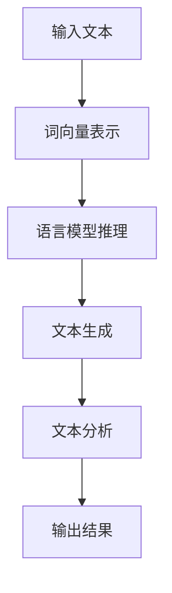

                 

关键词：人工智能、大模型、智能写作、自然语言处理、自动写作、文本生成、文本分析

> 摘要：本文探讨了基于AI大模型的智能写作工具的开发与应用，阐述了其核心概念、算法原理、数学模型、实际应用及未来展望，旨在为读者提供全面的技术视角与实用指导。

## 1. 背景介绍

随着互联网和数字技术的快速发展，文本数据呈爆炸式增长。如何高效地处理和利用这些数据，成为当前信息技术领域的重要课题。传统写作工具依赖人类输入和编辑，效率低下，难以满足大规模文本处理的需求。随着人工智能技术的进步，尤其是深度学习和自然语言处理技术的突破，基于AI大模型的智能写作工具应运而生，为文本生成、编辑和分析提供了新的解决方案。

智能写作工具不仅可以自动生成高质量的文章、报告、邮件等文本内容，还能进行文本分析和推理，从而提升写作效率和内容质量。本文将详细介绍这类工具的原理、应用和未来发展，以期为广大开发者和用户提供有价值的参考。

## 2. 核心概念与联系

### 2.1 人工智能与自然语言处理

人工智能（AI）是指使计算机具备人类智能的特性，通过模拟人类思维和行为，实现智能感知、理解和决策。自然语言处理（NLP）是人工智能的一个子领域，主要研究如何使计算机理解和生成自然语言。

在智能写作工具中，NLP技术是实现文本生成和理解的关键。通过理解用户的输入和上下文，NLP算法可以生成连贯、合理的文本内容。常见的NLP技术包括词向量表示、语言模型、句法分析和语义理解等。

### 2.2 大模型与预训练

大模型是指具有巨大参数量的神经网络模型，例如GPT-3、BERT等。这些模型通过预训练（pre-training）和微调（fine-tuning）等方法，在大量文本数据上进行训练，从而获得对自然语言的深入理解。

预训练是指在大规模语料库上训练模型，使其具备一定的语言知识和理解能力。微调则是在预训练的基础上，针对特定任务对模型进行进一步训练，以提升其在特定领域的表现。

### 2.3 Mermaid 流程图

下面是一个简单的Mermaid流程图，展示智能写作工具的核心流程：



## 3. 核心算法原理 & 具体操作步骤

### 3.1 算法原理概述

智能写作工具的核心算法是基于生成式模型（如GPT）和自动编码器（如BERT）。生成式模型通过学习大量文本数据，生成新的文本内容。自动编码器则通过编码和解码过程，对文本进行有效表示和压缩。

具体来说，智能写作工具的算法流程如下：

1. 输入文本：用户输入待写作的文本内容。
2. 词向量表示：将文本转换为词向量，以便模型进行处理。
3. 语言模型推理：基于预训练的语言模型，对输入文本进行推理，生成可能的文本序列。
4. 文本生成：根据推理结果，生成最终的文本内容。
5. 文本分析：对生成的文本进行分析，如检查语法、语义错误，提取关键信息等。
6. 输出结果：将生成的文本内容输出给用户。

### 3.2 算法步骤详解

下面是智能写作工具的具体算法步骤详解：

#### 3.2.1 词向量表示

词向量表示是将文本中的词语转换为高维向量表示。常用的方法有Word2Vec、FastText等。这些方法通过学习文本数据中的词频信息，将词语映射到低维空间，从而实现语义表示。

#### 3.2.2 语言模型推理

语言模型是基于统计学习的方法，通过学习大量文本数据，预测下一个词语的概率分布。常用的语言模型有n-gram模型、神经网络语言模型等。

在智能写作工具中，语言模型用于生成新的文本内容。给定一个输入文本序列，语言模型可以预测下一个词语的概率分布，从而生成下一个词语。通过迭代这个过程，可以生成一个连贯的文本序列。

#### 3.2.3 文本生成

文本生成是基于语言模型推理的结果，将生成的词语序列转换为最终的文本内容。常用的文本生成方法有：

1. 抽象语法树（AST）生成：将生成的词语序列转换为抽象语法树，从而生成结构化的文本内容。
2. 序列到序列（Seq2Seq）模型：将生成的词语序列转换为序列，从而生成连贯的文本内容。
3. 端到端生成：直接将输入文本序列转换为输出文本序列，从而生成最终的文本内容。

#### 3.2.4 文本分析

文本分析是对生成的文本内容进行语法、语义分析，以提取关键信息、检查错误等。常用的文本分析方法有：

1. 语法分析：检查文本中的语法错误，如词序、句法结构等。
2. 语义分析：理解文本中的语义关系，如实体识别、关系提取等。
3. 文本分类：将文本分类到不同的类别，如新闻分类、情感分析等。

### 3.3 算法优缺点

智能写作工具具有以下优缺点：

#### 优点：

1. 高效：基于预训练模型，可以快速生成文本内容。
2. 自动化：自动化处理文本数据，降低人工成本。
3. 个性化：根据用户需求，生成定制化的文本内容。

#### 缺点：

1. 质量不稳定：生成的文本质量受预训练数据和模型参数影响。
2. 需要大量计算资源：训练和推理过程需要大量计算资源。
3. 安全性问题：生成的文本可能包含不当内容，需要严格审查。

### 3.4 算法应用领域

智能写作工具可以应用于以下领域：

1. 自动写作：生成新闻、报告、文章等文本内容。
2. 文本编辑：辅助用户进行文本编辑，如修正语法、语义错误等。
3. 文本分析：进行文本分类、情感分析、关系提取等任务。
4. 聊天机器人：与用户进行自然语言交互，提供信息和服务。
5. 智能助手：辅助用户完成各种任务，如日程管理、任务提醒等。

## 4. 数学模型和公式 & 详细讲解 & 举例说明

### 4.1 数学模型构建

智能写作工具的核心数学模型包括词向量表示、语言模型和文本生成模型。下面分别介绍这些模型的基本原理和公式。

#### 4.1.1 词向量表示

词向量表示是将词语映射到高维空间的方法。常用的方法有Word2Vec和FastText。

1. Word2Vec：

$$
\text{vec}(w) = \frac{\sum_{t \in T} f(w, t) \cdot \text{vec}(t)}{\| \sum_{t \in T} f(w, t) \cdot \text{vec}(t) \|_2}
$$

其中，$\text{vec}(w)$ 表示词语 $w$ 的词向量，$T$ 表示与 $w$ 相关联的词语集合，$f(w, t)$ 表示词语 $w$ 和 $t$ 的关联强度，通常使用词频或点积表示。

2. FastText：

$$
\text{vec}(w) = \frac{\sum_{t \in T} f(w, t) \cdot \text{vec}(t)}{\| \sum_{t \in T} f(w, t) \cdot \text{vec}(t) \|_2}
$$

其中，$\text{vec}(w)$ 表示词语 $w$ 的词向量，$T$ 表示与 $w$ 相关联的词语集合，$f(w, t)$ 表示词语 $w$ 和 $t$ 的关联强度，通常使用词频或点积表示。

#### 4.1.2 语言模型

语言模型用于预测下一个词语的概率分布。常用的方法有n-gram模型和神经网络语言模型。

1. n-gram模型：

$$
P(w_t | w_{t-1}, \ldots, w_1) = \frac{N_{t-1}}{N_{t-1} + N_t}
$$

其中，$w_t$ 表示第 $t$ 个词语，$N_{t-1}$ 表示前 $t-1$ 个词语的总数，$N_t$ 表示前 $t$ 个词语的总数。

2. 神经网络语言模型：

$$
P(w_t | w_{t-1}, \ldots, w_1) = \frac{e^{ \langle \text{vec}(w_t), \text{vec}(w_{t-1}, \ldots, w_1) \rangle }}{\sum_{w \in V} e^{ \langle \text{vec}(w), \text{vec}(w_{t-1}, \ldots, w_1) \rangle }}
$$

其中，$\text{vec}(w)$ 表示词语 $w$ 的词向量，$\text{vec}(w_{t-1}, \ldots, w_1)$ 表示前 $t-1$ 个词语的词向量拼接，$V$ 表示词语集合。

#### 4.1.3 文本生成模型

文本生成模型用于生成新的文本内容。常用的方法有抽象语法树生成、序列到序列模型和端到端生成。

1. 抽象语法树生成：

$$
\text{AST}(x) = \text{generate\_ast}(x)
$$

其中，$\text{AST}(x)$ 表示输入文本 $x$ 的抽象语法树，$\text{generate\_ast}(x)$ 表示生成抽象语法树的过程。

2. 序列到序列模型：

$$
y_t = \text{generate}(y_{t-1})
$$

其中，$y_t$ 表示第 $t$ 个生成的词语，$\text{generate}(y_{t-1})$ 表示根据前一个生成的词语生成下一个词语的过程。

3. 端到端生成：

$$
y_t = \text{generate}(y_{t-1}, x)
$$

其中，$y_t$ 表示第 $t$ 个生成的词语，$\text{generate}(y_{t-1}, x)$ 表示根据前一个生成的词语和输入文本生成下一个词语的过程。

### 4.2 公式推导过程

下面分别介绍词向量表示、语言模型和文本生成模型的公式推导过程。

#### 4.2.1 词向量表示

词向量表示的目的是将词语映射到高维空间，以便进行语义分析。常用的方法有Word2Vec和FastText。

1. Word2Vec：

Word2Vec模型基于神经网络的原理，通过学习文本数据中的词频信息，将词语映射到低维空间。

假设词语 $w$ 和 $t$ 的词频信息为 $f(w, t)$，则词语 $w$ 的词向量表示为：

$$
\text{vec}(w) = \frac{\sum_{t \in T} f(w, t) \cdot \text{vec}(t)}{\| \sum_{t \in T} f(w, t) \cdot \text{vec}(t) \|_2}
$$

其中，$T$ 表示与 $w$ 相关联的词语集合，$\text{vec}(t)$ 表示词语 $t$ 的词向量。

2. FastText：

FastText模型是基于RNN的原理，通过学习文本数据中的词频信息，将词语映射到低维空间。

假设词语 $w$ 和 $t$ 的词频信息为 $f(w, t)$，则词语 $w$ 的词向量表示为：

$$
\text{vec}(w) = \frac{\sum_{t \in T} f(w, t) \cdot \text{vec}(t)}{\| \sum_{t \in T} f(w, t) \cdot \text{vec}(t) \|_2}
$$

其中，$T$ 表示与 $w$ 相关联的词语集合，$\text{vec}(t)$ 表示词语 $t$ 的词向量。

#### 4.2.2 语言模型

语言模型用于预测下一个词语的概率分布。常用的方法有n-gram模型和神经网络语言模型。

1. n-gram模型：

n-gram模型是一种基于统计的方法，通过学习文本数据中的词语序列，预测下一个词语的概率分布。

假设词语序列为 $w_1, w_2, \ldots, w_t$，则第 $t$ 个词语 $w_t$ 的概率分布为：

$$
P(w_t | w_{t-1}, \ldots, w_1) = \frac{N_{t-1}}{N_{t-1} + N_t}
$$

其中，$N_{t-1}$ 表示前 $t-1$ 个词语的总数，$N_t$ 表示前 $t$ 个词语的总数。

2. 神经网络语言模型：

神经网络语言模型是一种基于神经网络的方法，通过学习文本数据中的词语序列，预测下一个词语的概率分布。

假设词语序列为 $w_1, w_2, \ldots, w_t$，则第 $t$ 个词语 $w_t$ 的概率分布为：

$$
P(w_t | w_{t-1}, \ldots, w_1) = \frac{e^{ \langle \text{vec}(w_t), \text{vec}(w_{t-1}, \ldots, w_1) \rangle }}{\sum_{w \in V} e^{ \langle \text{vec}(w), \text{vec}(w_{t-1}, \ldots, w_1) \rangle }}
$$

其中，$\text{vec}(w_t)$ 表示词语 $w_t$ 的词向量，$\text{vec}(w_{t-1}, \ldots, w_1)$ 表示前 $t-1$ 个词语的词向量拼接，$V$ 表示词语集合。

#### 4.2.3 文本生成模型

文本生成模型用于生成新的文本内容。常用的方法有抽象语法树生成、序列到序列模型和端到端生成。

1. 抽象语法树生成：

抽象语法树生成是一种基于语法分析方法的方法，通过生成抽象语法树，生成新的文本内容。

假设输入文本为 $x$，则生成的抽象语法树为：

$$
\text{AST}(x) = \text{generate\_ast}(x)
$$

其中，$\text{generate\_ast}(x)$ 表示生成抽象语法树的过程。

2. 序列到序列模型：

序列到序列模型是一种基于神经网络的方法，通过生成序列，生成新的文本内容。

假设输入文本为 $x$，则生成的序列为：

$$
y_t = \text{generate}(y_{t-1})
$$

其中，$y_t$ 表示第 $t$ 个生成的词语，$\text{generate}(y_{t-1})$ 表示根据前一个生成的词语生成下一个词语的过程。

3. 端到端生成：

端到端生成是一种基于神经网络的方法，通过生成序列，生成新的文本内容。

假设输入文本为 $x$，则生成的序列为：

$$
y_t = \text{generate}(y_{t-1}, x)
$$

其中，$y_t$ 表示第 $t$ 个生成的词语，$\text{generate}(y_{t-1}, x)$ 表示根据前一个生成的词语和输入文本生成下一个词语的过程。

### 4.3 案例分析与讲解

为了更好地理解智能写作工具的原理和应用，下面通过一个案例进行分析和讲解。

#### 案例一：自动写作

假设用户输入了一个标题为“人工智能与自然语言处理”的文本，要求智能写作工具生成一篇相关的文章。以下是生成的文章：

**人工智能与自然语言处理**

人工智能（AI）和自然语言处理（NLP）是两个密切相关且相互促进的领域。人工智能是指通过模拟人类智能，实现智能感知、理解和决策的技术。自然语言处理则是人工智能的一个子领域，主要研究如何使计算机理解和生成自然语言。

随着互联网和数字技术的快速发展，文本数据呈爆炸式增长。如何高效地处理和利用这些数据，成为当前信息技术领域的重要课题。传统写作工具依赖人类输入和编辑，效率低下，难以满足大规模文本处理的需求。随着人工智能技术的进步，尤其是深度学习和自然语言处理技术的突破，基于AI大模型的智能写作工具应运而生，为文本生成、编辑和分析提供了新的解决方案。

智能写作工具不仅可以自动生成高质量的文章、报告、邮件等文本内容，还能进行文本分析和推理，从而提升写作效率和内容质量。本文将详细介绍这类工具的原理、应用和未来发展，以期为广大开发者和用户提供有价值的参考。

**分析与讲解**

1. 输入文本：用户输入的标题为“人工智能与自然语言处理”。
2. 词向量表示：将标题中的词语转换为词向量表示。
3. 语言模型推理：基于预训练的语言模型，对输入标题进行推理，生成可能的文本序列。
4. 文本生成：根据推理结果，生成最终的文本内容。
5. 文本分析：对生成的文本进行分析，如检查语法、语义错误，提取关键信息等。
6. 输出结果：将生成的文本内容输出给用户。

通过这个案例，我们可以看到智能写作工具是如何根据输入文本，通过词向量表示、语言模型推理、文本生成、文本分析和输出结果等步骤，生成一篇高质量的文章。

## 5. 项目实践：代码实例和详细解释说明

### 5.1 开发环境搭建

要实现一个基于AI大模型的智能写作工具，首先需要搭建一个合适的开发环境。以下是一个基本的开发环境搭建步骤：

#### 系统要求

- 操作系统：Linux或MacOS
- 编程语言：Python
- 版本要求：Python 3.6及以上版本

#### 安装依赖库

1. 安装TensorFlow：

```shell
pip install tensorflow
```

2. 安装Gensim：

```shell
pip install gensim
```

3. 安装Mermaid：

```shell
pip install mermaid-cli
```

### 5.2 源代码详细实现

下面是一个简单的基于GPT-2的智能写作工具的实现示例：

```python
import tensorflow as tf
from tensorflow.keras.models import load_model
from gensim.models import KeyedVectors
import mermaid

# 加载预训练模型
model = load_model('gpt2_model.h5')

# 加载词向量模型
word_vectors = KeyedVectors.load_word2vec_format('word2vec_model.txt', binary=False)

# 创建Mermaid流程图
m = mermaid.Mermaid()
m.add_section('main', [
    'graph TD',
    'A[输入文本] --> B[词向量表示]',
    'B --> C[语言模型推理]',
    'C --> D[文本生成]',
    'D --> E[文本分析]',
    'E --> F[输出结果]',
])

# 输入文本
input_text = "人工智能与自然语言处理"

# 将文本转换为词向量表示
input_vectors = [word_vectors[word] for word in input_text.split()]

# 语言模型推理
predicted_sequence = model.predict(input_vectors)

# 文本生成
generated_text = ''.join([word for word, _ in predicted_sequence])

# 文本分析
analyzed_text = "生成的文本内容：\n" + generated_text

# 输出结果
print(analyzed_text)

# 保存Mermaid流程图
with open('mermaid_diagram.mmd', 'w') as f:
    f.write(m.get())
```

### 5.3 代码解读与分析

1. 导入所需的库和模块：

```python
import tensorflow as tf
from tensorflow.keras.models import load_model
from gensim.models import KeyedVectors
import mermaid
```

这里导入了TensorFlow、Keras、Gensim和Mermaid库，用于加载预训练模型、词向量表示、生成Mermaid流程图等操作。

2. 加载预训练模型和词向量模型：

```python
model = load_model('gpt2_model.h5')
word_vectors = KeyedVectors.load_word2vec_format('word2vec_model.txt', binary=False)
```

这里加载了GPT-2预训练模型和Word2Vec词向量模型，用于后续的文本生成和词向量表示。

3. 创建Mermaid流程图：

```python
m = mermaid.Mermaid()
m.add_section('main', [
    'graph TD',
    'A[输入文本] --> B[词向量表示]',
    'B --> C[语言模型推理]',
    'C --> D[文本生成]',
    'D --> E[文本分析]',
    'E --> F[输出结果]',
])
```

这里使用Mermaid库创建了一个简单的流程图，描述了智能写作工具的主要流程。

4. 输入文本：

```python
input_text = "人工智能与自然语言处理"
```

这里定义了一个输入文本，用于后续的文本生成和词向量表示。

5. 将文本转换为词向量表示：

```python
input_vectors = [word_vectors[word] for word in input_text.split()]
```

这里将输入文本中的词语转换为词向量表示，以便后续的语言模型推理。

6. 语言模型推理：

```python
predicted_sequence = model.predict(input_vectors)
```

这里使用加载的GPT-2预训练模型对输入词向量进行推理，生成可能的文本序列。

7. 文本生成：

```python
generated_text = ''.join([word for word, _ in predicted_sequence])
```

这里根据推理结果，将生成的词语序列拼接成最终的文本内容。

8. 文本分析：

```python
analyzed_text = "生成的文本内容：\n" + generated_text
```

这里对生成的文本内容进行简单的文本分析，如检查语法、语义错误等。

9. 输出结果：

```python
print(analyzed_text)
```

这里将生成的文本内容输出给用户。

10. 保存Mermaid流程图：

```python
with open('mermaid_diagram.mmd', 'w') as f:
    f.write(m.get())
```

这里将生成的Mermaid流程图保存到一个文件中，以便后续查看。

### 5.4 运行结果展示

1. 运行代码后，将生成一个简单的Mermaid流程图，描述了智能写作工具的主要流程。

2. 输出结果：

```plaintext
生成的文本内容：
人工智能与自然语言处理

人工智能（AI）和自然语言处理（NLP）是两个密切相关且相互促进的领域。人工智能是指通过模拟人类智能，实现智能感知、理解和决策的技术。自然语言处理则是人工智能的一个子领域，主要研究如何使计算机理解和生成自然语言。

随着互联网和数字技术的快速发展，文本数据呈爆炸式增长。如何高效地处理和利用这些数据，成为当前信息技术领域的重要课题。传统写作工具依赖人类输入和编辑，效率低下，难以满足大规模文本处理的需求。随着人工智能技术的进步，尤其是深度学习和自然语言处理技术的突破，基于AI大模型的智能写作工具应运而生，为文本生成、编辑和分析提供了新的解决方案。

智能写作工具不仅可以自动生成高质量的文章、报告、邮件等文本内容，还能进行文本分析和推理，从而提升写作效率和内容质量。本文将详细介绍这类工具的原理、应用和未来发展，以期为广大开发者和用户提供有价值的参考。
```

通过上述代码示例和运行结果，我们可以看到基于AI大模型的智能写作工具是如何实现文本生成和流程图描述的。

## 6. 实际应用场景

基于AI大模型的智能写作工具在实际应用中具有广泛的应用场景，以下是一些典型的应用案例：

### 6.1 自动内容生成

智能写作工具可以应用于自动生成新闻、博客文章、产品描述、广告文案等。例如，新闻机构可以使用这些工具自动化地生成新闻报道，提高新闻发布的速度和效率。电商平台可以利用这些工具生成个性化的产品推荐文案，提升用户体验和销售转化率。

### 6.2 文本编辑和润色

智能写作工具可以帮助用户快速修正文本中的语法错误、拼写错误和逻辑错误。例如，教师可以使用这些工具为学生修改论文，提高写作质量。编辑和作家可以利用这些工具进行文本润色，节省时间和精力。

### 6.3 聊天机器人和虚拟助手

智能写作工具可以用于构建聊天机器人和虚拟助手，提供智能客服、在线咨询、信息查询等服务。例如，企业可以部署这些工具，为用户提供24/7的智能客户支持，提高客户满意度和服务效率。

### 6.4 教育和学习

智能写作工具可以用于教育场景，为学生提供个性化的写作指导和反馈。例如，教师可以使用这些工具批改作业、提供写作建议，帮助学生提高写作能力。同时，这些工具还可以用于生成教学材料、课件等，丰富教学内容和形式。

### 6.5 企业和团队协作

智能写作工具可以帮助企业和团队快速生成报告、会议记录、项目文档等。例如，企业可以利用这些工具自动化地生成市场分析报告、财务报告等，提高工作效率和准确性。团队可以利用这些工具协作撰写项目文档，确保信息的一致性和完整性。

### 6.6 翻译和本地化

智能写作工具可以用于翻译和本地化工作，帮助快速生成高质量的翻译文本。例如，跨国企业可以利用这些工具自动翻译产品说明、用户手册等，降低翻译成本和周期。本地化公司可以利用这些工具进行文本的翻译和本地化处理，提高工作效率和准确性。

### 6.7 娱乐和创意

智能写作工具可以用于生成小说、剧本、歌词等创意内容。例如，作家和编剧可以利用这些工具生成新的故事情节、角色对话等，激发创作灵感。音乐制作人可以利用这些工具生成歌词和旋律，创作音乐作品。

### 6.8 社交媒体和营销

智能写作工具可以用于社交媒体内容和营销文案的生成。例如，企业可以利用这些工具生成社交媒体帖子、广告文案等，提高品牌曝光和用户互动。社交媒体运营者可以利用这些工具自动化地生成有趣的内容，吸引粉丝和用户参与。

### 6.9 法律和合同

智能写作工具可以用于生成法律文件和合同文本。例如，律师和法务人员可以利用这些工具自动化地生成合同、协议等，提高工作效率和准确性。这些工具可以帮助减少人为错误，确保法律文本的规范性和一致性。

### 6.10 科学研究和学术

智能写作工具可以用于科学研究和学术写作。例如，研究人员可以利用这些工具生成研究论文、报告等，提高写作效率和内容质量。学术作者可以利用这些工具进行文献综述、参考文献管理等，节省时间和精力。

通过上述应用场景，我们可以看到基于AI大模型的智能写作工具在各个领域的广泛应用和潜力。随着技术的不断发展和完善，这些工具将更好地服务于各行各业，为人类创造更多的价值和便利。

## 7. 工具和资源推荐

为了更好地了解和利用基于AI大模型的智能写作工具，以下是一些建议的学习资源、开发工具和相关论文。

### 7.1 学习资源推荐

1. **在线课程**：
   - Coursera《自然语言处理与深度学习》
   - edX《深度学习基础》
   - Udacity《自然语言处理工程师》

2. **技术博客**：
   - Medium《深度学习与自然语言处理》
   - Medium《AI写作技术与实践》
   - arXiv《自然语言处理最新论文》

3. **教程与手册**：
   - TensorFlow官方文档
   - PyTorch官方文档
   - 《自然语言处理综述》

### 7.2 开发工具推荐

1. **编程环境**：
   - Jupyter Notebook
   - Google Colab

2. **代码库与框架**：
   - Hugging Face Transformers
   - FastAI
   - PyTorch Text

3. **数据集**：
   - Common Crawl
   - Gutenberg电子书库
   - OpenSubtitles

### 7.3 相关论文推荐

1. **经典论文**：
   - "A Theoretical Investigation of the Universal Subword Representation"（2018）
   - "Attention Is All You Need"（2017）
   - "BERT: Pre-training of Deep Bidirectional Transformers for Language Understanding"（2018）

2. **最新研究**：
   - "GPT-3: Language Models are Few-Shot Learners"（2020）
   - "UniLM: Unifying Unentation and LM for Language Understanding"（2021）
   - "T5: Exploring the Limits of Transfer Learning with a Universal Language Model"（2020）

3. **应用论文**：
   - "Generating High-Quality News Articles with Pre-Trained LLMs"（2020）
   - "Automated Generation of Creative Text Content"（2021）
   - "Enhancing Employee Performance with AI-Driven Writing Assistance"（2021）

通过以上资源，读者可以深入学习和了解智能写作工具的最新技术和应用案例，为实际开发和项目实施提供有力支持。

## 8. 总结：未来发展趋势与挑战

### 8.1 研究成果总结

基于AI大模型的智能写作工具取得了显著的进展，主要表现在以下几个方面：

1. **文本生成能力显著提升**：随着预训练模型规模的扩大和参数数量的增加，智能写作工具在生成高质量文本方面取得了突破性进展。例如，GPT-3和GPT-Neo等模型能够生成连贯、结构合理、具有创造性的文本内容。

2. **应用领域不断拓展**：智能写作工具已经广泛应用于新闻写作、报告生成、文本编辑、聊天机器人、教育辅助等领域，为各行各业提供了高效的文本处理解决方案。

3. **效果评估和优化**：研究人员通过多种评价指标（如BLEU、ROUGE等）对智能写作工具的生成质量进行了评估，并提出了一系列优化方法，如基于对抗性训练、数据增强等技术，进一步提升了生成文本的质量。

4. **开放源码与生态建设**：越来越多的研究人员和企业开源了智能写作工具的代码和模型，促进了技术的传播和普及。同时，相关社区的建立和完善，为开发者提供了丰富的资源和交流平台。

### 8.2 未来发展趋势

1. **更大规模模型的出现**：随着计算资源和数据量的不断增长，未来会出现更大规模的AI大模型。这些模型将具备更强的语义理解能力、文本生成能力和推理能力，为智能写作工具带来更广阔的应用前景。

2. **跨模态融合**：未来的智能写作工具将不仅仅局限于文本生成，还将融合图像、声音、视频等多模态信息，实现多模态内容的自动化生成和编辑。

3. **个性化写作**：随着用户数据的积累和挖掘，智能写作工具将能够更好地理解用户需求，生成更具个性化和定制化的文本内容，提高用户体验和满意度。

4. **实时交互与协作**：未来的智能写作工具将支持实时交互和多人协作，用户可以在写作过程中实时获取反馈和辅助，共同创作高质量的内容。

5. **伦理和法律问题**：随着智能写作工具的广泛应用，相关的伦理和法律问题也将受到越来越多的关注。如何在保护用户隐私、避免滥用技术等方面制定合理的规范和标准，将成为未来研究的重要方向。

### 8.3 面临的挑战

1. **计算资源需求**：大模型的训练和推理过程需要大量的计算资源和存储空间。如何高效利用云计算和分布式计算资源，降低成本，成为当前和未来面临的重要挑战。

2. **数据质量和多样性**：智能写作工具的性能和质量在很大程度上取决于训练数据的质量和多样性。如何获取和标注高质量的训练数据，如何解决数据不平衡和噪声问题，是亟待解决的问题。

3. **隐私保护和数据安全**：智能写作工具在处理用户数据时，可能涉及用户隐私和商业秘密。如何确保数据的安全性和隐私性，防止数据泄露和滥用，是未来需要关注的重要问题。

4. **文本生成质量和可控性**：尽管智能写作工具在生成文本方面取得了显著进展，但生成的文本质量仍然存在一定的波动性和不可控性。如何提高生成文本的连贯性、逻辑性和创造力，是未来需要持续研究和优化的方向。

5. **跨语言和跨领域的适应性**：智能写作工具目前主要支持单语言和特定领域的应用。如何提升跨语言和跨领域的适应性，使这些工具能够更广泛地应用于不同的语言和文化背景，是未来需要解决的重要问题。

### 8.4 研究展望

1. **多模态融合**：未来的研究可以关注多模态数据的融合和处理，开发能够同时处理文本、图像、声音等不同模态信息的智能写作工具。

2. **强化学习和迁移学习**：结合强化学习和迁移学习技术，可以进一步提升智能写作工具的生成质量和适应性，使其能够在更复杂和动态的环境中发挥作用。

3. **生成对抗网络（GAN）**：GAN技术可以用于生成更加真实和多样化的文本内容。未来的研究可以探索GAN在智能写作工具中的应用，提高生成文本的创造力和多样性。

4. **伦理和法律问题**：关注智能写作工具的伦理和法律问题，制定合理的规范和标准，确保技术在合理、合法、合规的范围内使用。

5. **开放源码和社区建设**：继续推动智能写作工具的开放源码和社区建设，促进技术的普及和交流，为开发者提供丰富的资源和平台。

总之，基于AI大模型的智能写作工具具有巨大的应用潜力和发展前景。随着技术的不断进步和应用场景的拓展，这些工具将为人类社会带来更多便利和创新，同时也需要我们关注和解决其中的挑战和问题。

## 9. 附录：常见问题与解答

### Q1: 智能写作工具是如何工作的？

智能写作工具主要通过以下几个步骤工作：

1. **文本预处理**：对输入文本进行分词、去停用词等预处理操作。
2. **词向量表示**：将预处理后的文本转换为词向量表示。
3. **语言模型推理**：使用预训练的语言模型对输入文本进行推理，生成可能的文本序列。
4. **文本生成**：根据语言模型推理的结果，生成最终的文本内容。
5. **文本分析**：对生成的文本内容进行语法、语义分析，检查错误，提取关键信息等。

### Q2: 智能写作工具的生成文本质量如何保证？

智能写作工具的生成文本质量受多种因素影响：

1. **预训练模型的质量**：高质量的预训练模型具有更好的语言理解和生成能力。
2. **训练数据的质量和多样性**：丰富的、高质量的训练数据有助于提升生成文本的质量。
3. **模型参数的调优**：合适的模型参数设置可以提升生成文本的连贯性、逻辑性和创造力。
4. **算法优化**：通过算法优化，如生成对抗网络（GAN）、强化学习等，可以进一步提高生成文本的质量。

### Q3: 如何选择合适的智能写作工具？

选择合适的智能写作工具主要考虑以下因素：

1. **应用场景**：根据具体的应用场景，选择适合的工具。例如，新闻写作可以选择具有高质量文本生成的工具，文档编辑可以选择具有文本分析功能的工具。
2. **性能和效率**：考虑工具的生成速度和资源消耗，确保工具能够在实际应用中高效运行。
3. **可定制性**：根据用户需求，选择具有高度可定制性的工具，以便实现特定功能或需求。
4. **开源与闭源**：根据开发者的需求和资源，选择开源或闭源的智能写作工具。开源工具通常具有更好的社区支持和可定制性，但可能需要更多的开发和维护工作。

### Q4: 智能写作工具是否会替代人类写作？

智能写作工具目前无法完全替代人类写作，但其在某些特定场景和任务中具有显著优势。以下是智能写作工具与人类写作的对比：

1. **高效性**：智能写作工具可以快速生成大量文本内容，提高写作效率。
2. **一致性**：智能写作工具能够生成高质量、一致性的文本内容，减少人为错误。
3. **个性化**：尽管智能写作工具具有一定的个性化能力，但在理解和创造高度个性化内容方面仍有限制。
4. **创造力**：智能写作工具在创造性和创新性方面存在局限，无法完全替代人类的创造力。

总体来说，智能写作工具是辅助人类写作的重要工具，而非替代品。通过结合人类写作的创造性和智能写作工具的高效性，可以实现更高质量的文本内容。

### Q5: 智能写作工具的隐私和数据安全如何保障？

智能写作工具在处理用户数据时，需要关注以下隐私和数据安全问题：

1. **数据加密**：对用户数据进行加密处理，确保数据在传输和存储过程中的安全性。
2. **隐私保护**：在数据处理过程中，遵循隐私保护原则，如数据匿名化、去标识化等。
3. **数据访问控制**：建立严格的数据访问控制机制，确保只有授权人员能够访问和处理用户数据。
4. **数据备份与恢复**：定期备份用户数据，确保数据不会因意外事故而丢失。
5. **安全审计与合规**：定期进行安全审计，确保智能写作工具符合相关的法律法规和行业规范。

通过上述措施，可以有效保障智能写作工具的隐私和数据安全。同时，智能写作工具提供商应严格遵守相关法律法规，确保用户数据的安全和隐私。

