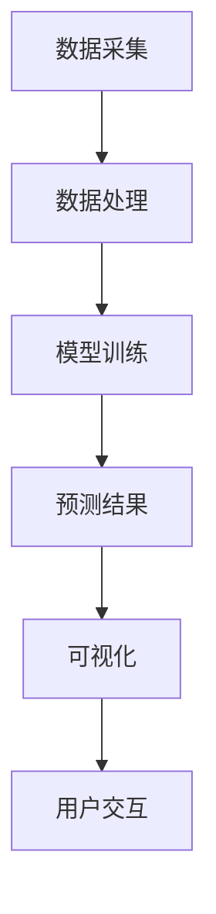

                 

### 关键词 Keywords
- AI 大模型
- 智能决策支持系统
- 数据分析
- 算法优化
- 机器学习
- 深度学习

### 摘要 Abstract
本文将探讨如何利用 AI 大模型设计智能决策支持系统。首先，我们将介绍背景和核心概念，接着深入探讨核心算法原理、数学模型、项目实践和实际应用场景。最后，我们将讨论未来展望、工具推荐以及面临的研究挑战。

## 1. 背景介绍 Background

在当今信息爆炸的时代，决策变得越来越复杂。传统的决策支持系统往往依赖于规则和统计分析，难以应对高度复杂和动态变化的决策环境。随着深度学习和大数据技术的发展，AI 大模型在数据分析、预测和优化方面展现出了巨大的潜力。这些大模型不仅能够处理海量数据，还能从数据中自动学习模式和规律，为决策提供强有力的支持。

智能决策支持系统的设计需要考虑以下几个关键因素：

1. **数据源**：系统能够接入多样化的数据源，如数据库、API、传感器等。
2. **数据处理**：系统能够高效地处理和清洗数据，保证数据质量和完整性。
3. **算法选择**：选择合适的算法，如深度学习、强化学习等，以适应不同的决策需求。
4. **交互界面**：用户友好的交互界面，使得非专业人士也能够轻松使用系统。
5. **可扩展性**：系统能够根据需求进行扩展，适应不断变化的市场环境。

## 2. 核心概念与联系 Core Concepts and Connections

### 2.1 AI 大模型

AI 大模型通常是指具有数十亿到数万亿参数的深度神经网络。这些模型通过在海量数据上训练，可以学会识别复杂的模式和规律。它们在图像识别、自然语言处理、语音识别等领域取得了显著的成绩。

### 2.2 智能决策支持系统

智能决策支持系统是一个集成系统，包括数据采集、数据处理、模型训练、预测和可视化等多个环节。它能够为用户提供实时的决策建议，帮助用户做出更加明智的决策。

### 2.3 数据处理

数据处理是智能决策支持系统的核心。它包括数据清洗、数据整合、特征提取和数据归一化等步骤。有效的数据处理能够提高模型的性能和预测准确性。

### 2.4 算法选择

不同的决策问题可能需要不同的算法。例如，对于需要快速响应的决策问题，可以采用基于规则的算法；对于需要长期优化的决策问题，可以采用强化学习算法。

### 2.5 可视化

可视化是智能决策支持系统的重要组成部分。它能够将复杂的数据和模型结果以直观的方式呈现给用户，帮助用户更好地理解和利用这些数据。

### 2.6 Mermaid 流程图

以下是智能决策支持系统的 Mermaid 流程图：



## 3. 核心算法原理 & 具体操作步骤 Core Algorithm Principles and Detailed Steps

### 3.1 算法原理概述

智能决策支持系统的核心是算法。常见的算法包括深度学习、强化学习和混合优化等。

- **深度学习**：通过多层神经网络，自动提取数据特征，实现高层次的抽象和分类。
- **强化学习**：通过不断尝试和反馈，学习最优策略，实现长期最优决策。
- **混合优化**：结合多种算法，实现既考虑短期收益，又考虑长期目标的优化。

### 3.2 算法步骤详解

#### 3.2.1 深度学习算法

1. 数据预处理：包括数据清洗、归一化、数据增强等步骤。
2. 构建神经网络：选择合适的神经网络结构，如卷积神经网络（CNN）、循环神经网络（RNN）等。
3. 训练模型：使用训练数据训练模型，调整网络参数。
4. 验证模型：使用验证数据评估模型性能，调整模型参数。
5. 部署模型：将训练好的模型部署到生产环境中。

#### 3.2.2 强化学习算法

1. 定义环境：明确决策问题的状态空间和动作空间。
2. 设计奖励机制：定义奖励函数，激励模型学习最优策略。
3. 模型训练：使用经验回放和策略梯度等方法训练模型。
4. 策略评估：评估训练出的策略，选择最优策略。
5. 策略优化：根据评估结果，调整策略参数。

#### 3.2.3 混合优化算法

1. 数据预处理：与深度学习算法相同。
2. 模型训练：使用深度学习算法训练基础模型。
3. 策略训练：使用强化学习算法训练策略模型。
4. 模型融合：将深度学习模型和策略模型融合，实现优化决策。

### 3.3 算法优缺点

- **深度学习算法**：
  - 优点：自动提取特征，适应性强。
  - 缺点：训练时间较长，对数据依赖性强。

- **强化学习算法**：
  - 优点：能够学习长期策略，适应动态环境。
  - 缺点：训练难度大，收敛速度慢。

- **混合优化算法**：
  - 优点：结合深度学习和强化学习优点，适应多种决策场景。
  - 缺点：实现复杂，计算资源消耗大。

### 3.4 算法应用领域

智能决策支持系统广泛应用于金融、医疗、交通、物流等领域。例如，在金融领域，可以用于风险评估、投资策略优化；在医疗领域，可以用于疾病诊断、治疗方案推荐；在交通领域，可以用于交通流量预测、最优路径规划。

## 4. 数学模型和公式 Mathematical Models and Formulas

### 4.1 数学模型构建

智能决策支持系统的数学模型主要包括以下几部分：

1. **特征表示**：使用向量表示数据特征。
2. **损失函数**：定义模型预测值与真实值之间的差距。
3. **优化目标**：定义优化目标，如最小化损失函数。

### 4.2 公式推导过程

#### 4.2.1 特征表示

假设数据集为 \(X = \{x_1, x_2, ..., x_n\}\)，其中每个数据点 \(x_i\) 可以表示为一个向量 \(x_i \in \mathbb{R}^d\)。

#### 4.2.2 损失函数

常见的损失函数包括均方误差（MSE）、交叉熵（Cross Entropy）等。

- **均方误差（MSE）**：

  $$MSE = \frac{1}{n} \sum_{i=1}^{n} (y_i - \hat{y}_i)^2$$

  其中，\(y_i\) 为真实值，\(\hat{y}_i\) 为预测值。

- **交叉熵（Cross Entropy）**：

  $$CE = -\frac{1}{n} \sum_{i=1}^{n} y_i \log(\hat{y}_i)$$

  其中，\(y_i\) 为真实值，\(\hat{y}_i\) 为预测值。

#### 4.2.3 优化目标

常见的优化目标是最小化损失函数：

$$\min_{\theta} J(\theta) = \min_{\theta} \frac{1}{n} \sum_{i=1}^{n} \ell(y_i, \hat{y}_i)$$

其中，\(\theta\) 为模型参数，\(\ell\) 为损失函数。

### 4.3 案例分析与讲解

以一个简单的线性回归问题为例，我们使用 Python 实现：

```python
import numpy as np
import matplotlib.pyplot as plt

# 数据生成
X = np.random.rand(100, 1) * 10
y = 3 * X + 5 + np.random.rand(100, 1) * 2

# 模型初始化
theta = np.random.rand(2, 1)

# 损失函数
def compute_loss(X, y, theta):
    m = len(X)
    predictions = X.dot(theta)
    loss = 1/(2*m) * np.sum((predictions - y) ** 2)
    return loss

# 梯度下降
def gradient_descent(X, y, theta, alpha, num_iterations):
    m = len(X)
    for i in range(num_iterations):
        predictions = X.dot(theta)
        error = predictions - y
        theta = theta - alpha/m * X.T.dot(error)
        loss = compute_loss(X, y, theta)
        print(f"Iteration {i+1}: Loss = {loss}")
    return theta

# 模型训练
alpha = 0.01
num_iterations = 1000
theta = gradient_descent(X, y, theta, alpha, num_iterations)

# 模型评估
plt.scatter(X, y)
plt.plot(X, X.dot(theta), 'r')
plt.show()
```

通过以上代码，我们实现了线性回归模型的训练和评估。模型性能通过损失函数来衡量，优化目标是最小化损失函数。

## 5. 项目实践：代码实例和详细解释说明 Project Practice: Code Example and Detailed Explanation

### 5.1 开发环境搭建

开发环境包括 Python、Jupyter Notebook、TensorFlow 或 PyTorch 等。建议使用虚拟环境进行项目开发，以避免依赖冲突。

### 5.2 源代码详细实现

以下是一个简单的基于深度学习的分类项目示例：

```python
import tensorflow as tf
from tensorflow.keras.models import Sequential
from tensorflow.keras.layers import Dense, Flatten
from tensorflow.keras.utils import to_categorical
from sklearn.model_selection import train_test_split

# 数据准备
X, y = ... # 加载数据
y = to_categorical(y, num_classes=10)
X_train, X_test, y_train, y_test = train_test_split(X, y, test_size=0.2, random_state=42)

# 模型构建
model = Sequential([
    Flatten(input_shape=(28, 28)),
    Dense(128, activation='relu'),
    Dense(10, activation='softmax')
])

# 模型编译
model.compile(optimizer='adam', loss='categorical_crossentropy', metrics=['accuracy'])

# 模型训练
model.fit(X_train, y_train, epochs=10, batch_size=32, validation_split=0.1)

# 模型评估
loss, accuracy = model.evaluate(X_test, y_test)
print(f"Test accuracy: {accuracy * 100:.2f}%")

# 模型预测
predictions = model.predict(X_test)
```

### 5.3 代码解读与分析

- **数据准备**：加载数据集，并进行预处理。
- **模型构建**：使用 Sequential 模型堆叠层，包括 Flatten 层、Dense 层。
- **模型编译**：指定优化器、损失函数和评估指标。
- **模型训练**：使用 fit 方法进行训练，并设置训练轮数、批量大小和验证比例。
- **模型评估**：使用 evaluate 方法评估模型在测试集上的性能。
- **模型预测**：使用 predict 方法进行预测。

## 6. 实际应用场景 Practical Application Scenarios

智能决策支持系统在各个领域都有广泛的应用。以下是一些典型的应用场景：

- **金融领域**：用于股票市场预测、风险评估和投资策略优化。
- **医疗领域**：用于疾病诊断、治疗方案推荐和健康监测。
- **交通领域**：用于交通流量预测、最优路径规划和智能交通管理。
- **物流领域**：用于货物运输优化、库存管理和物流网络规划。
- **工业领域**：用于生产过程优化、设备故障预测和质量控制。

## 7. 未来应用展望 Future Application Prospects

随着 AI 技术的不断发展，智能决策支持系统在未来将具有更广泛的应用前景。以下是一些展望：

- **个性化推荐**：基于用户行为和偏好，提供个性化的推荐和服务。
- **智能城市**：利用大数据和 AI 技术，实现城市的智慧管理和优化。
- **智能医疗**：通过 AI 技术实现精准医疗、智能诊断和个性化治疗。
- **智能制造**：利用 AI 技术实现智能生产、质量控制和设备维护。
- **可持续能源**：利用 AI 技术优化能源生产和消费，实现可持续能源发展。

## 8. 工具和资源推荐 Tools and Resource Recommendations

### 8.1 学习资源推荐

- **《深度学习》（Deep Learning）**：Goodfellow、Bengio 和 Courville 著，详细介绍了深度学习的理论和实践。
- **《Python深度学习》（Python Deep Learning）**：François Chollet 著，涵盖了深度学习在 Python 中的实践应用。
- **Coursera 的《机器学习》**：吴恩达教授主讲，提供了系统的机器学习课程。

### 8.2 开发工具推荐

- **TensorFlow**：Google 开发的开源深度学习框架，功能强大，易于使用。
- **PyTorch**：Facebook 开发的开源深度学习框架，灵活性强，适用于研究和开发。
- **Jupyter Notebook**：用于数据科学和机器学习的交互式计算环境，便于调试和分享。

### 8.3 相关论文推荐

- **“AlexNet: Image Classification with Deep Convolutional Neural Networks”**：Alex Krizhevsky 等人于 2012 年发表的论文，介绍了深度卷积神经网络在图像分类中的应用。
- **“Deep Learning for Natural Language Processing”**：Yeonjoon Lee 等人于 2017 年发表的论文，介绍了深度学习在自然语言处理领域的应用。
- **“Reinforcement Learning: An Introduction”**：Richard S. Sutton 和 Andrew G. Barto 著，提供了强化学习的系统介绍。

## 9. 总结：未来发展趋势与挑战 Summary: Future Trends and Challenges

### 9.1 研究成果总结

近年来，AI 大模型在智能决策支持系统中取得了显著的成果。深度学习、强化学习和混合优化等算法的不断发展，使得系统能够处理更复杂的决策问题。同时，开源框架和工具的成熟，降低了开发门槛，促进了技术的普及和应用。

### 9.2 未来发展趋势

未来，智能决策支持系统将向以下几个方向发展：

- **更加智能化**：通过结合多种算法，实现更智能、更高效的决策支持。
- **更加个性化**：根据用户需求和偏好，提供个性化的决策建议和服务。
- **更加开放和协作**：与其他系统和服务集成，实现跨领域的协同优化。
- **更加安全可靠**：加强模型安全和隐私保护，确保决策过程的可信度。

### 9.3 面临的挑战

尽管智能决策支持系统具有广阔的应用前景，但仍面临一些挑战：

- **数据质量和多样性**：高质量、多样化的数据是模型训练的基础，但实际获取和处理数据存在困难。
- **计算资源和能耗**：大规模 AI 模型的训练和推理需要大量计算资源和能源，对环境和可持续发展带来挑战。
- **模型解释性**：复杂模型往往缺乏解释性，难以理解模型的决策过程，影响决策的可信度。
- **法律法规和伦理**：AI 决策的透明度和伦理问题需要得到充分关注和规范。

### 9.4 研究展望

未来的研究应重点关注以下几个方面：

- **数据驱动的方法**：探索更有效的数据采集、处理和整合方法，提高模型性能。
- **模型压缩与加速**：研究模型压缩和推理加速技术，降低计算资源和能耗。
- **可解释性和透明性**：开发可解释性强的模型，提高决策过程的透明度和可信度。
- **跨学科融合**：结合心理学、社会学、经济学等学科，提高决策系统的综合能力。

## 10. 附录：常见问题与解答 Appendices: Frequently Asked Questions and Answers

### 10.1 什么是 AI 大模型？

AI 大模型是指具有数十亿到数万亿参数的深度神经网络。这些模型通过在海量数据上训练，可以学会识别复杂的模式和规律。

### 10.2 智能决策支持系统的核心组件是什么？

智能决策支持系统的核心组件包括数据采集、数据处理、模型训练、预测和可视化等。

### 10.3 如何选择合适的算法？

选择合适的算法需要考虑决策问题的特点，如数据规模、动态性、复杂度等。常见的算法包括深度学习、强化学习和混合优化等。

### 10.4 智能决策支持系统在哪些领域有应用？

智能决策支持系统在金融、医疗、交通、物流、工业等领域都有广泛的应用。

### 10.5 智能决策支持系统的未来发展方向是什么？

未来的发展方向包括更加智能化、个性化、开放协作、安全可靠等。同时，研究应重点关注数据驱动方法、模型压缩与加速、可解释性、跨学科融合等方面。

### 10.6 智能决策支持系统面临哪些挑战？

智能决策支持系统面临的主要挑战包括数据质量和多样性、计算资源和能耗、模型解释性、法律法规和伦理等方面。

