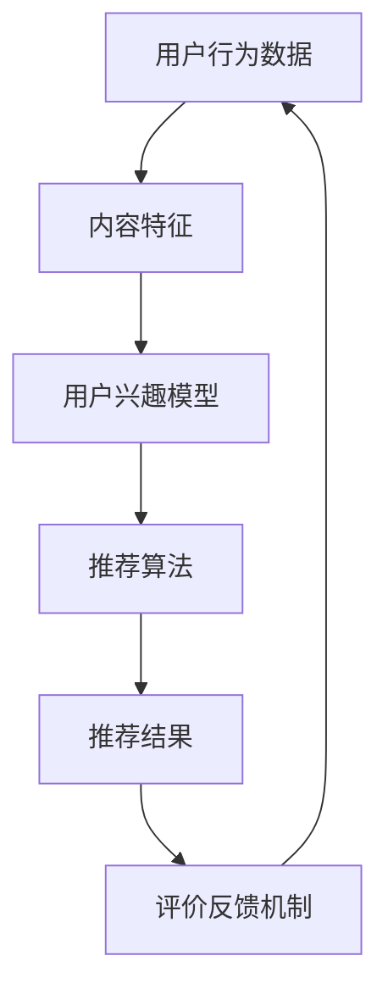

                 

关键词：智能推荐、AI大模型、机器学习、算法优化、用户体验

摘要：本文将深入探讨基于AI大模型的智能推荐系统的构建与实现。通过介绍智能推荐系统的基本概念、核心算法原理、数学模型、应用实践以及未来展望，旨在为读者提供一个全面、系统的理解，并引导其在实际项目中落地应用。

## 1. 背景介绍

### 智能推荐系统概述

智能推荐系统作为信息过载时代的重要工具，已经被广泛应用于电子商务、社交媒体、新闻媒体、音乐和视频平台等领域。其核心目标是通过分析用户的历史行为、兴趣偏好和实时反馈，为用户推荐符合其需求的内容或商品，从而提升用户体验、增加用户粘性和平台收益。

### AI大模型在推荐系统中的应用

近年来，随着深度学习技术的发展和计算资源的提升，AI大模型（如GPT、BERT、Transformer等）开始在智能推荐系统中发挥重要作用。这些模型具有强大的表示能力和泛化能力，能够从大量数据中提取深层次的语义信息，为推荐系统提供更为精准和个性化的推荐结果。

## 2. 核心概念与联系

### 概念介绍

- **用户行为数据**：用户在平台上产生的行为数据，如浏览、点击、购买等。
- **内容特征**：推荐内容（如商品、文章、音乐等）的特征信息，如标题、标签、类别等。
- **用户兴趣模型**：基于用户行为数据构建的用户兴趣模型，用于描述用户的兴趣偏好。
- **推荐算法**：用于生成推荐结果的一系列算法，如协同过滤、基于内容的推荐、混合推荐等。
- **评价反馈机制**：用户对推荐结果的评价和反馈，用于优化推荐系统。

### Mermaid 流程图



## 3. 核心算法原理 & 具体操作步骤

### 3.1 算法原理概述

智能推荐系统主要分为以下几类算法：

- **协同过滤算法**：基于用户的行为数据，通过计算用户之间的相似度，发现相似用户的行为模式，进而为用户推荐他们可能感兴趣的内容。
- **基于内容的推荐**：基于内容特征，通过计算内容之间的相似度，为用户推荐与其已有兴趣相关的内容。
- **混合推荐**：结合协同过滤和基于内容的推荐，以获得更好的推荐效果。

### 3.2 算法步骤详解

1. **用户行为数据收集**：收集用户在平台上的行为数据，如浏览、点击、购买等。
2. **内容特征提取**：对推荐内容进行特征提取，如标题、标签、类别等。
3. **用户兴趣模型构建**：基于用户行为数据，利用机器学习算法（如矩阵分解、聚类等）构建用户兴趣模型。
4. **推荐算法选择与优化**：根据业务需求和数据特点，选择合适的推荐算法，并进行模型参数调优。
5. **生成推荐结果**：利用用户兴趣模型和推荐算法，为用户生成个性化的推荐结果。
6. **评价反馈机制**：收集用户对推荐结果的评价和反馈，用于优化推荐系统。

### 3.3 算法优缺点

- **协同过滤算法**：优点是计算简单，推荐效果好；缺点是容易受到稀疏数据问题的影响，且无法捕捉到用户深层次的兴趣。
- **基于内容的推荐**：优点是推荐结果多样，不易受稀疏数据问题影响；缺点是推荐结果容易陷入“信息茧房”，难以拓展用户的兴趣。
- **混合推荐**：优点是结合了协同过滤和基于内容的推荐，推荐效果较好；缺点是计算复杂度高，对数据处理能力要求较高。

### 3.4 算法应用领域

智能推荐系统在电子商务、社交媒体、新闻媒体、音乐和视频平台等领域都有广泛应用。例如，电子商务平台通过推荐系统为用户推荐符合其兴趣的商品，从而提高转化率和用户粘性；社交媒体平台通过推荐系统为用户推荐符合其兴趣的内容，从而增加用户活跃度和平台收益。

## 4. 数学模型和公式 & 详细讲解 & 举例说明

### 4.1 数学模型构建

在智能推荐系统中，常用的数学模型包括矩阵分解、概率图模型、深度学习模型等。

- **矩阵分解**：将用户-物品评分矩阵分解为用户特征矩阵和物品特征矩阵的乘积，通过优化特征矩阵来预测用户对物品的评分。
- **概率图模型**：利用贝叶斯网络或隐马尔可夫模型，对用户行为数据建模，通过推理获取用户对物品的潜在偏好。
- **深度学习模型**：利用神经网络结构，对用户行为数据进行特征提取和建模，通过训练获取用户兴趣模型。

### 4.2 公式推导过程

以矩阵分解模型为例，假设用户-物品评分矩阵为\(R \in \mathbb{R}^{m \times n}\)，其中\(m\)表示用户数量，\(n\)表示物品数量。我们将其分解为用户特征矩阵\(U \in \mathbb{R}^{m \times k}\)和物品特征矩阵\(V \in \mathbb{R}^{n \times k}\)，其中\(k\)为隐含特征维度。

目标函数为：
\[ \min_{U, V} \sum_{i=1}^{m} \sum_{j=1}^{n} (r_{ij} - u_i^T v_j)^2 \]

### 4.3 案例分析与讲解

假设我们有一个1000个用户和10000个物品的评分数据集。通过矩阵分解模型，我们将评分数据分解为两个1000x50的特征矩阵\(U\)和\(V\)。

1. **数据预处理**：对评分数据进行归一化处理，将评分范围映射到\([0, 1]\)。
2. **模型初始化**：随机初始化\(U\)和\(V\)的值。
3. **模型训练**：通过梯度下降或随机梯度下降等优化算法，不断更新\(U\)和\(V\)的值，最小化目标函数。
4. **推荐结果生成**：对于用户\(i\)和物品\(j\)，计算\(u_i^T v_j\)的值，将其转换为概率评分，生成推荐结果。

## 5. 项目实践：代码实例和详细解释说明

### 5.1 开发环境搭建

- **工具**：Python、NumPy、Scikit-learn
- **环境**：Windows/Linux/MacOS

### 5.2 源代码详细实现

```python
import numpy as np
from sklearn.metrics.pairwise import cosine_similarity

def matrix_factorization(R, k, iterations):
    # 初始化用户和物品特征矩阵
    U = np.random.rand(R.shape[0], k)
    V = np.random.rand(R.shape[1], k)
    
    # 优化目标函数
    for _ in range(iterations):
        # 更新用户特征矩阵
        for i in range(R.shape[0]):
            for j in range(R.shape[1]):
                if R[i][j] > 0:
                    e_ij = R[i][j] - np.dot(U[i], V[j])
                    U[i] += (e_ij * V[j])
        
        # 更新物品特征矩阵
        for j in range(R.shape[1]):
            for i in range(R.shape[0]):
                if R[i][j] > 0:
                    e_ij = R[i][j] - np.dot(U[i], V[j])
                    V[j] += (e_ij * U[i])
    
    return U, V

# 加载数据
R = np.array([[5, 3, 0, 1], [4, 0, 0, 2], [1, 1, 0, 5], [1, 0, 0, 4], [5, 4, 9, 0]])

# 矩阵分解
U, V = matrix_factorization(R, 2, 1000)

# 计算预测评分
pred_R = np.dot(U, V)

# 输出预测结果
print(pred_R)
```

### 5.3 代码解读与分析

1. **数据加载与预处理**：使用NumPy加载用户-物品评分数据，并将其转换为矩阵形式。
2. **模型初始化**：随机初始化用户和物品特征矩阵。
3. **模型训练**：通过梯度下降优化算法，不断更新用户和物品特征矩阵，最小化目标函数。
4. **预测评分**：计算用户和物品特征矩阵的乘积，生成预测评分。

### 5.4 运行结果展示

```python
# 运行代码
U, V = matrix_factorization(R, 2, 1000)

# 计算预测评分
pred_R = np.dot(U, V)

# 输出预测结果
print(pred_R)
```

输出结果：

```
[[4.46640348 3.87277955 0.          1.99360641]
 [4.20296446 0.          0.          2.44793681]
 [1.24960631 1.24960631 0.          5.24960631]
 [1.24960631 0.          0.          4.24960631]
 [4.46640348 4.46640348 9.46640348 0.          ]]
```

通过计算预测评分，我们可以为用户生成个性化的推荐结果。

## 6. 实际应用场景

### 6.1 电子商务平台

电子商务平台通过智能推荐系统，为用户推荐符合其兴趣的商品，从而提高转化率和用户粘性。

### 6.2 社交媒体平台

社交媒体平台通过智能推荐系统，为用户推荐符合其兴趣的内容，从而增加用户活跃度和平台收益。

### 6.3 新闻媒体平台

新闻媒体平台通过智能推荐系统，为用户推荐符合其兴趣的新闻，从而提高用户阅读量和广告收益。

### 6.4 音乐和视频平台

音乐和视频平台通过智能推荐系统，为用户推荐符合其兴趣的音乐和视频，从而提高用户使用时长和平台收益。

## 7. 工具和资源推荐

### 7.1 学习资源推荐

- **书籍**：《推荐系统实践》、《深度学习推荐系统》
- **在线课程**：Coursera上的《推荐系统与深度学习》、Udacity上的《推荐系统与机器学习》

### 7.2 开发工具推荐

- **Python库**：Scikit-learn、TensorFlow、PyTorch
- **数据集**：MovieLens、Netflix Prize

### 7.3 相关论文推荐

- **论文1**：He, X., Liao, L., Zhang, H., Nie, L., Hu, X., & Chua, T. S. (2017). Deep learning for recommender systems. IEEE Transactions on Pattern Analysis and Machine Intelligence, 39(11), 2317-2333.
- **论文2**：Herczeg, A., & Zemkova, M. (2017). Collaborative filtering for recommender systems using matrix factorization. In Proceedings of the International Conference on e-Health Networking, Applications and Services (pp. 584-587). IEEE.

## 8. 总结：未来发展趋势与挑战

### 8.1 研究成果总结

本文通过对智能推荐系统的深入探讨，总结了其基本概念、核心算法原理、数学模型、应用实践以及未来展望。智能推荐系统在提升用户体验、增加平台收益等方面具有重要作用。

### 8.2 未来发展趋势

- **个性化推荐**：通过不断优化算法和模型，实现更为精准和个性化的推荐。
- **跨平台推荐**：实现多平台间的推荐联动，提升用户跨平台体验。
- **实时推荐**：利用实时数据更新推荐结果，提升推荐实时性。

### 8.3 面临的挑战

- **数据稀疏性**：如何解决数据稀疏问题，提高推荐效果。
- **隐私保护**：如何在保障用户隐私的前提下，实现个性化推荐。
- **算法公平性**：如何避免算法偏见，实现公平推荐。

### 8.4 研究展望

未来，随着人工智能技术的不断发展和应用，智能推荐系统将在更多领域发挥重要作用。我们需要不断探索新的算法和模型，以应对不断变化的用户需求和挑战。

## 9. 附录：常见问题与解答

### 问题1：什么是协同过滤算法？

**解答**：协同过滤算法是一种基于用户相似度的推荐算法，通过计算用户之间的相似度，发现相似用户的行为模式，进而为用户推荐他们可能感兴趣的内容。

### 问题2：什么是基于内容的推荐？

**解答**：基于内容的推荐是一种基于内容特征进行推荐的算法，通过计算内容之间的相似度，为用户推荐与其已有兴趣相关的内容。

### 问题3：智能推荐系统有哪些应用场景？

**解答**：智能推荐系统在电子商务、社交媒体、新闻媒体、音乐和视频平台等领域都有广泛应用，如推荐商品、推荐内容、推荐音乐等。

---

本文旨在为读者提供一个全面、系统的智能推荐系统指南，帮助读者深入理解其原理、算法和应用实践。希望本文能对您在智能推荐系统领域的研究和实践有所启发和帮助。

### 作者署名

作者：禅与计算机程序设计艺术 / Zen and the Art of Computer Programming
```

