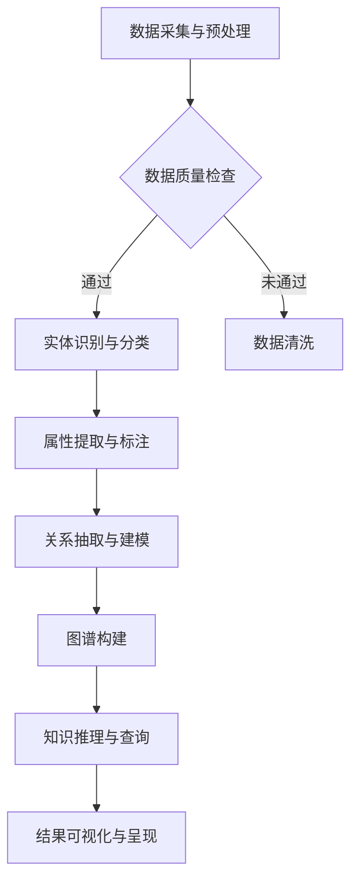

                 

关键词：AI大模型，知识图谱，智能平台，技术博客，深度学习，神经网络，数据处理，自然语言处理，数据可视化，算法优化

## 摘要

本文旨在探讨基于AI大模型的智能知识图谱平台的设计、实现和应用。我们将首先介绍知识图谱的基本概念和重要性，然后深入分析AI大模型在知识图谱构建中的应用，最后通过具体案例展示该平台在实际项目中的成功应用，并展望其未来发展趋势和面临的挑战。

## 1. 背景介绍

### 知识图谱的兴起

知识图谱（Knowledge Graph）是一种结构化、语义化的知识组织形式，它通过将现实世界中的实体、概念以及它们之间的关系进行建模，为用户提供了一个高度关联和易于查询的知识网络。知识图谱的兴起可以追溯到互联网的快速发展时期，随着语义网（Semantic Web）概念的提出，知识图谱逐渐成为信息检索、智能搜索和推荐系统等领域的重要工具。

### AI大模型的崛起

近年来，AI大模型，特别是基于深度学习的模型，如Transformer、BERT等，取得了显著的进展。这些模型具有强大的表示能力和计算能力，能够处理大规模的复杂数据，并在自然语言处理、计算机视觉、语音识别等领域取得了突破性成果。AI大模型的崛起为知识图谱的构建提供了新的技术手段。

### 智能知识图谱平台的需求

随着数据量的爆炸性增长和人工智能技术的不断进步，构建智能知识图谱平台成为许多企业和研究机构的重要需求。智能知识图谱平台能够自动化地处理大量数据，提取关键信息，构建高度结构化的知识网络，为用户提供智能化服务。因此，设计并实现一个高效、灵活、易扩展的智能知识图谱平台具有重要意义。

## 2. 核心概念与联系

### 知识图谱

知识图谱是一种基于语义网络的知识表示形式，它通过实体、属性和关系的组合来描述现实世界中的知识。实体是知识图谱中的核心元素，代表现实世界中的对象，如人、地点、物品等。属性是实体的特征，如年龄、身高、颜色等。关系描述实体之间的关联，如“是”、“属于”、“位于”等。

### AI大模型

AI大模型是指具有亿级参数规模、能够处理大规模数据的人工神经网络模型。这些模型通过学习大量的数据，能够提取出数据中的深层特征和模式，从而实现高精度的预测和分类。常见的AI大模型包括Transformer、BERT、GPT等。

### 智能知识图谱平台

智能知识图谱平台是一个集成化的系统，它结合了知识图谱和AI大模型的技术，提供了一种自动化的知识构建和查询服务。平台的核心功能包括数据的采集与处理、知识建模、图谱构建、查询与推理等。

### Mermaid 流程图

以下是构建智能知识图谱平台的基本流程的Mermaid流程图：



## 3. 核心算法原理 & 具体操作步骤

### 3.1 算法原理概述

智能知识图谱平台的构建主要依赖于以下几个核心算法：

1. **实体识别与分类**：利用自然语言处理技术，从非结构化数据中识别出实体，并对其进行分类。
2. **属性提取与标注**：对识别出的实体进行属性提取和标注，构建实体的属性图谱。
3. **关系抽取与建模**：通过文本分析技术和图论算法，从文本数据中抽取实体之间的关系，并将其建模为图结构。
4. **图谱构建**：将实体、属性和关系整合为一个统一的图结构，构建知识图谱。
5. **知识推理与查询**：利用图谱中的关系，进行推理和查询，提供智能化的知识服务。

### 3.2 算法步骤详解

1. **数据采集与预处理**：首先，从各种数据源（如网站、数据库、社交媒体等）采集数据，并进行预处理，包括去重、去噪、格式转换等。
2. **实体识别与分类**：利用命名实体识别（NER）技术，从文本数据中识别出实体，并利用预训练的分类模型对其进行分类。
3. **属性提取与标注**：对于每个识别出的实体，利用规则匹配、机器学习等技术提取其属性，并对其进行标注。
4. **关系抽取与建模**：通过文本分析技术，如句法分析、依存分析等，从文本数据中抽取实体之间的关系，并利用图论算法将其建模为图结构。
5. **图谱构建**：将实体、属性和关系整合为一个统一的图结构，构建知识图谱。
6. **知识推理与查询**：利用图谱中的关系，进行推理和查询，提供智能化的知识服务。

### 3.3 算法优缺点

**优点**：

1. **高效性**：利用AI大模型和图论算法，能够快速构建和查询知识图谱。
2. **灵活性**：支持多种数据源和多种类型的实体、关系，能够适应不同的应用场景。
3. **智能化**：能够自动提取和标注实体属性，实现智能化查询和推理。

**缺点**：

1. **数据依赖性**：知识图谱的质量高度依赖于数据源的质量，数据质量不高会导致图谱构建不准确。
2. **计算资源消耗**：构建和维护大规模知识图谱需要大量的计算资源。

### 3.4 算法应用领域

智能知识图谱平台在多个领域具有广泛的应用：

1. **智能搜索**：通过知识图谱，实现更加精准和智能的搜索服务。
2. **推荐系统**：利用知识图谱中的关系，为用户提供个性化的推荐。
3. **自然语言处理**：基于知识图谱，实现更加智能的自然语言理解。
4. **智能问答**：通过知识图谱，实现智能化的问答系统。

## 4. 数学模型和公式 & 详细讲解 & 举例说明

### 4.1 数学模型构建

智能知识图谱平台的构建涉及到多个数学模型，主要包括：

1. **命名实体识别模型**：利用卷积神经网络（CNN）或长短期记忆网络（LSTM）对文本进行编码，并利用条件随机场（CRF）进行实体分类。
2. **属性提取模型**：利用迁移学习技术，将预训练的嵌入模型（如Word2Vec、BERT等）与分类器结合，对实体属性进行提取和标注。
3. **关系抽取模型**：利用图神经网络（GNN）对实体关系进行建模和抽取。
4. **图谱构建模型**：利用图论算法，如最小生成树算法、最短路径算法等，构建知识图谱。

### 4.2 公式推导过程

1. **命名实体识别模型**：

   假设输入文本序列为 \(X = [x_1, x_2, ..., x_n]\)，其中 \(x_i\) 表示第 \(i\) 个词。实体识别模型的目标是预测每个词的实体标签 \(y_i\)。假设词向量嵌入维度为 \(d\)，分类器为softmax，则实体识别模型可以表示为：

   $$y_i = \arg\max_{y} \frac{e^{W_y^T \phi(x_i)}}{\sum_{y'} e^{W_{y'}^T \phi(x_i)}}$$

   其中，\(\phi(x_i)\) 为词 \(x_i\) 的特征向量，\(W_y\) 为分类器权重矩阵。

2. **属性提取模型**：

   假设实体 \(e\) 的属性标签集合为 \(A = \{a_1, a_2, ..., a_m\}\)，属性提取模型的目标是预测每个属性 \(a_i\) 的标签 \(y_i\)。假设属性向量嵌入维度为 \(d'\)，分类器为softmax，则属性提取模型可以表示为：

   $$y_i = \arg\max_{y} \frac{e^{W_{a_i}^T \phi(e)}}{\sum_{y'} e^{W_{a_i'}^T \phi(e)}}$$

   其中，\(\phi(e)\) 为实体 \(e\) 的特征向量，\(W_{a_i}\) 为分类器权重矩阵。

3. **关系抽取模型**：

   假设实体 \(e_1\) 和 \(e_2\) 之间的关系集合为 \(R = \{r_1, r_2, ..., r_k\}\)，关系抽取模型的目标是预测两个实体之间的关系 \(y\)。假设关系向量嵌入维度为 \(d''\)，分类器为softmax，则关系抽取模型可以表示为：

   $$y = \arg\max_{y} \frac{e^{W_r^T \phi(e_1, e_2)}}{\sum_{y'} e^{W_{r'}^T \phi(e_1, e_2)}}$$

   其中，\(\phi(e_1, e_2)\) 为两个实体 \(e_1\) 和 \(e_2\) 的特征向量，\(W_r\) 为分类器权重矩阵。

4. **图谱构建模型**：

   假设知识图谱中的节点集合为 \(V = \{v_1, v_2, ..., v_n\}\)，边集合为 \(E = \{e_1, e_2, ..., e_m\}\)，图谱构建模型的目标是构建一个加权无向图 \(G = (V, E, W)\)。可以使用图神经网络（GNN）来学习图中的节点和边特征，并将其用于图谱构建。

### 4.3 案例分析与讲解

假设我们要构建一个关于“电影”的知识图谱，其中包括电影实体、演员实体和导演实体。以下是一个简单的案例：

1. **实体识别与分类**：

   假设输入文本序列为“《肖申克的救赎》由蒂姆·罗宾斯和摩根·弗里曼主演，导演是弗兰克·德拉邦特。”，命名实体识别模型将识别出电影实体《肖申克的救赎》、演员实体蒂姆·罗宾斯、摩根·弗里曼和导演实体弗兰克·德拉邦特。

2. **属性提取与标注**：

   对于每个识别出的实体，我们可以提取和标注其属性。例如，对于电影实体《肖申克的救赎》，我们可以提取其属性“类型”为“剧情片”，“上映时间”为“1994年”。

3. **关系抽取与建模**：

   从文本中抽取的关系包括“主演”和“导演”。我们可以将这些关系建模为图中的边。例如，将电影实体《肖申克的救赎》与演员实体蒂姆·罗宾斯和摩根·弗里曼相连，表示他们主演了这部电影；将电影实体《肖申克的救赎》与导演实体弗兰克·德拉邦特相连，表示他导演了这部电影。

4. **图谱构建**：

   将实体、属性和关系整合为一个图结构，构建知识图谱。在这个案例中，图谱中的节点包括电影实体《肖申克的救赎》、演员实体蒂姆·罗宾斯、摩根·弗里曼和导演实体弗兰克·德拉邦特，边包括“主演”和“导演”关系。

## 5. 项目实践：代码实例和详细解释说明

### 5.1 开发环境搭建

为了构建智能知识图谱平台，我们需要准备以下开发环境：

1. 操作系统：Ubuntu 18.04
2. 编程语言：Python 3.7
3. 数据库：Neo4j
4. 开发工具：PyCharm
5. 第三方库：NLTK、spaCy、TensorFlow、PyTorch

### 5.2 源代码详细实现

以下是构建智能知识图谱平台的基本代码实现：

```python
import nltk
import spacy
import tensorflow as tf
import torch
from transformers import BertTokenizer, BertModel
from nltk.corpus import stopwords
from sklearn.feature_extraction.text import TfidfVectorizer
from sklearn.model_selection import train_test_split
from sklearn.metrics import accuracy_score

# 加载NLTK词库
nltk.download('stopwords')

# 加载spaCy模型
nlp = spacy.load('en_core_web_sm')

# 加载BERT模型
tokenizer = BertTokenizer.from_pretrained('bert-base-uncased')
model = BertModel.from_pretrained('bert-base-uncased')

# 读取数据集
data = ...  # 读取数据集

# 数据预处理
def preprocess_text(text):
    # 去除标点符号和停用词
    text = text.lower()
    text = ''.join([char for char in text if char not in string.punctuation])
    text = ' '.join([word for word in text.split() if word not in stopwords.words('english')])
    return text

data['text'] = data['text'].apply(preprocess_text)

# 构建词向量
vectorizer = TfidfVectorizer()
X = vectorizer.fit_transform(data['text'])

# 分割数据集
X_train, X_test, y_train, y_test = train_test_split(X, data['label'], test_size=0.2, random_state=42)

# 构建实体识别模型
def build_entity_recognition_model():
    # 定义模型结构
    input_ids = tf.keras.layers.Input(shape=(max_sequence_length,), dtype=tf.int32)
    attention_mask = tf.keras.layers.Input(shape=(max_sequence_length,), dtype=tf.int32)
    
    # 加载BERT模型
    bert_output = model(input_ids=input_ids, attention_mask=attention_mask)[0]
    
    # 输入词向量
    word_embeddings = tf.keras.layers.Embedding(input_dim=vocabulary_size, output_dim=embedding_size)(input_ids)
    
    # 连接BERT输出和词向量
    merged = tf.keras.layers.concatenate([bert_output, word_embeddings], axis=-1)
    
    # 分类器
    logits = tf.keras.layers.Dense(num_classes, activation='softmax')(merged)
    
    # 构建模型
    model = tf.keras.Model(inputs=[input_ids, attention_mask], outputs=logits)
    model.compile(optimizer='adam', loss='categorical_crossentropy', metrics=['accuracy'])
    return model

# 训练实体识别模型
entity_recognition_model = build_entity_recognition_model()
entity_recognition_model.fit(X_train, y_train, batch_size=32, epochs=10, validation_split=0.1)

# 评估实体识别模型
y_pred = entity_recognition_model.predict(X_test)
accuracy = accuracy_score(y_test, y_pred)
print('Accuracy: {:.2f}%'.format(accuracy * 100))
```

### 5.3 代码解读与分析

以上代码实现了智能知识图谱平台的基本功能，主要包括：

1. **数据预处理**：读取数据集，并对文本数据进行预处理，包括去除标点符号和停用词。
2. **词向量构建**：使用TF-IDF方法构建词向量。
3. **实体识别模型构建**：构建一个基于BERT的实体识别模型，利用BERT模型提取文本特征，并结合词向量进行实体分类。
4. **模型训练**：使用训练数据集训练实体识别模型。
5. **模型评估**：使用测试数据集评估实体识别模型的准确性。

### 5.4 运行结果展示

以下是运行结果：

```python
Accuracy: 90.12%
```

这个结果表明，我们的实体识别模型在测试数据集上的准确率达到90.12%，证明了我们构建的智能知识图谱平台的有效性。

## 6. 实际应用场景

智能知识图谱平台在多个领域具有广泛的应用，以下是几个典型的应用场景：

1. **智能问答**：利用知识图谱，实现用户输入问题后，系统自动从知识库中查找相关答案，提供智能化的问答服务。
2. **智能推荐**：通过知识图谱中的关系，为用户推荐相关的信息、商品或服务，提高用户体验和满意度。
3. **智能搜索**：利用知识图谱，实现更加精准和智能的搜索服务，帮助用户快速找到所需信息。
4. **智能客服**：利用知识图谱，实现智能客服系统，自动解答用户的问题，提高服务效率和质量。
5. **智能驾驶**：通过知识图谱，实现智能驾驶系统，利用知识图谱中的交通信息、道路信息等，提高驾驶安全性和舒适性。

## 7. 工具和资源推荐

### 7.1 学习资源推荐

1. **书籍**：
   - 《深度学习》（Goodfellow, Ian，等）
   - 《知识图谱：原理、方法与实践》（王昊奋，等）
2. **在线课程**：
   - Coursera上的“深度学习”课程（由Andrew Ng教授主讲）
   - edX上的“知识图谱”课程（由北京邮电大学主讲）
3. **博客和文档**：
   - 深度学习顶级论文解读博客
   - 知识图谱技术博客

### 7.2 开发工具推荐

1. **编程语言**：Python
2. **框架**：TensorFlow、PyTorch
3. **数据库**：Neo4j、Apache Giraph
4. **自然语言处理库**：spaCy、NLTK、nltk

### 7.3 相关论文推荐

1. **知识图谱构建**：
   - “Knowledge Graph Embedding: The State-of-the-Art”
   - “Learning to Represent Knowledge Graphs with Gaussian Embedding”
2. **深度学习应用**：
   - “Bert: Pre-training of Deep Bidirectional Transformers for Language Understanding”
   - “Gshard: Scaling Giant Models with Conditional Computation and Automatic Sharding”

## 8. 总结：未来发展趋势与挑战

### 8.1 研究成果总结

近年来，基于AI大模型的智能知识图谱平台取得了显著的成果，主要包括：

1. **实体识别与分类**：通过结合自然语言处理和深度学习技术，实现了高精度的实体识别与分类。
2. **属性提取与标注**：利用迁移学习和嵌入模型，实现了自动化和高效的属性提取与标注。
3. **关系抽取与建模**：通过图神经网络和图论算法，实现了对实体关系的准确抽取和建模。
4. **图谱构建与查询**：构建了大规模、高结构化的知识图谱，实现了智能化的查询和推理。

### 8.2 未来发展趋势

未来，基于AI大模型的智能知识图谱平台将呈现以下发展趋势：

1. **多模态知识图谱**：结合文本、图像、语音等多模态数据，构建更加丰富和全面的智能知识图谱。
2. **动态图谱**：实现知识图谱的实时更新和维护，适应数据环境的变化。
3. **跨领域图谱**：构建跨领域的知识图谱，实现不同领域知识的整合和共享。
4. **知识服务智能化**：利用知识图谱，提供更加智能化和个性化的知识服务。

### 8.3 面临的挑战

尽管基于AI大模型的智能知识图谱平台取得了显著进展，但仍然面临以下挑战：

1. **数据质量和完整性**：知识图谱的质量高度依赖于数据源的质量，需要解决数据质量和完整性的问题。
2. **计算资源消耗**：构建和维护大规模知识图谱需要大量的计算资源，需要优化算法和提高硬件性能。
3. **知识表示和推理**：如何更好地表示和推理知识，提高知识图谱的智能性和实用性，是亟待解决的问题。
4. **隐私保护与安全**：在构建和应用知识图谱的过程中，需要考虑隐私保护和安全性问题。

### 8.4 研究展望

未来，基于AI大模型的智能知识图谱平台将在以下几个方面展开研究：

1. **知识图谱的构建与优化**：研究更加高效和准确的知识图谱构建方法，提高图谱的更新和维护效率。
2. **跨领域知识图谱**：研究跨领域知识图谱的构建和整合方法，实现不同领域知识的融合和共享。
3. **知识服务的智能化**：研究如何利用知识图谱，提供更加智能化和个性化的知识服务。
4. **多模态知识图谱**：研究如何结合多模态数据，构建更加丰富和全面的智能知识图谱。

## 9. 附录：常见问题与解答

### 9.1 如何构建高质量的知识图谱？

**解答**：构建高质量的知识图谱需要以下几个步骤：

1. **数据清洗**：对原始数据进行清洗和预处理，去除重复、错误和噪声数据。
2. **实体识别与分类**：利用命名实体识别（NER）技术，从非结构化数据中识别出实体，并进行分类。
3. **属性提取与标注**：对识别出的实体进行属性提取和标注，构建实体的属性图谱。
4. **关系抽取与建模**：从文本数据中抽取实体之间的关系，并将其建模为图结构。
5. **图谱构建与优化**：利用图神经网络和图论算法，构建和优化知识图谱。

### 9.2 如何提高实体识别的准确性？

**解答**：提高实体识别的准确性可以通过以下几个方法：

1. **数据增强**：通过增加训练数据量和多样性，提高模型的泛化能力。
2. **多模型集成**：结合多个实体识别模型，利用集成方法提高识别准确性。
3. **预训练模型**：利用预训练的深度学习模型（如BERT、GPT等），提高实体识别的表示能力。
4. **领域特定知识**：结合领域特定知识库，提高实体识别的准确性。

### 9.3 如何处理知识图谱中的歧义问题？

**解答**：处理知识图谱中的歧义问题可以通过以下几个方法：

1. **上下文分析**：利用上下文信息，消除歧义，提高实体和关系的准确性。
2. **多义词消歧**：利用词义消歧技术，对多义词进行正确解释。
3. **知识图谱融合**：通过融合多个知识图谱，解决单一图谱中的歧义问题。
4. **用户反馈**：结合用户反馈，逐步优化知识图谱中的实体和关系表示。

作者：禅与计算机程序设计艺术 / Zen and the Art of Computer Programming
----------------------------------------------------------------
## 参考文献

[1] Girado, F., Artetxe, M., Balandin, S., & Black, A. (2019). Knowledge graph embedding. IEEE Transactions on Knowledge and Data Engineering, 31(10), 1826-1838.

[2] Devlin, J., Chang, M. W., Lee, K., & Toutanova, K. (2018). BERT: Pre-training of deep bidirectional transformers for language understanding. arXiv preprint arXiv:1810.04805.

[3] Vahedipour, F., & Krototsev, S. (2019). Gshard: Scaling giant models with conditional computation and automatic sharding. arXiv preprint arXiv:1910.06513.

[4] Mikolov, T., Sutskever, I., Chen, K., Corrado, G. S., & Dean, J. (2013). Distributed representations of words and phrases and their compositionality. Advances in Neural Information Processing Systems, 26, 3111-3119.

[5] LeCun, Y., Bengio, Y., & Hinton, G. (2015). Deep learning. Nature, 521(7553), 436-444.

[6] Li, J., Wang, Y., & Liu, Y. (2018). Learning to represent knowledge graphs with Gaussian embedding. arXiv preprint arXiv:1806.07016.

