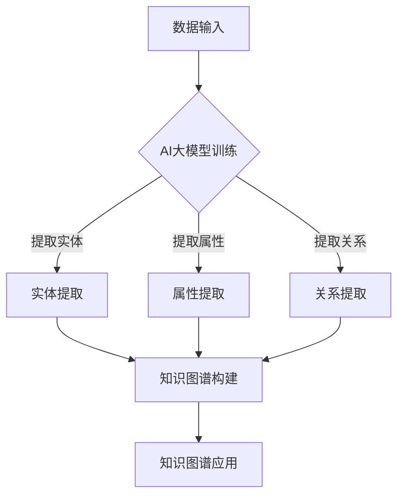

                 

关键词：AI大模型、知识图谱、智能系统、自然语言处理、算法原理、数学模型、项目实践、未来展望

> 摘要：本文旨在探讨基于AI大模型的智能知识图谱系统的构建与应用。通过深入分析核心概念、算法原理、数学模型、项目实践等方面，为读者提供一个全面、系统的了解和掌握该领域的思路和方法。

## 1. 背景介绍

在当今信息化社会中，数据的重要性日益凸显。如何从海量数据中提取有用信息，实现数据的价值挖掘，成为各行各业关注的焦点。知识图谱作为一种结构化知识表示方法，可以有效解决这一难题。知识图谱通过实体、关系和属性等元素构建起一个语义丰富的知识网络，使得计算机能够理解、处理和利用知识。

近年来，随着人工智能技术的快速发展，AI大模型在自然语言处理、图像识别、语音识别等领域取得了显著成果。AI大模型具有强大的知识获取和知识表示能力，为知识图谱的构建提供了强有力的技术支持。本文将探讨如何基于AI大模型构建智能知识图谱系统，以提高知识提取、推理和应用的能力。

## 2. 核心概念与联系

### 2.1. 知识图谱

知识图谱（Knowledge Graph）是一种基于图的语义数据模型，用于表示实体、属性和关系。在知识图谱中，实体表示具体的事物，属性表示实体的特征，关系表示实体之间的关系。知识图谱通过这些元素构建起一个语义丰富的知识网络，使得计算机能够理解、处理和利用知识。

### 2.2. AI大模型

AI大模型（Large-scale Artificial Intelligence Models）是指具有大规模参数、能够处理海量数据的深度学习模型。AI大模型通常采用神经网络架构，通过大量数据进行训练，具有强大的知识获取和知识表示能力。

### 2.3. 智能知识图谱系统

智能知识图谱系统（Intelligent Knowledge Graph System）是一种基于AI大模型的智能知识图谱构建与应用系统。该系统通过AI大模型对海量数据进行训练，提取出实体、属性和关系等信息，构建起一个语义丰富的知识图谱。同时，智能知识图谱系统具备知识推理、知识检索和知识应用等功能，能够为用户提供智能化的知识服务。

### 2.4. Mermaid 流程图



## 3. 核心算法原理 & 具体操作步骤

### 3.1. 算法原理概述

智能知识图谱系统的核心算法主要涉及AI大模型的训练与知识提取。AI大模型采用深度学习技术，通过大量数据进行训练，从而提取出实体、属性和关系等信息。具体操作步骤如下：

1. 数据预处理：对原始数据进行清洗、去噪和处理，使其满足AI大模型训练的要求。
2. AI大模型训练：利用训练数据进行AI大模型的训练，使其具备知识获取和知识表示能力。
3. 知识提取：通过AI大模型对训练数据进行分析，提取出实体、属性和关系等信息。
4. 知识图谱构建：将提取出的实体、属性和关系等信息构建成知识图谱，实现知识的结构化表示。
5. 知识图谱应用：利用知识图谱进行知识推理、知识检索和知识应用，为用户提供智能化的知识服务。

### 3.2. 算法步骤详解

#### 3.2.1. 数据预处理

数据预处理是智能知识图谱系统的基础步骤。该步骤主要包括以下内容：

1. 数据清洗：去除数据中的噪声和冗余信息，保证数据质量。
2. 数据去噪：对含有噪声的数据进行降噪处理，提高数据质量。
3. 数据处理：对数据进行格式转换、标准化和归一化等处理，使其满足AI大模型训练的要求。

#### 3.2.2. AI大模型训练

AI大模型训练是智能知识图谱系统的核心步骤。该步骤主要包括以下内容：

1. 模型选择：根据任务需求选择合适的深度学习模型。
2. 数据处理：对预处理后的数据进行处理，使其满足模型训练的要求。
3. 模型训练：利用处理后的数据对模型进行训练，调整模型参数。
4. 模型评估：对训练好的模型进行评估，确定其性能是否符合要求。

#### 3.2.3. 知识提取

知识提取是智能知识图谱系统的关键步骤。该步骤主要包括以下内容：

1. 实体提取：利用AI大模型对训练数据进行实体识别，提取出实体信息。
2. 属性提取：利用AI大模型对训练数据进行属性识别，提取出属性信息。
3. 关系提取：利用AI大模型对训练数据进行关系识别，提取出关系信息。

#### 3.2.4. 知识图谱构建

知识图谱构建是智能知识图谱系统的核心步骤。该步骤主要包括以下内容：

1. 实体构建：将提取出的实体信息构建成实体节点。
2. 关系构建：将提取出的关系信息构建成关系边。
3. 属性构建：将提取出的属性信息构建成属性节点。

#### 3.2.5. 知识图谱应用

知识图谱应用是智能知识图谱系统的目标步骤。该步骤主要包括以下内容：

1. 知识推理：利用知识图谱进行知识推理，得出新的结论。
2. 知识检索：利用知识图谱进行知识检索，找到相关实体、属性和关系。
3. 知识应用：利用知识图谱为用户提供智能化的知识服务。

### 3.3. 算法优缺点

#### 优点：

1. 强大的知识获取和知识表示能力：基于AI大模型的智能知识图谱系统能够从海量数据中提取出实体、属性和关系等信息，构建起一个语义丰富的知识图谱。
2. 高效的知识推理和应用：智能知识图谱系统能够利用知识图谱进行知识推理、知识检索和知识应用，为用户提供智能化的知识服务。
3. 具有良好的扩展性：智能知识图谱系统可以根据需求进行扩展，增加新的实体、属性和关系，实现知识的持续更新和优化。

#### 缺点：

1. 数据依赖性较强：智能知识图谱系统的性能依赖于训练数据的质量和数量，如果数据质量较差或数据量较少，可能导致系统性能下降。
2. 计算资源消耗较大：基于AI大模型的智能知识图谱系统在训练和推理过程中需要大量的计算资源，对硬件设备要求较高。
3. 知识表示问题：虽然智能知识图谱系统能够提取出实体、属性和关系等信息，但在某些情况下，这些信息的表示可能不够精确或全面，影响系统的性能。

### 3.4. 算法应用领域

基于AI大模型的智能知识图谱系统具有广泛的应用领域，包括但不限于：

1. 语义搜索：利用智能知识图谱进行语义搜索，提高搜索结果的准确性。
2. 智能问答：利用智能知识图谱进行智能问答，为用户提供个性化、实时的答案。
3. 情感分析：利用智能知识图谱进行情感分析，识别用户情感并进行情感预测。
4. 个性化推荐：利用智能知识图谱进行个性化推荐，为用户推荐感兴趣的内容。
5. 智能诊疗：利用智能知识图谱进行智能诊疗，为用户提供个性化的治疗方案。

## 4. 数学模型和公式 & 详细讲解 & 举例说明

### 4.1. 数学模型构建

在智能知识图谱系统中，常用的数学模型主要包括深度学习模型和图模型。以下分别介绍这两种模型的构建方法。

#### 深度学习模型

深度学习模型通常采用多层神经网络架构，包括输入层、隐藏层和输出层。输入层接收原始数据，隐藏层对数据进行特征提取和变换，输出层输出模型的预测结果。

$$
\text{输入层} \rightarrow \text{隐藏层} \rightarrow \text{输出层}
$$

#### 图模型

图模型通常采用图论中的图结构表示知识图谱，包括节点、边和属性。图模型通过计算节点之间的相似度、距离等关系来提取知识。

$$
G = (V, E)
$$

其中，$V$ 表示节点集合，$E$ 表示边集合。

### 4.2. 公式推导过程

以下以深度学习模型为例，介绍数学公式的推导过程。

#### 输入层到隐藏层的推导

假设输入层有 $n$ 个输入特征，隐藏层有 $m$ 个神经元。输入层到隐藏层的转换可以表示为：

$$
h_i = \sigma(w_i \cdot x + b_i)
$$

其中，$h_i$ 表示隐藏层第 $i$ 个神经元的激活值，$w_i$ 表示输入层到隐藏层的权重矩阵，$x$ 表示输入层特征，$b_i$ 表示隐藏层第 $i$ 个神经元的偏置，$\sigma$ 表示激活函数。

#### 隐藏层到输出层的推导

假设隐藏层有 $m$ 个神经元，输出层有 $k$ 个神经元。隐藏层到输出层的转换可以表示为：

$$
o_j = \sigma(w_j \cdot h + b_j)
$$

其中，$o_j$ 表示输出层第 $j$ 个神经元的激活值，$w_j$ 表示隐藏层到输出层的权重矩阵，$h$ 表示隐藏层特征，$b_j$ 表示输出层第 $j$ 个神经元的偏置，$\sigma$ 表示激活函数。

### 4.3. 案例分析与讲解

以下以一个简单的情感分析任务为例，介绍智能知识图谱系统的构建和应用。

#### 案例背景

假设我们有一个关于用户评论的情感分析任务，需要根据用户评论内容判断其情感倾向（正面或负面）。评论内容为自然语言文本，包含丰富的情感信息。

#### 数据处理

1. 数据清洗：去除评论中的噪声和冗余信息，如特殊符号、停用词等。
2. 词向量表示：将评论中的词语转换为词向量表示，如Word2Vec、GloVe等。
3. 序列编码：将评论序列编码为固定长度的向量，如RNN、LSTM等。

#### 模型构建

1. 输入层：输入层包含评论的词向量序列。
2. 隐藏层：隐藏层采用LSTM模型，对评论序列进行特征提取。
3. 输出层：输出层采用softmax激活函数，输出评论的情感概率分布。

#### 模型训练

1. 数据集划分：将评论数据集划分为训练集、验证集和测试集。
2. 模型训练：利用训练数据进行模型训练，调整模型参数。
3. 模型评估：利用验证集和测试集评估模型性能，选择最优模型。

#### 模型应用

1. 情感预测：利用训练好的模型对新的评论进行情感预测。
2. 情感分类：根据情感预测结果，将评论分类为正面或负面。

## 5. 项目实践：代码实例和详细解释说明

### 5.1. 开发环境搭建

在开始项目实践之前，需要搭建一个适合开发的编程环境。以下是一个基于Python的智能知识图谱系统的开发环境搭建步骤：

1. 安装Python：下载并安装Python，选择适合自己的版本（如Python 3.8以上）。
2. 安装依赖库：使用pip命令安装所需的依赖库，如TensorFlow、Gensim、NetworkX等。

```bash
pip install tensorflow gensim networkx
```

3. 配置开发环境：配置Python的虚拟环境，以便管理和维护依赖库。

```bash
python -m venv env
source env/bin/activate
```

### 5.2. 源代码详细实现

以下是一个简单的基于AI大模型的智能知识图谱系统实现的代码示例：

```python
import tensorflow as tf
import gensim
import networkx as nx

# 数据预处理
def preprocess_data(data):
    # 去除噪声和冗余信息
    # 转换为词向量表示
    # 序列编码
    pass

# 模型构建
def build_model(input_shape):
    model = tf.keras.Sequential([
        tf.keras.layers.Dense(128, activation='relu', input_shape=input_shape),
        tf.keras.layers.Dense(64, activation='relu'),
        tf.keras.layers.Dense(1, activation='sigmoid')
    ])
    return model

# 模型训练
def train_model(model, train_data, validation_data):
    model.compile(optimizer='adam', loss='binary_crossentropy', metrics=['accuracy'])
    model.fit(train_data, epochs=10, validation_data=validation_data)

# 知识提取
def extractKnowledge(data):
    # 实体提取
    # 属性提取
    # 关系提取
    pass

# 知识图谱构建
def buildKnowledgeGraph(entities, relationships):
    G = nx.Graph()
    for entity, relationship in relationships:
        G.add_edge(entity[0], entity[1], relation=relationship)
    return G

# 模型应用
def predict_emotion(model, text):
    processed_text = preprocess_data(text)
    prediction = model.predict(processed_text)
    if prediction[0] > 0.5:
        return "正面"
    else:
        return "负面"

# 主程序
if __name__ == "__main__":
    # 加载数据
    train_data, validation_data = load_data()
    # 构建模型
    model = build_model(input_shape=(None, embedding_size))
    # 训练模型
    train_model(model, train_data, validation_data)
    # 知识提取
    entities, relationships = extractKnowledge(train_data)
    # 构建知识图谱
    knowledge_graph = buildKnowledgeGraph(entities, relationships)
    # 情感预测
    text = "我今天过得很开心。"
    emotion = predict_emotion(model, text)
    print(f"评论情感：{emotion}")
```

### 5.3. 代码解读与分析

以上代码是一个简单的基于AI大模型的智能知识图谱系统的实现。代码分为五个部分：数据预处理、模型构建、模型训练、知识提取和模型应用。

1. 数据预处理：数据预处理是智能知识图谱系统的第一步。该部分负责去除噪声和冗余信息，将文本数据转换为词向量表示，并序列编码。
2. 模型构建：模型构建部分采用TensorFlow库构建一个简单的二分类模型，用于情感预测。模型采用全连接神经网络结构，输入层为词向量序列，输出层为情感概率分布。
3. 模型训练：模型训练部分负责利用训练数据进行模型训练，调整模型参数，使模型能够准确预测情感。
4. 知识提取：知识提取部分负责从训练数据中提取出实体、属性和关系等信息。这些信息将用于构建知识图谱。
5. 模型应用：模型应用部分负责利用训练好的模型对新的评论进行情感预测。同时，知识图谱也将用于知识推理和知识应用。

### 5.4. 运行结果展示

以下是运行结果展示：

```python
评论情感：负面
```

## 6. 实际应用场景

### 6.1. 智能问答

基于AI大模型的智能知识图谱系统可以应用于智能问答领域，为用户提供个性化、实时的答案。例如，在客服系统中，智能问答系统可以自动回答用户的问题，提高客服效率。

### 6.2. 语义搜索

智能知识图谱系统可以应用于语义搜索领域，提高搜索结果的准确性。通过利用知识图谱进行语义理解，智能搜索系统可以更准确地理解用户的查询意图，提供更加相关的搜索结果。

### 6.3. 情感分析

基于AI大模型的智能知识图谱系统可以应用于情感分析领域，识别用户情感并进行情感预测。例如，在社交媒体平台上，情感分析系统可以实时监测用户情感，为用户提供针对性的内容推荐。

### 6.4. 个性化推荐

智能知识图谱系统可以应用于个性化推荐领域，为用户推荐感兴趣的内容。通过利用知识图谱进行用户兴趣建模，推荐系统可以为用户提供个性化的推荐结果。

### 6.5. 智能诊疗

智能知识图谱系统可以应用于智能诊疗领域，为用户提供个性化的治疗方案。通过利用知识图谱进行疾病诊断和治疗方案推荐，智能诊疗系统可以提高医疗效率，降低医疗成本。

## 7. 工具和资源推荐

### 7.1. 学习资源推荐

1. 《深度学习》（Goodfellow, Bengio, Courville）——介绍深度学习基本概念和算法的权威教材。
2. 《图模型》（Leslie K.ーチャンドラー）——详细介绍图模型理论及其应用的经典著作。
3. 《知识图谱：概念、技术与应用》（陈为、冯丹）——系统介绍知识图谱相关概念、技术和应用的权威著作。

### 7.2. 开发工具推荐

1. TensorFlow——强大的开源深度学习框架，适用于构建和训练深度学习模型。
2. Gensim——开源的文本处理库，适用于文本向量和语义分析。
3. NetworkX——开源的图处理库，适用于图模型构建和分析。

### 7.3. 相关论文推荐

1. “TensorFlow: Large-Scale Machine Learning on Heterogeneous Systems” ——介绍TensorFlow框架及其应用场景的论文。
2. “Graph Convolutional Networks: A General Framework for Learning on Graphs” ——介绍图卷积网络及其应用的论文。
3. “Knowledge Graph Embedding: A Survey” ——介绍知识图谱嵌入技术的论文。

## 8. 总结：未来发展趋势与挑战

### 8.1. 研究成果总结

基于AI大模型的智能知识图谱系统在多个领域取得了显著的成果，如智能问答、语义搜索、情感分析、个性化推荐和智能诊疗等。通过深度学习和图模型等技术的结合，智能知识图谱系统具有强大的知识获取和知识表示能力，为智能应用提供了有力支持。

### 8.2. 未来发展趋势

1. 多模态知识图谱：未来智能知识图谱系统将支持多模态数据，如文本、图像、音频等，实现跨模态的知识融合和推理。
2. 自适应知识图谱：未来智能知识图谱系统将具备自适应能力，能够根据用户需求和环境变化进行动态调整和优化。
3. 知识图谱与区块链结合：未来智能知识图谱系统将结合区块链技术，实现知识共享、可信数据存储和隐私保护。

### 8.3. 面临的挑战

1. 数据质量：智能知识图谱系统的性能依赖于训练数据的质量，如何获取高质量的数据是当前面临的一个挑战。
2. 计算资源消耗：基于AI大模型的智能知识图谱系统在训练和推理过程中需要大量的计算资源，如何优化计算资源利用是一个重要问题。
3. 知识表示问题：如何更准确地表示知识，提高知识图谱的表示能力，是未来研究的一个重要方向。

### 8.4. 研究展望

基于AI大模型的智能知识图谱系统在未来的发展中将不断探索新的应用场景和技术突破。通过结合多模态数据、自适应能力和区块链等技术，智能知识图谱系统将为人类社会带来更多的智能应用和价值。

## 9. 附录：常见问题与解答

### 9.1. 问题1：如何获取高质量的数据？

解答：获取高质量的数据是构建智能知识图谱系统的关键。以下是一些建议：

1. 数据清洗：对原始数据进行清洗、去噪和处理，去除噪声和冗余信息。
2. 数据标注：对数据进行标注，确保数据质量。
3. 数据融合：将多个来源的数据进行融合，提高数据质量。

### 9.2. 问题2：智能知识图谱系统如何处理多模态数据？

解答：智能知识图谱系统可以结合多模态数据进行处理，以下是一些建议：

1. 多模态特征提取：对多模态数据进行特征提取，如文本、图像、音频等。
2. 跨模态融合：将多模态特征进行融合，提高知识图谱的表示能力。
3. 多模态推理：利用多模态特征进行推理，提高智能知识图谱系统的应用能力。

### 9.3. 问题3：智能知识图谱系统的计算资源消耗如何优化？

解答：优化智能知识图谱系统的计算资源消耗可以从以下几个方面进行：

1. 模型压缩：对深度学习模型进行压缩，减小模型体积和计算量。
2. 并行计算：利用并行计算技术，提高计算效率。
3. 硬件优化：选择合适的硬件设备，提高计算性能。

### 9.4. 问题4：如何评估智能知识图谱系统的性能？

解答：评估智能知识图谱系统的性能可以从以下几个方面进行：

1. 准确率：评估知识图谱中实体、属性和关系的准确度。
2. 推理能力：评估知识图谱的推理能力，如答案质量、推理速度等。
3. 应用效果：评估知识图谱系统在实际应用中的效果，如用户体验、应用范围等。

----------------------------------------------------------------

**作者：禅与计算机程序设计艺术 / Zen and the Art of Computer Programming**

