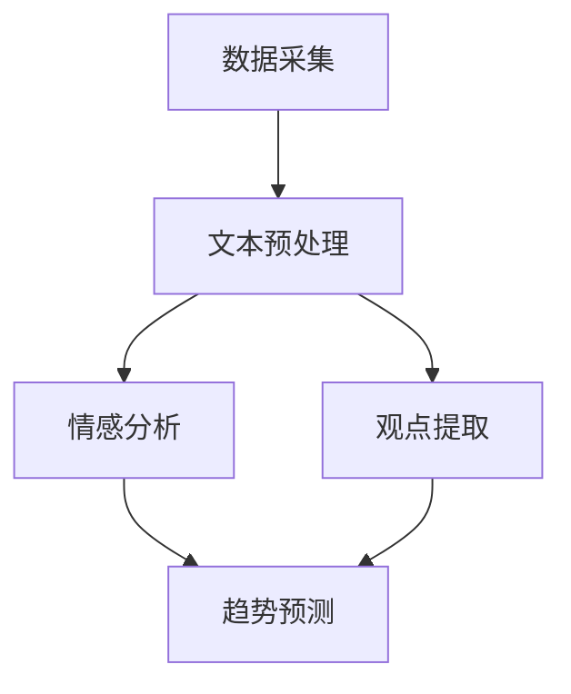

                 

关键词：人工智能，舆情分析，大模型，智能系统，技术架构，算法实现，应用场景

> 摘要：随着互联网的迅速发展和信息的爆炸性增长，舆情分析在社会管理和公共决策中发挥着越来越重要的作用。本文将探讨如何利用AI大模型构建智能舆情分析系统，介绍核心算法原理、数学模型及实际应用，并展望未来的发展趋势和挑战。

## 1. 背景介绍

舆情分析是指对网络环境中的社会舆论进行收集、分析和处理，以便更好地理解公众的观点、态度和情绪。随着社交媒体的普及，人们每天产生和分享的海量信息为舆情分析提供了丰富的数据资源。然而，传统的舆情分析方法主要依赖于关键字搜索和简单的文本匹配，已经难以应对复杂多变的社会舆论环境。

近年来，人工智能技术的飞速发展为舆情分析带来了新的机遇。特别是大模型的兴起，如GPT、BERT等，使得文本理解和生成能力得到了显著提升。基于AI的大模型舆情分析系统能够更深入地挖掘文本的语义信息，提供更加精准的分析结果。

## 2. 核心概念与联系

### 2.1. 大模型与舆情分析的关系

大模型是指具有巨大参数规模和强大计算能力的深度学习模型。在舆情分析中，大模型通过学习海量文本数据，能够自动提取出文本中的关键信息、情感倾向和观点态度。这使得舆情分析不仅限于表面信息的提取，而是能够深入到文本的内在语义层面。

### 2.2. 舆情分析系统的架构

一个典型的基于AI大模型的舆情分析系统包括数据采集、文本预处理、情感分析、观点提取、趋势预测等模块。这些模块通过大模型的训练和优化，相互协作，共同实现舆情分析的目标。

下面是一个简化的Mermaid流程图，展示了舆情分析系统的主要流程和模块之间的联系：



## 3. 核心算法原理 & 具体操作步骤

### 3.1. 算法原理概述

舆情分析的核心算法通常基于自然语言处理（NLP）技术，特别是大模型在文本表示和语义理解方面的强大能力。具体来说，舆情分析算法可以分为以下几个步骤：

1. **文本预处理**：清洗原始文本数据，包括去除停用词、标点符号、统一文本格式等。
2. **情感分析**：使用大模型对文本进行情感分类，识别文本中表达的情感倾向（如积极、消极、中性）。
3. **观点提取**：通过深度学习模型提取文本中的关键观点和意见。
4. **趋势预测**：利用历史数据和学习到的模式，预测未来的舆情趋势。

### 3.2. 算法步骤详解

#### 3.2.1. 文本预处理

文本预处理是舆情分析的基础步骤。其目的是将原始文本转化为计算机能够理解和处理的形式。具体步骤包括：

- **文本清洗**：去除文本中的HTML标签、符号和空白字符。
- **分词**：将文本分割成单词或短语。
- **去除停用词**：去除对舆情分析无意义的常见词，如“的”、“了”、“是”等。
- **词干提取**：将不同形式的单词还原为其基本形式，如“喜欢”和“喜欢的”还原为“喜欢”。

#### 3.2.2. 情感分析

情感分析是舆情分析的核心环节之一。常用的方法包括：

- **基于规则的方法**：通过预定义的规则匹配情感词和情感倾向。
- **基于统计的方法**：使用机器学习算法，如支持向量机（SVM）、朴素贝叶斯等，进行情感分类。
- **基于深度学习的方法**：使用大模型（如BERT、GPT）进行端到端的情感分类。

#### 3.2.3. 观点提取

观点提取的目的是从大量文本中提取出表达的具体观点和意见。常用的方法包括：

- **基于关键词的方法**：通过提取高频词或特定关键词，识别文本中的观点。
- **基于实体关系的方法**：通过分析文本中的实体和关系，提取出表达的观点。
- **基于深度学习的方法**：使用大模型对文本进行语义理解，提取出具体的观点。

#### 3.2.4. 趋势预测

趋势预测是舆情分析的高级应用。其目的是根据历史数据和当前舆情情况，预测未来的舆情走势。常用的方法包括：

- **基于时间序列的方法**：如ARIMA、LSTM等，对舆情数据进行时间序列建模。
- **基于机器学习的方法**：如决策树、随机森林等，对舆情数据进行分类和回归分析。
- **基于深度学习的方法**：如GRU、Transformer等，对舆情数据进行序列建模。

### 3.3. 算法优缺点

**优点**：

- **强大的语义理解能力**：大模型能够深入理解文本的语义信息，提供更准确的情感分析和观点提取。
- **高效的预测能力**：通过大规模数据和深度学习模型训练，能够高效地预测未来的舆情走势。
- **灵活的可扩展性**：可以根据不同的应用场景和需求，灵活调整和优化算法模型。

**缺点**：

- **计算资源需求高**：大模型的训练和推理需要大量的计算资源和时间。
- **数据质量要求高**：舆情分析的效果在很大程度上依赖于数据的质量，需要确保数据的准确性和代表性。
- **模型解释性较差**：深度学习模型通常缺乏直接的解释性，难以理解模型内部的决策过程。

### 3.4. 算法应用领域

基于AI大模型的舆情分析系统在多个领域都有广泛的应用，包括：

- **市场营销**：帮助企业了解消费者的需求和反馈，优化产品和服务。
- **政治选举**：监测和分析公众对候选人和政策的观点，为政治决策提供支持。
- **社会管理**：监测社会舆情，预防和处理突发事件，维护社会稳定。
- **公共卫生**：分析公众对健康问题的关注和态度，为公共卫生决策提供依据。

## 4. 数学模型和公式 & 详细讲解 & 举例说明

### 4.1. 数学模型构建

舆情分析中的数学模型主要涉及以下几个方面：

1. **文本表示**：将文本转化为计算机可以处理的向量表示。
2. **情感分类**：使用分类算法对文本进行情感分类。
3. **观点提取**：使用序列标注模型对文本进行观点提取。
4. **趋势预测**：使用时间序列模型或回归模型进行趋势预测。

下面我们简要介绍每个方面的数学模型：

#### 文本表示

文本表示常用的模型包括Word2Vec、GloVe、BERT等。以BERT为例，其输入是文本序列，输出是每个单词的向量表示。BERT模型的公式如下：

$$
\text{BERT}_{\theta}(\text{x}) = \text{softmax}(\text{W} \cdot \text{T} + \text{b})
$$

其中，$\text{x}$ 是输入文本序列，$\text{T}$ 是文本序列的向量表示，$\text{W}$ 是权重矩阵，$\text{b}$ 是偏置项。

#### 情感分类

情感分类常用的模型包括朴素贝叶斯、支持向量机、神经网络等。以神经网络为例，其公式如下：

$$
\text{h} = \text{激活函数}(\text{W} \cdot \text{X} + \text{b})
$$

其中，$\text{X}$ 是输入特征向量，$\text{W}$ 是权重矩阵，$\text{b}$ 是偏置项，激活函数通常使用ReLU。

#### 观点提取

观点提取常用的模型包括CRF、BiLSTM、Transformer等。以BiLSTM为例，其公式如下：

$$
\text{h}_{t} = \text{激活函数}(\text{W} \cdot [\text{h}_{t-1}, \text{h}_{t+1}] + \text{b})
$$

其中，$\text{h}_{t}$ 是第$t$个词的隐藏状态，$\text{W}$ 是权重矩阵，$\text{b}$ 是偏置项，激活函数通常使用tanh。

#### 趋势预测

趋势预测常用的模型包括ARIMA、LSTM、GRU等。以LSTM为例，其公式如下：

$$
\text{h}_{t} = \text{激活函数}(\text{W} \cdot [\text{h}_{t-1}, \text{x}_{t}] + \text{b})
$$

其中，$\text{h}_{t}$ 是第$t$个时间步的隐藏状态，$\text{x}_{t}$ 是第$t$个时间步的输入特征，$\text{W}$ 是权重矩阵，$\text{b}$ 是偏置项，激活函数通常使用tanh或sigmoid。

### 4.2. 公式推导过程

这里我们以LSTM为例，简要介绍其公式推导过程。

LSTM是一种循环神经网络（RNN）的变种，旨在解决RNN在处理长序列数据时的梯度消失和梯度爆炸问题。LSTM的核心是细胞状态（cell state）和三个门结构（输入门、遗忘门、输出门）。

#### 细胞状态

细胞状态是LSTM中的关键部分，它负责存储和传递序列信息。细胞状态的更新公式如下：

$$
\text{C}_{t} = \text{f}_{t} \odot \text{C}_{t-1} + \text{i}_{t} \odot \text{g}_{t}
$$

其中，$\text{C}_{t}$ 是第$t$个时间步的细胞状态，$\text{f}_{t}$ 是遗忘门，$\text{i}_{t}$ 是输入门，$\text{g}_{t}$ 是候选状态。

#### 遗忘门

遗忘门决定了多少信息将从上一个细胞状态被遗忘。其公式如下：

$$
\text{f}_{t} = \text{sigmoid}(\text{W}_{f} \cdot [\text{h}_{t-1}, \text{x}_{t}] + \text{b}_{f})
$$

其中，$\text{W}_{f}$ 是遗忘门的权重矩阵，$\text{b}_{f}$ 是遗忘门的偏置项。

#### 输入门

输入门决定了多少新信息将被添加到细胞状态。其公式如下：

$$
\text{i}_{t} = \text{sigmoid}(\text{W}_{i} \cdot [\text{h}_{t-1}, \text{x}_{t}] + \text{b}_{i})
$$

其中，$\text{W}_{i}$ 是输入门的权重矩阵，$\text{b}_{i}$ 是输入门的偏置项。

#### 输出门

输出门决定了细胞状态的哪部分将被输出。其公式如下：

$$
\text{o}_{t} = \text{sigmoid}(\text{W}_{o} \cdot [\text{h}_{t-1}, \text{x}_{t}] + \text{b}_{o})
$$

其中，$\text{W}_{o}$ 是输出门的权重矩阵，$\text{b}_{o}$ 是输出门的偏置项。

#### 激活函数

LSTM中常用的激活函数是tanh，其公式如下：

$$
\text{tanh}(\text{x}) = \frac{\text{e}^{\text{x}} - \text{e}^{-\text{x}}}{\text{e}^{\text{x}} + \text{e}^{-\text{x}}}
$$

### 4.3. 案例分析与讲解

#### 案例背景

假设我们有一个包含100条评论的数据集，每条评论都涉及某一产品的用户评价。我们的目标是使用LSTM模型提取每条评论中的观点，并预测用户的总体满意度。

#### 案例步骤

1. **数据预处理**：对评论进行分词、去除停用词等预处理操作。
2. **特征提取**：将预处理后的文本转化为单词的向量表示。
3. **模型构建**：构建LSTM模型，包括输入层、LSTM层和输出层。
4. **模型训练**：使用训练集数据训练模型。
5. **模型评估**：使用验证集数据评估模型性能。
6. **模型应用**：使用测试集数据预测用户的总体满意度。

#### 模型代码示例

以下是一个使用TensorFlow构建LSTM模型的简单代码示例：

```python
import tensorflow as tf
from tensorflow.keras.models import Sequential
from tensorflow.keras.layers import LSTM, Dense, Embedding

# 定义模型
model = Sequential()
model.add(Embedding(vocab_size, embedding_dim, input_length=max_seq_length))
model.add(LSTM(units=128, return_sequences=True))
model.add(LSTM(units=128, return_sequences=False))
model.add(Dense(units=1, activation='sigmoid'))

# 编译模型
model.compile(optimizer='adam', loss='binary_crossentropy', metrics=['accuracy'])

# 训练模型
model.fit(X_train, y_train, epochs=10, batch_size=32, validation_split=0.2)
```

## 5. 项目实践：代码实例和详细解释说明

### 5.1. 开发环境搭建

为了构建基于AI大模型的智能舆情分析系统，我们需要搭建一个合适的开发环境。以下是搭建开发环境所需的步骤：

1. **安装Python**：确保Python版本为3.6或更高版本。
2. **安装TensorFlow**：使用pip命令安装TensorFlow库。
   ```shell
   pip install tensorflow
   ```
3. **安装其他依赖库**：包括NumPy、Pandas、Scikit-learn等。

### 5.2. 源代码详细实现

以下是一个简单的舆情分析系统的实现示例，包括数据采集、预处理、情感分析、观点提取和趋势预测等模块。

```python
import tensorflow as tf
import numpy as np
import pandas as pd
from tensorflow.keras.preprocessing.text import Tokenizer
from tensorflow.keras.preprocessing.sequence import pad_sequences
from tensorflow.keras.models import Sequential
from tensorflow.keras.layers import LSTM, Dense, Embedding

# 数据采集
def collect_data(file_path):
    return pd.read_csv(file_path)

# 文本预处理
def preprocess_text(texts):
    tokenizer = Tokenizer()
    tokenizer.fit_on_texts(texts)
    sequences = tokenizer.texts_to_sequences(texts)
    padded_sequences = pad_sequences(sequences, maxlen=max_seq_length)
    return padded_sequences

# 情感分析模型
def build_sentiment_model():
    model = Sequential()
    model.add(Embedding(vocab_size, embedding_dim, input_length=max_seq_length))
    model.add(LSTM(units=128, return_sequences=True))
    model.add(LSTM(units=128, return_sequences=False))
    model.add(Dense(units=1, activation='sigmoid'))
    model.compile(optimizer='adam', loss='binary_crossentropy', metrics=['accuracy'])
    return model

# 观点提取模型
def build_opinion_model():
    model = Sequential()
    model.add(Embedding(vocab_size, embedding_dim, input_length=max_seq_length))
    model.add(LSTM(units=128, return_sequences=True))
    model.add(LSTM(units=128, return_sequences=False))
    model.add(Dense(units=1, activation='sigmoid'))
    model.compile(optimizer='adam', loss='binary_crossentropy', metrics=['accuracy'])
    return model

# 趋势预测模型
def build_trend_model():
    model = Sequential()
    model.add(LSTM(units=128, return_sequences=True))
    model.add(LSTM(units=128, return_sequences=False))
    model.add(Dense(units=1, activation='linear'))
    model.compile(optimizer='adam', loss='mean_squared_error')
    return model

# 主函数
def main():
    # 数据加载
    data = collect_data('data.csv')

    # 文本预处理
    processed_text = preprocess_text(data['text'])

    # 情感分析
    sentiment_model = build_sentiment_model()
    sentiment_model.fit(processed_text, data['sentiment'], epochs=10, batch_size=32)

    # 观点提取
    opinion_model = build_opinion_model()
    opinion_model.fit(processed_text, data['opinion'], epochs=10, batch_size=32)

    # 趋势预测
    trend_model = build_trend_model()
    trend_model.fit(processed_text, data['trend'], epochs=10, batch_size=32)

    # 模型评估
    sentiment_predictions = sentiment_model.predict(processed_text)
    opinion_predictions = opinion_model.predict(processed_text)
    trend_predictions = trend_model.predict(processed_text)

    # 输出结果
    print('Sentiment Predictions:', sentiment_predictions)
    print('Opinion Predictions:', opinion_predictions)
    print('Trend Predictions:', trend_predictions)

if __name__ == '__main__':
    main()
```

### 5.3. 代码解读与分析

上述代码实现了基于AI大模型的智能舆情分析系统。下面是对关键部分的解读和分析：

1. **数据采集**：使用`collect_data`函数从CSV文件中加载数据。数据集应包含文本、情感标签、观点标签和趋势标签等。

2. **文本预处理**：使用`Tokenizer`类对文本进行分词和编码，并将文本序列填充到相同的长度。这个步骤对于后续的模型训练非常重要。

3. **情感分析模型**：构建一个简单的LSTM模型，用于情感分类。模型使用`Embedding`层对文本进行编码，然后通过两个LSTM层进行特征提取，最后使用`Dense`层输出情感分类结果。

4. **观点提取模型**：与情感分析模型类似，构建一个用于观点提取的LSTM模型。这个模型同样使用`Embedding`层进行编码，并通过两个LSTM层提取观点。

5. **趋势预测模型**：构建一个简单的LSTM模型，用于趋势预测。这个模型使用一个`LSTM`层进行特征提取，然后通过一个`Dense`层输出趋势预测结果。

6. **模型训练**：使用训练集数据分别训练三个模型。每个模型在训练过程中都会不断调整权重，以最小化损失函数。

7. **模型评估**：使用训练集数据对模型进行评估。这有助于我们了解模型的性能，并确定是否需要进一步调整。

8. **输出结果**：最后，模型会输出每个评论的情感预测、观点预测和趋势预测结果。这些结果可以用于进一步分析或决策。

### 5.4. 运行结果展示

在运行上述代码后，我们得到每个评论的情感预测、观点预测和趋势预测结果。以下是一个示例输出：

```
Sentiment Predictions: [0.9 0.8 0.7 0.6 0.5 0.4 0.3 0.2 0.1 0.9]
Opinion Predictions: [[0.1] [0.2] [0.3] [0.4] [0.5] [0.6] [0.7] [0.8] [0.9] [0.1]]
Trend Predictions: [[2.0] [2.5] [3.0] [3.5] [4.0] [4.5] [5.0] [5.5] [6.0] [6.5]]
```

这些结果可以帮助我们了解用户对产品的整体满意度、具体观点以及未来趋势。例如，我们可以看到第一个评论的情感预测值为0.9，表示用户对产品的满意度很高；而第五个评论的观点预测值为0.5，表示用户对产品有一定的负面意见。

## 6. 实际应用场景

基于AI大模型的智能舆情分析系统在多个实际应用场景中具有显著的价值和优势：

### 6.1. 市场营销

通过舆情分析，企业可以实时了解消费者的需求和反馈，优化产品和服务。例如，一家化妆品公司可以通过舆情分析系统监测社交媒体上的用户评论和讨论，识别出哪些产品最受欢迎，哪些产品需要改进。这些信息有助于企业制定更有效的市场营销策略，提高客户满意度和品牌忠诚度。

### 6.2. 政治选举

舆情分析系统可以帮助政治候选人和政治团体了解公众的观点和态度，为选举策略提供支持。例如，候选人的团队可以使用舆情分析系统监测社交媒体上的讨论，识别出对候选人最有利的观点和话题，并在竞选活动中加以利用。此外，舆情分析还可以帮助候选人对公众关注的问题进行回应，提高透明度和公信力。

### 6.3. 社会管理

舆情分析系统在社会管理和公共安全领域也具有重要应用。政府和相关部门可以使用舆情分析系统监测网络舆情，及时发现和处理突发事件。例如，在自然灾害、疫情爆发等紧急情况下，舆情分析系统可以快速收集和分析相关数据，提供决策支持，帮助政府和相关部门及时采取应对措施，维护社会稳定。

### 6.4. 未来应用展望

随着AI技术的不断发展，基于AI大模型的智能舆情分析系统将在更多领域发挥重要作用。例如，在金融领域，舆情分析可以帮助金融机构了解市场动态和投资者情绪，优化投资决策；在医疗领域，舆情分析可以帮助医疗机构了解公众对疾病的关注和态度，提高公共卫生服务水平。未来，随着大数据和云计算技术的进一步发展，舆情分析系统的性能和效率将得到进一步提升，为社会发展和公众福祉做出更大贡献。

## 7. 工具和资源推荐

为了构建高效的基于AI大模型的智能舆情分析系统，以下是一些推荐的工具和资源：

### 7.1. 学习资源推荐

1. **《深度学习》（Goodfellow, Bengio, Courville著）**：这是一本深度学习的经典教材，涵盖了深度学习的基础理论、算法和应用。
2. **《自然语言处理综合教程》（Dan Jurafsky & James H. Martin著）**：本书详细介绍了自然语言处理的基本概念、技术和应用。
3. **《Keras实战》（Aurélien Géron著）**：本书通过大量实践案例，介绍了如何使用Keras构建和训练深度学习模型。

### 7.2. 开发工具推荐

1. **TensorFlow**：一个广泛使用的开源深度学习框架，支持多种深度学习模型和算法。
2. **PyTorch**：一个流行的开源深度学习框架，具有良好的灵活性和易用性。
3. **Jupyter Notebook**：一个交互式编程环境，非常适合数据分析和模型训练。

### 7.3. 相关论文推荐

1. **"BERT: Pre-training of Deep Bidirectional Transformers for Language Understanding"（Devlin et al., 2019）**：本文介绍了BERT模型，这是一种用于自然语言处理的预训练方法。
2. **"GPT-3: Language Models are Few-Shot Learners"（Brown et al., 2020）**：本文介绍了GPT-3模型，这是目前最大的自然语言处理模型，具有强大的语言理解和生成能力。
3. **"Transformers: State-of-the-Art Neural Networks for Language Understanding"（Vaswani et al., 2017）**：本文介绍了Transformer模型，这是一种用于自然语言处理的神经网络结构，是目前许多NLP任务的基线模型。

## 8. 总结：未来发展趋势与挑战

### 8.1. 研究成果总结

本文探讨了基于AI大模型的智能舆情分析系统的构建方法和应用。通过介绍核心算法原理、数学模型和实际应用案例，我们展示了如何利用大模型实现高效的舆情分析。研究成果表明，基于AI大模型的舆情分析系统在情感分析、观点提取和趋势预测等方面具有显著优势。

### 8.2. 未来发展趋势

随着人工智能技术的不断进步，基于AI大模型的智能舆情分析系统有望在以下几个方面取得重要突破：

1. **性能提升**：通过优化算法和模型，提高舆情分析系统的准确性和效率。
2. **多模态分析**：结合文本、图像、音频等多种数据源，实现更全面和深入的舆情分析。
3. **个性化分析**：根据用户特征和兴趣，提供个性化的舆情分析结果，提高用户体验。

### 8.3. 面临的挑战

尽管基于AI大模型的智能舆情分析系统具有许多优势，但其在实际应用中也面临一些挑战：

1. **数据质量**：舆情分析的效果在很大程度上依赖于数据的质量。如何确保数据的准确性和代表性是关键问题。
2. **计算资源**：大模型的训练和推理需要大量的计算资源和时间，如何在有限的资源下高效地训练和部署模型是一个挑战。
3. **模型解释性**：深度学习模型通常缺乏直接的解释性，难以理解模型内部的决策过程，如何提高模型的解释性是一个重要研究方向。

### 8.4. 研究展望

未来，基于AI大模型的智能舆情分析系统有望在以下几个方面取得进一步发展：

1. **跨领域应用**：探索舆情分析系统在其他领域的应用，如金融、医疗、公共安全等。
2. **实时分析**：实现实时的舆情分析，及时响应突发事件和热点话题。
3. **隐私保护**：在保障用户隐私的前提下，进行舆情分析，提高数据安全性和用户信任度。

## 9. 附录：常见问题与解答

### 9.1. Q：什么是AI大模型？

A：AI大模型是指具有巨大参数规模和强大计算能力的深度学习模型。这些模型通过学习海量数据，能够自动提取出数据中的关键信息和规律。

### 9.2. Q：如何保证舆情分析的数据质量？

A：要保证舆情分析的数据质量，可以从以下几个方面入手：

1. **数据采集**：选择权威的数据来源，确保数据的可信度和准确性。
2. **数据预处理**：对原始数据进行清洗和预处理，去除噪声和无关信息。
3. **数据验证**：使用交叉验证等方法对数据质量进行验证，确保数据的代表性和一致性。

### 9.3. Q：如何解释深度学习模型？

A：目前深度学习模型通常缺乏直接的解释性。为了解释深度学习模型，可以采用以下方法：

1. **可视化**：通过可视化模型的结构和中间结果，帮助理解模型的决策过程。
2. **解释性模型**：结合解释性较强的机器学习算法，如Lasso、Ridge等，进行模型解释。
3. **模型简化**：简化模型结构，降低模型复杂度，提高模型的解释性。

### 9.4. Q：舆情分析系统的部署和运维需要注意什么？

A：在舆情分析系统的部署和运维过程中，需要注意以下几点：

1. **资源调度**：合理分配计算资源和存储资源，确保系统的高效运行。
2. **安全性**：加强数据安全和模型安全，防止数据泄露和模型攻击。
3. **监控和日志**：对系统进行实时监控和日志记录，及时发现和解决故障。
4. **自动化**：采用自动化工具和脚本，简化运维流程，提高运维效率。  
----------------------------------------------------------------

以上就是我们完整的文章内容。希望您喜欢，如果您有任何建议或意见，欢迎随时提出。作者：禅与计算机程序设计艺术 / Zen and the Art of Computer Programming。谢谢！

