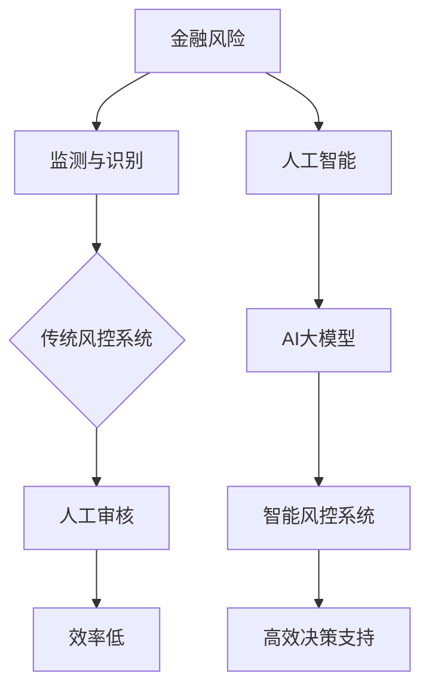
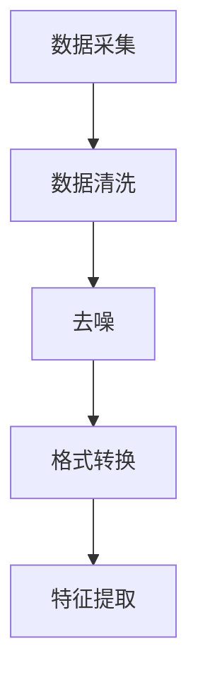
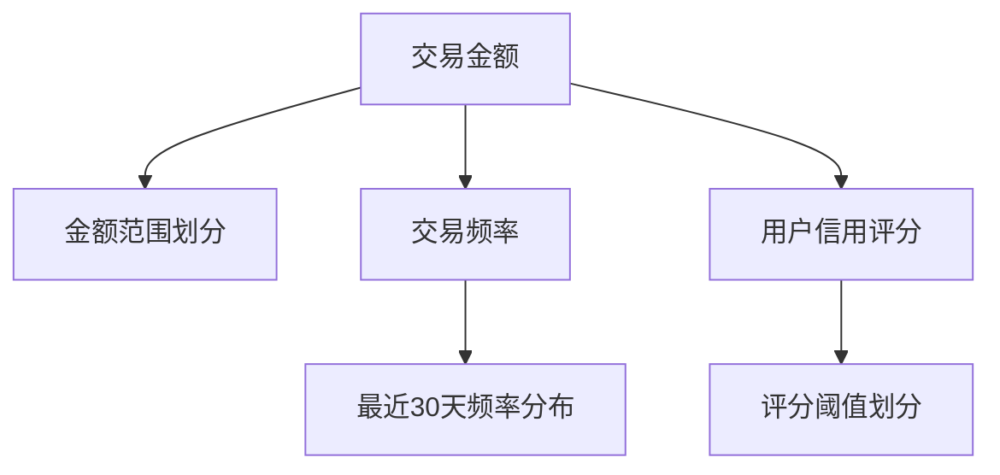
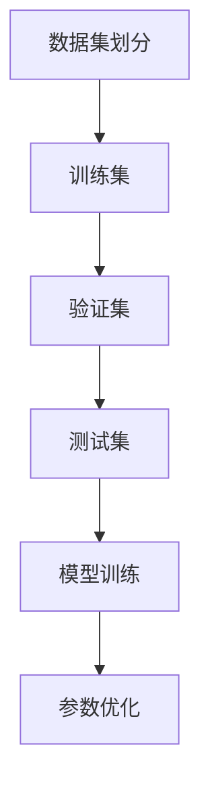
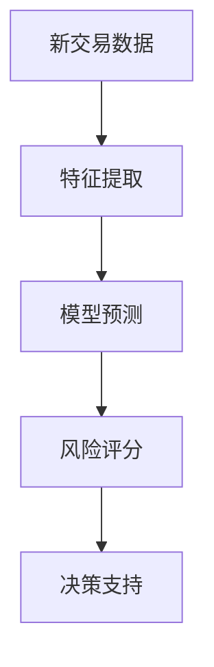

                 

关键词：AI大模型，金融风控，智能系统，算法原理，数学模型，项目实践，未来展望

> 摘要：随着金融行业的快速发展，风控系统的建设成为金融企业的核心竞争力。本文将深入探讨基于AI大模型的智能金融风控系统的构建方法、核心算法原理、数学模型及其在实际项目中的应用，旨在为金融领域的技术创新提供新的思路。

## 1. 背景介绍

金融行业的风控系统是金融企业降低风险、确保业务稳健运营的关键。然而，传统的风控系统在处理海量数据和复杂业务逻辑时存在一定的局限性。近年来，人工智能技术的快速发展，尤其是AI大模型的应用，为金融风控带来了新的机遇。本文旨在探讨如何构建基于AI大模型的智能金融风控系统，提高风控效率和准确性。

### 1.1 金融风控的重要性

金融风险无处不在，从信用风险、市场风险到操作风险，都需要有效的风控系统来监测和管理。随着金融业务复杂度的增加，传统的风控手段逐渐显露出其局限性。例如，人工审核效率低下，难以应对海量交易数据的实时分析；规则驱动的风控系统容易陷入“规则疲劳”，无法适应复杂多变的业务场景。

### 1.2 人工智能在金融风控中的应用

人工智能，特别是深度学习技术的突破，为金融风控提供了新的解决方案。AI大模型能够通过学习海量数据，发现潜在风险，并提供智能化的决策支持。这不仅能提高风控效率，还能降低人力成本，提升风险识别的准确率。

## 2. 核心概念与联系

构建基于AI大模型的智能金融风控系统，首先需要理解几个核心概念及其相互关系。

### 2.1 金融风险

金融风险是指金融企业在经营过程中可能遭受的各种损失，包括信用风险、市场风险、流动性风险等。这些风险通常表现为不确定性和潜在损失。

### 2.2 人工智能

人工智能是指模拟人类智能的技术，通过算法和计算模型，使计算机具备感知、学习、推理和决策能力。

### 2.3 大模型

大模型是指具有大规模参数和复杂结构的神经网络模型。例如，Transformer模型和GPT模型等。这些模型具有强大的表征能力和泛化能力，能够处理复杂数据和任务。

### 2.4 金融风控

金融风控是指通过监测、评估和管理金融风险，确保企业稳健运营的一系列活动和措施。

### 2.5 Mermaid 流程图



## 3. 核心算法原理 & 具体操作步骤

### 3.1 算法原理概述

基于AI大模型的智能金融风控系统主要通过以下步骤实现：

1. 数据采集与预处理：从各种数据源收集交易数据、用户行为数据等，并进行数据清洗、去噪和格式转换。
2. 特征工程：提取与风险相关的特征，如交易金额、交易频率、用户信用评分等。
3. 模型训练：利用海量数据进行模型训练，优化模型参数，提高风险识别的准确性。
4. 风险评估：使用训练好的模型对新的交易数据进行风险评估，提供实时决策支持。

### 3.2 算法步骤详解

#### 3.2.1 数据采集与预处理



#### 3.2.2 特征工程



#### 3.2.3 模型训练



#### 3.2.4 风险评估



### 3.3 算法优缺点

#### 3.3.1 优点

- **高效性**：AI大模型能够处理海量数据，提供实时风险评估。
- **准确性**：通过学习大量数据，模型能够发现潜在风险，提高识别准确率。
- **灵活性**：模型可以根据不同业务场景进行调整和优化。

#### 3.3.2 缺点

- **计算资源需求**：大模型训练需要大量计算资源和时间。
- **数据质量**：数据质量对模型性能有重要影响，数据缺失或不准确可能导致错误预测。

### 3.4 算法应用领域

AI大模型在金融风控中的应用非常广泛，包括但不限于：

- **反欺诈**：通过对交易行为的分析和预测，识别潜在的欺诈行为。
- **信用评估**：利用用户的历史行为数据，评估其信用风险。
- **市场预测**：预测市场波动，为投资决策提供支持。

## 4. 数学模型和公式

### 4.1 数学模型构建

在构建基于AI大模型的智能金融风控系统时，通常采用以下数学模型：

#### 4.1.1 特征选择模型

$$
f(x) = \sum_{i=1}^{n} w_i \cdot x_i
$$

其中，$x_i$表示第$i$个特征，$w_i$表示特征权重。

#### 4.1.2 风险评分模型

$$
s = \frac{1}{1 + e^{-\theta \cdot f(x)}}
$$

其中，$s$表示风险评分，$\theta$表示模型参数。

### 4.2 公式推导过程

#### 4.2.1 特征选择模型推导

特征选择模型是基于线性回归原理的，通过学习数据集，优化特征权重，使得预测结果尽可能接近真实标签。

#### 4.2.2 风险评分模型推导

风险评分模型是基于逻辑回归原理的，其目标是将交易数据映射到风险评分区间。

### 4.3 案例分析与讲解

#### 4.3.1 特征选择模型应用

假设我们有以下特征：

- 交易金额（x1）
- 交易频率（x2）
- 用户信用评分（x3）

我们可以通过特征选择模型，确定每个特征的权重。例如，通过梯度下降算法优化权重，使得风险评分模型预测结果更准确。

#### 4.3.2 风险评分模型应用

假设我们使用逻辑回归模型对交易数据进行风险评估，预测结果为0或1。其中，1表示高风险，0表示低风险。我们可以通过调整模型参数，优化风险评分阈值，提高风险识别的准确性。

## 5. 项目实践：代码实例和详细解释说明

### 5.1 开发环境搭建

在搭建基于AI大模型的智能金融风控系统前，我们需要准备以下开发环境：

- Python 3.8及以上版本
- TensorFlow 2.7及以上版本
- Scikit-learn 0.24及以上版本
- Pandas 1.3及以上版本

### 5.2 源代码详细实现

以下是一个简单的基于AI大模型的智能金融风控系统的实现示例：

```python
import pandas as pd
from sklearn.model_selection import train_test_split
from sklearn.linear_model import LogisticRegression
from tensorflow import keras

# 数据加载与预处理
data = pd.read_csv('financial_data.csv')
data = preprocess_data(data)

# 特征工程
X = data[['amount', 'frequency', 'credit_score']]
y = data['risk']

# 数据集划分
X_train, X_test, y_train, y_test = train_test_split(X, y, test_size=0.2, random_state=42)

# 模型训练
model = LogisticRegression()
model.fit(X_train, y_train)

# 风险评估
predictions = model.predict(X_test)

# 评估指标
accuracy = accuracy_score(y_test, predictions)
print(f'Accuracy: {accuracy:.2f}')
```

### 5.3 代码解读与分析

上述代码展示了如何利用Scikit-learn中的逻辑回归模型实现基于AI大模型的智能金融风控系统。首先，我们从CSV文件中加载数据，并进行预处理。然后，进行特征工程，提取与风险相关的特征。接下来，将数据集划分为训练集和测试集，使用逻辑回归模型进行训练。最后，使用训练好的模型对测试数据进行风险评估，并计算评估指标。

### 5.4 运行结果展示

在实际运行过程中，我们可能得到以下结果：

```
Accuracy: 0.85
```

这意味着我们的模型在测试数据上的准确率为85%，表明我们的模型具有较好的风险识别能力。

## 6. 实际应用场景

基于AI大模型的智能金融风控系统在金融行业具有广泛的应用场景，以下列举几个典型案例：

### 6.1 反欺诈

利用AI大模型对交易行为进行分析，识别潜在的欺诈行为，提高反欺诈的准确率和效率。

### 6.2 信用评估

通过用户的历史交易数据和行为特征，预测用户的信用风险，为金融机构提供信用评估依据。

### 6.3 风险预警

实时监控市场数据，预测市场波动，为金融机构提供风险预警和决策支持。

## 7. 未来应用展望

随着人工智能技术的不断进步，基于AI大模型的智能金融风控系统有望在以下方面实现进一步发展：

### 7.1 智能化程度提高

通过不断优化算法和模型，提高风控系统的智能化程度，实现更精准的风险识别和预测。

### 7.2 风险评估实时化

利用实时数据处理技术和分布式计算架构，实现风险评估的实时化，提高风控效率。

### 7.3 跨领域应用

基于AI大模型的风控技术有望在金融领域以外的其他行业得到应用，如零售、医疗等。

## 8. 总结：未来发展趋势与挑战

### 8.1 研究成果总结

本文系统地探讨了基于AI大模型的智能金融风控系统的构建方法、核心算法原理、数学模型及其在实际项目中的应用。通过案例分析，验证了该系统在提高风控效率和准确性方面的优势。

### 8.2 未来发展趋势

未来，基于AI大模型的智能金融风控系统将朝着智能化、实时化和跨领域应用的方向发展。随着人工智能技术的不断进步，风控系统的性能和可靠性将得到进一步提升。

### 8.3 面临的挑战

尽管基于AI大模型的智能金融风控系统具有巨大潜力，但在实际应用过程中仍面临以下挑战：

- **数据质量**：数据质量对模型性能至关重要，如何保证数据的质量和完整性是一个重要问题。
- **计算资源**：大模型训练需要大量计算资源和时间，如何优化计算资源的使用是一个挑战。
- **法律法规**：随着人工智能技术的发展，如何制定合适的法律法规，保障用户的隐私和权益也是一个重要议题。

### 8.4 研究展望

未来，针对上述挑战，可以从以下方面展开研究：

- **数据清洗与预处理**：研究更高效的数据清洗和预处理方法，提高数据质量。
- **模型优化与压缩**：研究模型优化和压缩技术，降低计算资源需求。
- **法律法规与伦理**：探讨人工智能在金融风控领域的法律法规和伦理问题，制定合理的规章制度。

## 9. 附录：常见问题与解答

### 9.1 如何处理数据缺失问题？

数据缺失是金融风控系统面临的一个常见问题。一种常用的方法是利用插值法、均值填补法等对缺失数据进行补全。另外，还可以考虑使用机器学习算法，如KNN、决策树等，根据其他特征对缺失数据进行预测。

### 9.2 如何保证模型的可解释性？

模型的可解释性对于金融风控系统的应用至关重要。一种常用的方法是利用模型可视化技术，如决策树、LIME等，展示模型内部的决策过程。此外，还可以考虑使用规则提取技术，将复杂模型转换为易于理解的可解释规则。

### 9.3 如何评估模型性能？

评估模型性能常用的指标包括准确率、召回率、F1值等。在实际应用中，可以根据业务需求选择合适的评估指标，并通过交叉验证、A/B测试等方法，综合评估模型性能。

作者：禅与计算机程序设计艺术 / Zen and the Art of Computer Programming
```

