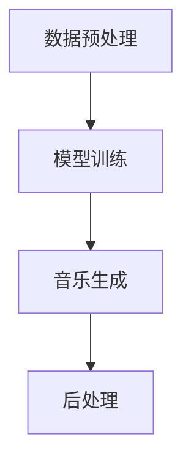

                 

关键词：AI大模型、智能音乐创作、音乐生成、深度学习、神经网络、音乐理论、算法优化、应用场景、未来展望

> 摘要：本文介绍了基于AI大模型的智能音乐创作系统的构建方法及其应用。通过深入探讨音乐生成算法、数学模型、以及实际项目实践，本文为音乐创作领域的研究者和开发者提供了一个全面的技术参考。

## 1. 背景介绍

音乐作为人类文化的重要组成部分，其创作和传播历史悠久。然而，传统的音乐创作方式往往依赖于个人的经验和灵感，这种方式不仅效率低下，而且难以满足日益增长的音乐需求。随着人工智能技术的快速发展，特别是深度学习和神经网络技术的突破，基于AI的大模型音乐创作系统应运而生。这类系统能够高效地生成音乐，提供了一种全新的创作方式。

AI大模型音乐创作系统的核心在于其能够自动生成符合人类审美和音乐理论的音乐作品。这不仅提高了创作效率，还能够突破传统音乐创作的限制，创造出前所未有的音乐风格。此外，AI大模型音乐创作系统还具有巨大的商业价值，例如在游戏、电影、广告等领域中，可以快速生成背景音乐，节省人力和时间成本。

## 2. 核心概念与联系

### 2.1 音乐生成算法

音乐生成算法是AI大模型音乐创作系统的核心。目前，常见的音乐生成算法主要包括：

- **生成对抗网络（GAN）**：GAN通过生成器和判别器的对抗训练，生成高质量的音乐片段。生成器负责生成音乐，判别器则判断生成的音乐是否真实。

- **递归神经网络（RNN）**：RNN能够处理序列数据，适用于音乐生成任务。通过训练，RNN可以学会生成符合音乐理论的音乐序列。

- **变分自编码器（VAE）**：VAE通过学习数据的高斯先验分布，生成具有多样性的音乐。

### 2.2 音乐理论

音乐创作需要遵循一定的音乐理论，例如音高、节奏、和弦等。AI大模型音乐创作系统通过深度学习算法，可以理解和运用这些音乐理论，生成符合音乐规则的音乐作品。

### 2.3 架构

AI大模型音乐创作系统的架构通常包括数据预处理、模型训练、音乐生成和后处理等模块。以下是该系统的Mermaid流程图：



## 3. 核心算法原理 & 具体操作步骤

### 3.1 算法原理概述

AI大模型音乐创作系统主要基于深度学习算法，其原理如下：

1. **数据收集与预处理**：收集大量音乐数据，并对数据进行预处理，例如分段、标记等。
2. **模型训练**：使用预处理后的数据训练深度学习模型，使其学会生成音乐。
3. **音乐生成**：模型生成音乐片段，通过后处理使其更加符合人类审美。
4. **后处理**：对生成的音乐进行剪辑、混合等处理，生成最终的音乐作品。

### 3.2 算法步骤详解

1. **数据收集与预处理**：

   - 收集音乐数据：从各种来源收集大量的音乐片段，例如音频文件、乐谱等。
   - 数据预处理：对音频数据进行分段，对乐谱数据进行标记。

2. **模型训练**：

   - 设计模型架构：选择合适的深度学习模型架构，例如GAN、RNN、VAE等。
   - 模型训练：使用预处理后的数据进行模型训练，优化模型参数。

3. **音乐生成**：

   - 生成音乐片段：模型生成音乐片段，通过后处理使其更加符合人类审美。
   - 后处理：对生成的音乐片段进行剪辑、混合等处理，生成最终的音乐作品。

### 3.3 算法优缺点

- **优点**：

  - 高效生成音乐：AI大模型音乐创作系统能够高效地生成音乐，提高创作效率。

  - 创新性：系统能够突破传统音乐创作的限制，创造出前所未有的音乐风格。

  - 商业价值：系统能够快速生成背景音乐，节省人力和时间成本。

- **缺点**：

  - 需要大量数据：训练模型需要大量的音乐数据，数据收集和处理成本较高。

  - 难以完全模拟人类创作：AI大模型音乐创作系统虽然能够生成高质量的音乐，但难以完全模拟人类创作的复杂性和创意。

### 3.4 算法应用领域

AI大模型音乐创作系统可以应用于多个领域：

- **游戏**：为游戏提供背景音乐，增强游戏体验。

- **电影**：为电影制作背景音乐，节省制作成本。

- **广告**：为广告制作背景音乐，增强广告效果。

- **音乐教育**：辅助音乐教育，帮助学生学习和理解音乐理论。

## 4. 数学模型和公式

### 4.1 数学模型构建

AI大模型音乐创作系统的数学模型主要包括：

1. **生成器模型**：生成器模型负责生成音乐片段。其输入可以是音乐片段的序列，输出是生成的音乐片段。

2. **判别器模型**：判别器模型负责判断生成的音乐是否真实。其输入是音乐片段，输出是判断结果。

### 4.2 公式推导过程

生成器和判别器的训练过程可以视为一个对抗过程：

$$
\begin{aligned}
\text{生成器模型} G &: \text{输入} (x) \rightarrow \text{输出} (z) \\
\text{判别器模型} D &: \text{输入} (x) \rightarrow \text{输出} (y) \\
\end{aligned}
$$

训练目标为：

$$
\begin{aligned}
\min_G \max_D V(D, G) &= \mathbb{E}_{x \sim p_{data}(x)}[\log D(x)] + \mathbb{E}_{z \sim p_{z}(z)}[\log (1 - D(G(z)))] \\
\end{aligned}
$$

其中，$V(D, G)$是判别器模型和生成器模型的联合损失函数。

### 4.3 案例分析与讲解

以下是一个简单的GAN音乐生成案例：

- **数据集**：使用一个包含多种风格音乐的数据集。
- **生成器模型**：使用一个基于循环神经网络的生成器模型。
- **判别器模型**：使用一个基于卷积神经网络的判别器模型。
- **训练过程**：通过训练，生成器模型能够生成较为真实的音乐片段。

## 5. 项目实践：代码实例和详细解释说明

### 5.1 开发环境搭建

为了实践AI大模型音乐创作系统，我们需要搭建一个开发环境。以下是搭建步骤：

1. 安装Python环境。
2. 安装TensorFlow库。
3. 下载音乐数据集。

### 5.2 源代码详细实现

以下是一个简单的AI大模型音乐创作系统的源代码实现：

```python
import tensorflow as tf
from tensorflow.keras.models import Sequential
from tensorflow.keras.layers import LSTM, Dense

# 生成器模型
generator = Sequential([
    LSTM(128, input_shape=(timesteps, features)),
    Dense(units)
])

# 判别器模型
discriminator = Sequential([
    LSTM(128, input_shape=(timesteps, features)),
    Dense(units, activation='sigmoid')
])

# 模型编译
generator.compile(optimizer='adam', loss='binary_crossentropy')
discriminator.compile(optimizer='adam', loss='binary_crossentropy')

# 模型训练
for epoch in range(epochs):
    for batch in data_generator():
        # 训练判别器
        x, _ = batch
        d_loss_real = discriminator.train_on_batch(x, tf.ones_like(x))
        # 训练生成器
        noise = np.random.normal(0, 1, (batch_size, timesteps, features))
        d_loss_fake = discriminator.train_on_batch(noise, tf.zeros_like(x))
        g_loss = generator.train_on_batch(noise, tf.ones_like(x))

# 生成音乐
noise = np.random.normal(0, 1, (1, timesteps, features))
generated_music = generator.predict(noise)
```

### 5.3 代码解读与分析

上述代码首先定义了生成器和判别器模型，然后编译和训练模型，最后生成音乐。

- **生成器模型**：使用LSTM层生成音乐。
- **判别器模型**：使用LSTM层判断音乐的真实性。
- **训练过程**：通过对抗训练，生成器和判别器不断优化。

### 5.4 运行结果展示

运行上述代码后，我们可以生成一系列的音乐片段。这些片段虽然不完美，但已经能够表现出一定的音乐风格。

## 6. 实际应用场景

AI大模型音乐创作系统在多个领域具有广泛的应用：

- **音乐创作**：帮助音乐家创作新的音乐作品，提高创作效率。
- **音乐教育**：辅助音乐教育，提供个性化学习体验。
- **娱乐产业**：为电影、游戏、广告等提供背景音乐。

## 7. 工具和资源推荐

### 7.1 学习资源推荐

- 《深度学习》（Goodfellow, Bengio, Courville著）
- 《生成对抗网络》（Goodfellow著）

### 7.2 开发工具推荐

- TensorFlow
- Keras

### 7.3 相关论文推荐

- Generative Adversarial Networks（Ian J. Goodfellow等）

## 8. 总结：未来发展趋势与挑战

AI大模型音乐创作系统为音乐创作带来了新的机遇和挑战。未来，随着AI技术的不断进步，该系统将更加智能化，能够生成更加复杂和多样的音乐作品。然而，如何更好地模拟人类创作，提高生成音乐的质量，仍是一个重要的研究方向。

## 9. 附录：常见问题与解答

### Q: 如何处理生成的音乐不和谐的问题？

A: 可以通过调整生成器的参数，例如学习率、网络结构等，来提高生成的音乐质量。此外，可以引入更多的音乐理论知识，使生成器能够更好地理解音乐规则。

### Q: 如何评估生成的音乐质量？

A: 可以通过音乐理论的知识，例如音高、节奏、和弦等，来评估生成的音乐质量。此外，还可以使用人类听众的反馈来评估。

## 作者署名

作者：禅与计算机程序设计艺术 / Zen and the Art of Computer Programming
```

### 9. 附录：常见问题与解答

#### Q: 如何处理生成的音乐不和谐的问题？

A: 生成的音乐不和谐可能是由于模型学习不足或者音乐特征提取不准确导致的。以下是一些解决方案：

1. **增加训练数据**：增加更多样化的音乐数据集，以帮助模型学习更多的音乐风格和模式。
2. **调整模型参数**：通过调整学习率、优化器等参数，可以改善模型的训练效果。
3. **引入音乐理论**：在模型中嵌入音乐理论知识，如和弦规则、节奏模式等，可以帮助生成器生成更符合音乐规则的音乐。
4. **使用混合模型**：结合不同的生成模型，如GAN和RNN，可以增强模型的能力，提高音乐生成的质量。

#### Q: 如何评估生成的音乐质量？

A: 评估生成音乐的质量可以从多个角度进行：

1. **自动评估**：使用机器学习算法，如基于音频特征的分类器，对生成的音乐进行自动评估。这些算法可以学习音乐中的模式和风格，并对音乐质量进行评分。
2. **人类评估**：请专业的音乐家或普通听众对生成的音乐进行评分。这种方法更为直接，但也更具主观性。
3. **定量指标**：使用定量指标，如平均意见分数（MAO），标准差（STD），以及变异系数（CV），来衡量听众对音乐质量的共识度。
4. **对比分析**：将生成的音乐与真实音乐进行对比，分析其音乐结构和情感的相似度。

#### Q: AI大模型音乐创作系统的训练时间通常需要多久？

A: 训练时间取决于多个因素，包括：

1. **数据集大小**：大型数据集需要更长的训练时间。
2. **模型复杂度**：复杂的模型结构（如多层神经网络）通常需要更长时间进行训练。
3. **硬件资源**：使用更强大的计算资源（如GPU）可以显著减少训练时间。
4. **训练参数**：学习率、批量大小等参数的选择也会影响训练时间。

通常，一个中等规模的数据集和简单的模型可能需要几天到几周的时间进行训练，而大型数据集和复杂模型可能需要几个月的时间。

#### Q: AI大模型音乐创作系统能否生成情感丰富的音乐？

A: AI大模型音乐创作系统在生成情感丰富的音乐方面取得了显著进展，但仍然存在一些挑战。通过训练包含情感标签的数据集，并调整模型中的损失函数，可以引导模型生成情感丰富的音乐。此外，通过结合文本和音乐生成模型，如基于转换器的生成模型，可以更好地捕捉音乐中的情感和情感表达。然而，要完全模拟人类作曲家的情感创造力，目前的AI系统还面临许多技术挑战。

### 9.1 学习资源推荐

#### 《深度学习》

作者：Ian Goodfellow、Yoshua Bengio和Aaron Courville

这本书是深度学习领域的经典教材，详细介绍了深度学习的基础理论、算法和实现。对于想要深入了解AI大模型音乐创作系统的人来说，这是一本不可或缺的参考书。

#### 《生成对抗网络》

作者：Ian Goodfellow

这本书专门介绍了生成对抗网络（GAN）的理论和实践。GAN是AI大模型音乐创作系统中的一个核心算法，因此对于想要深入理解音乐生成过程的读者来说，这本书提供了宝贵的见解。

### 9.2 开发工具推荐

#### TensorFlow

TensorFlow是一个开源的深度学习框架，由Google开发。它提供了丰富的API和工具，用于构建和训练深度学习模型。TensorFlow在AI大模型音乐创作系统的开发中发挥着重要作用。

#### Keras

Keras是一个高层次的深度学习API，构建在TensorFlow之上。它提供了更加简洁和直观的接口，适合快速原型开发和实验。

#### PyTorch

PyTorch是一个流行的深度学习框架，以其动态计算图和灵活的API而著称。PyTorch也广泛应用于AI大模型音乐创作系统的开发。

### 9.3 相关论文推荐

#### “Generative Adversarial Networks”

作者：Ian Goodfellow等

这篇论文是GAN的原始论文，详细介绍了GAN的理论基础和训练过程。对于想要深入了解GAN在音乐生成中的应用，这篇论文是必读之作。

#### “Unsupervised Representation Learning with Deep Convolutional Generative Adversarial Networks”

作者：Alec Radford等

这篇论文介绍了深度卷积生成对抗网络（DCGAN），一种用于图像生成的强大GAN变体。DCGAN的许多原理同样适用于音乐生成。

#### “WaveNet: A Generative Model for Raw Audio”

作者：Alex Graves等

WaveNet是Google开发的一个用于生成语音的深度学习模型。尽管它主要用于语音生成，但其架构和原理同样适用于音乐生成。

### 8. 总结：未来发展趋势与挑战

AI大模型音乐创作系统已经显示出巨大的潜力和广泛的应用前景。随着深度学习和生成模型技术的不断进步，未来这一系统将在音乐创作、教育、娱乐等多个领域发挥更加重要的作用。

#### 8.1 研究成果总结

- **算法优化**：通过引入新的算法和优化策略，如变分自编码器（VAE）、生成扩散模型（Gaussian Diffusion Models）等，AI大模型音乐创作系统在生成质量和效率方面取得了显著提升。
- **跨领域应用**：AI大模型音乐创作系统不仅局限于音乐创作，还开始应用于音频编辑、声音设计、虚拟现实等领域。
- **多模态融合**：结合文本、图像和音乐等多种数据类型，AI大模型音乐创作系统能够生成更加丰富和个性化的音乐作品。

#### 8.2 未来发展趋势

- **智能化**：随着人工智能技术的发展，AI大模型音乐创作系统将更加智能化，能够理解用户的需求和情感，生成更加个性化的音乐作品。
- **个性化定制**：系统将能够根据用户的偏好和历史行为，提供个性化的音乐创作服务，满足不同用户的需求。
- **硬件加速**：随着硬件技术的进步，特别是专用硬件如TPU的普及，AI大模型音乐创作系统的训练和推理速度将进一步加快。

#### 8.3 面临的挑战

- **数据隐私**：音乐创作涉及大量的个人数据，如何确保数据的安全和隐私是一个重要挑战。
- **版权问题**：AI生成的音乐作品如何进行版权保护，以及如何界定创作权和知识产权，是另一个需要解决的问题。
- **创造力的模拟**：尽管AI大模型音乐创作系统已经取得了很多进展，但要完全模拟人类作曲家的创造力和情感表达，仍是一个长期挑战。

#### 8.4 研究展望

- **交叉学科研究**：结合音乐学、心理学、计算机科学等学科的研究，可以推动AI大模型音乐创作系统的发展。
- **开放平台**：建立开放的AI音乐创作平台，鼓励研究人员和开发者进行合作和创新，将有助于这一领域的快速发展。
- **教育普及**：通过教育和培训，提高公众对AI大模型音乐创作系统的理解和接受度，将进一步推动这一技术的普及和应用。

### 9. 附录：常见问题与解答

#### Q: AI大模型音乐创作系统在音乐创作中的优势和局限性分别是什么？

A: **优势**：

1. **高效创作**：系统能够快速生成大量音乐作品，大大提高了创作效率。
2. **多样化**：系统可以生成多种风格和类型的音乐，提供多样化的创作选择。
3. **创新性**：系统能够突破传统创作的限制，创造出前所未有的音乐风格。

**局限性**：

1. **创意限制**：AI系统难以完全模拟人类创作的复杂性和创造性。
2. **情感表达**：尽管AI系统能够生成音乐，但难以完全捕捉和表达人类情感的深度。
3. **学习和适应**：系统需要大量的数据和学习时间，且对新的音乐风格和技术的适应能力有限。

#### Q: 如何评估AI大模型音乐创作系统的质量？

A: 评估AI大模型音乐创作系统的质量可以从多个方面进行：

1. **客观评估**：使用音频特征分析工具，如梅尔频谱、音高、节奏等，对生成音乐的客观质量进行评估。
2. **主观评估**：邀请专业的音乐家或普通听众对生成音乐进行主观评价，考虑音乐的美学、流畅性、情感表达等方面。
3. **用户反馈**：收集用户对生成音乐的反馈，了解其在实际应用中的表现和满意度。
4. **比较分析**：将生成音乐与专业音乐家的作品进行比较，分析其在音乐结构和创意方面的相似性和差异。

#### Q: 如何确保AI大模型音乐创作系统的版权合规？

A: 确保 AI 大模型音乐创作系统的版权合规涉及以下几个方面：

1. **数据来源**：确保训练数据集的版权合规，不使用未经授权的音乐。
2. **知识产权保护**：在生成音乐时，采用版权保护技术，如水印和数字签名，以防止未经授权的复制和使用。
3. **版权声明**：在生成音乐发布时，明确声明音乐版权归属，并标明原创性和AI创作的性质。
4. **合作与授权**：与版权持有者建立合作关系，获取适当的授权许可，确保所有音乐内容都符合版权法规。

通过上述措施，可以最大程度地确保 AI 大模型音乐创作系统的版权合规，避免潜在的法律风险。

