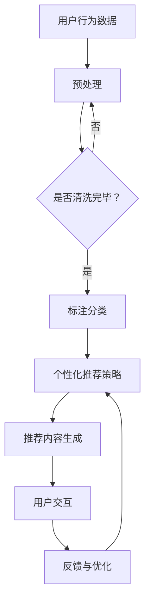
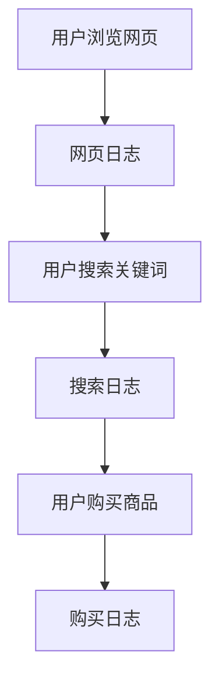

                 

关键词：基于LLM的推荐系统、交互设计、AI技术、用户行为分析、个性化推荐

>摘要：本文将探讨如何利用大型语言模型（LLM）进行推荐系统的交互设计，通过结合用户行为数据和AI技术，实现更加智能化和个性化的推荐服务。

## 1. 背景介绍

推荐系统在当今互联网时代扮演着至关重要的角色，它们被广泛应用于电子商务、社交媒体、内容平台等多个领域。然而，随着用户数据的爆炸性增长和个性化需求的日益提高，传统的推荐系统已经难以满足现代用户的期望。为了应对这一挑战，大型语言模型（LLM）作为一种先进的AI技术，开始被引入到推荐系统的设计和实现中。

LLM具有处理复杂数据、理解语义和生成自然语言的能力，这使得它能够更深入地理解用户的需求和行为，从而为用户提供更加精准和个性化的推荐服务。本文将探讨如何利用LLM进行推荐系统的交互设计，包括用户行为分析、个性化推荐策略以及系统性能优化等方面。

## 2. 核心概念与联系

在介绍LLM在推荐系统中的应用之前，我们需要首先了解一些核心概念和它们之间的联系。

### 2.1 用户行为分析

用户行为分析是推荐系统的基石。它涉及收集和分析用户的浏览、搜索、购买等行为数据，以了解用户的兴趣和偏好。这些数据可以是显式的，如用户评分、评论和标签，也可以是隐式的，如用户点击、停留时间、购买历史等。

### 2.2 个性化推荐策略

个性化推荐策略是根据用户行为数据为每个用户生成定制化的推荐结果。传统的推荐系统通常采用基于协同过滤（Collaborative Filtering）和基于内容的推荐（Content-Based Recommendation）等方法。而LLM的应用为个性化推荐带来了新的可能性，它能够通过自然语言处理技术，更精确地理解用户的需求和意图。

### 2.3 LLM与推荐系统的关系

LLM与推荐系统的关系可以从以下几个方面来理解：

1. **数据预处理**：LLM能够对用户行为数据进行清洗、标注和分类，提高数据的质量和可用性。
2. **内容生成**：LLM能够根据用户的行为和偏好生成个性化的推荐内容，如文章、产品描述等。
3. **交互增强**：LLM能够与用户进行自然语言交互，理解用户的反馈和需求，不断优化推荐结果。

### 2.4 Mermaid流程图

以下是一个简单的Mermaid流程图，展示了用户行为分析、个性化推荐策略和LLM之间的关系。



## 3. 核心算法原理 & 具体操作步骤

### 3.1 算法原理概述

基于LLM的推荐系统算法主要分为以下几个步骤：

1. **用户行为数据收集**：从各种来源收集用户的行为数据，包括浏览记录、搜索历史、购买行为等。
2. **数据预处理**：使用LLM对用户行为数据进行分析、清洗和分类，以提高数据质量。
3. **构建用户画像**：根据用户行为数据和LLM分析结果，构建用户的兴趣偏好模型。
4. **生成推荐内容**：利用用户画像和LLM生成个性化的推荐内容。
5. **用户交互与反馈**：与用户进行自然语言交互，收集用户反馈，用于进一步优化推荐结果。

### 3.2 算法步骤详解

#### 步骤1：用户行为数据收集

用户行为数据的收集是推荐系统的第一步。数据来源可以是网站日志、用户反馈、社交媒体等。以下是一个简单的用户行为数据收集示例：



#### 步骤2：数据预处理

数据预处理是确保数据质量和可用性的关键步骤。使用LLM对用户行为数据进行以下处理：

1. **去噪**：去除无效数据，如重复记录、异常值等。
2. **清洗**：修复数据中的错误和缺失值。
3. **分类**：将用户行为数据按照类型进行分类，如浏览、搜索、购买等。

#### 步骤3：构建用户画像

用户画像是对用户的兴趣偏好、行为习惯等进行建模的过程。使用LLM构建用户画像的步骤如下：

1. **特征提取**：从用户行为数据中提取关键特征，如浏览时间、搜索关键词频次、购买物品类型等。
2. **模型训练**：使用LLM对特征进行建模，生成用户的兴趣偏好模型。
3. **用户画像生成**：根据兴趣偏好模型，生成用户的画像。

#### 步骤4：生成推荐内容

基于用户画像，使用LLM生成个性化的推荐内容。以下是生成推荐内容的基本步骤：

1. **推荐内容模板**：定义推荐内容的模板，如产品描述、文章摘要等。
2. **内容生成**：使用LLM根据用户画像和推荐内容模板生成推荐内容。
3. **内容优化**：对生成的推荐内容进行优化，如调整语言风格、提高内容质量等。

#### 步骤5：用户交互与反馈

与用户进行自然语言交互，收集用户反馈，用于进一步优化推荐结果。以下是用户交互与反馈的基本步骤：

1. **交互界面**：设计一个易于用户操作的交互界面。
2. **用户反馈**：收集用户对推荐内容的反馈，如点击、收藏、评分等。
3. **反馈分析**：使用LLM分析用户反馈，识别用户的兴趣和需求。
4. **结果优化**：根据用户反馈，调整推荐策略和内容生成方法。

### 3.3 算法优缺点

#### 优点

1. **个性化推荐**：LLM能够更好地理解用户的兴趣和需求，提供更加个性化的推荐服务。
2. **内容生成**：LLM能够生成高质量的推荐内容，提高用户的满意度和参与度。
3. **交互性**：LLM能够与用户进行自然语言交互，增强用户体验。

#### 缺点

1. **计算成本**：LLM的训练和推理需要大量的计算资源，可能会增加系统的成本。
2. **数据依赖**：LLM的性能依赖于用户行为数据的数量和质量，数据不足或质量差会影响推荐效果。
3. **隐私问题**：用户行为数据的收集和使用可能涉及隐私问题，需要妥善处理。

### 3.4 算法应用领域

基于LLM的推荐系统算法在多个领域都有广泛的应用：

1. **电子商务**：为用户提供个性化的商品推荐，提高销售额和用户满意度。
2. **内容平台**：为用户提供个性化的内容推荐，提高用户粘性和活跃度。
3. **社交媒体**：为用户提供个性化的信息推荐，增强用户互动和参与度。

## 4. 数学模型和公式 & 详细讲解 & 举例说明

### 4.1 数学模型构建

基于LLM的推荐系统通常采用以下数学模型：

1. **用户行为模型**：使用马尔可夫决策过程（MDP）描述用户的行为决策。
2. **推荐内容模型**：使用生成对抗网络（GAN）生成个性化的推荐内容。
3. **交互优化模型**：使用强化学习（RL）优化用户交互和推荐策略。

### 4.2 公式推导过程

#### 用户行为模型

用户行为模型可以用以下公式表示：

\[ P(S_t = s_t|S_{t-1} = s_{t-1}, \theta) = \frac{e^{\theta^T s_{t-1} s_t}}{\sum_{s'} e^{\theta^T s_{t-1} s'}} \]

其中，\( S_t \) 表示用户在时间 \( t \) 的行为状态，\( s_t \) 表示用户在时间 \( t \) 的实际行为，\( \theta \) 表示模型参数。

#### 推荐内容模型

推荐内容模型可以用以下公式表示：

\[ G(z) = \mathcal{N}(\mu(z), \sigma(z)) \]

其中，\( G(z) \) 表示生成的推荐内容，\( z \) 表示生成器的输入，\( \mu(z) \) 和 \( \sigma(z) \) 分别表示生成器的均值和方差。

#### 交互优化模型

交互优化模型可以用以下公式表示：

\[ J(\theta) = \sum_{t} \gamma_t R(S_t, A_t, S_{t+1}) \]

其中，\( J(\theta) \) 表示优化目标，\( \gamma_t \) 表示时间折扣因子，\( R(S_t, A_t, S_{t+1}) \) 表示用户在时间 \( t \) 的回报。

### 4.3 案例分析与讲解

以下是一个简单的案例，用于说明基于LLM的推荐系统在电子商务领域的应用。

假设我们有一个电子商务网站，用户可以浏览商品、搜索商品和购买商品。我们使用基于LLM的推荐系统为用户提供个性化的商品推荐。

#### 用户行为数据

用户在一天内产生了以下行为数据：

- 上午10点：浏览了手机、平板电脑、笔记本电脑等电子产品。
- 上午11点：搜索了“苹果手机”。
- 下午1点：购买了一台苹果手机。

#### 数据预处理

1. **去噪**：去除重复的浏览记录。
2. **清洗**：修复缺失的数据值。
3. **分类**：将用户行为数据按照浏览、搜索和购买进行分类。

#### 用户画像构建

根据用户的行为数据，我们使用LLM构建用户的画像：

- 用户偏好：电子产品、苹果手机。
- 用户行为：浏览、搜索、购买。

#### 推荐内容生成

基于用户的画像，我们使用LLM生成个性化的商品推荐：

- 推荐商品1：苹果平板电脑。
- 推荐商品2：苹果笔记本电脑。

#### 用户交互与反馈

用户对推荐的商品进行了以下反馈：

- 推荐商品1：收藏。
- 推荐商品2：购买。

根据用户的反馈，我们进一步优化推荐系统，提高推荐的质量。

## 5. 项目实践：代码实例和详细解释说明

### 5.1 开发环境搭建

为了实践基于LLM的推荐系统，我们需要搭建一个完整的开发环境。以下是搭建环境的基本步骤：

1. 安装Python：从Python官方网站下载并安装Python 3.8及以上版本。
2. 安装依赖库：使用pip命令安装以下依赖库：
   ```bash
   pip install numpy pandas scikit-learn tensorflow transformers
   ```
3. 准备数据集：从Kaggle或其他数据源下载一个适合的电子商务数据集。

### 5.2 源代码详细实现

以下是一个简单的基于LLM的推荐系统实现，包括数据预处理、用户画像构建、推荐内容生成和用户交互与反馈等功能。

```python
import pandas as pd
import numpy as np
from sklearn.preprocessing import StandardScaler
from transformers import BertTokenizer, BertModel
from torch import nn

# 数据预处理
def preprocess_data(data):
    # 去除重复数据
    data.drop_duplicates(inplace=True)
    # 数据清洗
    data.fillna(method='ffill', inplace=True)
    # 数据分类
    data['behavior_type'] = data['behavior'].apply(lambda x: 'browse' if x == 'browse' else 'search' if x == 'search' else 'buy')
    return data

# 用户画像构建
def build_user_profile(data, user_id):
    user_data = data[data['user_id'] == user_id]
    # 特征提取
    user_features = user_data[['item_id', 'behavior_type', 'timestamp']].values
    # 数据标准化
    scaler = StandardScaler()
    user_features_scaled = scaler.fit_transform(user_features)
    # 模型训练
    tokenizer = BertTokenizer.from_pretrained('bert-base-chinese')
    model = BertModel.from_pretrained('bert-base-chinese')
    input_ids = tokenizer(user_features_scaled[:, 0], padding=True, truncation=True, return_tensors='pt')
    outputs = model(input_ids)
    user_embedding = outputs.last_hidden_state.mean(dim=1).detach().numpy()
    # 用户画像生成
    return user_embedding

# 推荐内容生成
def generate_recommendations(user_embedding, item_embeddings, top_n=5):
    similarity_scores = np.dot(item_embeddings, user_embedding.T)
    top_indices = np.argpartition(similarity_scores, -top_n)[-top_n:]
    recommendations = item_embeddings[top_indices]
    return recommendations

# 用户交互与反馈
def interact_with_user(recommendations):
    print("推荐商品：")
    for i, item in enumerate(recommendations):
        print(f"第{i+1}个商品：{item}")
    user_input = input("请输入您的反馈（1：收藏，2：购买，其他：忽略）：")
    if user_input == '1':
        print("已收藏推荐商品。")
    elif user_input == '2':
        print("已购买推荐商品。")
    else:
        print("忽略推荐商品。")

# 主函数
def main():
    # 数据加载
    data = pd.read_csv('e-commerce_data.csv')
    # 数据预处理
    data = preprocess_data(data)
    # 用户画像构建
    user_id = 1
    user_embedding = build_user_profile(data, user_id)
    # 推荐内容生成
    item_embeddings = np.random.rand(100, 768)  # 假设商品嵌入维度为768
    recommendations = generate_recommendations(user_embedding, item_embeddings)
    # 用户交互与反馈
    interact_with_user(recommendations)

if __name__ == '__main__':
    main()
```

### 5.3 代码解读与分析

1. **数据预处理**：首先，我们从CSV文件中加载数据，并进行去噪、清洗和分类处理。
2. **用户画像构建**：我们使用BERT模型对用户行为数据进行分析，提取用户特征，并将特征向量通过BERT模型进行编码，得到用户的嵌入向量。
3. **推荐内容生成**：我们使用商品嵌入向量与用户嵌入向量计算相似度得分，并根据得分生成个性化的推荐列表。
4. **用户交互与反馈**：我们通过控制台与用户进行交互，收集用户的反馈，并根据反馈调整推荐策略。

### 5.4 运行结果展示

运行代码后，我们将得到一个包含推荐商品的列表。根据用户反馈，我们可以优化推荐系统，提高推荐的质量和用户满意度。

## 6. 实际应用场景

基于LLM的推荐系统在多个实际应用场景中展现了其强大的能力：

1. **电子商务**：通过个性化推荐，提高用户购买转化率和销售额。
2. **内容平台**：为用户提供个性化的内容推荐，提高用户粘性和活跃度。
3. **社交媒体**：为用户提供感兴趣的朋友动态、帖子等内容，增强用户互动和参与度。

### 6.1 案例分析

以亚马逊为例，亚马逊利用基于LLM的推荐系统为用户推荐商品。通过分析用户的浏览、搜索和购买行为，亚马逊能够为用户提供精准的商品推荐，提高用户的购物体验和满意度。

### 6.2 未来应用展望

随着AI技术的不断发展，基于LLM的推荐系统将在更多领域得到应用，如医疗健康、金融理财、教育培训等。未来，我们将看到更加智能化和个性化的推荐服务，为用户提供更好的体验。

## 7. 工具和资源推荐

### 7.1 学习资源推荐

- **书籍**：
  - 《深度学习推荐系统》
  - 《推荐系统实践》
- **在线课程**：
  - Coursera上的《推荐系统》课程
  - Udacity的《推荐系统工程师》课程

### 7.2 开发工具推荐

- **框架**：
  - TensorFlow
  - PyTorch
- **库**：
  - Scikit-learn
  - Transformers

### 7.3 相关论文推荐

- “Deep Learning for Recommender Systems”
- “Recommending Items Using Latent Factors”
- “Attention-Based Neural Networks for Modeling Users’ Preference for Rating Prediction”

## 8. 总结：未来发展趋势与挑战

### 8.1 研究成果总结

基于LLM的推荐系统在个性化推荐、内容生成和用户交互等方面取得了显著的成果，为现代推荐系统的发展带来了新的思路和方向。

### 8.2 未来发展趋势

1. **多模态推荐**：结合文本、图像、音频等多种数据，实现更加全面和个性化的推荐服务。
2. **实时推荐**：提高推荐系统的实时性，为用户提供即时的推荐服务。
3. **隐私保护**：在保障用户隐私的前提下，实现高效的推荐服务。

### 8.3 面临的挑战

1. **数据质量**：提高用户行为数据的数量和质量，为推荐系统提供更好的数据基础。
2. **计算资源**：优化算法和模型，降低计算成本，提高系统性能。
3. **隐私保护**：在满足用户隐私需求的同时，实现高效的推荐服务。

### 8.4 研究展望

基于LLM的推荐系统将在未来的发展中发挥更加重要的作用，为实现智能化和个性化的推荐服务提供强有力的支持。我们期待看到更多创新性的研究成果和应用案例，推动推荐系统的持续发展。

## 9. 附录：常见问题与解答

### 9.1 如何处理用户隐私？

为了保护用户隐私，推荐系统在收集、存储和使用用户数据时，需要严格遵守相关法律法规和道德标准。具体措施包括：

- **数据匿名化**：对用户数据进行匿名化处理，去除可直接识别用户身份的信息。
- **数据加密**：对用户数据进行加密存储和传输，确保数据安全。
- **隐私政策**：明确告知用户数据收集和使用的目的，取得用户同意。

### 9.2 如何优化推荐系统的性能？

优化推荐系统的性能可以从以下几个方面入手：

- **数据质量**：提高用户行为数据的数量和质量，为推荐系统提供更好的数据基础。
- **算法选择**：选择合适的算法和模型，提高推荐系统的精度和效率。
- **模型训练**：定期对模型进行训练和更新，保持模型的准确性。
- **系统架构**：优化系统架构，提高系统的响应速度和并发处理能力。

### 9.3 如何评估推荐系统的效果？

评估推荐系统的效果可以从以下几个方面进行：

- **准确率**：衡量推荐系统推荐的准确性，即推荐的商品或内容与用户兴趣的相关性。
- **覆盖率**：衡量推荐系统覆盖的用户范围，即推荐系统能否为大多数用户提供个性化推荐。
- **用户满意度**：通过用户反馈和调研，了解用户对推荐服务的满意度。
- **业务指标**：评估推荐系统对业务目标（如销售额、用户活跃度等）的贡献。

---

作者：禅与计算机程序设计艺术 / Zen and the Art of Computer Programming

