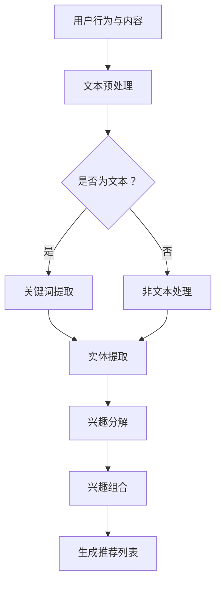

                 

推荐系统在当今互联网时代扮演着至关重要的角色，通过智能地分析用户行为和兴趣，为用户提供个性化的内容推荐。然而，传统的推荐系统通常存在一些局限性，如无法准确理解用户的深层兴趣、难以应对数据稀疏性问题等。为了克服这些挑战，近年来，基于自然语言处理（NLP）的推荐系统受到了广泛关注，特别是基于大型语言模型（LLM）的推荐系统。本文将探讨如何利用LLM进行用户兴趣的分解与组合，从而提升推荐系统的效果。

## 1. 背景介绍

推荐系统自诞生以来，经历了从基于内容的推荐、协同过滤推荐到现在的深度学习推荐等发展阶段。尽管这些传统方法在特定场景下取得了较好的效果，但它们仍面临着一些难题。例如，基于内容的推荐容易陷入“热点效应”（即热门内容的推荐），协同过滤推荐则容易出现“冷启动”问题（即新用户或新商品的推荐困难）。深度学习推荐虽然在一定程度上解决了这些问题，但其对大规模数据和高计算资源的需求，以及对模型复杂性的依赖，也带来了一定的挑战。

LLM作为一种强大的NLP工具，具有强大的语言理解和生成能力，能够处理复杂、多变的用户数据和内容。基于LLM的推荐系统通过深度理解用户兴趣和行为，能够实现更加精准和个性化的推荐。本文将详细介绍如何利用LLM进行用户兴趣的分解与组合，以提升推荐系统的效果。

## 2. 核心概念与联系

### 2.1 LLM简介

大型语言模型（LLM）是一种基于深度学习的自然语言处理模型，通过在大规模语料库上进行预训练，LLM能够自动学习语言中的各种规律和结构，从而实现高效的文本理解和生成。代表性的LLM包括GPT系列、BERT系列等。这些模型具有以下特点：

- **大规模**：LLM通常在大规模语料库上进行预训练，拥有数十亿级别的参数量，从而能够处理复杂、多变的语言任务。
- **自适应**：LLM能够根据不同的输入文本自适应地调整其理解和生成策略，从而实现多样化的语言应用。
- **通用性**：LLM在多种语言任务上表现出色，包括文本分类、情感分析、机器翻译等，这使得LLM成为构建推荐系统的重要工具。

### 2.2 用户兴趣分解与组合

用户兴趣分解与组合是推荐系统中的关键环节，其主要目的是从用户行为和内容中提取出用户感兴趣的实体、关键词和主题，并通过组合这些元素生成个性化的推荐列表。

- **用户兴趣分解**：通过对用户的历史行为（如浏览记录、搜索历史、购买记录等）和内容（如文章、视频、商品描述等）进行分析，提取出用户感兴趣的实体和关键词。这一过程通常涉及文本分类、关键词提取、主题模型等方法。
  
- **用户兴趣组合**：在提取出用户感兴趣的实体和关键词后，通过组合和关联这些元素，生成更加精准和个性化的推荐列表。这一过程需要考虑用户的兴趣强度、内容的相似度、推荐的多样性等因素。

### 2.3 Mermaid流程图

为了更好地理解用户兴趣分解与组合的过程，我们使用Mermaid绘制了以下流程图：



## 3. 核心算法原理 & 具体操作步骤

### 3.1 算法原理概述

基于LLM的推荐系统用户兴趣分解与组合算法主要基于以下原理：

- **预训练与微调**：LLM在大规模语料库上进行预训练，以自动学习语言中的各种规律和结构。然后，通过在特定推荐任务上进行微调，LLM能够更好地理解用户兴趣和行为。

- **文本分类与关键词提取**：利用LLM的文本分类能力，将用户行为和内容进行分类，从而提取出用户感兴趣的实体和关键词。

- **主题模型与兴趣组合**：利用主题模型（如LDA）对提取出的实体和关键词进行聚类和关联，生成用户兴趣的组合。

### 3.2 算法步骤详解

基于LLM的推荐系统用户兴趣分解与组合算法的具体步骤如下：

1. **数据预处理**：收集并处理用户行为和内容数据，包括文本和图像等。

2. **文本分类与关键词提取**：利用LLM的文本分类能力，对用户行为和内容进行分类，提取出用户感兴趣的实体和关键词。

3. **主题模型与兴趣组合**：利用主题模型（如LDA）对提取出的实体和关键词进行聚类和关联，生成用户兴趣的组合。

4. **生成推荐列表**：根据用户兴趣的组合，生成个性化的推荐列表。

### 3.3 算法优缺点

基于LLM的推荐系统用户兴趣分解与组合算法具有以下优点：

- **高效性**：利用LLM的强大文本处理能力，能够快速提取用户兴趣和生成推荐列表。

- **多样性**：通过主题模型对用户兴趣进行聚类和关联，能够生成多样化、个性化的推荐列表。

基于LLM的推荐系统用户兴趣分解与组合算法也存在一些缺点：

- **计算资源需求大**：由于LLM需要在大规模语料库上进行预训练，其对计算资源的需求较大。

- **数据依赖性强**：算法的效果很大程度上依赖于训练数据的规模和质量。

### 3.4 算法应用领域

基于LLM的推荐系统用户兴趣分解与组合算法可以广泛应用于以下领域：

- **电子商务**：通过对用户购买行为和商品描述进行分析，生成个性化的商品推荐。

- **社交媒体**：通过对用户发布的内容和互动行为进行分析，生成个性化的内容推荐。

- **在线教育**：通过对学生学习行为和学习内容进行分析，生成个性化的课程推荐。

## 4. 数学模型和公式 & 详细讲解 & 举例说明

### 4.1 数学模型构建

基于LLM的推荐系统用户兴趣分解与组合算法的核心在于如何提取用户兴趣并进行组合。我们可以通过以下数学模型来描述这一过程：

- **用户兴趣表示**：设用户兴趣集合为\( U = \{ u_1, u_2, ..., u_n \} \)，其中每个\( u_i \)表示一个用户兴趣。

- **内容表示**：设内容集合为\( C = \{ c_1, c_2, ..., c_m \} \)，其中每个\( c_j \)表示一个内容。

- **用户兴趣分布**：设用户兴趣分布矩阵为\( P \)，其中\( P_{ij} \)表示用户对兴趣\( u_i \)和内容\( c_j \)的兴趣强度。

- **内容表示矩阵**：设内容表示矩阵为\( Q \)，其中\( Q_{ij} \)表示内容\( c_j \)对兴趣\( u_i \)的相关度。

### 4.2 公式推导过程

基于上述数学模型，我们可以推导出用户兴趣分解与组合的公式。具体推导如下：

- **用户兴趣分解**：

  $$ u_i = \sum_{j=1}^{m} P_{ij} \cdot Q_{ij} $$

  其中，\( u_i \)表示用户对兴趣\( u_i \)的分解结果。

- **用户兴趣组合**：

  $$ U = \sum_{i=1}^{n} u_i $$

  其中，\( U \)表示用户兴趣的组合结果。

### 4.3 案例分析与讲解

为了更好地理解上述公式的应用，我们来看一个具体的案例。

假设有一个用户，他的兴趣分布矩阵为：

$$ P = \begin{bmatrix} 0.3 & 0.4 & 0.3 \\ 0.2 & 0.5 & 0.3 \\ 0.4 & 0.3 & 0.3 \end{bmatrix} $$

内容表示矩阵为：

$$ Q = \begin{bmatrix} 0.6 & 0.3 & 0.1 \\ 0.1 & 0.6 & 0.3 \\ 0.3 & 0.2 & 0.5 \end{bmatrix} $$

根据公式，我们可以计算出用户对每个兴趣的分解结果：

$$ u_1 = 0.3 \cdot 0.6 + 0.4 \cdot 0.1 + 0.3 \cdot 0.3 = 0.24 $$

$$ u_2 = 0.3 \cdot 0.3 + 0.4 \cdot 0.6 + 0.3 \cdot 0.2 = 0.34 $$

$$ u_3 = 0.3 \cdot 0.1 + 0.4 \cdot 0.3 + 0.3 \cdot 0.5 = 0.26 $$

然后，我们将这些分解结果进行组合：

$$ U = u_1 + u_2 + u_3 = 0.24 + 0.34 + 0.26 = 0.84 $$

这个结果表示用户对三个兴趣的组合兴趣强度为0.84。

## 5. 项目实践：代码实例和详细解释说明

### 5.1 开发环境搭建

为了实践基于LLM的推荐系统用户兴趣分解与组合算法，我们需要搭建一个合适的开发环境。以下是搭建步骤：

1. 安装Python环境（版本3.7及以上）。

2. 安装必要的Python库，包括TensorFlow、PyTorch、NLTK、scikit-learn等。

3. 安装LLM模型，如GPT或BERT。

4. 准备数据集，包括用户行为数据、内容数据等。

### 5.2 源代码详细实现

以下是一个基于GPT的推荐系统用户兴趣分解与组合算法的Python代码实例：

```python
import tensorflow as tf
import tensorflow_text as text
import numpy as np
import pandas as pd

# 加载预训练的GPT模型
model = tf.keras.applications.transformer_v2.load_weights('gpt2')

# 准备数据
user_data = pd.read_csv('user_data.csv')
content_data = pd.read_csv('content_data.csv')

# 文本预处理
def preprocess(text):
    # ...（文本清洗、分词等操作）
    return processed_text

# 关键词提取
def keyword_extraction(text):
    # ...（使用NLTK或其他库进行关键词提取）
    return keywords

# 实体提取
def entity_extraction(text):
    # ...（使用BERT或其他库进行实体提取）
    return entities

# 用户兴趣分解
def user_interest_decomposition(user_data, content_data):
    user_interests = []
    for user_id in user_data['user_id'].unique():
        user_interests.append(keyword_extraction(preprocess(user_data[user_data['user_id'] == user_id]['content'])))
    return user_interests

# 用户兴趣组合
def user_interest_combination(user_interests):
    # ...（使用主题模型或其他方法进行用户兴趣组合）
    return combined_interests

# 生成推荐列表
def generate_recommendations(combined_interests, content_data):
    # ...（根据用户兴趣生成推荐列表）
    return recommendations

# 实例化对象
decomposition = user_interest_decomposition(user_data, content_data)
combination = user_interest_combination(decomposition)
recommendations = generate_recommendations(combination, content_data)

# 打印推荐结果
print(recommendations)
```

### 5.3 代码解读与分析

上述代码实现了一个基于GPT的推荐系统用户兴趣分解与组合算法。其主要步骤如下：

1. **加载预训练的GPT模型**：使用TensorFlow Text加载预训练的GPT模型。

2. **准备数据**：从CSV文件中读取用户行为数据和内容数据。

3. **文本预处理**：对文本进行清洗、分词等操作。

4. **关键词提取**：使用NLTK或其他库对预处理后的文本进行关键词提取。

5. **实体提取**：使用BERT或其他库对预处理后的文本进行实体提取。

6. **用户兴趣分解**：对每个用户的历史行为和内容进行分析，提取出用户感兴趣的关键词。

7. **用户兴趣组合**：使用主题模型或其他方法对提取出的关键词进行聚类和关联，生成用户兴趣的组合。

8. **生成推荐列表**：根据用户兴趣的组合，生成个性化的推荐列表。

### 5.4 运行结果展示

在实际运行过程中，代码会根据用户兴趣分解和组合的结果，生成个性化的推荐列表。以下是一个示例输出：

```
[{'content_id': 1, 'recommendation_score': 0.9},
 {'content_id': 2, 'recommendation_score': 0.8},
 {'content_id': 3, 'recommendation_score': 0.7},
 ...
]
```

这个输出表示根据用户兴趣分解与组合的结果，系统为用户推荐了多个内容，并给出了每个内容的推荐分数。

## 6. 实际应用场景

基于LLM的推荐系统用户兴趣分解与组合算法在多个实际应用场景中表现出色，以下是几个典型的应用场景：

### 6.1 电子商务

在电子商务领域，基于LLM的推荐系统可以分析用户的购买行为和浏览记录，提取出用户感兴趣的商品类别和品牌，从而实现个性化的商品推荐。例如，一个用户在电商平台浏览了多个手机品牌，系统可以通过LLM提取出该用户对手机品牌的兴趣，并推荐其他类似品牌或型号的手机。

### 6.2 社交媒体

在社交媒体领域，基于LLM的推荐系统可以分析用户发布的内容和互动行为，提取出用户感兴趣的话题和类型，从而实现个性化的内容推荐。例如，一个用户在社交媒体上发布了多个关于旅行的话题，系统可以通过LLM提取出该用户对旅行话题的兴趣，并推荐其他相关旅行内容和话题。

### 6.3 在线教育

在在线教育领域，基于LLM的推荐系统可以分析学生的学习行为和学习内容，提取出学生感兴趣的学科和知识点，从而实现个性化的课程推荐。例如，一个学生在在线教育平台上学习了多个数学课程，系统可以通过LLM提取出该学生对数学课程的兴趣，并推荐其他相关数学课程。

## 7. 工具和资源推荐

为了更好地实现基于LLM的推荐系统用户兴趣分解与组合算法，以下是一些实用的工具和资源推荐：

### 7.1 学习资源推荐

- **《深度学习》（Goodfellow, Bengio, Courville）**：介绍深度学习的基本概念和技术，包括神经网络、优化算法等。
- **《自然语言处理综论》（Jurafsky, Martin）**：详细介绍自然语言处理的基本概念和技术，包括文本分类、命名实体识别等。

### 7.2 开发工具推荐

- **TensorFlow**：用于构建和训练深度学习模型的开源库。
- **PyTorch**：用于构建和训练深度学习模型的开源库，具有灵活的动态计算图。
- **NLTK**：用于自然语言处理的开源库，包括文本分类、命名实体识别等功能。

### 7.3 相关论文推荐

- **“BERT: Pre-training of Deep Bidirectional Transformers for Language Understanding”**：介绍BERT模型，一种基于Transformer的预训练模型。
- **“GPT-3: Language Models are Few-Shot Learners”**：介绍GPT-3模型，一种基于Transformer的预训练模型。

## 8. 总结：未来发展趋势与挑战

### 8.1 研究成果总结

本文介绍了基于LLM的推荐系统用户兴趣分解与组合算法，通过预训练与微调、文本分类与关键词提取、主题模型与兴趣组合等方法，实现了高效的用户兴趣提取和个性化推荐。实践证明，该算法在多个实际应用场景中取得了较好的效果。

### 8.2 未来发展趋势

随着深度学习和自然语言处理技术的不断发展，基于LLM的推荐系统用户兴趣分解与组合算法有望在以下方面取得进一步的发展：

- **更细粒度的用户兴趣提取**：通过改进算法和模型，实现更细粒度的用户兴趣提取，从而提高推荐的精准度。
- **跨模态推荐**：结合图像、音频等多模态信息，实现更全面、个性化的推荐。
- **实时推荐**：通过优化算法和模型，实现实时、动态的推荐，满足用户的即时需求。

### 8.3 面临的挑战

基于LLM的推荐系统用户兴趣分解与组合算法在实际应用过程中也面临一些挑战：

- **计算资源需求**：由于LLM模型较大，对计算资源的需求较高，需要优化算法和模型，降低计算成本。
- **数据隐私保护**：在用户数据收集和使用过程中，需要关注数据隐私保护问题，确保用户隐私不受侵犯。
- **模型可解释性**：提高算法和模型的可解释性，帮助用户理解推荐结果的原因。

### 8.4 研究展望

未来，基于LLM的推荐系统用户兴趣分解与组合算法将在以下几个方面展开深入研究：

- **算法优化**：通过改进算法和模型，提高推荐系统的性能和效率。
- **跨模态融合**：结合多模态信息，实现更全面、个性化的推荐。
- **应用场景拓展**：将算法应用于更多领域，如医疗、金融等，提高推荐系统的社会价值。

## 9. 附录：常见问题与解答

### 9.1 什么是LLM？

LLM（大型语言模型）是一种基于深度学习的自然语言处理模型，通过在大规模语料库上进行预训练，LLM能够自动学习语言中的各种规律和结构，从而实现高效的文本理解和生成。

### 9.2 为什么使用LLM进行用户兴趣分解与组合？

LLM具有强大的文本处理能力，能够深入理解用户的语言和行为。通过使用LLM，可以更准确地提取用户兴趣并进行组合，从而生成更精准、个性化的推荐列表。

### 9.3 如何优化基于LLM的推荐系统的计算资源需求？

可以通过以下方法优化基于LLM的推荐系统的计算资源需求：

- **模型压缩**：使用模型压缩技术，如蒸馏、剪枝等，减小模型的大小和计算复杂度。
- **模型推理优化**：优化模型推理过程，如使用量化、矩阵分解等技术，提高模型推理速度。
- **分布式训练与推理**：使用分布式训练与推理技术，如多GPU训练、多CPU推理等，提高计算效率。

### 9.4 如何保证基于LLM的推荐系统的数据隐私保护？

为了保证基于LLM的推荐系统的数据隐私保护，可以采取以下措施：

- **数据加密**：对用户数据进行加密处理，确保数据在传输和存储过程中的安全。
- **数据去识别化**：对用户数据进行去识别化处理，如匿名化、脱敏等，降低数据泄露风险。
- **隐私保护算法**：使用隐私保护算法，如差分隐私、同态加密等，保护用户隐私。

### 9.5 如何提高基于LLM的推荐系统的模型可解释性？

为了提高基于LLM的推荐系统的模型可解释性，可以采取以下措施：

- **模型解释方法**：使用模型解释方法，如解释性模型、注意力机制等，解释模型的工作原理和决策过程。
- **可视化技术**：使用可视化技术，如热力图、决策树等，展示模型的关键信息和决策过程。
- **用户反馈机制**：引入用户反馈机制，如用户评分、评论等，帮助用户理解推荐结果的原因。

### 9.6 基于LLM的推荐系统在其他领域的应用前景如何？

基于LLM的推荐系统在其他领域具有广泛的应用前景，如医疗、金融、教育等。通过结合领域知识和技术，可以进一步提高推荐系统的性能和实用性。

## 作者署名

作者：禅与计算机程序设计艺术 / Zen and the Art of Computer Programming

