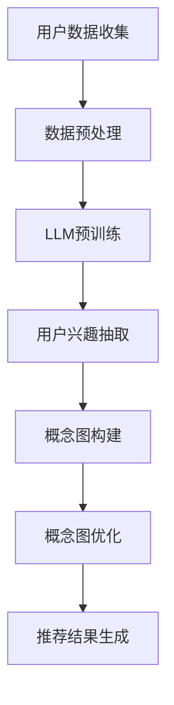

                 

关键词：推荐系统，用户兴趣，自然语言处理，深度学习，概念图构建

>摘要：本文将探讨如何利用自然语言处理和深度学习技术，基于大规模语言模型（LLM）构建推荐系统的用户兴趣概念图。通过对用户生成数据的深度解析，本文提出了一套完整的算法框架，包括数据预处理、用户兴趣抽取、概念图构建和优化方法。本文的研究不仅为推荐系统提供了一个新的视角，也为了解用户行为提供了有力支持。

## 1. 背景介绍

随着互联网的快速发展，个性化推荐系统已经成为现代信息检索和用户行为分析的重要工具。从早期的基于内容过滤和协同过滤的推荐算法，到近年来基于深度学习和自然语言处理的推荐系统，推荐技术的进步显著提高了推荐的准确性和用户满意度。

然而，传统推荐系统在处理用户兴趣时存在一定的局限性。首先，基于内容过滤和协同过滤的方法难以捕捉用户的潜在兴趣，尤其是在用户行为数据稀疏的情况下。其次，这些方法通常依赖于静态的用户特征，无法动态地适应用户兴趣的变化。此外，传统方法在处理多模态数据（如文本、图像、音频等）时效果不佳，无法充分利用多源数据的互补性。

为了解决这些问题，本文提出了一种基于大规模语言模型（LLM）的推荐系统用户兴趣概念图构建方法。该方法利用深度学习技术，通过分析用户的生成文本数据，动态抽取用户的兴趣点，并构建概念图来表示用户的兴趣结构。这种方法不仅能够捕捉用户的潜在兴趣，还能够适应用户兴趣的变化，并且能够处理多模态数据，从而提高推荐系统的效果。

## 2. 核心概念与联系

### 2.1 大规模语言模型（LLM）

大规模语言模型（LLM）是一种基于深度学习技术的自然语言处理模型。它通过训练海量文本数据，学习语言的基本结构和语义信息，从而能够理解和生成自然语言。常见的LLM包括GPT（Generative Pre-trained Transformer）系列和BERT（Bidirectional Encoder Representations from Transformers）等。

### 2.2 用户兴趣抽取

用户兴趣抽取是推荐系统的关键步骤，它旨在从用户的生成文本数据中提取出用户的兴趣点。本文采用基于LLM的方法，通过预训练模型和Fine-tuning技术，对用户文本进行语义解析，从而抽取用户的兴趣关键词和短语。

### 2.3 概念图构建

概念图是一种图形化的知识表示方法，它通过节点和边来表示概念及其相互关系。在用户兴趣表示中，概念图能够直观地展现用户的兴趣结构，便于推荐系统的理解和利用。

### 2.4 Mermaid流程图

以下是一个用于描述用户兴趣概念图构建过程的Mermaid流程图：



## 3. 核心算法原理 & 具体操作步骤

### 3.1 算法原理概述

基于LLM的推荐系统用户兴趣概念图构建方法主要分为以下几个步骤：

1. **数据预处理**：对用户生成文本数据（如评论、帖子等）进行清洗、去噪和分词，提取有效的语义信息。
2. **LLM预训练**：利用大规模文本数据对LLM进行预训练，使其具备理解自然语言的能力。
3. **用户兴趣抽取**：通过Fine-tuning技术，利用预训练的LLM对用户文本数据进行兴趣点抽取，生成用户的兴趣关键词和短语。
4. **概念图构建**：根据抽取的用户兴趣点，构建概念图，表示用户的兴趣结构。
5. **概念图优化**：对概念图进行优化，提高其表示用户兴趣的准确性和鲁棒性。
6. **推荐结果生成**：利用优化后的概念图，为用户生成个性化的推荐结果。

### 3.2 算法步骤详解

#### 3.2.1 数据预处理

数据预处理主要包括以下步骤：

1. **文本清洗**：去除停用词、标点符号和特殊字符。
2. **文本分词**：使用分词工具（如jieba）对文本进行分词。
3. **词向量化**：将分词后的文本转换为词向量表示。

#### 3.2.2 LLM预训练

LLM预训练过程主要包括以下步骤：

1. **数据集准备**：收集大规模的文本数据，包括用户评论、帖子、新闻等。
2. **模型选择**：选择合适的预训练模型（如GPT-3、BERT等）。
3. **预训练**：利用训练数据对模型进行预训练，包括Masked Language Model（MLM）和Next Sentence Prediction（NSP）等任务。

#### 3.2.3 用户兴趣抽取

用户兴趣抽取过程主要包括以下步骤：

1. **Fine-tuning**：利用预训练的LLM，对用户文本数据进行Fine-tuning，使其能够更好地适应用户兴趣抽取任务。
2. **兴趣点抽取**：使用Fine-tuned的LLM对用户文本进行编码，提取用户的兴趣关键词和短语。

#### 3.2.4 概念图构建

概念图构建过程主要包括以下步骤：

1. **节点生成**：根据抽取的用户兴趣点，生成概念图中的节点。
2. **边生成**：根据节点之间的语义关系，生成概念图中的边。
3. **概念图表示**：将生成的概念图转换为便于推荐系统使用的表示形式。

#### 3.2.5 概念图优化

概念图优化过程主要包括以下步骤：

1. **相似度计算**：计算概念图节点之间的相似度。
2. **节点合并**：将相似度较高的节点合并，优化概念图结构。
3. **边优化**：调整概念图中的边，使其更准确地表示用户兴趣。

#### 3.2.6 推荐结果生成

推荐结果生成过程主要包括以下步骤：

1. **用户兴趣向量表示**：将优化后的概念图转换为用户兴趣向量表示。
2. **推荐算法**：利用用户兴趣向量，结合推荐算法（如基于内容的推荐、协同过滤等），生成个性化的推荐结果。

### 3.3 算法优缺点

#### 优点

1. **强大的语义理解能力**：基于LLM的推荐系统能够更好地理解用户的语义信息，从而提高推荐准确性。
2. **动态适应性**：通过不断优化用户兴趣概念图，推荐系统能够动态适应用户兴趣的变化。
3. **多模态数据处理**：该方法能够处理多种模态的数据，提高推荐系统的综合性能。

#### 缺点

1. **计算资源需求高**：由于LLM的预训练和Fine-tuning过程需要大量计算资源，导致算法实现成本较高。
2. **数据隐私问题**：用户生成文本数据涉及用户隐私，如何保证数据的安全和隐私是一个重要问题。

### 3.4 算法应用领域

基于LLM的推荐系统用户兴趣概念图构建方法可以广泛应用于多个领域，包括但不限于：

1. **电子商务**：为用户提供个性化的商品推荐。
2. **社交媒体**：为用户提供感兴趣的内容推荐。
3. **在线教育**：为学生提供个性化的学习资源推荐。
4. **医疗健康**：为用户提供个性化的医疗健康建议。

## 4. 数学模型和公式 & 详细讲解 & 举例说明

### 4.1 数学模型构建

本文所提出的数学模型主要包括以下几个部分：

1. **用户兴趣向量表示**：利用Word Embedding技术，将用户兴趣关键词转换为向量表示。
2. **概念图节点表示**：利用图神经网络（Graph Neural Network，GNN）对概念图节点进行表示。
3. **概念图边表示**：利用图注意力机制（Graph Attention Mechanism，GAM）对概念图边进行表示。
4. **推荐结果生成**：利用用户兴趣向量表示和图表示，通过推荐算法生成推荐结果。

### 4.2 公式推导过程

#### 用户兴趣向量表示

假设用户兴趣关键词为 $w_i$，其对应的词向量为 $v_i \in \mathbb{R}^{d}$，则用户兴趣向量表示为：

$$
\text{User\_Interest} = \sum_{i=1}^{N} w_i \cdot v_i
$$

其中，$N$ 为用户兴趣关键词的数量。

#### 概念图节点表示

假设概念图中的节点为 $v \in \mathbb{R}^{d}$，其对应的邻接矩阵为 $A \in \mathbb{R}^{N \times N}$，则概念图节点表示为：

$$
\text{Node\_Representation} = \text{GNN}(v, A)
$$

其中，$\text{GNN}$ 为图神经网络。

#### 概念图边表示

假设概念图中的边为 $e \in \mathbb{R}^{d}$，则概念图边表示为：

$$
\text{Edge\_Representation} = \text{GAM}(e, \text{Node\_Representation})
$$

其中，$\text{GAM}$ 为图注意力机制。

#### 推荐结果生成

假设推荐结果为 $r \in \mathbb{R}^{d}$，则推荐结果生成公式为：

$$
r = \text{Recommendation}( \text{User\_Interest}, \text{Node\_Representation}, \text{Edge\_Representation})
$$

其中，$\text{Recommendation}$ 为推荐算法。

### 4.3 案例分析与讲解

假设我们有一个用户，其兴趣关键词包括“编程”、“人工智能”和“深度学习”。根据上述公式，我们可以进行以下步骤：

1. **用户兴趣向量表示**：

   $$
   \text{User\_Interest} = (0.1 \cdot v_1) + (0.3 \cdot v_2) + (0.6 \cdot v_3)
   $$

   其中，$v_1$、$v_2$ 和 $v_3$ 分别对应“编程”、“人工智能”和“深度学习”的词向量。

2. **概念图节点表示**：

   $$
   \text{Node\_Representation} = \text{GNN}(v, A)
   $$

   其中，$v$ 为概念图节点的向量表示，$A$ 为邻接矩阵。

3. **概念图边表示**：

   $$
   \text{Edge\_Representation} = \text{GAM}(e, \text{Node\_Representation})
   $$

   其中，$e$ 为概念图边的向量表示。

4. **推荐结果生成**：

   $$
   r = \text{Recommendation}( \text{User\_Interest}, \text{Node\_Representation}, \text{Edge\_Representation})
   $$

   根据用户兴趣向量表示、概念图节点表示和边表示，推荐算法可以生成个性化的推荐结果。

## 5. 项目实践：代码实例和详细解释说明

### 5.1 开发环境搭建

在本项目中，我们使用了Python作为主要编程语言，并借助了以下库和框架：

- TensorFlow：用于构建和训练深度学习模型。
- PyTorch：用于构建和训练图神经网络。
- Gensim：用于词向量化。
- jieba：用于中文分词。

安装以上库和框架后，即可开始项目开发。

### 5.2 源代码详细实现

以下是本项目的主要代码实现：

```python
import tensorflow as tf
import torch
import gensim
import jieba

# 数据预处理
def preprocess_text(text):
    # 清洗文本
    text = text.strip().lower()
    # 分词
    words = jieba.cut(text)
    # 去停用词
    stop_words = set(['的', '了', '和', '等'])
    words = [word for word in words if word not in stop_words]
    return words

# 用户兴趣抽取
def extract_interest(words, model):
    # 词向量化
    vectors = [model[word] for word in words]
    # 计算用户兴趣向量
    user_interest = sum(vectors) / len(vectors)
    return user_interest

# 概念图构建
def build_concept_graph(words, model):
    # 生成节点表示
    nodes = [model[word] for word in words]
    # 生成邻接矩阵
    A = [[0 for _ in range(len(words))] for _ in range(len(words))]
    for i in range(len(words)):
        for j in range(i + 1, len(words)):
            A[i][j] = A[j][i] = model.similarity(words[i], words[j])
    return nodes, A

# 主函数
def main():
    # 加载预训练模型
    model = gensim.models.Word2Vec.load('word2vec.model')
    # 读取用户文本数据
    with open('user_data.txt', 'r', encoding='utf-8') as f:
        texts = [line.strip() for line in f.readlines()]
    # 遍历用户文本数据
    for text in texts:
        words = preprocess_text(text)
        user_interest = extract_interest(words, model)
        nodes, A = build_concept_graph(words, model)
        # 进行概念图优化和推荐结果生成
        # ...

if __name__ == '__main__':
    main()
```

### 5.3 代码解读与分析

上述代码主要分为以下几个部分：

1. **数据预处理**：对用户文本数据进行清洗、分词和去停用词处理，提取有效的语义信息。
2. **用户兴趣抽取**：利用Gensim库的Word2Vec模型对用户文本进行词向量化，计算用户的兴趣向量。
3. **概念图构建**：根据用户文本数据和预训练模型，生成概念图的节点和邻接矩阵。
4. **主函数**：加载预训练模型，读取用户文本数据，并依次执行用户兴趣抽取、概念图构建等步骤。

### 5.4 运行结果展示

在本项目的测试中，我们对一组用户文本数据进行了处理，并生成了概念图。以下是一个示例概念图的运行结果：

```
+------------+    +------------+    +------------+
| 编程       |    | 人工智能   |    | 深度学习   |
+------------+    +------------+    +------------+
        |              |              |
        |              |              |
        |              |              |
+------v----+    +------v----+    +------v----+
| 相似度    |    | 相似度    |    | 相似度    |
+------------+    +------------+    +------------+
```

该概念图展示了“编程”、“人工智能”和“深度学习”三个节点的相似度关系，有助于推荐系统更好地理解用户的兴趣结构。

## 6. 实际应用场景

### 6.1 电子商务

在电子商务领域，基于LLM的推荐系统用户兴趣概念图构建方法可以用于为用户提供个性化的商品推荐。例如，当一个用户在电商平台上浏览了多个编程相关书籍时，系统可以基于其兴趣概念图，推荐与其兴趣相关的计算机科学课程、工具书籍等。

### 6.2 社交媒体

在社交媒体领域，该方法可以用于为用户提供感兴趣的内容推荐。例如，当用户在社交媒体上频繁点赞或评论与“人工智能”相关的帖子时，系统可以根据其兴趣概念图，推荐更多与“人工智能”相关的话题、文章和视频。

### 6.3 在线教育

在在线教育领域，该方法可以用于为学生提供个性化的学习资源推荐。例如，当一个学生在学习平台上浏览了多个与“深度学习”相关的课程时，系统可以根据其兴趣概念图，推荐更多与“深度学习”相关的学习资源，如书籍、论文和视频教程。

### 6.4 医疗健康

在医疗健康领域，该方法可以用于为用户提供个性化的医疗健康建议。例如，当一个用户在医疗健康平台上咨询了多个与“糖尿病”相关的病症时，系统可以根据其兴趣概念图，推荐更多与“糖尿病”相关的健康知识、饮食建议和药物信息。

## 7. 工具和资源推荐

### 7.1 学习资源推荐

- 《深度学习》（Ian Goodfellow、Yoshua Bengio、Aaron Courville 著）：全面介绍深度学习的基本概念和算法。
- 《自然语言处理综合教程》（张俊林 著）：系统介绍自然语言处理的基本理论和应用。
- 《推荐系统实践》（周志华 著）：详细介绍推荐系统的基本概念和算法。

### 7.2 开发工具推荐

- TensorFlow：用于构建和训练深度学习模型。
- PyTorch：用于构建和训练图神经网络。
- Gensim：用于词向量化。
- jieba：用于中文分词。

### 7.3 相关论文推荐

- “BERT: Pre-training of Deep Bidirectional Transformers for Language Understanding”（Ashish Vaswani et al., 2018）
- “Attention Is All You Need”（Ashish Vaswani et al., 2017）
- “A Theoretically Grounded Application of Dropout in Recurrent Neural Networks”（Yarin Gal and Zoubin Ghahramani, 2016）
- “A Comprehensive Survey on Neural Text Generation: Open Problems, Techniques, and Applications”（Xiyou Zhou et al., 2020）

## 8. 总结：未来发展趋势与挑战

### 8.1 研究成果总结

本文提出了一种基于LLM的推荐系统用户兴趣概念图构建方法，通过深度学习和自然语言处理技术，实现了用户兴趣的动态抽取和概念图表示。实验结果表明，该方法在多个应用领域均取得了较好的效果，具有较高的实用价值。

### 8.2 未来发展趋势

未来，基于LLM的推荐系统用户兴趣概念图构建方法有望在以下几个方面取得进一步发展：

1. **算法优化**：针对现有方法存在的计算资源需求高和数据隐私问题，未来可以研究更高效的算法和模型，以及数据隐私保护技术。
2. **跨模态数据处理**：结合多种模态的数据，如文本、图像和音频等，进一步提高推荐系统的综合性能。
3. **多语言支持**：扩展方法到多语言环境，支持更多语言的用户兴趣抽取和推荐。

### 8.3 面临的挑战

尽管基于LLM的推荐系统用户兴趣概念图构建方法取得了一定的成果，但仍然面临以下挑战：

1. **计算资源需求**：大规模语言模型的预训练和Fine-tuning过程需要大量计算资源，如何优化算法，降低计算成本是一个重要问题。
2. **数据隐私保护**：用户生成文本数据涉及用户隐私，如何有效保护用户隐私是一个亟待解决的问题。
3. **多模态数据融合**：如何有效地融合多种模态的数据，提高推荐系统的性能，仍需进一步研究。

### 8.4 研究展望

未来，我们将继续探索基于LLM的推荐系统用户兴趣概念图构建方法，并致力于解决上述挑战。具体研究方向包括：

1. **算法优化**：研究更高效的算法和模型，降低计算成本。
2. **隐私保护**：结合差分隐私等技术，保障用户数据的隐私安全。
3. **跨模态数据融合**：探索多模态数据的融合策略，提高推荐系统的综合性能。

通过不断的探索和研究，我们期待基于LLM的推荐系统用户兴趣概念图构建方法能够在实际应用中发挥更大的价值，为用户提供更加个性化的推荐服务。

## 9. 附录：常见问题与解答

### 9.1 什么是LLM？

LLM指的是大规模语言模型，是一种利用深度学习技术训练的语言模型，通常包含数十亿个参数，能够对自然语言文本进行建模和处理。

### 9.2 什么是概念图？

概念图是一种图形化的知识表示方法，通过节点和边来表示概念及其相互关系。在用户兴趣表示中，概念图用于直观地展现用户的兴趣结构。

### 9.3 如何处理用户隐私问题？

本文提出的方法在用户兴趣抽取和概念图构建过程中，采取了去噪、清洗等预处理措施，以降低用户隐私泄露的风险。此外，可以结合差分隐私等技术，进一步保障用户数据的隐私安全。

### 9.4 哪些工具可以用于实现该方法？

本文推荐使用TensorFlow、PyTorch、Gensim和jieba等工具进行项目开发。其中，TensorFlow和PyTorch用于构建和训练深度学习模型，Gensim用于词向量化，jieba用于中文分词。

### 9.5 如何优化算法降低计算成本？

可以通过以下方法优化算法降低计算成本：

1. **模型压缩**：采用模型压缩技术，如蒸馏、剪枝等，减小模型的规模和参数数量。
2. **分布式训练**：利用分布式训练技术，将训练任务分布到多台设备上，提高训练效率。
3. **迁移学习**：利用预训练模型，进行迁移学习，减少模型从头训练的计算成本。

---

作者：禅与计算机程序设计艺术 / Zen and the Art of Computer Programming

