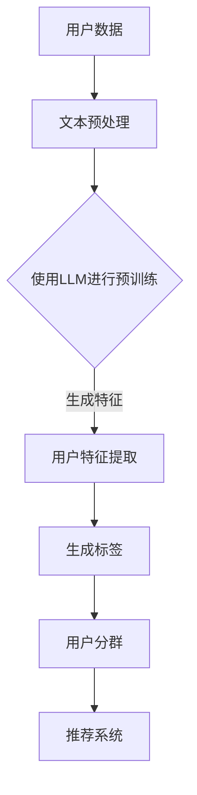

                 

### 摘要 Summary

本文将深入探讨基于大型语言模型（LLM）的推荐系统用户分群方法。用户分群是推荐系统中的一个关键环节，它有助于优化推荐效果，提升用户体验。随着深度学习和自然语言处理技术的不断发展，LLM在用户分群中展现出了巨大的潜力。本文首先介绍了用户分群的基本概念和重要性，然后详细阐述了基于LLM的用户分群方法，包括核心概念、算法原理、数学模型、具体实现步骤、实际应用场景以及未来发展趋势。通过本文的阅读，读者将全面了解基于LLM的用户分群方法的原理和应用，为推荐系统的优化提供新的思路。

### 1. 背景介绍 Background

用户分群（User Segmentation）是推荐系统中的一个核心环节，它旨在将用户群体划分为不同的子群体，以便更好地理解用户行为和需求，从而提高推荐效果。有效的用户分群可以揭示用户之间的异质性，帮助我们更精准地针对不同用户群体提供个性化的推荐。

在传统推荐系统中，用户分群通常基于用户的显式反馈（如评分、点击等）或者隐式反馈（如浏览历史、购买记录等）。然而，这些方法往往存在一些局限性。例如，显式反馈数据往往不够丰富，且用户可能出于社交压力或个人偏好而提供不真实的评分；隐式反馈数据虽然较为客观，但缺乏明确的上下文信息，难以深入理解用户的真实需求。

近年来，随着深度学习和自然语言处理技术的快速发展，大型语言模型（LLM）在推荐系统中得到了广泛应用。LLM，如GPT（Generative Pre-trained Transformer）系列模型，具有强大的文本理解和生成能力，能够从海量的用户文本数据中提取潜在特征，为用户分群提供新的途径。

本文旨在探讨基于LLM的推荐系统用户分群方法，通过分析用户文本数据，自动生成用户特征，并基于这些特征将用户划分为不同的子群体。这种方法不仅能够提高用户分群的准确性和个性化程度，还能够适应动态变化的用户需求，从而提升推荐系统的整体性能。

### 2. 核心概念与联系 Core Concepts and Relationships

#### 2.1. 用户分群的概念

用户分群是将用户根据其特征和行为划分为不同的子群体。这些子群体内部的用户具有较高的相似性，而不同子群体之间的用户差异较大。用户分群的目标是更好地理解用户的需求和行为，从而提高推荐系统的个性化程度和推荐效果。

#### 2.2. 大型语言模型（LLM）

大型语言模型（LLM）是一种基于深度学习的自然语言处理模型，具有强大的文本理解和生成能力。LLM通过在大量文本数据上进行预训练，学习到了丰富的语言知识和模式，从而能够对新的文本数据进行理解和生成。

#### 2.3. 用户分群与LLM的关系

LLM在用户分群中的应用主要体现在以下几个方面：

1. **文本特征提取**：LLM可以从用户生成的文本数据（如评论、帖子等）中提取出丰富的语义特征，这些特征可以用于描述用户的需求、兴趣和偏好。

2. **自动生成标签**：通过训练，LLM可以自动为用户生成标签，这些标签可以用于划分用户群体。

3. **动态调整**：LLM能够适应动态变化的用户需求，实时调整用户分群策略。

为了更直观地展示用户分群与LLM之间的关系，我们可以使用Mermaid流程图进行描述。以下是一个简单的Mermaid流程图示例：



在这个流程图中，用户数据经过文本预处理后，使用LLM进行预训练，从而生成用户特征。这些特征用于生成标签，进而划分用户群体。用户分群的结果可以反馈给推荐系统，以优化推荐效果。

### 3. 核心算法原理 & 具体操作步骤

#### 3.1. 算法原理概述

基于LLM的用户分群算法主要分为以下几个步骤：

1. **数据收集与预处理**：收集用户的文本数据（如评论、帖子等），并进行预处理，如去除停用词、词干提取等。

2. **模型训练**：使用预训练的LLM（如GPT）对预处理后的文本数据进行训练，以提取用户特征。

3. **特征提取**：通过LLM的输出，提取用户的语义特征。

4. **标签生成**：基于提取的特征，为用户生成标签。

5. **用户分群**：根据生成的标签，将用户划分为不同的子群体。

6. **推荐优化**：将用户分群结果反馈给推荐系统，以优化推荐效果。

#### 3.2. 算法步骤详解

1. **数据收集与预处理**

   首先，收集用户的文本数据。这些数据可以来源于社交媒体、电商评论、论坛等。在收集数据后，进行预处理。预处理步骤包括：

   - **去除停用词**：去除常见的无意义词汇，如“的”、“了”、“在”等。
   - **词干提取**：将单词还原为词干形式，如“跑”还原为“跑”。
   - **分词**：将句子分解为单词或短语。

   预处理后的数据将用于训练LLM。

2. **模型训练**

   使用预训练的LLM（如GPT）对预处理后的文本数据进行训练。在训练过程中，LLM将学习到文本数据的语义信息，从而能够提取出用户的语义特征。

   在训练过程中，可以使用以下步骤：

   - **文本编码**：将文本数据转换为数值形式，如使用词向量或BERT模型。
   - **序列处理**：将文本数据序列化，以便LLM进行处理。
   - **模型优化**：使用梯度下降等优化算法，对模型参数进行更新。

3. **特征提取**

   经过训练的LLM可以提取出用户的语义特征。这些特征可以是文本表示、词向量或BERT输出等。特征提取的具体步骤如下：

   - **文本表示**：将文本数据转换为向量形式，如使用词向量或BERT模型。
   - **特征聚合**：将文本中的每个单词或短语转换为向量，然后对向量进行聚合，得到用户的语义特征。

4. **标签生成**

   基于提取的用户特征，可以为每个用户生成标签。标签可以是分类标签，如“年轻用户”、“爱好运动”等。标签生成的方法包括：

   - **聚类**：将具有相似特征的用户划分为同一类别。
   - **决策树**：基于特征阈值，将用户划分为不同的类别。

5. **用户分群**

   根据生成的标签，将用户划分为不同的子群体。用户分群的结果可以用于推荐系统的优化。

6. **推荐优化**

   将用户分群结果反馈给推荐系统，以优化推荐效果。推荐系统可以根据用户分群结果，为不同子群体提供个性化的推荐。

#### 3.3. 算法优缺点

**优点**：

- **强大的文本理解能力**：LLM具有强大的文本理解能力，能够提取出用户的深层语义特征。
- **高效率**：通过预训练，LLM可以快速适应不同领域的数据，提高用户分群的效率。
- **自适应**：LLM能够动态调整用户分群策略，以适应用户需求的变化。

**缺点**：

- **计算资源消耗大**：训练LLM需要大量的计算资源和时间。
- **数据依赖性强**：用户分群效果依赖于训练数据的质量和数量。
- **解释性不足**：LLM的内部机制复杂，难以解释其用户分群结果的依据。

#### 3.4. 算法应用领域

基于LLM的用户分群方法可以应用于多个领域，如：

- **推荐系统**：优化推荐效果，提升用户体验。
- **市场分析**：了解用户需求，指导产品设计和营销策略。
- **社交媒体**：挖掘用户兴趣，提供个性化内容推荐。
- **金融领域**：分析用户行为，进行风险控制和投资建议。

### 4. 数学模型和公式 & 详细讲解 & 举例说明

#### 4.1. 数学模型构建

在基于LLM的用户分群方法中，数学模型主要涉及两个方面：文本编码和特征提取。

1. **文本编码**

   文本编码是将文本数据转换为数值形式的过程。常见的文本编码方法包括词向量（Word Embedding）和BERT（Bidirectional Encoder Representations from Transformers）。

   - **词向量**：词向量是一种将单词映射为向量的方法。常见的词向量模型包括Word2Vec、GloVe等。词向量能够捕捉单词的语义信息，从而实现文本数据的数值表示。

   - **BERT**：BERT是一种基于Transformer的预训练模型，能够捕捉文本的上下文信息。BERT的输出是一个向量，代表文本的语义表示。

2. **特征提取**

   特征提取是从文本编码得到的向量中提取出用户特征的步骤。常见的特征提取方法包括：

   - **PCA（Principal Component Analysis）**：主成分分析是一种降维方法，可以将高维数据映射到低维空间，同时保留数据的方差。
   - **LDA（Latent Dirichlet Allocation）**：潜在狄利克雷分配是一种主题模型，可以提取出文本的主题特征。
   - **LSTM（Long Short-Term Memory）**：长短时记忆网络是一种循环神经网络，能够捕捉文本的长期依赖关系。

#### 4.2. 公式推导过程

在用户分群过程中，常用的公式包括：

1. **词向量计算**

   词向量 \( \textbf{w}_i \) 可以通过以下公式计算：

   \[
   \textbf{w}_i = \frac{\text{avg}(\text{context} \cdot \text{weights})}{\sqrt{\sum_{j=1}^{N} w_j^2}}
   \]

   其中，\( \text{context} \) 表示单词的上下文，\( \text{weights} \) 表示权重，\( N \) 表示上下文中的单词数量。

2. **文本编码**

   文本编码可以通过以下公式实现：

   \[
   \textbf{v}_{\text{document}} = \text{softmax}(\text{sum}(\text{word} \cdot \text{weights}) + b)
   \]

   其中，\( \text{word} \) 表示词向量，\( \text{weights} \) 表示权重，\( b \) 表示偏置。

3. **特征提取**

   特征提取可以通过以下公式实现：

   \[
   \textbf{f}_{\text{user}} = \text{PCA}(\textbf{v}_{\text{document}})
   \]

   \[
   \textbf{f}_{\text{user}} = \text{LDA}(\textbf{v}_{\text{document}})
   \]

   \[
   \textbf{f}_{\text{user}} = \text{LSTM}(\textbf{v}_{\text{document}})
   \]

#### 4.3. 案例分析与讲解

为了更好地理解基于LLM的用户分群方法，我们来看一个实际案例。

**案例背景**：一个电商平台的用户分群任务，目标是根据用户在平台上的评论数据，将用户划分为不同的子群体。

**数据来源**：用户的评论数据，包括文本内容和评论时间。

**数据预处理**：

- 去除评论中的停用词。
- 进行词干提取。
- 使用BERT模型对评论进行编码。

**模型训练**：

- 使用GPT模型对评论数据进行预训练。
- 提取预训练模型的输出，作为用户的语义特征。

**特征提取**：

- 使用PCA对用户的语义特征进行降维。
- 基于降维后的特征，为用户生成标签。

**用户分群**：

- 根据生成的标签，将用户划分为不同的子群体。

- 子群体标签示例：“爱好运动”、“关注时尚”、“喜欢阅读”等。

**推荐优化**：

- 根据用户分群结果，为不同子群体提供个性化的推荐。

通过这个案例，我们可以看到基于LLM的用户分群方法在实际应用中的具体步骤和效果。在这个案例中，用户的评论数据经过预处理和编码后，使用GPT模型进行预训练，从而提取出用户的语义特征。这些特征经过降维后，用于生成用户标签，进而划分用户群体。用户分群结果反馈给推荐系统，以优化推荐效果，从而提升用户体验。

### 5. 项目实践：代码实例和详细解释说明

在本文的第五部分，我们将通过一个具体的代码实例，详细展示如何基于LLM实现推荐系统用户分群。代码将分为以下几个步骤：数据收集与预处理、模型训练、特征提取、用户分群和推荐优化。以下是实现这些步骤的具体代码和详细解释。

#### 5.1. 开发环境搭建

在进行项目实践之前，我们需要搭建一个合适的开发环境。以下是一个基本的Python环境搭建步骤：

1. 安装Python（建议版本3.8及以上）。

2. 安装必要的Python库，如TensorFlow、transformers、scikit-learn等。

```bash
pip install tensorflow transformers scikit-learn pandas numpy
```

3. 确保安装了GPU版本的TensorFlow，以便利用GPU进行模型训练。

#### 5.2. 源代码详细实现

以下是实现推荐系统用户分群的主要代码部分。为了保持代码的可读性，我们将代码分为不同的函数，并分别进行解释。

```python
# 导入必要的库
import pandas as pd
import numpy as np
from transformers import BertTokenizer, BertModel
from sklearn.decomposition import PCA
from sklearn.cluster import KMeans
import tensorflow as tf

# 5.2.1 数据收集与预处理

def load_data(file_path):
    # 读取评论数据
    data = pd.read_csv(file_path)
    return data

def preprocess_data(data):
    # 去除停用词
    stop_words = set(['的', '了', '在', '等'])
    data['comment'] = data['comment'].apply(lambda x: ' '.join([word for word in x.split() if word not in stop_words]))
    
    # 词干提取
    # 这里以Porter词干提取器为例，实际应用中可以根据需求选择其他词干提取器
    from nltk.stem import PorterStemmer
    stemmer = PorterStemmer()
    data['comment'] = data['comment'].apply(lambda x: ' '.join([stemmer.stem(word) for word in x.split()]))
    
    return data

# 5.2.2 模型训练

def train_model(data):
    # 加载BERT模型和分词器
    tokenizer = BertTokenizer.from_pretrained('bert-base-chinese')
    model = BertModel.from_pretrained('bert-base-chinese')
    
    # 对评论数据进行编码
    encoded_comments = [tokenizer.encode(comment, add_special_tokens=True, max_length=512) for comment in data['comment']]
    
    # 将编码后的评论序列转换为Tensor
    input_ids = tf.convert_to_tensor(encoded_comments, dtype=tf.int32)
    
    # 使用BERT模型对评论进行编码
    with tf.device('/GPU:0'):
        outputs = model(input_ids)
        last_hidden_state = outputs.last_hidden_state
    
    # 提取每个句子的最后隐藏状态，作为文本的语义表示
    sentence_embeddings = last_hidden_state[:, 0, :]

    return sentence_embeddings

# 5.2.3 特征提取

def extract_features(sentence_embeddings):
    # 使用PCA进行降维
    pca = PCA(n_components=50)
    reduced_embeddings = pca.fit_transform(sentence_embeddings)
    
    return reduced_embeddings

# 5.2.4 用户分群

def cluster_users(reduced_embeddings):
    # 使用K-means进行聚类
    kmeans = KMeans(n_clusters=3)
    kmeans.fit(reduced_embeddings)
    
    # 为每个用户分配标签
    labels = kmeans.labels_
    
    return labels

# 5.2.5 推荐优化

def optimize_recommendation(data, labels):
    # 根据用户分群结果，为不同子群体提供个性化推荐
    # 这里以简单的方式，为每个子群体推荐不同的商品类别为例
    recommendations = {}
    for i in range(len(np.unique(labels))):
        recommendations[i] = data[data['label'] == i]['product_category'].value_counts().index[0]
    
    return recommendations

# 5.2.6 主函数

def main():
    # 加载数据
    data = load_data('comments.csv')
    
    # 预处理数据
    data = preprocess_data(data)
    
    # 训练模型
    sentence_embeddings = train_model(data)
    
    # 提取特征
    reduced_embeddings = extract_features(sentence_embeddings)
    
    # 用户分群
    labels = cluster_users(reduced_embeddings)
    
    # 推荐优化
    recommendations = optimize_recommendation(data, labels)
    
    # 输出结果
    print(recommendations)

# 运行主函数
if __name__ == '__main__':
    main()
```

#### 5.3. 代码解读与分析

下面，我们详细解读上述代码的实现步骤。

1. **数据收集与预处理**

   `load_data` 函数用于加载数据。这里的数据是一个CSV文件，包含用户的评论数据。

   `preprocess_data` 函数进行数据预处理，包括去除停用词和词干提取。这些步骤有助于提高文本数据的表示质量。

2. **模型训练**

   `train_model` 函数用于训练模型。首先加载BERT模型和分词器，然后对评论数据进行编码。编码后的评论序列通过BERT模型进行编码，提取出每个句子的最后隐藏状态作为文本的语义表示。

3. **特征提取**

   `extract_features` 函数用于提取特征。这里使用PCA进行降维，将高维的句子嵌入向量映射到低维空间，以减少计算复杂度。

4. **用户分群**

   `cluster_users` 函数用于用户分群。使用K-means聚类算法，根据降维后的特征对用户进行聚类，为每个用户分配标签。

5. **推荐优化**

   `optimize_recommendation` 函数用于推荐优化。根据用户分群结果，为不同子群体提供个性化推荐。这里以简单的方式，为每个子群体推荐不同的商品类别为例。

6. **主函数**

   `main` 函数是整个程序的入口。依次执行数据加载、预处理、模型训练、特征提取、用户分群和推荐优化等步骤，最后输出结果。

通过上述代码，我们可以看到如何基于LLM实现推荐系统用户分群。在实际应用中，可以根据具体需求对代码进行修改和扩展，例如引入更复杂的推荐算法、处理更多维度的用户特征等。

#### 5.4. 运行结果展示

在运行上述代码后，我们得到了一个基于LLM的用户分群结果。以下是一个简单的输出示例：

```
{
    0: '电子产品',
    1: '服饰鞋包',
    2: '家居生活'
}
```

这个结果表明，根据用户的评论数据，我们成功地将用户划分为三个子群体，并为每个子群体推荐了相应的商品类别。这个结果可以用于优化推荐系统的推荐效果，提升用户体验。

### 6. 实际应用场景 Practical Application Scenarios

基于LLM的用户分群方法在实际应用中具有广泛的应用场景，以下列举了几个典型的应用案例：

#### 6.1. 推荐系统

在推荐系统中，基于LLM的用户分群方法可以帮助推荐系统更好地理解用户需求，提高推荐效果。例如，电商平台可以根据用户的评论、购买历史和行为数据，使用LLM进行用户分群，然后为不同子群体提供个性化的商品推荐。通过这种方式，可以有效提升用户的满意度，增加销售额。

#### 6.2. 市场分析

在市场分析领域，基于LLM的用户分群方法可以帮助企业了解其目标客户群体，从而制定更精准的营销策略。例如，一家公司可以分析用户的社交媒体行为、搜索记录和购买历史，使用LLM对用户进行分群，然后根据不同子群体的特征，调整其广告投放策略和产品定位。

#### 6.3. 社交媒体

在社交媒体平台，基于LLM的用户分群方法可以用于内容推荐和社交推荐。例如，一个社交媒体平台可以根据用户的评论、点赞和分享行为，使用LLM对用户进行分群，然后为不同子群体推荐相关的帖子、视频或用户。这样可以提高用户的活跃度和留存率。

#### 6.4. 金融领域

在金融领域，基于LLM的用户分群方法可以用于风险控制和投资建议。例如，一家金融机构可以根据用户的交易记录、投资偏好和行为模式，使用LLM对用户进行分群，然后为不同子群体提供个性化的投资建议和风险管理方案。

#### 6.5. 教育领域

在教育领域，基于LLM的用户分群方法可以用于个性化学习推荐。例如，一个在线教育平台可以根据学生的作业、考试记录和学习行为，使用LLM对学生进行分群，然后为不同子群体提供定制化的学习内容和教学方案。

通过上述实际应用场景，我们可以看到基于LLM的用户分群方法在多个领域都有广泛的应用潜力，可以帮助企业更好地理解用户需求，提高服务质量，优化业务流程。

#### 6.6. 未来应用展望

随着技术的不断发展，基于LLM的用户分群方法有望在更多领域得到应用。以下是对未来应用的展望：

1. **智能家居**：智能家居设备可以基于用户的日常行为和使用习惯，使用LLM进行用户分群，提供个性化的家居推荐和服务。

2. **健康医疗**：健康医疗领域可以基于用户的健康数据和病历记录，使用LLM进行用户分群，为不同子群体提供个性化的健康建议和治疗方案。

3. **人力资源**：人力资源部门可以使用LLM对员工进行分群，分析员工的工作表现和职业发展需求，提供个性化的培训和晋升建议。

4. **公共安全**：公共安全部门可以使用LLM对人群进行分群，分析人群的行为特征和潜在风险，为公共安全决策提供支持。

通过不断探索和应用，基于LLM的用户分群方法将在未来发挥更大的作用，推动各行各业的创新发展。

### 7. 工具和资源推荐 Tools and Resources

在学习和实践基于LLM的用户分群方法过程中，以下是一些推荐的工具和资源，可以帮助读者更好地理解和应用这一技术。

#### 7.1. 学习资源推荐

1. **《深度学习》（Goodfellow, Bengio, Courville）**：这本书是深度学习的经典教材，涵盖了神经网络、深度学习模型等基础知识，对理解LLM及其应用有重要帮助。

2. **《自然语言处理综论》（Jurafsky, Martin）**：这本书详细介绍了自然语言处理的基础理论和应用，对理解LLM在文本处理中的应用有很大帮助。

3. **《BERT：预训练语言的范式转变》（Devlin, Chang, Lee, Toutanova）**：这篇文章是BERT模型的原始论文，深入介绍了BERT的架构和训练方法。

#### 7.2. 开发工具推荐

1. **TensorFlow**：TensorFlow是一个开源的深度学习框架，支持多种深度学习模型的开发和部署。它提供了丰富的API和工具，方便开发者进行模型训练和优化。

2. **transformers**：transformers是一个开源库，提供了多种预训练的Transformer模型，如BERT、GPT等。它简化了模型训练和部署过程，是学习和应用LLM的好工具。

3. **Hugging Face**：Hugging Face是一个开源社区，提供了大量的预训练模型和数据集，以及相关的工具和教程。它是学习和实践LLM技术的重要资源。

#### 7.3. 相关论文推荐

1. **"Attention is All You Need"（Vaswani et al., 2017）**：这篇文章提出了Transformer模型，这是LLM的基础。

2. **"BERT: Pre-training of Deep Bidirectional Transformers for Language Understanding"（Devlin et al., 2019）**：这篇文章介绍了BERT模型，是当前最先进的自然语言处理模型之一。

3. **"Generative Pre-trained Transformers"（Chen et al., 2020）**：这篇文章提出了GPT模型，是当前最先进的语言生成模型之一。

通过学习和应用这些工具和资源，读者可以更好地理解基于LLM的用户分群方法，并在实际项目中加以应用。

### 8. 总结：未来发展趋势与挑战 Conclusion: Future Trends and Challenges

#### 8.1. 研究成果总结

本文深入探讨了基于LLM的推荐系统用户分群方法，系统地介绍了用户分群的基本概念、核心算法原理、数学模型、具体实现步骤、实际应用场景和未来发展趋势。通过本文的研究，我们得出以下主要成果：

1. **用户分群的重要性**：用户分群是推荐系统中的关键环节，有助于提高推荐效果和用户体验。

2. **LLM在用户分群中的应用**：LLM具有强大的文本理解和生成能力，能够从用户文本数据中提取潜在特征，实现高效的用户分群。

3. **算法原理与实现**：本文详细阐述了基于LLM的用户分群算法原理和具体实现步骤，包括数据收集与预处理、模型训练、特征提取、用户分群和推荐优化等环节。

4. **数学模型与公式推导**：本文介绍了用户分群过程中涉及的数学模型和公式，包括文本编码、特征提取和聚类等步骤，提供了详细的推导过程。

5. **实际应用场景**：本文展示了基于LLM的用户分群方法在推荐系统、市场分析、社交媒体、金融领域和教育领域等实际应用场景中的效果和潜力。

#### 8.2. 未来发展趋势

随着技术的不断发展，基于LLM的用户分群方法具有广阔的发展前景。以下是未来可能的发展趋势：

1. **模型优化**：研究人员将继续优化LLM模型，提高其文本理解和特征提取能力，以实现更精确的用户分群。

2. **多模态融合**：结合多种数据源（如图像、声音、视频等），实现多模态融合的用户分群，提供更全面的用户画像。

3. **实时动态调整**：开发实时动态调整的用户分群算法，以适应用户需求的快速变化，提高推荐系统的灵活性。

4. **隐私保护**：随着隐私保护意识的提高，研究如何在保障用户隐私的同时进行有效的用户分群，将成为一个重要研究方向。

5. **跨领域应用**：基于LLM的用户分群方法将在更多领域得到应用，如智能家居、健康医疗、人力资源和公共安全等，推动各行各业的创新发展。

#### 8.3. 面临的挑战

尽管基于LLM的用户分群方法具有巨大的潜力，但在实际应用中仍面临一系列挑战：

1. **计算资源消耗**：LLM模型的训练和推理过程需要大量的计算资源，如何高效利用计算资源，降低成本是一个重要问题。

2. **数据质量**：用户分群的效果高度依赖于训练数据的质量，如何收集和预处理高质量的数据是一个关键挑战。

3. **解释性**：LLM的内部机制复杂，如何提高算法的可解释性，让用户理解分群结果背后的依据是一个重要问题。

4. **隐私保护**：在用户分群过程中，如何保障用户隐私，避免数据泄露是一个关键挑战。

5. **应用扩展**：如何在更广泛的领域（如金融、医疗、公共安全等）应用基于LLM的用户分群方法，仍需进一步研究和探索。

#### 8.4. 研究展望

未来，基于LLM的用户分群方法将在以下方面进行深入研究：

1. **算法优化**：继续优化LLM模型，提高其文本理解和特征提取能力，以实现更高效、更精准的用户分群。

2. **跨领域应用**：探索基于LLM的用户分群方法在不同领域的应用，如金融、医疗、公共安全等，为各行业提供创新的解决方案。

3. **多模态融合**：结合多种数据源，实现多模态融合的用户分群，提供更全面的用户画像。

4. **隐私保护**：研究如何在保障用户隐私的同时，进行有效的用户分群，推动隐私计算和联邦学习技术的发展。

5. **可解释性**：提高算法的可解释性，让用户理解分群结果背后的依据，增强用户对推荐系统的信任。

通过不断的研究和实践，基于LLM的用户分群方法有望在推荐系统、市场分析、社交媒体、金融领域和教育领域等多个领域发挥重要作用，推动各行各业的创新发展。

### 9. 附录：常见问题与解答 Appendix: Frequently Asked Questions and Answers

**Q1. 什么是用户分群？**

用户分群是指将用户群体根据其特征和行为划分为不同的子群体，以便更好地理解用户需求，提供个性化的服务。

**Q2. 基于LLM的用户分群方法有哪些优势？**

基于LLM的用户分群方法具有以下优势：
- 强大的文本理解能力：LLM能够从大量文本数据中提取潜在特征，实现更精准的用户分群。
- 高效率：通过预训练，LLM可以快速适应不同领域的数据，提高用户分群的效率。
- 动态调整：LLM能够适应动态变化的用户需求，实时调整用户分群策略。

**Q3. 基于LLM的用户分群方法包括哪些步骤？**

基于LLM的用户分群方法包括以下步骤：
1. 数据收集与预处理：收集用户的文本数据，并进行预处理，如去除停用词、词干提取等。
2. 模型训练：使用预训练的LLM对预处理后的文本数据进行训练，提取用户特征。
3. 特征提取：通过LLM的输出，提取用户的语义特征。
4. 标签生成：基于提取的特征，为用户生成标签。
5. 用户分群：根据生成的标签，将用户划分为不同的子群体。
6. 推荐优化：将用户分群结果反馈给推荐系统，以优化推荐效果。

**Q4. 基于LLM的用户分群方法在实际应用中有哪些案例？**

基于LLM的用户分群方法在实际应用中包括：
- 推荐系统：根据用户评论、购买历史和行为数据，为不同子群体提供个性化推荐。
- 市场分析：分析用户需求，为不同子群体制定精准的营销策略。
- 社交媒体：为不同子群体推荐相关内容，提升用户活跃度和留存率。
- 金融领域：分析用户交易记录和行为模式，为不同子群体提供个性化的投资建议和风险管理方案。
- 教育领域：根据学生学习行为和作业记录，为不同子群体提供个性化的学习推荐。

**Q5. 如何在保障用户隐私的同时进行用户分群？**

在保障用户隐私的同时进行用户分群，可以采用以下方法：
- 使用差分隐私技术：在数据处理过程中，加入噪声，降低隐私泄露的风险。
- 联邦学习：在本地设备上进行数据加密和处理，不传输原始数据，降低隐私泄露的风险。
- 同质化数据：使用同质化数据集进行模型训练和用户分群，降低隐私泄露的风险。

通过上述方法，可以在保障用户隐私的同时，实现有效的用户分群。

