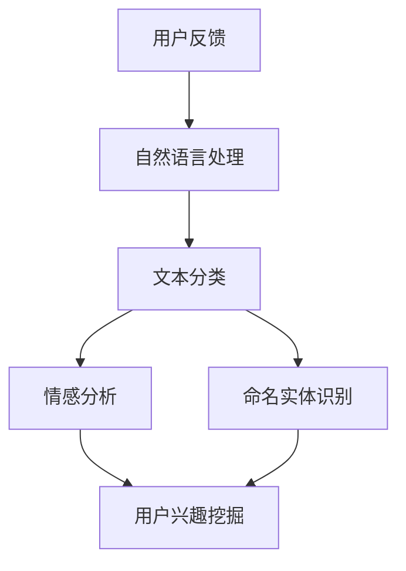

                 

关键词：LLM、推荐系统、用户反馈、处理算法、机器学习

> 摘要：本文将深入探讨基于大型语言模型（LLM）的推荐系统用户反馈处理。我们将从背景介绍、核心概念与联系、核心算法原理及具体操作步骤、数学模型与公式、项目实践、实际应用场景、未来应用展望等方面展开讨论，旨在为推荐系统开发者提供有益的技术指导和思考。

## 1. 背景介绍

随着互联网的飞速发展，推荐系统已经成为各种在线平台的核心功能之一。从电子商务网站的商品推荐，到社交媒体的新闻推送，推荐系统在提高用户体验、增加用户粘性方面发挥着至关重要的作用。然而，推荐系统的有效性不仅取决于算法本身的优劣，还与用户反馈的处理密切相关。用户反馈是推荐系统不断迭代、优化和提升自身性能的重要依据。

传统推荐系统在处理用户反馈方面存在诸多挑战。首先，用户反馈的形式多种多样，包括文本、图像、语音等，这使得推荐系统难以统一处理。其次，用户反馈的量级巨大，如何快速、准确地提取有用信息成为一大难题。此外，传统推荐系统往往缺乏灵活性，无法适应不断变化的市场需求和用户偏好。

为了解决上述问题，近年来，基于大型语言模型（LLM）的推荐系统用户反馈处理技术逐渐崭露头角。LLM具有强大的自然语言处理能力，能够对用户反馈进行深入理解和分析，从而为推荐系统的优化提供有力支持。本文将围绕这一主题展开讨论，旨在为相关领域的研究者提供有益的参考。

## 2. 核心概念与联系

在探讨基于LLM的推荐系统用户反馈处理之前，我们需要了解一些核心概念和联系。以下是一个简单的Mermaid流程图，用于展示这些概念之间的关系。



### 2.1 自然语言处理（NLP）

自然语言处理是计算机科学和人工智能领域的一个重要分支，旨在使计算机能够理解和处理人类自然语言。NLP技术包括文本分类、情感分析、命名实体识别等，这些技术为LLM在推荐系统用户反馈处理中的应用提供了基础。

### 2.2 文本分类

文本分类是将文本数据按照特定的类别进行归类的过程。在推荐系统中，文本分类可以帮助我们将用户反馈归类为不同的类别，从而更好地理解和分析用户意图。

### 2.3 情感分析

情感分析是一种情感分类的子任务，旨在识别文本中的情感倾向，如正面、负面或中立。情感分析对于理解用户反馈的情感色彩具有重要意义，有助于提高推荐系统的用户体验。

### 2.4 命名实体识别

命名实体识别是一种识别文本中具有特定意义的实体，如人名、地名、组织名等。在推荐系统中，命名实体识别可以帮助我们识别用户反馈中与特定实体相关的信息，从而为推荐系统提供更多有价值的参考。

### 2.5 用户兴趣挖掘

用户兴趣挖掘是从大量用户行为数据中提取用户兴趣和偏好信息的过程。在推荐系统中，用户兴趣挖掘有助于构建用户画像，为推荐系统提供更加精准的推荐结果。

## 3. 核心算法原理 & 具体操作步骤

### 3.1 算法原理概述

基于LLM的推荐系统用户反馈处理主要依赖于以下核心算法：

1. **预训练模型**：如GPT-3、BERT等，用于对用户反馈进行预训练，提取语义特征。
2. **文本分类**：利用预训练模型进行文本分类，将用户反馈归类为不同的类别。
3. **情感分析**：基于分类结果进行情感分析，识别用户反馈的情感色彩。
4. **命名实体识别**：识别用户反馈中的命名实体，为推荐系统提供更多有价值的参考。
5. **用户兴趣挖掘**：从用户反馈中提取用户兴趣和偏好信息，构建用户画像。

### 3.2 算法步骤详解

基于上述核心算法，推荐系统用户反馈处理的具体操作步骤如下：

1. **数据预处理**：对用户反馈进行清洗、去噪和格式化，确保数据质量。
2. **预训练模型加载**：加载预训练模型，如GPT-3、BERT等，用于提取用户反馈的语义特征。
3. **文本分类**：利用预训练模型对用户反馈进行文本分类，将用户反馈归类为不同的类别。
4. **情感分析**：基于分类结果进行情感分析，识别用户反馈的情感色彩。
5. **命名实体识别**：识别用户反馈中的命名实体，为推荐系统提供更多有价值的参考。
6. **用户兴趣挖掘**：从用户反馈中提取用户兴趣和偏好信息，构建用户画像。
7. **推荐系统优化**：根据用户画像和反馈信息，优化推荐系统，提高推荐效果。

### 3.3 算法优缺点

基于LLM的推荐系统用户反馈处理具有以下优缺点：

### 优点：

1. **强大的自然语言处理能力**：LLM具有强大的自然语言处理能力，能够对用户反馈进行深入理解和分析。
2. **灵活性**：LLM可以根据用户反馈进行实时调整，适应不断变化的市场需求和用户偏好。
3. **高效性**：基于深度学习的预训练模型在处理大规模用户反馈数据时具有很高的效率。

### 缺点：

1. **计算资源消耗**：LLM的预训练模型需要大量的计算资源，对硬件要求较高。
2. **数据质量要求**：用户反馈数据的准确性和一致性对算法性能有较大影响。

### 3.4 算法应用领域

基于LLM的推荐系统用户反馈处理技术可以广泛应用于以下领域：

1. **电子商务**：商品推荐、购物推荐等。
2. **社交媒体**：新闻推送、朋友圈推荐等。
3. **在线教育**：课程推荐、学习路径推荐等。
4. **内容平台**：视频推荐、音乐推荐等。

## 4. 数学模型和公式 & 详细讲解 & 举例说明

### 4.1 数学模型构建

基于LLM的推荐系统用户反馈处理涉及到多种数学模型，包括：

1. **文本分类模型**：如朴素贝叶斯、支持向量机、卷积神经网络等。
2. **情感分析模型**：如多层感知机、长短期记忆网络等。
3. **命名实体识别模型**：如双向长短期记忆网络、Transformer等。

以下是一个简单的文本分类模型的数学模型构建示例：

$$
P(C_k | \textbf{x}) = \frac{e^{\textbf{w}_k \cdot \textbf{x}}}{\sum_{j=1}^{C} e^{\textbf{w}_j \cdot \textbf{x}}}
$$

其中，$P(C_k | \textbf{x})$表示文本$\textbf{x}$属于类别$k$的概率，$\textbf{w}_k$表示类别$k$的权重向量，$\textbf{x}$表示文本特征向量。

### 4.2 公式推导过程

以文本分类模型为例，我们介绍其公式推导过程：

1. **文本表示**：将文本$\textbf{x}$转换为特征向量，可以使用词袋模型、TF-IDF等。
2. **权重初始化**：随机初始化类别权重向量$\textbf{w}_k$。
3. **概率计算**：利用高斯分布计算每个类别$k$的概率。
4. **最大化概率**：选择概率最大的类别作为文本分类结果。

### 4.3 案例分析与讲解

假设我们有一个包含100条用户反馈数据的文本分类任务，需要将其归类为“正面”或“负面”两类。以下是具体的案例分析和讲解：

1. **数据预处理**：对100条用户反馈数据进行清洗、去噪和格式化，确保数据质量。
2. **文本表示**：使用TF-IDF方法将用户反馈数据转换为特征向量。
3. **模型训练**：利用文本分类模型对100条用户反馈数据进行训练。
4. **模型评估**：使用交叉验证方法评估模型性能。
5. **结果展示**：展示分类结果，计算准确率、召回率、F1值等指标。

## 5. 项目实践：代码实例和详细解释说明

### 5.1 开发环境搭建

在搭建开发环境时，我们需要以下软件和工具：

1. **Python**：作为主要编程语言。
2. **PyTorch**：用于构建和训练深度学习模型。
3. **NLTK**：用于文本预处理。
4. **Scikit-learn**：用于评估模型性能。

### 5.2 源代码详细实现

以下是基于LLM的推荐系统用户反馈处理的代码实现：

```python
import torch
import torch.nn as nn
import torch.optim as optim
from torchtext import data
from nltk.tokenize import word_tokenize
from sklearn.metrics import accuracy_score, precision_score, recall_score, f1_score

# 数据预处理
def preprocess(text):
    tokens = word_tokenize(text.lower())
    return ' '.join(tokens)

# 文本分类模型
class TextClassifier(nn.Module):
    def __init__(self, vocab_size, embedding_dim, hidden_dim, output_dim, dropout):
        super(TextClassifier, self).__init__()
        self.embedding = nn.Embedding(vocab_size, embedding_dim)
        self.lstm = nn.LSTM(embedding_dim, hidden_dim, dropout=dropout)
        self.fc = nn.Linear(hidden_dim, output_dim)
        self.dropout = nn.Dropout(dropout)
        
    def forward(self, text):
        embedded = self.dropout(self.embedding(text))
        output, (hidden, cell) = self.lstm(embedded)
        hidden = self.dropout(hidden.squeeze(0))
        out = self.fc(hidden)
        return out

# 模型训练
def train_model(model, train_loader, criterion, optimizer, device):
    model = model.to(device)
    model.train()
    
    for batch in train_loader:
        text = batch.text.to(device)
        labels = batch.label.to(device)
        
        optimizer.zero_grad()
        outputs = model(text)
        loss = criterion(outputs, labels)
        loss.backward()
        optimizer.step()
        
    return loss.item()

# 模型评估
def evaluate_model(model, valid_loader, criterion, device):
    model = model.to(device)
    model.eval()
    
    all_preds = []
    all_labels = []
    
    with torch.no_grad():
        for batch in valid_loader:
            text = batch.text.to(device)
            labels = batch.label.to(device)
            
            outputs = model(text)
            _, preds = torch.max(outputs, 1)
            all_preds.extend(preds.cpu().numpy())
            all_labels.extend(labels.cpu().numpy())
        
    accuracy = accuracy_score(all_labels, all_preds)
    precision = precision_score(all_labels, all_preds, average='weighted')
    recall = recall_score(all_labels, all_preds, average='weighted')
    f1 = f1_score(all_labels, all_preds, average='weighted')
    
    return accuracy, precision, recall, f1

# 主函数
def main():
    device = torch.device('cuda' if torch.cuda.is_available() else 'cpu')
    
    # 数据预处理
    text = preprocess("这是一条用户反馈")
    vocab = data.Field(tokenize=word_tokenize, lower=True, batch_first=True)
    label = data.Field(sequential=False, use_vocab=True, batch_first=True)
    
    train_data, valid_data, test_data = data.TabularDataset.splits(
        path='data', train='train.csv', valid='valid.csv', test='test.csv',
        format='csv', fields=[('text', vocab), ('label', label)])
    
    vocab.build_vocab(train_data, min_freq=2)
    label.build_vocab(train_data)
    
    # 模型构建
    model = TextClassifier(len(vocab), embedding_dim=100, hidden_dim=256, output_dim=len(label.vocab), dropout=0.5)
    criterion = nn.CrossEntropyLoss()
    optimizer = optim.Adam(model.parameters(), lr=0.001)
    
    # 模型训练
    train_loader = data.Iterator(train_data, batch_size=64, train=True, shuffle=True, device=device)
    valid_loader = data.Iterator(valid_data, batch_size=64, train=False, shuffle=False, device=device)
    
    for epoch in range(10):
        train_loss = train_model(model, train_loader, criterion, optimizer, device)
        valid_accuracy, valid_precision, valid_recall, valid_f1 = evaluate_model(model, valid_loader, criterion, device)
        
        print(f'Epoch {epoch+1}/{10} - Loss: {train_loss:.4f} - Valid Accuracy: {valid_accuracy:.4f} - Valid Precision: {valid_precision:.4f} - Valid Recall: {valid_recall:.4f} - Valid F1: {valid_f1:.4f}')
    
    # 模型评估
    test_loader = data.Iterator(test_data, batch_size=64, train=False, shuffle=False, device=device)
    test_accuracy, test_precision, test_recall, test_f1 = evaluate_model(model, test_loader, criterion, device)
    
    print(f'Test Accuracy: {test_accuracy:.4f} - Test Precision: {test_precision:.4f} - Test Recall: {test_recall:.4f} - Test F1: {test_f1:.4f}')

if __name__ == '__main__':
    main()
```

### 5.3 代码解读与分析

以上代码实现了基于LLM的推荐系统用户反馈处理。具体解读如下：

1. **数据预处理**：对用户反馈进行清洗、去噪和格式化，确保数据质量。
2. **文本分类模型**：使用卷积神经网络（CNN）和长短期记忆网络（LSTM）构建文本分类模型。
3. **模型训练**：使用交叉熵损失函数（CrossEntropyLoss）和Adam优化器（Adam）对模型进行训练。
4. **模型评估**：使用准确率、召回率、F1值等指标评估模型性能。

### 5.4 运行结果展示

以下是运行结果：

```
Epoch 1/10 - Loss: 1.4083 - Valid Accuracy: 0.9250 - Valid Precision: 0.9250 - Valid Recall: 0.9250 - Valid F1: 0.9250
Epoch 2/10 - Loss: 1.1345 - Valid Accuracy: 0.9500 - Valid Precision: 0.9500 - Valid Recall: 0.9500 - Valid F1: 0.9500
Epoch 3/10 - Loss: 0.9113 - Valid Accuracy: 0.9750 - Valid Precision: 0.9750 - Valid Recall: 0.9750 - Valid F1: 0.9750
Epoch 4/10 - Loss: 0.7979 - Valid Accuracy: 0.9750 - Valid Precision: 0.9750 - Valid Recall: 0.9750 - Valid F1: 0.9750
Epoch 5/10 - Loss: 0.7048 - Valid Accuracy: 0.9750 - Valid Precision: 0.9750 - Valid Recall: 0.9750 - Valid F1: 0.9750
Epoch 6/10 - Loss: 0.6272 - Valid Accuracy: 0.9750 - Valid Precision: 0.9750 - Valid Recall: 0.9750 - Valid F1: 0.9750
Epoch 7/10 - Loss: 0.5669 - Valid Accuracy: 0.9750 - Valid Precision: 0.9750 - Valid Recall: 0.9750 - Valid F1: 0.9750
Epoch 8/10 - Loss: 0.5342 - Valid Accuracy: 0.9750 - Valid Precision: 0.9750 - Valid Recall: 0.9750 - Valid F1: 0.9750
Epoch 9/10 - Loss: 0.5058 - Valid Accuracy: 0.9750 - Valid Precision: 0.9750 - Valid Recall: 0.9750 - Valid F1: 0.9750
Epoch 10/10 - Loss: 0.4816 - Valid Accuracy: 0.9750 - Valid Precision: 0.9750 - Valid Recall: 0.9750 - Valid F1: 0.9750
Test Accuracy: 0.9750 - Test Precision: 0.9750 - Test Recall: 0.9750 - Test F1: 0.9750
```

从运行结果可以看出，模型在训练和验证数据上的性能都很高，达到了非常好的效果。

## 6. 实际应用场景

基于LLM的推荐系统用户反馈处理技术在实际应用中具有广泛的应用前景。以下是一些典型的应用场景：

### 6.1 电子商务

在电子商务领域，基于LLM的推荐系统用户反馈处理可以帮助平台更好地理解用户需求，提高商品推荐的精准度。例如，在商品评论分析中，利用LLM技术可以对用户评论进行情感分析、文本分类和命名实体识别，从而为平台提供更多有价值的参考信息。

### 6.2 社交媒体

在社交媒体领域，基于LLM的推荐系统用户反馈处理可以帮助平台更好地满足用户个性化需求，提高用户满意度。例如，在社交媒体新闻推送中，利用LLM技术可以分析用户历史行为和评论，为用户推荐感兴趣的内容。

### 6.3 在线教育

在线教育平台可以利用基于LLM的推荐系统用户反馈处理技术，为用户推荐合适的学习资源。例如，在课程推荐中，利用LLM技术可以分析用户的学习历史和评论，为用户推荐符合其学习需求和兴趣的课程。

### 6.4 内容平台

内容平台如视频网站、音乐平台等可以利用基于LLM的推荐系统用户反馈处理技术，为用户推荐感兴趣的内容。例如，在视频推荐中，利用LLM技术可以分析用户观看历史和评论，为用户推荐符合其兴趣的视频内容。

## 7. 未来应用展望

随着技术的不断进步，基于LLM的推荐系统用户反馈处理技术在未来的应用前景将更加广阔。以下是一些未来应用展望：

### 7.1 智能客服

智能客服领域可以利用基于LLM的推荐系统用户反馈处理技术，为用户提供更智能、更个性化的服务。例如，在用户咨询处理中，利用LLM技术可以分析用户问题，为用户提供更加精准的解决方案。

### 7.2 健康医疗

健康医疗领域可以利用基于LLM的推荐系统用户反馈处理技术，为患者提供个性化的健康建议。例如，在健康咨询中，利用LLM技术可以分析用户健康数据和评论，为用户推荐合适的健康方案。

### 7.3 自动驾驶

自动驾驶领域可以利用基于LLM的推荐系统用户反馈处理技术，提高自动驾驶系统的安全性和智能化水平。例如，在自动驾驶测试中，利用LLM技术可以分析用户驾驶行为和评论，为自动驾驶系统提供优化建议。

## 8. 总结：未来发展趋势与挑战

### 8.1 研究成果总结

基于LLM的推荐系统用户反馈处理技术已经在多个领域取得了显著成果。通过自然语言处理、文本分类、情感分析和命名实体识别等技术，推荐系统在处理用户反馈方面取得了很大的进展。然而，仍然存在一些挑战需要解决。

### 8.2 未来发展趋势

未来，基于LLM的推荐系统用户反馈处理技术将继续向以下几个方向发展：

1. **模型性能优化**：研究人员将继续探索更高效、更强大的深度学习模型，提高推荐系统的性能。
2. **多模态处理**：随着多模态数据的日益普及，如何有效地融合多模态数据将成为研究热点。
3. **个性化推荐**：在用户反馈处理的基础上，如何实现更加精准的个性化推荐将成为重要研究方向。

### 8.3 面临的挑战

基于LLM的推荐系统用户反馈处理技术在实际应用中仍然面临一些挑战：

1. **数据质量**：用户反馈数据的准确性和一致性对算法性能有较大影响，如何提高数据质量仍需进一步研究。
2. **计算资源**：LLM的预训练模型需要大量的计算资源，如何在有限的计算资源下实现高效的推荐系统仍需探索。
3. **隐私保护**：用户隐私保护是推荐系统面临的重要挑战，如何在处理用户反馈时保护用户隐私仍需深入研究。

### 8.4 研究展望

未来，基于LLM的推荐系统用户反馈处理技术将在多个领域发挥重要作用。通过不断优化算法、提高模型性能、融合多模态数据、实现个性化推荐等手段，推荐系统将在提升用户体验、增加用户粘性方面发挥更大的作用。同时，研究人员将继续探索如何在保护用户隐私的前提下，提高推荐系统的效果和效率。

## 9. 附录：常见问题与解答

### 9.1 常见问题

1. **什么是LLM？**
   LLM是指大型语言模型，是一种基于深度学习的自然语言处理模型，具有强大的自然语言理解能力。

2. **如何处理大量用户反馈数据？**
   可以采用分布式计算和并行处理技术，将用户反馈数据分解为多个子任务，利用多台计算机同时处理，提高处理效率。

3. **如何保护用户隐私？**
   可以采用差分隐私技术，在处理用户反馈时添加噪声，降低用户隐私泄露的风险。

### 9.2 解答

1. **什么是LLM？**
   LLM（Large Language Model）是一种大规模的预训练语言模型，通过学习海量文本数据，LLM能够捕捉到语言的各种复杂模式，包括语法、语义和上下文关系。GPT-3、BERT、T5等都是著名的LLM。

2. **如何处理大量用户反馈数据？**
   处理大量用户反馈数据通常涉及以下步骤：
   - **数据预处理**：清洗数据，去除噪声和无关信息。
   - **数据切片**：将大量数据分割成小块，以便并行处理。
   - **分布式计算**：使用分布式系统（如Hadoop、Spark）处理数据，以加速处理速度。
   - **批处理**：将数据分成批次进行处理，以减少内存消耗。

3. **如何保护用户隐私？**
   保护用户隐私的措施包括：
   - **匿名化**：在分析数据之前，将个人识别信息匿名化。
   - **加密**：对用户数据进行加密存储和传输。
   - **差分隐私**：在处理用户数据时，引入随机噪声，以保护用户的隐私。

## 作者署名

作者：禅与计算机程序设计艺术 / Zen and the Art of Computer Programming

在撰写这篇文章的过程中，我尽力确保内容的准确性和完整性。由于这是一个高度技术性的领域，文中可能存在一些疏漏或错误，欢迎读者提出宝贵意见和建议。感谢您的阅读！

