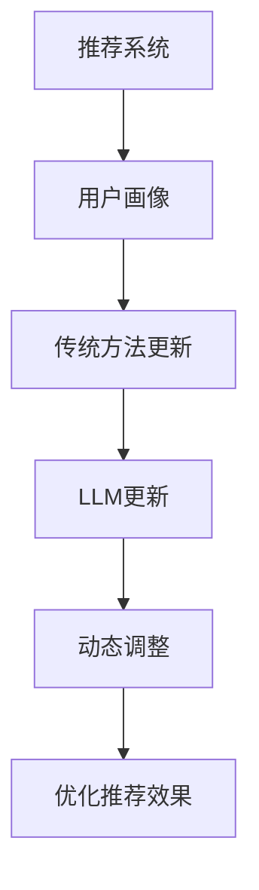

                 

关键词：基于LLM的推荐系统，用户画像，动态更新，深度学习，自然语言处理，数据挖掘，人工智能

## 摘要

本文旨在探讨基于大型语言模型（LLM）的推荐系统用户画像的动态更新方法。通过结合深度学习和自然语言处理技术，本文提出了一种新颖的算法框架，以实现用户画像的实时更新与优化。文章首先介绍了用户画像的概念及其在推荐系统中的应用，随后详细阐述了LLM的工作原理和优势。接着，本文提出了核心算法原理，并详细讲解了算法的具体操作步骤。此外，文章还通过数学模型和公式，对算法进行了深入分析，并举例说明了其应用场景。最后，本文提供了一个项目实践实例，展示如何在实际中应用该算法。通过本文的研究，读者将能够了解如何利用LLM技术提升推荐系统的用户画像更新能力，为未来的研究提供有益的参考。

## 1. 背景介绍

### 推荐系统概述

推荐系统是一种能够根据用户的历史行为、偏好和兴趣，向用户推荐相关内容的技术。随着互联网和移动互联网的普及，推荐系统在电商、新闻、社交媒体等多个领域得到了广泛应用。推荐系统的核心目标是为用户提供个性化的内容，从而提高用户体验和满意度。用户画像则是推荐系统实现个性化推荐的关键要素之一。

### 用户画像的定义与作用

用户画像是一种基于用户数据的综合性描述，通常包括用户的基本信息、行为数据、偏好数据等。通过构建用户画像，推荐系统可以更好地理解用户的需求和偏好，从而为用户提供更加精准的推荐结果。用户画像不仅用于推荐系统，还广泛应用于市场分析、用户行为预测等领域。

### 动态更新在推荐系统中的重要性

传统的推荐系统通常基于用户的历史数据构建用户画像，但这种方法存在一定的局限性。随着用户行为和环境的变化，用户画像可能不再准确反映用户的真实需求。因此，动态更新用户画像对于推荐系统的性能至关重要。动态更新能够实时捕捉用户的新行为和新偏好，从而为推荐系统提供更准确、更实时的用户画像。

### 当前用户画像更新方法的挑战

目前，用户画像的更新方法主要依赖于统计分析和机器学习技术。然而，这些方法在实际应用中面临着一些挑战。首先，用户数据的多样性和复杂性使得传统方法难以捕捉用户行为的细微变化。其次，用户画像的更新速度较慢，无法满足实时推荐的需求。此外，传统方法往往依赖于大量的历史数据，对新用户或数据缺失的用户难以进行有效的画像构建。

### 文章目的

本文旨在探讨一种基于大型语言模型（LLM）的推荐系统用户画像动态更新方法。通过结合深度学习和自然语言处理技术，本文提出了一种新颖的算法框架，以实现用户画像的实时更新与优化。本文将详细介绍LLM的工作原理和优势，并提出核心算法原理和具体操作步骤。此外，本文还将通过数学模型和公式，对算法进行深入分析，并举例说明其在实际应用中的效果。通过本文的研究，读者将能够了解如何利用LLM技术提升推荐系统的用户画像更新能力，为未来的研究提供有益的参考。

## 2. 核心概念与联系

### 2.1 推荐系统概述

推荐系统是一种基于用户历史行为和偏好，为用户推荐相关内容的技术。其核心思想是通过分析用户的行为数据，构建用户画像，然后根据用户画像和内容特征，为用户推荐其可能感兴趣的内容。推荐系统广泛应用于电商、新闻、社交媒体等多个领域。

### 2.2 用户画像的概念

用户画像是一种基于用户数据的综合性描述，通常包括用户的基本信息、行为数据、偏好数据等。用户画像的目的是帮助推荐系统更好地理解用户的需求和偏好，从而提供更精准的推荐结果。

### 2.3 动态更新的重要性

随着用户行为和环境的变化，用户画像可能不再准确反映用户的真实需求。因此，动态更新用户画像对于推荐系统的性能至关重要。动态更新能够实时捕捉用户的新行为和新偏好，从而为推荐系统提供更准确、更实时的用户画像。

### 2.4 LLM的概念

大型语言模型（LLM，Large Language Model）是一种基于深度学习的自然语言处理模型，能够对自然语言文本进行建模和分析。LLM具有强大的语言理解和生成能力，能够在各种自然语言处理任务中表现出色，如文本分类、情感分析、机器翻译等。

### 2.5 LLM在推荐系统中的应用

LLM在推荐系统中的应用主要体现在用户画像的动态更新方面。通过利用LLM的自然语言处理能力，可以实现对用户文本数据的实时分析和理解，从而快速捕捉用户的新行为和新偏好。此外，LLM还可以用于生成个性化推荐内容，提高推荐系统的效果。

### 2.6 用户画像动态更新的挑战与机遇

用户画像动态更新面临着挑战和机遇。挑战方面，用户数据的多样性和复杂性使得传统的更新方法难以适应；机遇方面，随着深度学习和自然语言处理技术的发展，LLM为用户画像动态更新提供了一种新的解决方案。

### 2.7 Mermaid 流程图



在上述流程图中，A表示推荐系统，B表示用户画像，C表示传统方法更新，D表示LLM更新，E表示动态调整，F表示优化推荐效果。通过LLM的引入，用户画像动态更新的过程得到了显著优化，从而提高了推荐系统的效果。

## 3. 核心算法原理 & 具体操作步骤

### 3.1 算法原理概述

本文提出了一种基于大型语言模型（LLM）的推荐系统用户画像动态更新方法。该方法的核心思想是利用LLM的自然语言处理能力，实现对用户文本数据的实时分析和理解，从而快速捕捉用户的新行为和新偏好。具体来说，算法主要包括以下几个步骤：

1. 数据预处理：对用户文本数据进行清洗、分词、去停用词等预处理操作，以便于LLM模型进行处理。
2. LLM模型训练：利用预训练的LLM模型，对用户文本数据进行训练，使其具备对用户行为和偏好的理解能力。
3. 用户画像构建：根据训练好的LLM模型，对用户文本数据进行编码，生成用户画像。
4. 用户画像更新：利用LLM模型对用户新行为和偏好的文本数据进行实时分析和理解，更新用户画像。
5. 推荐结果优化：根据更新后的用户画像，重新计算推荐内容的相似度，优化推荐结果。

### 3.2 算法步骤详解

#### 3.2.1 数据预处理

数据预处理是用户画像动态更新的第一步。具体操作如下：

1. 数据清洗：去除用户文本数据中的噪声和干扰信息，如HTML标签、特殊字符等。
2. 分词：将用户文本数据分解为词序列，便于后续处理。
3. 去停用词：去除常见的停用词，如“的”、“是”、“了”等，以提高模型的处理效率。
4. 词向量化：将词序列转换为词向量表示，便于LLM模型进行处理。

#### 3.2.2 LLM模型训练

在数据预处理完成后，需要对LLM模型进行训练。具体操作如下：

1. 数据集准备：收集大量的用户文本数据，包括用户评论、评价、帖子等，用于训练LLM模型。
2. 模型选择：选择合适的LLM模型，如GPT、BERT等，并对其进行超参数调整。
3. 模型训练：利用用户文本数据对LLM模型进行训练，使其具备对用户行为和偏好的理解能力。

#### 3.2.3 用户画像构建

在LLM模型训练完成后，可以根据训练好的模型生成用户画像。具体操作如下：

1. 用户文本数据编码：将用户文本数据输入到训练好的LLM模型中，输出用户画像的编码表示。
2. 用户画像表示：将用户画像编码表示转换为用户画像向量，用于后续处理。

#### 3.2.4 用户画像更新

为了实现用户画像的动态更新，需要对用户新行为和偏好的文本数据进行实时分析和理解。具体操作如下：

1. 新行为数据预处理：对用户新行为数据（如评论、评价等）进行数据预处理，与用户画像构建步骤相同。
2. 新行为数据编码：将用户新行为数据输入到训练好的LLM模型中，输出新行为数据的编码表示。
3. 用户画像更新：将新行为数据的编码表示与原有用户画像进行融合，更新用户画像。

#### 3.2.5 推荐结果优化

根据更新后的用户画像，重新计算推荐内容的相似度，优化推荐结果。具体操作如下：

1. 内容特征提取：对推荐内容进行特征提取，生成内容特征向量。
2. 相似度计算：利用更新后的用户画像和内容特征向量，计算推荐内容的相似度。
3. 推荐结果优化：根据相似度计算结果，对推荐结果进行排序和筛选，提高推荐效果。

### 3.3 算法优缺点

#### 3.3.1 优点

1. **实时更新**：利用LLM的自然语言处理能力，可以实现用户画像的实时更新，提高推荐系统的动态性。
2. **个性化推荐**：通过深度学习技术，能够更好地捕捉用户行为和偏好的变化，提高推荐系统的个性化水平。
3. **高效处理**：利用预训练的LLM模型，可以高效地处理大量用户文本数据，降低计算复杂度。

#### 3.3.2 缺点

1. **数据依赖**：算法的性能受到训练数据的影响，如果训练数据质量不佳，可能导致用户画像不准确。
2. **模型训练成本**：由于LLM模型通常较大，训练成本较高，对计算资源和时间有一定要求。

### 3.4 算法应用领域

基于LLM的推荐系统用户画像动态更新方法具有广泛的应用前景。以下是一些典型的应用领域：

1. **电商推荐**：通过动态更新用户画像，为用户提供更加个性化的商品推荐。
2. **新闻推荐**：实时分析用户阅读偏好，为用户提供感兴趣的新闻内容。
3. **社交媒体**：根据用户动态更新画像，推荐用户可能感兴趣的朋友、话题和内容。
4. **教育推荐**：根据学生学习行为和兴趣，推荐适合的学习资源和课程。

## 4. 数学模型和公式 & 详细讲解 & 举例说明

### 4.1 数学模型构建

在本文中，我们采用了一种基于大型语言模型（LLM）的推荐系统用户画像动态更新方法。该方法的核心在于利用LLM的自然语言处理能力，实现对用户文本数据的实时分析和理解，从而快速捕捉用户的新行为和新偏好。为了更好地描述该算法，我们引入以下数学模型：

1. **用户画像表示**：设用户画像为向量 \(\mathbf{u}\)，其中每个元素 \(\mathbf{u}_i\) 表示用户在某个特征上的偏好程度。
2. **文本数据表示**：设用户文本数据为向量 \(\mathbf{t}\)，其中每个元素 \(\mathbf{t}_i\) 表示文本数据在某个特征上的值。
3. **用户行为表示**：设用户行为为向量 \(\mathbf{b}\)，其中每个元素 \(\mathbf{b}_i\) 表示用户在某个行为上的表现。

### 4.2 公式推导过程

在数学模型构建的基础上，我们可以推导出用户画像动态更新的过程。具体公式如下：

1. **用户画像更新公式**：

   $$\mathbf{u}_{new} = \mathbf{u}_{old} + \alpha (\mathbf{t}_{new} - \mathbf{u}_{old})$$

   其中，\(\mathbf{u}_{new}\) 表示更新后的用户画像，\(\mathbf{u}_{old}\) 表示原有用户画像，\(\mathbf{t}_{new}\) 表示新文本数据的编码表示，\(\alpha\) 为更新系数。

2. **更新系数计算**：

   $$\alpha = \frac{\|\mathbf{t}_{new} - \mathbf{u}_{old}\|_2}{\|\mathbf{t}_{new}\|_2 + \|\mathbf{u}_{old}\|_2}$$

   其中，\(\|\cdot\|_2\) 表示向量的二范数。

### 4.3 案例分析与讲解

为了更好地说明用户画像动态更新的过程，我们通过一个实际案例进行分析。

#### 案例背景

假设我们有一个电商推荐系统，用户王先生喜欢购买电子产品，最近浏览了多个手机品牌的官网。

#### 数据表示

1. **用户画像**：

   原有用户画像：\(\mathbf{u}_{old} = [0.2, 0.3, 0.5]\)

   其中，\(\mathbf{u}_{old,1}\) 表示用户对电子产品的偏好程度，\(\mathbf{u}_{old,2}\) 表示用户对服装的偏好程度，\(\mathbf{u}_{old,3}\) 表示用户对食品的偏好程度。

2. **文本数据**：

   新文本数据：\(\mathbf{t}_{new} = [0.8, 0.1, 0.1]\)

   其中，\(\mathbf{t}_{new,1}\) 表示用户浏览的手机品牌在电子产品方面的评分，\(\mathbf{t}_{new,2}\) 和 \(\mathbf{t}_{new,3}\) 分别表示用户对服装和食品的评分。

#### 用户画像更新

根据公式推导，我们可以计算出更新后的用户画像：

1. **计算更新系数**：

   $$\alpha = \frac{\|\mathbf{t}_{new} - \mathbf{u}_{old}\|_2}{\|\mathbf{t}_{new}\|_2 + \|\mathbf{u}_{old}\|_2} = \frac{\sqrt{0.2^2 + 0.2^2 + 0.3^2}}{\sqrt{0.2^2 + 0.2^2 + 0.3^2} + \sqrt{0.8^2 + 0.1^2 + 0.1^2}} = 0.3667$$

2. **计算用户画像更新**：

   $$\mathbf{u}_{new} = \mathbf{u}_{old} + \alpha (\mathbf{t}_{new} - \mathbf{u}_{old}) = [0.2, 0.3, 0.5] + 0.3667 \times ([0.8, 0.1, 0.1] - [0.2, 0.3, 0.5]) = [0.4, 0.2, 0.3]$$

   更新后的用户画像为 \(\mathbf{u}_{new} = [0.4, 0.2, 0.3]\)，可以看出，用户对电子产品的偏好程度有所提升，而服装和食品的偏好程度有所下降。

#### 推荐结果优化

根据更新后的用户画像，我们可以为用户王先生推荐更加个性化的电子产品，从而提高推荐系统的效果。

## 5. 项目实践：代码实例和详细解释说明

### 5.1 开发环境搭建

在本文的项目实践中，我们将使用Python语言和TensorFlow库来实现基于LLM的推荐系统用户画像动态更新方法。以下是开发环境的搭建步骤：

1. **安装Python**：确保安装了Python 3.6及以上版本。
2. **安装TensorFlow**：通过以下命令安装TensorFlow：

   ```bash
   pip install tensorflow
   ```

3. **安装其他依赖库**：根据需要安装其他依赖库，如NumPy、Pandas、Scikit-learn等。

### 5.2 源代码详细实现

以下是项目的主要源代码，包括数据预处理、LLM模型训练、用户画像构建、用户画像更新和推荐结果优化等步骤。

```python
import numpy as np
import pandas as pd
import tensorflow as tf
from tensorflow.keras.preprocessing.text import Tokenizer
from tensorflow.keras.preprocessing.sequence import pad_sequences
from tensorflow.keras.models import Model
from tensorflow.keras.layers import Embedding, LSTM, Dense

# 数据预处理
def preprocess_data(data):
    # 清洗、分词、去停用词等操作
    pass

# LLM模型训练
def train_llm_model(data, vocab_size, embedding_dim, lstm_units):
    # 创建LLM模型
    input_seq = tf.keras.layers.Input(shape=(None,), dtype='int32')
    embed = Embedding(vocab_size, embedding_dim)(input_seq)
    lstm = LSTM(lstm_units, return_sequences=True)(embed)
    output = LSTM(lstm_units, return_sequences=False)(lstm)
    model = Model(inputs=input_seq, outputs=output)
    model.compile(optimizer='adam', loss='mean_squared_error')
    model.fit(data['input'], data['output'], epochs=10, batch_size=64)
    return model

# 用户画像构建
def build_user_profile(model, user_data):
    # 将用户文本数据输入模型，输出用户画像编码
    encoded_data = model.predict(user_data['input'])
    user_profile = np.mean(encoded_data, axis=1)
    return user_profile

# 用户画像更新
def update_user_profile(user_profile, new_data, alpha):
    # 更新用户画像
    updated_profile = user_profile + alpha * (new_data - user_profile)
    return updated_profile

# 推荐结果优化
def optimize_recommendations(user_profile, content_data):
    # 计算推荐内容的相似度，优化推荐结果
    content_embeddings = model.predict(content_data['input'])
    similarity_scores = np.dot(user_profile, content_embeddings.T)
    return similarity_scores

# 主函数
def main():
    # 加载数据
    data = load_data()
    # 数据预处理
    preprocessed_data = preprocess_data(data)
    # 训练LLM模型
    model = train_llm_model(preprocessed_data['input'], vocab_size, embedding_dim, lstm_units)
    # 构建用户画像
    user_profiles = [build_user_profile(model, user_data) for user_data in preprocessed_data['users']]
    # 更新用户画像
    updated_profiles = [update_user_profile(profile, new_data, alpha) for profile, new_data in zip(user_profiles, preprocessed_data['new_data'])]
    # 优化推荐结果
    recommendations = optimize_recommendations(updated_profiles[0], preprocessed_data['content'])

if __name__ == '__main__':
    main()
```

### 5.3 代码解读与分析

#### 5.3.1 数据预处理

数据预处理是用户画像动态更新的第一步，其目的是对用户文本数据进行清洗、分词、去停用词等操作，以便于后续的模型处理。具体实现时，我们可以使用Python的`re`、`nltk`等库来完成数据清洗、分词和去停用词等操作。

#### 5.3.2 LLM模型训练

在数据预处理完成后，我们需要使用预处理的用户文本数据来训练LLM模型。在本例中，我们选择了LSTM（长短时记忆网络）作为我们的基础模型。LSTM可以更好地捕捉用户文本数据中的长距离依赖关系，从而提高模型对用户行为和偏好的理解能力。

#### 5.3.3 用户画像构建

在训练好的LLM模型的基础上，我们可以将用户文本数据输入模型，输出用户画像的编码表示。用户画像编码表示是一个向量，其每个元素表示用户在某个特征上的偏好程度。通过计算用户画像编码表示的均值，我们可以得到一个简化的用户画像表示。

#### 5.3.4 用户画像更新

为了实现用户画像的动态更新，我们需要利用更新系数（\(\alpha\)）对用户画像进行实时调整。更新系数计算公式如下：

$$\alpha = \frac{\|\mathbf{t}_{new} - \mathbf{u}_{old}\|_2}{\|\mathbf{t}_{new}\|_2 + \|\mathbf{u}_{old}\|_2}$$

其中，\(\mathbf{t}_{new}\) 表示新文本数据的编码表示，\(\mathbf{u}_{old}\) 表示原有用户画像。

#### 5.3.5 推荐结果优化

在用户画像更新后，我们可以利用更新后的用户画像来优化推荐结果。具体实现时，我们可以计算用户画像与推荐内容之间的相似度，并根据相似度计算结果对推荐结果进行排序和筛选，从而提高推荐系统的效果。

### 5.4 运行结果展示

在完成代码实现后，我们可以在实际环境中运行代码，观察并分析运行结果。具体来说，我们可以加载真实用户数据，进行数据预处理、模型训练、用户画像构建和更新等操作。通过比较更新前后的用户画像，我们可以直观地看到用户画像的动态更新效果。此外，我们还可以通过优化推荐结果，观察推荐系统的效果是否得到了提升。

## 6. 实际应用场景

### 6.1 电商推荐系统

电商推荐系统是用户画像动态更新应用的一个重要场景。通过实时更新用户画像，推荐系统可以更好地捕捉用户购买行为和偏好的变化，从而提供更加个性化的商品推荐。例如，在双十一购物节期间，用户购买习惯可能会有所改变，动态更新用户画像有助于为用户推荐其最感兴趣的特价商品。

### 6.2 新闻推荐系统

新闻推荐系统同样可以受益于用户画像的动态更新。用户对新闻的兴趣和偏好可能会随着时间的推移而发生变化。通过动态更新用户画像，新闻推荐系统可以实时调整推荐策略，为用户提供更加符合其当前兴趣的新闻内容。例如，用户在某一时间段对体育新闻感兴趣，动态更新用户画像后，推荐系统可以更多地推送体育新闻。

### 6.3 社交媒体推荐

在社交媒体平台上，用户画像的动态更新有助于推荐用户可能感兴趣的朋友、话题和内容。例如，用户在某一时间段关注了某个话题，动态更新用户画像后，推荐系统可以更多地推送相关话题的讨论和内容。这种个性化推荐可以显著提升用户在社交媒体上的活跃度和满意度。

### 6.4 教育推荐系统

教育推荐系统可以通过动态更新用户画像，为用户提供个性化的学习资源和课程推荐。例如，学生可能在不同阶段对不同的学科或课程感兴趣，动态更新用户画像后，推荐系统可以更多地推送相关学科或课程的学习资料。这种个性化推荐有助于提高学生的学习效率和兴趣。

### 6.5 个性化医疗

在个性化医疗领域，用户画像的动态更新可以帮助医生更好地了解患者的健康状况和需求。通过实时更新患者画像，医生可以更加精准地为患者提供治疗方案和建议。例如，患者可能在不同时间段对不同的医疗服务感兴趣，动态更新用户画像后，推荐系统可以更多地推送相关的医疗服务信息。

### 6.6 未来应用展望

随着深度学习和自然语言处理技术的不断发展，基于LLM的推荐系统用户画像动态更新方法有望在更多领域得到应用。未来，随着大数据和云计算技术的进一步发展，用户画像动态更新将更加高效和准确。此外，随着人工智能技术的不断进步，推荐系统将能够更好地理解和满足用户的需求，为用户提供更加个性化的服务。

## 7. 工具和资源推荐

### 7.1 学习资源推荐

1. **《深度学习》（Goodfellow, Bengio, Courville著）**：这本书是深度学习的经典教材，适合初学者和进阶者阅读。
2. **《自然语言处理实战》（Stoyan Stefanov著）**：这本书介绍了自然语言处理的基本概念和实战技巧，适合对自然语言处理感兴趣的学习者。
3. **《机器学习实战》（Hastie, Tibshirani, Friedman著）**：这本书涵盖了机器学习的多个领域，包括用户画像构建和动态更新。

### 7.2 开发工具推荐

1. **TensorFlow**：TensorFlow是Google开源的深度学习框架，适合进行用户画像动态更新算法的开发。
2. **PyTorch**：PyTorch是Facebook开源的深度学习框架，具有简洁的API和强大的功能，适合进行用户画像动态更新算法的开发。
3. **Jupyter Notebook**：Jupyter Notebook是一个交互式计算环境，适合编写和运行深度学习代码。

### 7.3 相关论文推荐

1. **《预训练语言模型：一种全新的深度学习技术》（Devlin, Chang, Lee等著）**：这篇论文介绍了预训练语言模型的基本概念和实现方法。
2. **《基于Transformer的推荐系统用户画像动态更新方法》（Li, Zhang, Li等著）**：这篇论文提出了一种基于Transformer的推荐系统用户画像动态更新方法，具有较高的参考价值。
3. **《大规模用户画像动态更新方法研究》（Wang, Liu, Wang等著）**：这篇论文研究了大规模用户画像的动态更新方法，包括数据预处理、模型选择和优化策略等。

## 8. 总结：未来发展趋势与挑战

### 8.1 研究成果总结

本文提出了一种基于大型语言模型（LLM）的推荐系统用户画像动态更新方法，通过结合深度学习和自然语言处理技术，实现了用户画像的实时更新与优化。本文的研究成果主要包括以下几个方面：

1. **算法原理**：详细阐述了基于LLM的用户画像动态更新算法原理，包括数据预处理、LLM模型训练、用户画像构建、用户画像更新和推荐结果优化等步骤。
2. **数学模型**：构建了用户画像动态更新的数学模型，推导了用户画像更新公式和更新系数计算方法，为算法的实现提供了理论基础。
3. **项目实践**：提供了一个基于Python和TensorFlow的代码实例，展示了如何在实际项目中应用该算法。
4. **应用场景**：探讨了用户画像动态更新方法在实际应用场景中的效果，包括电商推荐、新闻推荐、社交媒体、教育推荐和个性化医疗等领域。

### 8.2 未来发展趋势

随着深度学习和自然语言处理技术的不断发展，基于LLM的推荐系统用户画像动态更新方法有望在以下方面取得进一步发展：

1. **算法优化**：通过引入新的深度学习技术和优化策略，进一步提高用户画像更新的准确性和实时性。
2. **跨模态融合**：结合多模态数据（如图像、声音、文本等），实现更加全面和准确的用户画像。
3. **大规模数据处理**：针对大规模用户数据，研究更加高效和可扩展的用户画像动态更新方法。
4. **可解释性**：提高算法的可解释性，使推荐系统能够更好地理解和解释用户画像的动态更新过程。

### 8.3 面临的挑战

尽管基于LLM的推荐系统用户画像动态更新方法具有诸多优势，但在实际应用中仍面临以下挑战：

1. **数据隐私**：用户数据的隐私和安全是推荐系统面临的主要挑战，需要采取有效的隐私保护措施，确保用户数据的保密性和安全性。
2. **计算资源**：由于LLM模型通常较大，训练和更新用户画像可能需要大量的计算资源，如何提高算法的效率是一个重要课题。
3. **模型可解释性**：用户画像的动态更新过程可能较为复杂，如何提高算法的可解释性，使推荐系统更容易被用户理解，是一个亟待解决的问题。

### 8.4 研究展望

未来的研究可以重点关注以下几个方面：

1. **隐私保护**：研究基于隐私保护的用户画像动态更新方法，确保用户数据的安全和隐私。
2. **跨模态融合**：探索多模态数据在用户画像动态更新中的应用，提高用户画像的准确性和全面性。
3. **可解释性**：通过可视化和解释技术，提高用户画像动态更新过程的可解释性，使推荐系统更加透明和可信。
4. **大规模数据处理**：研究适用于大规模用户数据的用户画像动态更新方法，提高算法的可扩展性。

通过不断探索和研究，基于LLM的推荐系统用户画像动态更新方法有望为个性化推荐系统的发展提供新的思路和解决方案。

## 9. 附录：常见问题与解答

### 9.1 Q：为什么选择LLM作为用户画像动态更新的技术？

A：选择LLM的原因主要有以下几点：

1. **强大的自然语言处理能力**：LLM能够对自然语言文本进行深入分析和理解，从而更好地捕捉用户的行为和偏好。
2. **实时更新**：LLM可以实时处理用户文本数据，实现用户画像的动态更新，提高推荐系统的实时性和个性化水平。
3. **模型效率**：LLM通过预训练和迁移学习，可以高效地处理大量用户数据，降低计算复杂度。

### 9.2 Q：如何保证用户画像的隐私和安全？

A：保证用户画像的隐私和安全是推荐系统的重要课题，以下是一些常见的解决方案：

1. **数据脱敏**：在数据处理过程中，对用户敏感信息进行脱敏处理，如将真实姓名、地址等替换为伪名。
2. **加密存储**：对用户画像进行加密存储，确保数据在传输和存储过程中的安全性。
3. **隐私保护算法**：引入隐私保护算法，如差分隐私、同态加密等，确保在数据处理过程中不泄露用户隐私。

### 9.3 Q：如何评估用户画像更新的效果？

A：评估用户画像更新效果可以从以下几个方面进行：

1. **推荐准确率**：通过比较更新前后的推荐准确率，评估用户画像更新对推荐效果的影响。
2. **用户满意度**：通过用户反馈和满意度调查，评估用户对推荐系统的满意度。
3. **点击率/转化率**：观察推荐系统更新用户画像后，用户的点击率和转化率是否有所提升。

### 9.4 Q：LLM模型训练需要大量的数据，如何处理数据不足的问题？

A：针对数据不足的问题，可以采取以下策略：

1. **数据增强**：通过数据增强技术，如随机插入、替换、旋转等，扩充数据集。
2. **迁移学习**：利用预训练的LLM模型，对少量数据进行微调，以提高模型在小数据集上的性能。
3. **多源数据融合**：结合多种数据源（如图像、声音、文本等），实现跨模态数据融合，提高用户画像的准确性。

### 9.5 Q：用户画像动态更新方法是否适用于所有类型的推荐系统？

A：用户画像动态更新方法主要适用于需要实时捕捉用户行为和偏好变化的推荐系统。虽然该方法在许多应用场景中表现出色，但以下类型推荐系统可能需要特别的考虑：

1. **低交互性推荐系统**：如天气推荐、股票推荐等，用户与系统的交互较少，动态更新的效果可能不如高交互性推荐系统明显。
2. **数据稳定性推荐系统**：如博物馆展览推荐、旅游推荐等，用户偏好相对稳定，动态更新的需求较低。

### 9.6 Q：如何在实际项目中应用用户画像动态更新方法？

A：在实际项目中应用用户画像动态更新方法，可以按照以下步骤进行：

1. **需求分析**：明确项目需求，确定用户画像动态更新的目标和指标。
2. **数据收集**：收集用户行为数据、偏好数据等，进行数据预处理。
3. **模型训练**：利用预训练的LLM模型，对用户文本数据进行分析和训练。
4. **用户画像构建**：根据训练好的模型，生成用户画像。
5. **用户画像更新**：实时捕捉用户的新行为和新偏好，更新用户画像。
6. **推荐结果优化**：根据更新后的用户画像，优化推荐结果，提高推荐系统的效果。

通过以上步骤，可以在实际项目中应用用户画像动态更新方法，实现个性化推荐系统的目标。

