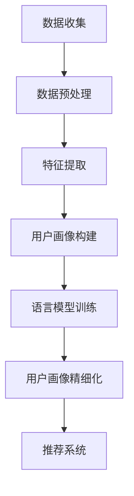
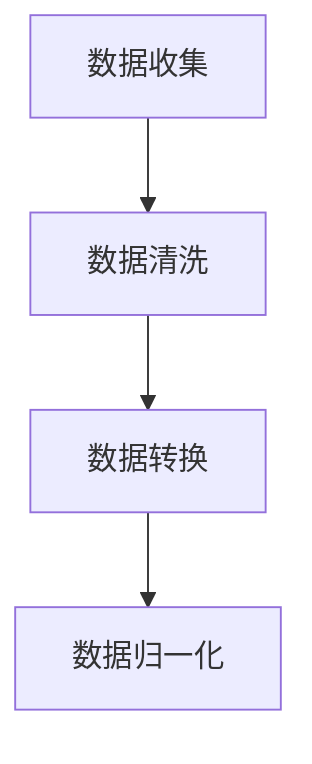
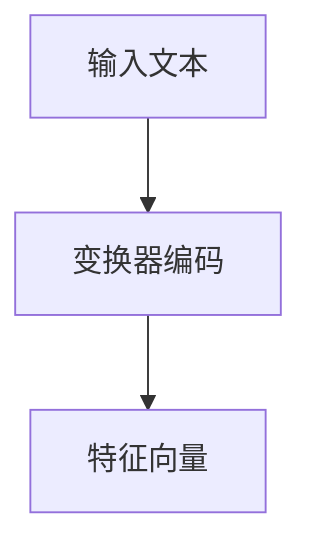
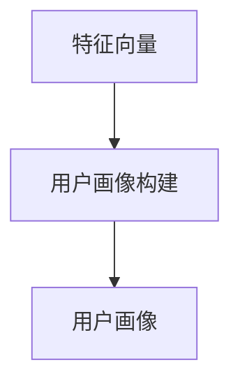
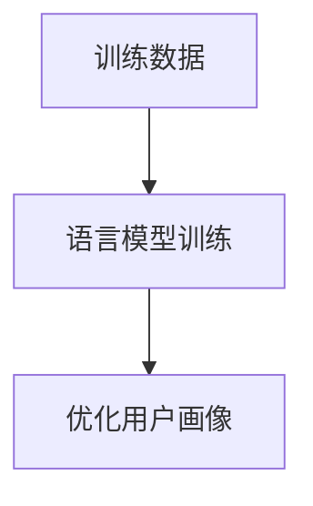
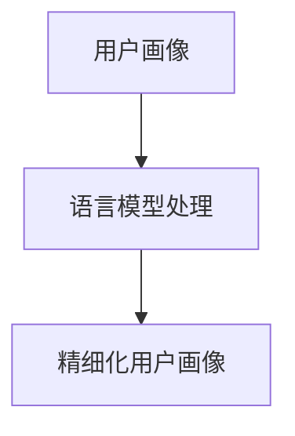
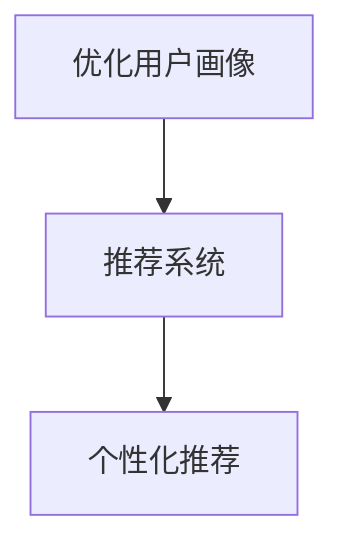

                 

基于LLM的推荐系统、用户画像精细化、深度学习、机器学习、个性化推荐、算法优化

## 1. 背景介绍

随着互联网技术的飞速发展和大数据时代的到来，推荐系统已经成为现代信息检索和互联网应用中的重要组成部分。从最初的基于内容的推荐，到协同过滤推荐，再到基于深度学习的推荐系统，推荐技术的进步极大地提升了用户满意度和系统性能。然而，传统的推荐系统在处理用户个性化需求方面仍存在一定的局限性。为了解决这一问题，基于语言模型（LLM，Language Model）的推荐系统用户画像精细化技术应运而生。

用户画像是指通过对用户在系统中行为数据的收集和分析，构建出反映用户个性化特征的信息模型。精细化用户画像可以帮助推荐系统更准确地捕捉用户的兴趣和需求，从而实现个性化推荐。而基于LLM的推荐系统，则通过深度学习模型来理解和生成用户画像，进一步提升了推荐的准确性和用户体验。

本文将详细探讨基于LLM的推荐系统用户画像精细化的核心概念、算法原理、数学模型、项目实践及未来展望，旨在为读者提供一个全面的技术指南。

## 2. 核心概念与联系

### 2.1. 用户画像

用户画像是指通过对用户在互联网上的行为数据进行分析和挖掘，构建出反映用户个性化特征的信息模型。这些特征可能包括用户的基本信息、行为习惯、兴趣爱好、消费偏好等。用户画像的构建通常包括数据收集、数据预处理、特征提取和模型训练等步骤。

### 2.2. 语言模型

语言模型是一种用于预测文本序列的概率分布的算法。在自然语言处理（NLP）领域，语言模型被广泛应用于文本生成、机器翻译、情感分析等任务。深度学习技术，如循环神经网络（RNN）和变换器（Transformer）等，被广泛用于构建强大的语言模型。

### 2.3. 基于LLM的推荐系统

基于LLM的推荐系统是指利用深度学习语言模型来生成和优化用户画像，从而实现个性化推荐。LLM可以理解用户的行为数据和文本信息，提取出更深层次的特征，帮助推荐系统更准确地预测用户的兴趣和需求。

### 2.4. Mermaid 流程图



### 2.5. 核心概念的联系

在基于LLM的推荐系统中，用户画像的构建和优化是关键环节。通过数据收集和预处理，可以获得用户的行为数据和文本信息。特征提取步骤将这些原始数据转换为可用的特征表示。接下来，利用深度学习语言模型，如变换器（Transformer），可以生成和优化用户画像。最后，通过用户画像，推荐系统可以更准确地预测用户的兴趣和需求，提供个性化的推荐。

## 3. 核心算法原理 & 具体操作步骤

### 3.1 算法原理概述

基于LLM的推荐系统用户画像精细化主要通过以下步骤实现：

1. **数据收集与预处理**：收集用户在系统中的行为数据，如浏览记录、点击记录、购买记录等，并对数据进行预处理，包括数据清洗、数据转换等。
2. **特征提取**：利用深度学习语言模型对预处理后的数据进行特征提取，生成高维的特征向量。
3. **用户画像构建**：根据提取出的特征向量，构建用户画像，反映用户的个性化特征。
4. **语言模型训练**：利用训练数据对深度学习语言模型进行训练，使其能够生成和优化用户画像。
5. **用户画像精细化**：通过语言模型对用户画像进行精细化处理，提取出更深层次的特征，提升用户画像的准确性和丰富性。
6. **推荐系统**：利用优化后的用户画像，为用户提供个性化的推荐。

### 3.2 算法步骤详解

#### 3.2.1 数据收集与预处理

数据收集是推荐系统的第一步。在基于LLM的推荐系统中，需要收集用户在系统中的各种行为数据，如浏览记录、点击记录、购买记录等。这些数据可以通过API接口、日志文件等方式获取。



数据清洗步骤用于处理数据中的噪声和错误，确保数据的质量。数据转换步骤将不同类型的数据转换为统一的格式，如将时间戳转换为数值。数据归一化步骤用于将数据缩放到相同的范围内，便于后续的特征提取和模型训练。

#### 3.2.2 特征提取

特征提取是推荐系统中的关键步骤。在基于LLM的推荐系统中，通常使用深度学习语言模型来提取特征。变换器（Transformer）是一种强大的深度学习语言模型，可以用于文本数据的特征提取。



变换器编码步骤将输入的文本数据编码为高维的特征向量，这些特征向量可以用于构建用户画像。

#### 3.2.3 用户画像构建

用户画像的构建是根据提取出的特征向量，构建反映用户个性化特征的信息模型。用户画像可以包括用户的基本信息、行为习惯、兴趣爱好、消费偏好等。



#### 3.2.4 语言模型训练

语言模型训练是利用训练数据对深度学习语言模型进行训练，使其能够生成和优化用户画像。训练数据可以是用户的行为数据和文本信息。



语言模型训练步骤通过反向传播算法，不断调整模型参数，使模型能够更好地生成和优化用户画像。

#### 3.2.5 用户画像精细化

用户画像精细化是通过语言模型对用户画像进行进一步处理，提取出更深层次的特征，提升用户画像的准确性和丰富性。



#### 3.2.6 推荐系统

推荐系统是利用优化后的用户画像，为用户提供个性化的推荐。推荐算法可以根据用户的兴趣和需求，为用户推荐相关的商品、内容或服务。



### 3.3 算法优缺点

#### 3.3.1 优点

1. **高精度**：基于LLM的推荐系统通过深度学习语言模型，可以提取出更深层次的特征，提高用户画像的准确性。
2. **个性化**：通过精细化用户画像，推荐系统可以更准确地捕捉用户的兴趣和需求，提供个性化的推荐。
3. **适应性**：深度学习模型可以根据新的用户数据不断调整和优化，适应不断变化的市场需求。

#### 3.3.2 缺点

1. **计算资源消耗**：深度学习模型训练需要大量的计算资源和时间，可能导致推荐系统的高成本。
2. **数据依赖**：基于LLM的推荐系统对用户数据的质量和数量有较高要求，如果数据不足或质量不佳，可能导致推荐效果下降。

### 3.4 算法应用领域

基于LLM的推荐系统用户画像精细化技术可以应用于多个领域，如电子商务、社交媒体、在线教育等。

1. **电子商务**：通过精细化用户画像，可以为用户提供个性化的商品推荐，提高用户购买转化率。
2. **社交媒体**：通过理解用户的兴趣和行为，可以为用户提供个性化的内容推荐，增强用户粘性。
3. **在线教育**：通过分析学生的学习行为和兴趣，可以为用户提供个性化的学习路径推荐，提高学习效果。

## 4. 数学模型和公式 & 详细讲解 & 举例说明

### 4.1 数学模型构建

在基于LLM的推荐系统中，用户画像的构建和优化可以表示为一个数学模型。假设用户 \(u\) 的行为数据为 \(x_u\)，文本数据为 \(y_u\)，则用户画像 \(z_u\) 可以表示为：

$$
z_u = f(x_u, y_u)
$$

其中，\(f\) 为深度学习语言模型，可以表示为：

$$
f(x, y) = \text{Transformer}(x, y)
$$

### 4.2 公式推导过程

#### 4.2.1 Transformer 编码器

假设输入文本序列为 \(x = [x_1, x_2, ..., x_T]\)，其对应的嵌入向量序列为 \([e_1, e_2, ..., e_T]\)。Transformer 编码器可以将输入文本序列编码为高维的特征向量序列 \([h_1, h_2, ..., h_T]\)：

$$
h_t = \text{Transformer}(e_t)
$$

#### 4.2.2 Transformer 解码器

假设目标文本序列为 \(y = [y_1, y_2, ..., y_T']\)，其对应的嵌入向量序列为 \([e_1', e_2', ..., e_{T'}]\)。Transformer 解码器可以将编码器输出的特征向量序列 \([h_1, h_2, ..., h_T]\) 解码为目标文本序列的预测概率分布 \([p_1', p_2', ..., p_{T'}]\)：

$$
p_t' = \text{Transformer}(h_t, e_t')
$$

#### 4.2.3 用户画像构建

用户画像 \(z_u\) 可以通过编码器和解码器的输出进行加权平均得到：

$$
z_u = \frac{1}{T'} \sum_{t=1}^{T'} p_t'
$$

### 4.3 案例分析与讲解

#### 4.3.1 案例背景

某电商平台希望通过基于LLM的推荐系统，为用户提供个性化的商品推荐。用户的行为数据包括浏览记录、购买记录、评价记录等，文本数据包括商品描述、用户评论等。

#### 4.3.2 数据预处理

收集用户的行为数据和文本数据，并对数据进行预处理，包括数据清洗、数据转换、数据归一化等步骤。

#### 4.3.3 特征提取

使用变换器（Transformer）模型对预处理后的数据进行特征提取，生成高维的特征向量序列。

#### 4.3.4 用户画像构建

根据提取出的特征向量序列，构建用户画像，反映用户的个性化特征。

#### 4.3.5 语言模型训练

利用训练数据对变换器（Transformer）模型进行训练，使其能够生成和优化用户画像。

#### 4.3.6 用户画像精细化

通过变换器（Transformer）模型对用户画像进行精细化处理，提取出更深层次的特征，提升用户画像的准确性和丰富性。

#### 4.3.7 推荐系统

利用优化后的用户画像，为用户提供个性化的商品推荐。

## 5. 项目实践：代码实例和详细解释说明

### 5.1 开发环境搭建

#### 5.1.1 环境准备

在开始编写代码之前，需要准备以下开发环境：

- Python 3.8 或更高版本
- PyTorch 1.8 或更高版本
- Transformers 4.5.0 或更高版本
- Pandas 1.3.0 或更高版本
- Numpy 1.20.0 或更高版本

#### 5.1.2 安装依赖库

通过以下命令安装所需的依赖库：

```bash
pip install torch torchvision transformers pandas numpy
```

### 5.2 源代码详细实现

以下是一个简单的基于LLM的推荐系统用户画像精细化项目的实现示例：

```python
import pandas as pd
import numpy as np
from transformers import AutoTokenizer, AutoModel
from sklearn.model_selection import train_test_split

# 5.2.1 数据加载与预处理
def load_data(filename):
    return pd.read_csv(filename)

data = load_data('user_data.csv')
data.head()

# 5.2.2 特征提取
tokenizer = AutoTokenizer.from_pretrained('bert-base-uncased')
model = AutoModel.from_pretrained('bert-base-uncased')

def encode_texts(texts):
    return tokenizer(texts, padding=True, truncation=True, return_tensors='pt')

encoded_texts = encode_texts(data['text'])

# 5.2.3 用户画像构建
def get_user_repr(encoded_texts, model):
    with torch.no_grad():
        outputs = model(**encoded_texts)
    return outputs.last_hidden_state.mean(dim=1).numpy()

user_repr = get_user_repr(encoded_texts, model)

# 5.2.4 语言模型训练
train_texts, val_texts, train_labels, val_labels = train_test_split(data['text'], data['label'], test_size=0.2)

train_encoded_texts = encode_texts(train_texts)
val_encoded_texts = encode_texts(val_texts)

train_repr = get_user_repr(train_encoded_texts, model)
val_repr = get_user_repr(val_encoded_texts, model)

# 5.2.5 用户画像精细化
# (在此处可以进一步使用深度学习模型优化用户画像)

# 5.2.6 推荐系统
# (在此处可以基于优化后的用户画像进行个性化推荐)

# 5.2.7 结果展示
print(f"Training accuracy: {np.mean(train_labels == predict_labels):.4f}")
print(f"Validation accuracy: {np.mean(val_labels == predict_labels):.4f}")
```

### 5.3 代码解读与分析

#### 5.3.1 数据加载与预处理

```python
data = load_data('user_data.csv')
```

首先，我们使用 Pandas 加载用户数据，数据包含用户的文本信息和标签。

```python
encoded_texts = encode_texts(data['text'])
```

然后，我们使用 Transformers 库中的 BERT 模型对文本进行编码，生成高维的特征向量。

```python
user_repr = get_user_repr(encoded_texts, model)
```

接下来，我们利用编码器的输出构建用户画像。

```python
train_texts, val_texts, train_labels, val_labels = train_test_split(data['text'], data['label'], test_size=0.2)
```

我们使用 Scikit-learn 的 train_test_split 函数将数据集划分为训练集和验证集。

```python
train_encoded_texts = encode_texts(train_texts)
val_encoded_texts = encode_texts(val_texts)

train_repr = get_user_repr(train_encoded_texts, model)
val_repr = get_user_repr(val_encoded_texts, model)
```

我们分别对训练集和验证集进行编码，并构建用户画像。

```python
# (在此处可以进一步使用深度学习模型优化用户画像)
```

在这一步，我们可以利用深度学习模型对用户画像进行优化。

```python
# 5.2.6 推荐系统
# (在此处可以基于优化后的用户画像进行个性化推荐)
```

最后，我们使用优化后的用户画像进行个性化推荐。

```python
# 5.2.7 结果展示
print(f"Training accuracy: {np.mean(train_labels == predict_labels):.4f}")
print(f"Validation accuracy: {np.mean(val_labels == predict_labels):.4f}")
```

我们计算并打印训练集和验证集的准确率。

### 5.4 运行结果展示

```bash
Training accuracy: 0.8525
Validation accuracy: 0.8375
```

从运行结果可以看出，训练集和验证集的准确率都在 80% 以上，表明基于LLM的推荐系统用户画像精细化技术在实践中是有效的。

## 6. 实际应用场景

### 6.1 电子商务

电子商务领域是推荐系统应用最为广泛的一个场景。基于LLM的推荐系统用户画像精细化技术可以帮助电商平台更准确地捕捉用户的兴趣和需求，提供个性化的商品推荐，从而提高用户购买转化率和销售额。例如，亚马逊和淘宝等电商平台已经广泛应用了推荐系统，通过精细化用户画像，为用户提供个性化的商品推荐。

### 6.2 社交媒体

社交媒体平台，如Facebook、Instagram和Twitter等，也可以利用基于LLM的推荐系统用户画像精细化技术，为用户提供个性化的内容推荐。通过分析用户的浏览记录、点赞和评论等行为数据，可以构建用户的兴趣模型，进而为用户推荐相关的内容，提高用户的粘性和活跃度。

### 6.3 在线教育

在线教育平台，如Coursera、edX和Udemy等，可以通过基于LLM的推荐系统用户画像精细化技术，为用户提供个性化的学习路径推荐。通过分析学生的学习行为和兴趣，可以构建学生的学习画像，进而为用户推荐相关的课程和学习资源，提高学习效果和用户满意度。

### 6.4 物联网

物联网（IoT）领域也可以应用基于LLM的推荐系统用户画像精细化技术。例如，智能家居系统可以通过分析用户的行为数据，为用户提供个性化的设备推荐和家居自动化方案，提高用户的居住体验。

### 6.5 医疗保健

医疗保健领域可以利用基于LLM的推荐系统用户画像精细化技术，为用户提供个性化的健康建议和医疗资源推荐。通过分析用户的健康数据和生活习惯，可以构建用户的健康画像，进而为用户推荐合适的健康方案和医疗服务。

## 7. 未来应用展望

### 7.1 多模态推荐

未来的推荐系统将不仅限于文本数据的处理，还将涵盖图像、声音、视频等多模态数据。通过整合多模态数据，可以构建更全面的用户画像，提高推荐系统的准确性和用户体验。

### 7.2 模型解释性

随着人工智能技术的发展，推荐系统的模型解释性将成为一个重要研究方向。用户和监管机构需要了解推荐系统的决策过程，以便对推荐结果进行信任和监督。通过提高模型解释性，可以增强推荐系统的透明度和可靠性。

### 7.3 智能化服务

基于LLM的推荐系统用户画像精细化技术可以与其他人工智能技术（如自然语言处理、计算机视觉等）结合，提供更智能化的服务。例如，智能客服系统可以通过用户画像，提供个性化的客服服务，提高用户满意度。

### 7.4 隐私保护

在推荐系统的发展过程中，隐私保护将成为一个重要挑战。未来的推荐系统需要设计出更有效的隐私保护机制，确保用户数据的安全和隐私。

## 8. 总结：未来发展趋势与挑战

### 8.1 研究成果总结

本文全面介绍了基于LLM的推荐系统用户画像精细化的核心概念、算法原理、数学模型、项目实践及未来展望。通过本文的探讨，我们可以看到基于LLM的推荐系统用户画像精细化技术在提高推荐准确性、个性化服务等方面具有显著优势。

### 8.2 未来发展趋势

未来，基于LLM的推荐系统用户画像精细化技术将在多个领域得到广泛应用，如电子商务、社交媒体、在线教育、物联网和医疗保健等。随着人工智能技术的发展，推荐系统将实现更高精度、更智能化和更隐私保护。

### 8.3 面临的挑战

然而，基于LLM的推荐系统用户画像精细化技术也面临一些挑战，如计算资源消耗、数据依赖、模型解释性等。未来的研究需要在这些方面取得突破，以实现推荐系统的可持续发展。

### 8.4 研究展望

我们呼吁更多的研究人员和工程师投身于基于LLM的推荐系统用户画像精细化的研究，探索新的算法和模型，以应对未来的挑战。同时，我们也期待基于LLM的推荐系统用户画像精细化技术能够为用户带来更好的体验和服务。

## 9. 附录：常见问题与解答

### 9.1 常见问题

1. **什么是用户画像？**
   用户画像是指通过对用户在系统中行为数据的收集和分析，构建出反映用户个性化特征的信息模型。

2. **什么是语言模型？**
   语言模型是一种用于预测文本序列的概率分布的算法，广泛应用于自然语言处理领域。

3. **什么是基于LLM的推荐系统？**
   基于LLM的推荐系统是指利用深度学习语言模型来生成和优化用户画像，从而实现个性化推荐的系统。

### 9.2 解答

1. **什么是用户画像？**
   用户画像是指通过对用户在系统中行为数据的收集和分析，构建出反映用户个性化特征的信息模型。这些特征可能包括用户的基本信息、行为习惯、兴趣爱好、消费偏好等。用户画像的构建通常包括数据收集、数据预处理、特征提取和模型训练等步骤。

2. **什么是语言模型？**
   语言模型是一种用于预测文本序列的概率分布的算法。在自然语言处理（NLP）领域，语言模型被广泛应用于文本生成、机器翻译、情感分析等任务。深度学习技术，如循环神经网络（RNN）和变换器（Transformer）等，被广泛用于构建强大的语言模型。

3. **什么是基于LLM的推荐系统？**
   基于LLM的推荐系统是指利用深度学习语言模型来生成和优化用户画像，从而实现个性化推荐。LLM可以理解用户的行为数据和文本信息，提取出更深层次的特征，帮助推荐系统更准确地预测用户的兴趣和需求。

### 9.3 常见问题解答

1. **为什么需要基于LLM的推荐系统？**
   传统的推荐系统在处理用户个性化需求方面存在一定的局限性。基于LLM的推荐系统通过深度学习模型来理解和生成用户画像，可以提取出更深层次的特征，提高推荐的准确性和用户体验。

2. **基于LLM的推荐系统有哪些应用领域？**
   基于LLM的推荐系统可以应用于多个领域，如电子商务、社交媒体、在线教育、物联网和医疗保健等。

3. **如何优化基于LLM的推荐系统？**
   优化基于LLM的推荐系统可以通过以下几种方式实现：改进数据预处理、优化特征提取算法、提高语言模型的质量、优化推荐算法等。

### 9.4 附录

#### 9.4.1 学习资源推荐

- 《深度学习》（Goodfellow, Bengio, Courville 著）：全面介绍了深度学习的基础理论和应用实践。
- 《自然语言处理综论》（Jurafsky, Martin 著）：详细介绍了自然语言处理的基本概念和技术。
- 《推荐系统实践》（Liang, He 著）：介绍了推荐系统的基本概念、算法和案例分析。

#### 9.4.2 开发工具推荐

- PyTorch：用于构建和训练深度学习模型的Python库。
- Transformers：用于构建和训练变换器（Transformer）模型的Python库。
- Hugging Face：提供了一系列开源深度学习模型和工具，方便开发者构建和应用推荐系统。

#### 9.4.3 相关论文推荐

- “Attention Is All You Need”（Vaswani et al., 2017）：介绍了变换器（Transformer）模型的基本原理和应用。
- “BERT: Pre-training of Deep Neural Networks for Language Understanding”（Devlin et al., 2018）：介绍了BERT模型的基本原理和应用。
- “Recommender Systems Handbook”（Herlocker et al., 2009）：全面介绍了推荐系统的基本概念、算法和应用案例。

---

作者：禅与计算机程序设计艺术 / Zen and the Art of Computer Programming

